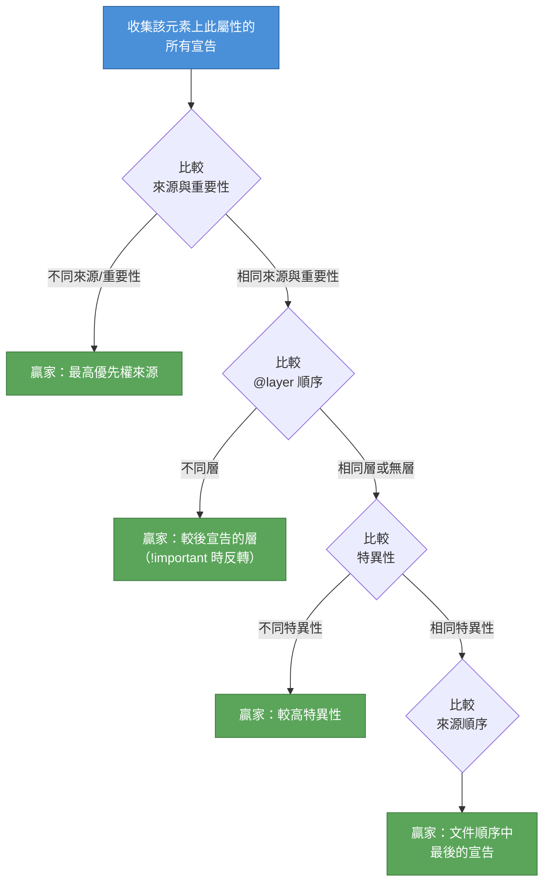

# [FEE-201] 層疊、優先級與繼承

:::info
CSS 透過多層演算法解決衝突的樣式宣告：來源（origin）、重要性（importance）、層疊層（cascade layers）、特異性（specificity）、以及來源順序（source order）。理解這套演算法是實現可預測樣式的最關鍵一步。你應該（SHOULD）使用 `@layer` 來組織樣式表的優先順序。你應該（SHOULD）在重置與基礎樣式中優先使用 `:where()` 以取得零特異性。
:::

## 背景

每個 HTML 元素可以同時從多個來源接收樣式宣告：瀏覽器內建樣式表、使用者偏好（無障礙設定、閱讀模式）、第三方函式庫、設計系統 token、元件作用域規則、以及工具類別覆寫。當兩個以上的宣告針對同一元素的同一屬性時，瀏覽器必須精確挑選出唯一的贏家。

**層疊（cascade）** 就是做出這個決定的演算法。它不是單一規則 -- 而是一套多步驟的排序程序，定義於 W3C CSS Cascading and Inheritance Level 5 規範中。對任何步驟的誤解都會導致前端工程師熟知的症狀：樣式「不生效」、特異性軍備競賽、散落各處的 `!important` 旗標、以及只有在特定載入順序下才能正常運作的 CSS。

本文說明層疊的每個步驟、特異性的計算方式、哪些屬性會繼承而哪些不會，以及現代功能 -- `@layer`、`:where()`、`:is()` -- 如何為開發者提供管理複雜度的新工具。

## 設計思維

### 為什麼層疊存在

Web 的設計讓多方共同為單一文件貢獻樣式。Hakon Wium Lie 在 1994 年的原始提案描述了一套「層疊」樣式表系統，其中沒有任何單一來源擁有絕對控制權。這種設計服務於幾個目的：

1. **瀏覽器預設必須存在。** 沒有使用者代理樣式表，`<h1>` 的外觀會與 `<span>` 完全相同。瀏覽器提供合理的預設值，讓作者在其基礎上建構而非從零替換。

2. **使用者需要覆寫權力。** 無障礙功能如強制色彩模式（forced-colors mode）、最小字型大小、高對比主題等，都要求使用者偏好在特定情況下能凌駕作者樣式。

3. **函式庫與作者程式碼必須共存。** 一個專案可能匯入 normalize.css、元件函式庫、設計系統 token 層、以及應用程式特定樣式。層疊提供確定性的演算法來解決所有這些之間的衝突。

4. **漸進增強成為可能。** 因為層疊是合併樣式而非批次替換，添加新樣式表不需要重寫現有的樣式表。

### 框架如何繞過或擁抱層疊

不同的 CSS 策略以不同方式處理層疊的複雜度：

| 策略 | 機制 | 與層疊的關係 |
|------|------|-------------|
| **CSS Modules** | 在建置時產生唯一類別名稱（例如 `.Button_root_x7k2`） | 透過讓選擇器全域唯一來避免衝突 -- 特異性始終是 `(0,1,0)`。 |
| **Tailwind CSS** | 直接在標記中使用扁平工具類別 | 所有工具類別共享大致相等的特異性 `(0,1,0)`。產生的樣式表中的來源順序決定贏家。 |
| **Vue scoped styles** | 為元素和選擇器添加 `data-v-xxxx` 屬性 | 每個作用域層級增加一個屬性選擇器的特異性 `(0,1,0)`。 |
| **Shadow DOM** | 硬性樣式封裝；外部樣式無法穿透 | 完全繞過層疊邊界。只有可繼承的屬性能跨越 shadow 邊界。 |
| **CSS-in-JS**（styled-components、Emotion） | 在執行期產生唯一類別名稱 | 與 CSS Modules 類似 -- 透過唯一性而非層疊管理來避免衝突。 |
| **`@layer`** | CSS 原生的層疊順序控制 | 直接擁抱層疊。層的順序在特異性被考慮之前就決定了優先權。 |

關鍵洞見：大多數框架策略是*繞過*層疊來運作，因為開發者在歷史上缺乏*配合*層疊運作的工具。`@layer` 是 CSS 原生對特異性軍備競賽的解答 -- 它讓你宣告明確的優先權層級，而不需要放棄層疊模型。

### 何時使用 @layer

當你需要跨樣式類別的可預測優先權時，就使用 `@layer`：

```css
/* 預先宣告層的順序 -- 先宣告的 = 最低優先權 */
@layer reset, base, components, utilities;
```

這單行程式碼保證：工具類別樣式永遠贏過元件樣式、元件樣式永遠贏過基礎樣式、基礎樣式永遠贏過重置 -- 無論每個層內的選擇器特異性為何。

## 原理

### 層疊演算法

層疊透過嚴格的條件序列來解決衝突的宣告。瀏覽器依序評估每個條件；一旦找到贏家，後續條件不再被諮詢。



### 步驟一：來源與重要性

CSS 定義三個來源。對於**一般**（非 `!important`）宣告，優先權從低到高為：

1. **使用者代理（User-agent）** -- 瀏覽器預設樣式
2. **使用者（User）** -- 讀者/無障礙覆寫
3. **作者（Author）** -- 你的樣式表

對於 **`!important`** 宣告，此順序**反轉**：

1. 作者 `!important`（在重要宣告中最低）
2. 使用者 `!important`
3. 使用者代理 `!important`（最高）

這種反轉是刻意的：它確保與無障礙相關的使用者偏好和瀏覽器保護措施不會被作者的 `!important` 宣告覆寫。CSS transitions 和 animations 在層疊中也有特殊位置 -- transitions 位於最頂端，而 animations 覆寫一般宣告但輸給 `!important`。

### 步驟二：層疊層（@layer）

在相同的來源和重要性層級內，層疊層提供下一個排序條件。層的順序由它們在樣式表中首次出現的位置決定：

```css
@layer reset, base, components, utilities;

@layer reset {
  *, *::before, *::after { box-sizing: border-box; margin: 0; }
}

@layer utilities {
  .sr-only { /* 僅螢幕閱讀器可見 */
    position: absolute;
    width: 1px;
    height: 1px;
    overflow: hidden;
    clip-path: inset(50%);
  }
}
```

對於**一般**宣告：較後的層贏。未分層的樣式（不在任何 `@layer` 內的）位於所有層之上，贏過任何已分層的樣式。

對於 **`!important`** 宣告：順序反轉。較早的層贏，而未分層的 `!important` 在同一來源的重要宣告中優先權**最低**。這種反轉與來源的反轉對稱 -- 它讓「防禦性」的層（如重置）能夠保護其 `!important` 規則。

**將第三方 CSS 匯入層中：**

```css
@import url("normalize.css") layer(reset);
@import url("design-system.css") layer(base);

@layer reset, base, components, utilities;
```

這確保第三方樣式永遠不會意外地凌駕你的元件或工具類別規則，無論它們內部的特異性為何。

### 步驟三：特異性

當來源、重要性和層都相同時，瀏覽器比較**特異性（specificity）**。特異性是從選擇器計算出的三欄位權重：

| 欄位 | 計算 | 範例 |
|------|------|------|
| **ID**（a） | ID 選擇器的數量 | `#nav`、`#main-header` |
| **Class**（b） | 類別、屬性選擇器、虛擬類別 | `.active`、`[type="text"]`、`:hover`、`:nth-child(2)` |
| **Type**（c） | 元素選擇器、虛擬元素 | `div`、`p`、`::before`、`::after` |

通用選擇器 `*`、組合器（`+`、`>`、`~`、` `）、以及 `:where()` 對特異性**沒有任何貢獻**。

比較是逐欄從左到右進行的：

```
(1,0,0)  >  (0,9,9)   -- 一個 ID 永遠贏過任何數量的類別
(0,2,0)  >  (0,1,9)   -- 兩個類別贏過一個類別加任何數量的型別
(0,1,1)  =  (0,1,1)   -- 平手：進入來源順序比較
```

### 步驟四：來源順序

當所有先前的條件都產生平手時，文件順序中**最後的**宣告贏。樣式表依其 `<link>` 或 `@import` 的順序排列，而在單一樣式表中，較後的規則覆寫較早的。

### 行內樣式

行內樣式（`style="..."` 屬性）在概念上位於所有作者一般宣告之上的獨立層中。只有 `!important` 規則或更高來源的樣式能覆寫它們。

### 虛擬類別函式的特異性

兩個虛擬類別函式有特殊的特異性行為，理解它們至關重要：

**`:where()`** -- 永遠是零特異性 `(0,0,0)`：

```css
:where(#sidebar, .widget, footer) a {
  color: blue;
  /* 特異性：(0,0,1) -- 只有 `a` 型別選擇器被計算 */
}
```

**`:is()`** -- 等於其最高特異性引數的特異性：

```css
:is(#sidebar, .widget, footer) a {
  color: red;
  /* 特異性：(1,0,1) -- #sidebar 貢獻 (1,0,0) + a 貢獻 (0,0,1) */
}
```

**`:not()` 和 `:has()`** 也取其最高特異性引數的特異性，與 `:is()` 相同。

### 繼承

並非每個 CSS 屬性都會為每個元素參與層疊。當元素沒有任何來源的宣告針對某個屬性時，瀏覽器仍必須賦予一個值。它透過**繼承（inheritance）**或**初始值（initial values）**來達成：

- **可繼承的屬性**接收父元素的計算值。這些通常是文字相關的：`color`、`font-family`、`font-size`、`line-height`、`text-align`、`visibility`、`cursor`、`list-style` 等。

- **不可繼承的屬性**接收該屬性定義的初始值。盒模型和排版屬性通常不繼承：`margin`、`padding`、`border`、`width`、`height`、`display`、`position`、`background`、`overflow`。

### 明確的預設關鍵字

CSS 提供五個關鍵字來手動控制繼承和預設行為：

| 關鍵字 | 行為 |
|--------|------|
| `inherit` | 使用父元素的計算值，即使是不可繼承的屬性。 |
| `initial` | 使用該屬性在規範中定義的初始值（不是瀏覽器預設值）。 |
| `unset` | 對可繼承的屬性相當於 `inherit`，對不可繼承的相當於 `initial`。 |
| `revert` | 回退到前一個來源的值（例如從作者回退到使用者代理）。 |
| `revert-layer` | 回退到前一個層疊層的值。 |

`revert` 對元件重置特別有用 -- 它恢復瀏覽器預設值而不需要你知道那些預設值是什麼。`revert-layer` 是層感知的等效物，對 `@layer` 架構至關重要。

## 圖解

以下圖表展示從最低到最高的完整層疊優先權：

```
 最低優先權                                                 最高優先權
 +------------------------------------------------------------------+
 |                                                                  |
 |  一般宣告（NORMAL）                                                |
 |  +-----------+  +---------+  +--------+  +------------+         |
 |  | UA 樣式   |  | 使用者  |  | 作者   |  | 作者       |         |
 |  |（瀏覽器） |  |  樣式   |  |  層    |  | 未分層     |         |
 |  +-----------+  +---------+  |（第一  |  +------------+         |
 |                               |  ...   |  +--------+            |
 |                               | 最後） |  | 行內   |            |
 |                               +--------+  +--------+            |
 |                                                                  |
 |  !IMPORTANT 宣告（反轉）                                          |
 |  +------------+  +--------+  +---------+  +-----------+         |
 |  | 作者       |  | 作者   |  | 使用者  |  | UA 樣式   |         |
 |  | 未分層     |  |  層    |  | !imp    |  | !important|         |
 |  | !important |  |（最後  |  +---------+  +-----------+         |
 |  +------------+  |  ...   |                                      |
 |                   | 第一） |                                      |
 |                   +--------+                                      |
 |                                                                  |
 +------------------------------------------------------------------+
```

## 範例

### 1. 競爭選擇器的特異性計算

```css
/* 選擇器 A：特異性 (1, 0, 1) */
#content p {
  color: blue;
}

/* 選擇器 B：特異性 (0, 2, 1) */
.main .intro p {
  color: green;
}

/* 選擇器 C：特異性 (0, 1, 3) */
section div.content p {
  color: red;
}
```

**對一個同時匹配三者的 `<p>` 的贏家：** 選擇器 A，因為 ID 欄位（1）贏過任何數量的類別。比較如下：

```
A: (1, 0, 1)  -- 1 個 ID
B: (0, 2, 1)  -- 0 個 ID、2 個類別
C: (0, 1, 3)  -- 0 個 ID、1 個類別、3 個型別

A 贏。ID 欄位優先比較。
```

### 2. 使用 @layer 排序函式庫、元件與工具類別

```css
/* 1. 宣告層的順序 */
@layer reset, vendor, components, utilities;

/* 2. 將第三方函式庫匯入受控的層 */
@import url("some-ui-lib.css") layer(vendor);

/* 3. 重置層 -- 最低優先權 */
@layer reset {
  *,
  *::before,
  *::after {
    box-sizing: border-box;
    margin: 0;
    padding: 0;
  }
}

/* 4. 元件層 */
@layer components {
  .card {
    padding: 1rem;
    border: 1px solid #ddd;
    border-radius: 8px;
    background: white;
  }

  .card__title {
    font-size: 1.25rem;
    font-weight: 600;
  }
}

/* 5. 工具類別層 -- 已分層中最高優先權 */
@layer utilities {
  .mt-4 { margin-top: 1rem; }
  .hidden { display: none; }
  .text-center { text-align: center; }
}
```

即使 `some-ui-lib.css` 包含高特異性 `(1,1,0)` 的 `#app .card { padding: 2rem; }`，元件層的 `.card` 規則 `(0,1,0)` 仍然贏，因為 `components` 層宣告在 `vendor` 之後。特異性永遠不會跨層比較。

### 3. :where() 與 :is() 的差異

```css
/* 使用 :where() -- 特異性 (0, 0, 1) */
:where(.nav, #sidebar) a {
  color: steelblue;
  text-decoration: none;
}

/* 使用 :is() -- 特異性 (1, 0, 1)，因為 #sidebar 是最高特異性的引數 */
:is(.nav, #sidebar) a {
  color: darkred;
  text-decoration: underline;
}

/* 純型別選擇器 -- 特異性 (0, 0, 1) */
a {
  color: black;
}
```

**結果：**

- 對於 `#sidebar` 內的 `<a>`：`:is()` 規則以 `(1,0,1)` 贏。`:where()` 規則只有 `(0,0,1)` 並與純 `a` 規則平手 -- 來源順序打破平手。
- 對於 `.nav` 內但不在 `#sidebar` 內的 `<a>`：`:is()` 規則仍然以 `(1,0,1)` 贏，因為 `:is()` 始終使用最高特異性的引數，無論實際匹配的是哪一個。

**實務指引：** 使用 `:where()` 撰寫應該容易被覆寫的基礎/重置樣式。使用 `:is()` 當你需要選擇器分組的便利性但需要正常的特異性行為時。

## 常見錯誤

### 1. !important 升級螺旋

**錯誤做法：** 使用 `!important` 覆寫樣式，然後需要另一個 `!important` 來覆寫它，造成無法勝出的升級：

```css
/* 函式庫 */
.btn { color: blue !important; }

/* 你的覆寫 -- 也需要 !important */
.btn.primary { color: green !important; }

/* 再一次覆寫 -- 更多特異性 + !important */
#app .btn.primary { color: red !important; }
```

**修正方式：** 使用 `@layer` 控制優先權，不需要 `!important`：

```css
@import url("library.css") layer(vendor);

@layer vendor, app;

@layer app {
  .btn.primary { color: green; } /* 贏 -- app 層 > vendor 層 */
}
```

### 2. 過度限定選擇器

**錯誤做法：** 撰寫鏡射 DOM 樹的選擇器，產生脆弱的高特異性鏈：

```css
/* 特異性：(0, 1, 3) -- 脆弱，標記變更時會壞掉 */
nav.main ul li a { color: blue; }

/* 現在你需要更高的特異性來覆寫 */
nav.main ul li a:hover { color: red; }
```

**修正方式：** 使用扁平、有意義的類別名稱：

```css
/* 特異性：(0, 1, 0) -- 簡單、穩定、可覆寫 */
.nav-link { color: blue; }
.nav-link:hover { color: red; }
```

### 3. 混淆 :where() 和 :is() 的特異性

**錯誤做法：** 假設 `:is()` 像 `:where()` 一樣有零特異性，然後納悶為什麼覆寫失敗：

```css
/* 開發者以為這有低特異性 */
:is(#theme-dark) .heading { color: white; }

/* 這個覆寫失敗 -- 特異性是 (1, 1, 0)，不是 (0, 1, 0) */
.heading { color: black; }
```

**修正方式：** 記住：`:where()` = 零特異性，`:is()` = 最高引數。如果你要低特異性，明確使用 `:where()`。

### 4. 假設所有屬性都會繼承

**錯誤做法：** 期待 `padding`、`margin` 或 `border` 從父元素層疊到子元素：

```css
.container {
  padding: 2rem;
  color: navy;
}

.container p {
  /* color: navy 被繼承 -- 正確 */
  /* padding: 2rem 不會被繼承 -- p 取得其初始 padding（0） */
}
```

**修正方式：** 知道哪些屬性會繼承（主要是文字/字型屬性）、哪些不會（主要是盒模型/排版屬性）。當你需要不可繼承的屬性傳播時，明確使用 `inherit`：

```css
.child {
  border: inherit; /* 明確從父元素繼承 */
}
```

### 5. 透過增加特異性而非使用 @layer 來對抗框架樣式

**錯誤做法：** UI 函式庫套用 `.btn { padding: 12px 24px; }`。你用 `div.wrapper .btn { padding: 8px 16px; }` 覆寫，然後函式庫更新並加入 `.btn.btn-default { ... }`，再次凌駕你的覆寫。

**修正方式：** 將函式庫匯入一個層：

```css
@import url("ui-lib.css") layer(vendor);

@layer vendor, components;

@layer components {
  .btn { padding: 8px 16px; } /* 永遠贏過 vendor，無論特異性 */
}
```

## 相關 FEE

| FEE | 關聯 |
|-----|------|
| [FEE-200 CSS 與排版系統總覽](./200.md) | 父總覽。層疊是 CSS 類別中的第一個主題，因為所有其他 CSS 行為都依賴於理解樣式如何被解析。 |
| [FEE-205 CSS 架構與作用域策略](./205.md) | 架構策略（BEM、ITCSS、CSS Modules、scoped styles）都是對層疊複雜度的回應。`@layer` 提供 CSS 原生的替代方案。 |
| [FEE-207 CSS 自訂屬性與主題化](./207.md) | 自訂屬性（custom properties）預設會繼承且參與層疊。主題化系統依賴繼承在 DOM 樹中流動。 |

## 參考資料

- [W3C CSS Cascading and Inheritance Level 5](https://www.w3.org/TR/css-cascade-5/) -- 定義層疊演算法、來源、層、特異性與繼承的權威規範
- [MDN: Introducing the CSS Cascade](https://developer.mozilla.org/en-US/docs/Web/CSS/Cascade) -- 包含互動範例的層疊演算法綜合指南
- [MDN: Specificity](https://developer.mozilla.org/en-US/docs/Web/CSS/Specificity) -- 詳細的特異性計算規則、範例與特殊情況
- [MDN: @layer](https://developer.mozilla.org/en-US/docs/Web/CSS/@layer) -- 層疊層語法、排序與瀏覽器支援參考
- [Bramus Van Damme: The Future of CSS: Cascade Layers](https://www.bram.us/2021/09/15/the-future-of-css-cascade-layers-css-at-layer/) -- 深入探討層疊層、它們解決的問題、以及實際採用模式
