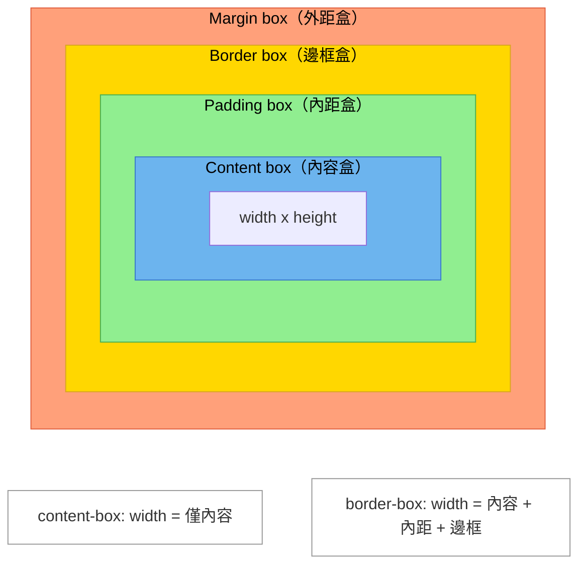

# [FEE-202] 盒模型與排版模式

:::info
網頁上的每個元素都是一個矩形盒子。CSS 定義了盒子的尺寸計算方式（盒模型 box model）、盒子之間的排列規則（排版模式 layout modes）、在 z 軸上的堆疊順序（堆疊上下文 stacking contexts），以及 `display` 屬性如何同時控制外部參與方式與內部排版演算法。你應該（SHOULD）透過全域重置使用 `border-box`。你應該（SHOULD）使用 `display: flow-root` 來建立區塊格式化上下文（BFC），而非依賴 `overflow: hidden`。
:::

## 背景

HTML 元素被渲染為矩形盒子。CSS 盒模型（box model）定義了每個盒子的四個區域 -- 內容（content）、內距（padding）、邊框（border）、外距（margin），而 `box-sizing` 屬性則決定 `width` 和 `height` 控制的是哪些區域。

但尺寸只是拼圖的一塊。盒子確定大小後，瀏覽器必須決定*在哪裡*放置它們。CSS 為此提供多種**排版模式**（也稱為格式化上下文 formatting contexts）：常規流（normal flow，包含區塊 block 與行內 inline）、浮動（floats）、定位（positioning：static、relative、absolute、fixed、sticky），以及現代排版演算法 flexbox 和 grid。每種模式都有各自的子元素排列規則。

在空間定位之上，CSS 還必須解決*分層*問題 -- 哪個元素繪製在哪個之上。這由**堆疊上下文（stacking contexts）**管理，它是一個獨立的層級結構，決定 z 軸的排序。

最後，`display` 屬性將一切串聯起來。歷史上以單一關鍵字撰寫（`block`、`inline-block`、`flex`），它實際上控制兩個獨立行為：元素的**外部**顯示類型（如何參與父元素的排版）和**內部**顯示類型（用哪種排版演算法處理子元素）。現代的雙值語法（two-value syntax）讓這一點變得明確。

本文涵蓋所有四個主題 -- 盒模型、排版模式、堆疊上下文、以及 display -- 作為一個完整的系統。

## 設計思維

### 為什麼 CSS 有多種排版模式

CSS 誕生於 1996 年，是一種為*文件*設計的樣式語言。原始的排版模型 -- **常規流（normal flow）** -- 是為文字設計的：區塊級元素像段落一樣垂直堆疊，行內級元素像句子中的文字一樣水平排列。這個模型非常適合文章、論文和報告。

當開發者需要更複雜的版面（側邊欄、多欄設計）時，唯一可用的工具是 **float**。`float` 原本是為了讓文字環繞圖片而設計的，不是用來做頁面版面的 -- 但它被勉強使用了超過十年。浮動佈局的時代（2000-2012）產生了脆弱、充滿 clearfix 的 CSS，難以維護。

**Flexbox**（CSS 彈性盒模型，2012 年）是第一個專為應用程式 UI 設計的排版演算法。它解決一維分佈問題：沿單一軸線對齊項目，並控制間距、換行和順序。**Grid**（CSS 格線佈局，2017 年）隨後作為二維排版系統出現，允許定義明確的列（row）和欄（column）軌道。

這個演進 -- 常規流用於文件、flexbox 用於一維元件排版、grid 用於二維頁面排版 -- 不是偶然的。每種模式都是為特定類別的問題而設計。在正確的問題上使用正確的排版模式，是核心的 CSS 技能。

### 框架如何抽象化排版

不同的 UI 框架以不同方式暴露排版概念，但最終都在建模相同的事物：

| 框架 | 排版抽象 | 底層模型 |
|------|---------|---------|
| **Web (CSS)** | `display`、`position`、`flex`、`grid` | 完整的 CSS 盒模型與多種排版模式 |
| **React Native (Yoga)** | `flexDirection`、`justifyContent`、`alignItems` | 僅 flexbox（無常規流、無 grid） |
| **Flutter** | `Column`、`Row`、`Stack`、`Constraints` | 基於約束（constraints）的明確 widget 組合 |
| **SwiftUI** | `VStack`、`HStack`、`ZStack` | 基於堆疊（垂直、水平、z 軸分層） |

React Native 選擇只使用 flexbox 很有啟示性：透過移除常規流和浮動的歷史包袱，它簡化了心智模型，但犧牲了靈活性。Flutter 和 SwiftUI 更進一步，用明確的容器 widget 取代 CSS 的隱式格式化上下文。理解 CSS 的排版模式有助於你推理任何這些系統 -- 它們都在用不同的取捨解決同一個問題（矩形盒子的空間排列）。

### 為什麼 border-box 應該是預設值

原始的 CSS 盒模型（`content-box`）將 `width` 和 `height` 定義為僅內容區域的大小。對一個 `width: 200px` 的元素加上 `padding: 20px` 和 `border: 2px solid`，總渲染寬度變成 244px（200 + 20*2 + 2*2）。這讓開發者困惑，因為宣告的 `width` 與可見寬度不符。

`border-box` 重新定義 `width` 和 `height` 為包含 padding 和 border。同一個元素使用 `box-sizing: border-box` 和 `width: 200px` 時，渲染寬度恰好是 200px，padding 和 border 從可用的內容空間中扣除。這符合設計師對尺寸的思考方式，也讓 `width: 100%` 在容器內的行為符合直覺。

W3C CSS Box Model Level 3 規範定義了兩種模型，但因歷史原因，網頁平台預設為 `content-box`。每個主要的 CSS 重置和框架都會全域覆寫此設定。

## 原理

### CSS 盒模型

每個元素產生一個由四個同心區域組成的盒子：

1. **內容區域（Content area）** -- 文字、圖片或子元素被渲染的地方。由 `width` 和 `height`（或固有內容大小）決定。
2. **內距（Padding）** -- 內容與邊框之間的透明空間。由 `padding` 及其個別屬性（`padding-top` 等）設定。
3. **邊框（Border）** -- 可見（或不可見）的邊界。由 `border` 及其個別屬性設定。
4. **外距（Margin）** -- 邊框外部的透明空間，將盒子與相鄰元素分隔。由 `margin` 及其個別屬性設定。外距可以為負值，且可以發生摺疊（collapsing）。

### box-sizing：content-box 與 border-box

| 屬性值 | `width` / `height` 控制的範圍 | 總渲染尺寸 |
|--------|-------------------------------|-----------|
| `content-box`（預設） | 僅內容區域 | content + padding + border |
| `border-box` | 內容 + 內距 + 邊框 | 恰好是宣告的 `width` / `height` |

建議的全域重置：

```css
*,
*::before,
*::after {
  box-sizing: border-box;
}
```

這確保每個元素 -- 包括虛擬元素 -- 在整個專案中都使用 `border-box` 尺寸計算。

### 常規流：區塊與行內格式化上下文

在常規流中，元素參與**區塊格式化上下文（BFC）**或**行內格式化上下文（IFC）**：

- **區塊級盒子**（由 `display: block`、`display: list-item` 等產生）垂直排列，一個接一個。每個區塊級盒子從新行開始，並延伸填滿可用寬度。
- **行內級盒子**（由 `display: inline`、`display: inline-block` 等產生）在行內水平排列，空間不足時換到下一行。

### 區塊格式化上下文（BFC）

BFC 是一個具有特定行為的獨立排版區域：

1. **相鄰兄弟元素的垂直外距會摺疊** -- 但外距不會跨越 BFC 邊界摺疊。
2. **浮動元素被包含**在其 BFC 中 -- BFC 的邊框盒會擴展以包圍任何浮動的子元素。
3. **BFC 內容不會與浮動重疊** -- BFC 盒子會放置在浮動元素旁邊而非後面。

**什麼會建立 BFC：**

| 機制 | 備註 |
|------|------|
| 根元素（`<html>`） | 永遠建立初始 BFC |
| `float: left` 或 `float: right` | 浮動的副作用 |
| `position: absolute` 或 `position: fixed` | 脫離常規流，建立自己的 BFC |
| `display: inline-block` | 經典技巧 |
| `overflow: hidden`、`auto` 或 `scroll` | 不是 `visible` 或 `clip` |
| `display: flow-root` | 專門為建立 BFC 而設計，無副作用 |
| `display: flex` 或 `display: grid` | Flex/grid 容器為其子元素建立 BFC |
| `contain: layout`、`paint` 或 `strict` | CSS Containment |

`display: flow-root` 是建立 BFC 的現代、語意化方式。它的引入正是為了取代 `overflow: hidden` 這個 hack，後者會裁切內容並產生意外的捲軸。

### 定位（Positioning）

`position` 屬性將元素從常規流中移除或調整其相對於常規流位置的偏移：

| 值 | 行為 | 包含區塊（Containing block） |
|----|------|---------------------------|
| `static` | 預設。元素在常規流中。`top`/`left` 等無效。 | 不適用 |
| `relative` | 元素留在常規流中但透過 `top`/`right`/`bottom`/`left` 視覺偏移。空間被保留。 | 自身（對絕對定位的後代而言） |
| `absolute` | 脫離常規流。相對於最近的已定位祖先（非 `static`）定位。 | 最近的 `position` 不是 `static` 的祖先 |
| `fixed` | 脫離常規流。相對於視窗（或最近有 `transform`、`perspective`、`filter` 的祖先）定位。 | 視窗（通常） |
| `sticky` | 混合型：常規流直到滾動閾值，然後在其滾動容器中表現如 `fixed`。 | 最近的捲動區域祖先 |

**包含區塊（containing blocks）**至關重要：`absolute` 元素相對於其包含區塊定位，即最近的 `position` 不是 `static` 的祖先。若不存在這樣的祖先，則回退到初始包含區塊（視窗）。任何祖先上的 `transform`、`perspective` 或 `filter` 也會為 `fixed` 和 `absolute` 後代建立包含區塊。

### 堆疊上下文（Stacking Contexts）

堆疊上下文決定 z 軸的繪製順序。堆疊上下文是一個原子單元：其所有子元素一起繪製，它們的 z-index 只與同一上下文中的兄弟競爭 -- 永遠不與不同堆疊上下文中的元素競爭。

**什麼會建立堆疊上下文：**

- 根元素（`<html>`）
- `position: relative` 或 `absolute` 且 `z-index` 不為 `auto`
- `position: fixed` 或 `sticky`（始終建立）
- `opacity` 小於 `1`
- `transform` 不為 `none`
- `filter` 不為 `none`
- `will-change` 指定任何會建立堆疊上下文的屬性
- `isolation: isolate`
- `mix-blend-mode` 不為 `normal`
- Flex 或 grid 子元素且 `z-index` 不為 `auto`
- `contain: layout` 或 `paint`
- `container-type: size` 或 `inline-size`

**堆疊上下文內的繪製順序**（從後到前）：

1. 堆疊上下文元素的背景和邊框
2. 負 `z-index` 的子堆疊上下文
3. 非定位的區塊級子元素（常規流）
4. 非定位的浮動元素
5. 行內級子元素（文字、行內盒子）
6. `z-index: auto` 或 `0` 的定位子元素
7. 正 `z-index` 的子堆疊上下文

### display 屬性：外部與內部

`display` 屬性控制兩件事：

1. **外部顯示類型（Outer display type）** -- 元素如何參與其父元素的排版（`block` 或 `inline`）。
2. **內部顯示類型（Inner display type）** -- 元素用哪種排版演算法處理子元素（`flow`、`flex`、`grid`、`table`、`ruby`）。

現代的雙值語法讓這一點變得明確：

| 傳統關鍵字 | 雙值等效 | 外部 | 內部 |
|-----------|---------|------|------|
| `block` | `block flow` | block | flow |
| `inline` | `inline flow` | inline | flow |
| `inline-block` | `inline flow-root` | inline | flow-root |
| `flex` | `block flex` | block | flex |
| `inline-flex` | `inline flex` | inline | flex |
| `grid` | `block grid` | block | grid |
| `inline-grid` | `inline grid` | inline | grid |

理解這種分解可以消除對複合值的困惑。`inline-flex` 不是一種特殊的排版模式 -- 它只是 `inline` 外部類型加上 `flex` 內部類型：元素參與行內流，但使用 flexbox 排列其子元素。

## 最佳實踐

**永遠套用全域 border-box 重置。** 每個專案都應該（SHOULD）將 `*, *::before, *::after { box-sizing: border-box; }` 作為第一條 CSS 規則。若沒有這條規則，`width: 100%` 加上任何 padding 都會導致容器溢出，每一次尺寸計算都變成腦力負擔。所有主流 reset（Normalize、Tailwind preflight、Bootstrap reboot）都這麼做，理由正是如此。

**將 margin collapse 視為功能而非 bug，但要知道何時退出。** 相鄰垂直外距的摺疊是 CSS 的刻意設計，讓文件段落間距保持一致。在文件式排版中（文章段落、標題）應該（SHOULD）善用它。需要父元素背景視覺上包裹子元素外距、或需要退出父子摺疊時，應該（SHOULD）在容器上使用 `display: flow-root`。避免（AVOID）以 flex/grid 的 `gap` 作為規避 margin collapse 的手段 — 使用 `gap` 的前提應是 flex/grid 本就是正確的排版模式。

**優先使用邏輯屬性，讓 i18n 間距更健壯。** 應該（SHOULD）使用 `margin-inline`、`padding-block`、`border-inline-end` 等邏輯屬性，而非 `margin-left`、`padding-top` 等物理屬性。邏輯屬性會自動遵循 writing-mode 和 direction，使相同的 CSS 在從右到左的語言（阿拉伯文、希伯來文）和直書文字（日文、蒙古文）中都能正確運作，無需額外覆寫。

**避免（AVOID）對區塊容器設定固定高度。** 對內含可變內容的容器設定明確的 `height` 或 `max-height`，會迫使內容溢出或被裁切。應該（SHOULD）讓高度由內容決定，並在需要最小尺寸時使用 `min-height`。固定高度應保留給真正固定尺寸的元素（圖片、頭像、固定大小的 icon）。

**建立 BFC 時使用 display: flow-root，而非 overflow: hidden。** 當需要建立 Block Formatting Context 來包含浮動元素或防止父子 margin collapse 時，必須（MUST）優先使用 `display: flow-root`。避免（AVOID）為此目的使用 `overflow: hidden` — 它會裁切溢出的定位後代（tooltip、dropdown），並可能引入意外的捲軸。

## 圖解

### 盒模型圖



**圖例：** 藍色 = 內容、綠色 = 內距、金色 = 邊框、鮭魚色 = 外距。

### 堆疊上下文層級

```
Document（根堆疊上下文，z-index: 0）
 |
 +-- .header（position: relative, z-index: 10）
 |    |
 |    +-- .dropdown（position: absolute, z-index: 999）
 |         -> z-index 999 被限定在 .header 的範圍內
 |         -> 無法繪製在 .modal（兄弟上下文）之上
 |
 +-- .modal（position: fixed, z-index: 20）
      |
      +-- .modal-content（z-index: 1）
           -> 被限定在 .modal 的上下文中
```

即使 `.dropdown` 有 `z-index: 999`，它也無法出現在 `.modal` 之上，因為 `.header`（z-index: 10）和 `.modal`（z-index: 20）是兄弟堆疊上下文。子元素的 z-index 只在其父上下文中競爭。

## 範例

### 1. 兩種 box-sizing 值的盒模型比較

```html
<div class="box content-box-demo">content-box（預設）</div>
<div class="box border-box-demo">border-box</div>

<style>
  .box {
    width: 200px;
    padding: 20px;
    border: 5px solid #333;
    margin: 10px;
    background: #6CB4EE;
  }

  .content-box-demo {
    box-sizing: content-box;
    /* 渲染寬度：200 + 20*2 + 5*2 = 250px */
    /* 內容區域：200px */
  }

  .border-box-demo {
    box-sizing: border-box;
    /* 渲染寬度：200px（恰好等於宣告值） */
    /* 內容區域：200 - 20*2 - 5*2 = 150px */
  }
</style>
```

兩個盒子都有 `width: 200px`，但 `content-box-demo` 的總渲染寬度為 250px，而 `border-box-demo` 恰好是 200px。這就是 `border-box` 被偏好的原因 -- 宣告的寬度與渲染寬度一致。

### 2. BFC 解決外距摺疊：使用 display: flow-root

```html
<div class="parent">
  <p class="child">第一段，margin-bottom: 20px。</p>
  <p class="child">第二段，margin-top: 20px。</p>
</div>

<div class="parent bfc-parent">
  <p class="child">在 BFC 中 -- 外距不會與父元素摺疊。</p>
</div>

<style>
  .parent {
    background: #eee;
    /* 沒有 BFC：父元素的上下邊緣與子元素的外距摺疊 */
  }

  .child {
    margin: 20px 0;
  }

  .bfc-parent {
    display: flow-root;
    /* 建立 BFC：子元素的外距被包含在父元素內 */
    /* 父元素的背景現在會明顯包裹住子元素的外距 */
  }
</style>
```

沒有 `display: flow-root` 時，子元素的頂部外距會穿透父元素摺疊 -- 即使子元素有 `margin-top: 20px`，父元素看起來也沒有頂部間距。使用 `display: flow-root` 後，父元素建立 BFC，將子元素的外距包含在內，背景渲染在它們後方。

### 3. transform 建立的堆疊上下文

```html
<div class="container">
  <div class="behind">z-index: 10（無堆疊上下文）</div>
  <div class="transformed">
    <div class="inner">z-index: 9999 -- 被困住了！</div>
  </div>
  <div class="above">z-index: 20</div>
</div>

<style>
  .behind {
    position: relative;
    z-index: 10;
    background: lightcoral;
  }

  .transformed {
    transform: translateZ(0); /* 建立堆疊上下文！ */
    /* 此元素的 z-index 為 auto，在其父上下文中
       等效為 0 */
  }

  .inner {
    position: relative;
    z-index: 9999;
    background: lightgreen;
    /* z-index: 9999 被限定在 .transformed 的堆疊上下文中。
       它無法逃離去與 .behind 或 .above 競爭。 */
  }

  .above {
    position: relative;
    z-index: 20;
    background: lightskyblue;
  }
</style>
```

`.inner` 有 `z-index: 9999`，但它無法出現在 `.above`（z-index: 20）之上。`.transformed` 上的 `transform` 建立了堆疊上下文，將 `.inner` 的 z-index 困在其中。`.transformed` 本身在父上下文中的有效 z-index 為 `auto`（0），所以它和所有子元素都繪製在 `.behind`（10）和 `.above`（20）之間 -- 實際上在 `.behind` 之下。

## 深入探討

### Margin collapse：完整規則

Margin collapse 是 CSS 中最常被誤解的行為之一。它只發生在常規流（normal flow）中區塊級盒子的垂直外距（上下 margin）之間，永遠不會發生在 flex 容器、grid 容器，或 `overflow` 不為 `visible` 的元素中。

**相鄰兄弟摺疊。** 當兩個區塊級兄弟元素在常規流中緊接相鄰、中間沒有任何分隔時，其相鄰外距會摺疊為兩者中較大的那個值。`margin-bottom: 20px` 緊接 `margin-top: 30px`，兩者之間的間距為 30px，而非 50px。若兩值相等，結果是該值本身（不會相加）。負值外距的摺疊規則：若一個是 -10px、另一個是 20px，結果為 10px。

**父子摺疊。** 若父元素與其第一個在流中的子元素之間沒有 border、padding、行內內容或建立 BFC 的屬性，父元素的 top margin 會與子元素的 top margin 摺疊。底部同理：父元素的 bottom margin 與最後一個在流中子元素的 bottom margin 也可能摺疊。這就是子元素的 `margin-top` 有時看起來「穿透」父元素的原因 — 它與父元素本身（為零）的 top margin 摺疊後，將父元素整體往下推。

**空區塊自我摺疊。** 一個沒有 border、padding、行內內容，且沒有 `height`（或 `min-height`）的區塊，其本身的 top 和 bottom margin 會摺疊為一個單一外距。這是最少人知道的情況：一個空的 `<div>` 若有 `margin-top: 20px` 和 `margin-bottom: 30px`，實際外部空間只有 30px，而非 50px。

**阻止摺疊的條件。** 以下任一條件置於兩個外距之間，即可阻止它們摺疊：border、padding、行內內容（哪怕是一個空格字元）、BFC 邊界、`overflow` 不為 `visible`、flex 或 grid 格式化上下文，或 table 格式化上下文。最精準的修正方式是在父元素上使用 `display: flow-root` 來阻止父子摺疊，或在 flex/grid 中改用 `gap` 來處理兄弟間距。

## 常見錯誤

### 1. 外距摺疊的意外行為

**錯誤做法：** 期待相鄰的垂直外距相加。兩個元素分別有 `margin-bottom: 20px` 和 `margin-top: 30px`，它們之間不會產生 50px 的空間 -- 外距會摺疊為 30px（較大值）：

```css
.card { margin-bottom: 20px; }
.footer { margin-top: 30px; }
/* 它們之間的間距：30px，不是 50px */
```

**修正方式：** 理解三種外距摺疊情境：（1）相鄰兄弟、（2）父元素與第一個/最後一個子元素（它們之間沒有 padding、border 或 BFC）、（3）空區塊。在父元素上使用 `display: flow-root` 防止父子摺疊。在 flex/grid 排版中使用 `gap`，它永遠不會摺疊。

### 2. z-index 在沒有定位/堆疊上下文的情況下不生效

**錯誤做法：** 對 `position: static` 的元素設定 `z-index`，然後納悶為什麼沒有效果：

```css
.overlay {
  z-index: 9999; /* 無效 -- position 是 static */
}
```

`z-index` 只適用於已定位的元素（`position` 不是 `static`）或 flex/grid 子元素。

**修正方式：** 加入定位或使用會建立堆疊上下文的屬性：

```css
.overlay {
  position: relative; /* 現在 z-index 生效了 */
  z-index: 9999;
}
```

也要留意無意間建立的堆疊上下文。在祖先元素上添加 `transform`、`opacity < 1` 或 `filter` 會建立堆疊上下文，困住所有後代的 z-index。這是「z-index: 9999 不生效」最常見的原因。

### 3. position: sticky 的必要條件未滿足

**錯誤做法：** 設定 `position: sticky` 但看不到黏性行為：

```css
.header {
  position: sticky;
  top: 0;
  /* 沒有黏性效果？檢查以下常見原因： */
}
```

**sticky 定位失效的常見原因：**

1. **未設定閾值。** `position: sticky` 需要至少一個 `top`、`right`、`bottom` 或 `left`。
2. **祖先有 `overflow: hidden`、`auto` 或 `scroll`。** 黏性元素需要一個滾動祖先來黏附。中間的 `overflow: hidden` 祖先會截斷黏性行為。
3. **父元素與黏性元素同高。** sticky 透過在滾動時將元素保持在父元素邊界內來運作。如果父元素只和黏性元素一樣高，就沒有空間可以黏附。
4. **祖先有 `contain: paint`。** 這會阻止黏性元素在其包含區塊外被合成。

## 相關 FEE

| FEE | 關聯 |
|-----|------|
| [FEE-200 CSS 與排版系統總覽](./200.md) | 父總覽。本文涵蓋所有後續 CSS 文章所依賴的基礎盒模型和排版模式。 |
| [FEE-201 層疊、優先級與繼承](./201.md) | 層疊決定當多個規則套用時，哪些盒模型屬性勝出。理解特異性對於除錯因 `display`、`position` 或 `box-sizing` 值被覆寫而造成的排版問題至關重要。 |
| [FEE-203 Flexbox 與 Grid](./203.md) | Flexbox 和 grid 是本文介紹的排版模式。FEE-203 深入涵蓋它們 -- 對齊、尺寸計算、軌道定義和實務模式。 |

## 參考資料

- [W3C CSS Box Model Module Level 3](https://www.w3.org/TR/css-box-3/) -- 定義外距、內距和盒模型區域的權威規範（W3C Recommendation，2024）
- [MDN: CSS Box Model](https://developer.mozilla.org/en-US/docs/Web/CSS/Guides/Box_model) -- 內容、內距、邊框和外距區域的綜合學習指南
- [MDN: Block Formatting Context](https://developer.mozilla.org/en-US/docs/Web/CSS/Guides/Display/Block_formatting_context) -- 什麼建立 BFC 以及它如何影響排版、浮動包含和外距摺疊
- [MDN: Stacking Context](https://developer.mozilla.org/en-US/docs/Web/CSS/Guides/Positioned_layout/Stacking_context) -- 什麼建立堆疊上下文以及 z-index 排序如何運作的完整列表
- [MDN: display](https://developer.mozilla.org/en-US/docs/Web/CSS/display) -- display 屬性的完整參考，包含雙值外部/內部語法
- [Rachel Andrew: Understanding CSS Layout And The Block Formatting Context (Smashing Magazine)](https://www.smashingmagazine.com/2017/12/understanding-css-layout-block-formatting-context/) -- BFC、display: flow-root 以及格式化上下文如何塑造排版的實務解說
- [Rachel Andrew: Digging Into The Display Property: The Two Values Of Display (Smashing Magazine)](https://www.smashingmagazine.com/2019/04/display-two-value/) -- 深入探討外部/內部顯示類型模型及雙值語法如何釐清 CSS 排版
