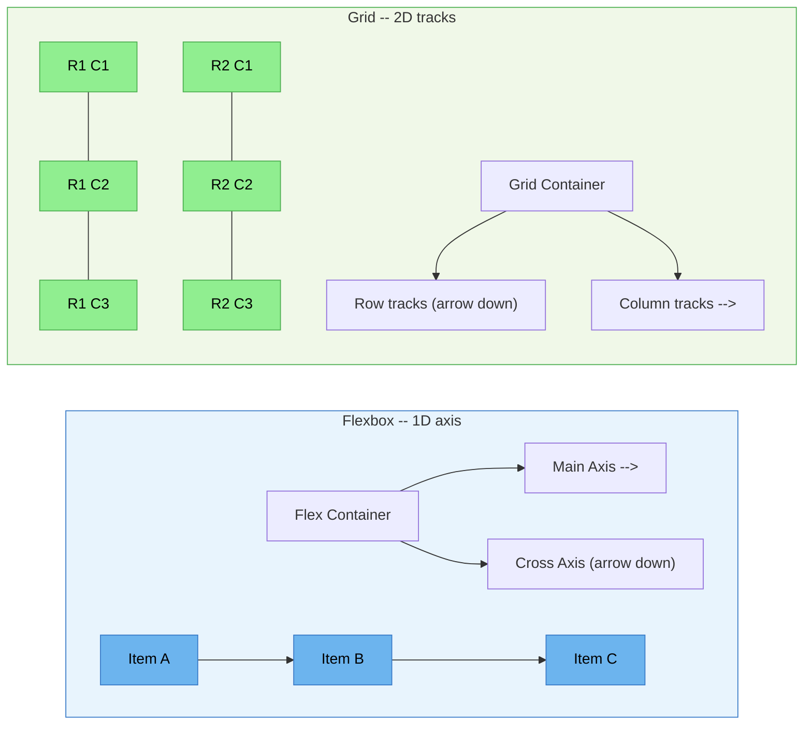

# [FEE-203] Flexbox 與 Grid

:::info
CSS 提供兩種專為應用程式 UI 設計的現代排版演算法：**Flexbox** 用於沿單一軸線的一維分佈，**Grid** 用於跨列（rows）與欄（columns）的二維放置。你應該（SHOULD）在元件級排版（導覽列、卡片列、表單控制項）使用 flexbox，在頁面級和儀表板排版使用 grid。你應該（SHOULD）在兩種系統中使用 `gap` 屬性取代 margin hack 來處理間距。你應該（SHOULD）當子元素需要參與父元素的 grid 軌道時考慮使用 subgrid。
:::

## 背景

在 flexbox 和 grid 出現之前，網頁開發者依靠 float、inline-block hack 和表格排版來實現超越簡單文件流的任何效果。這些技術從未被設計用於應用程式排版。它們是變通方案，產生的 CSS 脆弱且難以維護。

**Flexbox**（CSS 彈性盒模型 Flexible Box Layout Module，2009 年首次工作草案、2012 年候選推薦）是第一個專為沿單一軸線分配空間而設計的排版演算法。它在 2010 年代中期取得廣泛的無前綴瀏覽器支援：Chrome 於 2013 年（Chrome 29）推出無前綴版本；Firefox 自 2013 年起已無前綴，但直到 Firefox 28（2014 年）才加入 `flex-wrap`；Safari 9 則在 2015 年 9 月拿掉前綴要求。Internet Explorer 10 和 11 僅提供部分且有 bug 的實作，並在正式環境的程式碼庫中殘留了多年。Flexbox 引入了 `flex-grow`、`flex-shrink` 和 `flex-basis` 等概念，讓項目可以根據可用空間擴展和收縮，這是 float 若不搭配 JavaScript 就無法做到的。

**Grid**（CSS 格線排版 Grid Layout Module Level 1）於 2016 年 9 月 29 日達到第一個候選推薦（Candidate Recommendation），並在 2017 年 3 月幾乎同時於 Firefox 52、Chrome 57 和 Safari 10.1 上發布；Edge 則在 2017 年 10 月的 Edge 16 中跟進。Grid 提供一個二維排版系統，具有明確的列（row）和欄（column）軌道：你在容器上定義完整的排版結構，然後將子元素放置到命名區域或特定格線線上。這與 flexbox 的內容驅動尺寸計算不同，後者的演算法是根據每個項目已經需要的空間來分配。

兩種系統共享 `gap` 屬性用於項目間距，並支援透過 `justify-*` 和 `align-*` 屬性進行對齊；它們經常在同一個排版中被搭配使用，而非彼此競爭。一個典型案例是卡片格線：卡片需要換行到新的一列，且無論內容長短，同一列的卡片高度都必須相等。flex 容器上的 `flex-wrap: wrap` 可以處理換行，並讓同一列的每張卡片擁有相同的交叉軸高度；grid 的 `repeat(auto-fill, minmax(...))`（在範例章節中說明）則是以明確的軌道控制來解決同樣的換行問題。Float 需要手動處理清除才能達成上述任一效果，而 inline-block 則需要小心處理空白字元，以避免項目之間出現不預期的間隙。

## 視覺對比

### Flexbox（1D）與 Grid（2D）比較



**Flexbox** 沿一個軸線分配項目（主軸 main axis）。交叉軸（cross axis）處理對齊但不獨立控制軌道尺寸。**Grid** 同時定義列（row）和欄（column）軌道，允許精確的二維放置。

### 何時使用哪種

| 情境 | 建議使用 | 原因 |
|------|---------|------|
| 導覽列：logo + 連結 + 操作 | Flexbox | 使用 `justify-content: space-between` 的 1D 分佈 |
| 等高卡片列 | Flexbox | 項目共享交叉軸高度，由內容決定寬度 |
| 頁面排版：header / sidebar / main / footer | Grid | 使用 `grid-template-areas` 的 2D 放置 |
| 比例分配的儀表板面板 | Grid | 使用 `fr` 單位和 `minmax()` 的明確軌道尺寸 |
| 表單：label + input + button 在同一列 | Flexbox | 簡單的 1D 對齊，input 佔據剩餘空間 |
| 雜誌排版，含跨區塊元素 | Grid | 項目可以跨越多列多欄 |
| 置中單一元素 | 皆可 | Flexbox: `justify-content + align-items`。Grid: `place-items: center` |

## 範例

### 1. 使用 justify-content: space-between 的 Flexbox 導覽列

```html
<nav class="navbar">
  <a class="navbar-brand" href="/">MyApp</a>
  <ul class="navbar-links">
    <li><a href="/docs">Docs</a></li>
    <li><a href="/pricing">Pricing</a></li>
    <li><a href="/blog">Blog</a></li>
  </ul>
  <div class="navbar-actions">
    <button>Sign In</button>
    <button class="primary">Get Started</button>
  </div>
</nav>

<style>
  .navbar {
    display: flex;
    justify-content: space-between; /* Logo 左、連結中、操作右 */
    align-items: center;
    padding: 0 1rem;
    height: 60px;
    gap: 1rem; /* 三個群組之間的間距 */
  }

  .navbar-links {
    display: flex;
    gap: 1.5rem; /* 連結之間的間距 */
    list-style: none;
    margin: 0;
    padding: 0;
  }

  .navbar-actions {
    display: flex;
    gap: 0.5rem; /* 按鈕之間的間距 */
  }
</style>
```

這使用巢狀的 flex 容器。外層的 `.navbar` 分配三個群組，每個群組使用自己的 flex 排版處理內部間距。`gap` 屬性處理所有間距，因此不需要 margin hack。

### 2. 使用 grid-template-areas 的 Grid 儀表板

```html
<div class="dashboard">
  <header class="dash-header">Header</header>
  <nav class="dash-sidebar">Sidebar</nav>
  <main class="dash-main">Main Content</main>
  <aside class="dash-panel">Right Panel</aside>
  <footer class="dash-footer">Footer</footer>
</div>

<style>
  .dashboard {
    display: grid;
    grid-template-areas:
      "header  header  header"
      "sidebar main    panel"
      "footer  footer  footer";
    grid-template-columns: 240px 1fr 300px;
    grid-template-rows: 60px 1fr 40px;
    min-height: 100vh;
    gap: 1px; /* 細微的 gap 作為視覺分隔線 */
  }

  .dash-header  { grid-area: header; }
  .dash-sidebar { grid-area: sidebar; }
  .dash-main    { grid-area: main; }
  .dash-panel   { grid-area: panel; }
  .dash-footer  { grid-area: footer; }

  /* 響應式：小螢幕上堆疊 */
  @media (max-width: 768px) {
    .dashboard {
      grid-template-areas:
        "header"
        "main"
        "sidebar"
        "panel"
        "footer";
      grid-template-columns: 1fr;
      grid-template-rows: auto;
    }
  }
</style>
```

`grid-template-areas` 屬性讓你可以在 CSS 中視覺化地定義排版。針對不同螢幕尺寸改變排版只需重新定義區域映射，不需要修改 DOM。`fr` 單位讓主要內容區域在固定寬度的 sidebar 和 panel 之後佔據所有剩餘空間。

### 3. 兩者結合：Grid 頁面排版 + Flexbox 卡片元件

```html
<div class="product-grid">
  <div class="product-card">
    
    <div class="card-body">
      <h3>Product Name</h3>
      <p>Short description of the product goes here.</p>
    </div>
    <div class="card-footer">
      <span class="price">$29.99</span>
      <button>Add to Cart</button>
    </div>
  </div>
  <!-- More cards... -->
</div>

<style>
  /* Grid：使用 auto-fill 的響應式卡片格線 */
  .product-grid {
    display: grid;
    grid-template-columns: repeat(auto-fill, minmax(280px, 1fr));
    gap: 1.5rem;
    padding: 1.5rem;
  }

  /* Flexbox：卡片內部排版 */
  .product-card {
    display: flex;
    flex-direction: column;     /* 垂直堆疊圖片、主體、頁尾 */
    border: 1px solid #e0e0e0;
    border-radius: 8px;
    overflow: hidden;
  }

  .product-card img {
    width: 100%;
    aspect-ratio: 4 / 3;
    object-fit: cover;
  }

  .card-body {
    flex: 1;                    /* 主體佔據剩餘空間 */
    padding: 1rem;
  }

  .card-footer {
    display: flex;
    justify-content: space-between; /* 價格左、按鈕右 */
    align-items: center;
    padding: 1rem;
    border-top: 1px solid #e0e0e0;
  }
</style>
```

這是最常見的實務模式：**grid 用於整體頁面/區段排版**，**flexbox 用於個別元件排版**。Grid 處理響應式的欄位數量（auto-fill + minmax），而 flexbox 處理卡片的內部結構，無論內容高度如何，都將頁尾推到底部。

## 最佳實踐

**Grid 用於二維排版，Flexbox 用於一維排版。** 當你的排版需要同時控制列（rows）與欄（columns）（頁面外殼、儀表板面板、雜誌風格格線）時，你必須（MUST）使用 Grid。當你要沿著單一軸線分配項目（導覽列、工具列、行內按鈕群組）時，你應該（SHOULD）使用 Flexbox。對一維問題套用 Grid 只會增加維護負擔而沒有任何好處。

**在使用 `flex` 簡寫前先理解其展開行為。** 你不應該（SHOULD NOT）在不清楚 `flex: 1` 展開為 `flex-grow: 1; flex-shrink: 1; flex-basis: 0%`（而非 `flex-basis: auto`）的情況下使用它。這代表項目從零開始計算空間，無論內容寬度為何都會均等分配空間。當你的本意其實是 `flex: auto` 時，應避免（AVOID）誤用 `flex: 1`：`flex: auto` 會先依內容本身決定每個項目的尺寸，再依 `flex-grow` 分配剩餘空間。

**使用 `gap` 取代 margin hack 處理項目間距。** 你必須（MUST）在 flex 和 grid 容器中使用 `gap` 屬性來建立項目間的間距。應避免（AVOID）對子項目套用 `margin` 來模擬溝槽（gutter）。以 margin 模擬溝槽會在外緣產生不需要的 margin，需要在父元素上用負 margin 補償；而 `gap` 只在項目之間套用間距，在 Flexbox 和 Grid 中運作方式完全相同。

**需要跨兄弟元素對齊時使用 subgrid。** 卡片列中標題、描述和頁尾必須彼此對齊，是最典型的案例。當多個 grid 項目內的子元素需要彼此對齊時，你應該（SHOULD）在子容器上使用 `grid-template-rows: subgrid`，而非為每個項目建立各自獨立的內層 grid，因為獨立的 grid 無法與父 grid 共享軌道尺寸。FEE-208 對 subgrid 有更深入的說明。

**維持 DOM 順序對閱讀有意義；視覺重新排序僅限於外觀層面。** flexbox 的 `order` 以及 grid 的明確放置或 `grid-template-areas` 會改變視力健全使用者看到的內容，但不會改變鍵盤焦點移動的順序，也不會改變螢幕閱讀器的朗讀順序。如果排版在視覺軸線上自由重新排序，鍵盤和螢幕閱讀器使用者可能會相對於畫面上的內容跳來跳去，難以預測。你應該（SHOULD）依照這些使用者應該遇到內容的順序來撰寫 DOM，只有在純粹是外觀調整時才進行視覺上的重新排序。2025 年在 Chrome 中推出的 CSS `reading-flow` 和 `reading-order` 屬性，可讓容器讓個別項目重新加入無障礙工具所使用的閱讀順序，但目前瀏覽器支援尚不普及，因此 DOM 順序仍是主要的控制手段。

## 設計思維

### 為什麼有兩套系統：互補而非競爭

Flexbox 和 grid 解決不同類別的排版問題：

**Flexbox 是內容優先（content-first）的。** 你將項目放入 flex 容器，讓演算法根據每個項目的固有大小和 flex 因子分配空間。最終排版取決於內容。這使得 flexbox 適合：

- 導覽列（navbar），其中項目有不同長度的文字
- 卡片列需要等高但由內容決定寬度
- 表單控制項，將剩餘空間分配給輸入欄位
- 工具列和操作列，具有彈性間距

**Grid 是排版優先（layout-first）的。** 你在容器上定義軌道（列和欄），然後將項目放入該結構。排版由 grid 定義決定，而非內容。這使得 grid 適合：

- 頁面級排版（header、sidebar、main、footer）
- 具有固定比例的儀表板面板
- 雜誌風格的排版，包含跨區塊元素
- 任何 grid 結構是主要約束的設計

這個區別有時被表述為「flexbox 用於 1D，grid 用於 2D」，這是有用的啟發式規則但不是全貌。更深層的差異是 **content-out**（flexbox：內容決定排版）vs **layout-in**（grid：排版決定內容位置）。

### 為什麼不再新建基於 float 的格線系統

在大約十五年間，從 2000 年代初期到 2010 年代中期，網頁開發者使用基於 float 的格線系統來建立多欄排版。像 960.gs、Blueprint CSS、Susy 和 Bootstrap 原始的 grid，都是透過將固定寬度的欄位向左浮動，並結合百分比寬度與 clearfix 來運作的。

這些系統有根本性的限制：

- **沒有垂直對齊控制。** Float 只能將元素推向左或右；沒有內建的方式可以讓浮動欄位相對於其他兄弟元素垂直置中。
- **Clearfix hack。** 父元素需要 `overflow: hidden` 或 clearfix 虛擬元素來包含浮動的子元素，否則父元素會塌陷為零高度。
- **依賴原始碼順序。** 視覺順序綁定於 DOM 順序，沒有原生的方式可以將兩者脫鉤。
- **等高欄位需要 hack。** 假欄位（重複的背景圖片）、`display: table-cell` 或 JavaScript，是讓浮動欄位維持等高的唯一方法。

Flexbox 和 grid 消除了重新打造基於 float 的格線系統的理由。一行 `grid-template-columns: repeat(12, 1fr)` 就能取代大部分 float 格線框架所做的事，各框架也依照自己的時程逐步採用：2018 年發布的 Bootstrap 4 將其 grid 改為 flexbox，Bootstrap 5 則延續了以 flexbox 為基礎的 grid。這個採用過程是漸進的，而非一次性的切換。基於 float 的排版至今仍在使用：許多既有的程式碼庫從未將其格線系統遷移出 float；HTML 電子郵件用戶端仍無法可靠支援 flexbox 或 grid，因此電子郵件排版通常仍仰賴 float 或表格；而 float 也保留了它原本、至今仍然有效的用途，也就是讓文字環繞圖片（在段落中的 `` 上使用 `float: left`）。

### 元件庫排版基本元素

現代元件庫將 flexbox 和 grid 暴露為更高層級的抽象：

| 函式庫 | Flexbox 基本元素 | Grid 基本元素 | 間距 |
|--------|-----------------|--------------|------|
| **Chakra UI** | `<Flex>`、`<Stack>`、`<HStack>`、`<VStack>` | `<Grid>`、`<SimpleGrid>` | `<Spacer>`、`spacing` prop |
| **Ant Design** | `<Flex>`、`<Space>` | `<Row>`、`<Col>`（基於 flexbox） | `gutter` prop、`gap` |
| **MUI (Material UI)** | `<Stack>`、`<Box sx={flexbox}>` | `<Grid>`（基於 flexbox；可透過 `Box`/`sx` 使用 CSS grid） | `spacing` prop |
| **Radix Themes** | `<Flex>` | `<Grid>` | `gap` prop（對應 CSS gap） |
| **Tailwind CSS** | `flex`、`flex-row`、`flex-col`、`justify-*` | `grid`、`grid-cols-*`、`grid-rows-*` | `gap-*` 工具類別 |

這些函式庫都沒有自行發明排版引擎。它們各自將 props 對應到 flex 和 grid 的 CSS 宣告，因此在任何一個函式庫中除錯排版問題，都需要打開 DevTools，檢視元件底層產生的 `display: flex` 或 `display: grid` 規則。

## 深入探討

### `flex` 簡寫：`flex: 1` 實際代表什麼

`flex` 屬性是三個獨立屬性 `flex-grow`、`flex-shrink` 和 `flex-basis` 的簡寫，其關鍵字值的展開方式並不直觀：

| 簡寫 | 展開為 |
|------|--------|
| `flex: 1` | `flex-grow: 1; flex-shrink: 1; flex-basis: 0%` |
| `flex: auto` | `flex-grow: 1; flex-shrink: 1; flex-basis: auto` |
| `flex: none` | `flex-grow: 0; flex-shrink: 0; flex-basis: auto` |

關鍵差異在於 `flex-basis: 0%`（`flex: 1`）與 `flex-basis: auto`（`flex: auto`）。`flex-basis` 設定的是項目的*假設尺寸（hypothetical size）*，也就是 flex 演算法在套用增長或收縮因子之前的起始尺寸。

**`flex: 1` 讓項目均等分配尺寸，與內容無關。** 使用 `flex-basis: 0%` 時，每個項目的假設尺寸都是零，因此 `flex-grow: 1` 因子會將容器總寬度平均分配給每個項目。一個 200 字元的項目和一個 5 字元的項目最終寬度相同。當你需要統一欄位時使用這個：等寬的導覽分頁、三欄特色格線。

**`flex: auto` 讓項目依內容比例分配尺寸。** 使用 `flex-basis: auto` 時，每個項目的假設尺寸就是自身的內容尺寸，因此會先佔據其內容所需的空間，然後*剩餘*空間（在所有項目都佔據其自然寬度後）才會依 `flex-grow` 分配。較大的項目保留較多空間；較小的項目獲得較少。當內容大小應影響最終比例時使用這個：標籤雲、水平捲動的播放清單（其中曲目標題長度不一）。

**`flex: none` 是固定大小、沒有彈性。** 項目精確佔據其 `width`/`height`（或固有大小），既不增長也不縮小。用於在 flex 列中絕對不能改變大小的元素：頭像縮圖、固定寬度的圖示按鈕。

一個常見錯誤是寫了 `flex: 1` 預期均等分配，卻發現某個溢出的項目破壞了排版。根本原因通常是 `min-width: auto`（項目無法縮小到低於內容的最小寬度）。在 `flex: 1` 旁邊加上 `min-width: 0` 可以恢復預期行為，詳見下方的常見錯誤。

## 常見錯誤

### 1. 忘記在 flex 項目上設定 min-width: 0（內容溢出）

**錯誤做法：** 長文字或大內容溢出 flex 項目而非被限制：

```css
.sidebar { flex: 0 0 200px; }
.content { flex: 1; }

/* .content 內的 <pre> 或長 URL 溢出 flex 容器 */
```

預設情況下，flex 項目的 `min-width` 為 `auto`，這防止它們縮小到低於內容的固有最小寬度。一個長的不斷行字串或 `<pre>` 區塊可以讓項目比預期更寬。

**修正方式：** 在 flex 項目上設定 `min-width: 0`（或 `overflow: hidden`）：

```css
.content {
  flex: 1;
  min-width: 0; /* 允許縮小到低於內容的固有寬度 */
}
```

這同樣適用於交叉軸（cross axis）：在 `flex-direction: column` 容器中，當 flex 項目垂直溢出時使用 `min-height: 0`。

### 2. auto-fill 與 auto-fit 的混淆

**錯誤做法：** 將 `auto-fill` 和 `auto-fit` 交替使用，得到意外的空軌道或拉伸的項目：

```css
/* auto-fill：建立盡可能多的軌道，即使是空的 */
grid-template-columns: repeat(auto-fill, minmax(200px, 1fr));

/* auto-fit：與 auto-fill 相同，但將空軌道摺疊為 0 */
grid-template-columns: repeat(auto-fit, minmax(200px, 1fr));
```

在 1200px 容器中有 3 個項目，使用 `minmax(200px, 1fr)` 時：
- **auto-fill** 建立 6 個軌道（1200/200），3 個有項目，3 個空的。項目不會拉伸填滿容器。
- **auto-fit** 建立 6 個軌道，然後摺疊 3 個空的。項目拉伸填滿所有可用空間。

**修正方式：** 當你希望項目拉伸填滿整列時使用 `auto-fit`。當你希望不論項目數量都維持一致的欄位尺寸時使用 `auto-fill`（在動態新增/移除項目時保持格線對齊很有用）。

## 延伸閱讀

- [盒模型與排版模式](/zh-tw/CSS%20and%20Layout%20Systems/202)
- [CSS 子格線](/zh-tw/CSS%20and%20Layout%20Systems/208)
- [現代 CSS 框架](/zh-tw/CSS%20and%20Layout%20Systems/206)
- [響應式設計與容器查詢](/zh-tw/CSS%20and%20Layout%20Systems/204)
- [Stacking Context、繪製順序與 Top Layer](/zh-tw/CSS%20and%20Layout%20Systems/stacking-contexts-paint-order-top-layer)
- [CSS 與排版系統總覽](/zh-tw/CSS%20and%20Layout%20Systems/200)

## 參考資料

- W3C, "CSS Flexible Box Layout Module Level 1," W3C Candidate Recommendation Draft (2025). https://www.w3.org/TR/css-flexbox-1/
- W3C, "CSS Grid Layout Module Level 1," W3C Candidate Recommendation Draft (2025). https://www.w3.org/TR/css-grid-1/
- W3C, "CSS Grid Layout Module Level 2," W3C Candidate Recommendation Draft (2025). https://www.w3.org/TR/css-grid-2/
- MDN contributors, "CSS Flexible Box Layout," MDN Web Docs (2025). https://developer.mozilla.org/en-US/docs/Web/CSS/CSS_flexible_box_layout
- MDN contributors, "CSS Grid Layout," MDN Web Docs (2025). https://developer.mozilla.org/en-US/docs/Web/CSS/CSS_grid_layout
- Chris Coyier, "A Complete Guide to Flexbox," CSS-Tricks (2013, kept updated). https://css-tricks.com/snippets/css/a-guide-to-flexbox/
- Chris House, "A Complete Guide to CSS Grid," CSS-Tricks (2016, kept updated). https://css-tricks.com/snippets/css/complete-guide-grid/
- Sara Soueidan, "Auto-Sizing Columns in CSS Grid: auto-fill vs auto-fit," CSS-Tricks (2017). https://css-tricks.com/auto-sizing-columns-css-grid-auto-fill-vs-auto-fit/
- Josh W. Comeau, "An Interactive Guide to Flexbox," joshwcomeau.com (2022). https://www.joshwcomeau.com/css/interactive-guide-to-flexbox/
- Rachel Andrew, "Grid, content re-ordering and accessibility," rachelandrew.co.uk (2019). https://rachelandrew.co.uk/archives/2019/06/04/grid-content-re-ordering-and-accessibility/
- MDN contributors, "reading-flow," MDN Web Docs (2025). https://developer.mozilla.org/en-US/docs/Web/CSS/reading-flow
- Rachel Andrew, "Grid by Example," gridbyexample.com (ongoing curated collection). https://gridbyexample.com/
- Jen Simmons, "Layout Land," YouTube (2018-2019, archived series). https://www.youtube.com/c/LayoutLand
