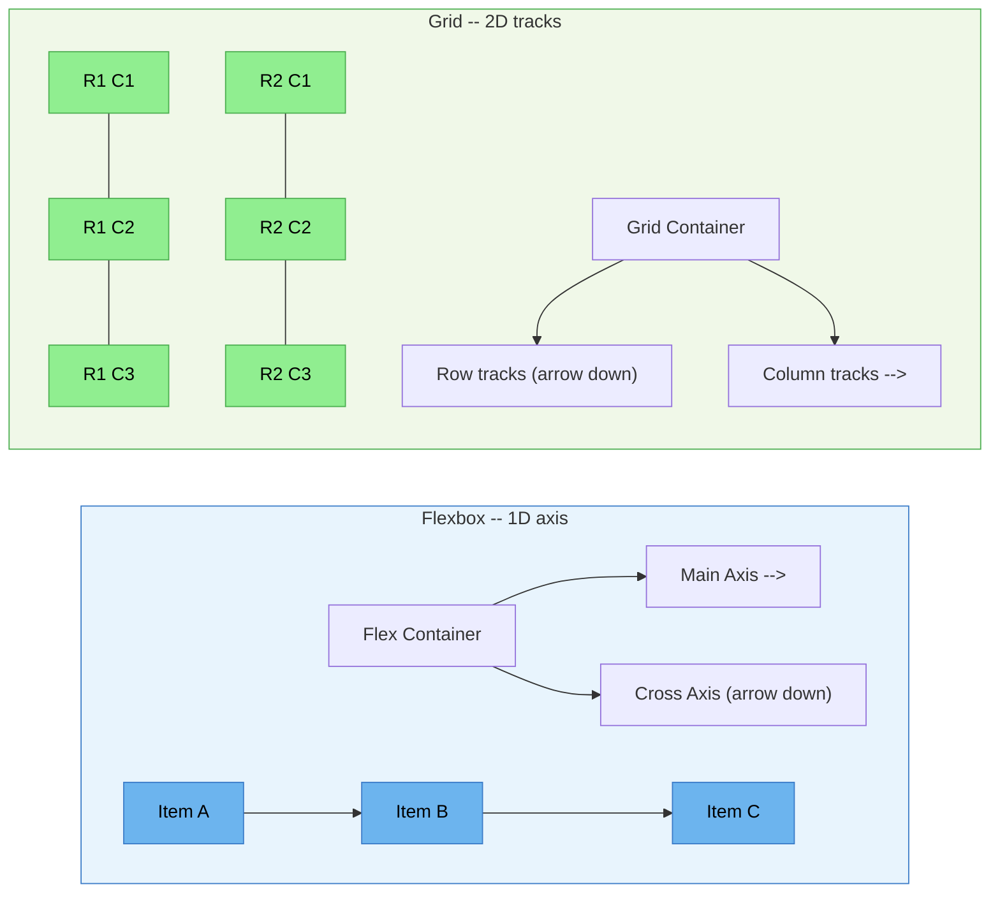

# [FEE-203] Flexbox 與 Grid

:::info
CSS 提供兩種專為應用程式 UI 設計的現代排版演算法：**Flexbox** 用於沿單一軸線的一維分佈，**Grid** 用於跨列（rows）與欄（columns）的二維放置。你應該（SHOULD）在元件級排版（導覽列、卡片列、表單控制項）使用 flexbox，在頁面級和儀表板排版使用 grid。你應該（SHOULD）在兩種系統中使用 `gap` 屬性取代 margin hack 來處理間距。你應該（SHOULD）當子元素需要參與父元素的 grid 軌道時考慮使用 subgrid。
:::

## 背景

在 flexbox 和 grid 出現之前，網頁開發者依靠 float、inline-block hack 和表格排版來實現超越簡單文件流的任何效果。這些技術從未被設計用於應用程式排版 -- 它們是變通方案，產生脆弱且難以維護的 CSS。

**Flexbox**（CSS 彈性盒模型 Flexible Box Layout Module，2009 年首次工作草案、2012 年候選推薦、2015 年獲得廣泛支援）是第一個專為沿單一軸線分配空間而設計的排版演算法。它引入了 `flex-grow`、`flex-shrink` 和 `flex-basis` 等概念，讓項目可以根據可用空間擴展和收縮 -- 這在 float 時代是不可能的。

**Grid**（CSS 格線排版 Grid Layout Module Level 1，2017 年候選推薦，2017 年 3 月在所有主要瀏覽器中發布）更進一步，提供一個二維排版系統，具有明確的列（row）和欄（column）軌道。Grid 允許你在容器中定義完整的排版結構，並將子元素放置到命名區域或特定格線線上 -- 這與 flexbox 的內容驅動尺寸計算截然不同。

兩種系統共享 `gap` 屬性用於項目間距，支援透過 `justify-*` 和 `align-*` 屬性進行對齊，且可以自由組合。理解何時使用哪一種 -- 以及它們如何互補 -- 是現代 CSS 排版的核心技能。

## 設計思維

### 為什麼有兩套系統：互補而非競爭

Flexbox 和 grid 解決不同類別的排版問題：

**Flexbox 是內容優先（content-first）的。** 你將項目放入 flex 容器，讓演算法根據每個項目的固有大小和 flex 因子分配空間。最終排版取決於內容。這使得 flexbox 適合：

- 導覽列（navbar），其中項目有不同長度的文字
- 卡片列需要等高但由內容決定寬度
- 表單控制項，將剩餘空間分配給輸入欄位
- 工具列和操作列，具有彈性間距

**Grid 是排版優先（layout-first）的。** 你在容器上定義軌道（列和欄），然後將項目放入該結構。排版由 grid 定義決定，而非內容。這使得 grid 適合：

- 頁面級排版（header、sidebar、main、footer）
- 具有固定比例的儀表板面板
- 雜誌風格的排版，包含跨區塊元素
- 任何 grid 結構是主要約束的設計

這個區別有時被表述為「flexbox 用於 1D，grid 用於 2D」，這是有用的啟發式規則但不是全貌。更深層的差異是 **content-out**（flexbox：內容決定排版）vs **layout-in**（grid：排版決定內容位置）。

### 「CSS Grid 消滅了 float 排版」

超過十年（大約 2002-2016），網頁開發者使用基於 float 的格線系統來建立多欄排版。像 960gs、Blueprint CSS、Susy 和 Bootstrap 的原始 grid 都是透過將固定寬度的欄位向左浮動，並使用百分比寬度搭配 clearfix 來運作的。

這些系統有根本性的限制：

- **沒有垂直對齊控制** -- float 只能將元素推向左或右。
- **Clearfix hack** -- 父元素需要 `overflow: hidden` 或 clearfix 虛擬元素來包含浮動的子元素。
- **依賴原始碼順序** -- 視覺順序綁定於 DOM 順序。
- **等高欄位需要 hack** -- 假欄位（背景圖片）、display: table-cell 或 JavaScript。

CSS Grid 讓這些全部過時了。一行 `grid-template-columns: repeat(12, 1fr)` 就取代了整個基於 float 的格線框架。這個轉變很快發生：Bootstrap 4（2018）改用 flexbox，大多數現代框架現在完全使用 grid 或 flexbox。

### 元件庫排版基本元素

現代元件庫將 flexbox 和 grid 暴露為更高層級的抽象：

| 函式庫 | Flexbox 基本元素 | Grid 基本元素 | 間距 |
|--------|-----------------|--------------|------|
| **Chakra UI** | `<Flex>`、`<Stack>`、`<HStack>`、`<VStack>` | `<Grid>`、`<SimpleGrid>` | `<Spacer>`、`spacing` prop |
| **Ant Design** | `<Flex>`、`<Space>` | `<Row>`、`<Col>`（基於 flexbox） | `gutter` prop、`gap` |
| **MUI (Material UI)** | `<Stack>`、`<Box sx={flexbox}>` | `<Grid>`（v6+ 使用 CSS grid） | `spacing` prop |
| **Radix Themes** | `<Flex>` | `<Grid>` | `gap` prop（對應 CSS gap） |
| **Tailwind CSS** | `flex`、`flex-row`、`flex-col`、`justify-*` | `grid`、`grid-cols-*`、`grid-rows-*` | `gap-*` 工具類別 |

這些抽象證明了一個關鍵觀點：flexbox 和 grid 是現代 Web UI 的基礎排版原語（layout primitives）。每個元件庫最終都收斂於包裝它們。

## 圖解

### Flexbox（1D）與 Grid（2D）比較



**Flexbox** 沿一個軸線分配項目（主軸 main axis）。交叉軸（cross axis）處理對齊但不獨立控制軌道尺寸。**Grid** 同時定義列（row）和欄（column）軌道，允許精確的二維放置。

### 何時使用哪種

| 情境 | 建議使用 | 原因 |
|------|---------|------|
| 導覽列：logo + 連結 + 操作 | Flexbox | 使用 `justify-content: space-between` 的 1D 分佈 |
| 等高卡片列 | Flexbox | 項目共享交叉軸高度，由內容決定寬度 |
| 頁面排版：header / sidebar / main / footer | Grid | 使用 `grid-template-areas` 的 2D 放置 |
| 可調整大小的儀表板面板 | Grid | 使用 `fr` 單位和 `minmax()` 的明確軌道尺寸 |
| 表單：label + input + button 在同一列 | Flexbox | 簡單的 1D 對齊，input 佔據剩餘空間 |
| 雜誌排版，含跨區塊元素 | Grid | 項目可以跨越多列多欄 |
| 置中單一元素 | 皆可 | Flexbox: `justify-content + align-items`。Grid: `place-items: center` |

## 範例

### 1. 使用 justify-content: space-between 的 Flexbox 導覽列

```html
<nav class="navbar">
  <a class="navbar-brand" href="/">MyApp</a>
  <ul class="navbar-links">
    <li><a href="/docs">Docs</a></li>
    <li><a href="/pricing">Pricing</a></li>
    <li><a href="/blog">Blog</a></li>
  </ul>
  <div class="navbar-actions">
    <button>Sign In</button>
    <button class="primary">Get Started</button>
  </div>
</nav>

<style>
  .navbar {
    display: flex;
    justify-content: space-between; /* Logo 左、連結中、操作右 */
    align-items: center;
    padding: 0 1rem;
    height: 60px;
    gap: 1rem; /* 三個群組之間的間距 */
  }

  .navbar-links {
    display: flex;
    gap: 1.5rem; /* 連結之間的間距 */
    list-style: none;
    margin: 0;
    padding: 0;
  }

  .navbar-actions {
    display: flex;
    gap: 0.5rem; /* 按鈕之間的間距 */
  }
</style>
```

這使用巢狀的 flex 容器：外層的 `.navbar` 分配三個群組，每個群組使用自己的 flex 排版處理內部間距。`gap` 屬性處理所有間距 -- 不需要 margin hack。

### 2. 使用 grid-template-areas 的 Grid 儀表板

```html
<div class="dashboard">
  <header class="dash-header">Header</header>
  <nav class="dash-sidebar">Sidebar</nav>
  <main class="dash-main">Main Content</main>
  <aside class="dash-panel">Right Panel</aside>
  <footer class="dash-footer">Footer</footer>
</div>

<style>
  .dashboard {
    display: grid;
    grid-template-areas:
      "header  header  header"
      "sidebar main    panel"
      "footer  footer  footer";
    grid-template-columns: 240px 1fr 300px;
    grid-template-rows: 60px 1fr 40px;
    min-height: 100vh;
    gap: 1px; /* 細微的 gap 作為視覺分隔線 */
  }

  .dash-header  { grid-area: header; }
  .dash-sidebar { grid-area: sidebar; }
  .dash-main    { grid-area: main; }
  .dash-panel   { grid-area: panel; }
  .dash-footer  { grid-area: footer; }

  /* 響應式：小螢幕上堆疊 */
  @media (max-width: 768px) {
    .dashboard {
      grid-template-areas:
        "header"
        "main"
        "sidebar"
        "panel"
        "footer";
      grid-template-columns: 1fr;
      grid-template-rows: auto;
    }
  }
</style>
```

`grid-template-areas` 屬性讓你可以在 CSS 中視覺化地定義排版。針對不同螢幕尺寸改變排版只需重新定義區域映射 -- 不需要修改 DOM。`fr` 單位讓主要內容區域在固定寬度的 sidebar 和 panel 之後佔據所有剩餘空間。

### 3. 兩者結合：Grid 頁面排版 + Flexbox 卡片元件

```html
<div class="product-grid">
  <div class="product-card">
    
    <div class="card-body">
      <h3>Product Name</h3>
      <p>Short description of the product goes here.</p>
    </div>
    <div class="card-footer">
      <span class="price">$29.99</span>
      <button>Add to Cart</button>
    </div>
  </div>
  <!-- More cards... -->
</div>

<style>
  /* Grid：使用 auto-fill 的響應式卡片格線 */
  .product-grid {
    display: grid;
    grid-template-columns: repeat(auto-fill, minmax(280px, 1fr));
    gap: 1.5rem;
    padding: 1.5rem;
  }

  /* Flexbox：卡片內部排版 */
  .product-card {
    display: flex;
    flex-direction: column;     /* 垂直堆疊圖片、主體、頁尾 */
    border: 1px solid #e0e0e0;
    border-radius: 8px;
    overflow: hidden;
  }

  .product-card img {
    width: 100%;
    aspect-ratio: 4 / 3;
    object-fit: cover;
  }

  .card-body {
    flex: 1;                    /* 主體佔據剩餘空間 */
    padding: 1rem;
  }

  .card-footer {
    display: flex;
    justify-content: space-between; /* 價格左、按鈕右 */
    align-items: center;
    padding: 1rem;
    border-top: 1px solid #e0e0e0;
  }
</style>
```

這是最常見的實務模式：**grid 用於整體頁面/區段排版**，**flexbox 用於個別元件排版**。Grid 處理響應式的欄位數量（auto-fill + minmax），而 flexbox 處理卡片的內部結構 -- 無論內容高度如何，都將頁尾推到底部。

## 常見錯誤

### 1. 簡單 1D 排版用 grid 而非更適合的 flexbox

**錯誤做法：** 對簡單的項目列使用 CSS Grid：

```css
.toolbar {
  display: grid;
  grid-template-columns: auto auto auto 1fr auto;
  /* 對工具列而言過度複雜 -- 如果新增或移除項目怎麼辦？ */
}
```

Grid 需要明確的軌道定義。新增或移除工具列項目意味著要更新 `grid-template-columns`。這對動態、內容驅動的排版來說很脆弱。

**修正方式：** 對項目數量可能變化的一維排版使用 flexbox：

```css
.toolbar {
  display: flex;
  gap: 0.5rem;
  align-items: center;
}

.toolbar-spacer {
  flex: 1; /* 將後續項目推到右邊 */
}
```

### 2. 忘記在 flex 項目上設定 min-width: 0（內容溢出）

**錯誤做法：** 長文字或大內容溢出 flex 項目而非被限制：

```css
.sidebar { flex: 0 0 200px; }
.content { flex: 1; }

/* .content 內的 <pre> 或長 URL 溢出 flex 容器 */
```

預設情況下，flex 項目的 `min-width` 為 `auto`，這防止它們縮小到低於內容的固有最小寬度。一個長的不斷行字串或 `<pre>` 區塊可以讓項目比預期更寬。

**修正方式：** 在 flex 項目上設定 `min-width: 0`（或 `overflow: hidden`）：

```css
.content {
  flex: 1;
  min-width: 0; /* 允許縮小到低於內容的固有寬度 */
}
```

這同樣適用於交叉軸（cross axis）：在 `flex-direction: column` 容器中，當 flex 項目垂直溢出時使用 `min-height: 0`。

### 3. auto-fill 與 auto-fit 的混淆

**錯誤做法：** 將 `auto-fill` 和 `auto-fit` 交替使用，得到意外的空軌道或拉伸的項目：

```css
/* auto-fill：建立盡可能多的軌道，即使是空的 */
grid-template-columns: repeat(auto-fill, minmax(200px, 1fr));

/* auto-fit：與 auto-fill 相同，但將空軌道摺疊為 0 */
grid-template-columns: repeat(auto-fit, minmax(200px, 1fr));
```

在 1200px 容器中有 3 個項目，使用 `minmax(200px, 1fr)` 時：
- **auto-fill** 建立 6 個軌道（1200/200），3 個有項目，3 個空的。項目不會拉伸填滿容器。
- **auto-fit** 建立 6 個軌道，然後摺疊 3 個空的。項目拉伸填滿所有可用空間。

**修正方式：** 當你希望項目拉伸填滿整列時使用 `auto-fit`。當你希望不論項目數量都維持一致的欄位尺寸時使用 `auto-fill`（在動態新增/移除項目時保持格線對齊很有用）。

### 4. 不使用 gap（用 margin hack 代替）

**錯誤做法：** 使用 margin 處理 flex 或 grid 項目之間的間距：

```css
.card-grid > * {
  margin: 0.75rem;
  /* 在第一個/最後一個項目上產生不需要的外部 margin。
     需要在父元素上用負 margin 來補償。 */
}

.card-grid {
  margin: -0.75rem; /* 用 hack 來抵消子元素的 margin */
}
```

**修正方式：** 使用 `gap` 屬性，它只在項目之間套用間距 -- 不會出現在外緣：

```css
.card-grid {
  display: grid;
  grid-template-columns: repeat(auto-fill, minmax(250px, 1fr));
  gap: 1.5rem; /* 乾淨的間距，不需要 hack */
}
```

`gap` 在 flexbox 和 grid 中都可使用。flexbox 中的 `gap` 瀏覽器支援自 2021 年起已全面普及。

### 5. 深層巢狀而非使用 subgrid

**錯誤做法：** 建立深層巢狀的 grid 來讓子元素跨兄弟對齊：

```html
<!-- 每張卡片有自己的 grid，所以標題/價格不會跨卡片對齊 -->
<div class="card-grid">
  <div class="card">
    <h3>Short Title</h3>        <!-- 與鄰居高度不同 -->
    <p>Description...</p>
    <span class="price">$9.99</span>
  </div>
  <div class="card">
    <h3>A Much Longer Title That Wraps to Two Lines</h3>
    <p>Description...</p>
    <span class="price">$19.99</span>
  </div>
</div>
```

每張卡片獨立管理自己的列。標題、描述和價格列不會跨卡片對齊。

**修正方式：** 使用 subgrid 讓子元素參與父元素的 grid 軌道：

```css
.card-grid {
  display: grid;
  grid-template-columns: repeat(auto-fill, minmax(250px, 1fr));
  gap: 1.5rem;
}

.card {
  display: grid;
  grid-template-rows: subgrid; /* 繼承父元素的列軌道 */
  grid-row: span 3;            /* 卡片跨越 3 個父列 */
}
```

使用 subgrid 後，標題、描述和價格列由父 grid 定義，因此它們會跨同一列中的所有卡片對齊。Subgrid 自 2023 年 12 月起在所有主要瀏覽器中受支援。

## 相關 FEE

| FEE | 關聯 |
|-----|------|
| [FEE-200 CSS 與排版系統總覽](./200.md) | 父總覽。Flexbox 和 grid 是 FEE-200 分類中介紹的兩種現代排版模式。 |
| [FEE-202 盒模型與排版模式](./202.md) | 涵蓋盒模型、定位、堆疊上下文和 display 屬性的外部/內部類型模型。Flexbox 和 grid 是基於該文所述基礎的內部顯示類型（`display: flex`、`display: grid`）。 |
| [FEE-204 響應式設計](./204.md) | 響應式技術 -- media queries、container queries 和流體排版 -- 與 flexbox 和 grid 結合使用以建立自適應排版。 |

## 參考資料

- [W3C CSS Flexible Box Layout Module Level 1](https://www.w3.org/TR/css-flexbox-1/) -- 定義 flex 容器、flex 項目、彈性和對齊的 flexbox 權威規範（W3C Candidate Recommendation）
- [W3C CSS Grid Layout Module Level 1](https://www.w3.org/TR/css-grid-1/) -- 定義 grid 容器、軌道、區域和放置的格線排版權威規範（W3C Candidate Recommendation）
- [W3C CSS Grid Layout Module Level 2](https://www.w3.org/TR/css-grid-2/) -- 擴展 Level 1，新增 subgrid，允許子元素參與父 grid 軌道（W3C Candidate Recommendation）
- [MDN: CSS Flexible Box Layout](https://developer.mozilla.org/en-US/docs/Web/CSS/CSS_flexible_box_layout) -- 涵蓋 flex 容器屬性、flex 項目屬性、對齊和實務範例的綜合指南
- [MDN: CSS Grid Layout](https://developer.mozilla.org/en-US/docs/Web/CSS/CSS_grid_layout) -- 格線排版的完整參考，包含軌道尺寸、放置、命名區域和 subgrid
- [CSS-Tricks: A Complete Guide to Flexbox](https://css-tricks.com/snippets/css/a-guide-to-flexbox/) -- 每個 flexbox 容器和項目屬性的視覺參考，作者 Chris Coyier
- [CSS-Tricks: A Complete Guide to CSS Grid](https://css-tricks.com/snippets/css/complete-guide-grid/) -- 每個 grid 屬性的視覺參考，包含模板區域、放置和對齊，作者 Chris House
- [Rachel Andrew: Grid by Example](https://gridbyexample.com/) -- 精選的 CSS Grid 使用範例和模式集合，作者 Rachel Andrew
- [Jen Simmons: Layout Land (YouTube)](https://www.youtube.com/c/LayoutLand) -- 現代 CSS 排版技術的影片系列，包含 grid、flexbox 和固有網頁設計（intrinsic web design），作者 Jen Simmons
