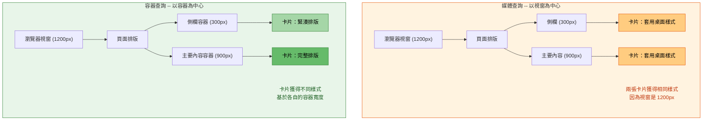

# [FEE-204] 響應式設計與容器查詢

:::info
響應式設計（Responsive Design）確保介面能適應任何裝置、視窗（viewport）或容器（container）環境。你應該（SHOULD）優先使用容器查詢（container queries）而非媒體查詢（media queries）來處理元件級別的響應式需求，因為容器查詢讓元件能根據其容器而非視窗來調整，實現真正可重用的元件。你應該（SHOULD）使用 `clamp()` 實現流式排版（fluid typography），消除基於斷點的字型大小跳變。你應該（SHOULD）採用邏輯屬性（logical properties）如 `margin-inline`、`padding-block`、`inline-size`，使排版能正確適應 LTR 和 RTL 書寫模式。
:::

## 背景

2010 年 5 月，Ethan Marcotte 在 A List Apart 發表了 "Responsive Web Design" 一文，創造了這個術語並定義了三大技術支柱：**流式格線**（fluid grids，基於百分比的排版）、**彈性圖片**（flexible images，`max-width: 100%`）和**媒體查詢**（media queries，`@media`）。這篇文章是分水嶺時刻 -- 它為整個產業提供了共同的詞彙和實用技術，用以建構能適應智慧型手機和平板電腦帶來的螢幕尺寸爆炸的網站。

媒體查詢成為響應式設計的主要工具。開發者定義視窗斷點（viewport breakpoints）-- 通常針對手機、平板和桌面寬度 -- 並為每個範圍編寫 CSS 規則。像 Bootstrap 這樣的框架將此標準化為一組斷點（576px、768px、992px、1200px），成為產業慣例。

但媒體查詢有一個根本限制：它們查詢的是**視窗**，而非**元件的容器**。在窄側欄中的卡片元件與寬主要內容區域中的卡片獲得相同的「桌面」樣式，因為兩者都存在於同一個視窗中。開發者透過臨時的 class 覆寫（`.sidebar .card { ... }`）來解決這個問題，但這使元件耦合到頁面脈絡 -- 與可重用設計的理念背道而馳。

**容器查詢**（Container Queries，`@container`），在 W3C CSS Containment Module Level 3 中規範，於 2023 年 2 月在所有主要瀏覽器中發布，解決了這個問題。它們讓元件可以查詢最近的包含上下文（containment context）的尺寸，而非視窗。卡片元件可以定義自己的響應式行為 -- 從水平切換到垂直排版、調整字型大小、顯示或隱藏元素 -- 完全基於其父元素給予的空間大小。這是從以視窗為中心到以容器為中心的響應式設計典範轉移。

除了容器查詢，現代響應式 CSS 還包括使用 `clamp()` 的**流式排版**、使用 `srcset` 和 `<picture>` 的**響應式圖片**、考慮行動瀏覽器介面的**新視窗單位**（`svh`、`dvh`、`lvh`），以及使排版支援國際化的**邏輯屬性**。

## 使用情境

你的側邊欄元件放在主要內容區時正常顯示，但重用到較窄的輔助欄位時版面卻壞掉了，因為樣式一直是相對於視窗寬度編寫的。媒體查詢無法解決這個問題——它們回應的是視窗，不是元件所在的容器。容器查詢讓元件的樣式能回應自身父元素的尺寸，使其在不同排版情境中都能正確渲染，真正做到可重用。

## 設計思維

### 為什麼媒體查詢先出現：以視窗為中心的時代

Ethan Marcotte 2010 年的方法建立在一個關鍵洞察上：視窗是你唯一能查詢的常數。當時，CSS 沒有機制可以詢問「我的父元素有多寬？」-- 只能問「螢幕有多寬？」這足以將網頁設計從固定寬度（960px）轉變為流式，但它在整個產業中植入了以視窗為中心的心智模型。

超過十年，響應式設計等同於視窗斷點。標準工作流程是：

1. 定義斷點：手機（< 768px）、平板（768px-1024px）、桌面（> 1024px）
2. 為每個斷點編寫媒體查詢
3. 在每個斷點按需覆寫元件樣式

這對頁面級排版有效，但在元件級別產生問題。一個可重用的 `<Card>` 元件可能需要在側欄中緊湊顯示，但在主要內容區域中全寬顯示 -- 在相同的視窗寬度下。媒體查詢無法表達這一點，因為它們沒有元件容器的概念。

### 容器查詢作為典範轉移

容器查詢反轉了響應式模型。元件不再問「視窗有多寬？」，而是問「我的容器有多寬？」這帶來深遠的影響：

**元件變得真正可攜帶。** 使用容器查詢樣式的卡片元件，無論放在 300px 的側欄、600px 的內容區域，還是 1200px 的全寬區塊中，都能正確運作 -- 無需知道視窗大小或頁面排版。

**排版責任清楚分離。** 頁面排版（grid/flexbox）決定每個區塊獲得多少空間。區塊內的元件回應它們被給予的空間。兩者不需要知道彼此的存在。

**設計系統受益最大。** 在設計系統中，元件被建構一次，然後在數十個脈絡中使用。容器查詢消除了尺寸變體的需求（`<Card size="sm">`、`<Card size="lg">`）-- 元件自動適應。

### 框架將如何演進

目前 CSS 框架的響應式工具是以視窗為中心的：

| 框架 | 響應式方法 | 限制 |
|------|-----------|------|
| **Tailwind CSS** | `sm:`、`md:`、`lg:` 前綴對應視窗斷點 | 所有斷點都是基於視窗的 |
| **Chakra UI** | 響應式屬性陣列：`fontSize={["sm", "md", "lg"]}` | 陣列索引對應視窗斷點 |
| **Ant Design** | `xs`、`sm`、`md`、`lg`、`xl`、`xxl` 響應式斷點 | Grid 斷點查詢視窗 |
| **Bootstrap** | `.col-sm-6`、`.col-md-4` 欄位類別 | 基於視窗的格線系統 |

容器查詢改變了這一切。Tailwind CSS 3.4+ 新增了 `@container` 支援，使用 `@` 前綴（`@sm:`、`@md:`、`@lg:`）。隨著採用率增長，元件級響應式工具將越來越多地基於容器，而頁面級排版仍然基於視窗。這個區別很重要：使用媒體查詢處理**頁面排版決策**（側欄是否可見？單欄還是多欄？），使用容器查詢處理**元件適應**（卡片水平還是垂直？是否顯示副標題？）。

### 流式排版：消除斷點跳變

傳統響應式排版使用媒體查詢在斷點處變更字型大小，產生突然的跳變：

```css
/* 突然跳變：字型在 768px 時從 16px 跳到 20px */
h1 { font-size: 16px; }
@media (min-width: 768px) { h1 { font-size: 20px; } }
@media (min-width: 1200px) { h1 { font-size: 32px; } }
```

`clamp()` 函式提供平滑縮放：

```css
/* 平滑：字型在 1rem 和 2.5rem 之間流暢縮放 */
h1 { font-size: clamp(1rem, 0.5rem + 2vw, 2.5rem); }
```

`clamp(MIN, PREFERRED, MAX)` 設定最小下限、流動的偏好值（通常使用 `vw` 或容器查詢單位），以及最大上限。字型大小隨視窗或容器寬度平滑縮放，硬性限制防止它變得太小或太大。

### 邏輯屬性與國際化

傳統 CSS 屬性如 `margin-left`、`padding-right` 和 `width` 假設從左到右、從上到下的書寫模式。對於支援 RTL 語言（阿拉伯語、希伯來語）或垂直書寫模式（CJK）的應用程式，這些物理屬性需要覆寫。

邏輯屬性對應到內容的流向：

| 物理屬性 | 邏輯對應 | 含義 |
|---------|---------|------|
| `width` | `inline-size` | 沿行內（文字）軸的尺寸 |
| `height` | `block-size` | 沿區塊（堆疊）軸的尺寸 |
| `margin-left` / `margin-right` | `margin-inline-start` / `margin-inline-end` | 沿行內軸的邊距 |
| `margin-left` + `margin-right` | `margin-inline` | 兩側行內邊距 |
| `padding-top` + `padding-bottom` | `padding-block` | 兩側區塊內距 |

使用邏輯屬性意味著你的響應式排版會在設定 `dir="rtl"` 或書寫模式改變時自動適應。

## 最佳實踐

**元件級響應式使用 container queries，頁面排版使用 media queries。** 元件應該（SHOULD）透過 `@container` 查詢其容器寬度，而非視窗。將 `@media` 保留給真正依賴視窗大小的決策 -- 例如將側欄從隱藏切換為可見、將頁面從單欄改為多欄。這種分離讓元件具有可攜性，與頁面脈絡解耦。

**採用 mobile-first 方法。** 你應該（SHOULD）先為最小的排版撰寫基礎樣式，再使用 `min-width` 查詢逐步增強以支援更寬的容器和視窗。Mobile-first 的 CSS 是累加的：隨著空間增長而添加複雜性，而非在較小尺寸時移除。應避免（AVOID）以 `max-width` 查詢作為主要策略，因為這會產生難以推理和維護的覆寫規則。

**用 `clamp()` 實現流式排版，取代斷點式跳變。** 字型大小應該（SHOULD）透過 `clamp(MIN, PREFERRED, MAX)` 連續縮放，而非在離散斷點處跳變。流動的偏好值搭配 `vw`（視窗相對）或 `cqi`（容器相對）使用。應避免（AVOID）在具名斷點處為正文和標題設定固定像素字型大小，因為這會造成突兀的視覺跳變。

**讓內容決定斷點，而非裝置類別。** 斷點應該（SHOULD）放在你的特定內容發生問題的地方 -- 文字行太長、卡片太擁擠、格線太稀疏 -- 而非放在 768px 或 1024px 這類任意的裝置寬度。這樣產生的排版能適應任何螢幕尺寸，而非只針對當今熱門裝置優化。

**使用邏輯屬性打造支援國際化的排版。** 你應該（SHOULD）優先使用 `inline-size`、`margin-inline`、`padding-block` 和 `border-inline-end`，取代其對應的物理屬性（`width`、`margin-left`、`padding-top`、`border-right`）。邏輯屬性在套用 `dir="rtl"` 或垂直書寫模式時會自動適應，無需額外的方向覆寫。

## 視覺化

### 媒體查詢（視窗）vs 容器查詢（容器）



**媒體查詢**在給定視窗寬度下對所有元件套用相同樣式，無論元件實際可用空間如何。**容器查詢**讓每個元件根據自己容器的尺寸進行調整。

## 範例

### 1. 經典媒體查詢響應式排版

```css
/* 頁面級排版：媒體查詢在這裡是適當的 */
.page {
  display: grid;
  grid-template-columns: 1fr;
  gap: 1rem;
  padding: 1rem;
}

@media (min-width: 48em) {
  .page {
    grid-template-columns: 240px 1fr;
  }
}

@media (min-width: 75em) {
  .page {
    grid-template-columns: 240px 1fr 300px;
  }
}

/* 使用媒體查詢的卡片：有問題 -- 相同的視窗斷點
   無論卡片在哪裡都會套用 */
.card {
  display: flex;
  flex-direction: column;
  gap: 0.75rem;
}

@media (min-width: 48em) {
  .card {
    flex-direction: row; /* 在「平板」視窗時水平排列 */
  }
}
```

```html
<div class="page">
  <aside class="sidebar">
    <div class="card"><!-- 這張卡片在 240px 的側欄中，
         但在 48em 視窗時獲得水平排版！ --></div>
  </aside>
  <main>
    <div class="card"><!-- 這張卡片有充足的空間 --></div>
  </main>
</div>
```

媒體查詢方法的失敗在於：側欄卡片在與主要內容卡片相同的視窗寬度時切換到水平排版，即使側欄只提供 240px 的空間。

### 2. 使用容器查詢的相同排版

```css
/* 頁面排版仍然使用媒體查詢 -- 這是正確的 */
.page {
  display: grid;
  grid-template-columns: 1fr;
  gap: 1rem;
  padding: 1rem;
}

@media (min-width: 48em) {
  .page { grid-template-columns: 240px 1fr; }
}

@media (min-width: 75em) {
  .page { grid-template-columns: 240px 1fr 300px; }
}

/* 在卡片的父元素上建立包含上下文 */
.sidebar,
main {
  container-type: inline-size;
}

/* 卡片使用容器查詢而非媒體查詢 */
.card {
  display: flex;
  flex-direction: column;
  gap: 0.75rem;
}

@container (min-width: 400px) {
  .card {
    flex-direction: row; /* 只有當容器實際有 400px+
                            空間時才水平排列 */
  }
}

@container (min-width: 600px) {
  .card .card-title {
    font-size: 1.5rem;
  }

  .card .card-meta {
    display: flex; /* 只在有空間時顯示 metadata */
  }
}
```

```html
<div class="page">
  <aside class="sidebar">
    <!-- 容器約 240px：卡片保持垂直排版 -->
    <div class="card">
      
      <div class="card-body">
        <h3 class="card-title">文章標題</h3>
        <p class="card-meta" hidden>作者 &middot; 5 分鐘閱讀</p>
      </div>
    </div>
  </aside>
  <main>
    <!-- 容器約 700px+：卡片水平排列並顯示 metadata -->
    <div class="card">
      
      <div class="card-body">
        <h3 class="card-title">文章標題</h3>
        <p class="card-meta">作者 &middot; 5 分鐘閱讀</p>
      </div>
    </div>
  </main>
</div>
```

現在側欄卡片保持垂直排版（其容器只有 240px），而主要內容卡片可以水平排列。卡片元件完全可攜帶 -- 它回應其容器，而非視窗。

### 3. 使用 clamp() 的流式排版

```css
:root {
  /* 使用 clamp() 的流式字型比例 */
  --font-size-sm: clamp(0.875rem, 0.8rem + 0.25vw, 1rem);
  --font-size-base: clamp(1rem, 0.9rem + 0.35vw, 1.125rem);
  --font-size-lg: clamp(1.25rem, 1rem + 0.75vw, 1.75rem);
  --font-size-xl: clamp(1.5rem, 1rem + 1.5vw, 2.5rem);
  --font-size-2xl: clamp(2rem, 1.2rem + 2.5vw, 3.5rem);
}

body {
  font-size: var(--font-size-base);
  line-height: 1.6;
}

h1 { font-size: var(--font-size-2xl); }
h2 { font-size: var(--font-size-xl); }
h3 { font-size: var(--font-size-lg); }
small { font-size: var(--font-size-sm); }

/* 容器查詢單位用於元件級流式排版 */
.card {
  container-type: inline-size;
}

.card-title {
  /* 字型大小隨卡片容器寬度縮放 */
  font-size: clamp(1rem, 3cqi, 1.5rem);
}
```

`cqi` 單位（container query inline）是容器行內尺寸的 1%，類似於視窗的 `vw`。結合 `clamp()`，它實現了隨元件容器而非視窗縮放的流式排版。

### 4. 響應式圖片

```html
<!-- srcset + sizes：瀏覽器選擇最佳圖片 -->


<!-- picture 元素：針對不同情境的藝術指導 -->
<picture>
  <source
    media="(max-width: 600px)"
    srcset="photo-portrait.jpg"
  />
  <source
    media="(min-width: 601px)"
    srcset="photo-landscape.jpg"
  />
  
</picture>
```

```css
/* CSS image-set() 用於背景圖片 */
.hero {
  background-image: image-set(
    url("hero-1x.webp") 1x,
    url("hero-2x.webp") 2x,
    url("hero-3x.webp") 3x
  );
}
```

`srcset` 搭配寬度描述符（`w`）告訴瀏覽器有哪些圖片尺寸可用。`sizes` 告訴瀏覽器在每個斷點處圖片將顯示多寬。瀏覽器結合這些資訊與裝置像素比來選擇最佳檔案。`<picture>` 元素提供藝術指導（art direction）-- 根據媒體條件提供完全不同的圖片。

### 5. 新視窗單位與邏輯屬性

```css
/* 新視窗單位考慮行動瀏覽器介面 */
.hero-section {
  /* svh：小視窗高度（排除所有瀏覽器介面） */
  min-height: 100svh;

  /* dvh：動態視窗高度（隨介面顯示/隱藏而變化） */
  /* lvh：大視窗高度（包含介面隱藏時的空間） */
}

/* 邏輯屬性支援 LTR/RTL */
.sidebar {
  inline-size: 280px;          /* LTR 中的 width */
  padding-inline: 1rem;        /* LTR 中的左右 padding */
  padding-block: 0.5rem;       /* 上下 padding */
  margin-inline-start: 0;      /* LTR 中的 margin-left，RTL 中的 margin-right */
  border-inline-end: 1px solid #e0e0e0; /* LTR 中的右邊框，RTL 中的左邊框 */
}

/* 結合容器查詢 */
@container (min-width: 600px) {
  .content {
    padding-inline: 2rem;      /* 容器較大時使用更寬的 padding */
  }
}
```

## 常見錯誤

### 1. 忘記在父元素設定 `container-type`

**錯誤：** 編寫的 `@container` 規則靜默地不起作用，因為沒有祖先設定 `container-type`：

```css
/* 這不會生效 -- 沒有建立包含上下文 */
@container (min-width: 400px) {
  .card { flex-direction: row; }
}
```

容器查詢需要祖先具有 `container-type: inline-size`（或 `size`）。沒有它，查詢沒有容器可以測量，樣式永遠不會套用。瀏覽器 DevTools 預設不會顯示警告 -- 它只是靜默地不生效。

**修正：** 始終在元件的父元素上建立包含上下文：

```css
.card-wrapper {
  container-type: inline-size;
  container-name: card; /* 可選：命名以進行針對性查詢 */
}

@container card (min-width: 400px) {
  .card { flex-direction: row; }
}
```

### 2. 使用 px 斷點而非 em（縮放無障礙性）

**錯誤：** 以像素定義斷點，不回應使用者的縮放或字型大小偏好：

```css
@media (min-width: 768px) { /* 768px 在 200% 縮放時仍然是 768px */ }
```

當使用者放大到 200% 時，CSS 像素中的視窗實際上減半。`768px` 的斷點仍在 768 個 CSS 像素時觸發，但內容是兩倍大 -- 排版可能沒有足夠空間。使用 `em` 可以尊重使用者的設定。

**修正：** 使用 `em` 值定義媒體查詢斷點：

```css
/* 48em = 預設 16px 字型大小時的 768px，但會隨縮放調整 */
@media (min-width: 48em) { ... }
```

在 200% 縮放時，`48em` 在裝置層面實際上變為 1536px，所以窄排版會持續到真正有足夠空間時才改變。

### 3. 不支援容器查詢的舊瀏覽器沒有降級方案

**錯誤：** 將容器查詢作為元件樣式的唯一路徑，沒有為不支援的瀏覽器提供基礎樣式：

```css
.card { /* 沒有定義基礎水平排版 */ }

@container (min-width: 400px) {
  .card { flex-direction: row; }
}
```

在不支援容器查詢的瀏覽器中（2023 年之前、某些嵌入式 WebView），`@container` 區塊會被完全忽略。元件只得到基礎樣式。

**修正：** 編寫合理的預設基礎樣式，再用容器查詢增強：

```css
/* 基礎：到處都能用 */
.card {
  display: flex;
  flex-direction: column;
}

/* 增強：媒體查詢降級 */
@media (min-width: 48em) {
  .card { flex-direction: row; }
}

/* 覆寫：支援時容器查詢優先 */
@container (min-width: 400px) {
  .card { flex-direction: row; }
}

/* 或使用 @supports 進行明確的功能偵測 */
@supports (container-type: inline-size) {
  .card-wrapper { container-type: inline-size; }

  @container (min-width: 400px) {
    .card { flex-direction: row; }
  }
}
```

### 4. 硬編碼斷點值而非使用設計代幣

**錯誤：** 在樣式表中散佈魔術數字：

```css
@media (min-width: 768px) { .nav { ... } }
@media (min-width: 768px) { .card { ... } }
@media (min-width: 768px) { .hero { ... } }
/* 如果斷點需要改變？需要在數百個檔案中尋找並替換。 */
```

**修正：** 使用自訂屬性或預處理器變數將斷點定義為設計代幣（design tokens）：

```css
/* CSS 自訂屬性（用於容器查詢和 calc） */
:root {
  --breakpoint-sm: 36em;   /* 576px */
  --breakpoint-md: 48em;   /* 768px */
  --breakpoint-lg: 62em;   /* 992px */
  --breakpoint-xl: 75em;   /* 1200px */
}

/* 注意：自訂屬性目前不能直接用在 @media 條件中，
   但自訂媒體查詢（Media Queries Level 5）將啟用此功能：
   @custom-media --viewport-md (min-width: 48em);
   @media (--viewport-md) { ... }

   在此之前，請使用 Sass 變數或 PostCSS custom media。 */
```

對於容器查詢，你可以使用 `cqi` 單位搭配 `clamp()` 和自訂屬性，建立隨容器大小調整的代幣驅動系統。

## 相關 FEE

| FEE | 關聯 |
|-----|------|
| [FEE-200 CSS 與排版系統概覽](./200.md) | 母概覽。響應式設計和容器查詢是 FEE-200 描述的現代 CSS 排版格局中的關鍵技術。 |
| [FEE-203 Flexbox 與 Grid](./203.md) | Flexbox 和 grid 提供響應式設計所調整的排版系統。媒體查詢和容器查詢修改 grid 定義和 flex 方向以建立響應式排版。 |
| [FEE-207 CSS 自訂屬性與主題化](./207.md) | 自訂屬性作為斷點、間距和流式字型比例的設計代幣。容器查詢結合自訂屬性可實現動態的、根據脈絡感知的主題化。 |

## 參考資料

- [Ethan Marcotte, "Responsive Web Design" (A List Apart, 2010)](https://alistapart.com/article/responsive-web-design/) -- 創造該術語並定義三大支柱的原始文章：流式格線、彈性圖片和媒體查詢
- [W3C CSS Containment Module Level 3](https://www.w3.org/TR/css-contain-3/) -- 定義容器查詢、`container-type`、`container-name` 和容器查詢長度單位（`cqw`、`cqi`、`cqb` 等）的規範
- [W3C Media Queries Level 5](https://www.w3.org/TR/mediaqueries-5/) -- 新增使用者偏好媒體特性（`prefers-color-scheme`、`prefers-reduced-motion`、`prefers-contrast`）和互動媒體特性的規範
- [MDN: CSS Container Queries](https://developer.mozilla.org/en-US/docs/Web/CSS/Guides/Containment/Container_queries) -- 容器查詢完整指南，包括 `@container`、`container-type`、容器查詢單位和命名容器
- [MDN: @container](https://developer.mozilla.org/en-US/docs/Web/CSS/Reference/At-rules/@container) -- `@container` at-rule 語法和容器查詢功能的參考文件
- [Ahmad Shadeed, "An Interactive Guide to CSS Container Queries"](https://ishadeed.com/article/css-container-query-guide/) -- 互動式指南，包含容器尺寸查詢、樣式查詢和實際用例的視覺範例
- [MDN: Responsive Images](https://developer.mozilla.org/en-US/docs/Learn/HTML/Multimedia_and_embedding/Responsive_images) -- `srcset`、`sizes` 和 `<picture>` 元素的響應式圖片載入指南
- [web.dev: Container Queries](https://web.dev/learn/css/container-queries) -- Google 的 Learn CSS 課程中的容器查詢指南
- [Josh W. Comeau, "A Friendly Introduction to Container Queries"](https://www.joshwcomeau.com/css/container-queries-introduction/) -- 包含互動範例的容器查詢入門級教學
