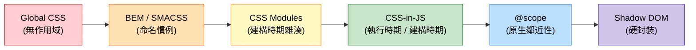

# [FEE-205] CSS 架構與作用域策略

:::info
CSS 預設是全域的。每條規則都可能影響文件中的每個元素，在大規模專案中會導致命名衝突：兩個團隊各自定義了 `.button`，結果彼此的樣式被靜默覆寫。多種作用域策略並存以解決這個問題，從命名慣例（BEM）到建構工具方案（CSS Modules）、執行時期抽象（CSS-in-JS），再到原生瀏覽器功能（`@scope`、Shadow DOM）。正確的策略取決於團隊規模、框架選擇、效能需求和主題化需求。
:::

## 背景

CSS 於 1996 年設計用於文件樣式化，而非應用程式。在文件脈絡中，全域樣式是一項特性：定義 `h1 { color: navy }` 一次，文件中的每個標題都會套用。這對早期網頁運作良好，但當網路轉向以元件為基礎的應用程式後就成了負擔。兩個開發者在不同檔案中寫下 `.button { ... }`，可能在不知情的情況下覆寫彼此的樣式，因為 CSS 選擇器是針對整份文件比對，沒有元件邊界的概念。兩個元件各自都是正確的；問題在於 CSS 沒有辦法讓一個子樹的樣式不影響另一個子樹。

團隊發展出多種因應方式，這些方式在 2026 年的正式環境中仍然並存運作，而非一種取代前一種的線性序列。Yandex 大約從 2005 年起在內部開發 BEM（Block Element Modifier），並於 2009 年前後公開發表這套方法論，單純透過命名紀律消除衝突。Yandex 的標準寫法用單一底線標示修飾符（`block__elem_mod`）；本文中隨處可見的雙連字號寫法 `block__element--modifier` 是後來社群發展出的變體，成為事實上更普及的慣例。Jonathan Snook 於 2011 年發表 SMACSS（Scalable and Modular Architecture for CSS），Harry Roberts 於 2014 年提出 ITCSS（Inverted Triangle CSS），兩者都為排序大型樣式表增添了結構。這三種方法都仰賴每位貢獻者遵守慣例，工具鏈本身不會強制執行；如今 BEM 的類別名稱依然經常出現在 CSS Modules 檔案裡，因為兩者是互補而非競爭關係。

Sass（2006）和 Less（2009）採取不同的角度：巢狀、變數和 mixin 改善了撰寫體驗，但像 `.card { .title { ... } }` 這樣的巢狀語法會編譯成一般的後代選擇器，本質上仍是全域的。它在原始碼中看起來像是有作用域，但輸出的結果並沒有。儘管如此，Sass 到了 2026 年仍然是使用最廣泛的 CSS 工具之一。

Christopher Chedeau 於 2014 年 11 月在 NationJS 發表的 "CSS in JS" 演講提出了不同的解法：把樣式放進 JavaScript，讓元件自己擁有樣式。Glen Maddern 和 Mark Dalgleish 打造 CSS Modules（2015）時，部分也是在回應 Chedeau 提出的同一個問題，但他們選擇了建構時期的類別雜湊，而非 JavaScript 執行時期：`.button` 在建構時期變成 `._button_1a2b3`，不需要命名紀律就能保證不衝突。延續 Chedeau 最初提案的執行時期函式庫包括 styled-components（2016）和 Emotion（2017），它們在元件渲染時生成唯一的類別名稱，並讓樣式能直接讀取元件的 props 以實現動態主題化。Mark Dalgleish 的文章 "A Unified Styling Language"（2017）主張，將樣式與元件邏輯放在一起，可以同時取得作用域樣式和關鍵 CSS 擷取（只送出初始渲染所需的 CSS）這兩項好處。執行時期 CSS-in-JS 徹底解決了作用域問題，但每次渲染都要付出序列化成本，也讓伺服器端渲染變得更複雜；styled-components 已於 2025 年 3 月進入維護模式，其維護者目前不建議新專案採用它（實際意義請見下方的「選擇策略」）。

Tailwind CSS（2017）用另一種方式繞開命名問題：因為工具類別在整個專案中共用且固定，沒有自訂類別名稱可以衝突。建構時期的 CSS-in-JS 函式庫保留了 CSS-in-JS 的撰寫體驗，卻沒有執行時期成本：vanilla-extract（2021）和 Linaria 在編譯時期生成有作用域的類別，Meta 於 2023 年 12 月開源的 StyleX 則預先將樣式編譯成去重複的原子化 CSS 類別。

平台本身也持續為 CSS 加入原生作用域能力。`@layer` 於 2022 年達到 Baseline（web 平台狀態，代表該功能在所有主流瀏覽器中都能運作），提供對層疊排序的明確控制。CSS nesting 於 2023 年達到 Baseline。`@scope` 於 2025 年 12 月達到 Baseline，是三者中最晚的一個，提供不需要建構步驟的鄰近性作用域。許多正式環境的網站仍然完全沒有作用域策略、直接使用全域 CSS，Sass 巢狀依然常見，CSS-in-JS 也依然廣泛部署，即使新專案正逐漸避開它的執行時期版本。這些並存方式之間的取捨，以及原生功能為何逐漸站穩腳步，會在下方的「設計思維」中討論。

## 視覺對比

### 作用域光譜：從全域到完全隔離



**由左至右：隔離程度遞增。** Global CSS 沒有作用域，每條規則在任何地方都適用。BEM 透過人為紀律增加作用域。CSS Modules 透過工具強制作用域。CSS-in-JS 為每個元件生成唯一識別碼。`@scope` 提供原生的基於鄰近性的邊界。Shadow DOM 建立外部樣式無法跨越的硬封裝邊界。

## 範例

### 1. 卡片元件的 BEM 命名

```css
/* Block（區塊） */
.card {
  border: 1px solid #e0e0e0;
  border-radius: 8px;
  overflow: hidden;
}

/* Elements（元素，區塊的組成部分） */
.card__header {
  padding: 1rem;
  border-bottom: 1px solid #e0e0e0;
}

.card__title {
  font-size: 1.25rem;
  font-weight: 600;
  margin: 0;
}

.card__body {
  padding: 1rem;
}

.card__footer {
  padding: 1rem;
  border-top: 1px solid #e0e0e0;
  display: flex;
  justify-content: flex-end;
  gap: 0.5rem;
}

/* Modifiers（修飾符，區塊的變體） */
.card--featured {
  border-color: #1565c0;
  box-shadow: 0 2px 8px rgba(21, 101, 192, 0.15);
}

.card--compact .card__body {
  padding: 0.5rem;
}
```

```html
<article class="card card--featured">
  <div class="card__header">
    <h2 class="card__title">精選文章</h2>
  </div>
  <div class="card__body">
    <p>卡片內容放在這裡。</p>
  </div>
  <div class="card__footer">
    <button class="btn btn--secondary">取消</button>
    <button class="btn btn--primary">閱讀更多</button>
  </div>
</article>
```

BEM 透過命名紀律提供作用域。`.card__title` 選擇器不太可能與 `.nav__title` 衝突，因為區塊名稱是類別的一部分。關鍵規則：絕不深層巢狀 BEM 選擇器。`.card__header__title__icon` 就是需要拆出新區塊的信號。

### 2. 搭配打包工具的 CSS Modules

```css
/* Card.module.css */
.root {
  border: 1px solid #e0e0e0;
  border-radius: 8px;
  overflow: hidden;
}

.title {
  font-size: 1.25rem;
  font-weight: 600;
  composes: heading from './typography.module.css';
}

.body {
  padding: 1rem;
}

.featured {
  composes: root;
  border-color: #1565c0;
  box-shadow: 0 2px 8px rgba(21, 101, 192, 0.15);
}
```

```jsx
// Card.jsx
import styles from './Card.module.css';

function Card({ title, children, featured }) {
  return (
    <article className={featured ? styles.featured : styles.root}>
      <h2 className={styles.title}>{title}</h2>
      <div className={styles.body}>{children}</div>
    </article>
  );
}
```

在建構時期，打包工具將 `.title` 轉換為類似 `._title_x7k2a_1` 的東西，也就是此檔案專屬的雜湊。`composes` 關鍵字讓你在模組之間共享樣式而不重複。你寫簡單、可讀的類別名稱（`.title`、`.body`），工具鏈保證唯一性。

### 3. 原生 @scope 規則

```css
/* Scoping root（作用域根）：.card
   Scoping limit（作用域限制）：.card-actions（樣式在此子樹之前停止） */
@scope (.card) to (.card-actions) {
  :scope {
    border: 1px solid #e0e0e0;
    border-radius: 8px;
    overflow: hidden;
  }

  h2 {
    font-size: 1.25rem;
    font-weight: 600;
    padding: 1rem;
    margin: 0;
  }

  p {
    padding: 0 1rem 1rem;
    margin: 0;
    color: #424242;
  }
}

/* .card-actions 內的樣式不受上面 scope 影響 */
@scope (.card-actions) {
  button {
    padding: 0.5rem 1rem;
    border-radius: 4px;
  }
}
```

```html
<article class="card">
  <h2>文章標題</h2>
  <p>這段文字由第一個 @scope 規則設定樣式。</p>
  <div class="card-actions">
    <!-- 這個 h2 不會被第一個 scope 設定樣式 -->
    <button>閱讀更多</button>
  </div>
</article>
```

`@scope` 規則在 CSS 中原生提供基於鄰近性的作用域。「甜甜圈作用域」（donut scope）模式（`@scope (.card) to (.card-actions)`）建立一個邊界，樣式在 `.card` 內套用但在 `.card-actions` 之前停止。這是一種全新的能力。BEM 和 CSS Modules 都無法表達「為這個子樹設定樣式但不包括那個巢狀子樹」。與 Shadow DOM 不同，`@scope` 不會建立封裝邊界；外部樣式仍然可以滲入，但鄰近性作用域意味著最近的作用域獲勝。

## 最佳實踐

**根據團隊規模與框架選擇作用域策略。** 小型團隊的單一應用程式 SHOULD 預設採用工具類優先的 CSS（Tailwind），因為它完全消除了命名問題。使用 React、Vue 或 Svelte 的元件型團隊 SHOULD 採用框架推薦的機制（React 用 CSS Modules、Vue 用 `<style scoped>`、Svelte 的內建作用域）。較大的團隊或設計系統作者 SHOULD 偏好建構時期方案（CSS Modules、vanilla-extract），因為這些方案提供工具強制的保證，不依賴個人紀律。AVOID 在專案中途不經遷移計畫就切換策略：部分採用正是導致程式碼庫出現常見錯誤 #1 所描述之混合策略衝突的原因。

**在客戶端元件中，將 CSS Modules 作為元件作用域樣式的預設選項。** CSS Modules 為每條規則產生單一的雜湊類別，因此每條規則都維持單一類別特異性，也就是 [FEE-201：層疊、優先級與繼承](./201.md) 中定義的元組 (0,1,0)。屬性選擇器型作用域（例如 Vue 的 `scoped` 模式）會在類別欄位之外再加一項，達到 (0,2,0)。CSS Modules 同時具備零執行時期成本與確定性輸出。對任何 React 或框架無關的程式碼庫，SHOULD 將其作為起點。這項建議僅適用於客戶端渲染：執行時期 CSS-in-JS 若沒有明確的 `'use client'` 邊界就無法在 React Server Components 中執行（見「設計思維」中的「選擇策略」），而 CSS Modules、vanilla-extract 和 Tailwind 在伺服器與客戶端元件中都能運作。只有當動態主題化需求無法透過 CSS 自訂屬性滿足、且元件樹完全由客戶端渲染時，才偏向執行時期 CSS-in-JS；只有在向未知消費者分發元件時，才使用 Shadow DOM。

**使用 CSS Layers（`@layer`）控制第三方與重設樣式的層疊排序。** 在根樣式表頂部宣告你的 layer 堆疊，並將外部 CSS 匯入具名 layer（`@import 'normalize.css' layer(reset)`）。Tailwind CSS v4（2025 年 1 月）將自身的輸出重建在這個機制之上，發出 `@layer theme, base, components, utilities`，讓一個普通的應用程式選擇器不需要 `!important` 就能覆寫工具類別。MUST 將所有第三方匯入分配給低於應用程式 layer 的 layer，讓低特異性的應用程式選擇器能可靠地勝出，不需要 `!important`。AVOID 在應用程式樣式位於 layer 內時，將第三方 CSS 匯入在任何 layer 之外：未分層的樣式無論來源順序如何都會勝過分層的樣式。

**從第一天起就作用域化每個新選擇器，避免全域選擇器的副作用。** 在共用樣式表中加入裸元素選擇器（`h2 { ... }`、`p { ... }`）或寬泛類別名稱（`.title`、`.button`）是大規模非預期覆寫的主要來源。SHOULD 在提交前將這類選擇器包在 `@scope` 區塊、CSS Module 或框架作用域機制中。AVOID 依賴來源順序鄰近性作為非正式的作用域機制：當檔案以不同順序串接或加入新樣式表時，它會靜默失效。

**將 Shadow DOM 保留給真正的硬隔離邊界。** 當元件會交付給你無法控制的消費者時，Shadow DOM 是正確的工具，例如以可嵌入指令碼形式分發給第三方網站的聊天小工具，外部 CSS 絕不能干擾它。AVOID 為完全存在於單一應用程式內的元件附加 shadow root。這樣做會讓應用程式的全域設計代幣在 shadow tree 內部無法存取，除非將它們複製為 CSS 自訂屬性掛鉤，這會增加維護負擔。

## 設計思維

### 為什麼 CSS 沒有內建作用域

CSS 是為文件網路設計的：單一樣式表能一致地為整份文件設定樣式，層疊（CSS 中的「C」）則負責在多條規則指向同一元素時解決衝突。這在文件的世界裡運作得很好。

應用程式不一樣。它們由元件構成，元件是自包含的單元，不應該把樣式洩漏給兄弟或祖先節點，但 CSS 選擇器是針對整棵文件樹比對；一份元件的樣式表沒有辦法表達「只作用在我自己的子樹」。本文介紹的每一種作用域策略，都是針對這個缺口的權宜之計，分別透過人為紀律、工具鏈、JavaScript 執行時期，或是讓樣式表終於能直接表達這件事的瀏覽器功能來實現。

### 什麼在強制執行邊界

背景一節描述的各種方式，在一個比「何時推出」更重要的軸線上有所不同：什麼在強制執行這個邊界。

- **由紀律強制執行**（BEM、SMACSS、ITCSS）：只有當每位貢獻者都遵守慣例時，邊界才存在。採用成本低，不需要建構步驟，但失效模式是靜默的。有人違反規範時不會出現任何錯誤，問題只會在之後以視覺回歸的形式重新浮現。
- **由工具強制執行**（CSS Modules、vanilla-extract、StyleX）：建構步驟保證了這個邊界，能在編譯時期抓到類別名稱衝突，或讓衝突在結構上根本不可能發生。代價是需要一道建構步驟，對於以 TypeScript 為基礎的工具來說，還需要在開發流程中加入型別生成步驟。
- **由執行時期強制執行**（styled-components、Emotion）：透過在元件渲染時生成類別名稱來保證邊界，這同時也讓樣式能直接讀取元件的 props 以實現動態主題化。代價是每次渲染都要多一道序列化步驟（見常見錯誤 #4），並且與 React Server Components 不相容（見下方「選擇策略」）。
- **由平台強制執行**（`@layer`、CSS nesting、`@scope`）：瀏覽器原生就理解這個邊界，因此不需要建構步驟，也沒有執行時期成本。代價在於瀏覽器支援度：`@scope` 直到 2025 年 12 月才達到 Baseline，因此需要支援較舊瀏覽器的專案仍然需要備援方案。

這些方式沒有誰取代誰。Sass 巢狀、純全域 CSS、CSS Modules 檔案裡的 BEM 類別名稱，以及 CSS-in-JS，在 2026 年的正式環境中依然並存運作。真正的抉擇在於哪種強制執行機制適合特定團隊的建構流程與執行時期限制，下面接著討論。

### 框架如何解決作用域問題

每個主要框架都對作用域問題採取了不同的方法：

**Vue `<style scoped>`。** Vue 的單檔案元件（SFC）編譯器為元件模板中的每個元素添加唯一的 data 屬性（如 `data-v-f3f3eg9`），然後改寫每個 CSS 選擇器以包含該屬性（`.title` 變成 `.title[data-v-f3f3eg9]`）。這是透過屬性選擇器的編譯時期作用域。對開發者來說是透明的，但有特異性（specificity）成本：屬性選擇器增加特異性，且子元件的根節點會受到父元件作用域樣式的影響。

**Angular ViewEncapsulation。** Angular 預設使用 `Emulated` 封裝，運作方式類似 Vue：生成唯一屬性（`_ngcontent-abc-1`）並改寫選擇器。Angular 也支援 `ShadowDom` 封裝（使用真正的 Shadow DOM 進行瀏覽器原生隔離）和 `None`（完全停用封裝）。

**Svelte。** Svelte 的編譯器在建構時期生成唯一的類別雜湊（class hash），並將其添加到元素和選擇器上。未使用的樣式在編譯期間被偵測並移除。Svelte 的方法是純粹的編譯時期，零執行時期開銷。

**React。** React 不提供內建的作用域機制。生態系統填補了這個空白：CSS Modules（建構時期類別名稱雜湊）、styled-components（自 2025 年 3 月起進入維護模式）或 Emotion（執行時期 CSS-in-JS）、vanilla-extract 或 StyleX（建構時期 CSS-in-TS），或是 Tailwind CSS（工具類別）。React 在這方面不預設立場，所以每個 React 團隊都必須自行選定一種方案，並在程式碼審查中落實。

**Web Components（Shadow DOM）。** Shadow DOM 提供最強形式的封裝：shadow root 內的樣式不會洩漏出去，外部樣式也不會穿透進來（繼承屬性和 CSS 自訂屬性除外）。這是真正的瀏覽器原生作用域，但它使主題化更困難：如果沒有明確的 CSS 自訂屬性掛鉤或 `::part()` 選擇器，就無法從外部為 shadow DOM 內部設定樣式。過去要在伺服器端渲染 shadow root，需要靠客戶端 JavaScript 額外跑一趟才能附加它；Declarative Shadow DOM（Baseline 2024）補上了這個缺口，讓 `<template shadowrootmode="open">` 元素能直接從伺服器渲染的 HTML 附加其 shadow root，不需要等任何 JavaScript 執行。

### 選擇策略

沒有普遍正確的作用域策略。決策取決於脈絡：

- **小團隊、單一應用、工具類優先文化**：Tailwind CSS 透過移除自定義類別名稱來消除作用域問題。
- **具有多個消費者的設計系統**：CSS Modules 或 vanilla-extract 提供有保證的作用域和型別安全。
- **具有全域 CSS 的遺留程式碼庫**：BEM 作為遷移路徑，`@layer` 排序遺留和新樣式，逐步採用 `@scope`。
- **Web Components / 微前端**：Shadow DOM 提供獨立部署單元之間的硬隔離邊界。
- **效能關鍵路徑**：避免執行時期 CSS-in-JS；偏好建構時期方案（CSS Modules、vanilla-extract、StyleX、Tailwind）或原生 CSS（`@scope`、nesting）。
- **React Server Components（Next.js App Router 或類似架構）**：執行時期 CSS-in-JS 依賴 React Context，而伺服器端並不存在 Context，因此任何使用 styled-components 或 Emotion 的元件都必須放在 `'use client'` 邊界之下。這正是維護者在 2025 年 3 月將 styled-components 列為維護模式、並建議新專案不要採用它的原因之一。建構時期方案（CSS Modules、vanilla-extract、StyleX、Tailwind）沒有這項限制，是 Server Components 程式碼庫較安全的預設選擇。

## 深入探討

### `@layer` 排序機制：「層勝出」的實際含義

`@layer` 在現有的層疊來源（cascade origin）層級之間引入了一個新的優先級層。理解確切的規則可以防止混用分層與未分層樣式時出現意外。

**後面的 layer 勝過前面的 layer（正常宣告）。** 當你寫 `@layer reset, third-party, app` 時，`app` layer 勝過 `third-party`，`third-party` 勝過 `reset`，無論特異性如何。`app` 中的 `.button { color: red }` 會勝過 `third-party` 中的 `#nav .button { color: blue }`，即使 `#nav .button` 特異性更高。Layer 順序，而非特異性，是分層層疊中的主要決勝因素。

**未分層的 author 樣式永遠勝過任何分層的 author 樣式。** 這是最重要也最不直觀的規則。如果任何選擇器不在 `@layer` 區塊內，它自動排在所有分層樣式之上。這意味著：如果你將應用程式樣式放在 `@layer app` 內，但匯入第三方函式庫時未分配 layer，函式庫的樣式會勝出，即使它出現在來源的更前面。解決方法是將所有外部匯入分配到 layer，並讓應用程式樣式保持在最高優先級的 layer 中或完全不在任何 layer 中。

**`!important` 會反轉 layer 順序。** 對於 `!important` 宣告，前面的 layer 勝過後面的 layer。`@layer reset` 中的 `!important` 規則勝過 `@layer app` 中的 `!important` 規則。這與現有的層疊行為一致：`!important` 會反轉來源優先級（user agent 的 `!important` 勝過 author 的 `!important`）。實務上，完全避免在 layer 內使用 `!important`，它讓 layer 排序行為更難推理。

**對函式庫作者的實際影響。** 將函式庫的樣式放在 `@layer` 內是對消費者的刻意設計：這意味著任何應用程式選擇器，無論特異性多低（甚至是裸 `.button`），都能在不使用 `!important` 的情況下覆寫函式庫。這是推薦給向未知應用程式分發的 CSS 框架的設計模式：將所有預設樣式放在具名 layer 中，讓應用程式的未分層（或更高 layer）樣式輕鬆勝出。

## 常見錯誤

### 1. 在同一專案中不一致地混用作用域策略

**錯誤：** 在 header 中使用 BEM，sidebar 中使用 CSS Modules，footer 中使用 Tailwind，modal 中使用 styled-components，全在同一個應用程式中：

```jsx
// Header: BEM
<header class="header__nav header__nav--dark">

// Sidebar: CSS Modules
<aside className={styles.sidebar}>

// Footer: Tailwind
<footer class="flex items-center justify-between p-4 bg-gray-100">

// Modal: styled-components
<StyledModal isOpen={open}>
```

混用它們的結果是，Tailwind footer 與 styled-components modal 之間發生衝突時，無法從任一套系統的規則推知結果：兩個函式庫對於誰該勝出並沒有共識，最終結果取決於載入順序和特異性上的偶然因素，而這些都不是任何一個團隊會去留意的東西。新進開發者的上手也會變得痛苦，因為沒有單一的作用域模型可以學習。

**修正：** 為專案選擇一種主要的作用域策略。如果必須使用多於一種（例如，應用程式碼使用 Tailwind + 共用元件庫使用 CSS Modules），清楚地記錄邊界並使用 `@layer` 控制優先順序。

### 2. 當 CSS Modules 就足夠時過度使用 Shadow DOM 封裝

**錯誤：** 在單一應用程式中對內部元件使用 Shadow DOM：

```js
class InternalCard extends HTMLElement {
  constructor() {
    super();
    this.attachShadow({ mode: 'open' });
    // 現在主題化需要為每個值使用 CSS 自訂屬性
    // 全域設計代幣無法觸及此元件
    // 第三方 CSS（字型、重設）必須在內部複製
  }
}
```

Shadow DOM 是為硬隔離邊界設計的：分發給第三方網站的聊天小工具很適合用它，因為它的樣式必須在未知的宿主頁面中存活下來。一個只會在你自己的應用程式內渲染的卡片元件則不適合；對它使用 Shadow DOM，只會讓主題化、全域重設和共享設計代幣變得不必要地困難，卻沒有任何隔離上的好處。

**修正：** 對應用程式內部元件使用 CSS Modules、`@scope` 或框架原生作用域（Vue scoped、Svelte）。將 Shadow DOM 保留給真正需要在未知樣式脈絡中生存的元件。

### 3. BEM 過度深層巢狀

**錯誤：** 將 DOM 層級編碼到 BEM 名稱中：

```css
/* 深層巢狀：BEM 名稱反映 DOM 樹 */
.card__header__title__icon--large { ... }
.card__body__content__paragraph--highlighted { ... }
```

這違背了 BEM 的目的。長名稱難以閱讀，且它們將 CSS 耦合到特定的 DOM 結構。如果重構 HTML，每個類別名稱都必須改變。

**修正：** 扁平化 BEM。元素屬於區塊，而非其他元素：

```css
/* 扁平：所有元素都是區塊的直接子項 */
.card__title-icon--large { ... }
.card__highlight { ... }
```

如果區塊的某個部分複雜到需要自己的巢狀元素，它應該成為一個獨立的區塊。

### 4. 在效能關鍵路徑中使用執行時期 CSS-in-JS 卻不測量

**錯誤：** 在效能關鍵路徑中（列表、動畫、頻繁重新渲染）使用執行時期 CSS-in-JS（styled-components、Emotion）卻不進行效能分析：

```jsx
// 這在每次渲染時生成並注入 CSS
const AnimatedItem = styled.div`
  transform: translateY(${props => props.offset}px);
  opacity: ${props => props.visible ? 1 : 0};
`;

// 在虛擬化列表中渲染 1000 次
{items.map(item => (
  <AnimatedItem offset={item.offset} visible={item.visible} />
))}
```

執行時期 CSS-in-JS 函式庫會序列化樣式、對其雜湊，並在每次渲染時注入 `<style>` 標籤。Emotion 維護者 Sam Magura 在 2022 年的一項案例研究中直接量測了這項成本：把某個元件的 Emotion 樣式換成在建構時期編譯的 Sass modules 後，渲染時間從 54.3ms 降到 27.7ms，減少了大約一半（詳見參考資料）。這就是這個錯誤在大規模執行時要付出的具體代價。

**修正：** 先進行效能分析。如果執行時期開銷可測量，切換到建構時期替代方案（vanilla-extract、Linaria、StyleX）或使用 CSS 自訂屬性處理動態值：

```css
/* 靜態 CSS，在建構時期生成一次 */
.animated-item {
  transform: translateY(var(--offset));
  opacity: var(--visible);
  transition: transform 0.2s, opacity 0.2s;
}
```

```jsx
// 透過自訂屬性傳遞動態值，無執行時期 CSS 生成
<div
  className="animated-item"
  style={{ '--offset': `${item.offset}px`, '--visible': item.visible ? 1 : 0 }}
/>
```

## 延伸閱讀

- [CSS 與排版系統總覽](/zh-tw/CSS%20and%20Layout%20Systems/200)
- [層疊、優先級與繼承](/zh-tw/CSS%20and%20Layout%20Systems/201)：定義了本文「最佳實踐」中引用的特異性元組（例如 (0,1,0)）。
- [現代 CSS 框架](/zh-tw/CSS%20and%20Layout%20Systems/206)
- [Stacking Context、繪製順序與 Top Layer](/zh-tw/CSS%20and%20Layout%20Systems/stacking-contexts-paint-order-top-layer)：層疊層（`@layer`，本文「深入探討」的主題）決定樣式宣告的順序，而瀏覽器的 top layer 決定渲染方框的順序。兩者唯一的共通點只是都叫做「layer」。
- [元件架構與設計模式總覽](/zh-tw/Component%20Architecture%20and%20Design%20Patterns/500)

## 參考資料

- [MDN: @scope](https://developer.mozilla.org/en-US/docs/Web/CSS/Reference/At-rules/@scope)。`@scope` at-rule 的參考文件，涵蓋 scoping root、scoping limit 和 donut scope 模式
- [MDN: CSS Nesting](https://developer.mozilla.org/en-US/docs/Web/CSS/Guides/Nesting)。原生 CSS 巢狀指南，包含 `&` 巢狀選擇器和特異性影響
- [W3C CSS Scoping Module Level 1](https://www.w3.org/TR/css-scoping-1/)。W3C 規範，定義 CSS 的作用域和封裝機制，包括 Shadow DOM 作用域
- [W3C CSS Nesting Module Level 1](https://www.w3.org/TR/css-nesting-1/)。原生 CSS 巢狀語法和語意的規範
- [CSS-Tricks: BEM 101](https://css-tricks.com/bem-101/)。Block Element Modifier 命名慣例的介紹，包含理論基礎和實際範例
- [Mark Dalgleish, "A Unified Styling Language" (2017)](https://medium.com/seek-blog/a-unified-styling-language-d0c208de2660)。有影響力的文章，闡述為什麼 CSS-in-JS 很重要：作用域樣式、關鍵 CSS 擷取，以及樣式與邏輯的統一語言
- [Miriam Suzanne, "A Complete Guide to CSS Cascade Layers," CSS-Tricks (2022)](https://css-tricks.com/css-cascade-layers/)。`@layer` 的權威參考資料，作者是 CSS Cascade Layers 與 `@scope` 規範的編輯者，也是本文「深入探討」一節的依據
- [Sam Magura, "Why We're Breaking Up with CSS-in-JS" (2022)](https://dev.to/srmagura/why-were-breaking-up-wiht-css-in-js-4g9b)。Emotion 維護者對執行時期 CSS-in-JS 與建構時期 Sass modules 的實測比較，是常見錯誤 #4 的依據
- [Evan Jacobs, "Thank you," styled-components Open Collective update (March 17, 2025)](https://opencollective.com/styled-components/updates/thank-you)。維護者宣布 styled-components 進入維護模式、不建議新專案採用，並說明原因包括與 React Server Components 不相容、生態系統轉向 Tailwind 等替代方案，以及生產環境使用量下降
- ["Library entering maintenance mode," styled-components GitHub Discussions #5568 (March 2025)](https://github.com/orgs/styled-components/discussions/5568)。社群針對維護模式公告的討論串
- [Tailwind CSS Documentation](https://tailwindcss.com/docs)。工具類優先 CSS 框架的官方文件，包括其 v4 以層疊層為基礎的輸出方式，以及避免自訂類別名稱的理論基礎
- [Vue.js SFC CSS Features](https://vuejs.org/api/sfc-css-features.html)。Vue 的 `<style scoped>` 文件，涵蓋 data-attribute 改寫機制和 `<style module>`
- [vanilla-extract](https://vanilla-extract.style/)。TypeScript 中的零執行時期樣式表，提供型別安全、本地作用域的樣式，於建構時期生成
- [StyleX](https://stylexjs.com/)。Meta 的建構時期原子化 CSS-in-JS 函式庫，於 2023 年 12 月開源
- [Smashing Magazine: CSS @scope -- An Alternative to Naming Conventions and Heavy Abstractions (2026)](https://www.smashingmagazine.com/2026/02/css-scope-alternative-naming-conventions/)。使用 `@scope` 作為 BEM 和 CSS Modules 作用域原生替代方案的實用指南
