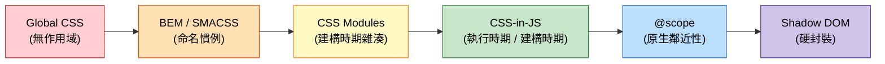

# [FEE-205] CSS 架構與作用域策略

:::info
CSS 預設是全域的 -- 每條規則都可能影響文件中的每個元素。在大規模專案中，這會導致命名衝突（naming collisions）、非預期的覆寫，以及對修改共用樣式表的恐懼。過去二十年來，多種作用域策略（scoping strategies）應運而生，從命名慣例（BEM）到建構工具方案（CSS Modules）、執行時期抽象（CSS-in-JS），再到原生瀏覽器功能（`@scope`、Shadow DOM）。正確的策略取決於脈絡：團隊規模、框架選擇、效能需求和主題化需求都會影響決策。
:::

## 背景

CSS 於 1996 年設計用於文件（document）樣式化，而非應用程式。在文件脈絡中，全域樣式是一個特性 -- 你定義 `h1 { color: navy }` 一次，文件中的每個標題都會套用。這對學術論文和早期網頁來說很優雅，但當網路轉向複雜的、基於元件的應用程式時，就成了負擔。

到 2000 年代中期，大型網頁應用程式面臨一個反覆出現的問題：**命名衝突**。兩個開發者在不同檔案中寫下 `.button { ... }` 會在不知情的情況下覆寫彼此的樣式。層疊（cascade）的設計目的是在文件中優雅地解決衝突，卻在應用程式中成為不可預測行為的根源。團隊訴諸越來越具體的選擇器、`!important` 宣告和行內樣式 -- 這些都讓樣式表更難維護。

社群以**命名慣例**回應。2009 年，Yandex 推出了 **BEM**（Block Element Modifier），這是一種嚴格的命名模式（`block__element--modifier`），透過紀律消除衝突。大約同一時期，Jonathan Snook 發表了 **SMACSS**（Scalable and Modular Architecture for CSS），Harry Roberts 開發了 **ITCSS**（Inverted Triangle CSS）。這些方法論為大型程式碼庫帶來了秩序，但依賴人為紀律 -- 沒有任何東西能阻止開發者違反慣例。

2015 年，Glen Maddern 和 Mark Dalgleish 創建了 **CSS Modules**，將作用域從人為慣例轉移到建構工具的強制執行。CSS Modules 在建構時期生成唯一的類別名稱（`.button` 變成 `._button_1a2b3`），保證不會衝突且無需命名紀律。這是一個關鍵轉變：由工具鏈而非開發者來強制執行作用域。

同年，Christopher Chedeau 在 NationJS 的影響力演講 "CSS in JS" 激發了一波函式庫浪潮 -- **styled-components**（2016）、**Emotion**（2017）-- 將樣式與元件邏輯在 JavaScript 中共置。這些提供了動態樣式、自動關鍵 CSS 擷取和真正的封裝，但引入了執行時期開銷。

鐘擺再次擺動。**Tailwind CSS**（2017）普及了工具類優先（utility-first）的 CSS，完全消除自定義類別名稱，改為在標記中直接使用可組合的工具類別。建構時期的 CSS-in-JS 函式庫如 **vanilla-extract**（2021）和 **Linaria** 提供了 CSS-in-JS 的開發體驗，卻沒有執行時期成本。

最近，平台本身正在追趕。**CSS nesting**（Baseline 2024）消除了對 Sass/Less 巢狀的需求。**`@scope`**（Baseline 2025 年底）提供原生的基於鄰近性（proximity-based）的作用域。**`@layer`**（Baseline 2022）給予對層疊排序的明確控制。需要工具才能做到的事和瀏覽器原生提供的功能之間的差距正在快速縮小。

## 設計思維

### 為什麼 CSS 沒有內建作用域

CSS 是為文件網路設計的，其中全域是特性而非缺陷。單一樣式表應該能一致地為整個文件設定樣式。層疊 -- CSS 中的 "C" -- 是一種有意的機制，用於在多條規則針對同一元素時解決衝突。在文件的世界裡，這運作得很漂亮。

問題出現在網路成為應用程式平台之後。應用程式由元件構成 -- 自包含的單元，不應該將樣式洩漏到兄弟或祖先。CSS 沒有元件邊界的概念。每個選擇器都在完整的文件樹上運作。CSS 的文件模型與網路的元件模型之間的不匹配，是隨後每種作用域策略的根本原因。

### 鐘擺效應：從預處理器到 CSS-in-JS 再回歸

CSS 作用域策略的歷史遵循一個清晰的鐘擺模式：

**預處理器時代（2006-2012）。** Sass（2006）和 Less（2009）引入了巢狀、變數和 mixin。巢狀給人作用域的錯覺（`.card { .title { ... } }` 看起來是被包含的），但它編譯成的後代選擇器仍然是全域的。預處理器解決了撰寫人體工學但非作用域問題。

**命名慣例時代（2009-2015）。** BEM、SMACSS 和 ITCSS 透過人為紀律提供作用域。它們在嚴格執行的團隊中運作良好，但不提供工具保證。一個違反的慣例就可能導致層疊的樣式錯誤。

**CSS-in-JS 時代（2014-2020）。** styled-components 和 Emotion 等函式庫將樣式移入 JavaScript，在執行時期生成唯一的類別名稱。這徹底解決了作用域問題，但引入了執行時期效能開銷、更大的打包大小，並使伺服器端渲染更加複雜。Mark Dalgleish 的 "A Unified Styling Language"（2017）闡述了為什麼 CSS-in-JS 重要：作用域樣式、關鍵 CSS 擷取，以及樣式和邏輯的統一語言。

**工具類優先和建構時期時代（2017 至今）。** Tailwind CSS 完全繞過了作用域問題 -- 沒有自定義類別名稱可以衝突。建構時期的 CSS-in-JS（vanilla-extract、Linaria）保留了 CSS-in-JS 的開發體驗，卻沒有執行時期成本。

**原生 CSS 時代（2022 至今）。** `@layer`（2022）、CSS nesting（2024）和 `@scope`（2025）將作用域能力直接帶入瀏覽器。對基於工具的作用域的需求正在減少，儘管建構時期方案在型別安全和開發體驗方面仍然有價值。

### 框架如何解決作用域問題

每個主要框架都對作用域問題採取了不同的方法：

**Vue `<style scoped>`。** Vue 的單檔案元件（SFC）編譯器為元件模板中的每個元素添加唯一的 data 屬性（如 `data-v-f3f3eg9`），然後改寫每個 CSS 選擇器以包含該屬性（`.title` 變成 `.title[data-v-f3f3eg9]`）。這是透過屬性選擇器的編譯時期作用域。對開發者來說是透明的，但有特異性（specificity）成本 -- 屬性選擇器增加特異性，且子元件的根節點會受到父元件作用域樣式的影響。

**Angular ViewEncapsulation。** Angular 預設使用 `Emulated` 封裝，運作方式類似 Vue -- 生成唯一屬性（`_ngcontent-abc-1`）並改寫選擇器。Angular 也支援 `ShadowDom` 封裝（使用真正的 Shadow DOM 進行瀏覽器原生隔離）和 `None`（完全停用封裝）。

**Svelte。** Svelte 的編譯器在建構時期生成唯一的類別雜湊（class hash），並將其添加到元素和選擇器上。未使用的樣式在編譯期間被偵測並移除。Svelte 的方法是純粹的編譯時期，零執行時期開銷。

**React。** React 不提供內建的作用域機制。生態系統填補了這個空白：CSS Modules（建構時期類別名稱雜湊）、styled-components/Emotion（執行時期 CSS-in-JS）、vanilla-extract（建構時期 CSS-in-TS）或 Tailwind CSS（工具類別）。這種缺乏觀點既是 React 的靈活性也是其複雜性 -- 團隊必須選擇並執行一種策略。

**Web Components（Shadow DOM）。** Shadow DOM 提供最強形式的封裝：shadow root 內的樣式不會洩漏出去，外部樣式也不會穿透進來（繼承屬性和 CSS 自訂屬性除外）。這是真正的瀏覽器原生作用域，但它使主題化更困難 -- 你無法從外部為 shadow DOM 內部設定樣式，除非透過明確的 CSS 自訂屬性掛鉤或 `::part()` 選擇器。

### 選擇策略

沒有普遍正確的作用域策略。決策取決於脈絡：

- **小團隊、單一應用、工具類優先文化**：Tailwind CSS 透過移除自定義類別名稱來消除作用域問題。
- **具有多個消費者的設計系統**：CSS Modules 或 vanilla-extract 提供有保證的作用域和型別安全。
- **具有全域 CSS 的遺留程式碼庫**：BEM 作為遷移路徑，`@layer` 排序遺留和新樣式，逐步採用 `@scope`。
- **Web Components / 微前端**：Shadow DOM 提供獨立部署單元之間的硬隔離邊界。
- **效能關鍵路徑**：避免執行時期 CSS-in-JS；偏好建構時期方案（CSS Modules、vanilla-extract、Tailwind）或原生 CSS（`@scope`、nesting）。

## 視覺化

### 作用域光譜：從全域到完全隔離



**由左至右：隔離程度遞增。** Global CSS 沒有作用域 -- 每條規則在任何地方都適用。BEM 透過人為紀律增加作用域。CSS Modules 透過工具強制作用域。CSS-in-JS 為每個元件生成唯一識別碼。`@scope` 提供原生的基於鄰近性的邊界。Shadow DOM 建立外部樣式無法跨越的硬封裝邊界。

## 範例

### 1. 卡片元件的 BEM 命名

```css
/* Block（區塊） */
.card {
  border: 1px solid #e0e0e0;
  border-radius: 8px;
  overflow: hidden;
}

/* Elements（元素 -- 區塊的組成部分） */
.card__header {
  padding: 1rem;
  border-bottom: 1px solid #e0e0e0;
}

.card__title {
  font-size: 1.25rem;
  font-weight: 600;
  margin: 0;
}

.card__body {
  padding: 1rem;
}

.card__footer {
  padding: 1rem;
  border-top: 1px solid #e0e0e0;
  display: flex;
  justify-content: flex-end;
  gap: 0.5rem;
}

/* Modifiers（修飾符 -- 區塊的變體） */
.card--featured {
  border-color: #1565c0;
  box-shadow: 0 2px 8px rgba(21, 101, 192, 0.15);
}

.card--compact .card__body {
  padding: 0.5rem;
}
```

```html
<article class="card card--featured">
  <div class="card__header">
    <h2 class="card__title">精選文章</h2>
  </div>
  <div class="card__body">
    <p>卡片內容放在這裡。</p>
  </div>
  <div class="card__footer">
    <button class="btn btn--secondary">取消</button>
    <button class="btn btn--primary">閱讀更多</button>
  </div>
</article>
```

BEM 透過命名紀律提供作用域。`.card__title` 選擇器不太可能與 `.nav__title` 衝突，因為區塊名稱是類別的一部分。關鍵規則：絕不深層巢狀 BEM 選擇器 -- `.card__header__title__icon` 是需要新區塊的信號。

### 2. 搭配打包工具的 CSS Modules

```css
/* Card.module.css */
.root {
  border: 1px solid #e0e0e0;
  border-radius: 8px;
  overflow: hidden;
}

.title {
  font-size: 1.25rem;
  font-weight: 600;
  composes: heading from './typography.module.css';
}

.body {
  padding: 1rem;
}

.featured {
  composes: root;
  border-color: #1565c0;
  box-shadow: 0 2px 8px rgba(21, 101, 192, 0.15);
}
```

```jsx
// Card.jsx
import styles from './Card.module.css';

function Card({ title, children, featured }) {
  return (
    <article className={featured ? styles.featured : styles.root}>
      <h2 className={styles.title}>{title}</h2>
      <div className={styles.body}>{children}</div>
    </article>
  );
}
```

在建構時期，打包工具將 `.title` 轉換為類似 `._title_x7k2a_1` 的東西 -- 此檔案專屬的雜湊。`composes` 關鍵字讓你在模組之間共享樣式而不重複。你寫簡單、可讀的類別名稱（`.title`、`.body`），工具鏈保證唯一性。

### 3. 原生 @scope 規則

```css
/* Scoping root（作用域根）：.card
   Scoping limit（作用域限制）：.card-actions（樣式在此子樹之前停止） */
@scope (.card) to (.card-actions) {
  :scope {
    border: 1px solid #e0e0e0;
    border-radius: 8px;
    overflow: hidden;
  }

  h2 {
    font-size: 1.25rem;
    font-weight: 600;
    padding: 1rem;
    margin: 0;
  }

  p {
    padding: 0 1rem 1rem;
    margin: 0;
    color: #424242;
  }
}

/* .card-actions 內的樣式不受上面 scope 影響 */
@scope (.card-actions) {
  button {
    padding: 0.5rem 1rem;
    border-radius: 4px;
  }
}
```

```html
<article class="card">
  <h2>文章標題</h2>
  <p>這段文字由第一個 @scope 規則設定樣式。</p>
  <div class="card-actions">
    <!-- 這個 h2 不會被第一個 scope 設定樣式 -->
    <button>閱讀更多</button>
  </div>
</article>
```

`@scope` 規則在 CSS 中原生提供基於鄰近性的作用域。「甜甜圈作用域」（donut scope）模式（`@scope (.card) to (.card-actions)`）建立一個邊界，樣式在 `.card` 內套用但在 `.card-actions` 之前停止。這是一種全新的能力 -- BEM 和 CSS Modules 都無法表達「為這個子樹設定樣式但不包括那個巢狀子樹」。與 Shadow DOM 不同，`@scope` 不會建立封裝邊界；外部樣式仍然可以滲入，但鄰近性作用域意味著最近的作用域獲勝。

## 常見錯誤

### 1. 在同一專案中不一致地混用作用域策略

**錯誤：** 在 header 中使用 BEM，sidebar 中使用 CSS Modules，footer 中使用 Tailwind，modal 中使用 styled-components -- 全在同一個應用程式中：

```jsx
// Header: BEM
<header class="header__nav header__nav--dark">

// Sidebar: CSS Modules
<aside className={styles.sidebar}>

// Footer: Tailwind
<footer class="flex items-center justify-between p-4 bg-gray-100">

// Modal: styled-components
<StyledModal isOpen={open}>
```

每種作用域策略有不同的特異性特徵、不同的除錯工作流程和不同的心智模型。混用它們使得無法預測衝突時哪些樣式勝出，且新進開發者的上手變得痛苦。

**修正：** 為專案選擇一種主要的作用域策略。如果必須使用多於一種（例如，應用程式碼使用 Tailwind + 共用元件庫使用 CSS Modules），清楚地記錄邊界並使用 `@layer` 控制優先順序。

### 2. 當 CSS Modules 就足夠時過度使用 Shadow DOM 封裝

**錯誤：** 在單一應用程式中對內部元件使用 Shadow DOM：

```js
class InternalCard extends HTMLElement {
  constructor() {
    super();
    this.attachShadow({ mode: 'open' });
    // 現在主題化需要為每個值使用 CSS 自訂屬性
    // 全域設計代幣無法觸及此元件
    // 第三方 CSS（字型、重設）必須在內部複製
  }
}
```

Shadow DOM 是為硬隔離邊界設計的 -- 分發給未知消費者的 web components、微前端邊界、可嵌入的小工具。對於單一應用程式內的元件，Shadow DOM 使主題化、全域重設和共享設計代幣（design tokens）變得不必要地困難。

**修正：** 對應用程式內部元件使用 CSS Modules、`@scope` 或框架原生作用域（Vue scoped、Svelte）。將 Shadow DOM 保留給真正需要在未知樣式脈絡中生存的元件。

### 3. BEM 過度深層巢狀

**錯誤：** 將 DOM 層級編碼到 BEM 名稱中：

```css
/* 深層巢狀：BEM 名稱反映 DOM 樹 */
.card__header__title__icon--large { ... }
.card__body__content__paragraph--highlighted { ... }
```

這違背了 BEM 的目的。長名稱難以閱讀，且它們將 CSS 耦合到特定的 DOM 結構。如果重構 HTML，每個類別名稱都必須改變。

**修正：** 扁平化 BEM。元素屬於區塊，而非其他元素：

```css
/* 扁平：所有元素都是區塊的直接子項 */
.card__title-icon--large { ... }
.card__highlight { ... }
```

如果區塊的某個部分複雜到需要自己的巢狀元素，它應該成為一個獨立的區塊。

### 4. 在效能關鍵路徑中使用執行時期 CSS-in-JS 卻不測量

**錯誤：** 在效能關鍵路徑中（列表、動畫、頻繁重新渲染）使用執行時期 CSS-in-JS（styled-components、Emotion）卻不進行效能分析：

```jsx
// 這在每次渲染時生成並注入 CSS
const AnimatedItem = styled.div`
  transform: translateY(${props => props.offset}px);
  opacity: ${props => props.visible ? 1 : 0};
`;

// 在虛擬化列表中渲染 1000 次
{items.map(item => (
  <AnimatedItem offset={item.offset} visible={item.visible} />
))}
```

執行時期 CSS-in-JS 函式庫序列化樣式、雜湊它們，並在每次渲染時注入 `<style>` 標籤。對少數元件來說這可以忽略；對數百個動態元件來說，可能造成可測量的卡頓（jank）。

**修正：** 先進行效能分析。如果執行時期開銷可測量，切換到建構時期替代方案（vanilla-extract、Linaria）或使用 CSS 自訂屬性處理動態值：

```css
/* 靜態 CSS -- 在建構時期生成一次 */
.animated-item {
  transform: translateY(var(--offset));
  opacity: var(--visible);
  transition: transform 0.2s, opacity 0.2s;
}
```

```jsx
// 透過自訂屬性傳遞動態值 -- 無執行時期 CSS 生成
<div
  className="animated-item"
  style={{ '--offset': `${item.offset}px`, '--visible': item.visible ? 1 : 0 }}
/>
```

### 5. 未使用 @layer 排序第三方與應用程式 CSS

**錯誤：** 匯入第三方 CSS（元件庫、重設）卻沒有層（layer）排序，然後與特異性作戰：

```css
/* 第三方重設 */
@import 'normalize.css';

/* 第三方元件庫 */
@import 'some-ui-lib/styles.css';

/* 你的應用程式樣式 */
.button { background: navy; }  /* 可能輸給函式庫的 .button */
```

沒有 `@layer`，層疊順序取決於來源順序和特異性。第三方樣式經常使用高特異性選擇器，不用 `!important` 就很難覆寫。

**修正：** 使用 `@layer` 宣告明確的層疊順序：

```css
/* 宣告層順序：後面的層獲勝 */
@layer reset, third-party, app, overrides;

@import 'normalize.css' layer(reset);
@import 'some-ui-lib/styles.css' layer(third-party);

@layer app {
  .button { background: navy; }  /* 總是勝過第三方 */
}

@layer overrides {
  /* 緊急覆寫放在這裡 */
}
```

## 相關 FEE

| FEE | 關聯 |
|-----|------|
| [FEE-200 CSS 與排版系統概覽](./200.md) | 母概覽。作用域策略是 FEE-200 描述的 CSS 格局中的關鍵架構關注點。 |
| [FEE-201 層疊、特異性與繼承](./201.md) | 層疊是作用域重要的原因。理解特異性對於理解不同作用域策略為何產生不同的特異性特徵至關重要（BEM = 單一類別、CSS Modules = 單一類別、Vue scoped = 類別 + 屬性、Shadow DOM = 隔離的層疊）。 |
| [FEE-206 現代 CSS 框架](./206.md) | Tailwind、Bootstrap 等框架和元件庫各自嵌入了一種作用域哲學。FEE-206 探討這些框架；FEE-205 提供架構理論基礎。 |
| [FEE-500 元件架構與設計模式](../Component Architecture and Design Patterns/500.md) | 元件架構決定作用域需求。設計系統、微前端和元件庫各自需要不同的隔離等級。 |

## 參考資料

- [MDN: @scope](https://developer.mozilla.org/en-US/docs/Web/CSS/Reference/At-rules/@scope) -- `@scope` at-rule 的參考文件，包括 scoping root、scoping limit 和 donut scope 模式
- [MDN: CSS Nesting](https://developer.mozilla.org/en-US/docs/Web/CSS/Guides/Nesting) -- 原生 CSS 巢狀指南、`&` 巢狀選擇器和特異性影響
- [W3C CSS Scoping Module Level 1](https://www.w3.org/TR/css-scoping-1/) -- W3C 規範，定義 CSS 的作用域和封裝機制，包括 Shadow DOM 作用域
- [W3C CSS Nesting Module Level 1](https://www.w3.org/TR/css-nesting-1/) -- 原生 CSS 巢狀語法和語意的規範
- [CSS-Tricks: BEM 101](https://css-tricks.com/bem-101/) -- Block Element Modifier 命名慣例的介紹、其理論基礎和實際範例
- [Mark Dalgleish, "A Unified Styling Language" (2017)](https://medium.com/seek-blog/a-unified-styling-language-d0c208de2660) -- 有影響力的文章，闡述為什麼 CSS-in-JS 重要：作用域樣式、關鍵 CSS 和樣式與邏輯的統一語言
- [Tailwind CSS Documentation](https://tailwindcss.com/docs) -- 工具類優先 CSS 框架的官方文件，包括避免自定義類別名稱的理論基礎
- [Vue.js SFC CSS Features](https://vuejs.org/api/sfc-css-features.html) -- Vue 的 `<style scoped>` 文件，data-attribute 改寫機制和 `<style module>`
- [vanilla-extract](https://vanilla-extract.style/) -- TypeScript 中的零執行時期樣式表，提供型別安全、本地作用域的樣式，在建構時期生成
- [Smashing Magazine: CSS @scope -- An Alternative to Naming Conventions and Heavy Abstractions (2026)](https://www.smashingmagazine.com/2026/02/css-scope-alternative-naming-conventions/) -- 使用 `@scope` 作為 BEM 和 CSS Modules 作用域原生替代方案的實用指南
