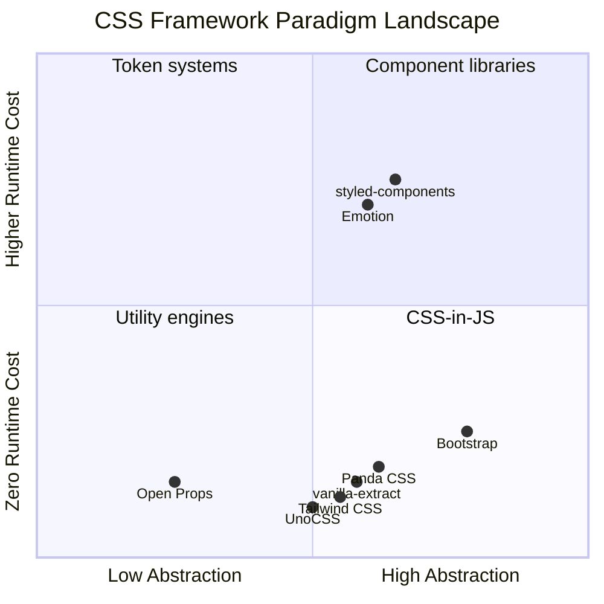

# [FEE-206] 現代 CSS 框架

:::info
CSS 框架（CSS frameworks）將底層樣式決策抽象化，讓團隊能更快交付一致、響應式的 UI。目前的生態已分化為不同典範 -- 工具優先（utility-first）的 Tailwind CSS、元件導向（component-based）的 Bootstrap、設計令牌驅動（design-token-driven）的 Open Props、建構時期 CSS-in-JS（build-time CSS-in-JS）的 Panda CSS，以及原子化/按需生成（atomic/on-demand）的 UnoCSS。每種典範在開發者體驗、效能、彈性與學習曲線之間做出不同取捨。框架選擇取決於脈絡：沒有單一最佳框架，只有最適合特定團隊、專案與設計系統成熟度的框架。
:::

## 背景

在網路發展的大部分歷史中，開發者都是手寫 CSS。這對小型網站可行，但無法良好擴展。隨著應用程式成長，團隊反覆遇到相同問題：不一致的間距、臨時的顏色值、脆弱的響應式斷點，以及跨元件重複的工具模式。每個專案都在重新發明相同的解決方案 -- 格線系統、間距比例、色彩調色盤、響應式斷點對應。

CSS 框架的出現就是為了解決這些問題，將設計決策編碼為可重用的抽象。**Blueprint CSS**（2007）和 **960 Grid System**（2008）提供了格線佈局。**Bootstrap**（2011，由 Twitter 發布）更進一步，提供完整的元件庫，包含格線、排版、表單、按鈕和 JavaScript 互動。Bootstrap 成為歷史上最受歡迎的 CSS 框架，驅動數百萬個網站，確立了元件導向典範。

但 Bootstrap 有其局限。其有主見的（opinionated）元件樣式讓每個網站看起來都很類似（「Bootstrap 風格」）。覆寫預設值需要與特異性（specificity）對抗。打包大小很大，因為即使只用了少數元件也會載入全部。框架的 CSS 隨元件數量線性增長。

2017 年，Adam Wathan 發布了 **Tailwind CSS**，引入不同的哲學：不提供預建元件，而是提供可組合成任何設計的低階工具類別（utility classes）。Tailwind 的 `class="flex items-center gap-4 p-6 bg-white rounded-lg shadow"` 在許多專案中完全取代了自訂 CSS。Just-In-Time（JIT）編譯器（v2.1，後來在 v3 成為預設）只生成實際使用的工具類別，產出極小的 CSS 打包。Tailwind v4（2025 年 1 月）用 Rust 重寫引擎（「Oxide」引擎），使完整建構加速超過 3.5 倍，並以 CSS 優先配置取代 `tailwind.config.js`。

同時，設計令牌（design token）運動逐漸發展。**Open Props**（2022，由 Google 的 Adam Argyle 建立）採取截然不同的方式：不提供工具類別或元件，而是提供 CSS 自訂屬性（custom properties）-- 用於顏色、間距、排版、緩動等的設計令牌。Open Props 與框架無關（framework-agnostic），可搭配原生 CSS 使用，且不添加任何 JavaScript。

**Panda CSS**（2023，由 Chakra UI 團隊建立）解決了 CSS-in-JS 的效能問題。執行時期的 CSS-in-JS 函式庫（如 styled-components）在瀏覽器中生成樣式，增加額外負擔。Panda CSS 在建構時期提取樣式，產出靜態 CSS 檔案，零執行時期成本，同時保留型別安全（type-safe）、令牌驅動的開發者體驗。

**UnoCSS**（2021，由 Anthony Fu 建立）重新想像了工具 CSS 引擎本身。UnoCSS 不是一個帶有內建工具的框架，而是一個具備預設系統（preset system）的引擎。它可以模擬 Tailwind、Windi CSS、Bootstrap 工具，或完全自訂的工具集。不需解析或 AST 額外負擔，據報告比 Tailwind JIT（v3 時代）快 5 倍，體積僅約 6KB。

State of CSS 2024 調查反映了這種分化：Tailwind CSS 以 37% 的活躍使用率領先，Bootstrap 以 21.6% 緊隨其後，而值得注意的是，有相當比例的開發者現在完全不使用 CSS 框架 -- 依賴原生 CSS 功能如 Grid、自訂屬性和容器查詢（container queries）。

## 設計思維

### 為什麼產業從手寫 CSS 轉向框架

四股力量驅動了 CSS 框架的採用：

**一致性（Consistency）。** 手寫 CSS 在團隊中產生不一致的結果。一個開發者用 `padding: 12px`，另一個用 `padding: 0.75rem`，第三個用 `padding: 10px`。框架強制使用受約束的值集合 -- Tailwind 的預設間距比例（`p-1` = 0.25rem、`p-2` = 0.5rem、`p-3` = 0.75rem）消除了任意值。

**設計系統執行（Design system enforcement）。** 設計系統定義視覺約束（色彩調色盤、字型比例、間距）。沒有框架支持，執行依賴程式碼審查和文件。框架將這些約束編碼到配置中 -- Tailwind 的 `theme`、Panda CSS 的 `tokens`、Open Props 的自訂屬性 -- 讓違規在程式碼中清晰可見。

**開發速度（Velocity）。** 從頭撰寫響應式佈局很慢。Tailwind 中的 `class="grid grid-cols-1 md:grid-cols-3 gap-6"` 在三秒內取代了一個媒體查詢、一個格線宣告和一個間距宣告。元件框架如 Bootstrap 更進一步：`<div class="card">` 立即提供完整、可存取的卡片模式。

**響應式工具（Responsive utilities）。** 每個框架都提供響應式斷點系統。沒有框架，開發者手動撰寫媒體查詢，經常在程式碼庫中使用不一致的斷點值。框架的響應式前綴（Tailwind 的 `md:`、`lg:`；Bootstrap 的 `col-md-*`）標準化了響應式行為。

### 典範取捨

每種框架典範做出不同的取捨：

**工具優先（Tailwind CSS、UnoCSS）。** 工具類別直接在標記（markup）中組合，無需切換到 CSS 檔案即可快速迭代。取捨是冗長的 HTML -- 複雜元件可能在單一元素上有數十個工具類別。支持者認為這是優點：樣式是明確的、與結構共置的，且永遠不會隱藏在遠處的樣式表中。批評者認為這損害可讀性，使標記在程式碼審查中更難比對（diff）。Tailwind 透過 `@apply` 提取和 JS 框架層的元件抽象來緩解這個問題。

**元件導向（Bootstrap）。** 預建元件提供熟悉的模式和快速原型開發。取捨是有主見的設計：Bootstrap 的 `.card`、`.btn`、`.navbar` 編碼了特定的視覺決策。客製化需要覆寫 Sass 變數或與特異性對抗。擁有獨特設計系統的團隊可能花更多時間覆寫 Bootstrap 而非從頭建構。

**設計令牌驅動（Open Props）。** CSS 自訂屬性提供原始設計原語（design primitives），不強加結構。Open Props 是最彈性的典範 -- 可搭配任何框架、任何方法論、任何建構工具。取捨是需要更多設置：你得到的是令牌，不是元件或工具。你仍然撰寫自己的 CSS，只是用更好的值。這適合想要最大控制權且具有 CSS 專業知識的團隊。

**建構時期 CSS-in-JS（Panda CSS）。** 型別安全的令牌和配方（recipes）提供優秀的開發者體驗，零執行時期成本。取捨是建構複雜度和與建構管線的更緊密耦合。Panda CSS 需要程式碼生成步驟、PostCSS 或打包器插件，以及框架特定的整合。生成的 CSS 是靜態的，因此動態樣式需要 CSS 自訂屬性或執行時期回退。

**原子化/按需生成（UnoCSS）。** 引擎優先的方式提供最大彈性 -- 你可以透過預設複製任何工具框架。取捨是 UnoCSS 是一個元框架（meta-framework）：它需要選擇和配置預設，這對想要有主見預設值的團隊可能會感到不知所措。

### 元框架整合

現代元框架（meta-frameworks）具有一流的 CSS 框架整合：

**Next.js + Tailwind CSS。** 使用 `create-next-app` 建立 Next.js 專案時，Tailwind 是預設的樣式選項。整合是一流的：PostCSS 配置自動完成，CSS 清除（purging）尊重 `app/` 和 `pages/` 目錄，且伺服器元件（server components）無縫運作，因為 Tailwind 生成靜態 CSS。

**Nuxt + UnoCSS。** UnoCSS 以內建 Nuxt 模組（`@unocss/nuxt`）的形式提供。UnoCSS 的創建者 Anthony Fu 是 Nuxt 核心團隊成員，確保深度整合。該模組提供 `.vue` 檔案的自動掃描、更簡潔模板的 attributify 模式，以及透過 `@unocss/preset-icons` 的圖示支援。

**Astro。** Astro 在設計上與框架無關，同等支援 Tailwind CSS、UnoCSS 和原生 CSS。其島嶼架構（island architecture）意味著 CSS 預設按元件作用域化，任何框架的 CSS 方案都能在其島嶼中運作。

**SvelteKit。** SvelteKit 與 Tailwind CSS（透過 `svelte-add`）搭配良好，但也受益於 Svelte 原生的作用域 `<style>` 區塊。許多 SvelteKit 專案使用混合方式：Tailwind 工具用於佈局和間距，原生作用域樣式用於元件特定的視覺細節。

## 視覺化

### 框架典範象限圖



**解讀象限圖。** X 軸衡量抽象層級：Open Props 提供原始令牌（低抽象），而 Bootstrap 提供完整元件（高抽象）。Y 軸衡量執行時期成本：工具優先和建構時期框架聚集在接近零執行時期成本的位置，而執行時期 CSS-in-JS 函式庫（styled-components、Emotion）產生可測量的額外負擔。左下象限（低抽象、零執行時期）代表最輕量的方式；右上象限（高抽象、較高執行時期）代表最有主見的方式。

## 範例

### 同一個卡片元件在三種典範中的實作

#### 1. Tailwind CSS（工具優先）

```html
<article class="max-w-sm rounded-lg border border-gray-200 bg-white shadow-sm
                overflow-hidden">
  
  <div class="p-5">
    <h2 class="mb-2 text-xl font-bold tracking-tight text-gray-900">
      Card Title
    </h2>
    <p class="mb-4 text-sm text-gray-600">
      A brief description of this card's content, demonstrating the
      utility-first approach.
    </p>
    <a
      href="#"
      class="inline-flex items-center rounded-md bg-blue-600 px-4 py-2
             text-sm font-medium text-white hover:bg-blue-700
             focus:outline-none focus:ring-2 focus:ring-blue-500
             focus:ring-offset-2"
    >
      Read more
    </a>
  </div>
</article>
```

每個視覺屬性都在標記中明確可見。不存在自訂 CSS 檔案。Tailwind 編譯器掃描此 HTML 並只生成使用到的類別。響應式變體添加前綴：`md:max-w-md`、`lg:grid-cols-2`。

#### 2. Bootstrap（元件導向）

```html
<article class="card" style="max-width: 24rem;">
  
  <div class="card-body">
    <h2 class="card-title">Card Title</h2>
    <p class="card-text text-muted">
      A brief description of this card's content, demonstrating the
      component-based approach.
    </p>
    <a href="#" class="btn btn-primary">Read more</a>
  </div>
</article>
```

Bootstrap 提供語意化類別名稱（`.card`、`.card-body`、`.btn`）。HTML 簡潔且可讀。視覺細節（圓角、內距、陰影）定義在 Bootstrap 的 Sass 原始碼中，透過 Sass 變數控制：

```scss
// 透過 Sass 變數客製化 Bootstrap 的卡片
$card-border-radius: 0.5rem;
$card-spacer-y: 1.25rem;
$card-spacer-x: 1.25rem;
$card-cap-bg: transparent;
```

#### 3. Panda CSS（建構時期 CSS-in-JS 配方）

```tsx
// card.recipe.ts
import { cva } from '../styled-system/css';

const card = cva({
  base: {
    maxWidth: 'sm',
    borderRadius: 'lg',
    border: '1px solid',
    borderColor: 'gray.200',
    bg: 'white',
    shadow: 'sm',
    overflow: 'hidden',
  },
  variants: {
    size: {
      sm: { maxWidth: 'xs' },
      md: { maxWidth: 'sm' },
      lg: { maxWidth: 'md' },
    },
  },
  defaultVariants: {
    size: 'md',
  },
});

const cardTitle = cva({
  base: {
    mb: '2',
    fontSize: 'xl',
    fontWeight: 'bold',
    letterSpacing: 'tight',
    color: 'gray.900',
  },
});

const cardButton = cva({
  base: {
    display: 'inline-flex',
    alignItems: 'center',
    borderRadius: 'md',
    bg: 'blue.600',
    px: '4',
    py: '2',
    fontSize: 'sm',
    fontWeight: 'medium',
    color: 'white',
    _hover: { bg: 'blue.700' },
    _focusVisible: {
      outline: '2px solid',
      outlineColor: 'blue.500',
      outlineOffset: '2px',
    },
  },
});
```

```tsx
// Card.tsx
import { card, cardTitle, cardButton } from './card.recipe';

function Card({ title, description, size }) {
  return (
    <article className={card({ size })}>
      
      <div className={css({ p: '5' })}>
        <h2 className={cardTitle()}>{title}</h2>
        <p className={css({ mb: '4', fontSize: 'sm', color: 'gray.600' })}>
          {description}
        </p>
        <a href="#" className={cardButton()}>Read more</a>
      </div>
    </article>
  );
}
```

Panda CSS 配方（recipes）定義型別安全的多變體樣式。`cva` 函式在建構時期生成原子 CSS 類別 -- 無執行時期樣式注入。TypeScript 會捕捉無效的令牌值（`color: 'gray.999'` 會報錯）。`variants` 物件建立乾淨的 API：`card({ size: 'lg' })` 對應到正確的原子類別。

### 比較摘要

| 面向 | Tailwind CSS | Bootstrap | Panda CSS |
|------|-------------|-----------|-----------|
| **樣式位置** | HTML class 屬性 | Sass 原始碼 + HTML 類別 | TypeScript 配方檔案 |
| **自訂 CSS 撰寫量** | 極少 | 變數覆寫 | 令牌配置 |
| **型別安全** | 無（字串類別） | 無 | 完整 TypeScript 支援 |
| **打包輸出** | 僅使用到的工具 | 所有匯入的元件 | 僅使用到的原子樣式 |
| **客製化方式** | `tailwind.config` / CSS | Sass 變數 + mixins | 令牌 + 配方定義 |
| **學習曲線** | 工具類別詞彙 | 元件類別名稱 | CSS-in-JS + 令牌概念 |

## 常見錯誤

### 1. 在定義設計系統之前選擇框架

**錯誤做法：** 團隊因為 Tailwind CSS 流行而選擇它，然後發現設計系統使用 4px 間距比例，而 Tailwind 雖然以 4px 為基礎但有特定的命名停靠點。他們在整個專案中與預設值對抗：

```html
<!-- 用任意值對抗 Tailwind 的間距比例 -->
<div class="p-[18px] gap-[22px] mt-[14px]">
```

當大多數類別使用任意值（`[18px]`）時，你已經失去了使用框架所帶來的一致性好處。

**修正方式：** 先定義設計系統令牌（間距比例、色彩調色盤、字型比例、斷點）。然後評估哪個框架最能容納這些令牌。Tailwind 高度可配置；Open Props 提供你可以直接採用的原始令牌；Panda CSS 讓你以型別安全的方式定義令牌。

### 2. 對抗 Tailwind 預設值而非客製化配置

**錯誤做法：** 使用 `!important` 或複雜覆寫來讓 Tailwind 匹配你的設計：

```css
/* 用 !important 覆寫 Tailwind 的顏色 */
.btn-primary {
  background-color: #1a56db !important;
  border-radius: 2px !important;
}
```

這建立了一個與 Tailwind 工具衝突的平行樣式系統，破壞了工具優先模型。

**修正方式：** 在配置中擴展或覆寫 Tailwind 的主題。在 Tailwind v4 中，這在 CSS 中完成：

```css
@import "tailwindcss";

@theme {
  --color-primary: #1a56db;
  --radius-btn: 2px;
}
```

現在 `bg-primary` 和 `rounded-btn` 是一流的工具，可搭配所有 Tailwind 變體使用（`hover:bg-primary`、`md:rounded-btn`）。

### 3. 當 CSS Grid 更簡單時仍用 Bootstrap grid 處理一切

**錯誤做法：** 對不需要 12 欄模型的佈局使用 Bootstrap 的 12 欄格線系統：

```html
<!-- Bootstrap grid 用於簡單的三欄佈局 -->
<div class="container">
  <div class="row">
    <div class="col-md-4">Column 1</div>
    <div class="col-md-4">Column 2</div>
    <div class="col-md-4">Column 3</div>
  </div>
</div>
```

這添加了 container、row 和 column 包裝元素。相同佈局用 CSS Grid 更簡單，且不需要額外標記：

```css
.layout {
  display: grid;
  grid-template-columns: repeat(3, 1fr);
  gap: 1.5rem;
}
```

**修正方式：** 直接使用 CSS Grid 處理自訂佈局。將 Bootstrap 的格線保留用於快速原型開發，或當你確實需要其帶有偏移和排序功能的響應式欄系統時。

### 4. 在同一個專案中使用多個 CSS 框架

**錯誤做法：** 為了 modal 元件添加 Bootstrap、為了工具類別添加 Tailwind、為了動畫添加 Animate.css -- 全部在同一個專案中：

```html
<head>
  <link rel="stylesheet" href="bootstrap.min.css" />     <!-- 227 KB -->
  <link rel="stylesheet" href="tailwind-output.css" />    <!-- variable -->
  <link rel="stylesheet" href="animate.min.css" />        <!-- 80 KB -->
</head>
```

這造成 CSS 膨脹（bloat）、命名衝突（Bootstrap 和 Tailwind 都定義了 `.container`、`.border`、`.shadow`），以及不可預測的層疊行為。除錯變成一場特異性考古學練習。

**修正方式：** 選擇一個主要框架。如果你需要另一個函式庫的特定元件，只提取該元件的 CSS，或在你的主要框架中找到等效方案。如果必須組合框架，使用 `@layer` 控制層疊順序，並仔細地為每個框架命名空間化或作用域化。

### 5. 未測量執行時期 CSS-in-JS 的打包影響

**錯誤做法：** 選擇執行時期 CSS-in-JS 函式庫（styled-components、Emotion）而未測量其對打包大小和渲染效能的影響：

```
Framework JS bundle (gzipped):
  React                    ~45 KB
  styled-components        ~13 KB  (29% overhead)
  Application code         ~80 KB
```

對於伺服器端渲染（server-rendered）的頁面，執行時期函式庫必須在客戶端水合（hydrate）並重新注入樣式，增加了可互動時間（Time to Interactive）。對於頻繁重新渲染的元件，樣式序列化在每次渲染週期都增加 CPU 成本。

**修正方式：** 使用瀏覽器 DevTools 和 Lighthouse 進行效能分析。如果執行時期額外負擔不可接受，遷移到建構時期替代方案：Panda CSS、vanilla-extract 或 Tailwind CSS。這些生成靜態 CSS，零執行時期 JavaScript。

## 相關 FEE

| FEE | 關聯性 |
|-----|--------|
| [FEE-200 CSS & Layout Systems 概覽](./200.md) | 母概覽。現代 CSS 框架是 FEE-200 所描述的 CSS 生態中的主要分類。 |
| [FEE-205 CSS 架構與作用域策略](./205.md) | 每個框架都嵌入一種作用域哲學。Tailwind 消除自訂類別名稱，Bootstrap 使用元件命名空間，Panda CSS 生成原子類別。FEE-205 提供這些選擇背後的架構原理。 |
| [FEE-207 CSS 自訂屬性與主題化](./207.md) | Open Props 完全建立在 CSS 自訂屬性上。Tailwind v4 使用自訂屬性作為其主題。Panda CSS 為動態令牌生成自訂屬性。FEE-207 涵蓋底層自訂屬性機制。 |
| [FEE-900 設計系統](../Design Systems/900.md) | CSS 框架是設計系統的實作層。Tailwind、Panda CSS 和 Open Props 中的令牌配置直接將設計系統決策對應到程式碼。 |

## 參考資料

- [Tailwind CSS Documentation -- Core Concepts: Utility-First Fundamentals](https://tailwindcss.com/docs/utility-first) -- 官方文件說明工具優先哲學、響應式設計、hover/focus 狀態，以及 Tailwind 為何避免元件類別
- [Tailwind CSS v4.0 Release](https://tailwindcss.com/) -- Tailwind v4 搭載 Oxide 引擎（Rust 重寫）、CSS 優先配置、原生級聯層（cascade layers）與註冊自訂屬性
- [Bootstrap 5 Documentation -- Utility API](https://getbootstrap.com/docs/5.3/utilities/api/) -- Bootstrap 基於 Sass 的工具生成系統參考，展示如何程式化地擴展或修改 Bootstrap 的工具類別
- [Open Props](https://open-props.style/) -- 以 CSS 自訂屬性形式提供的次原子（sub-atomic）設計令牌：顏色、間距、排版、緩動等，與框架無關且支援 CDN
- [Panda CSS Documentation](https://panda-css.com/) -- 建構時期、型別安全的 CSS-in-JS，具備設計令牌、配方和模式，由 Chakra UI 團隊建立
- [Panda CSS -- Recipes](https://panda-css.com/docs/concepts/recipes) -- 使用 `cva` 函式的多變體原子配方，靈感來自 Class Variance Authority 和 Stitches
- [UnoCSS -- The Instant On-Demand Atomic CSS Engine](https://unocss.dev/) -- 引擎優先的原子 CSS，具備預設系統、attributify 模式、純 CSS 圖示和零解析架構
- [State of CSS 2024 Survey Results](https://2024.stateofcss.com/en-US) -- 產業調查顯示框架使用趨勢，Tailwind CSS 以 37% 領先，且越來越多開發者不使用框架
- [CSS-Tricks: Open Props and Custom Properties as a System](https://css-tricks.com/open-props-and-custom-properties-as-a-system/) -- 分析使用 CSS 自訂屬性作為設計令牌系統，以 Open Props 為主要範例
- [web.dev: What Do the State of CSS and HTML Surveys Tell Us?](https://web.dev/blog/state-of-css-html-2024) -- Google 對 CSS 調查趨勢的分析，包括向原生 CSS 功能的轉移以及遠離預處理的趨勢
