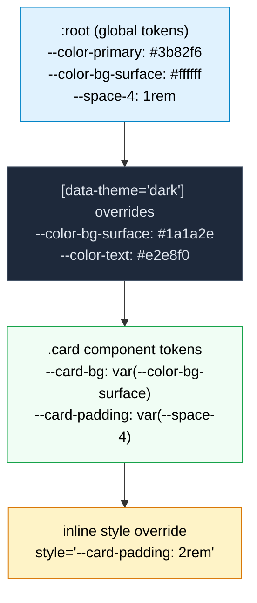

# [FEE-207] CSS 自訂屬性與主題化

:::info
CSS 自訂屬性（CSS custom properties，通常稱為「CSS 變數」）是作者定義的值，以 `--` 前綴宣告並透過 `var()` 函式取用。不同於預處理器變數在建構時期即被編譯消除，自訂屬性在瀏覽器中是即時生效的：它們參與層疊（cascade）、透過 DOM 樹繼承、回應媒體查詢和偽類（pseudo-classes），且可從 JavaScript 讀取與寫入。結合 `@property` 規則（CSS Properties and Values API），加入型別資訊、初始值和繼承控制後，自訂屬性構成了現代主題化系統的基礎。SHOULD 使用自訂屬性作為 design tokens（設計代幣）。SHOULD 使用 `@property` 處理需要動畫的自訂屬性。
:::

## 背景

CSS 從最早期就需要變數。2000 年代後期，預處理器填補了這個空缺。**Sass**（2006）引入 `$variables`，**Less**（2009）引入 `@variables`，**Stylus**（2010）使用無前綴的識別符號。這些工具改變了 CSS 撰寫方式：定義一次色彩調色盤即可在各處引用，消除了困擾樣式表的搜尋替換工作流程。

但預處理器變數有一個根本限制：它們在執行時期不存在。當 Sass 編譯 `$primary: #3b82f6; .btn { color: $primary; }` 時，輸出是 `.btn { color: #3b82f6; }`。變數消失了；瀏覽器只看到解析後的值。它們無法在執行時期改變：當使用者切換深色模式時，編譯後的值早已凍結在樣式表中。

CSS 工作小組很早就認識到這個需求。**CSS Custom Properties for Cascading Variables Module Level 1** 的第一份公開工作草案出現在 2012 年。規範在 2015 年達到候選推薦（Candidate Recommendation），並在 2017 年獲得廣泛的瀏覽器支援。設計刻意保持最小化：自訂屬性就是屬性（它們層疊和繼承），而 `var()` 就是函式（它替換值）。不需要新的語言構造。

自訂屬性解決了執行時期問題，但引入了新的限制：它們是無型別的（untyped）。瀏覽器將每個自訂屬性值視為字串令牌列表。這意味著自訂屬性無法平滑地過渡或動畫化：瀏覽器不知道 `--angle` 持有的是 `<length>`、`<color>` 還是任意字串，因此無法在兩個值之間插值（interpolate），只能在 50% 標記處做離散翻轉。

**CSS Properties and Values API**（CSS Houdini 的一部分）解決了這個缺口。最初僅能透過 JavaScript 的 `CSS.registerProperty()` 方法使用（Chrome 78，2019），後來透過 `@property` at-rule 實現宣告式寫法，並在 2024 年 7 月達到所有主要瀏覽器的 Baseline 支援（依據 web.dev 的公告，見參考資料）。`@property` 讓作者宣告自訂屬性的語法（型別）、初始值和繼承行為，為瀏覽器提供插值、驗證和最佳化所需的型別資訊。

自訂屬性與 `@property` 共同構成了現代 CSS 的執行時期主題化層。設計系統將 token 對應到自訂屬性，主題切換在祖先元素上切換屬性值，動畫平滑地插值具型別的屬性。這個層並未取代預處理器。Sass 在開發者調查中仍是使用率最高的 CSS 工具之一，如今生產環境的 Sass 程式碼庫普遍會從建構過程輸出自訂屬性，而非將每個值都編譯成靜態字面值。兩者是並存的：Sass 處理建構時期的結構，例如 mixin、迴圈與斷點運算，而自訂屬性則承載主題切換與 JavaScript 讀寫的執行時期 token。本文涵蓋這個執行時期層的機制、模式與陷阱。

## 視覺化

### 自訂屬性層疊



**解讀此圖。** 自訂屬性值從一般到特定層疊，就像一般 CSS 屬性一樣。在 `:root` 定義的全域 token 被所有元素繼承。`[data-theme="dark"]` 選擇器為其子樹覆寫特定 token。`.card` 元件以語義 token 定義自己的 token。行內 `style` 屬性提供最高特異性（specificity）的覆寫。在每個層級，只有變更的屬性被重新宣告；其他一切從上層繼承。

## 範例

### 1. 使用自訂屬性的明暗主題切換

```css
/* 全域 token */
:root {
  --color-bg: #ffffff;
  --color-text: #1a1a2e;
  --color-primary: #3b82f6;
  --color-surface: #f8fafc;
  --color-border: #e2e8f0;
  --shadow-sm: 0 1px 2px rgba(0, 0, 0, 0.05);
}

/* 透過屬性覆寫深色主題 */
[data-theme="dark"] {
  --color-bg: #0f172a;
  --color-text: #e2e8f0;
  --color-primary: #60a5fa;
  --color-surface: #1e293b;
  --color-border: #334155;
  --shadow-sm: 0 1px 2px rgba(0, 0, 0, 0.3);
}

/* 透過使用者偏好自動深色模式 */
@media (prefers-color-scheme: dark) {
  :root:not([data-theme="light"]) {
    --color-bg: #0f172a;
    --color-text: #e2e8f0;
    --color-primary: #60a5fa;
    --color-surface: #1e293b;
    --color-border: #334155;
    --shadow-sm: 0 1px 2px rgba(0, 0, 0, 0.3);
  }
}

/* 元件參考 token；不需要主題特定規則 */
body {
  background: var(--color-bg);
  color: var(--color-text);
}

.card {
  background: var(--color-surface);
  border: 1px solid var(--color-border);
  border-radius: 0.5rem;
  padding: 1.5rem;
  box-shadow: var(--shadow-sm);
}

.btn-primary {
  background: var(--color-primary);
  color: var(--color-bg);
  border: none;
  padding: 0.5rem 1rem;
  border-radius: 0.375rem;
  cursor: pointer;
}
```

```html
<button onclick="cycleTheme()">Toggle theme</button>

<script>
  // 在正式環境中，應將這段 IIFE 移到 <head> 中、樣式表繪製之前執行，
  // 讓儲存的主題在第一幀就套用，避免先閃現預設主題再切換。
  (function () {
    const stored = localStorage.getItem('theme');
    if (stored === 'light' || stored === 'dark') {
      document.documentElement.setAttribute('data-theme', stored);
    }
  })();

  function cycleTheme() {
    const root = document.documentElement;
    const current = root.getAttribute('data-theme');
    // light -> dark -> auto（移除屬性，改由 prefers-color-scheme 決定）
    if (current === 'light') {
      root.setAttribute('data-theme', 'dark');
      localStorage.setItem('theme', 'dark');
    } else if (current === 'dark') {
      root.removeAttribute('data-theme');
      localStorage.removeItem('theme');
    } else {
      root.setAttribute('data-theme', 'light');
      localStorage.setItem('theme', 'light');
    }
  }
</script>
```

`data-theme` 屬性方式可搭配 CSS 屬性選擇器使用，且語義明確：屬性描述的是狀態，而非外觀。`cycleTheme()` 會循環經過真正的第三種狀態；第三次點擊會完全移除該屬性，此時 `:root:not([data-theme="light"])` 便會回退到 `prefers-color-scheme`。行內腳本會在繪製之前同步讀取已儲存的選擇；若省略這一步，頁面會先以預設主題渲染一幀，等延遲腳本執行後才閃現為已儲存的主題。完整模式（包含減少動態效果的處理）請見 Argyle, "Building a theme switch component," web.dev (2022)，收錄於參考資料。

### 2. @property 實現漸層角度動畫

```css
@property --gradient-angle {
  syntax: "<angle>";
  initial-value: 0deg;
  inherits: false;
}

@property --color-start {
  syntax: "<color>";
  initial-value: #3b82f6;
  inherits: false;
}

@property --color-end {
  syntax: "<color>";
  initial-value: #8b5cf6;
  inherits: false;
}

.gradient-box {
  --gradient-angle: 45deg;
  --color-start: #3b82f6;
  --color-end: #8b5cf6;
  background: linear-gradient(var(--gradient-angle), var(--color-start), var(--color-end));
  transition: --gradient-angle 0.8s ease, --color-start 0.6s ease, --color-end 0.6s ease;
  width: 300px;
  height: 200px;
  border-radius: 1rem;
}

.gradient-box:hover {
  --gradient-angle: 225deg;
  --color-start: #f97316;
  --color-end: #ec4899;
}

/* 持續旋轉動畫 */
@keyframes spin-gradient {
  to {
    --gradient-angle: 360deg;
  }
}

.gradient-box--spinning {
  animation: spin-gradient 3s linear infinite;
}
```

沒有 `@property` 宣告，漸層在 hover 時會瞬間跳變，因為瀏覽器無法插值無型別的自訂屬性。`--gradient-angle`、`--color-start` 和 `--color-end` 都是在 `.gradient-box` 自身上設定並使用，這也是為什麼 `inherits: false` 在這裡是安全的（不安全的情況請見〈深入探討〉）。有了 `@property`，角度平滑旋轉，顏色在色彩空間中混合。

### 3. 透過自訂屬性的 JS 與 CSS 溝通（滑鼠追蹤效果）

```css
.spotlight {
  --mouse-x: 50%;
  --mouse-y: 50%;
  position: relative;
  width: 400px;
  height: 300px;
  background: var(--color-surface, #1e293b);
  border-radius: 1rem;
  overflow: hidden;
}

.spotlight::after {
  content: "";
  position: absolute;
  inset: 0;
  background: radial-gradient(
    circle at var(--mouse-x) var(--mouse-y),
    rgba(59, 130, 246, 0.15) 0%,
    transparent 60%
  );
  pointer-events: none;
}
```

```javascript
const spotlight = document.querySelector('.spotlight');
let rafId = null;

spotlight.addEventListener('mousemove', (e) => {
  const rect = spotlight.getBoundingClientRect();
  const x = ((e.clientX - rect.left) / rect.width) * 100;
  const y = ((e.clientY - rect.top) / rect.height) * 100;

  // 取消任何待處理的幀，確保只套用最新的座標。
  if (rafId) cancelAnimationFrame(rafId);
  rafId = requestAnimationFrame(() => {
    spotlight.style.setProperty('--mouse-x', `${x}%`);
    spotlight.style.setProperty('--mouse-y', `${y}%`);
    rafId = null;
  });
});

// 讀取自訂屬性值
const styles = getComputedStyle(spotlight);
console.log(styles.getPropertyValue('--mouse-x')); // "50%"
```

JavaScript 只寫入兩個資料值：`--mouse-x` 和 `--mouse-y`。漸層運算留在 CSS 中，因此更換視覺處理方式完全不需要碰觸事件處理常式。將 JavaScript 寫入的屬性限定在真正需要它的最內層元素上，就像本例所做的：若在樹的高處寫入一個會繼承的自訂屬性，會迫使每個可能使用它的後代都重新計算樣式，因此將 `--mouse-x` 直接寫在 `.spotlight` 而非 `:root` 上，能讓這次重新計算侷限在局部。

## 最佳實踐

**將全域 token 限定在 `:root`，元件專屬屬性限定在元件選擇器上。** `:root` SHOULD 只放置真正的設計 token（顏色、間距比例、排版），這些是整份文件共用的值。元件內部屬性如 `--card-padding` 或 `--modal-z-index` MUST 宣告在元件自身的選擇器上。將所有屬性都放在 `:root` 會污染全域命名空間，並使每個後代都繼承到它永遠用不到的屬性。

**使用 `@property` 為需要動畫的自訂屬性註冊具體型別。** 任何參與 CSS transition 或 `@keyframes` 動畫的自訂屬性，MUST 宣告 `syntax`、`inherits` 和 `initial-value`。若未註冊，瀏覽器將值視為不透明字串，無法在兩個值之間插值：屬性會在 50% 標記處離散跳變，而非平滑過渡。

**在 `var()` 中為無法保證繼承的屬性提供回退值。** 當屬性可能未在祖先元素定義時，`var(--token, 回退值)` SHOULD 提供安全的預設值。另一種方式是透過 `@property` 宣告 `initial-value`。未定義且無回退值的自訂屬性會解析為保證無效值（guaranteed-invalid value）；規範將此值視為在計算值階段（computed-value time）無效，而非空字串，接著回退到該屬性自身的初始值或其繼承值。這幾乎不會是作者的本意，因此明確提供回退值或透過 `@property` 註冊，能讓失效行為變得可預測，而非意外發生。

**使用偽私有屬性（pseudo-private properties）保護元件的內部預設值，避免被意外覆寫。** 以底線慣例為內部回退屬性加上前綴，例如 `--_bg`，並在使用前將公開 token 解析進去：

```css
.btn {
  --_bg: var(--btn-bg, #3b82f6);
  background: var(--_bg);
}
```

Lea Verou 將這種手法稱為偽私有屬性技巧（見參考資料）。它把元件作者希望消費者設定的屬性（`--btn-bg`）與元件自身規則所使用的屬性（`--_bg`）分開，因此層疊中其他地方設定的無關 `--_bg` 就無法覆蓋元件的內部運算。

**以 `prefers-color-scheme` 媒體查詢搭配 `data-theme` 屬性實作深色模式。** 對 `:root:not([data-theme="light"])` 使用 `@media (prefers-color-scheme: dark)`，以預設遵從系統偏好。SHOULD 同時加入 `[data-theme="dark"]` 選擇器，讓 JavaScript 可以明確覆寫偏好。這個模式支援淺色、深色與自動三種狀態，且無需重複元件規則。純色彩情境下可用單一宣告涵蓋每個 token 的 `light-dark()`，見下方〈設計思維〉。

## 設計思維

### 為什麼 CSS 需要執行時期變數

預處理器變數解決了撰寫問題：定義一次，到處使用。但無法解決執行時期問題。以深色模式為例：

```scss
// Sass 方式：兩組獨立的規則集
$bg-light: #ffffff;
$bg-dark: #1a1a2e;

.card { background: $bg-light; }

@media (prefers-color-scheme: dark) {
  .card { background: $bg-dark; }
}
```

這對一個元件的一個屬性有效。但實際的設計系統有數百個 token 應用於數百個元件。Sass 方式要求在媒體查詢內複製每個使用主題相關值的規則。樣式表隨著 token 數量與元件數量的乘積線性增長。

CSS 自訂屬性將此收斂為單一覆寫點：

```css
:root {
  --color-bg-surface: #ffffff;
  --color-text-primary: #1a1a2e;
}

@media (prefers-color-scheme: dark) {
  :root {
    --color-bg-surface: #1a1a2e;
    --color-text-primary: #e2e8f0;
  }
}

.card { background: var(--color-bg-surface); color: var(--color-text-primary); }
```

每個引用 `--color-bg-surface` 的元件在媒體查詢匹配時自動更新。無需重複。無需逐元件覆寫。

這個優勢同樣適用於任何執行時期條件：視窗大小、使用者偏好（減少動態效果、高對比）、元件狀態（hover、focus、disabled）、語系調整，或 JavaScript 驅動的狀態變更。

### 原生主題化基礎元件：color-scheme 與 light-dark()

上面的 token 模式出現在兩項現已涵蓋大部分色彩情境的功能之前。`:root` 上的 `color-scheme: light dark` 會告訴瀏覽器該頁面支援哪些色彩配置，讓瀏覽器繪製的介面（表單控制項、捲軸等）自行切換為深色樣式。若省略這項宣告，即使頁面的自訂屬性主題是深色的，捲軸與 `<input>` 背景仍會維持淺色，讀者在範例一的純屬性模式中會看到這種明顯不一致。

`light-dark()` 自 2024 年 5 月起已達 Baseline，它接收一個 token 原本需要的兩個值，並依目前作用中的色彩配置在兩者間選擇：

```css
:root {
  color-scheme: light dark;
  --color-bg: light-dark(#ffffff, #0f172a);
  --color-text: light-dark(#1a1a2e, #e2e8f0);
}
```

這將範例一中成對的 `:root` / `[data-theme="dark"]` / `@media (prefers-color-scheme: dark)` 區塊，收斂成每個 token 一行宣告。`light-dark()` 仍可與 `data-theme` 覆寫並存：在 `[data-theme="light"]` / `[data-theme="dark"]` 上明確設定 `color-scheme: light` 或 `color-scheme: dark`，即可不論系統偏好強制套用其中一個分支。當 token 的差異不只在色彩（例如間距、字重、邊框樣式），或切換需要「讓系統決定」以外的第三種狀態（例如強制高對比模式）時，範例一的屬性驅動模式仍是正確的工具。

### @property 作為字串與型別之間的橋樑

沒有 `@property`，自訂屬性對瀏覽器的動畫引擎是不透明的。考慮動畫化一個漸層角度：

```css
/* 這不會平滑動畫：瀏覽器看到的是字串，不是數字 */
.element {
  --angle: 0deg;
  background: linear-gradient(var(--angle), #3b82f6, #8b5cf6);
  transition: --angle 1s;
}
.element:hover {
  --angle: 180deg;
}
```

瀏覽器無法在 `0deg` 和 `180deg` 之間插值，因為它不知道 `--angle` 是一個角度。它將其視為字串並執行離散替換。

`@property` 提供了缺失的型別資訊：

```css
@property --angle {
  syntax: "<angle>";
  initial-value: 0deg;
  inherits: false;
}

.element {
  --angle: 0deg;
  background: linear-gradient(var(--angle), #3b82f6, #8b5cf6);
  transition: --angle 1s ease;
}
.element:hover {
  --angle: 180deg;
}
```

現在瀏覽器知道 `--angle` 是一個 `<angle>`，可以從 `0deg` 平滑插值到 `180deg`。這讓純 CSS 中的漸層角度過渡成為可能；瀏覽器將漸層視為圖片，先前完全無法對其做過渡動畫。

`@property` 規則接受三個描述符（descriptors）：

- **`syntax`**：CSS 值型別。常見型別包含 `"<color>"`、`"<length>"`、`"<number>"`、`"<angle>"`、`"<percentage>"`、`"<length-percentage>"`、`"<integer>"`、`"<image>"`、`"<url>"`、`"<transform-function>"`、`"<custom-ident>"`、`"<time>"` 和 `"<resolution>"`，可搭配 `|`（互斥）組合符以及 `+`（以空白分隔的清單）／`#`（以逗號分隔的清單）等重複符號使用，或以 `"*"` 表示接受任何值的通用型別。完整文法請見 MDN 的 `@property` 參考文件（見參考資料）。
- **`initial-value`**：屬性未設定時使用的預設值（除非 syntax 為 `"*"`，否則為必填）
- **`inherits`**：`true` 或 `false`，控制屬性是否從父元素繼承

### 框架透過自訂屬性實現主題化

現代 CSS 框架已收斂於以自訂屬性作為其主題化層：

**Tailwind CSS v4** 將 CSS 優先設定變成預設方式，以 `@theme` 區塊取代了 `tailwind.config.js` 原本的主要角色。對於逐步遷移的團隊，JS 設定仍可透過 `@config` 指令繼續使用。主題值在 `@theme` 中定義為自訂屬性：

```css
@import "tailwindcss";
@theme {
  --color-primary: #3b82f6;
  --color-surface: #ffffff;
  --radius-lg: 0.75rem;
}
```

這些屬性直接對應到工具類別（`bg-primary`、`text-surface`、`rounded-lg`）。在任何作用域覆寫它們會改變該子樹的工具輸出。

**Chakra UI v3** 在執行時期將其語義 token 對應為 CSS 自訂屬性。在 `defineConfig` 內定義 `semanticTokens: { colors: { bg: { value: { base: '{colors.white}', _dark: '{colors.gray.800}' } } } }`，會生成 `--chakra-colors-bg` 並依據目前的色彩模式切換其值。Chakra v2 較簡短的 `{ default: 'white', _dark: 'gray.800' }` 寫法在 v3 中已不再是有效的 token 定義：遷移指南要求值必須包在 `value` 鍵之下，直接沿用 v2 程式碼不會產生預期的 token（見參考資料）。

**Material UI (MUI)** 會從其主題物件生成 CSS 自訂屬性，但僅在明確啟用時才會如此。透過 `createTheme({ cssVariables: true })`，`theme.palette.primary.main` 才會以 `var(--mui-palette-primary-main)` 的形式可用。若未加上此旗標，MUI 會在 JS 層解析樣式，不存在對應的自訂屬性，因此針對 `--mui-palette-primary-main` 撰寫的 CSS 會悄悄地完全不匹配任何東西。

**Radix Themes** 為顏色、間距和圓角公開一整套 CSS 自訂屬性，允許深度客製化而無需修改元件原始碼。

**Open Props** 採取最純粹的方式：它完全就是 CSS 自訂屬性，為顏色（自適應明暗）、間距、排版、緩動、陰影、長寬比和邊框提供設計 token。壓縮後大約 4 KB，提供完整的 token 系統且零 JavaScript。

### 設計 Token 分層

生產環境的設計系統將 token 組織為多個層級：

**全域 token（Global tokens）** 是沒有語義意義的原始值：`--blue-500: #3b82f6`、`--space-4: 1rem`、`--font-size-lg: 1.125rem`。它們對應設計系統的原始調色盤。

**語義 token（Semantic tokens）** 將意圖對應到全域 token：`--color-primary: var(--blue-500)`、`--color-bg-surface: var(--white)`、`--spacing-component-gap: var(--space-4)`。語義 token 隨主題變化：在深色模式中，`--color-bg-surface` 可能引用 `--gray-900` 而非 `--white`。

**元件 token（Component tokens）** 將決策限定在特定元件：`--card-padding: var(--spacing-component-gap)`、`--card-radius: var(--radius-lg)`、`--card-bg: var(--color-bg-surface)`。元件 token 允許逐元件覆寫而不影響全域系統。

生產團隊很少直接手動將這些層級寫進 CSS。W3C Design Tokens Community Group（DTCG）定義了一套與平台無關的 JSON 交換格式：顏色、尺寸與排版只需描述一次，即可編譯成任何平台所需的目標格式。Style Dictionary 是這個編譯步驟中廣泛採用的建構工具；只要指向一份符合 DTCG 格式的 token 檔案，它就能輸出上方展示的 `:root` 自訂屬性區塊，這只是多種可能輸出之一，同一來源也能生成 iOS、Android 或 Sass 目標。

這種三層架構直接對應 CSS 自訂屬性的作用域：全域 token 在 `:root`，語義覆寫在主題選擇器（`[data-theme="dark"]`），元件 token 在元件自身的選擇器上。

## 深入探討

### @property 的陷阱

`@property` 有兩個行為，會讓直接照搬範例二模式的作者踩雷。第一，`initial-value` 必須是可獨立計算的：像 `3em` 這樣的值會被拒絕，因為它依賴父元素的字型大小，而這在註冊當下無法得知；`1px` 或單純的 `0deg` 則可以使用，因為無論脈絡為何，它們都會解析為同一個值（依據 MDN 的 `@property` 參考文件，見參考資料）。第二，`inherits: false` 在範例二中是安全的，因為 `--gradient-angle`、`--color-start` 和 `--color-end` 都是在 `.gradient-box` 自身上設定並使用。若以 `inherits: false` 註冊一個屬性，卻在父元素上設定、在子元素上使用，就會悄悄失效：子元素永遠看不到父元素的值，只能回退到 `initial-value`，因為不繼承的已註冊屬性完全不會向下傳遞（依據 CSS Properties and Values API 規範中的 `inherits` 描述符，見參考資料）。任何由父元素設定、由後代使用的 token，都應將 `inherits` 設為 `true`。另外還有一個值得知道的陷阱：以 `@property` 註冊一個具動畫的自訂屬性，也代表它的過渡會在主執行緒而非合成執行緒上執行，迫使每一幀都要重新計算樣式（Bram.us，2023，見參考資料）。這項成本是另一個理由，說明為何只該在屬性確實需要動畫時才註冊它，而非廣泛註冊。

### 以容器樣式查詢查詢主題狀態

自訂屬性除了驅動數值，也能透過容器樣式查詢（container style queries）驅動版面配置決策。`@container style(--theme: dark)` 讓後代元素可以比對祖先元素的自訂屬性值，方式就跟媒體查詢比對視窗寬度一樣：

```css
.panel { container-type: normal; container-name: themed; }

@container themed style(--theme: dark) {
  .panel-icon { filter: invert(1); }
}
```

這讓 `--theme` 從一個僅被 `var()` 消費的被動 token，轉變為版面配置可以直接分支判斷的可查詢狀態。容器樣式查詢在 2026 年 5 月隨 Firefox 151 補齊支援後達到 Baseline newly available；Chrome 與 Edge 自 111 版（2023 年）起、Safari 自 18 版（2024 年）起即已支援。考量到 2026 年 5 月才補齊支援，此模式適合當作漸進增強使用。完整模式（包含以樣式查詢驅動的主題變體）請見 Una Kravets，"Modern CSS theming with light-dark(), contrast-color(), and style queries"（una.im，2026），收錄於參考資料。

## 常見錯誤

### 1. 在需要執行時期彈性時使用預處理器變數

**錯誤做法：** 對需要在執行時期變更的值使用 Sass 變數：

```scss
// 這些值被固定在輸出中；無法在執行時期改變
$primary: #3b82f6;
$font-size-base: 1rem;

.text { color: $primary; font-size: $font-size-base; }
```

如果產品後來需要深色模式、使用者可調整的字型大小，或每個租戶的品牌客製化，每個 Sass 引用都必須重構為自訂屬性。

**正確做法：** 對任何可能在執行時期變更的值使用自訂屬性。預處理器變數仍適用於建構時期常數（`@media` 規則中的斷點值、數學運算元、mixin 參數），但設計 token 從一開始就應該使用自訂屬性。

### 2. 頻繁設定自訂屬性但未使用 requestAnimationFrame

**錯誤做法：** 在每個滑鼠事件上更新自訂屬性而不批次處理：

```javascript
// 這每秒觸發 60-100+ 次，可能造成佈局抖動（layout thrashing）
element.addEventListener('mousemove', (e) => {
  element.style.setProperty('--x', e.clientX + 'px');
  element.style.setProperty('--y', e.clientY + 'px');
});
```

每次 `setProperty` 呼叫都可能觸發樣式重新計算。每個事件兩次呼叫意味著每幀可能有兩次重新計算，而 `mousemove` 的觸發頻率可能高於顯示器更新率。

**正確做法：** 在 `requestAnimationFrame` 內批次處理更新，將寫入合併到單一幀中：

```javascript
let rafId = null;

element.addEventListener('mousemove', (e) => {
  if (rafId) cancelAnimationFrame(rafId);
  rafId = requestAnimationFrame(() => {
    element.style.setProperty('--x', e.clientX + 'px');
    element.style.setProperty('--y', e.clientY + 'px');
    rafId = null;
  });
});
```

這確保無論 `mousemove` 觸發多快，每個動畫幀最多只有一次樣式更新。

## 延伸閱讀

- [CSS 與排版系統總覽](/zh-tw/CSS%20and%20Layout%20Systems/200)
- [層疊、優先級與繼承](/zh-tw/CSS%20and%20Layout%20Systems/201)
- [CSS 架構與作用域策略](/zh-tw/CSS%20and%20Layout%20Systems/205)
- [現代 CSS 框架](/zh-tw/CSS%20and%20Layout%20Systems/206)

## 參考資料

- W3C, "CSS Custom Properties for Cascading Variables Module Level 1," W3C Editor's Draft. https://drafts.csswg.org/css-variables/
- W3C, "CSS Properties and Values API Level 1," W3C (2024). https://www.w3.org/TR/css-properties-values-api-1/
- MDN, "Using CSS custom properties (variables)," MDN Web Docs. https://developer.mozilla.org/en-US/docs/Web/CSS/Guides/Cascading_variables/Using_custom_properties
- MDN, "@property," MDN Web Docs. https://developer.mozilla.org/en-US/docs/Web/CSS/Reference/At-rules/@property
- MDN, "light-dark() CSS function," MDN Web Docs. https://developer.mozilla.org/en-US/docs/Web/CSS/Reference/Values/color_value/light-dark
- MDN, "Using container size and style queries," MDN Web Docs. https://developer.mozilla.org/en-US/docs/Web/CSS/Guides/Containment/Container_size_and_style_queries
- Google, "@property: next-gen CSS variables now with universal browser support," web.dev (2024). https://web.dev/blog/at-property-baseline
- Google, "@property: giving superpowers to CSS variables," web.dev. https://web.dev/articles/at-property
- Adam Argyle, "Building a theme switch component," web.dev (2022). https://web.dev/articles/building/a-theme-switch-component
- Una Kravets, "Modern CSS theming with light-dark(), contrast-color(), and style queries," una.im (2026). https://una.im/modern-css-theming
- Bram.us, "The gotcha with @property animating custom properties," Bram.us (2023). https://www.bram.us/2023/02/01/the-gotcha-with-animating-custom-properties/
- Lea Verou, "Custom properties with defaults: 3+1 strategies," lea.verou.me (2021). https://lea.verou.me/blog/2021/10/custom-properties-with-defaults/
- Chakra UI, "Migrating to v3," Chakra UI documentation. https://chakra-ui.com/docs/get-started/migration
- W3C Design Tokens Community Group, "Design Tokens Format Module," designtokens.org. https://www.designtokens.org/
- Style Dictionary, documentation. https://styledictionary.com/
- Open Props, project site. https://open-props.style/
- CSS-Tricks, "Open Props and Custom Properties as a System," CSS-Tricks. https://css-tricks.com/open-props-and-custom-properties-as-a-system/
