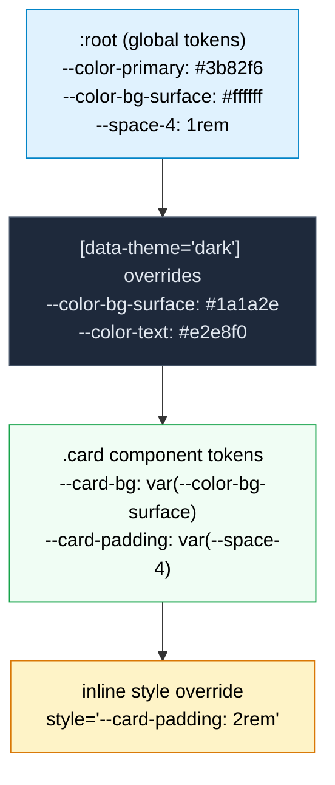

# [FEE-207] CSS 自訂屬性與主題化

:::info
CSS 自訂屬性（CSS custom properties，通常稱為「CSS 變數」）是作者定義的值，以 `--` 前綴宣告並透過 `var()` 函式取用。不同於預處理器變數在建構時期即被編譯消除，自訂屬性在瀏覽器中是即時生效的 -- 它們參與層疊（cascade）、透過 DOM 樹繼承、回應媒體查詢和偽類（pseudo-classes），且可從 JavaScript 讀取與寫入。結合 `@property` 規則（CSS Properties and Values API），加入型別資訊、初始值和繼承控制後，自訂屬性構成了現代主題化系統的基礎。SHOULD 使用自訂屬性作為設計令牌（design tokens）。SHOULD 使用 `@property` 處理需要動畫的自訂屬性。
:::

## 背景

CSS 從最早期就需要變數。2000 年代後期，預處理器填補了這個空缺。**Sass**（2006）引入 `$variables`，**Less**（2009）引入 `@variables`，**Stylus**（2010）使用無前綴的識別符號。這些工具改變了 CSS 撰寫方式 -- 定義一次色彩調色盤即可在各處引用，消除了困擾樣式表的搜尋替換工作流程。

但預處理器變數有一個根本限制：它們在執行時期不存在。當 Sass 編譯 `$primary: #3b82f6; .btn { color: $primary; }` 時，輸出是 `.btn { color: #3b82f6; }`。變數消失了，瀏覽器只看到解析後的值。這意味著預處理器變數無法回應執行時期條件 -- 當使用者切換深色模式、媒體查詢匹配、元件嵌套在不同上下文中，或 JavaScript 更新應用程式狀態時，它們都無法改變。

CSS 工作小組很早就認識到這個需求。**CSS Custom Properties for Cascading Variables Module Level 1** 的第一份公開工作草案出現在 2012 年。規範在 2015 年達到候選推薦（Candidate Recommendation），並在 2017 年獲得廣泛的瀏覽器支援。設計刻意保持最小化：自訂屬性就是屬性（它們層疊和繼承），而 `var()` 就是函式（它替換值）。不需要新的語言構造。

自訂屬性解決了執行時期問題，但引入了新的限制：它們是無型別的（untyped）。瀏覽器將每個自訂屬性值視為字串令牌列表。這意味著自訂屬性無法平滑地過渡或動畫化 -- 瀏覽器不知道 `--angle` 持有的是 `<length>`、`<color>` 還是任意字串，因此無法在兩個值之間插值（interpolate），只能在 50% 標記處做離散翻轉。

**CSS Properties and Values API**（CSS Houdini 的一部分）解決了這個缺口。最初僅能透過 JavaScript 的 `CSS.registerProperty()` 方法使用（Chrome 78，2019），後來透過 `@property` at-rule 實現宣告式寫法，並在 2024 年 7 月達到所有主要瀏覽器的 Baseline 支援。`@property` 讓作者宣告自訂屬性的語法（型別）、初始值和繼承行為 -- 為瀏覽器提供插值、驗證和最佳化所需的型別資訊。

自訂屬性與 `@property` 共同構成了現代 CSS 的執行時期主題化層。設計系統將令牌對應到自訂屬性。主題切換在祖先元素上切換屬性值。動畫平滑地插值具型別的屬性。JavaScript 透過屬性值與 CSS 溝通狀態。本文涵蓋了這個系統的機制、模式和陷阱。

## 原則

**SHOULD 使用自訂屬性作為設計令牌。** 設計令牌 -- 顏色、間距、排版、陰影、圓角 -- 是設計系統的原子值。將它們編碼為自訂屬性，使其可供文件中的每個 CSS 規則使用、在任何作用域層級改變，並回應深色模式等執行時期條件。

**SHOULD 使用 `@property` 處理需要動畫的自訂屬性。** 當自訂屬性參與過渡（transition）或動畫（animation）時，使用 `@property` 註冊其型別。若未註冊，瀏覽器將值視為字串而無法插值 -- 屬性會離散跳變而非平滑過渡。

## 設計思維

### 為什麼 CSS 需要執行時期變數

預處理器變數解決了撰寫問題 -- 定義一次，到處使用 -- 但無法解決執行時期問題。以深色模式為例：

```scss
// Sass 方式：兩組獨立的規則集
$bg-light: #ffffff;
$bg-dark: #1a1a2e;

.card { background: $bg-light; }

@media (prefers-color-scheme: dark) {
  .card { background: $bg-dark; }
}
```

這對一個元件的一個屬性有效。但實際的設計系統有數百個令牌應用於數百個元件。Sass 方式要求在媒體查詢內複製每個使用主題相關值的規則。樣式表隨著令牌數量與元件數量的乘積線性增長。

CSS 自訂屬性將此收斂為單一覆寫點：

```css
:root {
  --color-bg-surface: #ffffff;
  --color-text-primary: #1a1a2e;
}

@media (prefers-color-scheme: dark) {
  :root {
    --color-bg-surface: #1a1a2e;
    --color-text-primary: #e2e8f0;
  }
}

.card { background: var(--color-bg-surface); color: var(--color-text-primary); }
```

每個引用 `--color-bg-surface` 的元件在媒體查詢匹配時自動更新。無需重複。無需逐元件覆寫。

這個優勢同樣適用於任何執行時期條件：視窗大小、使用者偏好（減少動態效果、高對比）、元件狀態（hover、focus、disabled）、語系調整，或 JavaScript 驅動的狀態變更。

### @property 作為字串與型別之間的橋樑

沒有 `@property`，自訂屬性對瀏覽器的動畫引擎是不透明的。考慮動畫化一個漸層角度：

```css
/* 這不會平滑動畫 -- 瀏覽器看到的是字串，不是數字 */
.element {
  --angle: 0deg;
  background: linear-gradient(var(--angle), #3b82f6, #8b5cf6);
  transition: --angle 1s;
}
.element:hover {
  --angle: 180deg;
}
```

瀏覽器無法在 `0deg` 和 `180deg` 之間插值，因為它不知道 `--angle` 是一個角度。它將其視為字串並執行離散替換。

`@property` 提供了缺失的型別資訊：

```css
@property --angle {
  syntax: "<angle>";
  initial-value: 0deg;
  inherits: false;
}

.element {
  --angle: 0deg;
  background: linear-gradient(var(--angle), #3b82f6, #8b5cf6);
  transition: --angle 1s ease;
}
.element:hover {
  --angle: 180deg;
}
```

現在瀏覽器知道 `--angle` 是一個 `<angle>`，可以從 `0deg` 平滑插值到 `180deg`。這解鎖了先前在純 CSS 中不可能的動畫 -- 漸層過渡、色彩空間插值，以及由單一自訂屬性驅動的協調多屬性動畫。

`@property` 規則接受三個描述符（descriptors）：

- **`syntax`** -- CSS 值型別：`"<color>"`、`"<length>"`、`"<number>"`、`"<angle>"`、`"<percentage>"`、`"<length-percentage>"`、`"<integer>"`、`"<image>"`、`"<url>"`、`"<transform-function>"`、`"<custom-ident>"` 或 `"*"`（通用，任何值）
- **`initial-value`** -- 屬性未設定時使用的預設值（除非 syntax 為 `"*"`，否則為必填）
- **`inherits`** -- `true` 或 `false`，控制屬性是否從父元素繼承

### 框架透過自訂屬性實現主題化

現代 CSS 框架已收斂於以自訂屬性作為其主題化層：

**Tailwind CSS v4** 以 CSS 優先配置取代了 `tailwind.config.js`。主題值在 `@theme` 中定義為自訂屬性：

```css
@import "tailwindcss";
@theme {
  --color-primary: #3b82f6;
  --color-surface: #ffffff;
  --radius-lg: 0.75rem;
}
```

這些屬性直接對應到工具類別（`bg-primary`、`text-surface`、`rounded-lg`）。在任何作用域覆寫它們會改變該子樹的工具輸出。

**Chakra UI** 在執行時期將其 JavaScript 語義令牌對應為 CSS 自訂屬性。當定義 `semanticTokens: { colors: { bg: { default: 'white', _dark: 'gray.800' } } }` 時，Chakra 生成 `--chakra-colors-bg` 並根據當前色彩模式切換其值。

**Material UI (MUI)** 從其主題物件生成 CSS 自訂屬性。`theme.palette.primary.main` 變成 `var(--mui-palette-primary-main)`，使 CSS 層級的覆寫無需 JavaScript 重新渲染。

**Radix Themes** 為顏色、間距和圓角公開一整套 CSS 自訂屬性，允許深度客製化而無需修改元件原始碼。

**Open Props** 採取最純粹的方式：它完全就是 CSS 自訂屬性 -- 為顏色（自適應明暗）、間距、排版、緩動、陰影、長寬比和邊框提供設計令牌。壓縮後僅 4.4 KB，提供完整的令牌系統且零 JavaScript。

### 設計令牌層級

生產環境的設計系統將令牌組織為多個層級：

**全域令牌（Global tokens）** 是沒有語義意義的原始值：`--blue-500: #3b82f6`、`--space-4: 1rem`、`--font-size-lg: 1.125rem`。它們對應設計系統的原始調色盤。

**語義令牌（Semantic tokens）** 將意圖對應到全域令牌：`--color-primary: var(--blue-500)`、`--color-bg-surface: var(--white)`、`--spacing-component-gap: var(--space-4)`。語義令牌隨主題變化 -- 在深色模式中，`--color-bg-surface` 可能引用 `--gray-900` 而非 `--white`。

**元件令牌（Component tokens）** 將決策限定在特定元件：`--card-padding: var(--spacing-component-gap)`、`--card-radius: var(--radius-lg)`、`--card-bg: var(--color-bg-surface)`。元件令牌允許逐元件覆寫而不影響全域系統。

這種三層架構直接對應 CSS 自訂屬性的作用域：全域令牌在 `:root`，語義覆寫在主題選擇器（`[data-theme="dark"]`），元件令牌在元件自身的選擇器上。

## 視覺化

### 自訂屬性層疊



**解讀此圖。** 自訂屬性值從一般到特定層疊，就像一般 CSS 屬性一樣。在 `:root` 定義的全域令牌被所有元素繼承。`[data-theme="dark"]` 選擇器為其子樹覆寫特定令牌。`.card` 元件以語義令牌定義自己的令牌。行內 `style` 屬性提供最高特異性（specificity）的覆寫。在每個層級，只有變更的屬性被重新宣告 -- 其他一切從上層繼承。

## 範例

### 1. 使用自訂屬性的明暗主題切換

```css
/* 全域令牌 */
:root {
  --color-bg: #ffffff;
  --color-text: #1a1a2e;
  --color-primary: #3b82f6;
  --color-surface: #f8fafc;
  --color-border: #e2e8f0;
  --shadow-sm: 0 1px 2px rgba(0, 0, 0, 0.05);
}

/* 透過屬性覆寫深色主題 */
[data-theme="dark"] {
  --color-bg: #0f172a;
  --color-text: #e2e8f0;
  --color-primary: #60a5fa;
  --color-surface: #1e293b;
  --color-border: #334155;
  --shadow-sm: 0 1px 2px rgba(0, 0, 0, 0.3);
}

/* 透過使用者偏好自動深色模式 */
@media (prefers-color-scheme: dark) {
  :root:not([data-theme="light"]) {
    --color-bg: #0f172a;
    --color-text: #e2e8f0;
    --color-primary: #60a5fa;
    --color-surface: #1e293b;
    --color-border: #334155;
    --shadow-sm: 0 1px 2px rgba(0, 0, 0, 0.3);
  }
}

/* 元件引用令牌 -- 不需要主題特定規則 */
body {
  background: var(--color-bg);
  color: var(--color-text);
}

.card {
  background: var(--color-surface);
  border: 1px solid var(--color-border);
  border-radius: 0.5rem;
  padding: 1.5rem;
  box-shadow: var(--shadow-sm);
}

.btn-primary {
  background: var(--color-primary);
  color: var(--color-bg);
  border: none;
  padding: 0.5rem 1rem;
  border-radius: 0.375rem;
  cursor: pointer;
}
```

```html
<button onclick="toggleTheme()">Toggle theme</button>

<script>
function toggleTheme() {
  const root = document.documentElement;
  const current = root.getAttribute('data-theme');
  root.setAttribute('data-theme', current === 'dark' ? 'light' : 'dark');
}
</script>
```

`data-theme` 屬性方式優於 class 切換，因為它可搭配 CSS 屬性選擇器（attribute selectors）使用、語義明確（屬性描述的是狀態而非外觀），且允許第三種「auto」狀態來遵從 `prefers-color-scheme`。`:root:not([data-theme="light"])` 模式確保自動深色模式僅在使用者未明確選擇淺色模式時啟動。

### 2. @property 實現漸層角度動畫

```css
@property --gradient-angle {
  syntax: "<angle>";
  initial-value: 0deg;
  inherits: false;
}

@property --color-start {
  syntax: "<color>";
  initial-value: #3b82f6;
  inherits: false;
}

@property --color-end {
  syntax: "<color>";
  initial-value: #8b5cf6;
  inherits: false;
}

.gradient-box {
  --gradient-angle: 45deg;
  --color-start: #3b82f6;
  --color-end: #8b5cf6;
  background: linear-gradient(var(--gradient-angle), var(--color-start), var(--color-end));
  transition: --gradient-angle 0.8s ease, --color-start 0.6s ease, --color-end 0.6s ease;
  width: 300px;
  height: 200px;
  border-radius: 1rem;
}

.gradient-box:hover {
  --gradient-angle: 225deg;
  --color-start: #f97316;
  --color-end: #ec4899;
}

/* 持續旋轉動畫 */
@keyframes spin-gradient {
  to {
    --gradient-angle: 360deg;
  }
}

.gradient-box--spinning {
  animation: spin-gradient 3s linear infinite;
}
```

沒有 `@property` 宣告，漸層在 hover 時會瞬間跳變，因為瀏覽器無法插值無型別的自訂屬性。有了 `@property`，角度平滑旋轉，顏色在色彩空間中混合。

### 3. 透過自訂屬性的 JS 與 CSS 溝通（滑鼠追蹤效果）

```css
.spotlight {
  --mouse-x: 50%;
  --mouse-y: 50%;
  position: relative;
  width: 400px;
  height: 300px;
  background: var(--color-surface, #1e293b);
  border-radius: 1rem;
  overflow: hidden;
}

.spotlight::after {
  content: "";
  position: absolute;
  inset: 0;
  background: radial-gradient(
    circle at var(--mouse-x) var(--mouse-y),
    rgba(59, 130, 246, 0.15) 0%,
    transparent 60%
  );
  pointer-events: none;
}
```

```javascript
const spotlight = document.querySelector('.spotlight');

spotlight.addEventListener('mousemove', (e) => {
  const rect = spotlight.getBoundingClientRect();
  const x = ((e.clientX - rect.left) / rect.width) * 100;
  const y = ((e.clientY - rect.top) / rect.height) * 100;

  // 使用 requestAnimationFrame 批次處理樣式更新
  requestAnimationFrame(() => {
    spotlight.style.setProperty('--mouse-x', `${x}%`);
    spotlight.style.setProperty('--mouse-y', `${y}%`);
  });
});

// 讀取自訂屬性值
const styles = getComputedStyle(spotlight);
console.log(styles.getPropertyValue('--mouse-x')); // "50%"
```

自訂屬性是 JavaScript 與 CSS 之間的首選橋樑。透過 `element.style.setProperty()` 設定自訂屬性比修改個別 CSS 屬性更高效，因為它讓 CSS 處理視覺對應 -- JavaScript 只溝通資料（`--mouse-x`、`--mouse-y`），而 CSS 決定如何使用它（徑向漸層位置）。這種分離將渲染邏輯保留在樣式表中，互動邏輯保留在 JavaScript 中。

## 常見錯誤

### 1. 將所有自訂屬性放在 :root，但元件作用域更適合

**錯誤做法：** 將每個自訂屬性都宣告為全域，即使屬性只與單一元件相關：

```css
/* :root 上有 200+ 個屬性，大部分只被一個元件使用 */
:root {
  --card-padding: 1.5rem;
  --card-radius: 0.5rem;
  --card-shadow: 0 1px 3px rgba(0,0,0,0.1);
  --modal-overlay-opacity: 0.5;
  --tooltip-arrow-size: 6px;
  --sidebar-width: 280px;
  /* ... 還有數百個 */
}
```

這會污染全域命名空間、難以找出哪個元件使用哪個屬性，且有意外名稱衝突的風險。每個後代都繼承所有屬性，在大型 DOM 中浪費記憶體。

**正確做法：** 將元件特定的屬性限定在其元件內。`:root` 保留給真正的全域令牌（顏色、間距比例、排版）：

```css
:root {
  --color-surface: #f8fafc;
  --radius-md: 0.5rem;
  --space-6: 1.5rem;
}

.card {
  --card-padding: var(--space-6);
  --card-radius: var(--radius-md);
  background: var(--color-surface);
  padding: var(--card-padding);
  border-radius: var(--card-radius);
}
```

### 2. 在需要執行時期彈性時使用預處理器變數

**錯誤做法：** 對需要在執行時期變更的值使用 Sass 變數：

```scss
// 這些值被固定在輸出中 -- 無法在執行時期改變
$primary: #3b82f6;
$font-size-base: 1rem;

.text { color: $primary; font-size: $font-size-base; }
```

如果產品後來需要深色模式、使用者可調整的字型大小，或每個租戶的品牌客製化，每個 Sass 引用都必須重構為自訂屬性。

**正確做法：** 對任何可能在執行時期變更的值使用自訂屬性。預處理器變數仍適用於建構時期常數（`@media` 規則中的斷點值、數學運算元、mixin 參數），但設計令牌從一開始就應該使用自訂屬性。

### 3. 在 var() 中忘記提供回退值

**錯誤做法：** 在自訂屬性可能未定義時使用 `var()` 卻不加回退值：

```css
/* 如果 --accent 從未定義，這會計算為 'color' 的初始值
   （通常是黑色），而非合理的預設值 */
.highlight { color: var(--accent); }
```

當 `var()` 引用一個未定義且沒有回退值的自訂屬性時，該屬性會變成**保證無效值**（guaranteed-invalid value）。瀏覽器接著回退到繼承值或屬性的初始值 -- 這可能不是作者的意圖。

**正確做法：** 對可能未被繼承的自訂屬性總是提供回退值：

```css
.highlight { color: var(--accent, #3b82f6); }
```

或者，使用 `@property` 宣告初始值：

```css
@property --accent {
  syntax: "<color>";
  initial-value: #3b82f6;
  inherits: true;
}
```

### 4. 未對需要動畫的自訂屬性使用 @property

**錯誤做法：** 期望自訂屬性在未註冊型別的情況下平滑過渡：

```css
.progress {
  --progress: 0;
  background: linear-gradient(90deg, #3b82f6 calc(var(--progress) * 1%), transparent 0);
  transition: --progress 0.5s ease;
}
.progress.complete {
  --progress: 100;
}
```

沒有 `@property`，瀏覽器將 `--progress` 視為字串。過渡不會插值 -- 它在 50% 標記處從 `0` 跳到 `100`。

**正確做法：** 使用 `@property` 註冊屬性：

```css
@property --progress {
  syntax: "<number>";
  initial-value: 0;
  inherits: false;
}
```

現在瀏覽器知道 `--progress` 是 `<number>`，可以在過渡期間從 `0` 平滑插值到 `100`。

### 5. 頻繁設定自訂屬性但未使用 requestAnimationFrame

**錯誤做法：** 在每個滑鼠事件上更新自訂屬性而不批次處理：

```javascript
// 這每秒觸發 60-100+ 次，可能造成佈局抖動（layout thrashing）
element.addEventListener('mousemove', (e) => {
  element.style.setProperty('--x', e.clientX + 'px');
  element.style.setProperty('--y', e.clientY + 'px');
});
```

每次 `setProperty` 呼叫都可能觸發樣式重新計算。每個事件兩次呼叫意味著每幀可能有兩次重新計算，而 `mousemove` 的觸發頻率可能高於顯示器更新率。

**正確做法：** 在 `requestAnimationFrame` 內批次處理更新，將寫入合併到單一幀中：

```javascript
let rafId = null;

element.addEventListener('mousemove', (e) => {
  if (rafId) cancelAnimationFrame(rafId);
  rafId = requestAnimationFrame(() => {
    element.style.setProperty('--x', e.clientX + 'px');
    element.style.setProperty('--y', e.clientY + 'px');
    rafId = null;
  });
});
```

這確保無論 `mousemove` 觸發多快，每個動畫幀最多只有一次樣式更新。

## 相關 FEE

| FEE | 關聯性 |
|-----|--------|
| [FEE-200 CSS 與佈局系統概覽](./200.md) | 母概覽。CSS 自訂屬性是 FEE-200 所描述的現代 CSS 格局中的基礎原語。 |
| [FEE-201 層疊、特異性與繼承](./201.md) | 自訂屬性完全參與層疊並預設繼承。理解層疊順序和特異性對於預測多個作用域定義相同屬性時哪個值勝出至關重要。 |
| [FEE-205 CSS 架構與作用域策略](./205.md) | 設計令牌層級（全域、語義、元件）是一種架構模式。CSS 自訂屬性實現了作用域策略所組織的令牌層。 |
| [FEE-206 現代 CSS 框架](./206.md) | 現代框架在內部使用自訂屬性：Tailwind v4 的 `@theme`、Open Props 的整體模型、Chakra UI 的語義令牌，以及 MUI 的主題提供者都生成或使用 CSS 自訂屬性。 |

## 參考資料

- [W3C CSS Custom Properties for Cascading Variables Module Level 1](https://drafts.csswg.org/css-variables/) -- 定義自訂屬性（`--*`）和 `var()` 函式的規範，包含層疊行為、保證無效值和序列化規則
- [W3C CSS Properties and Values API Level 1](https://www.w3.org/TR/css-properties-values-api-1/) -- 定義 `@property` 和 `CSS.registerProperty()` 的 Houdini 規範，實現具型別的自訂屬性，包含語法、初始值和繼承控制
- [MDN: Using CSS custom properties (variables)](https://developer.mozilla.org/en-US/docs/Web/CSS/Guides/Cascading_variables/Using_custom_properties) -- 涵蓋宣告、`var()` 用法、回退值、繼承和 JavaScript 互操作的完整指南
- [MDN: @property](https://developer.mozilla.org/en-US/docs/Web/CSS/Reference/At-rules/@property) -- `@property` at-rule 的參考文件，包含語法描述符、初始值需求和瀏覽器支援
- [web.dev: @property -- Next-gen CSS variables now with universal browser support](https://web.dev/blog/at-property-baseline) -- Google 關於 `@property` 達到 Baseline 支援的文章，含動畫範例和效能影響
- [web.dev: @property -- giving superpowers to CSS variables](https://web.dev/articles/at-property) -- `@property` 能力的詳細介紹，包含漸層動畫、具型別回退和實際使用案例
- [Lea Verou: Custom properties with defaults -- 3+1 strategies](https://lea.verou.me/blog/2021/10/custom-properties-with-defaults/) -- 關於在自訂屬性 API 中提供預設值模式的專家分析，包含偽私有屬性技巧
- [Open Props](https://open-props.style/) -- 完全以 CSS 自訂屬性建構的設計令牌系統，提供自適應顏色、間距、排版、緩動和陰影，壓縮後僅 4.4 KB
- [CSS-Tricks: Open Props and Custom Properties as a System](https://css-tricks.com/open-props-and-custom-properties-as-a-system/) -- 以 CSS 自訂屬性作為系統性設計令牌層的分析，以 Open Props 為主要案例研究
