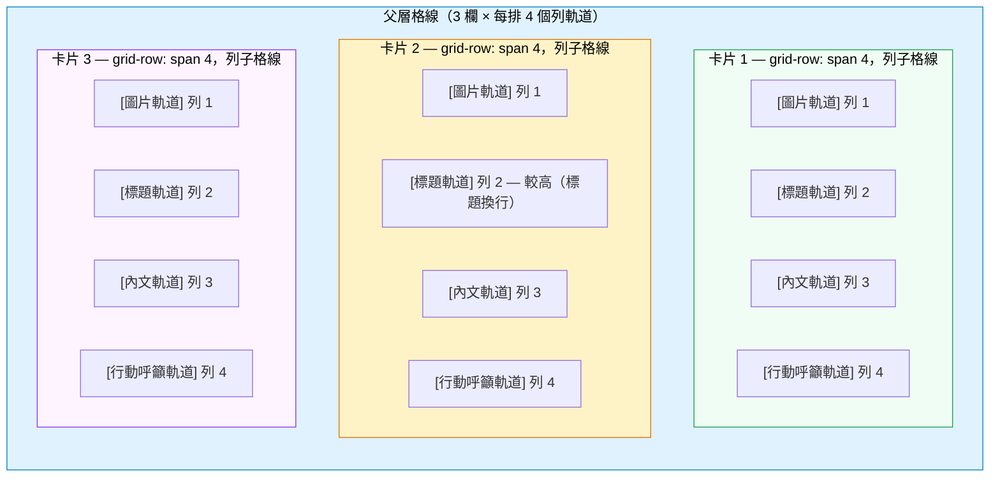

# CSS 子格線

CSS Grid 允許格線容器的直接子元素參與二維排版。然而，更深層的巢狀元素——子元素
的子元素——無法預設對齊外層格線的軌道。在子格線出現之前，要讓一排卡片的標題對齊，
工程師必須透過 JavaScript 量測高度或重複定義格線規則，而這些規則在父層格線修改後
往往悄悄失效。CSS 子格線從排版引擎層面解決了這個問題，消除了多年來前端實務中積累
的整類脆弱變通做法。

`grid-template-rows` 或 `grid-template-columns` 的 `subgrid` 值允許巢狀格線繼承
父層的軌道定義。巢狀元素成為「子格線容器」，其子元素直接參與父層的格線線，就如同
它們是父層格線的直接子元素一樣。不需要重複定義，不需要量測，也不需要 JavaScript。
父層格線的尺寸計算演算法會在同一次排版流程中，同時統計所有參與子格線容器的子元素，
計算共用軌道的尺寸——這個行為在沒有排版引擎直接參與的情況下，從根本上就無法乾淨
地複製。

最主要的使用情境是卡片式排版的對齊：商品卡片的圖片、標題、內文與行動呼籲按鈕，
即使各卡片的內容長度不同，也必須在同一排卡片中互相對齊。子格線消除了固定高度或
JavaScript 量測對齊的需求。父層格線的軌道自動擴展以容納各軌道中最高的內容，同排
所有卡片共用這些軌道尺寸，無需在卡片子元素上撰寫任何額外的 CSS 規則。

瀏覽器支援方面，所有主流瀏覽器自 2023 年起均已支援（Chrome 117、Firefox 71、
Safari 16），此功能已達 Baseline 狀態，代表大多數應用程式可在生產環境中直接使用
而無需 polyfill。對於需要支援較舊環境或不具備子格線支援的嵌入式瀏覽器情境，可使
用 `@supports (grid-template-rows: subgrid)` 進行漸進增強。回退排版可以是一個
簡單的 Flexbox 欄式排版，在沒有跨卡片對齊的情況下仍能正常運作。

## 設計思維

### 子格線如何繼承軌道

子格線容器在自身宣告 `display: grid`，並搭配 `grid-template-rows: subgrid` 和/或
`grid-template-columns: subgrid`。當瀏覽器遇到這些宣告時，不會在子格線容器上建立
新的軌道定義，而是讓子格線容器的子元素直接參與父層的現有軌道，就如同子格線容器
在子格線化的軸上是透明的排版節點一樣。父層格線的尺寸計算演算法將所有參與子格線
容器的子元素視為在同一次尺寸計算流程中貢獻共用軌道的節點。

子格線容器本身仍必須作為父層格線中的格線項目進行配置。這個配置決定了子格線所跨
越的軌道範圍。一張需要填入四個列軌道（圖片、標題、內文、行動呼籲）的卡片，必須
宣告 `grid-row: span 4`，讓瀏覽器知道其子元素將被置入哪些父層軌道。若跨度設定
錯誤，子格線的軌道數量多於或少於子元素所需，子元素將溢出或塌陷到非預期的位置，
且瀏覽器主控台不會顯示任何錯誤或警告。這種靜默失敗是子格線的主要危險之一，而
跨度紀律正是預防它的關鍵。

跨度與軌道數量的對應關係至關重要。在撰寫任何子格線規則之前，先數清楚子格線需要
對子元素開放的列或欄軌道數量，再在子格線容器上設定對應的跨度。跨度必須與子元素
將佔用的軌道數量相符。當父層格線定義了命名線時，子格線內的子元素可使用這些名稱
進行明確配置，這比數字配置更具穩健性，因為只要名稱保持穩定，即使父層軌道順序改
變也不受影響。

### 列子格線與欄子格線

任一軸或兩軸均可獨立設定為子格線。大多數卡片排版的使用情境只需子格線化列軸，因
為目標是讓佔據同一水平列的相鄰卡片之間，各內容區塊（圖片、標題、內文、行動呼籲）
在垂直方向對齊。每張卡片在父層格線中佔據一欄，因此欄軸已由父層的欄軌道尺寸計算
處理。在此情境下子格線化欄軸，會讓卡片的內部子元素分散至父層的多個欄軌道中，幾
乎從來都不是每張卡片預期僅佔一欄時的設計意圖。

同時子格線化兩軸是可行的，且適用於特定模式。二維子格線使容器的子元素可透過父層
的列與欄軌道進行定址，適合需要在兩軸上同時與相鄰單元格對齊的複雜元件——例如資料
格線、複雜的表單排版或日曆。代價是額外的排版耦合：子格線中的每個子元素配置都同
時依賴容器的 `grid-row` 與 `grid-column` 跨度正確反映父層的列數與欄數，使元件
在欄數不同的父層排版中可攜性降低。

當只有一個軸需要跨項目對齊時，只對該軸進行子格線化。對不需要對齊的軸進行子格線
化只會增加概念複雜度，且在父層格線日後修改軌道定義、新增響應式斷點或用於不同的
父層排版情境時，使容器更難推理。

### 子格線與命名格線線

父層格線中定義的命名格線線可在子格線內部使用。若父層宣告
`grid-template-rows: [card-start] auto [title-start] auto [body-start] auto [cta-start] auto [card-end]`，
子格線內的子元素可使用 `grid-row: title-start / body-start` 以名稱而非序號進行
明確配置。這比數字配置更具穩健性，因為只要名稱保持穩定，即使父層軌道順序改變也
不受影響。命名線在父層排版元件與其下的子格線子元素之間建立了語意契約。

以 `grid-template-areas` 定義的命名格線區域同樣可供子格線子元素使用。在父層格線
由排版元件擁有、而子格線子元素由不同團隊或不同原始檔案撰寫的設計系統中，命名線
提供了兩個關注點之間穩定的介面。任何保留命名線的父層格線重構，對所有使用這些名
稱進行配置的子格線子元素都保持向後相容，無需同步修改子元素的配置規則。

父層格線可透過 `repeat()` 搭配命名線來傳播命名。當父層使用如
`repeat(auto-fill, [card-start] auto [title-start] auto ...)` 這樣的宣告時，每個
重複組會獲得位置前綴。子格線子元素可透過 `2 card-start` 語法參照第二個出現的
`card-start`，支援可變長度或動態生成的內容排版，無需修改卡片本身的 CSS。

### 子格線的間距行為

當父層格線定義了 `gap`（`row-gap` 或 `column-gap`）時，這些間距套用在父層軌道
之間。跨越多個軌道的子格線容器，其子元素在對應的軌道邊界位置會顯示父層的間距。
子格線容器可選擇為子格線化的軸定義自己的 `gap`，但更常見的做法是自動繼承父層
間距所產生的視覺間隔，讓排版間距集中管理。

這意味著子格線排版的間距管理主要集中在父層格線，而非個別卡片。修改父層格線的
`row-gap` 會同時改變所有卡片所有內容區域之間的間距。這將間距控制集中在排版容器，
在架構上優於將間距或外距（margin）值分散在個別卡片子元素中——分散的間距值難以
一致地變更，且容易在響應式斷點修改時造成不一致。

### 漸進增強策略

`@supports (grid-template-rows: subgrid)` 防護包裹子格線特有的規則，並在防護之外
保留可運作的回退排版。回退排版應在無對齊功能的情況下仍能正常運作。以 Flexbox
欄式排版為例，每張卡片作為一個 `flex-direction: column` 的彈性容器通常已足夠——
卡片之間不會互相對齊，但每張卡片內部透過 `flex: 1` 將行動呼籲推至底部，保持內部
連貫性。固定高度回退是另一個選項，但這重新引入了子格線所解決的內容耦合問題。

`@supports` 內的增強層為卡片新增 `display: grid` 和 `grid-template-rows: subgrid`，
並在父層格線上下文中為卡片新增 `grid-row: span 4`（或相應的跨度）。由於回退排版
與增強排版位於不同的規則區塊，回退排版不會被增強排版破壞——不支援子格線的瀏覽器
只需忽略 `@supports` 區塊並渲染回退排版即可。這個模式是撰寫漸進式 CSS 增強的
正確方式：先撰寫適用於所有環境的基準排版，再為有能力的瀏覽器疊加增強。

`@supports` 條件應測試具體的屬性與值的組合。`@supports (grid-template-rows: subgrid)`
是列子格線的正確防護條件。不要以 `@supports (display: grid)` 作為代理測試——該
條件在所有支援 Grid 的瀏覽器中均為真，包括不支援子格線的較舊版本。防護必須具體，
才能防止增強排版在會產生錯誤結果的環境中執行。

### 子格線與 CSS 自訂屬性的對齊方案比較

在子格線出現之前，有一種對齊技術是透過 CSS 自訂屬性傳遞 JavaScript 計算出的高度
值。腳本使用 `getBoundingClientRect()` 或 `ResizeObserver` 量測同一排卡片中最高的
標題元素，在父層設定 `--card-title-height`，每張卡片再對其標題區域套用
`min-height: var(--card-title-height)`。這個方法可行，但需要在排版後執行 JavaScript，
會產生對齊前的閃爍，在格線因視窗縮放、內容更新或動態字型載入而重排時失效，且當
同一行的卡片數量不同時需要謹慎清理量測結果。

子格線在本質上更簡單：無需 JavaScript、無需量測、無需用於尺寸調整的自訂屬性、
無需事件監聽器、無需 `ResizeObserver` 回呼。排版引擎在正常的排版流程中原生處理
軌道尺寸調整。結果在首次繪製時即正確，在任何重排後保持正確，且零維護成本。自訂
屬性方案應被視為歷史性的變通做法。在支援子格線的環境中，必須（MUST）優先使用子
格線。同時保留 JavaScript 量測方式與子格線只會增加讓未來維護人員困惑的冗餘程式碼。

## 最佳實踐

**必須（MUST）使用 `grid-template-rows: subgrid` 而非固定高度來對齊巢狀格線子元素
的內容列。** 固定高度與內容緊密耦合，文字在較窄的視窗中換行、圖片替換為不同長寬
比，或翻譯字串長度不同於原始語言時，固定高度都會失效。子格線對齊是結構性的，能
自動回應內容變動，因為父層格線的列軌道尺寸演算法——使用 `auto` 或 `fr` 軌道——
會同時統計所有參與子格線容器中各軌道最高的內容，無需任何作者介入或重新量測。

**必須（MUST）讓子格線容器跨越正確數量的父層軌道。** 跨越軌道數量少於子元素所需
列數的子格線容器，其子元素將溢出容器或塌陷至非預期位置，且不會顯示任何可見的瀏覽
器警告。容器的 `grid-row` 跨度必須涵蓋子格線子元素將被置入的所有列軌道。計算卡片
需要開放的內容區塊數量——圖片、標題、內文、行動呼籲——再相應設定 `grid-row: span N`，
然後再撰寫子元素配置規則。跨度不符是子格線排版損壞最常見的原因，且失敗是靜默的。

**應該（SHOULD）在子格線規則外加上 `@supports (grid-template-rows: subgrid)` 防護**，
並為不支援子格線的瀏覽器提供可運作的回退排版。回退排版不必與子格線排版完全一致；
堆疊式或 Flexbox 欄式排版均可接受。防護確保不支援子格線的瀏覽器渲染的是連貫的
回退排版，而非留下內容位置無法預測的損壞 CSS。`@supports` 條件必須明確測試
`subgrid` 值，而非只測試 `display: grid`。

**應該（SHOULD）只對需要跨卡片對齊的軸進行子格線化。** 當只需要列對齊——即常見
的卡片排版情境——時，只對列軸使用 `grid-template-rows: subgrid`，在子格線容器上
保留 `grid-template-columns` 作為正常的格線定義。在只需要單軸對齊時對兩軸都進行
子格線化，會將卡片的內部欄結構與父層格線的欄數耦合，降低卡片在不同父層排版和
響應式斷點中的可重用性。

## 視覺呈現



每張卡片跨越父層格線的全部四個列軌道。每張卡片的 `grid-template-rows: subgrid`
使卡片的子元素——圖片、標題、內文、行動呼籲——被置入共用的父層軌道。當卡片 2 的
標題換行變得更高時，父層格線的標題軌道會擴展以容納它。由於卡片 1 與卡片 3 透過
子格線共用同一個標題軌道，它們的標題區域也會獲得相同的額外高度，而三張卡片的行
動呼籲按鈕始終在相同的垂直位置對齊，無論標題或內文的長度為何。

## 範例

```
/* CSS */
/* 回退排版：Flexbox 欄式排版，無跨卡片對齊，但功能正常 */
.card-grid {
  display: grid;
  grid-template-columns: repeat(3, 1fr);
  gap: 1.5rem;
}

.card {
  display: flex;
  flex-direction: column;
  background: var(--color-surface, #f8fafc);
  border: 1px solid var(--color-border, #e2e8f0);
  border-radius: 0.5rem;
  overflow: hidden;
}

.card__body {
  flex: 1; /* 將行動呼籲推至各卡片底部；無法跨卡片對齊 */
}

/* 子格線增強：跨卡片列對齊 */
@supports (grid-template-rows: subgrid) {
  .card-grid {
    /*
     * 每「列」卡片定義 4 個命名列軌道。
     * 同一視覺列的卡片共用這些軌道。
     * auto-fill 為每一額外的卡片列自動建立新的 4 列軌道組。
     */
    grid-template-rows: repeat(
      auto-fill,
      [card-start] auto [title-start] auto
      [body-start] auto [cta-start] auto [card-end]
    );
  }

  .card {
    display: grid;               /* 從 flex 切換為 grid */
    grid-row: span 4;            /* 跨越全部 4 個命名列軌道 */
    grid-template-rows: subgrid; /* 從父層繼承這 4 個軌道 */
  }

  .card__image  { grid-row: 1; }                   /* card-start 軌道  */
  .card__title  { grid-row: 2; align-self: end; }  /* title-start 軌道 */
  .card__body   { grid-row: 3; flex: unset; }      /* body-start 軌道  */
  .card__cta    { grid-row: 4; align-self: start; } /* cta-start 軌道  */
}

/* HTML */
/*
<ul class="card-grid">
  <li class="card">
    
    <h2 class="card__title">簡短標題</h2>
    <p class="card__body">只需一行的簡短說明文字。</p>
    <a class="card__cta" href="/product-a">立即購買</a>
  </li>
  <li class="card">
    
    <h2 class="card__title">
      一個相當長的商品標題，會換行至第二行顯示
    </h2>
    <p class="card__body">
      涵蓋數句商品資訊的詳細說明文字，比其他卡片更長，
      用來示範卡片間的高度差異效果。
    </p>
    <a class="card__cta" href="/product-b">立即購買</a>
  </li>
  <li class="card">
    
    <h2 class="card__title">中等長度標題</h2>
    <p class="card__body">
      另一個內容長度不同的商品說明。
    </p>
    <a class="card__cta" href="/product-c">立即購買</a>
  </li>
</ul>
*/
```

在回退排版中，每張卡片垂直堆疊子元素，`.card__body` 的 `flex: 1` 將行動呼籲推至
各卡片底部——但三個行動呼籲按鈕位於不同的垂直高度，因為每張卡片獨立計算自身尺寸。
在子格線排版中，三張卡片共用父層格線中相同的四個列軌道。標題軌道擴展至三張卡片
中最高標題的高度，無論各卡片的內文長度為何，三個行動呼籲按鈕都對齊在相同的垂直
位置。

## 常見錯誤

### 忘記在子格線容器上設定 `grid-row: span N`

最常見的錯誤是在卡片上宣告 `grid-template-rows: subgrid`，卻在父層格線上下文中省
略 `grid-row: span 4`（或對應的跨度）。沒有跨度宣告，卡片預設只會佔用一個父層列
軌道，子格線只有一個軌道可映射其子元素，導致四個子元素全部塌陷到這個單一軌道中，
產生溢出或不可見的排版，且瀏覽器主控台不顯示任何錯誤。請務必先在卡片上設定跨度，
確認跨度與子元素將佔用的軌道數量相符，再撰寫子元素配置規則。

### 在需要列對齊時使用欄子格線

常見的混淆是在目標為讓圖片、標題、內文、行動呼籲在垂直方向對齊時，卻寫了
`grid-template-columns: subgrid`。欄子格線將容器的子元素映射至父層的欄軌道——當
單一容器的子元素需要跨越父層的多個欄時才有用，對在相同垂直位置對齊水平帶狀內容
毫無幫助。列子格線——`grid-template-rows: subgrid`——才是建立共用水平軌道以對齊
卡片內容區塊的正確做法。撰寫規則前請先確認需要對齊的軸方向。

### 省略 `@supports` 回退

沒有 `@supports` 防護時，不支援子格線的瀏覽器在解析 `grid-template-rows: subgrid`
時會將 `subgrid` 值視為無效，靜默地回退至 `grid-template-rows` 的初始值 `none`，
代表未定義任何明確列軌道。卡片的子元素落入由 `grid-auto-rows` 決定尺寸的隱式列
（通常為 `auto`），產生與預期設計完全不同的排版，且可能使內容以非預期的方式堆疊
或隱藏。`@supports` 防護確保不支援子格線的瀏覽器渲染的是回退排版，而非損壞的 CSS。

### 在沒有 `display: grid` 的容器上使用 `subgrid`

`grid-template-rows: subgrid` 只在元素本身是格線容器時才有意義。若卡片宣告的是
`display: flex`，`grid-template-rows` 屬性不會產生任何效果，也不會出現任何子格線
行為。卡片必須（MUST）除了宣告 `grid-template-rows: subgrid` 之外，還要宣告
`display: grid`。將卡片從 Flexbox 欄式回退轉換為子格線增強時，`@supports` 區塊
必須將 `display` 從 `flex` 改為 `grid`，並明確取消或覆寫彈性盒子特有的屬性——
例如子元素上的 `flex: 1`——以避免這些屬性在子格線上下文中與格線配置的子元素產生
衝突。

## 相關 FEE

| FEE | 關聯說明 |
|-----|---------|
| [FEE-200 CSS 與排版系統總覽](./200.md) | 上層總覽。子格線是 CSS Grid 排版模組的一部分，而 CSS Grid 是 FEE-200 所介紹的基礎排版系統之一。 |
| [FEE-201 CSS 格線排版](./201.md) | 子格線是 CSS Grid 的延伸。有效使用子格線的前提是理解格線軌道、`grid-template` 定義、配置、命名線與 `span` 關鍵字。 |
| [FEE-202 彈性盒子](./202.md) | Flexbox 是子格線卡片模式的自然回退排版。撰寫本文所述的 `@supports` 回退，需要理解 `flex-direction: column` 與 `flex: 1`。 |
| [FEE-209 CSS 包含性與 `contain`](./209.md) | CSS 包含性可能影響子格線行為。位於具有 `contain: layout` 元素內的子格線容器，無法繼承包含邊界外祖先的軌道，因為包含性阻止排版資訊跨越邊界傳遞。 |

## 參考資料

- MDN：CSS 子格線 — https://developer.mozilla.org/en-US/docs/Web/CSS/CSS_grid_layout/Subgrid
- CSS Grid 排版第 2 層規格 — https://www.w3.org/TR/css-grid-2/
- Chrome for Developers：CSS subgrid — https://developer.chrome.com/docs/css-ui/css-subgrid
- Can I Use：CSS subgrid — https://caniuse.com/css-subgrid
