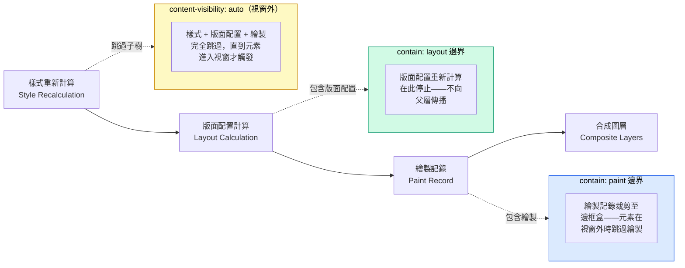

# CSS 包含性與 `contain`

瀏覽器的渲染流水線預設會在整個文件樹中重新計算版面配置、樣式與繪製。當某個元素發生
變化時——無論是文字節點被更新，還是 class 被切換——瀏覽器可能需要遍歷同層元素、
祖先節點與後代節點，以判斷其他哪些部分受到影響。CSS 包含性（CSS Containment）讓
開發者能夠明確告知瀏覽器：某個子樹是獨立的——其內部的變化不會影響外部，外部的變化
也不會影響內部。

`contain` 屬性接受四個值：`layout`、`paint`、`style` 與 `size`。`layout` 值告知
瀏覽器，元素內部的任何變化都不會影響外部元素的版面配置。`paint` 值告知瀏覽器，元素
的內容在視覺上不會超出其邊框盒（border box）。`style` 值將 CSS 計數器與引號樣式的
作用域限定在元素的子樹內。`size` 值宣告該元素的尺寸與其內容無關。

`content-visibility: auto` 是一個更高層次的 API，它將包含性與延遲渲染結合在一起：
瀏覽器完全跳過視窗外元素的版面配置與繪製，僅在元素進入視窗時才進行渲染。對於包含大
量視窗外區段的長頁面，這能大幅縮短初始渲染時間。`contain-intrinsic-size` 為視窗外
的元素提供一個佔位尺寸，確保在這些元素被渲染時，文件的捲動位置不會跳動。

`contain` 與 `content-visibility` 都是漸進增強的手段——不支援它們的瀏覽器會正常渲
染頁面，只是缺少這些效能最佳化而已。在 2024 年，主流瀏覽器對這兩個屬性的支援已近乎
全面普及。

## 使用情境

一個複雜的儀表板中，某個小工具的更新頻率很高。每次重新渲染都會觸發整個頁面的版面配置與繪製重新計算，因為瀏覽器必須驗證該小工具的尺寸變化是否會影響外部元素。CSS 包含性（`contain: layout paint`）告知瀏覽器該小工具的內容不會影響外部版面，使重新計算的範圍局限在小工具本身，大幅降低繪製成本。

## 設計思維

### contain: layout

版面配置包含性（layout containment）會建立一個新的區塊格式化內容（block formatting
context）。沒有浮動元素會從元素中溢出，邊距不會穿透元素折疊，元素內部的任何內容都
不會影響外部元素的版面配置位置。瀏覽器可以在此元素的邊界停止版面配置的重新計算——
在被包含子樹內部完成的工作不會向上傳播至文件根節點，也不會橫向影響同層元素。對於頻
繁更新的元件（例如在資料刷新時重新渲染列的資料表格），這意味著瀏覽器只需在元件的子
樹內重新執行版面配置，而無需遍歷文件的其餘部分。

版面配置包含性也會影響子格線（subgrid）與包含性邊界的互動方式。放置在具有
`contain: layout` 的元素內的子格線容器，無法從包含性邊界外的祖先節點繼承格線軌道，
因為包含性會阻止版面配置資訊跨越該邊界傳遞。這種互動在實務中通常不會造成問題——
自包含的元件通常是版面配置樹中的葉節點——但在將包含性與基於格線的版面配置組合使用
時，值得留意這一點。

### contain: paint

繪製包含性（paint containment）會將渲染裁剪至邊框盒，並建立一個堆疊內容（stacking
context）。溢出邊框盒的元素不會被繪製，這意味著當元素的邊框盒完全在視窗外時，瀏覽
器可以完全跳過該元素的繪製。這種視覺裁剪與 `overflow: hidden` 不同——它不影響元素
的版面配置幾何結構——但它確實告知合成器，盒子外部的內容永遠不會可見，可以從繪製記錄
中省略。

`contain: paint` 的副作用是建立堆疊內容，這意味著元素成為其後代元素中 `z-index`
堆疊的根節點。在為現有元件新增繪製包含性時，這一點值得考慮，因為子樹內的 `z-index`
行為可能受到影響。在大多數情況下，其行為與為元素新增 `position: relative` 相同——
這是已廣泛使用的限定堆疊內容的慣用模式——因此實際影響通常是中性的。

### contain: style

樣式包含性（style containment）將 CSS 計數器與 `quotes` 的作用域限定在元素的子樹
內。它不影響版面配置或繪製。這個值最適合用於各自擁有獨立計數器的重複區段——例如，
一個由文章組成的清單，每篇文章各自對其內部的圖表進行計數，其中一篇文章的圖表計數器
不應從上一篇文章繼續累加。若沒有樣式包含性，在重複元件內部定義並遞增的 CSS 計數器
可能會在同層元素間滲漏，產生意外的計數值。

樣式包含性不會限定 CSS 自訂屬性（custom properties）的作用域，自訂屬性仍然正常地
透過文件樹繼承，不受包含性影響。它不會普遍阻止屬性繼承——只有計數器和引號嵌套層級
會被限定作用域。若需要限定自訂屬性的繼承範圍，應改用 `@scope` 或 shadow DOM，因為
樣式包含性無法提供這項能力。

### content-visibility: auto

`content-visibility: auto` 將 `contain: layout style paint` 與對視窗外元素的跳過
渲染行為結合在一起。瀏覽器跳過視窗外元素的樣式計算、版面配置與繪製。當使用者捲動使
元素進入視窗時，瀏覽器再依需求進行渲染。這並非圖片或資源意義上的懶加載——不會推遲任
何網路請求——而是瀏覽器跳過計算尚未可見內容的版面配置與繪製工作。

此機制最適合用於大型重複區段，例如文章卡片、商品清單或聊天訊息群組。一個包含五百張
商品卡片的頁面能從中獲得顯著效益：在初始載入時，只有視窗附近的卡片會被渲染。隨著使
用者捲動，瀏覽器逐步渲染即將出現的卡片。渲染工作被分散到捲動互動過程中，而非集中在
頁面載入時，這能改善長頁面的最大內容繪製時間（LCP）與可互動時間（TTI）。
`content-visibility: auto` 不需要 JavaScript，且對無障礙功能沒有影響——即使內容在
視覺上不在視窗內，它仍然存在於 DOM 中，螢幕閱讀器可以存取。

### contain-intrinsic-size

當 `content-visibility: auto` 跳過一個元素時，由於瀏覽器尚未測量元素內容，該元素
的尺寸在版面配置計算中會塌縮為零。若捲軸高度是根據這個塌縮後的尺寸計算的，當使用
者捲動並觸發元素渲染時，捲軸高度會大幅改變，導致捲軸滑塊跳躍，使用者也會失去在文件
中的定位感。

`contain-intrinsic-size` 指定一個佔位尺寸，瀏覽器在元素被跳過時使用此尺寸進行捲軸
計算。將其設定為元素的近似渲染高度。`auto <length>` 語法（例如
`contain-intrinsic-size: auto 400px`）使瀏覽器在元素至少被渲染一次後，記憶其實際
測量高度。在後續的捲動過程中，瀏覽器會使用記憶的高度，而非回退值 `400px`，這意味
著隨著使用者捲過清單，佔位尺寸會越來越準確。從未被渲染過的新元素仍然使用回退長度，
因此將回退值設定為典型元素高度的合理估計值，即使在記憶化尚未發生之前，也能保持捲動
體驗的穩定。

### 不適合使用包含性的情境

包含性並非免費的。瀏覽器必須將包含性邊界作為一等的版面配置隔離機制來管理，這本身
有一定的開銷。對每個元素都加上包含性並不能普遍提升效能，反而可能讓版面配置計算本來
就便宜的簡單頁面略微降速。包含性最有效的場景是：在長型或複雜文件中，存在大型且各
自獨立更新的子樹。一個永遠不會變化的靜態段落從 `contain: layout paint` 中毫無所獲。
一個在排序時重新渲染千筆列的資料表格則獲益顯著。

在對現有生產頁面新增包含性之前，請先進行效能分析。DevTools 的 Rendering 面板能以視
覺方式高亮顯示版面配置與繪製的重新計算區域，使過於廣泛的重新計算一目了然。應在分析
顯示版面配置重新計算不必要地跨越子樹邊界的地方新增包含性——而不是作為一種毫無差別地
套用在每個元件上的微最佳化手段。

## 最佳實踐

**應該（SHOULD）將 `contain: layout paint` 套用於自包含的元件邊界**，例如輪播器、
虛擬化清單項目與重型小工具容器，以將版面配置重新計算的範圍限定在元件的子樹內。效能
效益與元件更新的頻率以及周圍文件的大小成正比。一個在大型文件中每次按鍵都更新的元件
是強力的候選對象；一個簡單頁面中的靜態橫幅則不是。請先進行分析，確認有實際效益再廣
泛套用包含性。

**必須（MUST）在使用 `content-visibility: auto` 時設定 `contain-intrinsic-size`。**
若未宣告固有尺寸，視窗外的元素在版面配置計算中會塌縮為零高度，導致內容在捲動時渲染
而產生累積版面位移（CLS）。捲軸滑塊會不規律地移動，使用者會失去在文件中的定位感。
將此值設定為元素的近似渲染高度；`auto <length>` 形式會自動記憶最後一次的實際高度，
使佔位尺寸在每個元素首次渲染過後準確度逐漸提升。

**禁止（MUST NOT）對尺寸依賴於其內容的元素套用 `contain: size`**，除非同時宣告了
明確的尺寸。尺寸包含性告知瀏覽器，元素的尺寸與其子元素無關，這意味著在未給定明確
尺寸時，瀏覽器會使用零作為預設尺寸。一個具有 `contain: size` 但未宣告明確 `width`
與 `height` 的元素將塌縮至零尺寸，其內容會不可見地溢出。請始終將 `contain: size`
與具體的 `width` 和 `height` 宣告搭配使用，並在新增此包含性值後驗證元素尺寸是否
正確。

**應該（SHOULD）在對現有頁面新增包含性之前先進行效能分析。** DevTools 的 Rendering
面板以視覺方式顯示版面配置與繪製的重新計算區域。應在版面配置重新計算明顯過於廣泛
——即不必要地跨越子樹邊界進入文件的不相關部分——的地方新增包含性，而非作為毫無差別
套用的通用最佳化手段。包含性邊界本身的開銷不為零；將其套用在小型靜態元件上可能引入
開銷而無可量測的效益。

## 視覺呈現



此圖展示各包含性值如何中斷渲染流水線。`contain: layout` 在元素邊界停止版面配置的
重新計算，防止內部變化傳播至父層的版面配置過程。`contain: paint` 將繪製記錄裁剪至
邊框盒，並允許合成器在元素完全離開視窗時完全跳過繪製。`content-visibility: auto`
採取最強硬的立場：當元素在視窗外時，瀏覽器完全跳過樣式重新計算、版面配置與繪製，將
所有渲染工作推遲到元素進入視窗為止。

## 範例

```
/* CSS */

/*
 * 回退方案：無包含性——適用於所有瀏覽器。
 * 元素正常渲染，不包含任何效能提示。
 */
.product-card {
  background: var(--color-surface, #f8fafc);
  border: 1px solid var(--color-border, #e2e8f0);
  border-radius: 0.5rem;
  padding: 1rem;
  margin-block-end: 1.5rem;
}

/*
 * 增強方案一：對頻繁更新的元件套用明確的 contain。
 * 將版面配置重新計算與繪製的範圍限定在卡片的子樹內。
 * 可單獨使用，無需搭配 content-visibility；不需要宣告固有尺寸。
 */
@supports (contain: layout paint) {
  .product-card {
    contain: layout paint;
  }
}

/*
 * 增強方案二：對長清單中的視窗外卡片使用 content-visibility。
 * 必須（MUST）搭配 contain-intrinsic-size 以防止版面位移。
 *
 * contain-intrinsic-size: auto 420px
 *   - 420px 是每張卡片渲染後的預估高度。
 *   - `auto` 關鍵字在首次渲染後記憶實際高度；
 *     後續捲動過程使用測量後的高度，而非 420px。
 *   - 從未被渲染過的新卡片仍使用 420px 作為佔位尺寸。
 */
@supports (content-visibility: auto) {
  .product-card--lazy {
    content-visibility: auto;
    contain-intrinsic-size: auto 420px;
  }
}

/* HTML */
/*
<ul class="product-list">

  <!-- 視窗附近的卡片：正常渲染，不跳過 -->
  <li class="product-card">
    
    <h2>商品 Alpha</h2>
    <p>商品的簡短描述。</p>
    <a href="/products/alpha">查看商品</a>
  </li>

  <!-- 遠離視窗的卡片：使用延遲跳過變體 -->
  <li class="product-card product-card--lazy">
    
    <h2>商品 Beta</h2>
    <p>
      較長的描述，若不採用懶渲染，即使此卡片遠低於折疊線，
      初始頁面載入時仍需要進行版面配置計算。
    </p>
    <a href="/products/beta">查看商品</a>
  </li>

  <li class="product-card product-card--lazy">
    
    <h2>商品 Gamma</h2>
    <p>另一張只有在捲動進入視窗時才會渲染的視窗外卡片。</p>
    <a href="/products/gamma">查看商品</a>
  </li>

</ul>
*/
```

在此範例中，`.product-card` 透過第一個 `@supports` 區塊獲得 `contain: layout paint`，
將個別卡片的版面配置與繪製重新計算範圍限定在卡片本身。`.product-card--lazy` 變體新
增了 `content-visibility: auto`，使遠低於折疊線的卡片在初始載入時被完全跳過。
`contain-intrinsic-size: auto 420px` 宣告為每張被跳過的卡片提供 420 像素的佔位高
度，保持捲軸穩定。一旦卡片捲入視窗並被渲染，`auto` 關鍵字就會讓瀏覽器記憶卡片的測
量高度以供後續版面配置過程使用。

## 常見錯誤

### 使用 `content-visibility: auto` 卻未設定 `contain-intrinsic-size`

當 `content-visibility: auto` 跳過一個元素時，瀏覽器將其視為零高度。一個在初始載
入時跳過一百張商品卡片的頁面，回報的文件總高度接近於零。捲軸滑塊幾乎佔滿整個高度。
隨著使用者捲動並觸發卡片渲染，文件高度增長，捲軸滑塊縮小並跳躍，捲動位置也隨之偏
移。將 `contain-intrinsic-size` 設定為近似的卡片高度——並使用 `auto <length>` 形式
記憶實際高度——可以防止這種累積版面位移（CLS）。請始終在與 `content-visibility:
auto` 相同的規則區塊中新增 `contain-intrinsic-size`。

### 套用 `contain: size` 卻未宣告明確尺寸

`contain: size` 宣告元素的尺寸與其子元素無關。當未宣告明確的 `width` 與 `height`
時，瀏覽器會在兩個軸向上將元素的尺寸解析為零，因為它無法從被包含的子元素推導出尺
寸。元素塌縮，其子元素不可見地溢出，頁面呈現破損狀態，卻沒有任何有用的瀏覽器警告。
這是 `size` 包含性值最常見的混淆來源。想要使用 `contain: strict`（其中包含尺寸包含
性）的作者，必須同時在元素上宣告明確的尺寸。若目的只是限定版面配置與繪製的範圍，應
使用 `contain: layout paint`，而非 `contain: size` 或 `contain: strict`。

### 對每個元件新增包含性，期待普遍改善效能

CSS 包含性是一個有針對性的工具，而非通用的效能開關。對應用程式中的每個元件都新增
`contain: layout paint` 並不能保證效能提升，反而可能在簡單頁面上引入額外開銷。每
個包含性邊界都有管理成本。包含性在能夠阻止廣泛且昂貴的版面配置重新計算跨越子樹邊
界時是有益的；在被包含的子樹小且靜態時，效果是中性甚至略為負面的。應使用 DevTools
進行效能分析，識別版面配置重新計算明顯過於廣泛的元件，並精準地套用包含性。在未經分
析的情況下廣泛套用，是一種引入複雜度卻無可量測效益的過早最佳化。

## 相關 FEE

| FEE | 關聯說明 |
|-----|---------|
| [FEE-200 CSS 與排版系統總覽](./200.md) | 所有 CSS 版面配置主題的父級總覽。包含性是一種跨版面配置系統的效能機制，適用於 FEE-200 所描述的各種版面配置系統。 |
| [FEE-208 CSS 子格線](./208.md) | `contain: layout` 與子格線存在互動關係：子格線容器無法從版面配置包含性邊界外的祖先節點繼承格線軌道。在將包含性與基於格線的版面配置組合使用時，理解這種互動關係非常重要。 |
| [FEE-700 渲染與效能總覽](../Rendering%20and%20Performance/700.md) | 瀏覽器渲染效能的父級總覽。包含性是控制渲染範圍、降低重新計算開銷的主要 CSS 機制之一，在 FEE-700 中有所描述。 |
| [FEE-709 INP 深度解析](../Rendering%20and%20Performance/709.md) | 下次繪製互動時間（INP）直接受到版面配置與繪製重新計算成本的影響。CSS 包含性縮小了使用者互動觸發重新渲染時的工作範圍，有助於改善複雜元件樹頁面的 INP 分數。 |

## 參考資料

- MDN: contain — https://developer.mozilla.org/en-US/docs/Web/CSS/Reference/Properties/contain
- MDN: content-visibility — https://developer.mozilla.org/en-US/docs/Web/CSS/Reference/Properties/content-visibility
- MDN: contain-intrinsic-size — https://developer.mozilla.org/en-US/docs/Web/CSS/Reference/Properties/contain-intrinsic-size
- web.dev: content-visibility — https://web.dev/articles/content-visibility
- CSS Containment Module Level 2 — https://www.w3.org/TR/css-contain-2/
- Chrome for Developers: CSS Containment — https://developer.chrome.com/docs/css-ui/css-containment
- Can I Use: CSS contain — https://caniuse.com/css-containment
