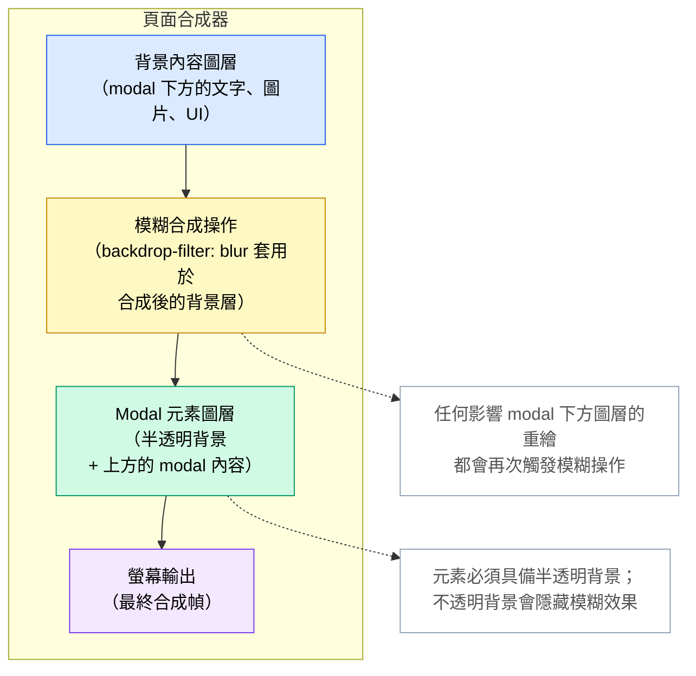

# [FEE-210] Backdrop Filter、Mix-Blend-Mode 與視覺效果

:::info
`backdrop-filter` 濾鏡套用於元素後方的區域，而非元素本身，這正是現代 UI 設計中常
見的「磨砂玻璃」面板效果背後的機制。`mix-blend-mode` 會將元素與疊加順序中位於其後
方的內容進行合成，其混合模式（例如 `multiply`、`screen`）借用自影像編輯軟體，
`isolation: isolate` 則可將混合範圍限制在指定的子樹內。`filter` 相對地是將效果套
用於元素本身及其內容，包括 `drop-shadow()`，此效果會遵循元素的 alpha 色版，而非像
`box-shadow` 那樣依循矩形邊界框。這三個屬性都會將元素提升至各自的合成器圖層，當多
個效果同時在同一畫面執行時，這項 GPU 成本會迅速累加。
:::

## 背景

CSS 有三個視覺效果相似、但功能截然不同的合成屬性：`filter`、`backdrop-filter` 與
`mix-blend-mode`。三者接受的效果名稱多有重疊（如模糊、亮度、對比），但作用於渲染樹
的不同部分，因此用錯屬性只會靜默地失效，而不會出現錯誤訊息。常見的觸發情境是導覽列
需要在捲動於頁面內容之上時呈現磨砂玻璃效果：單靠 `opacity` 無法模糊元素後方的內容，
而以偽元素複製背景並套用模糊來模擬效果，又會在底層內容一改變就失效。`backdrop-filter:
blur()` 可直接解決這個情境：只對元素後方的區域套用濾鏡，元素自身的內容維持不變。本
文依序說明每個屬性作用的方向（作用於元素本身或其背景）、`isolation: isolate` 如何
限制 `mix-blend-mode` 混合的範圍，以及限制單一畫面能負擔多少個此類效果的合成器圖層
成本。

## 視覺對比



此圖說明了使用 `backdrop-filter: blur()` 的 modal 頁面之合成器圖層堆疊。背景內容
圖層（即 modal 下方的所有頁面內容）會先進行合成。模糊操作接著套用於該合成結果，產
生經濾鏡處理的背景圖像。Modal 元素渲染在濾鏡背景之上，其半透明背景讓模糊後的內容得
以透出。最終合成幀輸出至螢幕。任何影響背景內容圖層的重繪都會導致模糊合成操作重新執
行，這正是減少設有 `backdrop-filter` 元素的數量能降低整體合成成本的原因。

## 範例

```css
/*
 * 磨砂玻璃面板：backdrop-filter、@supports 後備方案
 * 與 mix-blend-mode 文字覆蓋層
 *
 * 預期的 HTML 結構：
 *
 *   <div class="glass-panel">
 *     <p class="glass-panel__label">面板標籤</p>
 *     <div class="glass-panel__content">...</div>
 *   </div>
 */

/* ─── 基礎樣式（所有瀏覽器）──────────────────────────────────────────────── */

.glass-panel {
  /*
   * 後備背景：即便不支援 backdrop-filter，也要讓內容保持可讀。
   * 半透明填色在畫面上呈現的顏色，取決於其後方渲染的內容，
   * 因此請針對此面板可能出現的最深與最淺背景，實際驗證對比度，
   * 而非假設固定的 alpha 值就一定安全。
   */
  background-color: rgba(255, 255, 255, 0.82);
  border: 1px solid rgba(255, 255, 255, 0.4);
  border-radius: 0.75rem;
  padding: 1.5rem;
  position: relative;
}

/* ─── 磨砂玻璃增強（支援 backdrop-filter 的瀏覽器）──────────────────────── */

@supports ((backdrop-filter: blur(1px)) or (-webkit-backdrop-filter: blur(1px))) {
  .glass-panel {
    /*
     * 由於模糊效果本身提供了視覺分隔感，可以降低背景不透明度。
     * 高不透明度僅作為後備方案時才有需要。
     */
    background-color: rgba(255, 255, 255, 0.55);

    /*
     * 模糊半徑須大到足以遮蔽面板後方內容的細節，
     * 但也不宜過大，以免耗費 GPU 時間換來難以察覺的視覺差異；
     * 若要再加大數值，請先進行效能分析。
     */
    backdrop-filter: blur(12px) saturate(1.4);

    /*
     * Safari 前綴，Safari 17 以前的版本皆須使用。
     * Safari 18（2024 年 9 月正式版）加入了無前綴屬性，
     * 但上方的 @supports 防護同時檢查兩種寫法，
     * 讓 Safari 9–17 仍能取得此宣告，而非回落至純色後備方案。
     */
    -webkit-backdrop-filter: blur(12px) saturate(1.4);
  }
}

/* ─── mix-blend-mode 文字覆蓋層 ─────────────────────────────────────────── */

/*
 * 在面板上設定 isolation: isolate，防止標籤的混合模式
 * 外洩至面板外部，與相鄰或祖先元素互動。
 */
.glass-panel {
  isolation: isolate;
}

.glass-panel__label {
  /*
   * multiply 將標籤文字與面板背景進行混合。
   * 警告：必須針對所有背景狀態驗證對比度——
   * 深色內容上的淺色面板與淺色內容上的淺色面板都需要分別檢查。
   * 未經對比度驗證前，禁止上線此效果。
   */
  mix-blend-mode: multiply;
  font-weight: 700;
  letter-spacing: 0.05em;
  text-transform: uppercase;
  font-size: 0.75rem;
  color: #1e293b;
}

/* ─── 固定頁首模糊（第二個可接受的同時使用 backdrop-filter 案例）──────── */

.site-header {
  position: sticky;
  top: 0;
  z-index: 100;
  background-color: rgba(15, 23, 42, 0.8);
}

@supports ((backdrop-filter: blur(1px)) or (-webkit-backdrop-filter: blur(1px))) {
  .site-header {
    background-color: rgba(15, 23, 42, 0.6);
    backdrop-filter: blur(8px);
    -webkit-backdrop-filter: blur(8px);
  }
}
```

此範例展示了兩個同時可接受使用 `backdrop-filter` 的情境：磨砂玻璃內容面板與固定網
站頁首，兩者均以 `@supports` 區塊保護，並提供具有足夠不透明度的後備背景。
`.glass-panel` 設有 `isolation: isolate`，使套用於 `.glass-panel__label` 的
`mix-blend-mode: multiply` 的作用範圍限制在面板的子樹內，不與頁面背景或相鄰元件互
動。

## 最佳實踐

**應該（SHOULD）將 `backdrop-filter` 限制在每個視圖中同時渲染的兩到三個元素以內。**
固定導覽列、modal 覆蓋層與提示框是合理的上限。將 `backdrop-filter` 套用至大型捲動
列表中的每一張卡片，會為每張卡片建立一個合成器圖層，隨著可見卡片數量線性增加 GPU
記憶體，並常常在中低階行動裝置上造成掉幀。若設計要求大範圍使用磨砂玻璃表面，應與設
計團隊討論，是否可以採用更簡單的替代方案（不使用模糊效果的純半透明背景），以遠低於
原方案的效能成本達到相近的視覺層次感。

**禁止（MUST NOT）在未驗證所有可能背景狀態的對比度的情況下，將 `mix-blend-mode` 用
於文字元素。** 混合模式改變文字渲染的方式，可能在某個捲動位置通過 WCAG 標準，卻在
另一個位置不符合標準。靜態對比度檢查工具無法偵測此問題；驗證必須涵蓋文字在固定混合
元素下方內容捲動時，可能混合的所有背景顏色。若無法在所有背景狀態下保證達標的對比度，
則禁止使用混合文字效果，或必須將文字移出混合上下文，並以保證可讀的顏色單獨設定樣式。

**應該（SHOULD）以 `@supports ((backdrop-filter: blur(1px)) or (-webkit-backdrop-filter:
blur(1px)))` 包裹 `backdrop-filter` 的使用，並提供足夠不透明的純色背景作為後備方
案。** 當兩種寫法的 `backdrop-filter` 皆不受支援時，磨砂玻璃效果會可接受地降級為半
透明純色面板。由於後備背景本身仍是半透明的，其實際呈現的顏色取決於後方的內容，而這
在撰寫樣式時是未知的。應針對面板可能出現的最深與最淺背景，計算後備背景合成後顏色的
對比度，而不是依賴單一假設的 alpha 值，並將不透明度提高到文字與控制項在最差情況下
仍能達到 4.5:1 的對比度。

**應該（SHOULD）在包含 `mix-blend-mode` 子元素的任何父元素上使用 `isolation: isolate`，**
以防止混合效果外洩至相鄰元件。若缺少 `isolation`，混合元素會對整個疊加上下文進行合
成，包括完全不相關的祖先元素所定義的背景。這會導致混合元素的視覺外觀在相鄰或祖先內
容被修改時發生不可預期的改變。`isolation: isolate` 在渲染層面完全無成本（它不會提
升圖層），應被視為任何刻意使用 `mix-blend-mode` 時的必要搭配。

## 設計思維

### backdrop-filter 與合成器圖層

`backdrop-filter` 的運作方式是：瀏覽器先合成被篩選元素下方的所有圖層，將指定的濾鏡
函式套用於該合成結果，再將經過濾鏡處理的圖像作為元素的視覺背景進行渲染。元素本身
（背景色、邊框及子元素）隨後疊加在上方。整個過程由 GPU 加速執行，但並非毫無成本：瀏
覽器必須維護一份背景內容的獨立副本，並執行濾鏡運算，其代價與元素邊界框的面積成正比。

覆蓋大部分視窗的大型元素是成本最高的情況。一個帶有 `backdrop-filter: blur(20px)` 的
全螢幕 modal 覆蓋層，會強制瀏覽器在每次影響 modal 下方任意圖層的重繪時，對整個可見
區域執行模糊運算。對單一覆蓋層而言這尚可接受，但當多個設有 backdrop-filter 的元素疊
加時，就會成為顯著的效能問題。`backdrop-filter` 與疊加上下文的關係值得注意：它會隱
式地將元素提升為新的疊加上下文和合成器圖層。`will-change: transform` 與
`transform: translateZ(0)` 也有類似的圖層提升效果，不必要地疊加這些提升操作會成倍
增加 GPU 記憶體使用量，應僅在效能分析顯示有實際需要時才套用。

### mix-blend-mode 與 isolation 屬性

預設情況下，`mix-blend-mode` 會與位於元素當前疊加上下文中、視覺上位於其後方的所有
內容進行混合。如果一個混合元素疊加在 `body` 上設定的頁面級背景圖片之上，混合效果會
包含該背景。如果它疊加在來自完全不同的 UI 區塊的內容之上，那些內容也會參與混合。這
種預設行為往往不是設計意圖，且當使用者捲動位於混合元素下方的內容時，視覺結果會持續
改變。

將 `isolation: isolate` 套用於父元素，可建立一個新的疊加上下文，作為混合的邊界：
`mix-blend-mode` 子元素只會與被隔離子樹內的元素混合，而不會與外部的任何元素互動。
當一個混合裝飾元素不應與屬於頁面層級中完全不同元件的背景圖片或顏色互動時，這一點
至關重要。若缺少 `isolation: isolate`，除錯非預期的混合互動通常需要仔細分析疊加上
下文樹，而這在 DOM 結構中是不可見的；瀏覽器如何建構這棵樹，請參見下方「延伸閱讀」
中的文章。

### filter 與 backdrop-filter 的差異

`filter` 和 `backdrop-filter` 名稱相近，但作用目標相反。`filter` 影響元素本身及其
所有內容，如同先將元素繪製到離屏畫布上，再對該畫布套用濾鏡，最後才進行合成。
`backdrop-filter` 影響元素後方的內容，而元素自身的內容則不受影響地疊加在經濾鏡處理
的背景之上。

兩者可以刻意組合使用：一張磨砂玻璃卡片可以同時擁有 `backdrop-filter: blur(12px)`
來模糊其後方的內容，以及 `filter: brightness(1.05)` 來使卡片本身略微亮於周圍環境，
從而強化浮起表面的視覺幻覺。`filter: drop-shadow()` 尤其值得關注，可作為透明圖片場
景中 `box-shadow` 的替代方案：它跟隨元素的 alpha 色版輪廓而非矩形邊界框投射陰影，
為 SVG 圖示、PNG 標誌和去背圖片產生視覺上準確的陰影效果。

### 效能成本與何時進行效能分析

`backdrop-filter`、`mix-blend-mode` 和 `filter` 三個屬性都會建立合成器圖層。Chrome
DevTools 的「圖層（Layers）」面板會顯示完整的圖層樹，包括哪些元素觸發了圖層提升，
以及每個圖層佔用的預估 GPU 記憶體。對使用視覺效果的頁面檢視此面板，可以判斷圖層數
量是否合理，或是否因無意間的提升操作而失控增長。DevTools 的 FPS 計量器在捲動和動畫
期間可反映圖層合成成本是否已引發卡頓。

`will-change` 屬性常被用作視覺效果造成卡頓時的效能修復方案。這在某些情況下是適當的，
但不應盲目添加。`will-change: transform` 或 `will-change: filter` 會在動畫開始前為
元素預留 GPU 記憶體，防止提升成本在動畫期間發生。然而，這會在元素存在於 DOM 期間持
續佔用該記憶體。對數百個元素添加 `will-change`，或對從未真正執行動畫的元素添加，會
浪費 GPU 記憶體，在記憶體受限的裝置上甚至可能適得其反地降低效能。應先以圖層面板進行
效能分析，僅對效能分析顯示動畫期間提升成本確實造成掉幀的元素套用 `will-change`。

### backdrop-filter 的漸進增強

`backdrop-filter` 目前已達到 Baseline 水準，在主流瀏覽器中皆受支援：MDN 將其列為自
2024 年 9 月起「新近可用（newly available）」，此時各大瀏覽器引擎都已支援無前綴寫
法。正確做法仍是以 `@supports` 保護此效果，並在區塊外提供後備規則，因為較舊版本的
瀏覽器完全不支援此屬性。後備方案應使用具有足夠不透明度的背景，即便沒有模糊效果，也
能傳達面板的層次感。例如 `rgba(255, 255, 255, 0.85)` 這類背景，便能提供視覺上尚可
接受的純色替代方案，取代磨砂玻璃效果，但仍須通過上方「最佳實踐」所述的對比度檢查。

Safari 自 Safari 9（2015 年）起便在 `-webkit-backdrop-filter` 前綴下支援
`backdrop-filter`。無前綴的寫法直到 Safari 18 才問世：該版本於 2024 年 6 月釋出
beta 版，並於 2024 年 9 月推出正式版（Useful Angle, 2024；O'Leary, 2024）；從
Safari 9 到 17.x 的所有版本都需要前綴。正因為存在這個落差，`@supports` 防護應同時
測試兩種寫法：`@supports ((backdrop-filter: blur(1px)) or (-webkit-backdrop-filter:
blur(1px)))`。只測試無前綴形式，在 Safari 9–17 上會判定為 false，導致頁面回落至純
色後備方案，即便這些版本其實可以用前綴形式呈現模糊效果。同時測試兩種寫法可讓防護在
Safari 9–17 上也判定為成立，使區塊內的前綴宣告仍能觸及需要它的瀏覽器。

## 常見錯誤

### 未設定半透明背景而使用 `backdrop-filter`

`backdrop-filter` 將效果套用於元素後方的區域，但若元素本身具有完全不透明的背景色，
該不透明背景會完全遮蔽經濾鏡處理的背景層。模糊或亮度效果確實套用於下方圖層，但結果
被元素自身的背景所隱藏。修復方法始終是使用半透明背景色（`rgba` 或帶有 alpha 值遠
低於 1.0 的 `hsl`），以便濾鏡處理後的背景能透過元素顯示。一個常見的錯誤是在一條規則
中設定背景，在另一條規則中設定 `backdrop-filter`，而後來的規則又將背景覆蓋為完全不
透明色，卻未意識到濾鏡效果因此變得不可見。

### 未以 `@supports` 保護 `backdrop-filter`

在不支援 `backdrop-filter` 的瀏覽器中，該屬性會被靜默忽略。如果元素的背景是半透明
的，原本期望由模糊效果提供視覺分隔感，則不受支援的瀏覽器會渲染一個透明或近乎透明的
面板且沒有模糊效果，可能導致文字難以閱讀。`@supports` 防護可讓不受支援的瀏覽器套用
另一組後備背景（不透明度更高，顏色也可能不同）。省略此防護意味著頁面作者無法提供後
備方案，在不受支援的環境中視覺結果將難以預料。

### 未經 WCAG 對比度驗證即對文字使用 `mix-blend-mode`

設有 `mix-blend-mode: multiply` 或 `mix-blend-mode: overlay` 的文字元素，在頁面初
次載入時，當文字後方的背景為已知顏色，可能具有足夠的對比度。隨著使用者捲動，混合文
字後方出現不同的內容，有效對比度持續改變。在初始捲動位置通過 WCAG AA 的元素，當背
景變為接近文字顏色的淺色時，對比度可能降至 4.5:1 的門檻以下。自動化對比度檢查工具
在單一時間點孤立地測試元素，無法偵測此類失敗模式。在上線前，必須針對具代表性的背景
變化進行手動測試。

### 忘記在 `mix-blend-mode` 元素的父元素上設定 `isolation: isolate`

若缺少包含祖先元素上的 `isolation: isolate`，`mix-blend-mode` 子元素會對整個疊加上
下文進行混合，可能包含頁面級背景、遠端祖先元素上的背景圖片，以及視覺上位於混合元素
後方的完全不相關 UI 元件的內容。產生的視覺外觀在本地開發時往往是正確的，但當元件被
置於不同的頁面上下文中時便會出錯。對元件根元素添加 `isolation: isolate` 完全無需渲
染成本，且能消除這一類依賴上下文的渲染錯誤。

## 延伸閱讀

- [CSS 與排版系統總覽](/zh-tw/CSS%20and%20Layout%20Systems/200)：所有 CSS 排版主題
  的父級總覽，包含本文所涵蓋的視覺效果與合成屬性。
- [CSS 包含性與 contain](/zh-tw/CSS%20and%20Layout%20Systems/209)：包含性與合成器
  圖層成本，和 `backdrop-filter`、`filter` 的圖層提升直接相關。
- [Stacking Context、繪製順序與 Top Layer](/zh-tw/CSS%20and%20Layout%20Systems/stacking-contexts-paint-order-top-layer)：
  `isolation: isolate` 會建立新的疊加上下文；本文說明繪製順序模型，決定
  `mix-blend-mode` 子元素究竟會與什麼內容合成。
- [GPU 加速動畫與 will-change](/zh-tw/Rendering%20and%20Performance/710)：動畫的合
  成器圖層管理，與 `backdrop-filter`、`filter` 所引發的圖層建立互相重疊，兩者共用
  相同的 DevTools 圖層面板。
- [無障礙設計總覽](/zh-tw/Accessibility/1000)：WCAG 對比度要求直接適用於文字上的
  `mix-blend-mode`。

## 參考資料

- MDN Contributors, "backdrop-filter," MDN Web Docs (2025). https://developer.mozilla.org/en-US/docs/Web/CSS/Reference/Properties/backdrop-filter
- MDN Contributors, "mix-blend-mode," MDN Web Docs (2025). https://developer.mozilla.org/en-US/docs/Web/CSS/Reference/Properties/mix-blend-mode
- MDN Contributors, "filter," MDN Web Docs (2025). https://developer.mozilla.org/en-US/docs/Web/CSS/Reference/Properties/filter
- MDN Contributors, "isolation," MDN Web Docs (2025). https://developer.mozilla.org/en-US/docs/Web/CSS/Reference/Properties/isolation
- MDN Contributors, "@supports," MDN Web Docs (2025). https://developer.mozilla.org/en-US/docs/Web/CSS/@supports
- W3C, "Compositing and Blending Level 1," W3C Candidate Recommendation Draft (2024). https://www.w3.org/TR/compositing-1/
- Adam Argyle and Joe Medley, "Create OS-style backgrounds with backdrop-filter," web.dev (2019). https://web.dev/articles/backdrop-filter
- Can I Use, "backdrop-filter," caniuse.com (2026). https://caniuse.com/css-backdrop-filter
- Can I Use, "mix-blend-mode," caniuse.com (2026). https://caniuse.com/css-mixblendmode
- Useful Angle, "CSS backdrop-filter is Finally Unprefixed Across All Browsers," usefulangle.com (2024). https://usefulangle.com/post/391/css-backdrop-filter-unprefixed
- Rob O'Leary, "The backdrop-filter CSS property has been unprefixed," roboleary.net (2024). https://www.roboleary.net/blog/unprefixing-backdrop-filter/
