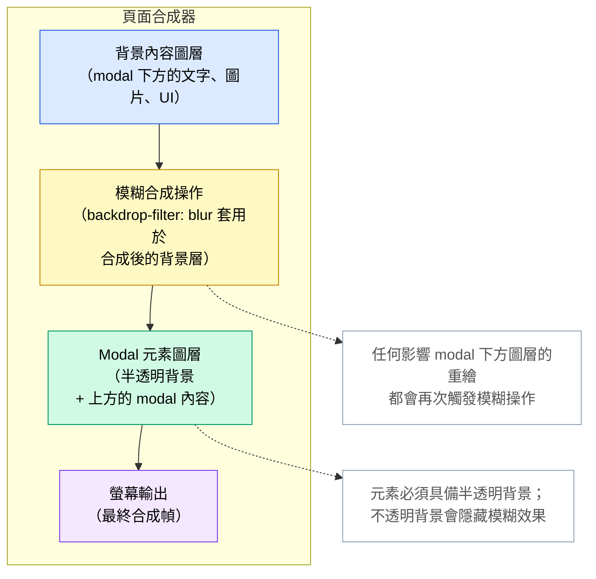

# Backdrop Filter、Mix-Blend-Mode 與視覺效果

`backdrop-filter` 將圖形效果——模糊、亮度、對比、飽和度——套用於元素後方的區域，
而非元素本身。現代 UI 設計中隨處可見的「磨砂玻璃」面板效果——一個透明表面讓其下方
的內容呈現模糊——幾乎都是以 `backdrop-filter: blur()` 實作的。此屬性要求元素具有半
透明背景；全不透明的背景會完全遮蔽背景層，使濾鏡效果對使用者不可見。

`mix-blend-mode` 控制元素的內容如何與其背景進行合成，所採用的合成模式類似於影像編
輯軟體中的圖層混合模式：`multiply`、`screen`、`overlay`、`difference` 等。元素會
與疊加順序中位於其視覺後方的所有內容建立混合上下文。`isolation: isolate` 可建立新
的疊加上下文，限制哪些元素參與混合，防止效果外洩至頁面上不相關的部分。

`filter` 將視覺效果套用於元素本身及其所有內容：`blur()`、`brightness()`、
`contrast()`、`grayscale()`、`sepia()`、`drop-shadow()`。與 `box-shadow` 不同，
`filter: drop-shadow()` 會遵循元素的 alpha 色版，為透明 PNG 和 SVG 投射跟隨其輪廓
形狀的陰影，而非元素的矩形邊界框。每當具有不規則輪廓的圖片——圖示、標誌、去背照片
——需要視覺上準確的陰影時，這個差異就顯得特別重要。

上述三個屬性都會將元素提升至各自的合成器圖層，從而帶來 GPU 記憶體與合成成本。同時
套用於多個元素時，它們可能增加記憶體使用量並降低捲動效能，在 GPU 資源有限的行動裝
置上尤為明顯。理解每個屬性的效能影響，與理解其視覺行為同等重要。

## 設計思維

### backdrop-filter 與合成器圖層

`backdrop-filter` 的運作方式是：瀏覽器先合成被篩選元素下方的所有圖層，將指定的濾鏡
函式套用於該合成結果，再將經過濾鏡處理的圖像作為元素的視覺背景進行渲染。元素本身——
背景色、邊框及子元素——隨後疊加在上方。整個過程由 GPU 加速執行，但並非毫無成本：瀏
覽器必須維護一份背景內容的獨立副本，並執行濾鏡運算，其代價與元素邊界框的面積成正比。

覆蓋大部分視窗的大型元素是成本最高的情況。一個帶有 `backdrop-filter: blur(20px)` 的
全螢幕 modal 覆蓋層，會強制瀏覽器在每次影響 modal 下方任意圖層的重繪時，對整個可見
區域執行模糊運算。對單一覆蓋層而言這尚可接受，但當多個設有 backdrop-filter 的元素疊
加時，就會成為顯著的效能問題。`backdrop-filter` 與疊加上下文的關係值得注意：它會隱
式地將元素提升為新的疊加上下文和合成器圖層。`will-change: transform` 與
`transform: translateZ(0)` 也有類似的圖層提升效果，不必要地疊加這些提升操作會成倍
增加 GPU 記憶體使用量，應僅在效能分析顯示有實際需要時才套用。

### mix-blend-mode 與 isolation 屬性

預設情況下，`mix-blend-mode` 會與位於元素當前疊加上下文中、視覺上位於其後方的所有
內容進行混合。如果一個混合元素疊加在 `body` 上設定的頁面級背景圖片之上，混合效果會
包含該背景。如果它疊加在來自完全不同的 UI 區塊的內容之上，那些內容也會參與混合。這
種預設行為往往不是設計意圖，且當使用者捲動位於混合元素下方的內容時，視覺結果會持續
改變。

將 `isolation: isolate` 套用於父元素，可建立一個新的疊加上下文，作為混合的邊界：
`mix-blend-mode` 子元素只會與被隔離子樹內的元素混合，而不會與外部的任何元素互動。
當一個混合裝飾元素不應與屬於頁面層級中完全不同元件的背景圖片或顏色互動時，這一點
至關重要。若缺少 `isolation: isolate`，除錯非預期的混合互動通常需要仔細分析疊加上
下文樹——而這在 DOM 結構中是不可見的。

### filter 與 backdrop-filter 的差異

`filter` 和 `backdrop-filter` 名稱相近，但作用目標相反。`filter` 影響元素本身及其
所有內容，如同先將元素繪製到離屏畫布上，再對該畫布套用濾鏡，最後才進行合成。
`backdrop-filter` 影響元素後方的內容，而元素自身的內容則不受影響地疊加在經濾鏡處理
的背景之上。

兩者可以刻意組合使用：一張磨砂玻璃卡片可以同時擁有 `backdrop-filter: blur(12px)` 
來模糊其後方的內容，以及 `filter: brightness(1.05)` 來使卡片本身略微亮於周圍環境，
從而強化浮起表面的視覺幻覺。理解每個屬性的方向性，有助於在效果未如預期出現時避免混
淆。`filter: drop-shadow()` 尤其值得關注，可作為透明圖片場景中 `box-shadow` 的替
代方案：它跟隨元素的 alpha 色版輪廓而非矩形邊界框投射陰影，為 SVG 圖示、PNG 標誌和
去背圖片產生視覺上準確的陰影效果。

### 效能成本與何時進行效能分析

`backdrop-filter`、`mix-blend-mode` 和 `filter` 三個屬性都會建立合成器圖層。Chrome
DevTools 的「圖層（Layers）」面板會顯示完整的圖層樹，包括哪些元素觸發了圖層提升，
以及每個圖層佔用的預估 GPU 記憶體。對使用視覺效果的頁面檢視此面板，可以判斷圖層數
量是否合理，或是否因無意間的提升操作而失控增長。DevTools 的 FPS 計量器在捲動和動畫
期間可反映圖層合成成本是否已引發卡頓。

`will-change` 屬性常被用作視覺效果造成卡頓時的效能修復方案。這在某些情況下是適當的，
但不應盲目添加。`will-change: transform` 或 `will-change: filter` 會在動畫開始前為
元素預留 GPU 記憶體，防止提升成本在動畫期間發生。然而，這會在元素存在於 DOM 期間持
續佔用該記憶體。對數百個元素添加 `will-change`，或對從未真正執行動畫的元素添加，會
浪費 GPU 記憶體，在記憶體受限的裝置上甚至可能適得其反地降低效能。應先以圖層面板進行
效能分析，僅對效能分析顯示動畫期間提升成本確實造成掉幀的元素套用 `will-change`。

### backdrop-filter 的漸進增強

`backdrop-filter` 並非所有瀏覽器都支援，儘管在 2024 年支援已相當廣泛。正確的做法是
使用 `@supports (backdrop-filter: blur(1px))` 來保護效果，並在 `@supports` 區塊外
提供後備規則。後備方案應為具有足夠不透明度的半透明背景，即便沒有模糊效果，也能傳達
面板的層次感——例如 `rgba(255, 255, 255, 0.85)` 或具有相當不透明度的淺色，都能提供
視覺上尚可接受的純色替代方案，取代磨砂玻璃效果。

Safari 自 Safari 9 起便在 `-webkit-backdrop-filter` 前綴下支援 `backdrop-filter`；
Safari 15.4 及更新版本則支援無前綴的標準屬性。對於需要支援 Safari 15.4 以前版本的
專案，必須同時包含廠商前綴形式與標準屬性。`@supports` 防護應測試無前綴形式；若瀏覽
器需要前綴，它將回落至後備方案——對較舊的 Safari 版本而言，這是可接受的結果。

## 最佳實踐

**應該（SHOULD）將 `backdrop-filter` 限制在每個視圖中同時渲染的兩到三個元素以內。**
固定導覽列、modal 覆蓋層與提示框是合理的上限。將 `backdrop-filter` 套用至大型捲動
列表中的每一張卡片，會為每張卡片建立一個合成器圖層，隨著可見卡片數量線性增加 GPU
記憶體，並常常在中低階行動裝置上造成掉幀。若設計要求大範圍使用磨砂玻璃表面，應與設
計團隊討論，是否可以使用更簡單的替代方案——無模糊效果的純半透明背景——以遠低於原方
案的效能成本達到相近的視覺層次感。

**禁止（MUST NOT）在未驗證所有可能背景狀態的對比度的情況下，將 `mix-blend-mode` 用
於文字元素。** 混合模式改變文字渲染的方式，可能在某個捲動位置通過 WCAG 標準，卻在
另一個位置不符合標準。靜態對比度檢查工具無法偵測此問題；驗證必須涵蓋文字在固定混合
元素下方內容捲動時，可能混合的所有背景顏色。若無法在所有背景狀態下保證達標的對比度，
則禁止使用混合文字效果，或必須將文字移出混合上下文，並以保證可讀的顏色單獨設定樣式。

**應該（SHOULD）以 `@supports (backdrop-filter: blur(1px))` 包裹 `backdrop-filter`
的使用，並提供純半透明背景作為後備方案。** 當 `backdrop-filter` 不受支援時，磨砂玻
璃效果可接受地降級為半透明純色面板。後備背景應具有足夠的不透明度，使面板內的文字和
互動元素在任何背景內容出現時都能清晰閱讀。在後備狀態下，當背景較暗或較複雜時，背景
不透明度低於 0.7 通常會導致文字對比度不足。

**應該（SHOULD）在包含 `mix-blend-mode` 子元素的任何父元素上使用 `isolation: isolate`，**
以防止混合效果外洩至相鄰元件。若缺少 `isolation`，混合元素會對整個疊加上下文進行合
成，包括完全不相關的祖先元素所定義的背景。這會導致混合元素的視覺外觀在相鄰或祖先內
容被修改時發生不可預期的改變。`isolation: isolate` 在渲染層面完全無成本——它不會提
升圖層——應被視為任何刻意使用 `mix-blend-mode` 時的必要搭配。

## 視覺呈現



此圖說明了使用 `backdrop-filter: blur()` 的 modal 頁面的合成器圖層堆疊。背景內容圖
層——modal 下方的所有頁面內容——首先進行合成。模糊操作隨後套用於該合成結果，產生經
濾鏡處理的背景圖像。Modal 元素渲染在濾鏡背景之上，其半透明背景使模糊後的內容得以透
出。最終合成幀輸出至螢幕。任何影響背景內容圖層的重繪都會導致模糊合成操作重新執行，
這正是減少設有 `backdrop-filter` 元素的數量能降低整體合成成本的原因。

## 範例

```css
/*
 * 磨砂玻璃面板：backdrop-filter、@supports 後備方案
 * 與 mix-blend-mode 文字覆蓋層
 *
 * 預期的 HTML 結構：
 *
 *   <div class="glass-panel">
 *     <p class="glass-panel__label">面板標籤</p>
 *     <div class="glass-panel__content">...</div>
 *   </div>
 */

/* ─── 基礎樣式（所有瀏覽器）──────────────────────────────────────────────── */

.glass-panel {
  /*
   * 後備背景：即便不支援 backdrop-filter，也能保持內容的可讀性。
   * rgba alpha 值 0.82 能在大多數中間調背景下為淺色文字提供可接受的對比度。
   */
  background-color: rgba(255, 255, 255, 0.82);
  border: 1px solid rgba(255, 255, 255, 0.4);
  border-radius: 0.75rem;
  padding: 1.5rem;
  position: relative;
}

/* ─── 磨砂玻璃增強（支援 backdrop-filter 的瀏覽器）──────────────────────── */

@supports (backdrop-filter: blur(1px)) {
  .glass-panel {
    /*
     * 由於模糊效果本身提供了視覺分隔感，可以降低背景不透明度。
     * 高不透明度僅作為後備方案時才有需要。
     */
    background-color: rgba(255, 255, 255, 0.55);

    /*
     * 模糊半徑應足夠大以遮蔽面板後方的細節，通常為 8px–20px。
     * 超過 20px 的值視覺效益遞減，且會增加 GPU 成本。
     */
    backdrop-filter: blur(12px) saturate(1.4);

    /*
     * Safari 前綴——Safari 15.4 以前的版本需要此前綴。
     * 現代 Safari 已支援無前綴的標準屬性。
     */
    -webkit-backdrop-filter: blur(12px) saturate(1.4);
  }
}

/* ─── mix-blend-mode 文字覆蓋層 ─────────────────────────────────────────── */

/*
 * 在面板上設定 isolation: isolate，防止標籤的混合模式
 * 外洩至面板外部，與相鄰或祖先元素互動。
 */
.glass-panel {
  isolation: isolate;
}

.glass-panel__label {
  /*
   * multiply 將標籤文字與面板背景進行混合。
   * 警告：必須針對所有背景狀態驗證對比度——
   * 深色內容上的淺色面板與淺色內容上的淺色面板都需要分別檢查。
   * 未經對比度驗證前，禁止上線此效果。
   */
  mix-blend-mode: multiply;
  font-weight: 700;
  letter-spacing: 0.05em;
  text-transform: uppercase;
  font-size: 0.75rem;
  color: #1e293b;
}

/* ─── 固定頁首模糊（第二個可接受的同時使用 backdrop-filter 案例）──────── */

.site-header {
  position: sticky;
  top: 0;
  z-index: 100;
  background-color: rgba(15, 23, 42, 0.8);
}

@supports (backdrop-filter: blur(1px)) {
  .site-header {
    background-color: rgba(15, 23, 42, 0.6);
    backdrop-filter: blur(8px);
    -webkit-backdrop-filter: blur(8px);
  }
}
```

此範例展示了兩個同時可接受使用 `backdrop-filter` 的情境：磨砂玻璃內容面板與固定網
站頁首，兩者均以 `@supports` 區塊保護，並提供具有足夠不透明度的後備背景。
`.glass-panel` 設有 `isolation: isolate`，使套用於 `.glass-panel__label` 的
`mix-blend-mode: multiply` 的作用範圍限制在面板的子樹內，不與頁面背景或相鄰元件互
動。

## 常見錯誤

### 未設定半透明背景而使用 `backdrop-filter`

`backdrop-filter` 將效果套用於元素後方的區域，但若元素本身具有完全不透明的背景色，
該不透明背景會完全遮蔽經濾鏡處理的背景層。模糊或亮度效果確實套用於下方圖層，但結果
被元素自身的背景所隱藏。修復方法始終是使用半透明背景色——`rgba` 或帶有 alpha 值遠
低於 1.0 的 `hsl`——以便濾鏡處理後的背景能透過元素顯示。一個常見的錯誤是在一條規則
中設定背景，在另一條規則中設定 `backdrop-filter`，而後來的規則又將背景覆蓋為完全不
透明色，卻未意識到濾鏡效果因此變得不可見。

### 未以 `@supports` 保護 `backdrop-filter`

在不支援 `backdrop-filter` 的瀏覽器中，該屬性會被靜默忽略。如果元素的背景是半透明
的，原本期望由模糊效果提供視覺分隔感，則不受支援的瀏覽器會渲染一個透明或近乎透明的
面板且沒有模糊效果，可能導致文字難以閱讀。`@supports` 防護允許為不受支援的瀏覽器單
獨提供後備背景——更高的不透明度，可能還有不同的顏色。省略此防護意味著頁面作者無法提
供後備方案，在不受支援的環境中視覺結果將難以預料。

### 未經 WCAG 對比度驗證即對文字使用 `mix-blend-mode`

設有 `mix-blend-mode: multiply` 或 `mix-blend-mode: overlay` 的文字元素，在頁面初
次載入時，當文字後方的背景為已知顏色，可能具有足夠的對比度。隨著使用者捲動，混合文
字後方出現不同的內容，有效對比度持續改變。在初始捲動位置通過 WCAG AA 的元素，當背
景變為接近文字顏色的淺色時，對比度可能降至 4.5:1 的門檻以下。自動化對比度檢查工具
在單一時間點孤立地測試元素，無法偵測此類失敗模式。在上線前，必須針對具代表性的背景
變化進行手動測試。

### 忘記在 `mix-blend-mode` 元素的父元素上設定 `isolation: isolate`

若缺少包含祖先元素上的 `isolation: isolate`，`mix-blend-mode` 子元素會對整個疊加上
下文進行混合，可能包含頁面級背景、遠端祖先元素上的背景圖片，以及視覺上位於混合元素
後方的完全不相關 UI 元件的內容。產生的視覺外觀在本地開發時往往是正確的，但當元件被
置於不同的頁面上下文中時便會出錯。對元件根元素添加 `isolation: isolate` 完全無需渲
染成本，且能消除這一類依賴上下文的渲染錯誤。

## 相關 FEE

| FEE | 關聯說明 |
|-----|---------|
| [FEE-200 CSS 與排版系統總覽](./200.md) | 所有 CSS 排版主題的父級總覽，包含本文所涵蓋的視覺效果與合成屬性。 |
| [FEE-209 CSS 包含性與 `contain`](./209.md) | 包含性與合成器圖層成本與 `backdrop-filter` 和 `filter` 的圖層提升直接相關。理解包含性成本可為管理視覺效果開銷提供背景知識。 |
| [FEE-710 GPU 加速動畫](../Rendering%20and%20Performance/710.md) | 動畫的合成器圖層管理與 `backdrop-filter` 和 `filter` 所引發的圖層建立互相重疊。兩個主題共享相同的 DevTools 圖層面板與 `will-change` 使用指南。 |
| [FEE-1000 無障礙性總覽](../Accessibility/1000.md) | WCAG 對比度要求直接適用於文字上的 `mix-blend-mode`。混合模式對文字可讀性的無障礙性影響在無障礙性系列文章中有深入說明。 |

## 參考資料

- MDN: backdrop-filter — https://developer.mozilla.org/en-US/docs/Web/CSS/backdrop-filter
- MDN: mix-blend-mode — https://developer.mozilla.org/en-US/docs/Web/CSS/mix-blend-mode
- MDN: filter — https://developer.mozilla.org/en-US/docs/Web/CSS/filter
- MDN: isolation — https://developer.mozilla.org/en-US/docs/Web/CSS/isolation
- Compositing and Blending Level 1 — https://www.w3.org/TR/compositing-1/
- web.dev: backdrop-filter — https://developer.chrome.com/docs/css-ui/backdrop-filter
- Can I Use: backdrop-filter — https://caniuse.com/css-backdrop-filter
- Can I Use: mix-blend-mode — https://caniuse.com/css-mixblendmode
