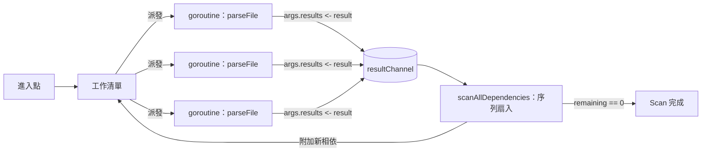

# [FEE-1802] esbuild：平行架構

:::info
esbuild 將平行性視為明確的設計原則：幾乎所有 CPU 時間都應花在可完整平行化的工作上。承載這項原則貫穿整個 bundler 的模式，是透過 Go goroutine 進行扇出，並在單一 channel 上進行扇入。`internal/bundler/bundler.go` 中的 scan 階段，以及 `internal/linker/linker.go` 中的 compile 階段，都以這種方式組織 CPU 密集工作：每個檔案或每個 chunk 一個 goroutine，由單一消費者抽乾結果。對任何 CPU 密集 pipeline 而言，可借鏡的經驗是把中介資料保留在記憶體中，以廉價的並行單位派發工作，並透過 channel 或 wait group 匯流，讓單一消費者能在無鎖狀態下變動共享狀態。
:::

## 背景

esbuild 的 `docs/architecture.md` 將「最大化平行性」列為核心原則：大部分時間應花在可完整平行化的工作上，可透過 Go 的 `--trace=[file]` 旗標與 `go tool trace` 觀察。這項原則實作於兩階段 pipeline（scan 與 compile）之內，兩者皆位於 `internal/bundler/bundler.go`，這是組織平行性的架構單位。Evan Wallace 在專案 FAQ 中發表的論述，把平行性與 Go 的共享記憶體 threading 模型列為 esbuild 速度的核心原因，並間接對比 JavaScript runtime 必須在 thread 之間序列化資料的限制。設計意圖加上 Go 的廉價 goroutine 加上共享記憶體，這個組合搭起本文要在原始碼中追溯的結構模式。

## 情境

設想一條圍繞單一用途 CLI 鏈的 TypeScript 建構流程：每個原始檔依序通過 Babel、`tsc`、minifier，每個階段之間以磁碟緩衝中介輸出。每個工具重新解析檔案，建出自己的 AST，再序列化回字串，下個工具又從零開始。當有平行性時，也只是 OS-process 層級的單檔平行，並在每一跳付出重新解析的代價。esbuild 的結構性替代方案是把 AST 跨 pass 留在記憶體中，將每檔工作以 goroutine 扇出，讓 goroutine 直接共享記憶體，並由單一 channel 收集結果。

## 最佳實踐

- **必須**把解析與程式碼產生視為可平行化階段，並接受 linking 本質上是序列的，FAQ 明確指出：「Parsing and code generation are most of the work and are fully parallelizable (linking is an inherently serial task for the most part).」
- **必須**為任何可能被 goroutine 扇出耗盡的 OS 級資源設上限。esbuild 的 `internal/fs/fs.go` 對檔案描述符採用此做法，以 buffered channel 作為計數型 semaphore，包覆每次檔案開啟動作，避免扇出衝破 `ulimit -n`。
- **應該**將 pipeline 設計為以跨核心完整 CPU 飽和為目標，對應 `bundler.go` 的階段切分（scan 平行化解析；compile 平行化程式碼產生；linking 位於兩者之間，作為序列性匯流點）。
- **可以**在派發單位本身廉價時，倚賴語言 runtime 的排程器，而不必自行打造 worker pool。esbuild 無條件為每個檔案派發一個 goroutine，由 Go 排程器多工；esbuild 自己強制施加的唯一硬上限是 `internal/fs/fs.go` 中的 FD semaphore。

## 設計思維

esbuild 採取的取捨是以記憶體內平行性換取跨工具序列化。FAQ 直接點明：其他 bundler 把解析、轉譯、minify 拆成獨立 pass，並在不同資料表示之間轉換以串接函式庫（string→TS→JS→string，再 string→JS→older JS→string，再 string→JS→minified JS→string），這會用掉更多記憶體並拖慢速度。esbuild 把這些 pass 交錯運行在共享的記憶體內 AST 上，讓 goroutine 扇出產生效益，因為 goroutine 之間共享記憶體是免費的。

第二個取捨是無上限扇出對應有上限的 OS 資源。scan 階段沒有固定大小的 worker pool，任何被發現的檔案都會派發新的 goroutine。Goroutine 廉價，Go 排程器吸收數量；檔案描述符稀缺。esbuild 的解法是非對稱的：讓 goroutine 自由扇出，但對唯一具備硬性天花板的資源（FD）以計數型 semaphore 設限。esbuild 倚賴 Go 預設的 `GOMAXPROCS`（預設值為 `runtime.NumCPU()`）做 thread 級多工；FD semaphore 是 esbuild 自身施加的唯一明確上限。

## 深入探討

compile 階段的每個 chunk 雜湊使用 buffered channel 作為一次性的 future。雜湊在另一個 goroutine 上預先計算；只有當消費者真的需要雜湊時才會在 channel 上阻塞。這裡的 channel 等同於跨 goroutine 的 memoization：值送出一次後，再回送進同一個 buffered 槽位，讓後續讀取仍能讀到。

*來源：internal/linker/linker.go*

```go
func (c *linkerContext) generateIsolatedHashInParallel(chunk *chunkInfo) {
  // Compute the hash in parallel. This is a speedup when it turns out the hash
  // isn't needed (well, as long as there are threads to spare).
  channel := make(chan []byte, 1)
  chunk.waitForIsolatedHash = func() []byte {
    data := <-channel
    channel <- data
    return data
  }
  go c.generateIsolatedHash(chunk, channel)
}
```

列印之所以可平行化，源自 AST 表示的結構性原因。`docs/architecture.md` 直接表明：「Each file is printed independently from other files, so files can be printed in parallel. This extends to source map generation.」每個 AST 儲存的是進入自身原始檔的 byte offset，因此沒有合併過的 AST，也沒有共享的可變印表機狀態；每個檔案的列印工作都是自足的 goroutine。

## 圖解



此圖描繪 scan 階段迴圈：進入點為工作清單種子，每個項目派發一個執行 `parseFile` 的 goroutine，所有 goroutine 寫入單一 `resultChannel`，序列化的 `scanAllDependencies` 消費者抽乾 channel、變動共享 `results` slice，並把新發現的相依附回工作清單。當剩餘計數歸零時迴圈終止。此處的結構性選擇即 FAQ 的「全部留在記憶體，pass 之間不做磁碟緩衝」決策；pass 在共享的記憶體內 AST 上交錯運行，而非在工具之間以字串序列化串接。

## 範例

scan 階段透過三段原始碼把扇出與扇入接起來。第一，scanner struct 上的 channel 欄位以註解標出不變式：`results` slice 由唯一的 goroutine 變動，因此不需 mutex：

*來源：internal/bundler/bundler.go*

```go
// These are not guarded by a mutex because it's only ever modified by a single
// thread. Note that not all results in the "results" array are necessarily
// valid. Make sure to check the "ok" flag before using them.
results       []parseResult
visited       map[logger.Path]visitedFile
resultChannel chan parseResult
```

第二，每個新發現的檔案派發一個新的 goroutine，並把 `s.resultChannel` 作為結果出口傳入。`parseArgs` 帶有許多欄位；此處承重的只有 channel 的交接：

*來源：internal/bundler/bundler.go*

```go
go parseFile(parseArgs{ ... results: s.resultChannel, ... })
```

第三，扇入是一個序列迴圈，抽乾 channel 直到 `remaining` 歸零，並在單一 goroutine 上變動共享的 `results` slice：

*來源：internal/bundler/bundler.go*

```go
func (s *scanner) scanAllDependencies() { ... // Continue scanning until all dependencies have been discovered
for s.remaining > 0 { ... result := <-s.resultChannel
s.remaining--
```

`parseFile` 自身則以將解析結果送上 channel 作為終止動作，完成扇入握手：

*來源：internal/bundler/bundler.go*

```go
args.results <- result
```

這就是「每檔一個 goroutine」的邊界：函式對 bundle 中每個檔案皆並行執行，而每次呼叫都以把結果交給單一消費者作為其生命週期的收尾。

## Goroutine + Channel 扇出模型

esbuild 用來組織 CPU 密集工作的模式有五個構件，稱之為 **Goroutine + Channel 扇出模型**。

1. **平行工作清單。** `bundler.ScanBundle()` 以平行工作清單演算法實作。工作清單以進入點清單為起始。清單中每個檔案在獨立的 goroutine 上被解析為 AST，若有相依（ES6 `import` 陳述、ES6 `import()` 表達式，或 CommonJS `require()` 表達式）則可能再把更多檔案加入工作清單。掃描持續到工作清單清空為止。

2. **單一消費者的 channel 扇入。** scan 階段的扇出／扇入原語是單一 Go channel of `parseResult`。每個 worker goroutine 將其解析後的 AST 送上 `resultChannel`，scanner 在單一消費者 goroutine 上序列化處理。範例段落引用的 `internal/bundler/bundler.go` 註解標出不變式：`results` slice「is only ever modified by a single thread.」這就是讓 per-source-index 儲存得以無 mutex 的原因。

3. **每項一 goroutine 的派發，不設固定大小 pool。** 每個新檔案派發一個新的 goroutine 執行 `parseFile`，並把共享 `resultChannel` 作為結果出口傳入。沒有固定大小的 worker pool；並行只受 Go 排程器與下游限制（例如 FD semaphore）約束。esbuild 倚賴 Go 預設的 `GOMAXPROCS`（預設值為 `runtime.NumCPU()`）把 goroutine 多工到 OS thread 上。

4. **compile 階段以 chunk 為粒度的扇出，並以 `WaitGroup` 匯流。** compile 階段以 chunk 為粒度再次扇出：`generateChunkJS` 與 `generateChunkCSS` 以每個 chunk 一個 goroutine 啟動，並以 `sync.WaitGroup` 匯流。

   *來源：internal/linker/linker.go*

   ```go
   generateWaitGroup := sync.WaitGroup{}
   generateWaitGroup.Add(len(c.chunks))
   for chunkIndex := range c.chunks {
     switch c.chunks[chunkIndex].chunkRepr.(type) {
     case *chunkReprJS:
       go c.generateChunkJS(chunkIndex, &generateWaitGroup)
     case *chunkReprCSS:
       go c.generateChunkCSS(chunkIndex, &generateWaitGroup)
     }
   }
   ```

5. **plugin 採用獨立的並行邊界。** plugin 協定刻意採用獨立的並行邊界：JS host 與 Go bundler 之間透過 stdin/stdout 的長度前綴二進位協定。`lib/shared/stdio_protocol.ts` 的標頭寫道：「The JavaScript API communicates with the Go child process over stdin/stdout using this protocol. It's a very simple binary protocol that uses primitives and nested arrays and maps.」在 Go 端，stdio 服務把 plugin RPC 多工到 `chan []byte`。一個 writer goroutine 抽乾所有對外封包以避免交錯；每個進來的 plugin 請求各自派發一個新的 goroutine。plugin 確實會並行運行，跨越 process 邊界。

   *來源：cmd/esbuild/service.go*

   ```go
   // Write packets on a single goroutine so they aren't interleaved
   go func() {
     for packet := range service.outgoingPackets {
       if _, err := os.Stdout.Write(packet); err != nil {
         os.Exit(1) // I/O error
       }
       service.keepAliveWaitGroup.Done()
     }
   }()
   ```

**在其他程式碼中如何辨識：**

- 在宿主語言標準函式庫中，依 `NumCPU` 或 `availableParallelism` 設定大小的 worker pool（esbuild 的變體：倚賴 Go 排程器，而不去物化一個 pool）。
- 在扇出與扇入階段之間以 channel、queue 或 future 攜帶中介結果，讓消費者在單一 goroutine 上變動共享狀態。
- 架構文件中明示「全部在記憶體，pass 之間不做磁碟緩衝」的決策，常與跨 pass 共享的記憶體內 AST 或 IR 並行出現。
- 區分 in-process worker 平行性（廉價並行單位、共享記憶體）與 out-of-process plugin 或 extension 平行性（process 邊界、序列化協定）；為兩種不同需求選用兩種不同並行原語。
- 在原本無上限扇出之下，以計數型 semaphore（channel-of-bool、mutex+counter，或 `os.Sem` 風格原語）為稀缺 OS 資源設上限，例如檔案描述符、網路 socket，或 GPU 記憶體。

## 內部參考

- [FEE-1800 Codebase Studies 總覽](/zh-tw/Codebase%20Studies/codebase-studies-overview)
- [FEE-1801 three.js dispose 生命週期](/zh-tw/Codebase%20Studies/threejs-dispose-lifecycle)

## 參考資料

- evanw, "esbuild architecture documentation," esbuild repository (2025). https://github.com/evanw/esbuild/blob/v0.25.2/docs/architecture.md
- evanw, "internal/bundler/bundler.go," esbuild repository (2025). https://github.com/evanw/esbuild/blob/v0.25.2/internal/bundler/bundler.go
- evanw, "internal/linker/linker.go," esbuild repository (2025). https://github.com/evanw/esbuild/blob/v0.25.2/internal/linker/linker.go
- evanw, "lib/shared/stdio_protocol.ts," esbuild repository (2025). https://github.com/evanw/esbuild/blob/v0.25.2/lib/shared/stdio_protocol.ts
- evanw, "cmd/esbuild/service.go," esbuild repository (2025). https://github.com/evanw/esbuild/blob/v0.25.2/cmd/esbuild/service.go
- evanw, "internal/fs/fs.go," esbuild repository (2025). https://github.com/evanw/esbuild/blob/v0.25.2/internal/fs/fs.go
- evanw, "Why is esbuild fast?," esbuild FAQ (2025). https://esbuild.github.io/faq/#why-is-esbuild-fast
