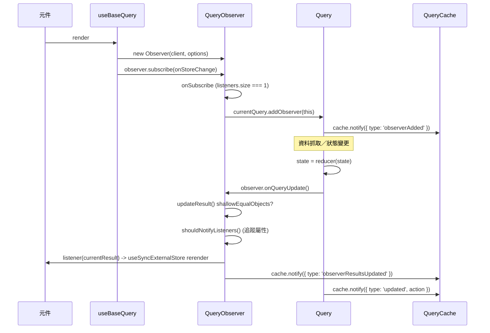

# [FEE-1803] TanStack Query：圍繞 QueryCache 的 Observer 模式

:::info
TanStack Query 建立在三個元件之上：名為 `Subscribable` 的小型 pub-sub 原語、中央的 `QueryCache` 註冊表，以及每個 `useQuery` 對應的 `QueryObserver` 實例。這三者組合成本文所稱的 **圍繞 QueryCache 的 Observer 模式**：以穩定 hash 作為鍵的單一快取 map、每個訂閱對應一個 observer 並綁定到單一快取項目，以及在第一個監聽者出現時啟動、最後一個離開時拆除的生命週期閘門。維護者 Dominik Dorfmeister（TkDodo）將 Observer 的職責描述為「恰好訂閱一個 query」，並追蹤元件讀取了哪些結果屬性，以避免無關變更通知它。可遷移的學習：同類別的任何反應式快取層（SWR、RTK Query、Apollo 的 `InMemoryCache` + `ObservableQuery`、自訂 hook）都可透過這五個組成部分來辨識與設計。
:::

## 背景

基底類別 `Subscribable<TListener extends Function>` 位於
`packages/query-core/src/subscribable.ts`。它對 listener 型別泛型化、
持有 `Set<TListener>`，並暴露 `subscribe()` 與 `hasListeners()`
([Claim 1, subscribable.ts](https://github.com/TanStack/query/blob/v5.74.3/packages/query-core/src/subscribable.ts))。
有兩個類別繼承它：`QueryCache extends Subscribable<QueryCacheListener>`
與 `QueryObserver<...> extends Subscribable<QueryObserverListener<TData, TError>>`
([Claim 2, queryCache.ts](https://github.com/TanStack/query/blob/v5.74.3/packages/query-core/src/queryCache.ts)、
[queryObserver.ts](https://github.com/TanStack/query/blob/v5.74.3/packages/query-core/src/queryObserver.ts))。
`QueryCache` 是中央註冊表：它擁有一個以字串化 query hash 為鍵的
`Map<string, Query>`，`add()` 會變更 map 並觸發 `'added'` 事件
([Claim 3, queryCache.ts](https://github.com/TanStack/query/blob/v5.74.3/packages/query-core/src/queryCache.ts))。
TkDodo 直白地描述 Observer 的角色：「當你呼叫 `useQuery` 時會建立一個
`Observer`，它永遠恰好訂閱一個 query」，以及「`Observer` 知道元件正在使用
`Query` 的哪些屬性，因此不需要為無關變更通知它」
([Claim 14, Inside React Query](https://tkdodo.eu/blog/inside-react-query))。

## 情境

一個 React 應用需要自訂的資料抓取 hook。第一版回傳 fetch 結果。第二版以 URL
為鍵做快取。第三版去重多個元件之間進行中的請求。第四版加入選擇性 rerender，
讓讀取 `data` 的元件在 `isFetching` 翻轉時不會 rerender。到了這一步，團隊已
重建出與 TanStack Query 相同的結構：全域快取 `Map`、每個元件對應的訂閱物件
（將選項與監聽器綁定到單一快取項目），以及兩端皆有生命週期 hook 的 pub-sub
原語。TanStack Query 的原始碼是該結構的參考實作；其命名也將辨識訊號帶入同類
別的其他函式庫之中。

## 最佳實踐

- **必須** 在元件中讀取資料時使用 `useQuery`，因為 `useQuery` 會建立
  `QueryObserver` 訂閱變更；原始碼中 `getQueryData` 的 JSDoc 警告它在元件中
  「不會收到更新」
  ([Claim 10](https://github.com/TanStack/query/blob/v5.74.3/packages/query-core/src/queryClient.ts))。
- **必須** 只在 callback 或一次性讀取的場合使用
  `QueryClient.getQueryData(queryKey)`，亦即只需要 `state.data` 的新鮮快照即
  可的情境；它從不建立 Observer，也從不安排訂閱
  ([Claim 10](https://github.com/TanStack/query/blob/v5.74.3/packages/query-core/src/queryClient.ts))。
- **應該** 在你自己的反應式快取需要元件綁定訂閱與選擇性 rerender 時套用相同
  的 Observer 結構，因為 Observer「知道元件正在使用 Query 的哪些屬性，因此
  不需要為無關變更通知它」
  ([Claim 14, TkDodo](https://tkdodo.eu/blog/inside-react-query))。
- **應該** 維持「恰好一個 observer 對應恰好一個快取項目」的綁定關係；TkDodo
  寫道 Observer「永遠恰好訂閱一個 query」，這種一對一綁定正是讓生命週期 hook
  能安全地在某 Query 的 observer 列表中加入與移除 observer 的關鍵
  ([Claim 14](https://tkdodo.eu/blog/inside-react-query))。
- **可以** 在非反應式讀取（樂觀更新、callback、伺服器端快照）時完全略過
  Observer；JSDoc 明確將此列為 `getQueryData` 的正確用法
  ([Claim 10](https://github.com/TanStack/query/blob/v5.74.3/packages/query-core/src/queryClient.ts))。

## 設計思維

把 `Subscribable` 放在繼承樹底端，可換得統一的 pub-sub 原語，同時服務於快取
（DevTools 與全域監聽器接上的單一全域 listener bus）與每個元件對應的 observer
（每個 `useQuery` 實例擁有自己的 listener bus）。兩者皆繼承 `subscribe()` 與
`hasListeners()`，皆呼叫 `onSubscribe()` 與 `onUnsubscribe()` 生命週期 hook
([Claim 1](https://github.com/TanStack/query/blob/v5.74.3/packages/query-core/src/subscribable.ts))。
`Query` 本身則刻意不放入此繼承樹。`Query` 繼承 `Removable`，其向 observer 的
扇出採用單純的陣列走訪：在 `notifyManager.batch` 內執行
`this.observers.forEach((observer) => observer.onQueryUpdate())`
([Claim 6, query.ts](https://github.com/TanStack/query/blob/v5.74.3/packages/query-core/src/query.ts))。
取捨在於：每次狀態變更付出 `Set<TListener>` 的間接成本，對比熱路徑上每次快取
query 變更都要走訪的直接陣列。`QueryObserver.onSubscribe()` 中的生命週期閘門
是對稱的：第一個訂閱者抵達時（`this.listeners.size === 1`）呼叫
`addObserver`，並執行 fetch 或 `updateResult`；最後一個取消訂閱者離開時
（`!this.hasListeners()`）呼叫 `destroy()`，將 observer 從其 Query 移除，並讓
Query 自行排程 GC
([Claim 7](https://github.com/TanStack/query/blob/v5.74.3/packages/query-core/src/queryObserver.ts)、
[Claim 8](https://github.com/TanStack/query/blob/v5.74.3/packages/query-core/src/queryObserver.ts))。
工作恰好發生在它應該發生的邊界上。

## 深入探討

完整的 Query → Observer → Component 更新鏈路在單一 `notifyManager.batch` 內
執行。當 Query 的狀態透過 `#dispatch` 改變時，Query 會走訪自己的 observer 陣列
並通知快取：

*來源：packages/query-core/src/query.ts*

```ts
this.state = reducer(this.state)

notifyManager.batch(() => {
  this.observers.forEach((observer) => {
    observer.onQueryUpdate()
  })

  this.#cache.notify({ query: this, type: 'updated', action })
})
```

每個 Observer 的 `onQueryUpdate()` 會重新跑一次結果 pipeline。Observer 在通知
自己的 listener 之前再做一次收斂。當新結果與前一個結果 shallow-equal 時，
`updateResult()` 會短路返回
([Claim 11](https://github.com/TanStack/query/blob/v5.74.3/packages/query-core/src/queryObserver.ts))；
即使結果不同，`shouldNotifyListeners` 也只在「有變更的 key 落在納入集合內」時
回傳 true，此處的納入集合在有設定 `notifyOnChangeProps` 時取其值，否則取
消費者實際讀取的屬性（記錄於 `#trackedProps`）：

*來源：packages/query-core/src/queryObserver.ts*

```ts
const shouldNotifyListeners = (): boolean => {
  if (!prevResult) return true
  const { notifyOnChangeProps } = this.options
  ...
  if (notifyOnChangePropsValue === 'all' || (!notifyOnChangePropsValue && !this.#trackedProps.size)) {
    return true
  }
  const includedProps = new Set(notifyOnChangePropsValue ?? this.#trackedProps)
  ...
  return Object.keys(this.#currentResult).some((key) => {
    const typedKey = key as keyof QueryObserverResult
    const changed = this.#currentResult[typedKey] !== prevResult[typedKey]
    return changed && includedProps.has(typedKey)
  })
}
this.#notify({ listeners: shouldNotifyListeners() })
```

結果是：單一 `Query` 的狀態變更可能會走過每個 observer 的結果 pipeline，但只
會 rerender 那些被追蹤屬性確實有變動的元件
([Claim 12](https://github.com/TanStack/query/blob/v5.74.3/packages/query-core/src/queryObserver.ts))。

## 圖解



## 範例

`Query.addObserver` 將 observer 註冊到單一快取項目、清除 GC 計時器，並發出
`'observerAdded'` 快取事件：

*來源：packages/query-core/src/query.ts*

```ts
addObserver(observer: QueryObserver<any, any, any, any, any>): void {
  if (!this.observers.includes(observer)) {
    this.observers.push(observer)
    // Stop the query from being garbage collected
    this.clearGcTimeout()
    this.#cache.notify({ type: 'observerAdded', query: this, observer })
  }
}
```

在 React 端，`useBaseQuery` 透過三個 React 原語把 Observer 接進元件：用
`useState` 在每個元件實例只建構一次 Observer、用 `useSyncExternalStore` 訂閱
並驅動 rerender，並用 `useEffect` 在每次 render 重新套用選項：

*來源：packages/react-query/src/useBaseQuery.ts*

```ts
const [observer] = React.useState(
  () =>
    new Observer<TQueryFnData, TError, TData, TQueryData, TQueryKey>(
      client,
      defaultedOptions,
    ),
)

React.useSyncExternalStore(
  React.useCallback(
    (onStoreChange) => {
      const unsubscribe = shouldSubscribe
        ? observer.subscribe(notifyManager.batchCalls(onStoreChange))
        : noop
      observer.updateResult()
      return unsubscribe
    },
    [observer, shouldSubscribe],
  ),

React.useEffect(() => {
  observer.setOptions(defaultedOptions)
}, [defaultedOptions, observer])
```

`useState` 的初始化函式確保 Observer 能跨越 rerender 留存。
`useSyncExternalStore` 的 callback 回傳由 `Subscribable.subscribe()` 提供的
unsubscribe 函式；卸載時即由它觸發 `onUnsubscribe` 與 Observer 的 `destroy()`
路徑
([Claim 9](https://github.com/TanStack/query/blob/v5.74.3/packages/react-query/src/useBaseQuery.ts))。

## 圍繞 QueryCache 的 Observer 模式

**圍繞 QueryCache 的 Observer 模式** 由五個組成部分構成。將 TanStack Query
的原始碼當作參考實作來閱讀，每個部分都很小、且可獨立替換。

**1. 一個 `Subscribable<TListener>` 基底。** `Set<TListener>` 加上回傳
unsubscribe 函式的 `subscribe()`、加上 `hasListeners()`，再加上兩個由子類覆寫
的空生命週期 hook
([Claim 1, subscribable.ts](https://github.com/TanStack/query/blob/v5.74.3/packages/query-core/src/subscribable.ts))。

**2. 一個中央的 `QueryCache` 註冊表。** 以字串化 query hash 為鍵的
`Map<string, Query>`，配備 `add()`／`remove()`／`notify()`。`add` 路徑會觸發
`'added'` 事件，讓快取層級的監聽器（DevTools、全域監看器）能據此反應
([Claim 3, queryCache.ts](https://github.com/TanStack/query/blob/v5.74.3/packages/query-core/src/queryCache.ts))。
`QueryCache.notify(event)` 本身會在 `notifyManager.batch` 內把單一具型別的
`QueryCacheNotifyEvent` 扇出給每個快取訂閱者：

*來源：packages/query-core/src/queryCache.ts*

```ts
notify(event: QueryCacheNotifyEvent): void {
  notifyManager.batch(() => {
    this.listeners.forEach((listener) => {
      listener(event)
    })
  })
}
```

這就是 DevTools 與全域 observer 監聽的通道
([Claim 4](https://github.com/TanStack/query/blob/v5.74.3/packages/query-core/src/queryCache.ts))。

**3. 每個 `useQuery` 對應一個 Observer，綁定到單一 Query。** 每次呼叫
`useQuery` 都會建構自己的 `QueryObserver`。Observer 持有該次呼叫的選項與其
listener 集合，並透過 `#currentQuery` 綁定到恰好一個 `Query`。TkDodo 總結：
「當你呼叫 `useQuery` 時會建立一個 `Observer`，它永遠恰好訂閱一個 query」
([Claim 14](https://tkdodo.eu/blog/inside-react-query))。

**4. 生命週期閘門。** `onSubscribe()` 只在從零到一個 listener 的轉換時做事，
`onUnsubscribe()` 只在最後一個 listener 離開時拆除：

*來源：packages/query-core/src/queryObserver.ts*

```ts
protected onSubscribe(): void {
  if (this.listeners.size === 1) {
    this.#currentQuery.addObserver(this)

    if (shouldFetchOnMount(this.#currentQuery, this.options)) {
      this.#executeFetch()
    } else {
      this.updateResult()
    }

    this.#updateTimers()
  }
}
```

```ts
protected onUnsubscribe(): void {
  if (!this.hasListeners()) {
    this.destroy()
  }
}

destroy(): void {
  this.listeners = new Set()
  this.#clearStaleTimeout()
  this.#clearRefetchInterval()
  this.#currentQuery.removeObserver(this)
}
```

第一個訂閱者啟動初始化（將 observer 加入 Query、抓取或更新結果、安排計時器）；
最後一個取消訂閱者拆除（清除計時器、移除 observer、讓 Query 自行排程 GC）
([Claim 7](https://github.com/TanStack/query/blob/v5.74.3/packages/query-core/src/queryObserver.ts)、
[Claim 8](https://github.com/TanStack/query/blob/v5.74.3/packages/query-core/src/queryObserver.ts))。

**5. 一條不訂閱即可讀取的路徑。** `QueryClient.getQueryData(queryKey)` 直接讀
取 Map：沒有 Observer、沒有訂閱、沒有通知：

*來源：packages/query-core/src/queryClient.ts*

```ts
/**
 * Imperative (non-reactive) way to retrieve data for a QueryKey.
 * Should only be used in callbacks or functions where reading the latest data is necessary, e.g. for optimistic updates.
 *
 * Hint: Do not use this function inside a component, because it won't receive updates.
 * Use `useQuery` to create a `QueryObserver` that subscribes to changes.
 */
getQueryData<...>(queryKey: TTaggedQueryKey): TInferredQueryFnData | undefined {
  const options = this.defaultQueryOptions({ queryKey })
  return this.#queryCache.get(options.queryHash)?.state.data as ...
}
```

維護者在 JSDoc 中明確警告不要在元件內使用它
([Claim 10](https://github.com/TanStack/query/blob/v5.74.3/packages/query-core/src/queryClient.ts))。
兩個動詞分別對應兩個不同的意圖。

**選擇性通知。** 除了五個組成部分，Observer 在每次更新時還會兩度收斂通知。
首先是結果上的 shallow-equal 短路：當 `shallowEqualObjects(nextResult, prevResult)`
為真時，`updateResult()` 提早返回
([Claim 11](https://github.com/TanStack/query/blob/v5.74.3/packages/query-core/src/queryObserver.ts))。
其次，透過 `notifyOnChangeProps` 與 `#trackedProps` 進行屬性追蹤：
`shouldNotifyListeners` 只在有變更的 key 落在納入集合內時回傳 true
([Claim 12](https://github.com/TanStack/query/blob/v5.74.3/packages/query-core/src/queryObserver.ts))。
最後，`#notify` 先呼叫元件 listener（驅動 React 的 `useSyncExternalStore`
rerender），再把 `'observerResultsUpdated'` 事件轉發給快取，兩者皆在單一
`notifyManager.batch` 內：

*來源：packages/query-core/src/queryObserver.ts*

```ts
#notify(notifyOptions: { listeners: boolean }): void {
  notifyManager.batch(() => {
    // First, trigger the listeners
    if (notifyOptions.listeners) {
      this.listeners.forEach((listener) => {
        listener(this.#currentResult)
      })
    }

    // Then the cache listeners
    this.#client.getQueryCache().notify({
      query: this.#currentQuery,
      type: 'observerResultsUpdated',
    })
  })
}
```

兩個通知通道，共用一次 notify pass
([Claim 13](https://github.com/TanStack/query/blob/v5.74.3/packages/query-core/src/queryObserver.ts))。

**在其他程式碼中如何辨識：** 同樣的結構在多個反應式快取中重複出現。具體的
辨識訊號：

- 一個 `Subscribable<TListener>` 風格的基底，內含 `Set<TListener>` 與
  `subscribe()`／`hasListeners()`。
- 一個註冊表類別（`*Cache`、`Store`、`Atoms`），持有以穩定 hash 為鍵的
  `Map<string, Entry>`。
- 每次呼叫對應的 observer／訂閱物件，擁有自己的選項與 listener 連線；綁定到
  恰好一個快取項目。
- 一條「不訂閱即可讀取」的路徑（`getQueryData` 的對應物：
  `client.readQuery`、`store.getState()`、`atomFamily.read`），不建立任何
  observer。
- 選擇性通知：結果上的 shallow-equal 短路，加上屬性追蹤，使無關欄位變更不會
  讓消費者 rerender。
- `onSubscribe`／`onUnsubscribe` 中的生命週期閘門，使第一個訂閱者啟動工作、
  最後一個取消訂閱者拆除工作。

## 內部參考

- [FEE-1800 Codebase Studies 概覽](/zh-tw/Codebase%20Studies/codebase-studies-overview)
- [FEE-1802 esbuild 平行架構](/zh-tw/Codebase%20Studies/esbuild-parallelism-architecture)
- [FEE-1810 three.js Dispose 生命週期](/zh-tw/Codebase%20Studies/threejs-dispose-lifecycle)
- [FEE-613 TanStack Query v5](/zh-tw/State%20Management/tanstack-query-v5)

## 參考資料

- TanStack, "query-core/src/subscribable.ts," TanStack/query at v5.74.3 (2025). https://github.com/TanStack/query/blob/v5.74.3/packages/query-core/src/subscribable.ts
- TanStack, "query-core/src/queryCache.ts," TanStack/query at v5.74.3 (2025). https://github.com/TanStack/query/blob/v5.74.3/packages/query-core/src/queryCache.ts
- TanStack, "query-core/src/queryObserver.ts," TanStack/query at v5.74.3 (2025). https://github.com/TanStack/query/blob/v5.74.3/packages/query-core/src/queryObserver.ts
- TanStack, "query-core/src/query.ts," TanStack/query at v5.74.3 (2025). https://github.com/TanStack/query/blob/v5.74.3/packages/query-core/src/query.ts
- TanStack, "query-core/src/queryClient.ts," TanStack/query at v5.74.3 (2025). https://github.com/TanStack/query/blob/v5.74.3/packages/query-core/src/queryClient.ts
- TanStack, "react-query/src/useBaseQuery.ts," TanStack/query at v5.74.3 (2025). https://github.com/TanStack/query/blob/v5.74.3/packages/react-query/src/useBaseQuery.ts
- Dominik Dorfmeister (TkDodo), "Inside React Query," tkdodo.eu (2022). https://tkdodo.eu/blog/inside-react-query
