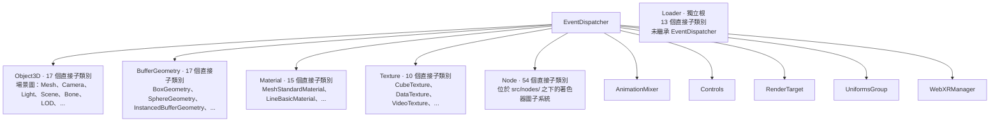

# [FEE-1801] Three.js：架構導覽

:::info
本導覽以 **r172（2024-12-31）** 標籤為基準，透過五個視角閱讀 three.js：類別層級、模組拆解、公開 API 面、渲染迴圈、資源生命週期。五個子系統根類別（`Object3D`、`BufferGeometry`、`Material`、`Texture`、`Node`）皆繼承同一個 `EventDispatcher` 基底，並向下展開為彼此平行、根之下永不交會的繼承樹；第六棵獨立大樹則以 `Loader` 為根。原本由 geometry／material／texture 三類資源使用的單行 `dispose()` 事件發送契約，被原封不動地沿用到較新的 `Node` 著色器圖子系統（r172 共有 54 個子類別）。函式庫本身不擁有逐幀迴圈。它只擁有迴圈的一次刻度，以同步的 `render(scene, camera)` 方法暴露。
:::

## 背景

Three.js 是由 mrdoob（Ricardo Cabello）與長期貢獻者群所維護的 WebGL／WebGPU 3D 渲染函式庫。標籤 `r172` 的儲存庫在 `src/` 下放有 **685 個 `.js` 檔**，組織在 **16 個以職責命名的子目錄** 之內，再加上少量頂層入口／彙整檔（`Three.js`、`Three.Core.js`、`Three.WebGPU.js`、`Three.WebGPU.Nodes.js`、`Three.TSL.js`、`Three.Legacy.js`、`constants.js`、`utils.js`）。`renderers/` 與 `nodes/` 兩個領域在 r172 合計約佔總檔案的 65%，分屬傳統 WebGL 後端與節點圖加 WebGPU 堆疊兩者。r172 發布於 2024-12-31；three.js 目前已推進至 r185（2026-07-01），約晚了 13 個版本，WebGPU／節點路徑自本次快照後持續發展。以下的計數、行號與程式碼節錄皆描述 r172，並非目前最新版本。

這個函式庫值得研究有幾個理由：它是生產環境中部署最廣的 JavaScript 圖形程式碼庫之一，跨越 WebGL 與 WebGPU 兩代主要渲染 API 持續維護超過十年，並透過從各領域目錄重新導出的方式組裝出穩定且精簡的公開 API 面。其內部呈現幾個反覆出現的形狀選擇：在多個其餘無關的子系統根之下，共用一個可觀察的基底（`EventDispatcher`）；資料夾名稱讀起來像 3D 圖形領域詞彙；單一 ESM barrel 作為套件入口；逐幀的呼叫點以命令式方式由宿主應用程式擁有；以及單行的 `dispose()` 契約，僅發送事件並交由獨立的監聽者執行 GPU 拆除。

讓此程式碼庫顯得有趣的架構視角，在於跨世代特性：原本四個資源持有類別（`BufferGeometry`、`Material`、`Texture`、`WebGLRenderTarget`）在 WebGL 時代建立的慣例，原樣重現於為 TSL（Three.js Shading Language，同時餵給 `NodeMaterial` 與 WebGPU 後端的節點圖著色器撰寫層）新引入的 `Node` 基底類別之上。

## 視覺對比



## 範例

`src/Three.js` 是 r172 整個套件入口檔的內容（第 1-9 行）：

```js
export * from './Three.Core.js';

export { WebGLRenderer } from './renderers/WebGLRenderer.js';
export { ShaderLib } from './renderers/shaders/ShaderLib.js';
export { UniformsLib } from './renderers/shaders/UniformsLib.js';
export { UniformsUtils } from './renderers/shaders/UniformsUtils.js';
export { ShaderChunk } from './renderers/shaders/ShaderChunk.js';
export { PMREMGenerator } from './extras/PMREMGenerator.js';
export { WebGLUtils } from './renderers/webgl/WebGLUtils.js';
```

九行內容：一個對核心 barrel 的萬用字元重新導出，以及七個渲染層識別子的具名重新導出。透過裸 `'three'` specifier 可達的每個公開名稱，距此檔皆只有一次重新導出跳轉。

## 類別層級與繼承

**事件根森林。** Three.js 在 r172 的類別圖，是一組以同一個 `EventDispatcher` mixin 為基底的子系統根類別，向下展開成彼此平行、根之下永不交會的繼承樹。掃描 r172 `src/` 下每一個 `class X extends Y` 宣告，共得到 377 筆宣告，其中 375 筆的父類別屬於 three.js（另外兩筆分別繼承 JS 內建的 `Map` 與 `Error`）。其中有十個類別是 `EventDispatcher` 的直接子類別：`AnimationMixer`、`BufferGeometry`、`Controls`、`Material`、`Node`、`Object3D`、`RenderTarget`、`Texture`、`UniformsGroup`、`WebXRManager`。下列五者承載最大的子樹：

- `Object3D`：17 個直接子類別，場景圖（`Mesh`、`Camera`、`Light`、`Scene`、`Bone`、`LOD`、…）。
- `BufferGeometry`：17 個直接子類別（`BoxGeometry`、`SphereGeometry`、`InstancedBufferGeometry`、…）。
- `Material`：15 個直接子類別（`MeshStandardMaterial`、`LineBasicMaterial`、…）。`NodeMaterial` 又額外帶來 15 個直接子類別，但其本身透過 `Material` 成為 `EventDispatcher` 的孫類別。
- `Texture`：10 個直接子類別（`CubeTexture`、`DataTexture`、`VideoTexture`、…）。
- `Node`：54 個直接子類別，是位於 `src/nodes/` 之下的整個著色器圖子系統，也是程式碼庫中最大的單一層級樹。

第六棵大樹則落在 EventDispatcher 森林之外：`Loader` 自成一根，擁有 13 個直接子類別（檔案格式載入器），且在 r172 並未繼承 `EventDispatcher`。`src/loaders/Loader.js` 第 3 行的類別宣告為 `class Loader {`，沒有 `extends` 子句，確認 Loader 在結構上獨立於事件基底。這種獨立性與 `Loader` 實際持有的內容相符：它自身不持有任何可觀察或可交由 GPU 釋放的狀態。它剖析輸入，並回傳幾何、紋理或材質物件；這些物件本身即為 `EventDispatcher` 的子類別，會自行處理釋放，因此 `Loader` 沒有東西需要發布，也沒有理由繼承這個發布／訂閱根類別。

`EventDispatcher` 本身是一個沒有父類別的純類別。`src/core/EventDispatcher.js` 第 5-9 行宣告 `class EventDispatcher {`，並定義 `addEventListener`、`removeEventListener`、`dispatchEvent` 與 `hasEventListener` 作為各根類別共同繼承的發布／訂閱原語。五個資源或圖根類別直接繼承之：

- `src/core/Object3D.js` 第 31 行：`class Object3D extends EventDispatcher {`
- `src/core/BufferGeometry.js` 第 22 行：`class BufferGeometry extends EventDispatcher {`
- `src/materials/Material.js` 第 8 行：`class Material extends EventDispatcher {`
- `src/textures/Texture.js` 第 20 行：`class Texture extends EventDispatcher {`
- `src/nodes/core/Node.js` 第 14 行：`class Node extends EventDispatcher {`

r172 中量測到的最深鏈長為從葉節點回到 `EventDispatcher` 共六條邊：

```
ViewportDepthTextureNode → ViewportTextureNode → TextureNode → UniformNode → InputNode → Node → EventDispatcher
```

每一條鏈結皆與 r172 原始碼相符：`src/nodes/display/ViewportDepthTextureNode.js` 第 18 行（`class ViewportDepthTextureNode extends ViewportTextureNode {`）、`src/nodes/display/ViewportTextureNode.js` 第 23 行（`extends TextureNode`）、`src/nodes/accessors/TextureNode.js` 第 19 行（`extends UniformNode`）、`src/nodes/core/UniformNode.js` 第 12 行（`extends InputNode`）、`src/nodes/core/InputNode.js` 第 9 行（`extends Node`）。

這個形狀的關鍵承載性質：子樹之間從不交叉繼承。`Mesh extends Object3D`（`src/objects/Mesh.js` 第 27 行）完整存在於場景圖子樹之內；幾何、材質、紋理、節點等子樹中的任何類別，從不重新以 `Object3D` 為根。每個子系統各自保有自己的根與子樹，唯一共享的基底是位於最頂層的事件發布／訂閱機制。其他較小的 `EventDispatcher` 直接子類別（`AnimationMixer`、`Controls`、`RenderTarget`、`UniformsGroup`、`WebXRManager`）也遵循相同慣例：每個皆持有可觀察狀態，且各自構成自己一棵小樹的根。

**在其他程式碼中如何辨認：** 以 grep 搜尋多個其餘無關的子系統根類別所共同繼承的單一基底（常見名稱包括 `EventEmitter`、`EventTarget`、`Observable` 或 `Subject`），再清點有多少個 `class X extends <該基底>` 宣告位於頂層、又有多少嵌套於更深層。當有五個以上的子系統根共享同一個可觀察基底，且它們的子樹從不交叉繼承時，便對應到同一種事件根森林模式。

## 模組拆解

**領域切分資料夾。** Three.js 在 r172 的 `src/` 之下，每個頂層目錄皆以 3D 圖形職責命名：`geometries`、`materials`、`lights`、`cameras`、`scenes`、`renderers`、`textures`、`loaders`、`audio`、`animation`、`objects`、`helpers`、`extras`、`math`、`core`、`nodes`，因此資料夾名稱便揭示其中存放的物件種類；跨資料夾耦合則透過顯式的相對 import 表達，並無共享的工具層。在 r172 執行 `ls src/` 的輸出，呈現為問題領域的詞彙，再加上六個頂層彙整檔（`Three.js`、`Three.Core.js`、`Three.Legacy.js`、`Three.TSL.js`、`Three.WebGPU.js`、`Three.WebGPU.Nodes.js`）與兩個工具檔（`constants.js`、`utils.js`）。

r172 各頂層領域的檔案數（以 `find ... -name '*.js' | wc -l` 驗證）：

| 領域 | 檔案數 |
|---|---:|
| `renderers` | 251 |
| `nodes` | 196 |
| `materials` | 39 |
| `math` | 27 |
| `extras` | 24 |
| `geometries` | 22 |
| `loaders` | 19 |
| `core` | 18 |
| `animation` | 14 |
| `objects` | 14 |
| `helpers` | 13 |
| `lights` | 13 |
| `textures` | 13 |
| `cameras` | 6 |
| `audio` | 5 |
| `scenes` | 3 |

`renderers/` 與 `nodes/` 兩個領域合計約佔 685 檔原始樹的 65%。其餘 14 個領域皆小而緊湊：`scenes/` 為 3 檔、`audio/` 為 5 檔、`cameras/` 為 6 檔，符合繼承的圖樣：子系統根類別的小子樹加上少量輔助。

`renderers/` 自身按圖形後端切分。在 r172 之下，其直接子目錄為 `webgl/`、`webgl-fallback/`、`webgpu/`、`common/`，再加上 `shaders/`（GLSL chunk 函式庫）與 `webxr/`。五個渲染目標類別（`WebGLRenderer.js`、`WebGLRenderTarget.js`、`WebGLArrayRenderTarget.js`、`WebGL3DRenderTarget.js`、`WebGLCubeRenderTarget.js`）位於 `renderers/` 根層。切換渲染後端屬於資料夾層級的關注點：WebGL 後端位於 `webgl/`、WebGPU 後端位於 `webgpu/`、與後端無關的 `Renderer`（2860 LOC）位於 `common/`。

原始碼樹中最大的兩個單一檔案皆為渲染器核心，第三大則為節點圖編譯器：

| 排名 | 檔案 | LOC |
|---:|---|---:|
| 1 | `src/renderers/WebGLRenderer.js` | 2955 |
| 2 | `src/renderers/common/Renderer.js` | 2860 |
| 3 | `src/nodes/core/NodeBuilder.js` | 2426 |
| 4 | `src/renderers/webgl-fallback/WebGLBackend.js` | 2211 |
| 5 | `src/renderers/webgl/WebGLTextures.js` | 2185 |
| 6 | `src/renderers/webgpu/WebGPUBackend.js` | 2026 |

跨領域耦合以顯式的 `../<domain>/<File>.js` import 表達。`src/renderers/WebGLRenderer.js` 開頭即從 `../math/` 拉入數學型別，並從同層的 `./webgl/` 資料夾拉入每個 WebGL 協作者，例如 `WebGLAnimation`、`WebGLAttributes`、`WebGLBackground`、`WebGLBindingStates`、`WebGLState`、`WebGLTextures`、`WebGLUniforms` 等。該檔的 import 區塊本身即為 WebGL 後端的結構地圖。`src/core/Object3D.js` 開頭從 `../math/` 引入（`Quaternion`、`Vector3`、`Matrix4`、`Euler`、`Matrix3`、`generateUUID`），並從 `./` 引入（`EventDispatcher`、`Layers`）；`core/` 資料夾以相對路徑伸入 `math/`。

整個樹中沒有中央工具層。`src/` 根的兩個 `utils.js` 與 `constants.js` 體積極薄：`constants.js` 持有類列舉的導出，`utils.js` 持有少量輔助。各領域透過具名 import 互相協調，無 `services/`、`controllers/` 或 `lib/` 資料夾居中。

**在其他程式碼中如何辨認：** 執行 `ls <pkg>/src`，檢查頂層資料夾名稱讀起來是否為專案問題領域的詞彙（在 three.js 中為 `lights`、`cameras`、`geometries`、…），與技術分層（`controllers`、`services`、`utils`、`types`）相對；再以 `grep -rE "from '\.\./[a-z]+/" src | sort -u` 確認跨資料夾邊皆透過具名相對 import。當兩個條件皆成立時，即代表程式碼庫採用領域切分資料夾的模式。

## 公開 API 面

**雙層 barrel 索引的公開 API。** 單一 ESM 入口檔（`src/Three.js`）重新導出與渲染器耦合的識別子，並以 `export *` 重新導出第二層核心 barrel（`src/Three.Core.js`），因此每個公開名稱距套件入口皆只有一次重新導出跳轉。

r172 的 `package.json` 將套件宣告為 ESM 優先，並將入口指向建置產物：

```json
"type": "module",
"main": "./build/three.cjs",
"module": "./build/three.module.js",
"exports": {
  ".": {
    "import": "./build/three.module.js",
    "require": "./build/three.cjs"
  },
  "./examples/fonts/*": "./examples/fonts/*",
  "./examples/jsm/*": "./examples/jsm/*",
  "./addons": "./examples/jsm/Addons.js",
```

裸 `'three'` specifier 解析至 `./build/three.module.js`，而該檔即為 `src/Three.js` 的 Rollup 輸出。因此公開 API 面的真正出處為原始碼層的 barrel，並非建置產物。

`src/Three.js` 共 9 行：一個對核心 barrel 的萬用字元重新導出（`export * from './Three.Core.js';`），以及七個渲染層識別子的具名重新導出（`WebGLRenderer`、`ShaderLib`、`UniformsLib`、`UniformsUtils`、`ShaderChunk`、`PMREMGenerator`、`WebGLUtils`）。`src/Three.Core.js` 再加上 156 行 `export { Foo } from './path/Foo.js'`（或 `export * from './path/Bar.js'`），涵蓋 scenes、objects、textures、geometries、materials、loaders、lights、cameras、audio、animation、core（`BufferGeometry`、`Object3D`、`Raycaster`、…）、math、helpers、curves、extras、constants 與 legacy shim。透過一次重新導出跳轉的傳遞性具名導出，總計達 **164 個識別子**。

切分概要：

| 層 | 檔案 | 直接行數 | 角色 |
|---|---|---|---|
| 渲染器載入 | `src/Three.js` | 8 個 export | WebGL 渲染器加著色器 chunk 函式庫 |
| 核心型別 | `src/Three.Core.js` | 156 個 export | 數學、場景圖、幾何、材質、載入器等 |

此切分具有執行期影響。渲染層識別子置於 `Three.js`，使不需 WebGL 渲染器的消費者（Node 端測試、僅用數學的工具、WebGPU 前端）得以匯入核心 barrel 而不必拖入 WebGL 著色器原始碼。渲染層以下的所有內容（包括完整的場景圖）皆可單獨自 `Three.Core.js` 取得。專屬的 WebGPU 與 TSL barrel（`Three.WebGPU.js`、`Three.WebGPU.Nodes.js`、`Three.TSL.js`）位於與 `Three.js` 同一層，提供節點圖後端的替代入口點。

`src/Three.Core.js` 的開頭（節錄）：

```js
import { REVISION } from './constants.js';

export { WebGLArrayRenderTarget } from './renderers/WebGLArrayRenderTarget.js';
export { WebGL3DRenderTarget } from './renderers/WebGL3DRenderTarget.js';
export { WebGLCubeRenderTarget } from './renderers/WebGLCubeRenderTarget.js';
export { WebGLRenderTarget } from './renderers/WebGLRenderTarget.js';
export { FogExp2 } from './scenes/FogExp2.js';
export { Fog } from './scenes/Fog.js';
export { Scene } from './scenes/Scene.js';
export { Sprite } from './objects/Sprite.js';
export { LOD } from './objects/LOD.js';
export { SkinnedMesh } from './objects/SkinnedMesh.js';
export { Skeleton } from './objects/Skeleton.js';
export { Bone } from './objects/Bone.js';
export { Mesh } from './objects/Mesh.js';
export { InstancedMesh } from './objects/InstancedMesh.js';
export { BatchedMesh } from './objects/BatchedMesh.js';
```

此 barrel 同時混用單一具名的 `export { Foo }` 行與會繼續向外擴散的 `export *` 行（`export * from './geometries/Geometries.js';`、`export * from './materials/Materials.js';`、`export * from './extras/curves/Curves.js';`、`export * from './constants.js';`、`export * from './Three.Legacy.js';`）。萬用字元擴散使 barrel 維持可維護性：geometry 與 material 子目錄各自擁有內部索引檔（`Geometries.js`、`Materials.js`），頂層 barrel 只重新導出其索引，無需逐一列舉每個類別。

內部消費者依賴此 barrel 的方式如同外部消費者。`examples/jsm/` 附加套件資料夾經由 `package.json` 的 `exports['./examples/jsm/*']` 註冊為獨立套件，附加套件透過裸 `'three'` specifier 觸及每個型別。`examples/jsm/loaders/GLTFLoader.js` 第 1-67 行於單一 import 陳述中拉入 65 個以上具名識別子（`AnimationClip`、`Bone`、`Box3`、`BufferAttribute`、`BufferGeometry`、…、`VectorKeyframeTrack`、`SRGBColorSpace`、`InstancedBufferAttribute`），無一引用內部路徑。

**在其他程式碼中如何辨認：** 在 `src/`（或 `lib/`）根層尋找一個內容由 `export { X } from './path/X.js'` 與 `export * from './...'` 行所主宰、無實作邏輯的檔案，並交叉檢查 `package.json` 的 `"exports"."."`（或 `"module"`／`"main"`）欄位是否指向以該檔為原始碼的建置產物。當此入口的第一行為 `export * from './<Name>.Core.js'`（或 `.Base`、`.Common`、`.Internal`），且渲染器或平台特有名稱位於萬用字元之上時，便是雙層切分的訊號。

## 渲染迴圈

**命令式逐幀入口。** 渲染器暴露一個同步的 `render(scene, camera)` 方法，由宿主應用程式每幀呼叫一次；函式庫永不擁有迴圈，只擁有迴圈的一次刻度。對 r172 `src/` 樹中 `render`／`tick`／`update`／`step`／`loop` 方法與函式定義的視角掃描，浮現 82 個命中（為去重後的定義位置計數，並非原始 `grep` 行數），集中於三個大型檔案：`WebGLRenderer.js`（2955 LOC）、`common/Renderer.js`（2860 LOC）與 `nodes/core/NodeBuilder.js`（2426 LOC）。

`WebGLRenderer` 上的渲染入口點為指派式方法 `this.render = function ( scene, camera )`，位於 `src/renderers/WebGLRenderer.js` 第 1139 行。每次呼叫都會：在 GL context 失落時提早回傳；在 `matrixWorldAutoUpdate` 為 true 時呼叫 `scene.updateMatrixWorld()` 走訪場景圖；更新相機的世界矩陣；視情況換入 XR 相機；經由 `projectObject(...)` 加上不透明／半透明排序建立渲染清單；最後送出繪製呼叫。逐幀契約即為應用程式每幀呼叫一次 `render`，其餘皆為內部簿記。第 1137-1156 行：

```js
// Rendering

this.render = function ( scene, camera ) {

    if ( camera !== undefined && camera.isCamera !== true ) {

        console.error( 'THREE.WebGLRenderer.render: camera is not an instance of THREE.Camera.' );
        return;

    }

    if ( _isContextLost === true ) return;

    // update scene graph

    if ( scene.matrixWorldAutoUpdate === true ) scene.updateMatrixWorld();

    // update camera matrices and frustum

    if ( camera.parent === null && camera.matrixWorldAutoUpdate === true ) camera.updateMatrixWorld();
```

`src/renderers/common/Renderer.js` 中的統一後端在第 1093 行暴露相同形狀：同步的 `render( scene, camera )` 在 init 守衛之後委派給私有的 `_renderScene( scene, camera )`；另有 `renderAsync`（第 932 行）在 WebGPU 裝置尚未解析的非同步窗口期間回傳 promise。WebGL 與 WebGPU 後端的公開簽名一致，因此切換後端不會改變逐幀的呼叫點：

```js
render( scene, camera ) {

    if ( this._initialized === false ) {

        console.warn( 'THREE.Renderer: .render() called before the backend is initialized. Try using .renderAsync() instead.' );

        return this.renderAsync( scene, camera );

    }

    this._renderScene( scene, camera );

}
```

面向應用程式的排程原語為 `renderer.setAnimationLoop( callback )`，位於 `src/renderers/WebGLRenderer.js` 第 1125 行。它是 three.js 自身唯一擁有的迴圈形狀介面，本身為輕量包裝：使用者的 callback 被儲存、`WebGLAnimation` 被實例化並啟動，並將相同的 callback 交給 XR 模組，以便在 XR 連線開始時讓頭戴式裝置的 frame callback 透明接管。第 1098-1132 行：

```js
// Animation Loop

let onAnimationFrameCallback = null;

function onAnimationFrame( time ) {

    if ( onAnimationFrameCallback ) onAnimationFrameCallback( time );

}

function onXRSessionStart() {

    animation.stop();

}

function onXRSessionEnd() {

    animation.start();

}

const animation = new WebGLAnimation();
animation.setAnimationLoop( onAnimationFrame );

if ( typeof self !== 'undefined' ) animation.setContext( self );

this.setAnimationLoop = function ( callback ) {

    onAnimationFrameCallback = callback;
    xr.setAnimationLoop( callback );

    ( callback === null ) ? animation.stop() : animation.start();

};
```

逐幀契約由應用程式驅動。位於 `docs/manual/en/introduction/Creating-a-scene.html` 第 76-83 行的官方〈Creating a scene〉手冊展示了標準形狀：使用者撰寫 `animate()`，將其交給 `renderer.setAnimationLoop( animate )`，並由使用者函式內部呼叫 `renderer.render( scene, camera )`。渲染器永不決定何時渲染；它只排程應用程式提供的 callback，並於內部處理 XR 連線接管：

```html
<code>
function animate() {
    renderer.render( scene, camera );
}
renderer.setAnimationLoop( animate );
</code>
```

架構上的後果如下：函式庫內部的任何 rAF 呼叫，都是包覆使用者所提供 callback 的輕量排程器；任何建構子皆不會啟動隱藏迴圈；應用程式可直接呼叫 `render(scene, camera)` 而不必動用 `setAnimationLoop`，便能在離線渲染、影片匯出或測試裝置中以手動方式逐步推進渲染器。

**在其他程式碼中如何辨認：** 尋找引擎物件上以場景狀態為參數、同步回傳的公開 `render(...)`（或 `draw(...)`、`present(...)`、`update(...)`）方法，且建構子內無 `setInterval`／`requestAnimationFrame` 自啟動。相反的形狀為框架驅動：引擎在 `init()` 或 `start()` 時啟動自有迴圈，每刻度回呼使用者所提供的生命週期掛鉤（`onUpdate`、`tick`、`step`），應用程式從不直接呼叫 `render`。具有 `MonoBehaviour.Update` 風格刻度的遊戲引擎、呼叫 `engine.runRenderLoop(callback)` 的框架、擁有 frame 的 ECS 排程器皆屬此陣營；原生 three.js、原生 OpenGL／WebGL 應用程式、即時模式 UI 則屬應用程式驅動陣營。

## 資源生命週期契約

**dispose 生命週期契約。** 一個資源持有類別暴露單行的 `dispose()` 方法，其唯一職責是在類別內建的 `EventDispatcher` 上發送 `'dispose'` 事件。獨立的監聽者（典型上為 WebGL 渲染器的資源管理者）擁有實際的 GPU 拆除邏輯。資源的擁有者宣告「我正被釋放」，而為其配置 GPU 狀態的消費者負責執行釋放。`EventDispatcher` 自身並未實作 `dispose()`；該契約向下委派給擁有資源的子類別。

這一點之所以對使用者重要，官方手冊直接說明了原因：three.js 並不會自動回收 WebGL 端的資源，因此應用程式若停止參照某個 geometry、material 或 texture，卻未呼叫 `dispose()`，就會造成 GPU 記憶體洩漏（[three.js manual, "How to dispose of objects"](https://threejs.org/manual/en/how-to-dispose-of-objects.html)）。本視角所記錄的事件發送契約，正是手冊這項警告所指的機制。

對 r172 原始樹中 `dispose`／`destroy`／`release`／`close` 呼叫點的視角掃描，浮現 180 個命中（為去重後的呼叫點計數，並非原始 `grep` 行數）。原本的資源持有類別（`BufferGeometry`、`Material`、`Texture`、`WebGLRenderTarget`）皆採用單行 dispose 事件形狀，在 r172 維持不變。`src/core/BufferGeometry.js` 第 1105-1109 行：

```js
dispose() {

    this.dispatchEvent( { type: 'dispose' } );

}
```

本導覽超出單一模式專文之處，是這項視角的跨世代特性。當 `Node` 為 TSL／`NodeMaterial`／WebGPU 而被引入時，相同的單行契約被原封不動地沿用至較新的著色器節點子系統。`src/nodes/core/Node.js` 第 278-286 行：

```js
/**
 * Calling this method dispatches the `dispose` event. This event can be used
 * to register event listeners for clean up tasks.
 */
dispose() {

    this.dispatchEvent( { type: 'dispose' } );

}
```

逐位元組相同的方法主體。在 r172 的 `src/nodes/` 之下共有 **54 個 `extends Node` 宣告**（以 `grep -rnE 'extends Node\b' src/nodes/` 驗證；若單純以 `"extends Node"` 做子字串比對，則會誤計為 57，因為連 `extends NodeParser`、`extends NodeFunction`、`extends NodeVar` 也會被算入，但它們都不是 `Node` 的子類別），這 54 個宣告全數繼承此 dispose 契約。晚於原始 WebGL 渲染器數年才加入的 `Node` 子類別，也繼承了同一套單行 dispose 契約。

此契約刻意不出現在非資源基底上。`src/core/EventDispatcher.js` 在 r172 的 `dispose` 引用次數為零。`src/core/Object3D.js`（通用場景圖基底）的 `dispose` 引用次數同樣為零；`Mesh` 自身並非 GPU 資源，因此不擁有此契約。`dispose()` 方法只出現在持有需由獨立監聽者釋放之物的類別上。

**在其他程式碼中如何辨認：** 一個方法主體完全為 `this.dispatchEvent({ type: 'dispose' })` 的 `dispose()`，出現在持有 GPU／原生資源的類別上，且在通用場景圖或事件分派基底上沒有對應形狀。第二項強訊號（也是本視角所凸顯者）為相同的單行形狀，以原封不動之姿重現於較新子系統的基底類別，此處即著色器節點的 `Node`。這種重現，正是團隊將該契約視為可跨架構世代延續使用之形狀的證據。

完整的單一模式處理請見 [FEE-1810 Three.js — The Dispose Lifecycle Contract](/zh-tw/Codebase%20Studies/threejs-dispose-lifecycle)。

## 設計思維

從研究結果中可看出此程式碼庫顯式採取的三項取捨：

**多個子系統根共享同一個 EventDispatcher。** Three.js 大可將一切根植於單一通用基底（`Object3D` 或假想的 `ThreeObject`），讓每個類別都成為一棵樹中的節點。它選擇只共享可觀察基底（`EventDispatcher`），並讓每個子系統（場景圖、幾何、材質、紋理、著色器節點）擁有自己的根與子樹。代價是子系統無法透過事件基底以下的共同父類別共享繼承方法。好處則是子樹之間從不交叉合併：`BufferGeometry` 並非某種 `Object3D`、`Texture` 並非某種 `Material`，而為了 TSL／WebGPU 加入 `Node` 這類新子系統時，無需在既有樹中尋找位置，只需成為 `EventDispatcher` 的新直接子類別與新根。

**應用程式驅動的逐幀 `render()` 呼叫。** Three.js 大可像許多遊戲引擎一樣擁有迴圈：每幀呼叫使用者物件的 `onUpdate`／`tick` 掛鉤，並在 `init()` 啟動 `requestAnimationFrame`。它選擇了一個由應用程式每幀呼叫一次的同步 `render(scene, camera)`，加上輕量的 `setAnimationLoop(callback)` 包裝；後者主要存在的目的，是讓 XR 連線得以將 rAF 來源換成頭戴裝置自有的 frame callback，而應用程式無需感知。代價是應用程式必須驅動節奏：初學者需撰寫更多樣板程式才能讓畫面出現。好處是離線渲染、影片匯出、測試裝置與自訂排程器（手動逐步推進、固定時間步模擬、伺服器端渲染）皆無需修改函式庫即可運作，因為引擎從不假設自己擁有 frame。

**透過共用抽象 `Renderer` 的 WebGL 與 WebGPU 平行後端。** 此程式碼庫並肩出貨兩個渲染後端：傳統 `WebGLRenderer`（2955 LOC）與 WebGPU 及 WebGL fallback 路徑使用的統一 `Renderer`（2860 LOC），並未在新抽象之上重寫 WebGL 後端。兩者皆暴露相同的 `render(scene, camera)` 簽名、皆透過同一個 `EventDispatcher` 基底發送 dispose 事件，並由公開 barrel 透過分立的入口檔（WebGL 對應 `Three.js`、WebGPU 對應 `Three.WebGPU.js`）公開之。代價是重複：兩個大型檔案實作結構相似的管線。好處是 WebGL 路徑為既有使用者群維持穩定，同時節點圖加 WebGPU 路徑得以成熟；應用程式透過選擇 import 路徑即可指定後端，無需設定執行期旗標。

## 延伸閱讀

- [FEE-1810 Three.js — The Dispose Lifecycle Contract](/zh-tw/Codebase%20Studies/threejs-dispose-lifecycle) — 單一模式衛星文章，於原始四個資源類別上建立 dispose 事件契約；本導覽補充跨世代證據（54 個 `Node` 子類別繼承相同形狀）。
- [FEE-1800 Codebase Studies — Overview](/zh-tw/Codebase%20Studies/1800) — 類別索引與視角方法論。
- [FEE-501 Composition Patterns](/zh-tw/architecture/501) — 事件根森林所採用之多根組合策略的抽象對應。

## 參考資料

- DeepWiki, "mrdoob/three.js," auto-generated architecture wiki (accessed 2026). https://deepwiki.com/mrdoob/three.js
- Discover three.js, "The Structure of a three.js App," (2024). https://discoverthreejs.com/book/first-steps/app-structure/
- three.js authors, "How to dispose of objects," three.js manual (2025). https://threejs.org/manual/en/how-to-dispose-of-objects.html
- mrdoob et al., "EventDispatcher.js," three.js r172 (2025). https://github.com/mrdoob/three.js/blob/r172/src/core/EventDispatcher.js#L5-L9
- mrdoob et al., "Object3D.js," three.js r172 (2025). https://github.com/mrdoob/three.js/blob/r172/src/core/Object3D.js#L31-L36
- mrdoob et al., "BufferGeometry.js," three.js r172 (2025). https://github.com/mrdoob/three.js/blob/r172/src/core/BufferGeometry.js#L22-L28
- mrdoob et al., "Material.js," three.js r172 (2025). https://github.com/mrdoob/three.js/blob/r172/src/materials/Material.js#L8
- mrdoob et al., "Texture.js," three.js r172 (2025). https://github.com/mrdoob/three.js/blob/r172/src/textures/Texture.js#L20
- mrdoob et al., "Node.js (shader-nodes root)," three.js r172 (2025). https://github.com/mrdoob/three.js/blob/r172/src/nodes/core/Node.js#L14
- mrdoob et al., "Mesh.js," three.js r172 (2025). https://github.com/mrdoob/three.js/blob/r172/src/objects/Mesh.js#L27
- mrdoob et al., "Loader.js," three.js r172 (2025). https://github.com/mrdoob/three.js/blob/r172/src/loaders/Loader.js#L3
- mrdoob et al., "ViewportDepthTextureNode.js," three.js r172 (2025). https://github.com/mrdoob/three.js/blob/r172/src/nodes/display/ViewportDepthTextureNode.js#L18
- mrdoob et al., "ViewportTextureNode.js," three.js r172 (2025). https://github.com/mrdoob/three.js/blob/r172/src/nodes/display/ViewportTextureNode.js#L23
- mrdoob et al., "TextureNode.js," three.js r172 (2025). https://github.com/mrdoob/three.js/blob/r172/src/nodes/accessors/TextureNode.js#L19
- mrdoob et al., "UniformNode.js," three.js r172 (2025). https://github.com/mrdoob/three.js/blob/r172/src/nodes/core/UniformNode.js#L12
- mrdoob et al., "InputNode.js," three.js r172 (2025). https://github.com/mrdoob/three.js/blob/r172/src/nodes/core/InputNode.js#L9
- mrdoob et al., "src/ directory listing," three.js r172 (2025). https://github.com/mrdoob/three.js/tree/r172/src
- mrdoob et al., "src/renderers/ directory listing," three.js r172 (2025). https://github.com/mrdoob/three.js/tree/r172/src/renderers
- mrdoob et al., "WebGLRenderer.js (imports)," three.js r172 (2025). https://github.com/mrdoob/three.js/blob/r172/src/renderers/WebGLRenderer.js#L1-L50
- mrdoob et al., "Object3D.js (imports)," three.js r172 (2025). https://github.com/mrdoob/three.js/blob/r172/src/core/Object3D.js#L1-L8
- mrdoob et al., "Three.js (package entry barrel)," three.js r172 (2025). https://github.com/mrdoob/three.js/blob/r172/src/Three.js#L1-L9
- mrdoob et al., "Three.Core.js (core barrel head)," three.js r172 (2025). https://github.com/mrdoob/three.js/blob/r172/src/Three.Core.js#L1-L36
- mrdoob et al., "Three.Core.js (wildcard fan-out)," three.js r172 (2025). https://github.com/mrdoob/three.js/blob/r172/src/Three.Core.js#L157-L158
- mrdoob et al., "GLTFLoader.js (barrel consumer)," three.js r172 (2025). https://github.com/mrdoob/three.js/blob/r172/examples/jsm/loaders/GLTFLoader.js#L1-L67
- mrdoob et al., "package.json (exports map)," three.js r172 (2025). https://github.com/mrdoob/three.js/blob/r172/package.json#L7-L17
- mrdoob et al., "WebGLRenderer.js (render entry)," three.js r172 (2025). https://github.com/mrdoob/three.js/blob/r172/src/renderers/WebGLRenderer.js#L1137-L1156
- mrdoob et al., "Renderer.js (unified backend render)," three.js r172 (2025). https://github.com/mrdoob/three.js/blob/r172/src/renderers/common/Renderer.js#L1081-L1105
- mrdoob et al., "WebGLRenderer.js (setAnimationLoop)," three.js r172 (2025). https://github.com/mrdoob/three.js/blob/r172/src/renderers/WebGLRenderer.js#L1098-L1132
- mrdoob et al., "Creating-a-scene.html (manual)," three.js r172 (2025). https://github.com/mrdoob/three.js/blob/r172/docs/manual/en/introduction/Creating-a-scene.html#L76-L83
- mrdoob et al., "BufferGeometry.js (dispose)," three.js r172 (2025). https://github.com/mrdoob/three.js/blob/r172/src/core/BufferGeometry.js#L1105-L1109
- mrdoob et al., "Node.js (dispose)," three.js r172 (2025). https://github.com/mrdoob/three.js/blob/r172/src/nodes/core/Node.js#L278-L286
