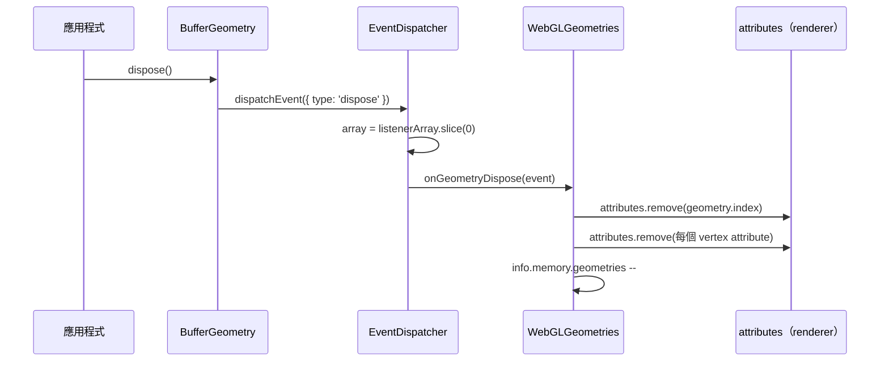

# [FEE-1801] Three.js：Dispose 生命週期契約

:::info
Three.js 將 GPU 端的資源清理交由應用程式自行處理：每個持有資源的類別（geometry、material、texture、render target）都暴露一個 `dispose()` 方法，僅觸發單一事件，由 renderer 子系統訂閱該事件以釋放底層 WebGL 句柄。場景圖通用基底 `Object3D` 並未提供 `dispose()`，因為它本身不持有 GPU 資源——契約被委派至下層。可遷移的設計教訓在於一條介於「我用完了」與「釋放 buffer」之間的 pub-sub 縫合線，讓長時間運行的互動式應用能在不將資源持有者與釋放器耦合的情況下，卸除非 GC 回收的資源。本文閱讀 r172 原始碼以使該契約具體化，並為此模式命名以便在其他程式碼中辨識。
:::

## 背景

Three.js 不會自動釋放 GPU 端資源。手冊就 buffer attribute 直接指出：「這些實體只有在你呼叫 `BufferGeometry.dispose()` 時才會被刪除」（[three.js manual, "How to dispose of objects"](https://threejs.org/manual/en/how-to-dispose-of-objects.html)）。引擎將責任推給應用程式，並針對 geometries、materials、textures 與 render targets 訂下各自的規則。

場景圖通用基底 `Object3D` 繼承 `EventDispatcher` 並暴露與 rendering、shadows 相關的 hook，但在 r172 該檔案中找不到 `dispose` 符號（[`src/core/Object3D.js`](https://github.com/mrdoob/three.js/blob/r172/src/core/Object3D.js)）。基底類別持有 position、rotation、parent/child 連結與 update callback；它不持有 WebGL 句柄，因此沒有需要執行的拆解程序。釋放工作被委派給真正持有 GPU 資源的子類別。

該委派即是本文所描述契約背後的架構事實。本文後續藉由閱讀 r172 原始碼，呈現各部件如何協同運作，並為此模式命名。

## 情境

一個 WebGL 藝廊以計時器輪播 3D 模型。每次切換載入新的 GLTF、置入場景，並以 `scene.remove(oldRoot)` 移除前一個 root。一小時後該分頁從 200 MB 增長到 1.4 GB，最終 GPU 行程當掉。作者原以為 `scene.remove` 會一併釋放 buffer 與 texture；它並不會。`scene.remove` 僅將節點從場景圖中卸下，所有曾被引用的 `BufferGeometry`、`Material` 與 `Texture` 仍存活於 GPU 端，因為沒有任何程式呼叫它們的 `dispose()`。同樣的情況也常見於切換場景的編輯器與儀表板，當資料源被重新載入但前一視圖所綁定的資源未被拆除時便會發生。

## 最佳實踐

- **必須**對每一個你配置的 render target 呼叫 `WebGLRenderTarget.dispose()`。Render target 會建立 framebuffer 與 renderbuffer，這些物件無法由其他 dispose 路徑回收：「這些物件只有在執行 `WebGLRenderTarget.dispose()` 時才會被釋放」（[three.js manual](https://threejs.org/manual/en/how-to-dispose-of-objects.html)）。
- **必須**將 texture 視為與 material 各自獨立持有。手冊明文：「釋放 material 對 texture 沒有影響。它們被分開處理，因為單一 texture 可能同時被多個 material 使用」（[three.js manual](https://threejs.org/manual/en/how-to-dispose-of-objects.html)）。釋放 material 會釋出 shader program 與 uniform binding；texture 的生命週期需要自行記帳。
- **必須**在呼叫 `dispose()` 之後丟棄 controls 與 renderer，並在重用前建立新的實例。手冊指出：「這些類別的實例在呼叫 `dispose()` 之後便無法再使用。在這種情況下你必須建立新的實例」（[three.js manual](https://threejs.org/manual/en/how-to-dispose-of-objects.html)）。
- **應該**在移除子樹時撰寫明確的遞迴拆解，因為框架不會替你走訪場景圖。使用者程式碼的慣用寫法是 `scene.traverse(o => { o.geometry?.dispose(); /* dispose materials, with array handling */ })`。renderer 自身的 `dispose()` 並不會走訪使用者持有的物件（見「範例」），因此走訪這件事由應用程式負責。
- **可以**依賴 `EventDispatcher` 來附掛你自己的清理 listener，與 renderer 的 listener 並存。由於 dispatch 會對 listener 陣列做快照（見「深入探討」），新增會在內部呼叫 `removeEventListener` 的應用端 listener 是安全的。

## 設計思維

該契約以一條明示的 pub-sub 縫合線取代 RAII 風格的自動回收。資源持有者只知道自己「用完了」；listener 才負責真正的 GPU 拆解。`EventDispatcher` 是承載此訊號的原語，提供 `addEventListener`、`removeEventListener` 與 `dispatchEvent`（[`src/core/EventDispatcher.js`](https://github.com/mrdoob/three.js/blob/r172/src/core/EventDispatcher.js)），而每一個暴露 `dispose()` 的資源類別都繼承它。

此解耦的好處：另一種 renderer（WebGPU、軟體渲染、測試替身）可以對同一個 `'dispose'` 事件接上不同的 listener，無需更動 `BufferGeometry`、`Material` 或 `Texture`。代價：應用程式必須記得呼叫 `dispose()` 並自行走訪子樹，因為框架拒絕承擔對使用者所建構物件的所有權。本文情境中那個會洩漏到 GPU 行程當掉的藝廊，正是選擇明示拆解的失敗模式。

第二項權衡出現在 dispatch 的順序上。`dispatchEvent` 在迭代之前對 listener 陣列做快照（[`src/core/EventDispatcher.js`](https://github.com/mrdoob/three.js/blob/r172/src/core/EventDispatcher.js)），使得「listener 在 dispatch 期間將自己移除」這一行為安全。該選擇讓 listener 端的拆解慣用寫法（在 handler 中先呼叫 `removeEventListener`，再進行釋放）免於迭代風險，代價是每次 dispatch 都要配置一份 slice。

## 深入探討

r172 中 geometry 拆解的完整鏈路：

1. 應用程式呼叫 `geometry.dispose()`。
2. `BufferGeometry.dispose()` 呼叫 `this.dispatchEvent({ type: 'dispose' })` 並返回（[`src/core/BufferGeometry.js`](https://github.com/mrdoob/three.js/blob/r172/src/core/BufferGeometry.js)）。
3. `EventDispatcher.dispatchEvent` 對 listener 陣列做快照（`const array = listenerArray.slice( 0 );`）並逐一呼叫每個 listener（[`src/core/EventDispatcher.js`](https://github.com/mrdoob/three.js/blob/r172/src/core/EventDispatcher.js)）。
4. 由 `WebGLGeometries` 註冊的 renderer 端 listener `onGeometryDispose` 移除 index attribute、移除每個 vertex attribute，並將 geometry 計數器遞減（[`src/renderers/webgl/WebGLGeometries.js`](https://github.com/mrdoob/three.js/blob/r172/src/renderers/webgl/WebGLGeometries.js)）。

Texture 與 render target 採同樣形狀，但 `WebGLTextures` 安裝了三個獨立的 `'dispose'` listener（一個給 `Texture`、一個給 `WebGLRenderTarget`、一個給附掛在 render target 上的 depth texture，[`src/renderers/webgl/WebGLTextures.js`](https://github.com/mrdoob/three.js/blob/r172/src/renderers/webgl/WebGLTextures.js)）。一個模組，三種 listener 類型，因為一個 render target 會帶一張 colour texture，並可能附帶一張 depth texture，每一張都需要各自的清理接線。

Material 拆解打破了「每個資源各有專屬模組」的模式。並沒有 `WebGLMaterials.js` 這個 listener 持有者；renderer 直接接線：`material.addEventListener( 'dispose', onMaterialDispose );`，而 `onMaterialDispose` 會呼叫 `removeEventListener` 後再呼叫 `deallocateMaterial( material );`（[`src/renderers/WebGLRenderer.js`](https://github.com/mrdoob/three.js/blob/r172/src/renderers/WebGLRenderer.js)）。這個不對稱值得提出來：閱讀使用此模式的程式碼時，持有 listener 的模組未必是與該型別同名的「每資源模組」。搜尋 `addEventListener( 'dispose'` 才能找到接線；單以檔名搜尋是找不到的。

「listener 自我移除」的慣用寫法（`onMaterialDispose` 在釋放之前先把自己移除）正是讓 `dispatchEvent` 中那個「先快照再迭代」決策具有承重作用的原因。少了 slice，從 dispatch 迴圈內部移除某個 listener 會導致跳過陣列中的下一個 listener。

## 圖解



## 範例

該鏈路的 geometry 端僅有一個方法：

*來源：src/core/BufferGeometry.js (r172)*

```js
dispose() {

	this.dispatchEvent( { type: 'dispose' } );

}
```

`Material` 與 `Texture` 形狀相同。兩者皆繼承 `EventDispatcher`（[`src/materials/Material.js`](https://github.com/mrdoob/three.js/blob/r172/src/materials/Material.js)、[`src/textures/Texture.js`](https://github.com/mrdoob/three.js/blob/r172/src/textures/Texture.js)），且各自定義一行的 `dispose()` 用於發出 `{ type: 'dispose' }`。三者皆不直接做任何 GPU 工作。

renderer 中對應的 listener 才是真正執行釋放之處：

*來源：src/renderers/webgl/WebGLGeometries.js (r172)*

```js
function onGeometryDispose( event ) {

	const geometry = event.target;

	if ( geometry.index !== null ) {

		attributes.remove( geometry.index );

	}
```

註冊就在該函式旁邊：`geometry.addEventListener( 'dispose', onGeometryDispose );`（[`src/renderers/webgl/WebGLGeometries.js`](https://github.com/mrdoob/three.js/blob/r172/src/renderers/webgl/WebGLGeometries.js)）。該 listener 走訪每個 vertex attribute、移除 wireframe attribute 與 binding state，並將計數器遞減。

renderer 層級的 `dispose()` 將工作扇出至各子系統，但不會觸及使用者持有的物件：

*來源：src/renderers/WebGLRenderer.js (r172)*

```js
this.dispose = function () {

	canvas.removeEventListener( 'webglcontextlost', onContextLost, false );
	canvas.removeEventListener( 'webglcontextrestored', onContextRestore, false );
	canvas.removeEventListener( 'webglcontextcreationerror', onContextCreationError, false );

	background.dispose();
	renderLists.dispose();
```

它卸下 DOM listener 並請每個子系統各自釋放。Geometries、materials 與 textures 並未被迭代。renderer 將清理扇出；它不會走訪場景圖。

該空缺由使用者端的慣用寫法填補，這是應用程式層的程式碼，並非框架程式碼：

```js
// Application-level recursive teardown — not provided by Three.js
function disposeSubtree(root) {
  root.traverse((obj) => {
    obj.geometry?.dispose();
    const m = obj.material;
    if (Array.isArray(m)) {
      m.forEach((mat) => mat.dispose());
    } else {
      m?.dispose();
    }
  });
}
```

撰寫 Three.js 應用的讀者被預期要自行擁有此走訪。框架中沒有 `Scene.disposeAll()` 或遞迴輔助函式；此缺席是刻意的，因為框架並不知道應用程式還想保留哪些資源。

## Dispose 生命週期契約

本文所命名的模式即 **Dispose 生命週期契約**：持有資源的類別暴露一個 `dispose()` 方法，其唯一工作是在內建的 `EventDispatcher` 上觸發 `'dispose'` 事件，由獨立的 renderer 子系統訂閱該事件並執行真正的拆解。通用基底類別（`Object3D`）刻意省略 `dispose()`，因為它不持有任何資源；契約存在於下一層，附掛於持有 GPU 句柄的類別之上。

此契約有四個運作部件：

1. **持有資源類別上的 `dispose()` 方法。** `BufferGeometry`、`Material`、`Texture`、`WebGLRenderTarget`，每一個都是一行的 `dispatchEvent` 呼叫。
2. **持有實際清理工作的獨立 listener。** `WebGLGeometries`、`WebGLTextures` 與 `WebGLRenderer`（負責 materials）接上 `onXDispose` listener，呼叫 `gl.deleteX` 或移除快取的 attribute。
3. **使用者程式碼中的手動遞迴。** 框架不會走訪場景圖；應用程式撰寫 `scene.traverse(...)` 將釋放扇出至子樹。
4. **renderer 層級的 `dispose()`，將工作扇出至子系統，但不迭代使用者持有的物件。** 它拆除 DOM listener 並請每個子系統各自釋放；geometries、materials 與 textures 不在其管轄範圍。

一旦此契約被命名，便能在其他程式碼中辨識。長時間運行、持有非 GC 回收資源的應用（WebGL textures、audio buffers、web workers、ResizeObservers、IntersectionObservers、OffscreenCanvas、WebSocket connections、長存的 `window`/`document` listener）通常都需要相同形狀：來自資源持有者的「完成」訊號、執行實際拆解的訂閱者，以及由應用程式負責的走訪，因為函式庫拒絕承擔對該樹的所有權。

**在其他程式碼中如何辨識：**

- 持有資源的類別上有 `dispose()`（或 `destroy()`、`release()`、`close()`），且通用基底類別上並無對應方法。
- 獨立的 listener 或 observer 模組（常以 `<Subsystem>Disposer`、`<Resource>Manager` 命名，或於 renderer/coordinator 檔案中內聯接線）持有實際清理工作；持有 listener 的模組未必是與該型別同名的「每資源模組」。
- 使用者程式碼中的手動遞迴慣用寫法（`tree.traverse`、`forEachDescendant`、手寫 DFS），因為框架刻意不自動走訪。
- 協調者（renderer、app、root component）上有頂層 `dispose()`，將工作扇出至子系統，但止步於迭代使用者所建構的物件。
- 通用基底類別上沒有 `dispose()`，作為「所有權被向下委派」的架構訊號。

## 內部參考

- [FEE-1800 Codebase Studies — Overview](/zh-tw/Codebase%20Studies/codebase-studies-overview)
- [FEE-501 Composition Patterns](/zh-tw/Component%20Architecture%20and%20Design%20Patterns/501) — pub-sub 拆解訊號的抽象模式背景；本文以 Three.js 作為實作見證。
- [FEE-506 Error Boundaries & Resilience](/zh-tw/Component%20Architecture%20and%20Design%20Patterns/506) — 拆解 listener 拋錯時的處置。

## 參考資料

- three.js authors, "How to dispose of objects," three.js manual (2025). https://threejs.org/manual/en/how-to-dispose-of-objects.html
- mrdoob et al., "Object3D.js," three.js r172 source (2025). https://github.com/mrdoob/three.js/blob/r172/src/core/Object3D.js
- mrdoob et al., "BufferGeometry.js," three.js r172 source (2025). https://github.com/mrdoob/three.js/blob/r172/src/core/BufferGeometry.js
- mrdoob et al., "Material.js," three.js r172 source (2025). https://github.com/mrdoob/three.js/blob/r172/src/materials/Material.js
- mrdoob et al., "Texture.js," three.js r172 source (2025). https://github.com/mrdoob/three.js/blob/r172/src/textures/Texture.js
- mrdoob et al., "EventDispatcher.js," three.js r172 source (2025). https://github.com/mrdoob/three.js/blob/r172/src/core/EventDispatcher.js
- mrdoob et al., "WebGLRenderer.js," three.js r172 source (2025). https://github.com/mrdoob/three.js/blob/r172/src/renderers/WebGLRenderer.js
- mrdoob et al., "WebGLGeometries.js," three.js r172 source (2025). https://github.com/mrdoob/three.js/blob/r172/src/renderers/webgl/WebGLGeometries.js
- mrdoob et al., "WebGLTextures.js," three.js r172 source (2025). https://github.com/mrdoob/three.js/blob/r172/src/renderers/webgl/WebGLTextures.js
- mrdoob et al., "three.js r172 release tag," GitHub (2025). https://github.com/mrdoob/three.js/releases/tag/r172
