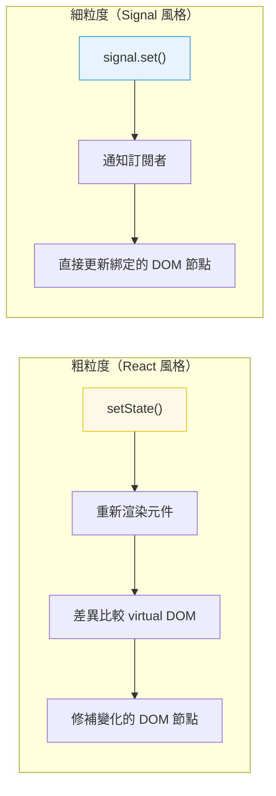

# [FEE-502] 響應式狀態與 Signals

:::info
響應式是 UI 元件在底層資料變化時自動更新的機制。Signals 是一種現代的細粒度響應式原語，正在跨框架獲得採用。
:::

## 背景

每個前端框架都解決同一個基本問題：當資料變化時，UI 必須更新。方法各異──React 重新渲染整個元件子樹、Vue 使用基於 proxy 的依賴追蹤系統、Svelte 將響應式編譯為直接的 DOM 更新，而 Solid 使用 signals 進行細粒度更新。理解響應式模型很重要，因為它決定了效能特性、除錯策略和架構模式。

## 原則

工程師 MUST 理解所選框架的響應式模型──具體來說，什麼觸發更新、什麼範圍被重新求值，以及如何避免不必要的工作。

工程師 SHOULD 理解從粗粒度到細粒度的響應式光譜：

- **粗粒度**（React）：狀態變化重新渲染整個元件子樹。開發者使用記憶化（`useMemo`、`React.memo`）來修剪不必要的重新渲染。
- **細粒度**（Signals、Solid、Vue）：只有依賴於變化值的特定 DOM 節點更新。不需要差異比較。

工程師 SHOULD 偏好明確、可追蹤的資料流。不可見的響應式（例如對巢狀物件的深層 proxy 觀察）可能使除錯更困難。Signals 使依賴關係明確。

## 圖解



## 範例

**Signal 模式（框架無關）：**

```js
// Signal 持有一個值並追蹤其依賴者
function createSignal(initialValue) {
  let value = initialValue;
  const subscribers = new Set();

  function get() {
    // 追蹤：如果在 computed/effect 內部呼叫，註冊依賴
    if (currentObserver) subscribers.add(currentObserver);
    return value;
  }

  function set(newValue) {
    if (newValue === value) return; // 無變化則跳過
    value = newValue;
    // 通知：重新執行所有依賴者
    for (const sub of subscribers) sub();
  }

  return [get, set];
}

const [count, setCount] = createSignal(0);
// 在 effect 中讀取 count() 會自動訂閱
// 呼叫 setCount(1) 會自動通知訂閱者
```

**衍生/計算狀態：**

```js
// 計算值從其他 signals 衍生
function createComputed(fn) {
  const [get, set] = createSignal(fn());

  // 當其 signal 依賴變化時重新執行 fn
  createEffect(() => set(fn()));

  return get;
}

const [firstName, setFirstName] = createSignal('Alive');
const [lastName, setLastName] = createSignal('Kuo');
const fullName = createComputed(() => `${firstName()} ${lastName()}`);

fullName(); // "Alive Kuo"
setFirstName('John');
fullName(); // "John Kuo" -- 自動更新
```

## 常見錯誤

**觸發不必要的重新渲染（粗粒度）。** 在 React 中，在渲染中建立新物件或陣列（`style` 內聯物件、`items.filter(...)`）每次渲染都會建立新引用，使 `React.memo` 失效。請記憶化或提升穩定引用。

**變異狀態而非替換它。** 大多數響應式系統透過引用比較檢測變化。變異物件（`state.items.push(x)`）不會在 React 或 signals 中觸發更新。建立新引用：`setItems([...items, x])`。

**過度訂閱全域狀態。** 在許多元件中讀取大型全域 store 意味著每次 store 變化都會重新通知所有元件。衍生每個元件需要的最小切片。Signals 天然解決這個問題──每個 signal 都是自己的訂閱點。

**除錯時忽略響應式模型。** 當 UI 沒有如預期更新時，第一個問題是：「響應式系統知道這個值變了嗎？」檢查你是否觸發了正確的 setter、引用是否真的改變了，以及元件是否訂閱了那個特定的狀態片段。

## 相關 FEE

- [FEE-500](500.md) 元件架構與設計模式總覽
- [FEE-501](501.md) 元件組合模式
- [FEE-600](../State%20Management/600.md) 狀態管理總覽
- [FEE-301](../JavaScript%20Core%20and%20Runtime/301.md) 事件循環與非同步模型

## 參考資料

- [TC39 Signals 提案](https://github.com/tc39/proposal-signals)
- [Solid.js: 響應式](https://www.solidjs.com/guides/reactivity)
- [Vue.js: 深入響應式](https://vuejs.org/guide/extras/reactivity-in-depth.html)
- [Preact Signals](https://preactjs.com/guide/v10/signals/)
- [Ryan Carniato: A Hands-on Introduction to Fine-Grained Reactivity](https://dev.to/ryansolid/a-hands-on-introduction-to-fine-grained-reactivity-3ndf)
