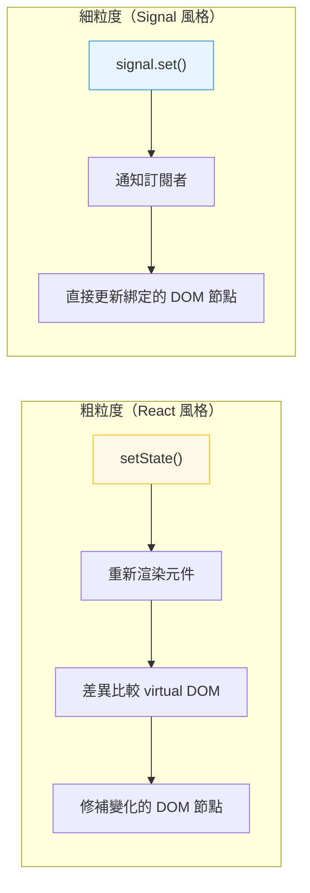

# [FEE-502] 響應式狀態與 Signals

:::info
響應式是 UI 元件在底層資料變化時自動更新的機制。Signals 是一種現代的細粒度響應式原語，正在跨框架獲得採用。
:::

## 背景

每個前端框架都解決同一個基本問題：當資料變化時，UI 必須更新。方法各異──React 重新渲染整個元件子樹、Vue 使用基於 proxy 的依賴追蹤系統、Svelte 將響應式編譯為直接的 DOM 更新，而 Solid 使用 signals 進行細粒度更新。理解響應式模型很重要，因為它決定了效能特性、除錯策略和架構模式。

## 設計思維

### 理解觸發重新渲染的條件

每個響應式系統都有一個觸發模型——使計算或元件重新執行的具體條件。在 React 中，任何對狀態
setter 的呼叫都會排程該元件及其所有後代的重新渲染，除非記憶化介入。在 Vue 中，在元件渲染函式
中讀取響應式屬性會註冊依賴，寫入該屬性則只排程讀取了它的元件。在 Solid 等基於 signal 的系統
中，訂閱是在 signal 層級建立的：只有在上次執行期間讀取了 signal 的確切計算或 DOM 綁定，才會
在 signal 改變時重新執行。

實際影響是，相同的應用程式邏輯在不同框架中表現不同，而相同的效能錯誤有不同的症狀。在 React
中，每次渲染傳入新物件引用作為 prop，即使資料值相同，也會導致子元件重新渲染——因為 React 按
引用比較。在 Vue 中，從 `reactive()` 物件讀取深層巢狀屬性會在完整路徑上註冊依賴；變異兄弟
路徑仍會通知元件。在 Solid 中，在計算中讀取同一個 signal 兩次仍然只是一個訂閱——執行期會去
重複處理。

在新增記憶化、分析不必要的渲染、或在 signal 和 store 之間選擇之前，底層問題始終是：「這個
框架認為什麼是變化，它認為哪些計算依賴於那個值？」理解哪些操作建立訂閱、哪些操作通知訂閱者，
是能夠推理響應式的工程師與被其驚訝的工程師之間的基礎差異。

### 粗粒度 vs. 細粒度響應式

從粗粒度到細粒度的響應式光譜，描述了系統如何精確識別 UI 的哪些部分依賴於哪些狀態片段。

**粗粒度響應式**（React）將元件視為重新求值的單元。當狀態改變時，元件函式從頭到尾重新執行，
產生新的虛擬 DOM 樹。執行期將新樹與前一棵樹進行比較（協調），並將差異應用到真實 DOM。這個
模型在概念上簡單——元件只是從狀態到 UI 的函式——但這意味著每次渲染的工作量與元件輸出成正比，
而非與變化的大小成正比。大型元件樹受益於記憶化（`React.memo`、`useMemo`、`useCallback`）
來修剪實際上沒有改變的子樹。開發者負責指定哪些 props 和計算值應該穩定。

**細粒度響應式**（Solid、Preact Signals、Vue Composition API）將個別響應式值視為訂閱單元。
在 DOM 綁定中讀取的 signal——例如屬性或文字節點——在該 DOM 節點和 signal 之間建立直接訂閱。
當 signal 改變時，只有該 DOM 節點更新；沒有元件重新執行、沒有虛擬 DOM 差異比較、沒有樹遍歷。
更新的代價與變化成正比：如果一千個計數器中的一個改變，正好只有一個文字節點更新。開發者只需
寫一次邏輯，執行期在第一次求值期間自動建立依賴圖。

取捨並不是說一個模型對所有應用程式都更好。粗粒度響應式對熟悉函式元件的開發者更易於推理，
且有 React 生態系的良好支援。細粒度響應式為高度動態的 UI 提供了本質上更低的更新成本，並
避免了手動記憶化標注的需求。工程決策是選擇適合應用程式更新特性和團隊現有專業的模型。

### 顯式 vs. 隱式依賴追蹤

響應式設計的一個關鍵維度是依賴是顯式宣告還是隱式發現的。React 的 `useEffect` 和 `useMemo`
需要顯式依賴陣列：在 hook 內部讀取的每個值都必須列在陣列中，否則 hook 會操作過時的閉包。
這種顯式性是一種設計選擇——它給 linter（`react-hooks/exhaustive-deps`）提供了警告錯誤陣列
所需的資訊，並使依賴範圍在程式碼中可見。取捨是開發者必須正確維護這些陣列；遺漏的依賴是一個
不總是顯而易見的 bug。

基於 signal 的系統在執行期間隱式發現依賴。當 computed 函式執行時，它讀取的每個 signal 都
自動加入其依賴集合。不需要維護陣列。當函式再次執行時——因為依賴改變了——它從頭重建依賴集合，
這意味著條件讀取被正確處理：如果 signal 只在一個分支中讀取，它只在該分支執行時是依賴。

顯式依賴宣告和隱式依賴追蹤各有除錯含義。使用顯式陣列時，過時閉包 bug 是由遺漏的依賴引起的，
並被 linter 捕獲。使用隱式追蹤時，遺漏更新 bug 是由未在被追蹤上下文中發生的讀取引起的——在
`setTimeout` 或未追蹤的事件處理器中讀取 signal——並且需要理解執行期的追蹤語義才能診斷。兩種
模型都不能消除 bug；每種都會產生不同類別的錯誤，需要對模型的熟悉才能快速識別。

### TC39 Signals 提案與框架收斂

響應式領域的一個值得注意的發展是 TC39 Signals 提案，旨在將原語 signal 類型標準化為 JavaScript
語言本身的一部分。該提案定義了帶有 `Signal.State`（可寫 signal）和 `Signal.Computed`（衍生
值）的 `Signal` 類，並規定了無閃爍求值演算法——對依賴圖進行拓撲排序，確保每個 computed 在每次
更新週期中最多被求值一次，且永遠不會讀取過時的中間值。

標準化的動機是框架收斂。Solid、Preact、Vue、Angular 和其他幾個框架已獨立地達到了類似的 signal
語義。一個標準原語將允許庫共享響應式圖基礎架構，而不需要每個庫從頭重新實現追蹤和通知機制。
瀏覽器 DevTools 等工具也可以檢查任何應用程式的 signal 圖，無論它使用哪個框架。

對於現在評估技術選擇的團隊，該提案表明社群對基於 signal 的細粒度響應式是持久的架構方向而非
框架特定的實驗有強烈的共識。即使是使用 React 的團隊，也可以透過 `@preact/signals-react` 等
整合，對特定效能敏感的場景採用 signals。因此，無論主要框架是什麼，理解 signal 模型對前端工程
師都是相關的，因為這些模式——計算值、條件訂閱、effect 邊界——出現在每個採用了基於 signal 的
響應式的框架中。

### 何時選擇 signal 與元件本地狀態

在 signal 和元件本地狀態（例如 React 的 `useState`）之間的決策，主要取決於兩個因素：消費者
的範圍和所需的更新粒度。

元件本地狀態是狀態只在單一元件及其直接子元件中使用時的正確選擇。React 的 `useState` 或
Solid 在元件層級的 `createSignal` 都能滿足這個需求。狀態與擁有它的元件共置，隨元件卸載，
不需要全域協調。對於絕大多數 UI 狀態——下拉選單是否開啟、搜尋輸入中的文字內容、哪個標籤頁被
選中——元件本地狀態是正確的模型，signals 不會增加額外價值。

模組或全域範圍的 signal——在任何元件外部——是當元件樹中多個不相關的部分需要讀取並響應同一個
值、且不希望透過 prop drilling 或 context 的情況下的適當選擇。在 Solid 中，模組層級的 signal
是簡單共享值的全域 store 的有效替代方案。在 React 搭配 `@preact/signals-react` 整合時，全域
signal 可以在任何元件中讀取，而不會讓整個元件訂閱重新渲染——只有讀取 signal 的特定 DOM 綁定
更新。這使模組層級的 signals 成為高頻狀態（如游標位置或每秒更新多次的即時計時器）的有用工具。

模組層級 signals 的風險在於它們實際上是全域可變狀態，這使測試更困難，並可能在功能之間引入
意外耦合。被許多元件讀取的模組層級 signal 是一個共享依賴；其在任何給定時刻的值反映的是全域
程式狀態，而非元件特定的狀態。團隊應該（SHOULD）記錄存在哪些模組層級 signals、哪些不變量
約束其值，以及應用程式的哪些部分被允許寫入它們。

### 可追蹤性與響應式的不透明性

不可見的響應式使除錯更困難。當 Vue 的 `reactive()` 物件對巢狀物件使用深層 proxy 觀察時，物件
樹中任何位置的任何變異都會觸發更新。這很強大但不透明：開發者在面對意外重新渲染的元件時，必須
追蹤可能很大的物件中的哪個屬性發生了變化，以及哪個元件訂閱了它。更新機制是自動且完整的，但
從變異到重新渲染的因果鏈在程式碼中並不可見。

Signals 使因果鏈明確。每個 signal 都是一個具名的、有型別的值；訂閱 signal 需要在被追蹤的上下
文中讀取它；訂閱者列表直接是每個計算讀取了哪些 signals 的函式。當元件意外重新渲染時，問題是
「哪個 signal 改變了？」——這個答案可以透過檢查 signal 的值和它的寫入呼叫點找到。這種可追蹤
性在出現問題時減少了除錯範圍。

實際指導方針是優先選擇依賴圖可以從程式碼本身讀取的響應式機制。具有具名值和顯式讀取的細粒度
signals，比對大型巢狀物件進行不透明的深層 proxy 觀察更可追蹤。當框架不提供深層觀察的替代方案
時，緩解措施是保持響應式物件淺層，並將大型狀態拆分為多個獨立具名的 signals 或 refs，而非將所
有內容巢狀到單一的響應式樹中。

除錯遺漏更新或意外重新渲染時，第一個診斷問題是響應式系統是否完全收到了變化的通知。在 signal
系統中，這意味著驗證變異是否透過 signal setter 而非直接修改底層值來進行的。在基於 proxy 的
系統中，這意味著驗證變異是否發生在響應式 proxy 物件上，而非分離的引用上。在這兩種情況下，
除錯路徑都從理解框架的具體觸發模型開始——無論應用程式使用哪種響應式機制，這都是有效診斷的
先決條件。

對於常見的「為何 UI 沒有更新」除錯情境，有一個系統化的三步驟診斷方法：第一，確認狀態確實在
響應式系統知曉的情況下發生了變化（setter 被呼叫，或 proxy 屬性被設定）；第二，確認消費該
狀態的元件或計算是否在被追蹤的上下文中讀取了它（而非在初始化程式碼、`setTimeout` 或非追蹤
的事件處理器中）；第三，確認沒有任何中間的記憶化或 shouldUpdate 邏輯攔截了更新。這三個問題
涵蓋了響應式 bug 的絕大多數根本原因，能在不借助複雜執行期工具的情況下，快速縮小問題範圍。

### 響應式圖的生命週期與記憶體管理

響應式系統維護訂閱者的參考，這對記憶體管理有影響。在元件卸載後，若其訂閱仍然存在，signal
的通知會嘗試更新一個已卸載的計算，導致記憶體洩漏或已卸載元件的警告。大多數框架透過在元件
卸載時自動清除在元件生命週期內建立的所有訂閱來處理這個問題：React 的 `useEffect` 清除函式、
Solid 的所有權樹、Vue 的 `onUnmounted` 生命週期鉤子，以及 Preact Signals 的自動追蹤清除。

然而，在元件生命週期之外建立的響應式副作用——例如在模組初始化程式碼中，或在 `setTimeout` 回
呼中建立的 `createEffect`——不會自動清除。這些是必須手動管理的長期訂閱。忽略清除這些訂閱是
信號 signal 程式碼庫中記憶體洩漏的常見來源，症狀是效能隨著使用者操作的累積而緩慢降低，因為
無法被垃圾回收的訂閱列表不斷增長。

在設計使用模組層級 signals 的功能時，審查在哪裡建立 effects 並確保每個 effect 都有對應的
清除機制。在 Solid 中，使用 `createRoot` 為在元件外部建立的 effects 提供明確的所有權邊界和
手動清除能力。在 Vue 中，使用 `watchEffect` 回傳的停止函式來終止長期運行的觀察者。在 Preact
Signals 中，在元件外部使用 `effect()` 會回傳一個清除函式，必須在適當時機呼叫它。記憶體安全
的響應式程式碼的標誌是每個訂閱都有一個清晰的所有者，且該所有者的生命週期包含訂閱的整個存在
週期。

## 最佳實踐

**MUST 將 signal 的粒度維持在能獨立更新的層級。** 每個 signal SHOULD 代表一塊可以獨立變化的狀態。將大型狀態物件放在單一 signal 中，會迫使所有訂閱者在任何欄位變更時重新執行，即使消費元件只讀取其中一個欄位。應依照變更頻率和消費者範圍拆分：`userName` signal 和 `userAvatarUrl` signal 可以各自獨立更新；單一 `user` signal 則將兩者耦合在一起。

**SHOULD 優先使用計算值／衍生值，而非在 effect 中複製狀態。** 當值 B 是值 A 的純函式時，應以 `computed`（或等效的 `createMemo`、Vue `computed`）表達，而非以 effect 寫入第二個 signal。計算值會被記憶化，只在依賴變更時重新求值，且永遠不會失去同步。透過 effect 同步狀態會引入額外的渲染週期，可能在寫入和下一次讀取之間產生閃爍（glitch），並製造兩個必須手動保持一致的真實來源。

**SHOULD 謹慎使用 effect——effect 應回應狀態，而非驅動狀態。** Effect（Preact 的 `effect()`、SolidJS 的 `createEffect`、Vue 的 `watchEffect`）是與外部世界同步的正確工具：將資料持久化至 `localStorage`、觸發分析事件、直接更新 DOM。它們是從現有 signal 衍生新值的錯誤工具——那是 computed 的職責。一個以 effect 驅動大多數狀態轉換的程式庫，更難以推理，因為執行順序和重新執行的時機是隱性的。

**應該（SHOULD）優先選擇明確、可追蹤的資料流，而非不透明的響應式。** 當框架同時提供深層 proxy 響應式物件（例如 Vue 的 `reactive()` 作用於巢狀物件）和個別具名響應式原語（signals、`ref()`）時，對於有不同消費者的狀態，優先選擇具名原語。具名原語使依賴圖可讀——每個消費者的訂閱從程式碼中即可看出——而對大型巢狀物件進行深層 proxy 觀察，可能觸發難以在沒有執行期工具的情況下追蹤的意外重新渲染。

**AVOID 在 effect 或 computed 函式內部建立 signal。** 在 effect 內部建立的 signal，是一個不屬於穩定響應式圖的新訂閱點。若 effect 重新執行（因為其自身的依賴改變了），內部的 signal 會被重新建立，遺失任何已累積的狀態，並因孤立的訂閱而造成記憶體洩漏。應在元件或模組作用域中定義 signal；在 effect 和 computed 內部讀取和寫入它們。

## 圖解



## 範例

**Signal 模式（框架無關）：**

```js
// Signal 持有一個值並追蹤其依賴者
function createSignal(initialValue) {
  let value = initialValue;
  const subscribers = new Set();

  function get() {
    // 追蹤：如果在 computed/effect 內部呼叫，註冊依賴
    if (currentObserver) subscribers.add(currentObserver);
    return value;
  }

  function set(newValue) {
    if (newValue === value) return; // 無變化則跳過
    value = newValue;
    // 通知：重新執行所有依賴者
    for (const sub of subscribers) sub();
  }

  return [get, set];
}

const [count, setCount] = createSignal(0);
// 在 effect 中讀取 count() 會自動訂閱
// 呼叫 setCount(1) 會自動通知訂閱者
```

**衍生/計算狀態：**

```js
// 計算值從其他 signals 衍生
function createComputed(fn) {
  const [get, set] = createSignal(fn());

  // 當其 signal 依賴變化時重新執行 fn
  createEffect(() => set(fn()));

  return get;
}

const [firstName, setFirstName] = createSignal('Alive');
const [lastName, setLastName] = createSignal('Kuo');
const fullName = createComputed(() => `${firstName()} ${lastName()}`);

fullName(); // "Alive Kuo"
setFirstName('John');
fullName(); // "John Kuo" -- 自動更新
```

## 深入探討

### Signal 依賴追蹤的運作原理

當一個計算值或 effect 被求值時，執行期會將一個全域的「當前觀察者」變數設為目前的計算。每個 signal 的 `get()` 函式都會檢查這個變數：若當前有觀察者，signal 就將其加入自己的訂閱者集合。計算完成後，執行期清除當前觀察者。結果是在第一次求值期間自動且同步地建立完整的依賴圖——不需要明確的依賴陣列，也不需要訂閱呼叫。

這個機制有一個重要的特性：依賴是**動態發現**的，而非靜態宣告的。如果一個 computed 只在 `condition` 為 `true` 時讀取 `signalA`，而第一次求值時 `condition` 為 `false`，那麼 `signalA` 就不在依賴集合中——當 `signalA` 改變時，computed 不會重新執行。這是正確的行為（在那個分支中，computed 確實不依賴 `signalA`），但對於習慣 React `useEffect` 依賴陣列的工程師來說可能出乎意料，因為在 `useEffect` 中，所有被引用的值都必須列出，無論控制流如何。

TC39 Signals 提案在此模型之上加入了無閃爍（glitch-free）的拓撲求值：在重新執行任何訂閱者之前，執行期對「髒」圖進行拓撲排序，以確保每個 computed 在每次更新週期中最多被重新求值一次，且始終在依賴它的任何訂閱者讀取其值之前完成求值。這防止了「菱形問題」——當兩條來自根 signal 的獨立路徑匯聚到單一 computed 時，可能導致後者讀取到過時的中間值。

實務上：在任何響應式上下文之外讀取 signal 的值（在事件處理器內部、在 `setTimeout` 內部、在模組初始化時），不會註冊依賴——它只是返回當前值。只有在被追蹤的計算（computed 或 effect 的執行）期間發生的讀取，才會建立訂閱。

## 常見錯誤

**觸發不必要的重新渲染（粗粒度）。** 在 React 中，在渲染中建立新物件或陣列（`style` 內聯物件、`items.filter(...)`）每次渲染都會建立新引用，使 `React.memo` 失效。請記憶化或提升穩定引用。

**變異狀態而非替換它。** 大多數響應式系統透過引用比較檢測變化。變異物件（`state.items.push(x)`）不會在 React 或 signals 中觸發更新。建立新引用：`setItems([...items, x])`。

**過度訂閱全域狀態。** 在許多元件中讀取大型全域 store 意味著每次 store 變化都會重新通知所有
元件。衍生每個元件需要的最小切片。Signals 天然解決這個問題──每個 signal 都是自己的訂閱點。
在基於 selector 的 store（如 Redux 的 `useSelector` 或 Zustand）中，selector 函式必須返回穩
定的引用：每次呼叫都建立新物件的 selector（例如 `state => ({ a: state.a, b: state.b })`）
在每次 store 更新時都會觸發元件重新渲染。使用淺比較選項或記憶化 selector 函式（如
`reselect` 的 `createSelector`）確保只在實際用到的資料改變時才觸發重新渲染。

**除錯時忽略響應式模型。** 當 UI 沒有如預期更新時，第一個問題是：「響應式系統知道這個值變了嗎？」檢查你是否觸發了正確的 setter、引用是否真的改變了，以及元件是否訂閱了那個特定的狀態片段。

**在未追蹤的上下文中讀取 signal。** 在事件處理器、`setTimeout` 回呼或模組層級初始化程式碼中
讀取 signal，不會建立訂閱——它只是快照當前值。如果在未追蹤的上下文中讀取 signal 後期望 UI
自動更新，這個期望是錯誤的。必須在 computed 或 effect 的追蹤上下文中讀取，才能建立響應式
訂閱。

**在每次渲染中內聯建立配置物件。** 在 JSX 中使用 <code v-pre>style={{ color: 'red' }}</code> 或
<code v-pre>config={{ enabled: true }}</code> 等語法，每次渲染都會建立新的物件引用。在 React 中，這會使
`React.memo` 的 props 比較失效；在 signal 系統中，如果下游計算比較引用，也會觸發不必要的
重新計算。對於在渲染間保持不變的物件配置，應將其提升到元件外部，或使用 `useMemo`/
`createMemo` 使引用穩定。

## 相關 FEE

- [FEE-500](500.md) 元件架構與設計模式總覽
- [FEE-501](501.md) 元件組合模式
- [FEE-600](../State%20Management/600.md) 狀態管理總覽
- [FEE-301](../JavaScript%20Core%20and%20Runtime/301.md) 事件循環與非同步模型

## 參考資料

- [TC39 Signals 提案](https://github.com/tc39/proposal-signals)
- [Solid.js: 響應式](https://www.solidjs.com/guides/reactivity)
- [Vue.js: 深入響應式](https://vuejs.org/guide/extras/reactivity-in-depth.html)
- [Preact Signals](https://preactjs.com/guide/v10/signals/)
- [Ryan Carniato: A Hands-on Introduction to Fine-Grained Reactivity](https://dev.to/ryansolid/a-hands-on-introduction-to-fine-grained-reactivity-3ndf)
- [TC39 Signals 提案 README](https://github.com/tc39/proposal-signals#readme) — 標準化 signals 的詳細理由，包括無閃爍求值演算法和框架互通性目標
- [React 文件: useMemo](https://react.dev/reference/react/useMemo) — React 中從 coarse-grained 響應式模型中獲取穩定衍生值的標準方式，是理解粗粒度響應式如何透過記憶化逼近細粒度更新粒度的實用參考
- [Vue.js: Reactivity API — Core](https://vuejs.org/api/reactivity-core.html) — `ref`、`reactive`、`computed`、`watch` 等 Vue Composition API 響應式原語的完整 API 參考，含各函式的使用時機指南
- [Preact Signals 深入介紹](https://preactjs.com/blog/introducing-signals/) — Preact 團隊說明 signals 設計決策的文章，涵蓋為何選擇 signals 而非傳統的基於元件的響應式，以及如何在 React 應用程式中以最小的遷移成本引入細粒度響應式的具體策略
- [Angular Signals 指南](https://angular.dev/guide/signals) — Angular 17 引入的 signals 實作說明，展示了與 Angular change detection 的整合方式，對需要在 Angular 生態系中理解 signal 語義的工程師是重要的補充參考
- [SolidJS: 響應式根基](https://www.solidjs.com/docs/latest/api#basic-reactivity) — Solid 的 `createSignal`、`createEffect`、`createMemo` 完整 API 文件，附帶說明如何正確管理響應式根（reactive root）生命週期的 `createRoot` 指南
