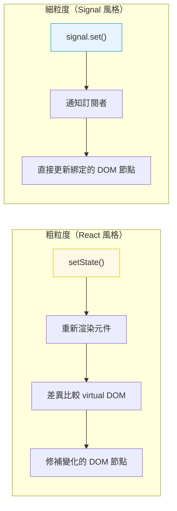

# [FEE-502] 響應式狀態與 Signals

:::info
響應式是 UI 元件在底層資料變化時自動更新的機制。Signals 是一種現代的細粒度響應式原語，正在跨框架獲得採用。
:::

## 背景

每個前端框架都解決同一個基本問題：當資料變化時，UI 必須更新。方法各異──React 重新渲染整個元件子樹、Vue 使用基於 proxy 的依賴追蹤系統、Svelte 將響應式編譯為直接的 DOM 更新，而 Solid 使用 signals 進行細粒度更新。理解響應式模型很重要，因為它決定了效能特性、除錯策略和架構模式。

## 原則

工程師 MUST 理解所選框架的響應式模型──具體來說，什麼觸發更新、什麼範圍被重新求值，以及如何避免不必要的工作。

工程師 SHOULD 理解從粗粒度到細粒度的響應式光譜：

- **粗粒度**（React）：狀態變化重新渲染整個元件子樹。開發者使用記憶化（`useMemo`、`React.memo`）來修剪不必要的重新渲染。
- **細粒度**（Signals、Solid、Vue）：只有依賴於變化值的特定 DOM 節點更新。不需要差異比較。

工程師 SHOULD 偏好明確、可追蹤的資料流。不可見的響應式（例如對巢狀物件的深層 proxy 觀察）可能使除錯更困難。Signals 使依賴關係明確。

## 最佳實踐

**MUST 將 signal 的粒度維持在能獨立更新的層級。** 每個 signal SHOULD 代表一塊可以獨立變化的狀態。將大型狀態物件放在單一 signal 中，會迫使所有訂閱者在任何欄位變更時重新執行，即使消費元件只讀取其中一個欄位。應依照變更頻率和消費者範圍拆分：`userName` signal 和 `userAvatarUrl` signal 可以各自獨立更新；單一 `user` signal 則將兩者耦合在一起。

**SHOULD 優先使用計算值／衍生值，而非在 effect 中複製狀態。** 當值 B 是值 A 的純函式時，應以 `computed`（或等效的 `createMemo`、Vue `computed`）表達，而非以 effect 寫入第二個 signal。計算值會被記憶化，只在依賴變更時重新求值，且永遠不會失去同步。透過 effect 同步狀態會引入額外的渲染週期，可能在寫入和下一次讀取之間產生閃爍（glitch），並製造兩個必須手動保持一致的真實來源。

**SHOULD 謹慎使用 effect——effect 應回應狀態，而非驅動狀態。** Effect（Preact 的 `effect()`、SolidJS 的 `createEffect`、Vue 的 `watchEffect`）是與外部世界同步的正確工具：將資料持久化至 `localStorage`、觸發分析事件、直接更新 DOM。它們是從現有 signal 衍生新值的錯誤工具——那是 computed 的職責。一個以 effect 驅動大多數狀態轉換的程式庫，更難以推理，因為執行順序和重新執行的時機是隱性的。

**AVOID 在 effect 或 computed 函式內部建立 signal。** 在 effect 內部建立的 signal，是一個不屬於穩定響應式圖的新訂閱點。若 effect 重新執行（因為其自身的依賴改變了），內部的 signal 會被重新建立，遺失任何已累積的狀態，並因孤立的訂閱而造成記憶體洩漏。應在元件或模組作用域中定義 signal；在 effect 和 computed 內部讀取和寫入它們。

## 圖解



## 範例

**Signal 模式（框架無關）：**

```js
// Signal 持有一個值並追蹤其依賴者
function createSignal(initialValue) {
  let value = initialValue;
  const subscribers = new Set();

  function get() {
    // 追蹤：如果在 computed/effect 內部呼叫，註冊依賴
    if (currentObserver) subscribers.add(currentObserver);
    return value;
  }

  function set(newValue) {
    if (newValue === value) return; // 無變化則跳過
    value = newValue;
    // 通知：重新執行所有依賴者
    for (const sub of subscribers) sub();
  }

  return [get, set];
}

const [count, setCount] = createSignal(0);
// 在 effect 中讀取 count() 會自動訂閱
// 呼叫 setCount(1) 會自動通知訂閱者
```

**衍生/計算狀態：**

```js
// 計算值從其他 signals 衍生
function createComputed(fn) {
  const [get, set] = createSignal(fn());

  // 當其 signal 依賴變化時重新執行 fn
  createEffect(() => set(fn()));

  return get;
}

const [firstName, setFirstName] = createSignal('Alive');
const [lastName, setLastName] = createSignal('Kuo');
const fullName = createComputed(() => `${firstName()} ${lastName()}`);

fullName(); // "Alive Kuo"
setFirstName('John');
fullName(); // "John Kuo" -- 自動更新
```

## 深入探討

### Signal 依賴追蹤的運作原理

當一個計算值或 effect 被求值時，執行期會將一個全域的「當前觀察者」變數設為目前的計算。每個 signal 的 `get()` 函式都會檢查這個變數：若當前有觀察者，signal 就將其加入自己的訂閱者集合。計算完成後，執行期清除當前觀察者。結果是在第一次求值期間自動且同步地建立完整的依賴圖——不需要明確的依賴陣列，也不需要訂閱呼叫。

這個機制有一個重要的特性：依賴是**動態發現**的，而非靜態宣告的。如果一個 computed 只在 `condition` 為 `true` 時讀取 `signalA`，而第一次求值時 `condition` 為 `false`，那麼 `signalA` 就不在依賴集合中——當 `signalA` 改變時，computed 不會重新執行。這是正確的行為（在那個分支中，computed 確實不依賴 `signalA`），但對於習慣 React `useEffect` 依賴陣列的工程師來說可能出乎意料，因為在 `useEffect` 中，所有被引用的值都必須列出，無論控制流如何。

TC39 Signals 提案在此模型之上加入了無閃爍（glitch-free）的拓撲求值：在重新執行任何訂閱者之前，執行期對「髒」圖進行拓撲排序，以確保每個 computed 在每次更新週期中最多被重新求值一次，且始終在依賴它的任何訂閱者讀取其值之前完成求值。這防止了「菱形問題」——當兩條來自根 signal 的獨立路徑匯聚到單一 computed 時，可能導致後者讀取到過時的中間值。

實務上：在任何響應式上下文之外讀取 signal 的值（在事件處理器內部、在 `setTimeout` 內部、在模組初始化時），不會註冊依賴——它只是返回當前值。只有在被追蹤的計算（computed 或 effect 的執行）期間發生的讀取，才會建立訂閱。

## 常見錯誤

**觸發不必要的重新渲染（粗粒度）。** 在 React 中，在渲染中建立新物件或陣列（`style` 內聯物件、`items.filter(...)`）每次渲染都會建立新引用，使 `React.memo` 失效。請記憶化或提升穩定引用。

**變異狀態而非替換它。** 大多數響應式系統透過引用比較檢測變化。變異物件（`state.items.push(x)`）不會在 React 或 signals 中觸發更新。建立新引用：`setItems([...items, x])`。

**過度訂閱全域狀態。** 在許多元件中讀取大型全域 store 意味著每次 store 變化都會重新通知所有元件。衍生每個元件需要的最小切片。Signals 天然解決這個問題──每個 signal 都是自己的訂閱點。

**除錯時忽略響應式模型。** 當 UI 沒有如預期更新時，第一個問題是：「響應式系統知道這個值變了嗎？」檢查你是否觸發了正確的 setter、引用是否真的改變了，以及元件是否訂閱了那個特定的狀態片段。

## 相關 FEE

- [FEE-500](500.md) 元件架構與設計模式總覽
- [FEE-501](501.md) 元件組合模式
- [FEE-600](../State%20Management/600.md) 狀態管理總覽
- [FEE-301](../JavaScript%20Core%20and%20Runtime/301.md) 事件循環與非同步模型

## 參考資料

- [TC39 Signals 提案](https://github.com/tc39/proposal-signals)
- [Solid.js: 響應式](https://www.solidjs.com/guides/reactivity)
- [Vue.js: 深入響應式](https://vuejs.org/guide/extras/reactivity-in-depth.html)
- [Preact Signals](https://preactjs.com/guide/v10/signals/)
- [Ryan Carniato: A Hands-on Introduction to Fine-Grained Reactivity](https://dev.to/ryansolid/a-hands-on-introduction-to-fine-grained-reactivity-3ndf)
