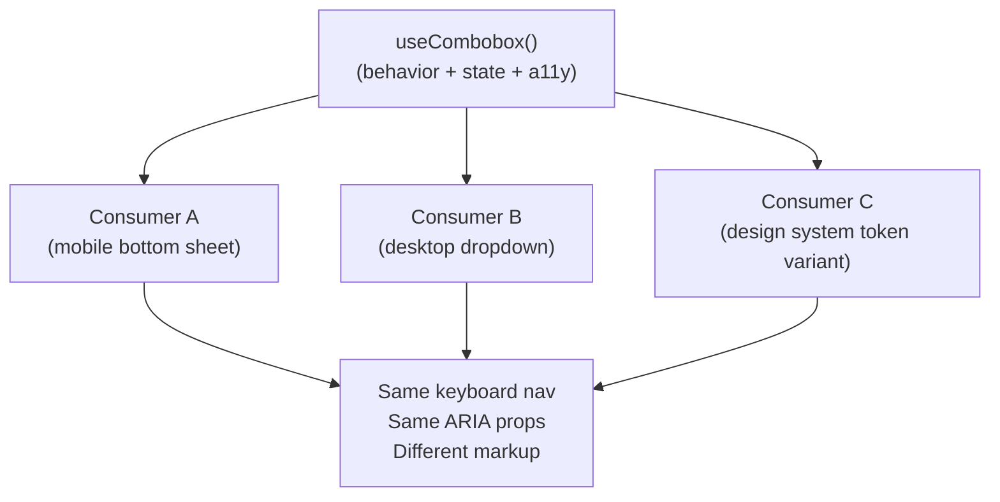

# [FEE-503] Headless 元件與無渲染模式

:::info
Headless 元件提供行為、狀態與 accessibility 配線，但不產生任何視覺輸出。消費者擁有每一個像素。這種分離使相同的互動邏輯可以在截然不同的視覺情境中重用，而無需複製任何一行邏輯。
:::

## 背景

UI 元件混合了兩個本質上不同的關注點：元件的_行為_與_外觀_。下拉選單必須攔截焦點、管理 ARIA 屬性、回應鍵盤事件、處理開關狀態——這些都與觸發器是按鈕、chip 還是文字輸入框無關，也與列表是浮動在上方還是錨定到底部抽屜無關。當這兩個關注點存在於同一個檔案中，每個需要視覺上不同變體的團隊要麼 fork 元件（複製所有邏輯，並在 accessibility 上不可避免地出現分歧），要麼堆疊大量 props，直到元件變得難以維護。

Headless 模式透過沿著這道接縫拆分元件來解決這個問題。Headless 層持有所有行為：事件處理器、狀態轉換、鍵盤導航、ARIA 屬性與焦點管理。渲染層只持有標記和樣式。兩者透過定義良好的介面連接——hook 返回的 props bag，或 renderless 元件中的 scoped slot。無論哪種方式，消費者都完全控制 DOM。

這不是全新的概念。Kent C. Dodds 在 2018 年推廣的 render props 模式、Ryan Florence 在 Reach UI 中使用的 compound components，以及 Adam Wathan 為 Vue 描述的 `v-slot` scoped-slot 模式，都針對同一個抽象。改變的是 React hooks 和 Vue Composition API 使基於 hook 的形式遠比 render props 更符合人體工學，而那種形式——從函式返回 props bag——現在是主流慣用法。Renderless 元件形式（只渲染 `<slot>` 的元件）仍然是 Vue 原生的替代方案，適合偏好元件心智模型而非函式呼叫的團隊。

## 原則

Headless 元件 MUST NOT 嵌入 `className`、內聯樣式、DOM 元素選擇或與佈局相關的標記。這樣做會破壞抽象契約：一旦 headless 層假設它將渲染 `<ul>`，任何需要基於 `<div>` 的滾動容器的消費者都必須對抗這個假設。Headless 層的唯一輸出介面是行為和狀態。

團隊 MUST 將所有 ARIA 屬性的生產保留在 headless 層內。從契約中省略 ARIA 會迫使每個消費者獨立重新實作鍵盤導航和螢幕閱讀器語義，重新引入 headless 層本應集中處理的錯誤。Hook 返回的每個 prop factory SHOULD 預先配線正確的 ARIA role、`aria-*` 屬性和事件處理器。

當相同的互動邏輯需要服務三個或更多視覺情境，或在建立消費者控制所有樣式的元件庫時，團隊 SHOULD 採用 headless 模式。在單一應用程式中只有一種視覺形式的元件不需要 headless 層——抽象成本是真實的，而收益為零。

團隊 MUST NOT 過度抽象。在整個產品中外觀始終一致的 `<Button>` 不是 headless 候選者。過早的 headless 提取會製造沒有回報的間接層。

## 設計思考

評估 headless 模式時，核心問題是視覺變化是否是首要關注點。如果同一個團隊的兩個工程師各自獨立建立相同的 combobox——一個用於行動裝置的底部抽屜，一個用於桌面的即時搜尋——headless 模式是顯而易見的工具：提取一次邏輯，讓兩個工程師各自渲染自己的標記。如果相同的元件在一個情境中外觀始終相同，結構良好的普通元件更簡單且更可取。

第二個維度是函式庫 vs. 產品。當你在為外部消費者或多個產品團隊建立元件庫時，你對視覺需求幾乎沒有控制權。外部消費者總是有與你的預設值衝突的設計系統。從一開始就建立 headless 消除了衝突：你提供行為，他們提供像素。當建立一個只有一個團隊使用的內部 CRUD 管理面板時，樣式表面是受控的，headless 只會增加複雜性而沒有回報。

第三個維度是是否需要隔離測試。返回 props bag 的 hook 是一個普通函式——它可以在不掛載任何 DOM 的情況下進行單元測試。Renderless 元件至少需要一個存根消費者來驗證行為。這使 hook 形式稍微更容易測試，儘管兩者都遠比混合了行為和渲染的完整元件更容易測試。

**決策表：**

| 情境 | 使用 headless | 使用普通元件 |
|---|---|---|
| 相同行為，3+ 種視覺變體 | 是 | 否 |
| 單一應用，一種一致的視覺風格 | 否 | 是 |
| 為外部消費者建立設計系統 | 是 | 否 |
| 單一產品中的內部 CRUD 表格 | 否 | 是 |
| 邏輯複雜到需要隔離單元測試 | 是 | 考量 |
| 簡單的無狀態展示 UI | 否 | 是 |

兩種現代慣用法以不同方式解決同一個問題：

- **基於 hook（prop factories）** — 函式返回 props bag。消費者將 props 展開到自己的元素上。這是 React 和 Vue composable 的慣用法。扁平、函式式、可搖樹優化，且易於與其他 hook 組合。
- **Renderless 元件（僅 slot）** — 元件除了 `<slot>`（或 Vue 中的 `<slot v-bind="...">`）之外不渲染任何東西。消費者透過 slot 內容提供整個模板。這是 Vue 原生的慣用法，對於以元件而非函式來思考的團隊，它自然映射到元件心智模型。

## 最佳實踐

**返回 prop factories，而非直接返回 props。** Prop factory 是消費者按元素呼叫的函式（`getItemProps`、`inputProps`），這讓 hook 可以注入自己的事件處理器和 ARIA 屬性，同時消費者可以增補自己的屬性。如果 hook 返回靜態物件，消費者必須手動合併處理器，衝突就會出現。Prop factories 讓合併變得明確且安全。

**在 hook 內部配線 ARIA，而非在消費者中。** 消費者的工作是標記和樣式。ARIA roles、`aria-expanded`、`aria-haspopup`、`aria-controls`、`aria-activedescendant` 和鍵盤處理器是行為——它們屬於 headless 層。每個消費者預設繼承正確的語義，而不是靠約定。

**為 props bag 加上型別。** Hook 的返回型別是 headless API 契約。嚴格的 TypeScript 型別在編譯時捕獲誤用，並作為活文件。Prop factories 應該有型別化的參數，這樣消費者就不能意外地將錯誤的 item 型別傳遞給 `getItemProps`。

**保持 hook 組合扁平。** 一個 combobox hook 可以由較小的 `useDisclosure` hook（開關）和 `useListNavigation` hook（鍵盤導航）組合而成。在 hook 層面組合，而不是在單一龐大的函式內部。這讓每個 hook 可以隔離測試，並讓消費者在只需要部分行為時直接使用子 hook。

**在 prop factories 旁邊暴露原始狀態。** 消費者經常需要讀取 `isOpen` 或 `activeIndex` 來有條件地渲染轉場動畫、徽章或 combobox DOM 之外的工具提示。將這些作為普通值與 prop factories 一起暴露。

**在 Vue 中，偏好 composables 而非 renderless 元件。** Vue 文件和社群共識推薦在新工作中使用 composable 函式而非 renderless 元件：composables 效能更好（無額外元件實例）、更易於單元測試，且與 Options API 或 Composition API 組合清晰。將 renderless 元件形式保留給消費者團隊以元件樹思考且對函式呼叫不熟悉的情況。

**不要從 hook 返回 JSX。** 一旦 hook 發出標記，它就不再是 headless 的——它成為了一個帶有固定樣式假設的渲染輔助函式。返回狀態和事件處理器函式。由消費者組裝標記。

## 圖解



Hook 位於中心。每個消費者是一個薄薄的渲染層——不同的標記、不同的 class names、不同的 DOM 結構——但三者都共享完全相同的鍵盤行為和 ARIA 語義。`useCombobox` 中的錯誤修復或 ARIA 改進會自動傳播到所有三個消費者。

## 範例

以下範例展示了返回 prop factories 的 `useCombobox` hook，以及兩個使用相同 hook 渲染視覺上不同 combobox 的消費者。

**Headless hook — `src/hooks/useCombobox.ts`：**

```tsx
// src/hooks/useCombobox.ts
import { useState } from 'react';

interface ComboboxItem {
  id: string;
  label: string;
}

interface UseComboboxOptions<T extends ComboboxItem> {
  items: T[];
  onSelect: (item: T) => void;
}

export function useCombobox<T extends ComboboxItem>({
  items,
  onSelect,
}: UseComboboxOptions<T>) {
  const [isOpen, setIsOpen] = useState(false);
  const [query, setQuery] = useState('');

  const filtered = items.filter((i) =>
    i.label.toLowerCase().includes(query.toLowerCase())
  );

  return {
    // <input> 元素的 prop factory
    inputProps: {
      value: query,
      onChange: (e: React.ChangeEvent<HTMLInputElement>) =>
        setQuery(e.target.value),
      onFocus: () => setIsOpen(true),
      onBlur: () => setTimeout(() => setIsOpen(false), 150),
      role: 'combobox' as const,
      'aria-haspopup': 'listbox' as const,
      'aria-expanded': isOpen,
      'aria-autocomplete': 'list' as const,
    },
    // 列表容器 <ul>/<ol> 的 prop factory
    listProps: {
      role: 'listbox' as const,
      hidden: !isOpen,
    },
    // 過濾後的項目——消費者決定如何渲染每一個
    items: filtered,
    // 原始狀態——消費者用於條件渲染
    isOpen,
    // 每個項目的 prop factory
    getItemProps: (item: T) => ({
      role: 'option' as const,
      // Note: React strips `key` from spread props — consumers must apply key separately:
      // <li key={item.id} {...getItemProps(item)}>
      onClick: () => {
        onSelect(item);
        setQuery(item.label);
        setIsOpen(false);
      },
    }),
  };
}
```

Hook 從不導入 CSS 檔案、引用 class name，或決定要渲染哪個 HTML 元素。每個 ARIA 屬性和事件處理器都在 hook 內部。返回的形狀就是公開 API。

**消費者 A — 桌面下拉選單（`src/components/DesktopCombobox.tsx`）：**

```tsx
// 消費者擁有所有渲染——hook 擁有所有行為
import { useCombobox } from '../hooks/useCombobox';

export function DesktopCombobox({ items, onSelect }) {
  const {
    inputProps,
    listProps,
    items: filtered,
    getItemProps,
  } = useCombobox({ items, onSelect });

  return (
    <div className="relative">
      <input
        {...inputProps}
        className="border rounded px-3 py-2 w-full focus:outline-none focus:ring-2 focus:ring-blue-500"
        placeholder="Search..."
      />
      <ul
        {...listProps}
        className="absolute z-10 bg-white border rounded shadow-lg mt-1 w-full max-h-60 overflow-auto"
      >
        {filtered.map((item) => (
          <li
            key={item.id}
            {...getItemProps(item)}
            className="px-3 py-2 hover:bg-gray-100 cursor-pointer text-sm"
          >
            {item.label}
          </li>
        ))}
      </ul>
    </div>
  );
}
```

**消費者 B — 行動裝置底部抽屜（`src/components/MobileCombobox.tsx`）：**

```tsx
// 完全不同的標記，完全相同的行為
import { useCombobox } from '../hooks/useCombobox';

export function MobileCombobox({ items, onSelect, title }) {
  const {
    inputProps,
    listProps,
    items: filtered,
    isOpen,
    getItemProps,
  } = useCombobox({ items, onSelect });

  return (
    <div>
      <input
        {...inputProps}
        className="w-full text-lg border-b border-gray-300 py-3 px-4 focus:outline-none"
        placeholder={`Search ${title}...`}
      />
      {/* 底部抽屜——在行動裝置上從底部彈出 */}
      {isOpen && (
        <div className="fixed inset-x-0 bottom-0 bg-white rounded-t-2xl shadow-2xl max-h-[60vh] overflow-hidden">
          <div className="px-4 py-2 text-xs font-semibold text-gray-400 uppercase tracking-wide">
            {title}
          </div>
          <ul {...listProps} className="overflow-auto">
            {filtered.map((item) => (
              <li
                key={item.id}
                {...getItemProps(item)}
                className="flex items-center px-4 py-4 border-b border-gray-100 text-base active:bg-gray-50"
              >
                {item.label}
              </li>
            ))}
          </ul>
        </div>
      )}
    </div>
  );
}
```

消費者 A 渲染錨定在輸入框下方的標準浮動下拉選單。消費者 B 渲染覆蓋視窗高度 60% 的底部抽屜。兩者都展開相同的 `inputProps`、`listProps` 和 `getItemProps`——因此兩者都獲得完全相同的鍵盤行為、`role="combobox"`、`aria-expanded` 和 `aria-haspopup`，且沒有任何重複。

**Vue composable 等效實作（`src/composables/useCombobox.ts`）：**

```ts
// Vue composable 慣用法——相同契約，Vue Composition API
import { ref, computed } from 'vue';

interface ComboboxItem {
  id: string;
  label: string;
}

export function useCombobox<T extends ComboboxItem>(
  items: T[],
  onSelect: (item: T) => void,
) {
  const query = ref('');
  const isOpen = ref(false);

  const filtered = computed(() =>
    items.filter((i) =>
      i.label.toLowerCase().includes(query.value.toLowerCase())
    )
  );

  function open() { isOpen.value = true; }
  function close() { setTimeout(() => { isOpen.value = false; }, 150); }
  function select(item: T) {
    onSelect(item);
    query.value = item.label;
    isOpen.value = false;
  }

  return {
    query,
    isOpen,
    filtered,
    inputProps: computed(() => ({
      value: query.value,
      onInput: (e: Event) => { query.value = (e.target as HTMLInputElement).value; },
      onFocus: open,
      onBlur: close,
      role: 'combobox',
      'aria-haspopup': 'listbox',
      'aria-expanded': isOpen.value,
      'aria-autocomplete': 'list',
    })),
    listProps: { role: 'listbox' },
    getItemProps: (item: T) => ({
      role: 'option',
      onClick: () => select(item),
    }),
  };
}
```

Vue 消費者在 `setup()` 中呼叫 `useCombobox()`，並將返回的 props 展開到自己的模板元素上。Composable 從不觸碰 `<template>`。

**Vue renderless 元件形式（基於 slot 的替代方案）：**

```vue
<!-- RenderlessCombobox.vue — 只渲染一個 slot，透過 slot props 傳遞狀態 -->
<script setup lang="ts">
import { ref, computed } from 'vue';

const props = defineProps<{ items: { id: string; label: string }[] }>();
const emit = defineEmits<{ select: [item: { id: string; label: string }] }>();

const query = ref('');
const isOpen = ref(false);
const filtered = computed(() =>
  props.items.filter((i) =>
    i.label.toLowerCase().includes(query.value.toLowerCase())
  )
);
</script>

<template>
  <!-- 不渲染自身任何內容；透過 slot 傳遞所有狀態和處理器 -->
  <slot
    :query="query"
    :isOpen="isOpen"
    :filtered="filtered"
    :inputProps="{
      value: query,
      onInput: (e) => { query.value = (e.target as HTMLInputElement).value; },
      onFocus: () => { isOpen.value = true; },
      onBlur: () => setTimeout(() => { isOpen.value = false; }, 150),
      role: 'combobox',
      'aria-haspopup': 'listbox',
      'aria-expanded': isOpen,
      'aria-autocomplete': 'list',
    }"
    :getItemProps="(item) => ({
      role: 'option',
      onClick: () => { emit('select', item); query.value = item.label; isOpen.value = false; },
    })"
  />
</template>
```

Renderless 元件不渲染自身的任何標記。消費者透過預設的 scoped slot 提供所有標記，接收狀態和 prop factories 作為 slot props。兩種方式——composable 和 renderless 元件——解決相同的問題。Vue 文件建議在大多數新工作中使用 composables。

## 常見錯誤

**從 hook 返回 JSX 或 `className`。** 一旦 hook 發出標記，它就成為一個渲染輔助函式（破壞了抽象——hook 變成緊密耦合的渲染輔助函式）。任何想要不同視覺效果的團隊都必須修改 hook，這使抽象失去意義。Hook 返回狀態、處理器和 ARIA 屬性——從不返回元素。

**過度 headless 化。** 在整個產品中外觀始終相同的按鈕不需要 headless 層。在單一應用程式中只有一種設計的 modal 不需要 headless 層。這個模式的存在是為了處理真實的變化，而非假設性的未來變化。先建立具體的元件；只有在第二個視覺上不同的情境實際存在時才提取 headless。

**省略 ARIA prop factories。** 如果 hook 只返回 `isOpen` 和 `toggle` 而沒有 ARIA 屬性，每個消費者都必須獨立研究 WAI-ARIA combobox 模式、實作 `aria-expanded`、`aria-haspopup`、`aria-controls`、`aria-activedescendant` 和鍵盤處理器。錯誤會在消費者之間出現分歧。ARIA 配線正是 headless 層應該集中處理的行為。

**忘記處理事件處理器合併。** 如果消費者需要在輸入框上附加自己的 `onFocus` 處理器，展開 `inputProps` 會覆蓋 hook 的 `onFocus`。Prop factories 應該接受合併參數，或者 hook 的文件應該解釋合併策略。Downshift 等函式庫用 `callAll` 工具函式鏈式連接多個處理器來解決這個問題。

## 相關 FEE

- [FEE-501：元件組合模式](./501.md)
- [FEE-507：元件 API 設計——Props、Slots 與多型介面](./507.md)
- [FEE-902：無樣式元件函式庫](../Design%20Systems%20and%20UI%20Libraries/902.md)

## 參考資料

- [Martin Fowler: Headless Component — a pattern for composing React UIs](https://martinfowler.com/articles/headless-component.html)
- [Adam Wathan: Renderless Components in Vue.js](https://adamwathan.me/renderless-components-in-vuejs/)
- [Downshift: useCombobox](https://www.downshift-js.com/use-combobox/)
- [React Aria: useComboBox](https://react-spectrum.adobe.com/react-aria/useComboBox.html)
- [Kent C. Dodds: Inversion of Control](https://kentcdodds.com/blog/inversion-of-control)
- [Moein Mirkiani: Composables vs. Renderless Components in Vue 3](https://medium.com/@moein.mirkiani/composables-vs-renderless-components-in-vue-3-1e7386d8182)
