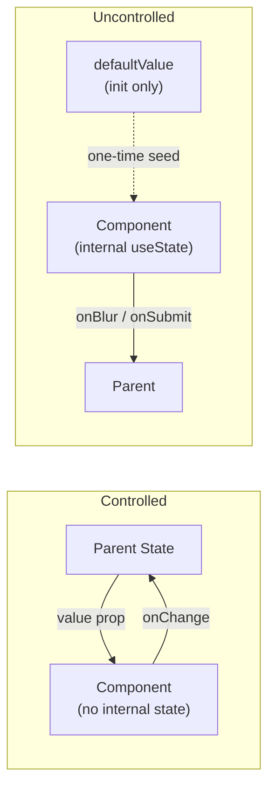

# [FEE-504] 受控與非受控元件及狀態所有權

:::info
受控元件（controlled component）從 props 完整取得顯示值，並向上觸發變更事件——父層擁有狀態的真實來源（source of truth）。非受控元件（uncontrolled component）在內部管理自身值，並以選用的 `defaultValue` 進行初始化。雙模式（dual-mode）模式橋接兩者：接受 `value` 與 `defaultValue` 的函式庫元件讓消費者自行決定控制層級，無需被迫進入任一模型。
:::

## 簡介

每個互動式 UI 元素在任何時間點都有一個值：輸入框中的文字、對話框是否開啟、哪個 tab 處於啟用狀態、滑桿的位置。誰擁有並管理這個值，並非風格偏好，而是一個結構性決策，它決定了資料如何在元件樹中流動、元件的測試難度，以及消費者整合時的靈活程度。

React 在表單元素的脈絡下將這組詞彙正式化：受控的 `<input>` 從狀態變數取得 `value`，並觸發 `onChange` 請求更新；非受控的 `<input>` 在 DOM 中維護自身的值，需要時透過 `ref` 查詢。然而此概念遠不止於原生表單元素——任何具有內部狀態的元件，如 `Select`、`Dialog`、`DatePicker`、`Toggle`、`Accordion`，都可以是受控或非受控的。相同的結構性選擇同樣適用。

隨著元件函式庫走向成熟，業界遇到的問題是：將元件鎖定在某一模式會對所有消費者強加取捨。完全受控的 `Dialog` 要求每個呼叫者都維護 `open` 與 `setOpen`，即使是最簡單的使用情境。完全非受控的 `Dialog` 無法參與需要將對話框可見性與路由、store 或伺服器事件同步的應用程式狀態。解法——由 Radix UI 明確推廣——是雙模式（dual-mode）或選用受控（optional-controlled）模式：同時接受受控 props（`open`）與非受控初始化 props（`defaultOpen`），在執行時期偵測消費者選擇的模式，並相應地運作。此模式現已成為專業元件函式庫的標準。

## 原則

受控元件 MUST 在每次渲染時完整從 props 取得顯示值，MUST NOT 在內部 state 中保存值的本地副本。每次可能改變值的使用者互動 MUST 透過事件 callback（`onChange`、`onOpenChange` 等）向上傳遞，父層單獨負責決定是否以及如何更新 props。若父層不更新 props，元件再次渲染相同的值——這是受控模式的預期行為，不是錯誤。

非受控元件 MUST 接受 `defaultValue`（或 `defaultOpen`、`defaultChecked` 等）以進行初始化，此後 MUST 在自身內部 state 中管理值。`defaultValue` MUST 僅在掛載（mount）時讀取一次，元件 MUST NOT 在後續渲染中重新讀取 `defaultValue`。在掛載後變更 `defaultValue` 無效，呼叫者 MUST NOT 依賴它來重設元件。

團隊 MUST NOT 將受控 props 與對應的 `defaultValue` props 同時傳遞給同一個元件實例。這樣做會產生不確定的行為：元件無法得知應以哪個來源作為真實依據，若受控 props 在 `undefined` 與已定義值之間轉換，React 將發出「在受控與非受控之間切換」的警告。建構函式庫元件的團隊 SHOULD 實作雙模式模式，讓消費者在需要時選擇受控行為，不需要時將狀態管理交給元件處理。

實作雙模式模式時，應以 `value !== undefined` 作為受控模式的訊號。當元件處於受控模式時，MUST NOT 在回應使用者互動時更新內部 state——props 是唯一的真實來源，每次變更 MUST 透過 callback 傳遞出去。

## 設計思考

受控與非受控的選擇，本質上是一個「誰需要在何時知道這個值」的問題。若答案是「只有使用者，在提交時」，則非受控更簡單，且產生較少的重渲染壓力——每次按鍵不需更新 state，也不需配線 callback 鏈。若答案是「父層，即時，現在」，那麼受控是唯一能保證同步性的選項。

第二個維度是重設行為。受控欄位可在任何時間重設為任意值：父層將 state 設為 `''`，下一次渲染即反映變更。非受控欄位無法透過變更 `defaultValue` 來重設——它早已完成初始化。唯一的逃生出口是改變 `key` props（導致元件卸載並重新掛載，觸發對 `defaultValue` 的新一次讀取），或透過 `ref.current.value = ''` 直接對原生輸入框進行 mutation。未理解此限制就使用 `defaultValue` 的團隊，常遭遇難以除錯的重設 bug——清除 state 後畫面毫無變化。

第三個維度是函式庫設計。為外部消費者——或同組織中的多個產品團隊——建立元件時，你無法預測每個消費者的使用情境。對只想要自我管理下拉選單的消費者強制使用受控模式是阻力；對需要將下拉狀態與 URL 參數同步的消費者強制使用非受控模式是阻礙。雙模式模式消除了這兩個問題。Radix UI 在所有 primitives 中一致地實作此模式：`Dialog`、`Popover`、`Select`、`Accordion`、`Collapsible` 等，均同時接受受控 props 與 `default*` props。`@radix-ui/react-use-controllable-state` hook 已以獨立套件的形式開放，將偵測與同步邏輯封裝在約 50 行程式碼中。

**決策表——哪種模式適合哪種情境：**

| 情境 | 受控 | 非受控 |
|---|---|---|
| 值需與外部 state/store 同步 | 是 | 否 |
| 僅需表單提交，無即時驗證 | 否 | 是 |
| 父層需要程式化重設欄位 | 是 | 否 |
| 與原生 `<form>` 提交整合 | 否 | 是（原生 `name` 屬性） |
| 需要最小重渲染開銷 | 否 | 是 |
| 多個欄位需彼此保持同步 | 是 | 否 |
| 值驅動元件樹其他位置的條件渲染 | 是 | 否 |
| 無外部相依的簡單開關 | 否 | 是 |

雙模式模式的運作方式是讓受控 props 變為選用。若 `value` 為 `undefined`（未傳入），元件處於非受控模式，使用以 `defaultValue` 為種子的內部 state。若 `value` 為任何已定義的值——包括空字串——元件處於受控模式，僅從 props 讀取。旗標 `const isControlled = value !== undefined` 在每次渲染時求值。受控時，元件跳過所有內部 state mutation，並透過 callback 向上委派變更。非受控時，更新自身內部 state，仍然觸發 callback（讓父層可以觀察而不必擁有狀態）。

**第四個維度是測試策略。** 非受控元件在單元測試中通常更易於驗證：直接渲染元件並模擬使用者互動，無需在測試外部建立 state 管理的樣板。受控元件的測試則需要一個 wrapper 元件或測試用的 state 容器，才能完整模擬 prop 更新的循環。然而受控元件的整合測試更貼近真實使用情境——外部 state 的存在讓測試可以直接驗證「父層傳入特定 value 時，元件是否正確渲染」這個命題，而不必追蹤內部 state 的變化路徑。實務上，函式庫作者為雙模式元件撰寫兩套測試：一套驗證非受控模式下的自治行為，另一套驗證受控模式下對外部 prop 變更的反應。

**受控模式製造不必要複雜度的情境。** 並非每個元件都能從被強制進入受控模式中受益。以一個多步驟精靈（wizard）為例，每個步驟包含獨立的備注文字區塊。若精靈的父層在一個集中的 state 物件中擁有所有備注欄位，任何文字區塊的每次按鍵都會觸發整個精靈元件樹的重渲染。更簡潔的架構是讓每個備注欄位保持非受控——精靈在「送出」時透過 refs 或一次性的 `onChange` 聚合收集所有值——只為真正驅動跨步驟行為的欄位（例如在審閱步驟中顯示的共用名稱欄位）提升 state。在沒有具體同步需求的情況下，「以防萬一」預設為受控模式，是一種增加重渲染開銷與配線成本的過早優化。

**實務範例：表單函式庫。** React Hook Form 預設讓欄位保持非受控模式，正是基於這個原因——它透過 refs 註冊欄位，並在驗證與送出時讀取值，完全避免了每次按鍵的重渲染。當你將第三方元件（如功能豐富的 `Select` 或日期選擇器）整合進 React Hook Form 時，函式庫的 `Controller` wrapper 提供了受控介面：它將 `value` 和 `onChange` 傳入內部元件，讓表單能觀察並驗證欄位。這正是雙模式模式在大規模生產環境中的應用——外部表單系統需要受控行為；內部元件支援它；在表單外使用該元件的消費者則可以略過配線，改用 `defaultValue`。研究 React Hook Form 的 `Controller` 實作，是觀察受控適配層與支援雙模式的底層元件之間接縫的絕佳實例。值得注意的是，`Controller` 在包裝原本非受控的輸入框時，並不會改變其內部行為，而是在外層攔截 `onChange` 並同步至表單的 store，這正說明了雙模式設計的核心優勢：底層元件不必為整合層犧牲自身的彈性。

## 最佳實踐

**將受控與非受控的區分視為公開 API 合約。** 一旦你發布了只支援受控模式的元件，切換至雙模式是一種不破壞相容性的新增變更；相反地，從原本支援受控模式的元件中移除該支援，則必然是破壞性變更。若有任何現實的可能性需要兩種使用情境，請從一開始就設計成雙模式。事後在受控唯一（controlled-only）的元件上補充非受控支援很容易；而事後在非受控唯一的元件上補充受控支援，則迫使消費者新增他們本不需要的 state 樣板程式碼。此外，Semantic Versioning 的慣例下，移除受控 prop 支援屬於 major version bump 的觸發條件，對於被多個團隊或外部專案依賴的函式庫而言，代價高昂。

**永遠不要在 `useEffect` 中「同步」受控 prop 至內部 state。** 初學者有時會這樣寫：`useEffect(() => { setInternal(valueProp); }, [valueProp])`，企圖讓受控 prop 的變更「同步」到內部 state。這是一個反模式（anti-pattern）：它引入了一個額外的渲染週期（prop 改變 → 渲染一次 → effect 執行 → 再渲染一次），且在 React 18 的並發模式（Concurrent Mode）下可能引發撕裂（tearing）問題。正確做法是在受控模式下直接從 prop 渲染，無需任何 `useEffect` 同步。

**以 `!== undefined` 而非真值（truthiness）偵測受控模式。** 空字串 `''`、`false` 和 `0` 都是有效的受控值。使用 `if (value)` 會錯誤地將它們視為缺席。請始終以 `value !== undefined` 作為模式偵測謂詞。部分實作採用 `Object.prototype.hasOwnProperty.call(props, 'value')` 以獲得更精確的判斷，但 `!== undefined` 是慣用寫法，對所有常見情境已足夠。

**永遠不要在內部 state 中遮蔽受控 props。** 最常見的雙模式 bug 是以受控 props 初始化內部 state：`const [val, setVal] = useState(value)`。這在掛載時以受控值為種子——之後若受控 props 改變，內部 state 已過時，元件會渲染錯誤的值。受控模式下，請僅從 props 讀取；非受控模式下，請僅從內部 state 讀取。

**在兩種模式下都觸發 callback。** `onChange` / `onOpenChange` callback 應在每次使用者互動時觸發，無論元件是受控還是非受控。受控模式下父層必須接收它以更新 props；非受控模式下父層可能希望在不擁有狀態的情況下觀察變更——例如，更新表單驗證摘要或觸發數據分析。非受控時壓制 callback 的元件並非真正的雙模式。

**將 `defaultValue` 記載為僅供初始化使用。** 在 JSDoc 或公開 API 文件中明確說明 `defaultValue` 僅在掛載時讀取一次。期望它作為重設觸發器的消費者將會引入 bug。清楚的說明——「掛載後變更此 props 無效」——能防止混淆。

**使用 `key` 對非受控欄位進行命令式重設。** 當父層確實需要將非受控子元件重設為新的初始狀態時，正確的機制是改變子元件的 `key` props。這會卸載並重新掛載元件，重新執行 `useState(defaultValue)` 初始化。這是 React 慣用的強制重設方式，代價恰好是一次掛載週期。

**當元件只有單一、固定的呼叫者且永遠不需要外部控制時，偏好保持 state 完全在本地。** `useControllableState` 的抽象在多個呼叫者需要不同控制策略時才值回票價。如果一個元件只在一處被使用，且產品設計使外部控制不太可能發生，那麼讓 state 完全保持在本地——不提供 `defaultProp` 的逃生出口——會更簡單、更易讀，也減少認知負擔。當出現第二個具體的使用情境時再加入雙模式支援，而非預先為一個可能永遠不會到來的需求做準備。

**偏好使用 `useControllableState`（或你自己的等效實作）而非逐個偵測。** 在函式庫的每個元件中重寫受控/非受控偵測邏輯會導致不一致性。請將 `useControllableState` hook 提取一次，徹底測試，並到處使用。Radix UI 已開放他們的實作；許多團隊以此作為起點複製。hook 的簽名通常為 `useControllableState({ prop, defaultProp, onChange })`，並以自動模式偵測回傳 `[value, setValue]`。

**在開發環境中，當同時提供 `value` 和 `defaultValue` 時給予警告。** 在元件頂端加入基於 `useEffect` 的開發環境警告。React 自身對原生輸入框執行此操作，函式庫元件應相應匹配。

**原生 `<form>` 整合屬於非受控模式的範疇。** 當非受控輸入框帶有 `name` 屬性時，瀏覽器在提交時會自動將其值包含在 `FormData` 中。在 DOM 之外管理 state 的受控輸入框不參與原生表單提交，除非你額外加入 `<input type="hidden" name="..." value={...} />`。請在你的元件 API 中明確說明哪種模式支援原生表單提交。

**在單次渲染中保持 `isControlled` 旗標的穩定性。** 由於 `isControlled` 在每次渲染時由 `prop !== undefined` 推導而來，若受控 prop 是有條件地向下轉發且條件在 session 中途改變，會存在微妙的風險。實務上，應將模式穩定性視為消費者的責任——在文件中說明 `value` 不得從已定義值轉換為 `undefined`——並以上述開發環境警告加以強化。從函式庫的角度來看，防範生命週期中途模式切換的唯一穩健手段是透過 `key` 重新掛載，而非在元件內部加入防禦性分支。

**對於複合元件（compound component），在 Context 中傳遞受控狀態。** 如 `Accordion` 這類由多個子元件組成的複合結構，父層的 `open`／`defaultOpen` 狀態需要傳遞至子層的 `AccordionItem` 與 `AccordionPanel`。正確的做法是將 `[isOpen, setIsOpen]` 放入 React Context，而非透過 props 逐層傳遞（prop drilling）。Context 本身不改變受控／非受控的判斷邏輯——仍然由最外層的 `Accordion` 元件執行 `useControllableState`，子元件只是消費已解析後的 state 與 setter，並不直接接觸原始的受控 prop。這使得消費者的使用方式保持一致，無論元件樹的深度如何。

## 圖解



受控模式（左）中，資料循環是封閉的：父層 state 作為 props 向下流動，使用者互動透過 `onChange` 向上觸發，父層決定是否更新 state。元件本身從不儲存值。非受控模式（右）中，元件自身構成循環：內部 `useState` 持有值，`defaultValue` 在掛載時為其提供種子（虛線箭頭——僅一次），父層只在提交邊界時接收事件。

## 範例

以下 `Toggle` 元件實作了兩種模式。當提供 `open` props（非 `undefined`）時，元件以受控模式運作；當 `open` 未傳入時，元件以 `defaultOpen` 為初始值管理自身狀態。

```tsx
// src/components/Toggle.tsx
import { useState } from 'react';

interface ToggleProps {
  /** 受控模式：呼叫者擁有 open state */
  open?: boolean;
  /** 非受控模式：僅供初始化使用——掛載後忽略 */
  defaultOpen?: boolean;
  onOpenChange?: (open: boolean) => void;
  children: (isOpen: boolean, toggle: () => void) => React.ReactNode;
}

export function Toggle({
  open,
  defaultOpen = false,
  onOpenChange,
  children,
}: ToggleProps) {
  const isControlled = open !== undefined;
  const [internalOpen, setInternalOpen] = useState(defaultOpen);

  // 受控模式讀取 props；非受控模式讀取內部 state
  const isOpen = isControlled ? open! : internalOpen;

  function handleToggle() {
    const next = !isOpen;
    if (!isControlled) {
      // 僅非受控時更新內部 state
      setInternalOpen(next);
    }
    // 始終觸發 callback——父層可在非受控模式下觀察
    onOpenChange?.(next);
  }

  return <>{children(isOpen, handleToggle)}</>;
}
```

關鍵不變式在 `isOpen` 那一行：受控模式下，`open!`（props）是唯一的真實來源，`internalOpen` state 已初始化但從未被讀取；非受控模式下，`internalOpen` 驅動渲染。`handleToggle` 始終觸發 `onOpenChange`，但僅在非受控時 mutate `internalOpen`，確保 callback 在兩種模式下均可使用。

**用法——非受控（元件管理自身 state）：**

```tsx
// 無 `open` props——Toggle 為非受控；state 存在於元件內部
<Toggle defaultOpen={false}>
  {(isOpen, toggle) => (
    <button onClick={toggle}>{isOpen ? 'Close' : 'Open'}</button>
  )}
</Toggle>
```

這是零樣板的形式。父層透過 `defaultOpen` 提供初始狀態後即可不再理會。若父層也需要知道狀態何時改變，可附加 `onOpenChange` 而無需取得所有權：

```tsx
<Toggle defaultOpen={false} onOpenChange={(next) => analytics.track('toggle', { next })}>
  {(isOpen, toggle) => (
    <button onClick={toggle}>{isOpen ? 'Close' : 'Open'}</button>
  )}
</Toggle>
```

**用法——受控（父層管理 state）：**

```tsx
function Parent() {
  const [open, setOpen] = useState(false);

  return (
    <>
      {/* 外部控制——Toggle 外部的按鈕驅動相同的 state */}
      <button onClick={() => setOpen(true)}>從外部開啟</button>

      <Toggle open={open} onOpenChange={setOpen}>
        {(isOpen, toggle) => (
          <button onClick={toggle}>{isOpen ? 'Close' : 'Open'}</button>
        )}
      </Toggle>

      {/* 由相同 state 驅動的條件渲染 */}
      {open && <aside>開啟時顯示的面板內容</aside>}
    </>
  );
}
```

受控模式下，`open` 與 `setOpen` 被明確傳入。現在 state 是共用的：外部的「從外部開啟」按鈕可以驅動相同的 toggle，`<aside>` 也會同步渲染。父層擁有完全的控制權——可以攔截 `onOpenChange` 並在更新 state 前加入驗證，或完全阻止某些狀態轉換。

**`useControllableState` 提取模式：**

對於擁有多個雙模式元件的元件函式庫，將偵測邏輯提取成共用 hook 十分值得：

```tsx
// src/hooks/useControllableState.ts
import { useState, useCallback, useRef } from 'react';

interface UseControllableStateOptions<T> {
  /** 受控值——若提供，hook 處於受控模式 */
  prop?: T;
  /** 非受控模式的預設值——僅在掛載時讀取一次 */
  defaultProp?: T;
  /** 無論模式為何，每次 state 變更時觸發 */
  onChange?: (value: T) => void;
}

export function useControllableState<T>({
  prop,
  defaultProp,
  onChange,
}: UseControllableStateOptions<T>): [T | undefined, (value: T) => void] {
  const [internalValue, setInternalValue] = useState<T | undefined>(defaultProp);
  const isControlled = prop !== undefined;
  const value = isControlled ? prop : internalValue;

  // 穩定的 ref，讓消費者可安全地在依賴陣列中包含 setValue
  const onChangeRef = useRef(onChange);
  onChangeRef.current = onChange;

  const setValue = useCallback(
    (next: T) => {
      if (!isControlled) {
        setInternalValue(next);
      }
      onChangeRef.current?.(next);
    },
    [isControlled],
  );

  return [value, setValue];
}
```

有了這個 hook，`Toggle` 的實作變得更簡潔：

```tsx
// src/components/Toggle.tsx（使用 useControllableState）
import { useControllableState } from '../hooks/useControllableState';

export function Toggle({ open, defaultOpen = false, onOpenChange, children }: ToggleProps) {
  const [isOpen, setIsOpen] = useControllableState({
    prop: open,
    defaultProp: defaultOpen,
    onChange: onOpenChange,
  });

  function handleToggle() {
    setIsOpen(!isOpen);
  }

  return <>{children(isOpen ?? false, handleToggle)}</>;
}
```

雙模式邏輯現在集中在一處，只需測試一次，再組合進任何需要它的元件。`Select`、`Accordion`、`DatePicker` 等元件，全部重用相同的 hook，只是使用不同的 props 名稱。與原始實作相比，元件本體完全看不到 `isControlled` 旗標或 `internalOpen` state——所有模式偵測與 state 管理均已隱藏在 hook 內部，呼叫端只需關心業務邏輯。

## 常見錯誤

**函式庫元件未實作雙模式，強迫消費者使用受控模式。** 需要在每次使用時都提供 `value` 和 `onChange` 的 `Select` 元件，對每個呼叫者都是負擔。「為這個下拉選單選一種語言」這樣簡單的使用情境，變成三行的儀式：宣告 state、傳入 `value`、傳入 `setLanguage` 作為 `onChange`。函式庫元件一次性承擔這份複雜度；雙模式模式則適當地分配了這份成本。

**透過清除 `defaultValue` 來重設非受控欄位。** 這是最常見的初學者錯誤之一。`defaultValue` 僅在掛載時由 `useState` 讀取一次，在後續渲染中變更它對顯示值沒有任何效果。正確的重設方式：(a) 改變元件的 `key` props 強制重新掛載，或 (b) 對原生輸入框使用 `ref` 進行命令式設定 `ref.current.value = ''`。

**在受控模式下將 `onOpenChange` 視為選用。** 受控模式下若缺少 `onOpenChange`，使用者互動會將 callback 觸發到虛空中，父層永遠不會更新 props，元件看起來被凍結了。請始終記載受控模式需要 callback，並考慮加入開發環境警告：若 `isControlled && !onOpenChange`，則在開發環境中以 `console.warn` 提示，讓開發者在測試階段即能發現設定錯誤，而非在生產環境中遭遇靜默失效（silent failure）。

**在生命週期中途透過傳入 `undefined` 在受控與非受控之間切換。** React 不支援在模式之間切換。一旦受控（`value` 已定義），props 在元件的整個生命週期內必須保持已定義。若確需「釋放控制權」，正確方式是重新掛載元件——改變其 `key`。傳入 `value={condition ? someValue : undefined}` 會在每次模式切換時觸發警告，並造成不可預測的行為。

**假設 `defaultValue` 在掛載後的變更會傳播（在使用第三方元件時尤其常見）。** 消費者程式碼常從非同步資料請求產生 `defaultValue`，並假設資料到達後欄位會反映新值。若請求在元件掛載後才完成，欄位早已以 `undefined`（或其他空預設值）初始化，之後到達的 `defaultValue` 不會有任何效果。正確做法是延遲渲染元件，直到初始值可用為止——例如，基於載入旗標進行條件渲染——或切換為受控模式，讓值能在任何時間點被更新。

**在事件處理器中讀取過時的 `isOpen` 閉包值。** 在雙模式實作中，若 `handleToggle` 透過閉包捕獲了 `isOpen`，而 React 批次更新導致多次快速點擊時 `isOpen` 的值已過時，會產生「切換兩次卻只更新一次」的 bug。使用函式式更新（functional update）形式的 `setState(prev => !prev)` 可避免此問題。若使用 `useControllableState`，hook 內部的 `useCallback` 已透過 `onChangeRef` 穩定化 callback 參考，但計算 `next` 值的邏輯仍應依賴最新的 state 而非閉包中的快照。在非受控模式下，將 `setIsOpen(prev => !prev)` 作為慣用寫法，比 `setIsOpen(!isOpen)` 更能防範此類競態情形。

**TypeScript 型別未正確反映受控與非受控的差異。** 若元件的 props 型別定義為 `value?: string; onChange?: (v: string) => void`，TypeScript 無法阻止消費者傳入 `value` 卻不提供 `onChange`，也無法阻止傳入 `value` 與 `defaultValue` 的組合。進階的型別設計可使用條件型別（conditional types）或函數重載（overloads）來建立互斥的 props 群組：一個接受 `value + onChange`（受控），另一個接受 `defaultValue?`（非受控），兩者不相交。雖然這會增加型別定義的複雜度，但對大型函式庫而言，在編譯期即捕捉常見的誤用，遠優於依賴執行期警告。Radix UI 的部分 primitives 已採用此策略，搭配 TypeScript 的 `XOR` 工具型別實作互斥 props。

**在 Storybook 或文件中只展示受控使用範例。** 若元件支援雙模式，但文件中只有需要 `value` 和 `onChange` 的受控範例，讀者會誤以為受控是唯一的使用方式，並在所有地方都複製樣板程式碼。文件 SHOULD 同時提供兩種模式的範例：非受控的「零配置」範例展示最小使用方式，受控的範例則展示與外部 state 同步的情境。清楚的文件是雙模式設計價值得以完整實現的最後一哩路。

## 相關 FEE

- [FEE-502：響應式狀態與 Signals](./502.md)
- [FEE-601：本地元件狀態](../State%20Management/601.md)
- [FEE-603：Context 與 Prop Drilling](../State%20Management/603.md)

## 參考資料

- [React docs: Sharing State Between Components](https://react.dev/learn/sharing-state-between-components)
- [React docs: Preserving and Resetting State](https://react.dev/learn/preserving-and-resetting-state)
- [React docs: `<input>` — Controlled vs. uncontrolled inputs](https://react.dev/reference/react-dom/components/input)
- [Radix UI: State Management — controlled and uncontrolled patterns](https://www.radix-ui.com/primitives/docs/guides/controlled-state)
- [Kent C. Dodds: Don't Sync State. Derive It.](https://kentcdodds.com/blog/dont-sync-state-derive-it)
- [React docs: You Might Not Need an Effect](https://react.dev/learn/you-might-not-need-an-effect) — 官方說明在受控模式下直接從 prop 渲染的正確模式
- [React Hook Form: Controller API](https://react-hook-form.com/docs/usecontroller/controller)
- [TkDodo: Avoiding useEffect for Data Transformation](https://tkdodo.eu/blog/things-to-know-about-zustand)
