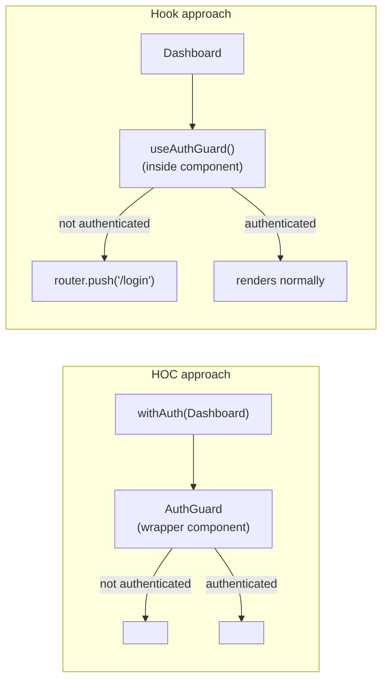

# [FEE-505] 高階元件與橫切邏輯

:::info
Higher-Order Component（HOC）是一個接受元件並回傳新元件的函式，新元件帶有額外注入的行為。在 hooks 時代，custom hook 能涵蓋大多數橫切關注點。對於非渲染類的關注點（分析事件、權限檢查、資料抓取），團隊 SHOULD 優先採用 custom hook。當關注點需要包裹渲染輸出時——例如身分驗證重新導向、注入版面元素、portal 渲染——團隊 MUST 使用 HOC。任何包裹 DOM 元素的 HOC MUST 使用 `React.forwardRef` 以保留 ref 轉發。
:::

## 介紹

隨著 React 應用規模擴大，某些行為會在不相關的元件之間反覆出現：渲染頁面前的身分驗證檢查、使用者查看某個區塊時的分析事件觸發、主題注入、權限閘道、錯誤邊界、功能旗標切換。這些關注點橫向地切穿整棵元件樹，並不遵循任何父子關係。挑戰在於如何只實作一次就能一致地套用，同時不複製邏輯、不將不相關的關注點糾纏進個別元件，也不讓元件樹對每天倚賴的除錯工具變得不透明。

Higher-Order Component 是 React 16.8 之前用來解決這個問題的慣用方案。這個模式本身早於 React——它是函數式程式設計中高階函式概念的直接應用，適配到元件模型上。HOC 是一個接受元件作為引數並回傳新元件的函式。回傳的元件包裹原始元件，在包裹元件渲染前後加入行為，或完全阻止其渲染。Redux（`connect`）、React Router（`withRouter`）和 MobX（`observer`）等函式庫都用這個模式將 store 訂閱、路由 context 和響應式追蹤注入應用元件，而使用者不必撰寫任何串接程式碼。

React 16.8 引入 hooks 後，計算方式有了顯著改變。Custom hook 能在任意數量的 function component 之間提取並共享有狀態邏輯，而不改變元件樹。對於不涉及 DOM 結構的橫切關注點——讀取認證狀態、觸發分析事件、訂閱 store——custom hook 幾乎總是比 HOC 更簡單：需要的樣板程式碼更少、不在樹中產生額外的包裹元素，並且在擁有它的元件中以單一具名呼叫出現，而不是以 React DevTools 中的匿名包裹層呈現。然而，hook 並非萬能。hook 無法包裹其宿主元件的渲染輸出——它不能插入一個 `<Navigate>` 來取代元件、注入一個周圍的 `<Portal>`，也不能攔截 children。對於任何真正需要控制或修改渲染結果的關注點，HOC 仍是正確的工具。

理解何時使用哪種模式——並認識到兩者並不互斥——是本文所要培養的實務技能。真實的程式碼庫通常同時包含兩者：一個在路由層守護整條路由的 `withAuth` HOC，以及一個在個別元件內記錄使用者互動的 `useAnalytics` hook。目標是讓工具符合結構需求，而不是在虛假的論戰中選邊站。

另外值得理解一個常見的混淆點：HOC 和 hook 並不是在同一抽象層次上的替代方案。HOC 工廠函式本身在其回傳的元件內部呼叫 hook。上方的 `withAuth` 呼叫 `useAuth` 並有條件地回傳 `<Navigate>`。HOC 是控制渲染輸出的邊界；hook 是它用來存取橫切狀態的機制。這種組合——hook 驅動邏輯，HOC 塑造渲染邊界——是在 hooks 時代撰寫 HOC 的正確思維模型。一個完全不呼叫 hook 的 HOC，很可能是透過 props drilling、context 讀取或舊式生命週期方法來實作其橫切關注點，而這些方式都不如 hook 符合人體工學。

## 原則

Higher-Order Component 對其元件引數 MUST 是純函式：給定相同的 `WrappedComponent`，每次呼叫都 MUST 回傳帶有相同增強行為的元件。它 MUST NOT 修改 `WrappedComponent` 的原型或 `defaultProps`——這樣做會在同一個基底元件被傳入多個 HOC 或同時與其包裹形式直接使用時，引發不可預期的行為。

任何渲染 DOM 元素或轉發 ref 的 HOC MUST 使用 `React.forwardRef` 來保持 ref 轉發的透明性。未能轉發 `ref` 會悄悄破壞任何持有該元件 ref 的父元件——父元件的 `ref.current` 指向 HOC 包裹層的內部實例（或對 function component 而言保持 `null`），而非父元件所預期的底層 DOM 節點或元件實例。這個失敗是靜默的且微妙的：不拋出錯誤，不發出警告，只有在父元件嘗試呼叫 ref 上的方法或讀取屬性時，行為才會中斷。

對於橫切的非渲染關注點——分析、認證狀態讀取、權限檢查、資料預抓取、store 訂閱——團隊 SHOULD 優先採用 custom hook。Hook 不需要包裹元素，在 React DevTools 中不產生匿名條目，且組合時不帶 HOC 堆疊所引入的 props 穿透代價。當橫切關注點需要包裹或替換渲染輸出時——需要完全阻止元件渲染的身分驗證重新導向、必須出現在相對包裹元件特定 DOM 位置的版面注入、portal 渲染，或對 class component 的相容性——團隊 MUST 使用 HOC。

HOC 堆疊（`withAuth(withAnalytics(withTheme(Component)))`）是一種組合反模式。每一層都在 React 樹中增加一個包裹元素，讓 DevTools 的雜訊成倍增加，並建立一個 props 穿透通道，在第 N 層注入的 props 必須穿越第 N-1 層一直傳遞到第 0 層。團隊 MUST NOT 在單一元件上堆疊超過兩個 HOC。當需要套用超過兩個橫切關注點時，團隊 SHOULD 提取一個在內部組合各關注點的單一多關注點包裹器，或將這些關注點重構為元件直接呼叫的 hook。

每個 HOC MUST 在回傳的元件上設定 `displayName`。沒有 `displayName`，React DevTools 會將包裹層顯示為 `Anonymous` 或 `ForwardRef`，在除錯時無法識別哪個 HOC 在樹中。慣例是 `withHocName(WrappedComponentName)`，當包裹元件沒有名稱時回退到 `'Component'`。

## 設計思考

核心的架構決策——HOC 還是 hook——清楚地對應到一個問題：橫切關注點需要影響 DOM 中顯示的內容，還是只影響元件邏輯內部發生的事？如果答案是前者，HOC 是正確的抽象層次。如果答案是後者，hook 更簡單、更可組合、更透明。

考慮身分驗證守護。一個程式碼庫通常有兩種結構上不同的認證需求。第一種：阻止未認證使用者看到受保護的頁面——甚至不讓頁面骨架在重新導向觸發前閃現。這是渲染層面的關注點。元件根本不應該渲染；一個重新導向元素應出現在它的位置。HOC 是天然的選擇：它在渲染層進行攔截，並在包裹元件執行之前回傳 `<Navigate>`。第二種：在一個已經渲染的元件內部，在觸發動作之前檢查使用者是否擁有特定權限。這是邏輯層面的關注點。不需要任何包裹；一個回傳 `isAuthorized` 布林值的 hook 可以直接整合進元件的事件處理器，而不觸碰 DOM 結構。

分析是另一個能說明問題的案例。如果需要在特定元件掛載時觸發一個 `view` 事件，custom hook 裡的 `useEffect` 只需三行程式碼，不需要任何包裹。如果需要確保對整個子樹的每一次互動——包括動態渲染 children 上的點擊——都被追蹤，一個包裹子樹並附加委派事件監聽器的 HOC 可能更合適。關注點在 DOM 中的範圍決定了正確的抽象方式。

第三個維度是 class component 相容性。Hook 在 class component 中不可用。一個仍有 class component 的程式碼庫——無論是尚未遷移的舊有程式碼，還是你無法控制的第三方元件——都需要 HOC 來注入橫切行為。如果你的團隊完全使用 function component，這個維度就消失了。

**決策表：**

| 情境 | HOC | Custom Hook |
|---|---|---|
| 必須在 DOM 中注入包裹元素 | 是 | 否 |
| 橫切渲染邏輯（portals、邊界） | 是 | 否 |
| 橫切非渲染邏輯（分析、權限檢查） | 皆可 | 優先選 hook |
| 僅 function component，hooks 可用 | 優先選 hook | 是 |
| 必須攔截或轉換 children | 是 | 否 |
| 需要 class component 相容性 | 是 | 否（hooks 不能在 class component 中使用） |

這個表格突顯了「皆可」那一行確實存在真正的重疊。對於 function component 中的非渲染關注點，兩種工具都可以運作。決勝點是可組合性和 DevTools 可讀性：hook 以名稱出現在元件自身的程式碼中、可以輕鬆作為函式測試，且不在 React 元素樹中增加任何東西。HOC 則增加一個包裹層。在其他條件相同的情況下，hook 是成本更低的選項。

在評估一個提案中的 HOC 時，一個有用的思考練習是：想像改以 hook 實作這個關注點。如果 hook 的實作需要使用它的每個元件自行複製關注點的任何渲染邏輯——一個重新導向 JSX 元素、一個錯誤邊界的 fallback、一個 portal 掛載點——HOC 勝出，因為 HOC 將那段渲染邏輯集中在一個地方。如果 hook 的實作是自給自足的，且不需要元件新增任何渲染邏輯，hook 勝出。

最後，HOC 非常適合框架整合點——在那裡元件包裹是慣用的 API 形式。React Router 的 `<Route>` 元素使用 render props，但許多路由層級的關注點（權限、分析、捲動恢復）以 HOC 形式包裹路由元件，比逐路由設定更乾淨。類似地，測試函式庫通常提供 HOC 風格的包裹器，用於在單元測試中注入測試 provider（`withStoreProvider`、`withThemeProvider`）。在這些情境中，HOC 不是你在做的設計選擇——它是框架或工具所預期的 API 形狀。

## 最佳實踐

**無條件設定 `displayName`。** 每個 HOC 工廠函式在回傳之前 MUST 在回傳的元件上設定 `displayName`。慣例是 `` `withHocName(${WrappedComponent.displayName ?? WrappedComponent.name ?? 'Component'})` ``。省略這個設定會在 React DevTools 中產生 `Anonymous` 或 `ForwardRef` 條目，當套用多個 HOC 時彼此無從區分。可讀的 DevTools 樹能直接縮短診斷元件層級 bug 的時間，尤其是在元件樹很深的情況下。

**使用 `React.forwardRef` 轉發 `ref`。** 任何渲染包裹元件的 HOC MUST 將回傳的元件包裹在 `React.forwardRef` 中。透過 `ref` props 將 ref 傳遞給包裹元件。這維持了透明性契約：從父元件的角度來看，持有 `withAuth(Dashboard)` 的 ref 應與持有 `Dashboard` 的 ref 完全相同。若未轉發，`ref.current` 對 function component 會是 `null`，對 class component 則會解析到 HOC 包裹層實例——兩者都不是父元件所預期的。

關於 React 19 的注意事項：在 React 19 中，function component 可以將 `ref` 作為普通 props 接受，無需 `React.forwardRef`。然而，需要同時支援 React 18 和 React 19 環境、或包裹 class component 的 HOC 包裹層，仍然受益於明確的 `React.forwardRef` 模式以確保相容性和清晰度。

**避免 props 名稱衝突。** HOC 向包裹元件注入 props。如果注入的 props 名稱（例如 `user`、`theme`、`data`）與使用者試圖傳遞的 props 名稱衝突，其中一個會在沒有任何警告的情況下被另一個覆蓋。當 HOC 作者和元件使用者是不同的人時，這在大型程式碼庫中尤其隱蔽。最安全的緩解措施是為 HOC 注入的 props 使用非通用名稱（`auth`、`injectedUser` 等），或透過 TypeScript 明確記錄注入的 props 名稱並強制無重疊：使用 `Omit<P, 'user'>` 作為外部 props 類型，使消費者無法意外傳遞會衝突的 props。

**不要修改包裹元件。** 直接修改 `WrappedComponent.prototype` 或在 `WrappedComponent` 上附加屬性是很誘人的做法。這會在該元件的所有使用之間產生共享的可變狀態，包括不涉及 HOC 的使用。始終在 HOC 工廠中建立一個新元件並回傳它。永遠不要修改原件。

**複製靜態方法。** 當 HOC 包裹一個元件時，回傳的包裹器不會攜帶原始元件的靜態方法。如果 `Dashboard` 有一個靜態的 `Dashboard.requiresAuth` 旗標或 `Dashboard.getLayout` 函式，那些靜態成員在 `withAuth(Dashboard)` 上將不存在，除非明確複製。使用 `hoist-non-react-statics` 函式庫，或手動複製你需要的方法：`AuthGuard.getLayout = WrappedComponent.getLayout`。

**將 HOC 工廠與其實作的關注點放在一起。** `withAuth` HOC 應放在 `src/hoc/withAuth.tsx` 或靠近 auth 模組的地方——而不是散落在各功能資料夾中。HOC 工廠是基礎設施。把它們像工具函式一樣對待：集中管理、版本化，並從單一位置匯出。

**獨立測試 HOC。** HOC 工廠是一個函式。可以透過傳入一個 mock 元件並斷言在不同 props 和 context 條件下回傳的元件渲染什麼來測試它。不要只依賴同時測試 HOC 和包裹元件的整合測試。獨立隔離 HOC 邏輯使認證重新導向行為、載入狀態渲染和 props 轉發可以獨立驗證。

**為 HOC 工廠使用一致的命名慣例。** `with` 前綴是普遍認可的慣例：`withAuth`、`withTheme`、`withAnalytics`、`withFeatureFlag`。未以 `with` 為前綴的 HOC 會讓讀者感到困惑，因為他們預期 `with*` 表示 HOC 工廠，`use*` 表示 hook。在程式碼庫中混用慣例——`protectedComponent`、`analyticsDecorated`、`themed`——會迫使讀者檢查每個未知函式的簽名，以確定它是 HOC、工具函式還是 hook。在 ESLint 規則或程式碼審查指南中強制執行 `with` 前綴，並在整個程式碼庫中保持一致。

## 圖解



HOC 方式在 React 元素樹層級運作——包裹元件是樹中的一個節點，關於渲染什麼的決策在該節點內做出，在包裹元件實例化之前。Hook 方式在元件自身的渲染函式內部運作——元件已在樹中，hook 在渲染後觸發命令式的導航 effect。HOC 可以阻止元件渲染；hook 無法阻止其宿主元件渲染，只能阻止顯示有意義的 UI 或在渲染後觸發導航。

## 範例

### `withAuth` HOC——完整實作

以下 HOC 為任何元件包裹身分驗證守護。如果使用者未通過認證，HOC 會渲染重新導向而非包裹元件。使用 `React.forwardRef` 使 HOC 的消費者持有的 ref 能正確解析到包裹元件。

```tsx
// src/hoc/withAuth.tsx
import React from 'react';
import { Navigate } from 'react-router-dom';
import { useAuth } from '../hooks/useAuth';

export function withAuth<P extends object>(
  WrappedComponent: React.ComponentType<P>,
  redirectTo = '/login'
) {
  const AuthGuard = React.forwardRef<unknown, P>((props, ref) => {
    const { isAuthenticated, isLoading } = useAuth();

    if (isLoading) return <div aria-busy="true" aria-label="Checking auth..." />;
    if (!isAuthenticated) return <Navigate to={redirectTo} replace />;

    // TypeScript：因為 forwardRef 的泛型是 unknown，需要型別轉換
    const Component = WrappedComponent as React.ComponentType<P & { ref?: unknown }>;
    return <Component {...props} ref={ref} />;
  });

  // 在 React DevTools 中保留元件名稱
  AuthGuard.displayName = `withAuth(${
    WrappedComponent.displayName ?? WrappedComponent.name ?? 'Component'
  })`;

  return AuthGuard;
}

// 使用方式
const ProtectedDashboard = withAuth(Dashboard);
const ProtectedSettings = withAuth(Settings, '/auth/login');
```

逐一檢視關鍵決策：

- **`React.forwardRef`**：HOC 回傳一個 `forwardRef` 包裹的元件。任何持有 `ProtectedDashboard` ref 的父元件，其 ref 都會透明地轉發到 `Dashboard`。沒有這個，ref 會是 `null` 或指向包裹層。
- **由 HOC 渲染的載入狀態**：`isLoading` 守護在 HOC 內部而非包裹元件。這意味著 `Dashboard` 從不需要處理「認證載入中」的情況——如果它渲染，它總是收到完全解析的認證狀態。
- **`Navigate` 回傳**：HOC 可以回傳一個完全不同的元素樹（`<Navigate>`）來取代包裹元件。這在 `Dashboard` 內部的 hook 中在結構上是不可能做到的——元件已經在渲染了。
- **`displayName`**：明確設定。在 React DevTools 中，元件樹將顯示 `withAuth(Dashboard)` 而非 `ForwardRef` 或 `Anonymous`。
- **TypeScript 型別轉換**：`ref` 的 `forwardRef` 泛型型別是 `unknown`，因為實際的 ref 類型取決於 `P`。更嚴格的型別需要一個額外的 ref 類型泛型參數。型別轉換是孤立的，不影響執行時行為。

### `useAuthGuard` hook——非渲染情境的等效實作

當認證關注點是「如果未認證就以命令式重新導向使用者，但不阻止元件渲染載入狀態」，hook 更簡單且不產生包裹元素。

```tsx
// src/hooks/useAuthGuard.ts — 非渲染情境的 hook 等效實作
import { useEffect } from 'react';
import { useNavigate } from 'react-router-dom';
import { useAuth } from './useAuth';

export function useAuthGuard(redirectTo = '/login') {
  const { isAuthenticated, isLoading } = useAuth();
  const navigate = useNavigate();

  useEffect(() => {
    if (!isLoading && !isAuthenticated) {
      navigate(redirectTo, { replace: true });
    }
  }, [isAuthenticated, isLoading, navigate, redirectTo]);

  return { isLoading };
}

// 使用方式——不需要包裹元素，不需要 forwardRef
function Dashboard() {
  const { isLoading } = useAuthGuard();
  if (isLoading) return <Spinner />;
  return <DashboardContent />;
}
```

結構上的差異立刻顯而易見：`Dashboard` 在 React DevTools 中以單一節點呈現。沒有添加任何包裹層。hook 在渲染後觸發導航 effect，而非阻止渲染。當元件無論如何都要渲染一個載入 spinner 時，這是合適的——多餘的渲染週期是無害的。當元件的渲染在認證檢查解析之前有可見的副作用，或當元件的渲染本身代價高昂且不應該對未認證使用者執行時，這就不合適了。

### HOC 堆疊反模式與合併替代方案

```tsx
// 反模式：三個 HOC 層產生三個包裹元素和三個 displayName
// 條目在 DevTools 中，而且在第 N 層新增的任何 props 都必須穿越第 N-1 到 0 層
const ProtectedDashboard = withAuth(
  withAnalytics(
    withTheme(Dashboard)
  )
);

// 優先替代方案 A：單一多關注點 HOC
function withPageConcerns<P extends object>(WrappedComponent: React.ComponentType<P>) {
  const PageWrapper = React.forwardRef<unknown, P>((props, ref) => {
    const { isAuthenticated, isLoading } = useAuth();
    const navigate = useNavigate();
    const theme = useTheme();

    useAnalytics({ componentName: WrappedComponent.displayName ?? WrappedComponent.name });

    useEffect(() => {
      if (!isLoading && !isAuthenticated) navigate('/login', { replace: true });
    }, [isAuthenticated, isLoading, navigate]);

    if (isLoading) return <PageSkeleton />;

    const Component = WrappedComponent as React.ComponentType<P & { ref?: unknown }>;
    return (
      <ThemeContext.Provider value={theme}>
        <Component {...props} ref={ref} />
      </ThemeContext.Provider>
    );
  });

  PageWrapper.displayName = `withPageConcerns(${
    WrappedComponent.displayName ?? WrappedComponent.name ?? 'Component'
  })`;

  return PageWrapper;
}

// 優先替代方案 B：在元件內部將關注點組合為 hook
function Dashboard() {
  const { isLoading } = useAuthGuard();
  useAnalytics({ componentName: 'Dashboard' });
  const theme = useTheme();

  if (isLoading) return <PageSkeleton />;
  return <DashboardContent theme={theme} />;
}
```

替代方案 B 通常是最清晰的：元件的原始碼是它所套用的關注點的可讀清單，沒有包裹巢狀、沒有 DevTools 雜訊、也沒有 props 穿透。替代方案 A 適合當關注點確實必須包裹渲染輸出（本例中的主題 context 注入必須圍繞元件，這是渲染層面的需求），且在避免堆疊的同時進行合併仍然是值得的時候。

## 常見錯誤

**未轉發 `ref`。** 這是最常見的 HOC 錯誤，也是失敗模式最不透明的一個。當 HOC 在沒有 `React.forwardRef` 的情況下包裹一個 function component 時，父元件的 `ref.current` 是 `null`。當它包裹一個 class component 而沒有轉發時，`ref.current` 指向 HOC 的內部 class 實例，而非包裹的 class 實例。不拋出錯誤。程式碼看起來能運作，直到父元件試圖呼叫 ref 上的方法或讀取 DOM 屬性——此時發生執行時錯誤或靜默的錯誤值讀取。修復方案始終是在 HOC 工廠中使用 `React.forwardRef`。如果使用 TypeScript，將 `ref` props 傳遞給不接受它的元件所產生的型別錯誤會在編譯時暴露問題。

**Props 名稱衝突。** 向包裹元件注入 `user` props 的 HOC，會在沒有警告的情況下靜默地覆蓋消費者試圖傳遞的任何 `user` props。在 HOC 作者和元件消費者是不同的人的大型程式碼庫中，這尤其隱蔽。最安全的緩解措施是對 HOC 注入的 props 使用非通用名稱（`auth`、`injectedUser` 等），或使用 TypeScript 明確記錄注入的 props 名稱並強制無重疊：將 `Omit<P, 'user'>` 作為外部 props 類型，使消費者無法意外傳遞會衝突的 props。

**堆疊 3 個以上的 HOC。** `withAuth(withAnalytics(withTheme(Component)))` 製造了除錯噩夢：React DevTools 顯示三個巢狀的匿名或具名包裹層，而任何需要到達 `Component` 的 props 都必須明確穿越可能甚至不知道它存在的中間層。症狀通常是開發者確信自己在傳遞的 props 卻從未到達元件，因為某個中間 HOC 沒有轉發 `...props`。修復方案是合併：一個多關注點 HOC 或在元件主體內組合 hook。

**在渲染函式或元件內部建立 HOC。** 在元件的渲染函式內部呼叫 HOC 工廠，會在每個渲染週期建立一個新的元件類型。React 將每個新類型視為完全不同的元件，在每次父元件渲染時卸載並重新掛載包裹元件。這完全破壞了記憶化，並摧毀了包裹元件內的本地 state。HOC 工廠 MUST 在模組作用域中呼叫，在任何元件或 hook 之外。

```tsx
// 錯誤——每次渲染都建立新的元件類型
function Page() {
  const ProtectedDashboard = withAuth(Dashboard); // 每次渲染都是新類型！
  return <ProtectedDashboard />;
}

// 正確——在模組作用域呼叫一次
const ProtectedDashboard = withAuth(Dashboard);
function Page() {
  return <ProtectedDashboard />;
}
```

**忘記複製靜態方法。** 當 `Dashboard` 有一個靜態屬性——`Dashboard.getLayout`、`Dashboard.fetchData`、`Dashboard.config`——這些屬性在 `withAuth(Dashboard)` 上是不存在的。一個使用 `getLayout` 的 Next.js 頁面元件，在被 HOC 包裹時會悄悄地失去其版面。檢查包裹元件匯出了哪些靜態屬性，並明確複製它們，或使用 `hoist-non-react-statics` 自動複製所有非 React 靜態屬性。

**從包裹 function component 的 HOC 中回傳 class component。** 一些較舊的 HOC 實作在內部使用基於 class 的包裹器，即使包裹的元件是 function component 也是如此。這種混合方式阻止了包裹元件在 HOC 主體內使用 hooks（因為 hooks 不能在 class 的 `render` 方法中執行）。現代 HOC MUST 使用 function component（通常透過 `React.forwardRef`）作為其內部包裹器，以保持與 HOC 邏輯內部所呼叫 hook 的相容性——例如上方範例中的 `useAuth`、`useNavigate` 和 `useEffect`。

**忽略深層包裹對 React 協調的效能影響。** 每個 HOC 包裹層在協調樹中都是一個真實的 React 元素。在典型規模下，每個路由層級元件有兩三個包裹層並不構成可測量的問題。但在一個渲染數百行的大型資料密集表格中，每行都被 HOC 包裹以進行逐行權限檢查，會在每次更新時產生數百個額外的協調節點。在效能敏感的渲染路徑中，優先選擇 hook 形式——它不在元素樹中增加任何節點，且沒有協調開銷。

## 相關 FEE

- [FEE-501：元件組合模式](./501.md) — HOC 是組合的一種包裹形式
- [FEE-503：Headless 元件與無渲染模式](./503.md) — 共同動機：將橫切邏輯排除在元件主體之外
- [FEE-702：虛擬 DOM、協調與差異比較](../Rendering%20and%20Performance/702.md) — 每個 HOC 包裹層都在 React 元素樹中新增一個 React 元素

## 參考資料

- [React Docs — Higher-Order Components（舊版）](https://legacy.reactjs.org/docs/higher-order-components.html) — 原始的官方文件；涵蓋動機、慣例和注意事項，包括靜態方法提升和 ref 轉發
- [React Docs — Reusing Logic with Custom Hooks](https://react.dev/learn/reusing-logic-with-custom-hooks) — 針對非渲染橫切關注點的 HOC 現代替代方案；說明何時提取 custom hook 以及如何測試它
- [patterns.dev — HOC Pattern](https://www.patterns.dev/react/hoc-pattern) — HOC 結構、組合的實用演練，以及何時改用 hook
- [Kent C. Dodds — AHA Programming](https://kentcdodds.com/blog/aha-programming) — 「避免倉促的抽象」；說明為何過早的 HOC 提取（如同任何過早的抽象）製造的問題比它解決的更多
- [hoist-non-react-statics](https://github.com/mridgway/hoist-non-react-statics) — 用於將靜態方法從包裹元件複製到 HOC 包裹器的工具，防止 `getLayout` 等靜態成員悄悄丟失
- [React `forwardRef` API 參考](https://react.dev/reference/react/forwardRef) — `React.forwardRef` 的完整 API 和行為文件，包括 React 19 對 function component ref 處理的變更
