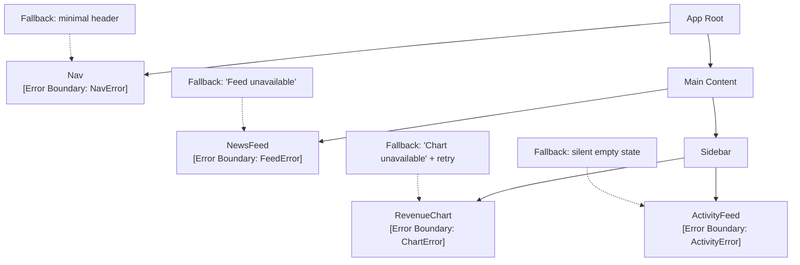

# [FEE-506] Error Boundary 與韌性模式

:::info
Error Boundary 會捕捉子元件樹在渲染、生命週期方法及建構子中拋出的 JavaScript 錯誤，並改為渲染降級 UI，而非讓整個應用程式崩潰。團隊 MUST 以功能子樹的粒度配置 Boundary — 單一根層級的 Boundary 並非韌性策略。團隊 MUST 在 `componentDidCatch` 中將捕捉到的錯誤回報至可觀測性服務。Error Boundary 不會捕捉：事件處理器錯誤、非同步程式碼（`setTimeout`、Promise、`fetch`）、SSR 錯誤，或在 Boundary 本身內部拋出的錯誤。
:::

## 簡介

每個部署至生產環境的 React 應用程式都會遇到執行期錯誤：格式錯誤的 API 回應導致元件對 `undefined` 解引用、第三方函式庫在初始化時意外拋出錯誤、競爭條件在資料到達渲染器之前就損毀了本地狀態。在 React 16 引入 Error Boundary 之前，元件樹任何地方的渲染錯誤都會向上傳播，直到到達根節點，導致整個應用程式卸載，只留給使用者一片空白畫面。使用者體驗是災難性的，運維體驗同樣糟糕 — 除非使用者主動回報，否則錯誤是隱形的，因為在到達瀏覽器的未捕捉錯誤處理器之前，應用程式沒有任何機會攔截它。

Error Boundary 是 React 用來解決這個失敗模式的基本元件。這個概念借鑑自分散式系統和作業系統設計中的隔離模式：某個子系統的故障不應讓整個系統崩潰。在 React 中，Error Boundary 是一個實作了 `getDerivedStateFromError` 或 `componentDidCatch`（或兩者皆有）的 class 元件。當渲染期間或生命週期方法中，其子元件樹中任何地方拋出錯誤時，Boundary 會捕捉它、轉換至錯誤狀態，並改為渲染降級 UI。應用程式其餘部分繼續正常運行。一個崩潰的營收圖表不會拖垮導覽列、新聞動態，或使用者正在填寫的表單。

Error Boundary 帶來的設計挑戰，不在於如何撰寫它 — API 很小，實作也機械化 — 而在於如何刻意地擺放它們。單一放在應用程式根層級的 Error Boundary，給你的隔離效果和 Error Boundary 問世之前的世界完全相同：任何元件崩潰，使用者就只能看到根層級的降級畫面。設計良好的 Error Boundary 策略，反映了應用程式本身的功能分解。每個獨立有價值的 UI 片段 — 圖表、動態、側欄小工具、導覽元件 — 都應該用自己的 Boundary 包裹，並搭配對該特定片段有意義的 `fallback`。目標是：即使有 10% 的功能失敗，使用者仍能繼續使用 90% 的應用程式。

了解 React 生態系圍繞 Error Boundary 的演進是有價值的。React 18 在 Error Boundary 和 `Suspense`（用於宣告式表達非同步載入狀態的機制）之間引入了更深層的整合。結合 React Query 的 Suspense 模式或 React 19 的 `use()` hook，`Suspense` Boundary 和 Error Boundary 協同工作，成為非同步資料獲取的標準模型：`Suspense` 在資料傳輸中顯示載入狀態，而 Error Boundary 在請求失敗時捕捉拋出的錯誤。`react-error-boundary` 函式庫（v4+）提供了一個生產就緒的 `ErrorBoundary` 元件，消除了手動撰寫 class 元件的需要，新增了 `resetErrorBoundary` 支援，並與 React Query 和其他支援 `Suspense` 的資料函式庫無縫整合。同時理解原始 class 元件 API 與這些函式庫抽象，對生產工作都是必要的 — 函式庫建立在基本元件之上，而了解基本元件能揭示函式庫在做什麼以及為什麼這樣做。

## 原則

Error Boundary MUST 實作 `getDerivedStateFromError`，以便在子元件拋出錯誤時將元件轉換至錯誤狀態。它 SHOULD 同時實作 `componentDidCatch`，以便將錯誤回報至可觀測性服務 — 一個渲染降級 UI 卻不回報錯誤的 Boundary，在運維上是盲目的：錯誤會變得隱形，直到使用者聯絡客服才能察覺。團隊 MUST NOT 靜默地吞掉錯誤；`componentDidCatch` MUST 在每次捕捉到錯誤時呼叫已設定的可觀測性端點（Sentry、Datadog、New Relic 或內部服務），並包含 `info.componentStack` 參數，該參數提供從根節點到拋出錯誤元件的確切渲染路徑。

團隊 MUST 以功能子樹的粒度擺放 Error Boundary。單一根層級的 Boundary 並非韌性策略 — 它只是比完全沒有 Boundary 稍微好一點：任何單一小工具的失敗都會讓整個應用程式的 UI 被降級畫面取代。正確的心智模型是，每個獨立有功能的 UI 片段代表一個韌性單元。每個韌性單元 MUST 有自己的 Boundary。非關鍵小工具（圖表、推薦內容、廣告、活動動態）SHOULD 使用具備重試功能降級畫面或靜默空白狀態的 Boundary。關鍵路徑元件（導覽、版面、身份驗證閘道）SHOULD 使用高層樹的 Boundary，搭配精簡的降級畫面，讓使用者有足夠的脈絡了解發生了什麼以及下一步該怎麼做。

Error Boundary 不會捕捉在事件處理器（`onClick`、`onChange`、`onSubmit`）、非同步程式碼（`setTimeout`、`setInterval`、`requestAnimationFrame`）、渲染路徑之外的 Promise 鏈或 `async/await`、伺服器端渲染，以及在 Error Boundary 元件本身內部拋出的錯誤。團隊 MUST 明確處理這些失敗模式：事件處理器錯誤需要在處理器內部使用 `try/catch`；Promise 錯誤需要使用 `.catch()` 或 `async` 函式內的 `try/catch` 搭配本地錯誤狀態。混淆這兩種失敗模式 — 期望事件處理器錯誤被 Boundary 捕捉 — 是 React 程式碼庫中最常見的韌性設計錯誤之一。

## 設計思考

Error Boundary 策略中的根本設計決策是粒度：每個受保護的子樹應該多小？答案取決於兩個軸向 — 元件的關鍵性和元件與其兄弟節點的獨立性。如果一個元件的缺失讓應用程式實際上無法使用，它就是關鍵的：導覽列、全域版面外殼、身份驗證閘道。如果一個元件的失敗與其相鄰元件沒有語義關係，它就是獨立的：營收圖表獨立於新聞動態，新聞動態獨立於活動側欄。高關鍵性和高獨立性並不相關 — 導覽列既關鍵又獨立；多步驟表單精靈是關鍵但內部緊密耦合的；推薦輪播是非關鍵且獨立的。

對於高關鍵性元件，Boundary 擺放策略優先考慮精簡降級畫面，而非隔離粒度。如果導覽列拋出錯誤，應用程式沒有它就無法運作 — 適當的降級畫面是一個精簡的靜態標頭，讓使用者能夠離開或重新載入，而不是一個可能在同一個 session 中再次失敗的重試按鈕。盡可能靠近導覽元件本身擺放 Boundary，在版面樹中高於其他所有內容，這樣導覽失敗就不會拖垮主要內容區域。降級畫面的設計目標不是恢復 — 而是優雅地降級至可用狀態。

對於非關鍵、獨立的小工具，Boundary 策略反轉：Boundary 盡可能緊密地圍繞小工具，降級畫面設計為支援恢復。一個渲染失敗的圖表應該顯示帶有「重試」按鈕的降級畫面，而不是其他任何東西 — 儀表板的其餘部分繼續運作，使用者可以獨立重新載入圖表，如果重試成功，圖表會乾淨地重新掛載，而不影響頁面上的其他任何內容。錯誤被回報至可觀測性服務，若錯誤率超過閾值就會觸發警示，待命工程師有元件堆疊和錯誤訊息可以使用。這一切都不需要使用者重新載入頁面。

第三個設計維度是 Error Boundary 與 `Suspense` 之間的關係。在使用 `use()`、React Query 搭配 `throwOnError: true`，或 SWR 搭配 `suspense` 模式的 React 18+ 應用程式中，拋出的 Promise 是 `Suspense` 顯示其 `fallback` 的信號，而拋出的 Error（或被拒絕的 Promise）是最近的 Error Boundary 啟動的信號。標準模式是將兩種 Boundary 包裹在同一個子樹周圍：

```tsx
<ErrorBoundary fallback={<FeedError />} onError={reportError}>
  <Suspense fallback={<FeedSkeleton />}>
    <NewsFeed />
  </Suspense>
</ErrorBoundary>
```

`ErrorBoundary` 包裹 `Suspense`，因為遇到錯誤的 `Suspense` `fallback` 應被 Boundary 捕捉，而不是向上傳播。有了這個巢狀順序，`NewsFeed` 可以自由使用 `use(feedPromise)` 或支援 `Suspense` 的資料 hook，外層處理載入狀態（透過 `Suspense`）和錯誤狀態（透過 `ErrorBoundary`），而 `NewsFeed` 本身不需要任何條件渲染邏輯。

**情境決策表：**

| 情境 | 模式 |
|---|---|
| 任何子樹中的渲染崩潰 | Error Boundary |
| 非同步資料獲取失敗 | Suspense + Error Boundary |
| 關鍵路徑（標頭、導覽、版面） | 高層樹 Boundary，精簡降級畫面 |
| 非關鍵小工具（圖表、廣告、推薦） | 每個小工具的 Boundary，靜默/重試降級畫面 |
| 暫時性網路錯誤 | 重試按鈕 + 降級畫面中的指數退避 |
| 事件處理器錯誤 | 在處理器內使用 `try/catch` — Boundary 不適用 |
| SSR 渲染錯誤 | 伺服器端 `try/catch`，非 Error Boundary |
| Boundary 本身內部的錯誤 | 傳播至最近的外層 Boundary |

## 最佳實踐

**以功能子樹的粒度擺放 Boundary，而非根層級。** 每個獨立有價值的 UI 片段 MUST 有自己的 Boundary。如果你的應用程式有五個小工具的儀表板，每個小工具 MUST 有自己的 Boundary。將你的功能分解圖對應至 Boundary 擺放 — 如果一個功能值得一張 Jira 票，它就值得一個 Boundary。根層級 Boundary 是基礎設施程式碼（路由器、Provider、全域版面外殼）中真正意外失敗的安全網，而不是功能層級隔離的替代品。

**始終在 `componentDidCatch` 中回報至可觀測性服務。** 渲染降級 UI 卻不呼叫可觀測性服務的 Boundary，製造了虛假的韌性感：應用程式看起來能優雅地處理錯誤，但工程團隊對經過該 Boundary 的每個失敗都一無所知。將 `info.componentStack` 與錯誤一起傳給可觀測性服務 — 元件堆疊讓工程師無需在本地重現錯誤就能識別是哪個元件拋出的。永遠不要在生產環境用 `console.error` 替代適當的可觀測性呼叫。

**使用 `getDerivedStateFromError` 驅動錯誤 UI，`componentDidCatch` 負責回報。** 這兩個生命週期方法有不同的職責。`getDerivedStateFromError` 是一個靜態方法，從捕捉到的錯誤衍生新的狀態 — 它決定是否顯示降級畫面以及儲存哪些錯誤資訊。`componentDidCatch` 是用於回報的副作用 hook。混淆兩者（在 `getDerivedStateFromError` 中放可觀測性呼叫，或從 `componentDidCatch` 驅動錯誤狀態）會導致微妙的時序 bug。`getDerivedStateFromError` 在渲染階段執行，必須是純函式；`componentDidCatch` 在提交階段執行，是放置副作用的正確地方。

**為非關鍵元件設計支援恢復的降級畫面。** 只顯示錯誤訊息、沒有恢復路徑的降級畫面，會迫使使用者重新載入整個頁面。對於非關鍵小工具，提供一個呼叫 `resetErrorBoundary` 或 Boundary 的 `reset` 方法的「重試」按鈕。對於暫時性網路錯誤，在降級畫面的重試邏輯中實作指數退避：從 1 秒延遲開始，每次重試加倍，上限為 30 秒。將每次重試嘗試記錄至可觀測性服務，讓你能夠測量重試成功率，並識別錯誤是暫時性的還是持久性的。

**讓降級畫面的大小與它替換的元件相稱。** 失敗的圖表小工具應顯示佔據與圖表相同空間的降級畫面，而不是全頁錯誤橫幅。相稱的降級畫面能防止讓使用者困惑的版面偏移，並表明失敗是被控制的。在降級畫面容器上使用 `role="alert"`，以便螢幕閱讀器能宣告錯誤狀態。不要使用錯誤圖示或令人警覺的語言 — 帶有重試按鈕的中性「圖表無法使用」比「發生了嚴重錯誤！」更專業。

**在新專案中使用 `react-error-boundary`，而非手動撰寫 class 元件。** `react-error-boundary` v4+ 函式庫提供了一個帶有 `resetErrorBoundary`、`onError`、`fallbackRender` 和 `FallbackComponent` props 的 `ErrorBoundary` 函式元件包裝器。它與 React Query 的 `throwOnError` 選項整合，並處理常見模式 — 重試、prop 變更時重置錯誤狀態、透過 `useErrorBoundary` 命令式 `reset` — 而不需要 class 元件樣板程式碼。只有在需要函式庫未提供的行為，或需要為了偵錯目的理解基本元件時，才撰寫 class 元件 Boundary。

**當根本原因可能已解決時重置 Boundary 狀態。** 永久保持在錯誤狀態的 Error Boundary — 即使使用者導覽至不同路由再返回後 — 會製造令人困惑的體驗。使用 `resetKeys` prop（在 `react-error-boundary` 中）或在自訂 Boundary 中實作 `componentDidUpdate` 檢查，以便在關鍵 props 變更時重置錯誤狀態，例如 URL 路由變更時或父元件以不同的 `key` prop 重新掛載 Boundary 時。`key` prop 技術是最簡單的重置機制：變更 `ErrorBoundary` 的 `key` 會讓 React 卸載並重新掛載它，自動清除錯誤狀態。

**不要將 Boundary 放在頻繁重新渲染的元件內部。** 放在每次按鍵都重新渲染的元件內的 `ErrorBoundary`，會在每次渲染時卸載並重新掛載 Boundary，破壞任何累積的錯誤狀態和重試進度。Boundary 屬於不頻繁重新渲染的穩定元件邊界 — 版面外殼、路由元件、功能容器 — 而不是動態列表項目或受控輸入元件的內部。

## Mermaid 圖



圖中每個節點同時代表被渲染的元件和保護它的 Boundary。注意 `Nav` 的 Boundary 在樹中高於 `Main` — 導覽失敗不影響主要內容區域。`NewsFeed`、`RevenueChart` 和 `ActivityFeed` 的 Boundary 在各自層級是兄弟節點，意味著一個失敗不會觸發其他的。降級畫面被刻意區分：`Nav` 獲得靜態精簡標頭（無重試 — 損壞的導覽通常不是暫時性錯誤），`Feed` 獲得一條訊息，`Chart` 獲得明確的重試按鈕（圖表資料通常是暫時性 API 問題），`ActivityFeed` 獲得靜默空白狀態（活動資料最不關鍵，空白狀態是可接受的）。

## 範例

### 可重用的 `ErrorBoundary` class 元件

以下實作支援靜態降級畫面節點或渲染函式降級畫面（接收錯誤和重置回呼）、用於可觀測性回報的 `onError` 回呼，以及用於程式式恢復的 `reset()` 方法。設計刻意保持 API 介面小而精，同時涵蓋生產應用程式所需的模式。

```tsx
// src/components/ErrorBoundary.tsx
import React from 'react';

interface ErrorBoundaryState {
  hasError: boolean;
  error: Error | null;
}

type FallbackRenderer = (error: Error, reset: () => void) => React.ReactNode;

interface ErrorBoundaryProps {
  /** 靜態降級畫面節點，或接收錯誤和重置回呼的函式 */
  fallback?: React.ReactNode | FallbackRenderer;
  /** 在每次捕捉到錯誤時呼叫 — 用於回報至 Sentry / Datadog */
  onError?: (error: Error, info: React.ErrorInfo) => void;
  children: React.ReactNode;
}

export class ErrorBoundary extends React.Component<
  ErrorBoundaryProps,
  ErrorBoundaryState
> {
  state: ErrorBoundaryState = { hasError: false, error: null };

  static getDerivedStateFromError(error: Error): ErrorBoundaryState {
    // 在渲染階段呼叫 — 必須是純粹的狀態衍生
    return { hasError: true, error };
  }

  componentDidCatch(error: Error, info: React.ErrorInfo) {
    // 在提交階段呼叫 — 在此呼叫副作用是安全的
    // 始終回報至可觀測性服務 — 永不靜默吞掉
    this.props.onError?.(error, info);
  }

  reset = () => this.setState({ hasError: false, error: null });

  render() {
    const { hasError, error } = this.state;
    const { fallback, children } = this.props;

    if (!hasError || !error) return children;

    if (typeof fallback === 'function') {
      return (fallback as FallbackRenderer)(error, this.reset);
    }

    return (
      fallback ?? (
        <div role="alert" className="p-4 border border-red-300 rounded bg-red-50">
          <p className="text-sm text-red-700">發生了錯誤。</p>
          <button
            onClick={this.reset}
            className="mt-2 text-sm underline text-red-600"
          >
            重試
          </button>
        </div>
      )
    );
  }
}
```

此實作的關鍵設計決策：

- **`getDerivedStateFromError` 是靜態且純粹的。** 它接收錯誤並返回導致 Boundary 顯示其降級畫面的狀態更新。它不呼叫 `onError`，因為它在渲染階段執行 — 渲染期間的副作用是不安全的。
- **`componentDidCatch` 擁有副作用。** 所有可觀測性回報都透過 `onError` 進行，該函式在 `componentDidCatch` 中被呼叫。這種分離意味著渲染階段保持純粹，回報路徑始終在提交階段的生命週期中。
- **`fallback` 同時接受節點和渲染函式。** 函式形式讓降級畫面能夠存取特定的錯誤和 `reset` 回呼，而無需消費者自己維護錯誤狀態。靜態節點對於降級畫面不需要錯誤詳情的簡單情況已足夠。
- **提供了預設降級畫面。** 如果既沒有傳入 `fallback` prop 也沒有函式，Boundary 會渲染帶有重試按鈕的通用錯誤卡片。這確保了 Boundary 啟動時永遠不會渲染空內容。
- **`reset()` 是箭頭函式。** class 實例上的箭頭函式在建構時綁定 `this`，使 `reset` 可以安全地作為回呼傳遞，而無需消費者自行綁定。

### 在儀表板中使用每個小工具的 Boundary

```tsx
// src/lib/observability.ts — 替換為 Sentry.captureException 等實際呼叫
export function reportError(error: Error, info: React.ErrorInfo) {
  // Sentry.withScope(scope => {
  //   scope.setExtra('componentStack', info.componentStack);
  //   Sentry.captureException(error);
  // });
  console.error('[ErrorBoundary]', error, info.componentStack);
}
```

```tsx
// src/pages/Dashboard.tsx — 每個小工具的 Boundary 使用方式
import { ErrorBoundary } from '../components/ErrorBoundary';
import { reportError } from '../lib/observability';

export function Dashboard() {
  return (
    <div className="grid grid-cols-2 gap-4">
      {/* 關鍵路徑 — 精簡降級畫面，Boundary 擺放在導覽樹的高層 */}
      <ErrorBoundary
        onError={reportError}
        fallback={<p className="text-sm text-gray-500">導覽無法使用。</p>}
      >
        <DashboardNav />
      </ErrorBoundary>

      {/* 非關鍵小工具 — 帶重試的渲染函式降級畫面 */}
      <ErrorBoundary
        onError={reportError}
        fallback={(error, reset) => (
          <div role="alert" className="p-4 bg-yellow-50 rounded">
            <p className="text-sm font-medium">圖表載入失敗。</p>
            <p className="text-xs text-gray-500 mt-1">{error.message}</p>
            <button
              onClick={reset}
              className="mt-2 px-3 py-1 text-sm bg-white border rounded"
            >
              重試
            </button>
          </div>
        )}
      >
        <RevenueChart />
      </ErrorBoundary>

      {/* 非關鍵動態 — 靜默空白狀態 */}
      <ErrorBoundary
        onError={reportError}
        fallback={<div aria-label="活動動態無法使用" className="h-32" />}
      >
        <ActivityFeed />
      </ErrorBoundary>
    </div>
  );
}
```

### React 18+ 的 Suspense + ErrorBoundary 非同步資料獲取

使用 React Query 搭配 `throwOnError: true`、React 19 的 `use()` hook 或 SWR 的 `suspense` 模式時，`Suspense` 和 `ErrorBoundary` Boundary 協同工作，宣告式地處理完整的非同步生命週期：

```tsx
// src/pages/NewsFeedPage.tsx
import { Suspense } from 'react';
import { ErrorBoundary } from '../components/ErrorBoundary';
import { reportError } from '../lib/observability';

function FeedSkeleton() {
  return (
    <div className="space-y-4 animate-pulse">
      {Array.from({ length: 5 }).map((_, i) => (
        <div key={i} className="h-16 bg-gray-200 rounded" />
      ))}
    </div>
  );
}

function FeedError({ reset }: { reset: () => void }) {
  return (
    <div role="alert" className="p-6 text-center">
      <p className="text-gray-700">動態目前無法使用。</p>
      <button onClick={reset} className="mt-3 text-sm underline text-blue-600">
        重試
      </button>
    </div>
  );
}

export function NewsFeedPage() {
  return (
    // ErrorBoundary 包裹 Suspense — 在暫停期間或之後發生的錯誤
    // 被 Boundary 捕捉，而非向上傳播
    <ErrorBoundary
      onError={reportError}
      fallback={(_, reset) => <FeedError reset={reset} />}
    >
      <Suspense fallback={<FeedSkeleton />}>
        {/* NewsFeed 使用 use(feedQuery) 或帶有 throwOnError 的 React Query */}
        <NewsFeed />
      </Suspense>
    </ErrorBoundary>
  );
}
```

巢狀順序 — `ErrorBoundary` 在外，`Suspense` 在內 — 是刻意的。如果 `Suspense` 在 `ErrorBoundary` 外面，在暫停狀態期間拋出的錯誤就會傳播過 `Suspense` Boundary，尋找其上方最近的 `ErrorBoundary`，而那個 Boundary 可能在樹中太高了。有了正確的巢狀，錯誤會留在功能的隔離單元內。

### 使用 `react-error-boundary` v4+

對於偏好不寫 class 元件的團隊，`react-error-boundary` 提供了等效的 API：

```tsx
import { ErrorBoundary } from 'react-error-boundary';
import { reportError } from '../lib/observability';

function ChartFallback({
  error,
  resetErrorBoundary,
}: {
  error: Error;
  resetErrorBoundary: () => void;
}) {
  return (
    <div role="alert" className="p-4 bg-yellow-50 rounded">
      <p>圖表失敗：{error.message}</p>
      <button onClick={resetErrorBoundary}>重試</button>
    </div>
  );
}

export function SidebarChart() {
  return (
    <ErrorBoundary FallbackComponent={ChartFallback} onError={reportError}>
      <RevenueChart />
    </ErrorBoundary>
  );
}
```

`FallbackComponent` prop 自動接收 `error` 和 `resetErrorBoundary`。`onError` prop 直接對應至 `componentDidCatch`。函式庫還支援 `resetKeys` — 一個值的陣列，當這些值變更時自動重置 Boundary 狀態，無需手動管理重置時機。

## 常見錯誤

**期望 Boundary 捕捉事件處理器錯誤。** `button onClick` 處理器、`form onSubmit` 處理器以及任何其他事件處理器，都在 React 渲染管線之外執行。在事件處理器內拋出的錯誤會繞過所有 Error Boundary，並作為未捕捉的 JavaScript 錯誤傳播。修復方法是在處理器內使用 `try/catch` 和本地錯誤狀態來顯示回饋：

```tsx
function SubmitButton() {
  const [error, setError] = React.useState<string | null>(null);

  const handleClick = async () => {
    try {
      await submitForm();
    } catch (err) {
      setError('提交失敗。請再試一次。');
      reportError(err as Error, { componentStack: '' } as React.ErrorInfo);
    }
  };

  return (
    <>
      {error && <p role="alert" className="text-red-600">{error}</p>}
      <button onClick={handleClick}>提交</button>
    </>
  );
}
```

**期望 Boundary 捕捉非同步錯誤。** 呼叫 `fetch` 並在被拒絕的 Promise 上拋出錯誤的 `useEffect`，不會觸發 Error Boundary。拋出錯誤的 `setTimeout` 回呼也不會。Boundary 只攔截在渲染或生命週期階段同步拋出的錯誤。對於 `useEffect` 中的非同步錯誤，要明確管理錯誤狀態：

```tsx
function DataComponent() {
  const [data, setData] = React.useState(null);
  const [error, setError] = React.useState<Error | null>(null);

  React.useEffect(() => {
    fetchData()
      .then(setData)
      .catch(err => {
        setError(err);
        reportError(err, { componentStack: '' } as React.ErrorInfo);
      });
  }, []);

  if (error) return <p role="alert">資料載入失敗。</p>;
  if (!data) return <Spinner />;
  return <DataView data={data} />;
}
```

注意，使用 React Query 的 `throwOnError: true` 或 `use()` hook 時，函式庫會在渲染期間重新拋出非同步錯誤，這意味著 Error Boundary 確實會捕捉它們。這是使用支援 `Suspense` 的資料函式庫的主要動機之一。

**忘記 Boundary 不捕捉自身的錯誤。** 如果 Error Boundary 元件本身拋出 — 例如，`onError` prop 的呼叫拋出，或降級畫面渲染函式拋出 — 錯誤會傳播至最近的外層 Error Boundary。這意味著你的元件樹 SHOULD 在多個層級有巢狀 Boundary，且最內層的 Boundary SHOULD 擁有足夠簡單、不會自己拋出的降級畫面。降級畫面執行複雜邏輯或呼叫 hook（這是不可能的，因為它是 class 元件的 render）時會失敗。保持降級畫面簡單：靜態 JSX、單一按鈕、文字訊息。

## 相關 FEE

- [FEE-701：渲染策略：CSR、SSR、SSG 與串流](../Rendering%20and%20Performance/701.md)
- [FEE-1101：使用 Vitest 與 Jest 進行單元測試](../Testing%20Strategies/1101.md)
- [FEE-1401：使用 Sentry 進行錯誤追蹤](../Observability%20and%20Error%20Tracking/1401.md)

## 參考資料

- [React 文件 — Error Boundaries](https://react.dev/reference/react/Component#catching-rendering-errors-with-an-error-boundary) — 涵蓋 `getDerivedStateFromError`、`componentDidCatch` 和 Error Boundary 啟動完整生命週期的官方文件
- [react-error-boundary v4 (GitHub)](https://github.com/bvaughn/react-error-boundary) — 帶有 `resetErrorBoundary`、`resetKeys`、`FallbackComponent` 和 React Query 整合的生產就緒 `ErrorBoundary` 包裝器；新專案推薦的函式庫
- [React 18 "Suspense for Data Fetching" RFC](https://github.com/reactjs/rfcs/blob/main/text/0213-suspense-in-react-18.md) — 說明非同步操作拋出時 `Suspense` 和 Error Boundary 如何互動的 RFC，涵蓋 Promise 作為信號的模型和錯誤傳播契約
- [Sentry React 整合指南](https://docs.sentry.io/platforms/javascript/guides/react/features/error-boundary/) — 用 `Sentry.captureException` 包裝 `componentDidCatch` 的官方 Sentry 指南，包含元件堆疊提取和範圍豐富化
- [React 19 — 錯誤處理改進](https://react.dev/blog/2024/12/05/react-19#improvements-to-error-handling) — React 19 的改進，包括 `onCaughtError`、`onUncaughtError` 和 `onRecoverableError` 根選項，這些選項透過應用程式層級的錯誤 hook 來補充 Error Boundary
- [Kent C. Dodds — 使用 React Error Boundary 處理 React 中的錯誤](https://kentcdodds.com/blog/use-react-error-boundary-to-handle-errors-in-react) — 何時使用 Error Boundary 與 `try/catch` 的實用教學，涵蓋非同步錯誤限制和 `react-error-boundary` 重置模式
