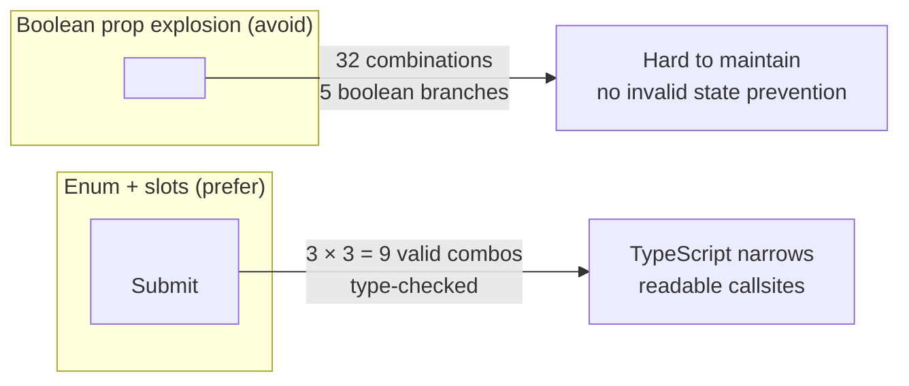

# [FEE-507] 元件 API 設計——Props、Slots 與多型介面

:::info
元件的 API 就是它與消費者之間的契約。團隊 MUST 使用 `{...rest}` 將所有未被元件自身使用的 props 轉發至底層原生元素——在元件內部消費所有 props 會破壞原生 HTML 的能力（ARIA 屬性、`data-*` 屬性、事件處理器）。團隊 MUST 在任何包裹原生 DOM 元素的元件上支援 `ref` 轉發。團隊 SHOULD 優先使用 `variant`/`size` 列舉與 slot 組合，而非布林 prop 的大量增殖。當根元素在不同使用情境中確實需要變更時，團隊 SHOULD 實作多型的 `as`/`asChild` 模式。
:::

## 簡介

每個元件庫最終都面臨同一個考驗：第一天看起來乾淨的 API，到了第一百天卻成了負擔。最初只有三個 props 的 `Button` 成長到十五個。曾經只接受 `title` 和 `body` 的 `Card`，現在有了 `headerLeft`、`headerRight`、`footerLeft`、`footerRight`、`isLoading`、`isCollapsible`、`isHighlighted`、`isFullBleed`。團隊成員針對每個新使用情境增加 props，卻從不停下來思考：這個 prop 是否應該存在？它應該屬於元件還是呼叫者？現有的 props 是否已經可以組合出所需行為？結果就是一個元件 API，沒有任何團隊成員能從記憶中完整列舉出來，文件頁面沒有人完整閱讀，而 TypeScript 錯誤需要查閱原始碼才能理解。

元件 API 設計的紀律，是將元件的介面——它的 props、slots、轉發的屬性——視為第一類設計產物，以設計 REST API 或資料庫 schema 同樣的意圖加以對待。設計良好的元件 API 是最小化的：它恰好暴露呼叫者合理需要的控制能力，僅此而已。它是透明的：呼叫者可以傳入標準 HTML 屬性並得到原生瀏覽器行為，無需元件作者預先預測每個可能的使用情境。它是類型安全的：TypeScript 縮小了有效組合的集合，在編譯期而非執行期捕捉無效用法。它是穩定的：API 的形狀傳達了哪些是有意的設計決策，哪些是可能改變的實作細節。

React 生態系已發展出幾個代表當前最佳實踐的模式：用於原生 prop 轉發的 `{...rest}` 展開模式、用於 DOM ref 存取的 `forwardRef`（或 React 19 的隱式 ref）、用於變體與尺寸控制的列舉 props、用於彈性內容區域的 slot 組合，以及用於語義正確的根標籤取決於使用情境的多型根元素。每個模式都解決特定類別的 API 設計問題。本文以足夠的深度涵蓋所有這些模式——不僅是機制，更是背後的理由：每個模式防止了什麼失敗模式、做出了什麼取捨。

## 原則

團隊 MUST 使用 rest-prop 展開（`{...rest}`）將元件未明確使用的所有 props 轉發至底層原生元素。在元件內部消費所有傳入 props 而不轉發剩餘部分，會破壞呼叫者依賴的原生 HTML 能力：`aria-label`、`aria-describedby`、`aria-expanded` 等 ARIA 屬性在沒有轉發的情況下無法應用；自動化測試套件使用的 `data-testid` 和 `data-cy` 屬性無法設定；元件未明確處理的原生事件處理器如 `onMouseEnter`、`onFocus` 和 `onKeyDown` 會被靜默丟棄。消費所有 props 不是一種保護措施——它是一個陷阱，讓元件無法正確整合輔助技術、測試自動化和原生瀏覽器功能。

團隊 MUST 在任何包裹原生 DOM 元素的元件上支援 `ref` 轉發。呼叫者使用 refs 來測量版面、以程式化方式管理焦點、整合第三方動畫函式庫，以及實作跨多個元件的複合互動。不轉發 ref 的元件會迫使呼叫者使用 `document.querySelector` 直接存取 DOM，這很脆弱、繞過了 React 的所有權模型，並在伺服器端渲染情境中失敗。在 React 18 及更早版本中，ref 轉發需要 `forwardRef`。在 React 19 中，refs 作為普通 props 傳遞，不再需要 `forwardRef` 包裝器——在 React 19 程式碼庫上工作的團隊 SHOULD 使用簡化的 ref-as-prop 方式，但 MUST 理解 `forwardRef` 以保持與現有函式庫的相容性。

團隊 SHOULD 優先使用 `variant`、`size` 和 `intent` 列舉 props，而非布林旗標的大量增殖。當元件需要表達一組互斥的視覺或行為模式時，列舉 prop 在型別系統中編碼了這種互斥性：`variant: 'solid' | 'outline' | 'ghost'` 恰好有三種有效狀態；五個布林旗標（`isPrimary`、`isOutline`、`isGhost`、`isDestructive`、`isSuccess`）有三十二種有效狀態，其中大多數在語義上毫無意義或相互矛盾。TypeScript 無法防止 `isPrimary={true} isOutline={true}`，但它可以防止 `variant="both"`。當注入的內容是標記（markup）而非純量值時，團隊 SHOULD 優先使用 slot 組合而非基於 prop 的內容注入：接受 `ReactNode` 的 `leftIcon` prop 比接受字串路徑的版本更難文件化、測試和組合。

當元件的根元素在不同使用情境中確實需要不同時，團隊 SHOULD 實作多型 `as` prop 模式（或 Radix UI 的 `asChild` 模式）。永遠渲染 `<button>` 的 `Button` 元件無法滿足按鈕樣式連結的使用情境：將其包裹在 `<a>` 中會產生無效 HTML（`<a><button>` 是不允許的）。多型模式允許 `<Button as="a" href="/dashboard">` 渲染為語義正確的錨點元素，同時保留元件所有的視覺邏輯。這個模式的 `asChild` 變體——由 Radix UI 使用並在整個生態系中日益被採用——進一步反轉控制權：呼叫者提供元素作為子元素，包裝器將其 props 合併到子元素上。團隊 MUST NOT 預設讓每個元件都成為多型；只有在元素彈性的需求是真實且反覆出現的情況下，才應採用該模式。

## 設計思考

元件 API 設計最有用的心智模型是區分元件所擁有的和消費者所擁有的。元件擁有其視覺和行為邏輯：有效變體的集合、內部狀態轉換、它保證的無障礙語義。消費者擁有整合情境：其特定無障礙實作所需的 HTML 屬性、其互動模型所需的事件處理器、其版面計算所需的 DOM ref。`{...rest}` 模式是這兩個所有權領域之間的邊界。元件明確消費的所有東西——`variant`、`size`、`loading`、`children`——是元件擁有的。透過 `{...rest}` 轉發的所有東西是消費者擁有的。

slot 與 prop 的決策是第二個最重要的 API 設計選擇。一般規則：當值是元件可以自行渲染和樣式化的純量（字串、數字、布林值、列舉成員）時，使用 prop。當內容是消費者需要控制的標記時，使用 slot（`ReactNode` prop 或透過 `children` 的組合）。`<Badge count={42} />` 作為 prop 是正確的：元件用自己的格式和樣式渲染數字。`<Button leftIcon={<Spinner />} />` 作為 slot 是正確的：元件無法提前知道呼叫者將使用哪個圖示，強迫呼叫者以字串而非 React 元素傳遞圖示路徑，會剝奪他們使用自己圖示元件的動畫、無障礙屬性和主題整合的能力。當元件需要對 slot 內容應用樣式時，這條線變得模糊——這正是 `asChild` 模式變得有價值的地方，因為它允許元件將其 props 合併到呼叫者提供的元素上，而不是用額外的 DOM 節點包裹它。

固定與多型根元素的決策遵循明確的啟發式：是否有任何合理的使用情境，元件的正確 HTML 元素與預設值不同？對於 `Card`，答案幾乎永遠是否——在幾乎所有情境中，Card 都是 `<div>` 元素。對於 `Button`，答案通常是肯定的：按鈕樣式的導覽項目應該是 `<a>` 元素，以獲得正確的語義和連結特定的瀏覽器行為（中鍵點擊在新標籤開啟、右鍵點擊複製 URL）。對於 `Heading`，答案明確是肯定的：正確的標題級別取決於使用點的文件大綱，永遠渲染 `<h2>` 的 `Heading` 元件無法服務在多個大綱級別使用它的頁面。多型模式增加了複雜性——實作和型別都更複雜——因此只應在多型性是真實需求的地方採用，而不是作為過早的泛化。

布林 prop 爆炸值得單獨討論，因為它是長期存活的程式碼庫中最常見的元件 API 失敗模式。考慮一個最初以 `isPrimary` 和 `isSecondary` 作為變體系統的 `Button`。隨著時間推移，設計師添加了 ghost 變體，加入了 `isGhost`。一個破壞性動作模式添加了 `isDangerous`。載入狀態添加了 `isLoading`。停用覆蓋添加了 `isDisabled`。全寬版面變體添加了 `isFullWidth`。這六個布林值產生了六十四種可能狀態。每個的 TypeScript 型別是 `boolean | undefined`，不提供任何關於哪些組合有效的資訊。元件的內部渲染邏輯成為必須處理每種組合的一系列巢狀條件。測試覆蓋率必須選擇要驗證六十四種狀態中的哪幾種。當新工程師加入並讀到帶有 `isLoading isPrimary isFullWidth` 的呼叫點時，他們無法僅從型別判斷自己被允許使用哪些組合。用 `variant: 'primary' | 'secondary' | 'ghost' | 'danger'` 和 `size: 'sm' | 'md' | 'lg'` 和 `loading?: boolean` 和 `fullWidth?: boolean` 替換這些布林變體旗標——後兩者是真正的二元狀態，而前兩者是真正的枚舉。

第四個設計考量是 prop 介面的版本控制策略。添加的 props 很容易做到不破壞性（以預設值添加）。重新命名或移除的 props 需要主要版本升級或棄用期。在大型程式碼庫中廣泛使用或作為函式庫發佈的元件，應將每個新 prop 視為潛在的長期承諾。一個有用的紀律是「三個使用情境」規則：在添加 prop 之前，識別至少三個不同的、真實的呼叫點會使用它。如果 prop 只有一個呼叫點需要，正確答案幾乎總是在呼叫點本身處理變化，而非將其編碼在元件的永久 API 中。

**設計決策表：**

| 決策 | 指引 |
|---|---|
| 擴展 HTML 元素 vs. 自訂 prop API | 將 `{...rest}` 展開至原生元素；只添加 HTML 缺少的部分 |
| 內容使用 slot vs. prop | 內容為標記時用 slot；內容為純量（字串、數字、布林值）時用 prop |
| 固定 vs. 多型根元素 | 消費者確實需要不同元素時使用多型（`button` → `<a>`、Next.js `<Link>`） |
| 可選變體 | 使用列舉 prop（`variant`、`size`、`intent`）而非每個變體一個布林旗標 |
| DOM 消費者的 ref 存取 | 始終透過 `forwardRef`（React 18）或 ref-as-prop（React 19）轉發 ref |
| 圖示 / 裝飾內容 | 接受 `ReactNode` 的具名 slot（`leftIcon`、`rightIcon`），而非字串路徑 |
| 共享行為，彈性元素 | 使用 `asChild` 將 props 合併至呼叫者提供的元素 |

## 最佳實踐

**將 `{...rest}` 展開到根原生元素上，而非包裝用的 `<div>`。** 當元件包裹一個 `<button>` 時，`{...rest}` 必須落在 `<button>` 上，而非容器 `<div>` 上。傳入 `aria-label` 或 `onClick` 的呼叫者期望這些屬性到達互動元素，而非其包裝器。如果元件同時有包裝元素和內部互動元素，識別哪個是語義根——呼叫者將與之互動、導覽至、並透過 ARIA 關係引用的那個——並僅將 `{...rest}` 轉發至該元素。絕不將 rest 展開至多個元素，因為這會同時將事件處理器和 ARIA 屬性應用於多個 DOM 節點。

**在轉發前從 rest 中剔除自身 props。** 如果元件定義了一個名為 `variant` 的自訂 prop，且 `variant` 到達了原生 DOM 元素，瀏覽器會記錄一個關於無法識別屬性的警告。如果元件型別正確，TypeScript 通常會捕捉到這一點，但在使用多型模式時需要特別注意，因為元素型別是動態的。在型別定義中使用 `Omit<ComponentPropsWithoutRef<E>, keyof OwnProps>`，並在函式簽名中明確解構自身 props——任何在函式簽名中以名稱解構且未重新展開的 prop，都會自動從 `rest` 中移除。絕不使用 `delete props.variant` 來過濾——這會變更傳入的物件。

**在包裹原生元素時始終撰寫 `forwardRef`（React 18 及更早版本）。** 立即需要 refs 的元件庫消費者比例很低，但缺少 ref 轉發的代價極高——事後添加需要破壞性的 API 變更。將 `forwardRef` 視為根元素是原生元素或本身轉發 refs 的元件的非選擇性預設。內部實作函式（如下方範例中的 `ButtonImpl`）的函式簽名在第二個參數接受 `ref`，並將其傳遞至根元素的 `ref` prop。使用多型模式時，ref 型別應為 `React.Ref<Element>` 而非特定元素型別，因為具體元素型別取決於靜態未知的 `as` prop。

**為互斥視覺模式使用列舉 props。** 每當你想要添加一個編碼視覺模式的布林 prop——`isOutline`、`isPrimary`、`isDanger`、`isSubtle`——請改問：這是一個枚舉的成員嗎？如果你已有 `variant: 'solid'` 且想添加輪廓模式，正確的改變是 `variant: 'solid' | 'outline'`，而非在 `variant` 旁邊新增 `isOutline` prop。TypeScript 的判別聯合和字串字面量型別讓這個模式在執行期零成本，並提供布林 props 無法比擬的自動補全和錯誤訊息。

**讓必填 props 的數量盡可能接近零。** 每個必填 prop 都是對每個呼叫點的稅。如果一個 prop 有合理的預設值——`variant = 'solid'`、`size = 'md'`、`loading = false`——就讓它成為帶有預設值的可選項。必填 props 應保留給沒有合理預設值且元件在沒有它的情況下無法有意義渲染的 props：僅圖示按鈕的 `label`、連結元件的 `href`、錨定 ARIA 關係的元件的 `id`。有三個必填 props 的元件比有六個的元件有更低的採用門檻。

**為所有基於 prop 的 slot 內容提供明確的 TypeScript 型別。** 型別為 `ReactNode` 的 prop 是正確的，但不提供任何關於節點預期形狀的指引。在介面中使用行內注釋來記錄意圖：`/** 放置在按鈕標籤前的 16×16 圖示元件 */`。對於圖示 slots 尤其如此，考慮使用能表達最常見情況的聯合型別：`leftIcon?: ReactNode` 是通用的；`leftIcon?: React.ReactElement<{ size?: number; className?: string }>` 足夠具體，能捕捉誤用而不至於在每次圖示函式庫更新時失效。正確的具體程度取決於團隊規模和元件庫對圖示使用的嚴格程度。

**記錄元件有意覆蓋的 HTML 屬性。** 當元件在內部始終設定 `role`、`type`、`aria-busy` 或任何其他 HTML 屬性時，在 prop 介面中明確記錄這一點——作為注釋或使用 `Omit` 從轉發型別中排除該屬性。如果元件始終在 `<button>` 元素上設定 `type="button"`（以防止意外的表單提交），傳入 `type="submit"` 的呼叫者會對其 prop 被覆蓋感到意外。要麼允許呼叫者覆蓋元件的預設值（在內部屬性之後展開 `{...rest}`），要麼記錄該 prop 是受控的並從型別中排除它。

**在每次次要版本發布前審計 prop 介面。** 在標記新版本之前，用三個問題審查元件介面中的每個 prop：這個 prop 是否被程式碼庫中超過一個不同的呼叫點使用？如果否，考慮移除它並在呼叫點處理變化。這個 prop 在含義上是否與另一個 prop 重疊，創造了兩種表達相同事物的方式？如果是，棄用其中一個並記錄規範形式。如果元件的內部實作改變，這個 prop 接受的形狀是否會強制破壞性更改？如果是，在型別固化之前加寬型別或引入抽象層。這個審計讓團隊對 API 漂移保持紀律，在版本標記之前進行最為有效，而非在消費者已採用新介面之後。

**在多型元件的 `as` prop 上以 JSDoc 注釋記錄設計意圖。** TypeScript IDE 提示會顯示 `as` 的型別簽名，但不會解釋這個 prop 存在的理由，也不會說明哪些元素在語義上是合適的。一個簡短的 JSDoc 注釋——例如 `/** 要渲染的根元素。當按鈕需要導覽時，請使用 'a' 或路由器的 Link 元件。預設為 'button'。 */`——會在呼叫點的 IntelliSense 中浮現，減少查閱元件原始碼或文件頁面的需要。對於消費元件庫的工程師並非原始作者的團隊，這一點尤其有價值。如果只有 `'button'`、`'a'` 和 `typeof Link` 是合理的值，請在注釋中明確說明，而不是讓 `ElementType` 聯合型別自行表達意圖。

**謹慎地對 `as` prop 所接受的型別進行版本控制。** 將 `as` 從 `'button' | 'a'` 擴展至 `ElementType` 是不破壞性的；反過來縮小則是破壞性的。從覆蓋所有真實使用情境的最小元素型別集合開始，隨著具體需求的出現再擴展聯合型別。這能讓 TypeScript 的錯誤訊息保持實用性——`Type '"div"' is not assignable` 比不帶進一步限制的 `Type '"div"' is not assignable to type 'ElementType'` 更具可操作性。

## Mermaid 圖



左路徑代表逐步累積 prop 的結果：每個個別布林值的添加在孤立情境中是合理的，但累積效果是一個從型別上無法區分有效和無效組合的 API 介面。右路徑顯示相同的表達範圍——實心大型載入按鈕——只需要兩個列舉 props 和一個布林值，涵蓋九種有效的尺寸乘以變體組合，而非三十二種布林組合，並且對 `variant="invalid"` 產生 TypeScript 錯誤，而非靜默地不應用任何變體。

## 範例

### 帶有 ref 轉發的多型 `Button` 元件

以下實作示範了完整模式：帶有 TypeScript 泛型的多型 `as` prop、`{...rest}` 轉發、明確的自身 prop 剔除、帶有標準泛型強制轉換解決方案的 `forwardRef`，以及載入狀態的無障礙狀態管理。

```tsx
// src/components/Button.tsx
import { forwardRef, type ElementType, type ComponentPropsWithoutRef, type ReactNode } from 'react';

// Strip own props before merging with element props to avoid conflicts
type ButtonOwnProps<E extends ElementType = 'button'> = {
  as?: E;
  variant?: 'solid' | 'outline' | 'ghost';
  size?: 'sm' | 'md' | 'lg';
  loading?: boolean;
  children?: ReactNode;
};

// Polymorphic props: ButtonOwnProps merged with inferred element props (minus own keys)
export type ButtonProps<E extends ElementType = 'button'> = ButtonOwnProps<E> &
  Omit<ComponentPropsWithoutRef<E>, keyof ButtonOwnProps<E>>;

const variantClasses: Record<NonNullable<ButtonOwnProps['variant']>, string> = {
  solid: 'bg-blue-600 text-white hover:bg-blue-700',
  outline: 'border border-blue-600 text-blue-600 hover:bg-blue-50',
  ghost: 'text-blue-600 hover:bg-blue-50',
};

const sizeClasses: Record<NonNullable<ButtonOwnProps['size']>, string> = {
  sm: 'px-3 py-1 text-sm',
  md: 'px-4 py-2 text-base',
  lg: 'px-6 py-3 text-lg',
};

// forwardRef with generics requires a cast — this is the standard workaround
function ButtonImpl<E extends ElementType = 'button'>(
  { as, variant = 'solid', size = 'md', loading = false, children, ...rest }: ButtonProps<E>,
  ref: React.Ref<Element>
) {
  const Component = (as ?? 'button') as ElementType;
  return (
    <Component
      ref={ref}
      disabled={loading || (rest as { disabled?: boolean }).disabled}
      aria-busy={loading}
      className={`inline-flex items-center rounded font-medium transition-colors
        ${variantClasses[variant]} ${sizeClasses[size]}
        disabled:opacity-50 disabled:cursor-not-allowed`}
      {...rest}
    >
      {loading ? <span className="mr-2 animate-spin">⟳</span> : null}
      {children}
    </Component>
  );
}

export const Button = forwardRef(ButtonImpl) as <E extends ElementType = 'button'>(
  props: ButtonProps<E> & { ref?: React.Ref<Element> }
) => React.ReactElement;
```

這個實作中有幾個設計決策值得仔細研究：

- **`ButtonOwnProps` 對 `E` 是泛型的。** 雖然自身 props 不直接引用 `E`，但讓 `ButtonOwnProps` 成為泛型允許 `ButtonProps` 在 `E` 改變時正確地從 `ComponentPropsWithoutRef<E>` 中省略自身 prop 鍵。沒有泛型，TypeScript 無法在 `E` 改變時正確縮窄合併型別。
- **`Omit<ComponentPropsWithoutRef<E>, keyof ButtonOwnProps<E>>`。** 這是避免 prop 衝突的關鍵。沒有 `Omit`，當元件定義了自己的 `type` prop 時，呼叫者傳入 `as="input"` 可能導致 `type` prop 與 `ComponentPropsWithoutRef<'input'>['type']` 衝突。`Omit` 確保消費者面向的自身 props 在出現名稱衝突時始終優先於推斷的元素 props。
- **`disabled` 和 `aria-busy` 在 `{...rest}` 之前設定。** 由於 `{...rest}` 在明確屬性之後展開，明確傳入 `disabled={false}` 的呼叫者將覆蓋元件基於載入的停用狀態——最後一次寫入獲勝。這種覆蓋是否符合期望取決於元件的契約；如果是有意為之，請明確記錄。
- **`forwardRef` 強制轉換。** TypeScript 的 `forwardRef` 在其預設型別中不支援泛型函式參數。標準解決方案是將實作定義為泛型函式（`ButtonImpl`），用 `forwardRef` 包裹它，然後將結果強制轉換為包含 `ref` prop 的泛型函式型別。這個強制轉換是安全的，因為執行期行為是正確的；型別斷言純粹是為了在公開 API 中恢復泛型簽名。

### 使用範例

```tsx
// 渲染為 <button>——預設行為
<Button variant="solid" size="md" onClick={() => save()}>儲存</Button>

// 渲染為 <a>——href 和其他錨點 props 由 TypeScript 推斷
<Button as="a" href="/dashboard" variant="ghost">儀表板</Button>

// 渲染為 Next.js Link——所有 Link props（href 物件、locale、prefetch）都被推斷
<Button as={Link} href="/settings" variant="outline">設定</Button>

// ref 轉發——ref 有型別並傳遞至底層 DOM 元素
const ref = useRef<HTMLButtonElement>(null);
<Button ref={ref} variant="solid">聚焦我</Button>

// ARIA 屬性透過 rest 轉發——無需特別處理
<Button
  aria-label="刪除項目"
  aria-describedby="delete-description"
  data-testid="delete-btn"
  variant="outline"
  onClick={handleDelete}
>
  刪除
</Button>
```

### React 19：ref 作為普通 prop

在 React 19 中，不再需要 `forwardRef` 包裝器。Refs 作為普通 props 傳遞，消除了泛型強制轉換解決方案的需要：

```tsx
// React 19：ref 是普通 prop——不需要 forwardRef
function Button<E extends ElementType = 'button'>({
  as,
  variant = 'solid',
  size = 'md',
  loading = false,
  children,
  ref,
  ...rest
}: ButtonProps<E> & { ref?: React.Ref<Element> }) {
  const Component = (as ?? 'button') as ElementType;
  return (
    <Component
      ref={ref}
      disabled={loading || (rest as { disabled?: boolean }).disabled}
      aria-busy={loading}
      className={`inline-flex items-center rounded font-medium transition-colors
        ${variantClasses[variant]} ${sizeClasses[size]}
        disabled:opacity-50 disabled:cursor-not-allowed`}
      {...rest}
    >
      {loading ? <span className="mr-2 animate-spin">⟳</span> : null}
      {children}
    </Component>
  );
}
```

這個簡化對多型元件意義重大，因為泛型強制轉換解決方案是整個模式中最不透明的方面之一。升級至 React 19 的團隊 SHOULD 逐步移除 `forwardRef` 包裝器——舊的 API 不會立即被廢棄，因此遷移可以是漸進的。

### `asChild` 模式（Radix UI 風格）

`as` prop 模式在目標元素是已知 HTML 元素或具有相容 prop 介面的元件時效果很好。`asChild` 模式反轉了控制權：呼叫者提供元素作為子元素，包裝器將其 props 和行為合併到子元素上。

```tsx
import { Slot } from '@radix-ui/react-slot';

type ButtonProps = {
  asChild?: boolean;
  variant?: 'solid' | 'outline' | 'ghost';
  size?: 'sm' | 'md' | 'lg';
  className?: string;
  children?: React.ReactNode;
} & React.ButtonHTMLAttributes<HTMLButtonElement>;

export function Button({
  asChild = false,
  variant = 'solid',
  size = 'md',
  className,
  children,
  ...rest
}: ButtonProps) {
  const Component = asChild ? Slot : 'button';
  return (
    <Component
      className={`inline-flex items-center rounded font-medium
        ${variantClasses[variant]} ${sizeClasses[size]} ${className ?? ''}`}
      {...rest}
    >
      {children}
    </Component>
  );
}

// 使用範例：Button 渲染為 Next.js Link——Link 接收 Button 的 className 和事件處理器
<Button asChild variant="solid">
  <Link href="/dashboard">前往儀表板</Link>
</Button>
```

`asChild` 方式型別更簡單（不需要泛型）且更具組合性（呼叫者在呼叫點明確選擇元素，而非透過 prop 命名）。取捨是 `asChild` 要求呼叫者始終提供單個 React 元素作為子元素——如果子元素是字串或 Fragment 就會失敗。`as` prop 方式在這方面更寬容。大多數現代元件庫（shadcn/ui、Radix Primitives）預設使用 `asChild` 模式來實現多型性。

## 常見錯誤

**Prop 名稱與 HTML 屬性衝突。** 將元件 prop 命名為 `label` 會在元件與多型 `as="label"` 一起使用時，與 HTML `<label>` 元素產生衝突。命名 prop 為 `for` 會與 HTML `for` 屬性（React 中表示為 `htmlFor`）衝突。命名 prop 為 `class` 會與 `className` 衝突。最安全的規則：避免將元件 props 命名為任何 HTML 全域屬性或任何 HTML 元素名稱。優先使用描述性、元件特定的名稱：用 `accessibleLabel` 代替 `label`，用 `labelText` 代替 `label`，用 `ariaLabel` 代替 `aria-label`（儘管 `aria-*` props 應始終透過 rest 傳遞，而非給予特殊處理）。

**將 `{...props}` 展開至非原生元素並傳遞無效的 DOM 屬性。** 當元件是多型的且目標元素是 `<div>` 或任何其他原生元素時，`variant="solid"` 等自訂 props 必須在展開到達 DOM 之前被剔除。瀏覽器會忽略 HTML 元素上無法識別的屬性，但 React 會對原生元素上的每個未知 prop 記錄警告。這不只是主控台雜訊問題：它表明你的 prop 過濾邏輯不完整。正確的修復是型別定義中的 `Omit` 模式加上函式簽名中的解構——任何在函式參數中以名稱解構的 prop 都會自動從 `rest` 中移除，不會被轉發。

**布林 prop 爆炸。** 五個布林旗標（`isLoading`、`isDisabled`、`isFullWidth`、`isRounded`、`isOutline`）產生三十二種理論組合，其中大多數在語義上毫無意義。從型別角度來看，`isRounded={true} isOutline={false} isLoading={true} isFullWidth={false} isPrimary={true}` 是有效的，但代表一種不太可能且可能是無意的組合。用 `variant` 列舉替換變體級別的布林值，用 `size` 列舉替換尺寸級別的布林值。保留布林 prop 形式用於真正的二元狀態：`loading`、`disabled`、`fullWidth`——這些狀態獨立於 variant 和 size，並與它們正交組合。

**忘記在互動元件上轉發 ref。** 不轉發 ref 的 `Button`、`Input`、`Select`、`TextArea` 或任何其他互動元件，與焦點管理函式庫、表單函式庫（React Hook Form 的 `register` 函式返回一個 ref）、以程式化方式移動焦點的無障礙工具，以及使用 `ref` 斷言元素狀態的任何測試都不相容。這是事後修復需要破壞性 API 變更的 API 設計錯誤之一，因為添加 `forwardRef` 技術上改變了元件的函式簽名。從元件第一天包裹原生元素開始，就將其作為非選擇性的預設值確立。

**將 prop 預設值與介面定義放在同一位置。** 預設 prop 值應放在函式參數解構位置，而非獨立的 `defaultProps` 物件（該物件在 React 中已被棄用，在 React 18+ 的函式元件中已移除）。將預設值放在解構位置使其在閱讀元件簽名時立即可見，消除了預設值的第二個真實來源，並與 TypeScript 的型別縮窄正確配合——TypeScript 可以在解構位置看到 `variant` 是 `'solid'` 並相應地縮窄後續用法。當預設值依賴於另一個 prop 時（例如，預設圖示尺寸取決於 `size` prop），在函式體內作為衍生變數計算，而非在參數列表中。

**在多型實作中省略 TypeScript。** 沒有泛型的多型 `as` prop——僅將其型別定為 `as?: React.ElementType`——可以編譯並正確執行，但失去了讓這個模式有價值的 prop 推斷。沒有泛型，`<Button as="a">` 不會推斷 `href` 是有效 prop，`<Button as={Link}>` 也不會推斷 Next.js `Link` 的 `prefetch` 或 `locale` props 是可用的。帶有 `ComponentPropsWithoutRef<E>` 和 `Omit` 的泛型實作更長，且需要 `forwardRef` 強制轉換，但它是提供完整開發者體驗的版本。如果泛型複雜度對團隊來說難以維護，改用 `asChild` 模式——它更簡單易實作和型別標注，代價是要求呼叫者提供明確的子元素。

**使用非語義的 prop 名稱來隱藏實作細節。** `Button` 上名為 `type` 的 prop 可能是指 HTML `type` 屬性（`button`、`submit`、`reset`），也可能是指元件的視覺類型（等同於 `variant`，`'primary'` 碰巧是藍色）。`Text` 元件上名為 `color` 的 prop 可能是實際的 CSS 顏色值，也可能是 `variant` 的別名。在同一 prop 層面混用這兩個命名空間，會產生隨時間積累的混亂，特別是當不熟悉其歷史的工程師使用該元件時。使用 HTML 屬性名稱當 prop 直接映射到 HTML 屬性，使用不同的元件詞彙名稱（`variant`、`intent`、`tone`）當 prop 是元件層級的抽象。

## 相關 FEE

- [FEE-501：元件組合模式](./501.md) — slots 是組合介面；本文涵蓋使組合成為可能的 API 介面
- [FEE-503：Headless 元件與無渲染模式](./503.md) — headless 元件將其 prop 工廠作為 API 介面暴露；這裡的設計原則直接適用於 headless prop 設計
- [FEE-901：設計代幣](../Design%20Systems%20and%20UI%20Libraries/901.md) — 元件 API 是設計代幣被消費的介面；`variant` 和 `size` props 映射至代幣尺度

## 參考資料

- [React 文件——向元件傳遞 Props](https://react.dev/learn/passing-props-to-a-component) — 涵蓋 prop 轉發、rest 展開以及將 props 視為元件公開介面的心智模型的基礎 React 文件
- [Radix UI — `asChild` 文件](https://www.radix-ui.com/primitives/docs/utilities/slot) — 支撐 `asChild` 模式的 Radix `Slot` 原語，解釋何時優先使用它而非 `as` prop 方式，以及如何合併 props 和 refs
- [TypeScript 手冊——泛型](https://www.typescriptlang.org/docs/handbook/2/generics.html) — 支撐多型元件 prop 推斷的 `ComponentPropsWithoutRef<E>` + `Omit` 模式的 TypeScript 文件
- [Brad Frost — Atomic Design 第 2 章](https://atomicdesign.bradfrost.com/chapter-2/) — 將元件視為原子、分子和有機體的基礎框架，為元件 API 應暴露什麼 vs. 組合什麼的問題提供資訊
- [React 19 發行說明——ref 作為 prop](https://react.dev/blog/2024/12/05/react-19#ref-as-a-prop) — 移除 `forwardRef` 需求的 React 19 變更，包含遷移指引和 API 簡化的理由
- [Matt Pocock — TypeScript 中的多型元件](https://www.totaltypescript.com/react-component-props-with-as-prop) — `ComponentPropsWithoutRef<E>` + `Omit` + `forwardRef` 強制轉換模式的詳細說明，包含邊緣情況和每個型別層級決策的理由
- [Ariakit 部落格——元件設計原則](https://ariakit.org/guide/component-providers) — Ariakit 函式庫關於其元件 API 設計哲學的文件，涵蓋 `render` prop 作為 `asChild` 替代方案以及每種方式的取捨
- [shadcn/ui 原始碼——Button 元件](https://github.com/shadcn-ui/ui/blob/main/apps/www/registry/default/ui/button.tsx) — 廣受參考的生產實作，使用 Radix `Slot`、`class-variance-authority` 和 `forwardRef` 實現 `asChild` + `variant` + `size` 模式，展示本文模式在真實共享元件庫中的樣貌
