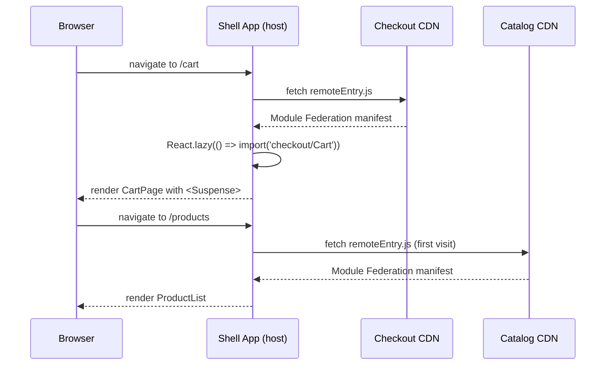

# [FEE-508] 微前端架構

:::info
微前端將 Web 應用程式分解為可獨立部署的 UI 單元，與團隊或領域邊界對齊。團隊 MUST 在 Module Federation 設定中宣告共享函式庫的 singleton（`react`、`react-dom`、router）——重複的實例會導致 React context 失效與「invalid hook call」錯誤。團隊 MUST NOT 透過共享全域狀態來耦合微前端；跨 MFE 通訊 SHOULD 使用自訂 event bus 或最小化、版本化的共享契約。對於少於 3 個團隊或少於 20 個路由的應用程式，團隊 SHOULD NOT 採用微前端——操作開銷將超過其帶來的效益。
:::

## 簡介

單體前端長期以來很好地服務了 Web 開發。單一儲存庫、單一建置流水線、單一部署——整個應用程式作為一個一致的產物交付。對於在可管理範圍內工作的小型團隊而言，這個模型仍然是正確答案。但隨著組織規模擴大，單體架構積累的成本在五人團隊中是無形的，在五十人團隊中卻是令人窒息的：一個團隊功能中的改動會觸發整個應用程式的完整重建和重測；隨著數十位工程師競相合併，共享主分支成為協調瓶頸；2019 年做出的框架決策在 2026 年仍約束著每個團隊，無論它是否還代表其特定領域的最佳工具。

微前端是這個組織擴展問題的架構回應。這個術語由 Martin Fowler 和 Sam Newman 在 2010 年代中期推廣，並在 2020 年由 webpack 5 的 Module Federation 奠定了持久的技術基礎。它指的是將 Web 應用程式分解為獨立擁有、獨立建置和獨立部署的 UI 單元的實踐——每個單元是單一產品團隊的前端責任。這種分解反映了組織邊界：擁有結帳領域的團隊擁有結帳微前端；擁有產品目錄的團隊擁有目錄微前端。協調透過契約進行——每個遠端暴露的公開 API——而非透過共享程式碼、共享分支或共享部署流水線。

微前端的承諾是真實的，但它引入的複雜性也是真實的。將每個 MFE 視為獨立可部署執行期單元的架構，為模組載入增加了網路往返、為遠端與主機 shell 之間的版本相容性創造了風險面，並要求跨 MFE 通訊的紀律，這是單體架構從未要求的。理解微前端何時解決真實問題、何時只是為了基礎設施而增加基礎設施，與理解如何正確實作它們同樣重要。本文涵蓋兩個維度：何時採用微前端的決策框架、每種整合策略的技術機制，以及避免最常見失敗模式所需的操作紀律。

## 原則

團隊 MUST 在主機 shell 和每個遠端的 Module Federation `shared` 設定中，將所有共享框架 singleton——`react`、`react-dom`，以及任何共享路由器（`react-router-dom`、`@tanstack/router`）——宣告為 `singleton: true`。Module Federation 的執行期共享機制在多個遠端暴露相同套件時，解析每個 singleton 的單一版本；沒有 `singleton: true`，每個遠端會捆綁自己的副本，頁面最終會有兩個或多個獨立的 React 實例。同一頁面上的兩個 React 實例會產生 React context 失敗（由一個實例提供的 context 對另一個實例渲染的元件不可見）、「invalid hook call」錯誤（hooks 依賴於跨實例不共享的 React 內部 dispatcher），以及 SSR 情境中的水合不匹配。`singleton: true` 旗標不是性能優化——它是正確性要求。

團隊 MUST 同時在 `singleton: true` 旁邊指定 `requiredVersion`。版本約束確保 Module Federation 的共享範圍協商可以偵測遠端何時搭載了與主機需求不相容的 React 版本並優雅地回退，而不是靜默載入不匹配的版本。`requiredVersion` 欄位接受 semver 範圍字串（`'^18.0.0'`），當約束被違反時，Module Federation 執行期會在載入時發出警告。團隊 MUST 在 CI 中將這些警告視為錯誤，並封鎖引入 singleton 套件版本不匹配的部署。

團隊 MUST NOT 透過直接跨遠端匯入狀態儲存、context provider 或內部模組來耦合微前端。在目錄遠端中形如 `import { useCartStore } from 'checkout/store'` 的匯入，對結帳遠端的內部實作創造了建置期依賴。當結帳團隊重構其儲存、重新命名匯出或更改其形狀時，他們無法在不與每個依賴它的遠端協調的情況下這樣做——這完全違背了獨立可部署性的目的。唯一安全的跨遠端匯入，是明確暴露的、版本化的、公開契約：UI 元件、型別化的事件有效載荷，或暴露團隊承諾作為穩定 API 維護的共享工具函式。

跨 MFE 通訊 SHOULD 透過基於瀏覽器原生 `EventTarget` API 的自訂 event bus 或作為版本化套件發布的最小共享契約來實作。event bus 方法將通訊通道保持在瀏覽器的事件系統中，該系統已在頁面上的所有腳本之間共享，不需要 Module Federation 設定，且不攜帶框架依賴。共享契約方法（一個小型的 `@acme/mfe-contracts` npm 套件，匯出型別化的事件有效載荷和儲存介面）適用於通訊面足夠大到值得明確版本控制和變更日誌紀律的情況。

對於少於三個獨立團隊或少於二十個路由的應用程式，團隊 SHOULD NOT 採用微前端。低於此門檻時，微前端提供的部署獨立性不值得其操作成本：維護單獨的 CI 流水線、在各環境協調 `remoteEntry.js` URL 變更、管理共享依賴版本相容性，以及調試跨遠端執行期失敗，需要工程時間，而低於門檻的團隊將這些時間更有效地花在產品功能上。Monorepo 單體，可能帶有由 lint 規則強制的內部套件邊界，提供相同的程式碼組織效益，而沒有任何執行期複雜性。

## 設計思考

微前端架構中的核心設計張力是隔離與整合之間的權衡。最大隔離——每個 MFE 在完全沙盒化的 iframe 中提供——消除了每一類跨 MFE 干擾：沒有共享狀態、沒有共享 DOM、沒有共享 JavaScript 執行期。但它也消除了讓 Web 應用程式感覺一致的東西：共享認證狀態、共享導覽、共享捲動位置、統一的 URL 模型。最小隔離——所有 MFE 作為模組匯入並在單一 JavaScript 執行期中組合——實現了最緊密的整合和最佳用戶體驗，但重新引入了微前端本應消除的協調要求。每種整合策略都是這個光譜上的一個點，選擇正確的點需要理解產品實際需要哪些維度的隔離。

是否採用微前端的決策是最重要的，它在組織層面上與技術層面上同樣重要。微前端解決部署協調問題。如果在某個產品上工作的團隊沒有被部署協調所阻塞——如果他們可以獨立地將功能交付到生產環境，而無需等待其他團隊的批准、測試或發布窗口——那麼微前端解決的是不存在的問題。它們引入的開銷（網路往返、執行期版本協商、跨遠端調試、環境 URL 管理）是真實的開銷，消耗工程時間。在承諾微前端架構之前，團隊 SHOULD 審計其實際部署頻率，並識別架構將消除的具體協調瓶頸。如果瓶頸是社會性的（流程、溝通）而非架構性的（共享產物、共享流水線），微前端不太可能有所幫助。

整合策略的選擇——Module Federation、Web Components 或 iframe——應由隔離要求和所涉及團隊的框架現實驅動。當所有遠端共享一個公共框架（React、Vue 或類似框架）時，Module Federation 提供了最佳的開發者體驗，因為共享 singleton 機制確保框架實例、hooks 和 context 被正確共享。Web Components 提供框架無關的隔離，代價是更高的序列化開銷（所有資料必須通過屬性或事件跨越自訂元素邊界，而非作為 JavaScript 值），以及失去框架原生組合模式（React children、Vue slots）。iframe 提供最嚴格的隔離，是第三方提供的遠端必須在沒有任何信任關係的情況下嵌入時的正確選擇——支付小部件、廣告、嵌入式分析——但它們以需要大量工程工作來修復的方式破壞了 URL、捲動、焦點和認證整合。

**設計決策表：**

| 情境 | 微前端 | Monorepo 單體 |
|---|---|---|
| 同一 URL 上有 5 個以上獨立團隊 | 是 | 否 |
| 團隊需要獨立的部署節奏 | 是 | 否 |
| 團隊使用不同框架 | 是（iframe 作為最後手段） | 否 |
| 單一團隊，少於 20 個路由 | 否 | 是 |
| 性能預算嚴格（TTI） | 謹慎——額外網路往返 | 優先 |
| 所有部分共享設計系統 | 透過 Module Federation shared | 更適合作為版本化 npm 套件 |

性能考量值得詳細說明。每個遠端的 `remoteEntry.js` manifest 必須在遠端模組載入之前被獲取。在空快取的冷載入中，組合三個遠端的頁面在任何遠端 UI 能夠渲染之前，會在關鍵渲染路徑上增加三次順序或並行的網路往返。`React.lazy` + `Suspense` 模式透過推遲遠端載入直到用戶導覽到需要該遠端的路由來緩解這一點——從不訪問結帳路由的用戶從不支付獲取結帳遠端的成本。但在同時組合多個遠端的路由上，獲取延遲會累積。對嚴格 Time-to-Interactive 預算有要求的團隊，SHOULD 在其目標網路條件下測量實際遠端載入時間，然後再承諾微前端架構。

**整合策略按耦合度排列（從低到高隔離）：**

1. **Module Federation**（webpack 5+，Vite 透過 `@originjs/vite-plugin-federation`）——執行期組合、共享框架實例、最佳開發者體驗。shell 在執行期獲取每個遠端的 `remoteEntry.js` manifest 並從遠端的區塊圖解析模組匯入。框架 singleton 透過 Module Federation 共享範圍共享。開發者體驗接近在 monorepo 中工作：遠端使用標準匯入語法匯入，並使用 `React.lazy` 組合。

2. **Web Components**——框架無關、沒有共享實例、更高的序列化開銷。每個 MFE 暴露自訂元素（`<checkout-cart>`、`<catalog-product-list>`）。shell 將它們組合為 HTML 元素。框架實例不被共享——每個 MFE 捆綁自己的框架副本。屬性必須可序列化，這排除了沒有 JSON 序列化的 React 元素和複雜物件。

3. **iframe**——完全隔離、沒有共享狀態、破壞的 UX（捲動、焦點、URL、認證）。每個 MFE 在其自己的 URL 上提供並嵌入為 `<iframe>`。通訊透過 `postMessage` 進行。iframe 邊界從 JavaScript 角度是不可穿透的，這提供了最大的安全隔離，但需要大量工程工作來實現一致的 UX：父級必須手動同步 iframe 的捲動位置、轉發焦點事件、保持位址列 URL 與 iframe 的內部導覽同步，並代理認證 cookies 或 tokens。

## 最佳實踐

**在主機和遠端設定中都宣告所有共享 singleton。** Module Federation 共享範圍由主機 shell 和每個遠端的貢獻共同填充。如果主機將 `react` 宣告為 `singleton: true` 但遠端沒有，那麼無論主機提供什麼，該遠端都會載入自己捆綁的 React 副本。federation 圖中的每個 `webpack.config.js`（或帶有 `@originjs/vite-plugin-federation` 的 `vite.config.ts`）MUST 包含 `react`、`react-dom` 和路由器的相同 `shared` 設定。在 monorepo 根目錄建立一個共享的 `federation.config.js` 文件，讓每個套件擴展它，這樣新遠端預設就有正確的設定。

**在 shell 的所有共享 singleton 上設定 `eager: false`。** 在共享 singleton 上設定 `eager: true` 旗標，會使 Module Federation 執行期將該 singleton 包含在 shell 的初始區塊中，該區塊在任何遠端被獲取之前同步載入。這消除了 Module Federation 所需的異步初始化步驟（`bootstrap.js` / 動態 `import()` 包裝器），但將 singleton 的重量添加到 shell 的初始捆綁中。設定 `eager: false`（預設值）並將 shell 的入口點包裝在動態匯入中，以保持 shell 啟動輕量。`checkout` 遠端載入時將從主機的共享範圍解析共享的 React——異步解析由 Module Federation 執行期透明地處理。

**始終在 `React.lazy` + `Suspense` 後面懶載入遠端。** 在 shell 啟動時急切載入所有遠端，意味著每個用戶在首頁載入時都要支付獲取每個遠端的 `remoteEntry.js` manifest 和初始區塊的延遲成本，即使他們從不訪問使用這些遠端的路由。將每個聯邦匯入包裝在 `React.lazy` 中，並在帶有有意義回退的 `<Suspense>` 邊界內渲染它。回退應該是一個與遠端 UI 版面匹配的骨架——購物車的閃光佔位符、產品列表的網格骨架——而非通用的載入轉圈，這樣當遠端解析時，載入狀態不會產生令人不安的版面偏移。

**使用型別化的 event bus 而非共享狀態實作跨 MFE 通訊。** 遠端之間的共享狀態——透過 Module Federation 匯入的 Zustand 儲存、透過共享模組傳遞的 Redux 儲存實例——創造了獨立可部署性本應消除的執行期耦合。當儲存的形狀改變時，每個讀取它的遠端都必須同時更新和重新部署。event bus 模式將生產者與消費者解耦：結帳遠端發出帶有型別化有效載荷的 `cart:updated` 事件；shell 監聽它並更新購物車徽章計數；shell 和目錄遠端都不需要了解結帳遠端如何管理其內部購物車狀態。在一個小型、版本化的 `@acme/mfe-contracts` 套件中定義事件有效載荷型別，所有遠端都可以作為開發依賴依賴它——這在通訊邊界上提供了變更日誌紀律和 TypeScript 安全性，而無需創造執行期耦合。

**將 `remoteEntry.js` URL 固定到環境特定設定，而非硬編碼字串。** 在 `webpack.config.js` 中硬編碼 `checkout@https://checkout.acme.com/remoteEntry.js`，使得在不修改設定文件的情況下，無法針對 staging 或本地結帳遠端執行 shell。使用在建置時注入的環境變數（`CHECKOUT_REMOTE_URL`）（透過 `DefinePlugin` 或 Vite 的 `loadEnv`）使遠端 URL 每個環境可設定。在本地開發中，將所有遠端 URL 指向本地執行的實例或共享的 staging 部署。這個模式也啟用了「strangler fig」遷移模式，其中新的遠端版本可以在 staging 中測試，然後在沒有任何 shell 程式碼變更的情況下升級到生產環境。

**明確版本化暴露的模組並溝通破壞性變更。** 更改暴露的 `Cart` 元件的 props 介面的遠端——添加必填 prop、移除 prop、更改 prop 型別——會在任何載入更新遠端而沒有相應 shell 更新的 shell 版本中創造執行期失敗。Module Federation 不提供任何在建置時跨遠端邊界進行型別檢查的機制。將每個對暴露模組公開介面的更改視為需要與 shell 維護者協調的破壞性變更。考慮為每個遠端的暴露模組維護 `CHANGELOG.md`，為 `remoteEntry.js` 文件名採用語義版本控制（例如 `remoteEntry@2.js`），或執行從 staging URL 載入實際遠端 manifest 並驗證 shell 可以在沒有錯誤的情況下組合它的整合測試。

**在整合測試而非僅在單元測試中測試 federation 邊界。** 遠端內的單元測試驗證遠端的內部邏輯，但對遠端是否與 shell 正確組合不提供任何訊號。添加啟動 shell 和一個或多個遠端的整合測試，並驗證跨邊界互動是否有效：shell 可以從結帳遠端掛載 Cart 元件，`cart:updated` 事件正確傳播到 shell 的徽章計數，共享的 React singleton 從共享範圍解析而不是重複。這些測試最好針對從本地開發伺服器提供的實際 `remoteEntry.js` manifest 執行，而非針對模擬版本，因為 Module Federation 執行期行為無法通過模擬完全模擬。

**為 shell 應用程式建立清晰的所有權模型。** shell 應用程式——載入和組合遠端的主機——本身也是一個微前端，因為它由一個團隊擁有並獨立部署。抵制將共享產品功能放入 shell 的誘惑：導覽、認證、設計系統頭部和底部。這些適合放在 shell；產品功能不適合。當產品邏輯在 shell 中積累時，shell 再次成為部署瓶頸——每個影響共享 shell 行為的產品團隊變更都需要 shell 部署。保持 shell 的責任範圍窄：路由、認證編排、遠端載入、全域版面框架，以及 event bus 初始化。

## Mermaid 圖



這個時序圖說明了懶載入模式：shell 只在首次導覽到需要某個遠端的路由時才獲取該遠端的 `remoteEntry.js` manifest，而非在 shell 啟動時。manifest 告訴 Module Federation 執行期在哪裡找到遠端的區塊，以及它向共享範圍貢獻哪些套件。後續對 `/cart` 的導覽重用瀏覽器模組快取中已載入的結帳模組——每個遠端每個 session 的 `remoteEntry.js` 獲取是一次性成本。shell 路由層的 `<Suspense>` 邊界在 manifest 獲取和初始區塊載入期間渲染骨架回退，防止版面在遠端解析時阻塞。

## 範例

### 主機與遠端的 Module Federation 設定

以下範例展示了使用 webpack 5 的 Module Federation plugin 的完整主機 shell 和結帳遠端設定，接著是 shell 的懶載入頁面元件和跨 MFE event bus。

```js
// host/webpack.config.js
const { ModuleFederationPlugin } = require('webpack').container;

module.exports = {
  mode: 'production',
  plugins: [
    new ModuleFederationPlugin({
      name: 'shell',
      remotes: {
        checkout: 'checkout@https://checkout.acme.com/remoteEntry.js',
        catalog:  'catalog@https://catalog.acme.com/remoteEntry.js',
      },
      shared: {
        react: {
          singleton: true,
          requiredVersion: '^18.0.0',
          eager: false, // 懶載入——不阻塞 shell 啟動
        },
        'react-dom': {
          singleton: true,
          requiredVersion: '^18.0.0',
          eager: false,
        },
        'react-router-dom': {
          singleton: true,
          requiredVersion: '^6.0.0',
        },
      },
    }),
  ],
};
```

```js
// checkout/webpack.config.js
const { ModuleFederationPlugin } = require('webpack').container;

module.exports = {
  mode: 'production',
  output: {
    publicPath: 'https://checkout.acme.com/',
  },
  plugins: [
    new ModuleFederationPlugin({
      name: 'checkout',
      filename: 'remoteEntry.js',
      exposes: {
        './Cart':    './src/Cart',
        './Summary': './src/OrderSummary',
      },
      shared: {
        react:       { singleton: true, requiredVersion: '^18.0.0' },
        'react-dom': { singleton: true, requiredVersion: '^18.0.0' },
        'react-router-dom': { singleton: true, requiredVersion: '^6.0.0' },
      },
    }),
  ],
};
```

幾個設定決策值得注意。主機在 `react` 和 `react-dom` 上設定 `eager: false` 以保持 shell 的初始區塊輕量——當 `eager` 為 false 時，需要 Module Federation 異步初始化模式（一個做動態 `import('./App')` 的薄 `bootstrap.js` 文件）。遠端明確設定 `publicPath` 到其 CDN URL；沒有這個，webpack 無法從主機的來源正確解析遠端的區塊 URL。遠端上的 `filename: 'remoteEntry.js'` 是主機在解析 `checkout@https://checkout.acme.com/remoteEntry.js` 時獲取的 manifest 文件。

### 帶有懶載入的 shell 頁面元件

```tsx
// host/src/pages/CartPage.tsx
import React, { Suspense } from 'react';
import { CartSkeleton } from '../components/CartSkeleton';

// 從聯邦遠端懶匯入——在執行期解析
const Cart = React.lazy(() => import('checkout/Cart'));

export function CartPage() {
  return (
    <Suspense fallback={<CartSkeleton />}>
      <Cart />
    </Suspense>
  );
}
```

`import('checkout/Cart')` 呼叫由 Module Federation 執行期解析，而非標準模組捆綁器。在建置時，webpack 看到 `checkout/` 前綴，在 `remotes` 設定中查找它，並生成執行期程式碼，從 `https://checkout.acme.com/` 獲取 `remoteEntry.js`，讀取 manifest 以找到暴露 `./Cart` 的區塊，獲取該區塊，並解析模組。整個解析異步進行——這就是為什麼需要 `React.lazy`。`CartSkeleton` 回退在遠端 manifest 和初始區塊傳輸時渲染，立即給用戶提供可見的版面結構，而不是空白區域。

### 跨 MFE event bus

```ts
// host/src/lib/eventBus.ts — 不使用共享狀態的跨 MFE 通訊
type EventMap = {
  'cart:updated': { itemCount: number };
  'user:logged-in': { userId: string };
};

const bus = new EventTarget();

export function emit<K extends keyof EventMap>(event: K, detail: EventMap[K]) {
  bus.dispatchEvent(new CustomEvent(event, { detail }));
}

export function on<K extends keyof EventMap>(
  event: K,
  handler: (detail: EventMap[K]) => void
) {
  const listener = (e: Event) => handler((e as CustomEvent).detail);
  bus.addEventListener(event, listener);
  return () => bus.removeEventListener(event, listener);
}
```

event bus 在 shell 模組範圍中存在的單一 `EventTarget` 實例上實作。shell 將其作為 Module Federation 共享模組暴露（或型別作為 `@acme/mfe-contracts` 發布），以便遠端可以匯入 `emit` 和 `on`。因為 `EventTarget` 實例在共享範圍中是 singleton，所有遠端和 shell 共享相同的 bus，無需任何全域變數或 window 層級的變更。

在結帳遠端中的使用：

```ts
// checkout/src/Cart.tsx（節選）
import { emit } from 'shell/eventBus'; // 或來自 '@acme/mfe-contracts'

function addToCart(item: CartItem) {
  cartStore.add(item);
  emit('cart:updated', { itemCount: cartStore.items.length });
}
```

在 shell 中更新導覽徽章的使用：

```tsx
// host/src/components/NavBar.tsx（節選）
import { on } from './lib/eventBus';
import { useEffect, useState } from 'react';

export function NavBar() {
  const [cartCount, setCartCount] = useState(0);

  useEffect(() => {
    return on('cart:updated', ({ itemCount }) => setCartCount(itemCount));
  }, []);

  return <nav>... 購物車 ({cartCount}) ...</nav>;
}
```

### 使用 `@originjs/vite-plugin-federation` 的 Vite 設定

對於基於 Vite 的專案，`@originjs/vite-plugin-federation` 套件提供了 Module Federation 相容的 plugin。API 與 webpack 的 Module Federation plugin 非常相近：

```ts
// vite.config.ts（主機）
import { defineConfig } from 'vite';
import federation from '@originjs/vite-plugin-federation';

export default defineConfig({
  plugins: [
    federation({
      name: 'shell',
      remotes: {
        checkout: 'https://checkout.acme.com/assets/remoteEntry.js',
        catalog:  'https://catalog.acme.com/assets/remoteEntry.js',
      },
      shared: ['react', 'react-dom', 'react-router-dom'],
    }),
  ],
  build: {
    target: 'esnext', // 必填——module federation 使用頂層 await
    minify: false,
  },
});
```

注意 `@originjs/vite-plugin-federation` 需要 `build.target: 'esnext'`，因為生成的 federation 執行期使用頂層 `await`。這是一個有意義的約束：它將瀏覽器支援限制在支援帶有頂層 await 的 ESM 的環境（Chrome 89+、Firefox 89+、Safari 15+）。針對舊版瀏覽器的團隊 MUST 使用 webpack 5 進行 Module Federation，或透過 Vite 的 `@vitejs/plugin-legacy` 填充頂層 await。截至 2024 年，Vite 團隊正在開發原生的 Module Federation 實作，但 `@originjs/vite-plugin-federation` plugin 仍然是生產環境中最廣泛採用的 Vite federation 路徑。

## 常見錯誤

**未為 React 和路由器宣告 `singleton: true`。** 這是 Module Federation 設定中影響最大的錯誤。沒有 `singleton: true`，每個依賴 React 的遠端都會捆綁自己的副本。同一頁面上的兩個 React 實例無法共享 context——由一個實例的 context provider 提供的 context，對使用另一個實例渲染的元件不可見。`useEffect`、`useState` 和 `useContext` hooks 依賴於跨實例不共享的 React 內部 dispatcher，產生「Invalid hook call」錯誤。修復是直接的，但需要修改每個遠端的 `webpack.config.js`：在 `shared` 設定中的每個條目添加 `singleton: true` 和 `requiredVersion`。

**跨遠端直接存取儲存。** 在目錄遠端中匯入 `import { useCartStore } from 'checkout/store'`，對結帳遠端的內部狀態管理創造了硬性的建置期和執行期依賴。這種耦合意味著在沒有結帳遠端存在且其儲存形狀穩定的情況下，無法建置或測試目錄遠端。更關鍵的是，結帳團隊無法在不與每個匯入它的遠端協調的情況下重構其儲存實作。正確的模式是讓結帳遠端透過 event bus 向外溝通狀態變更，並讓消費遠端維護自己需要的任何結帳狀態的本地副本。

**在 shell 啟動時急切載入所有遠端。** 在所有共享依賴上設定 `eager: true`，或在 shell 入口點頂層不使用 `React.lazy` 匯入遠端模組，會迫使所有遠端 manifest 和其初始區塊在 shell 渲染任何東西之前被獲取。組合五個遠端的 shell 在用戶看到任何 UI 之前會進行五次並行的 `remoteEntry.js` 獲取。在行動網路連接上，每次獲取增加 100–500ms 的延遲。將每個遠端模組包裝在 `React.lazy(() => import('checkout/Cart'))` 中，並將 `React.lazy` 呼叫放在路由元件內部或路由守衛後面，這樣遠端只在用戶導覽到需要它的路由時才被獲取。

**在 webpack 設定中硬編碼遠端 URL 而沒有環境替換。** 在 `webpack.config.js` 中硬編碼 `checkout@https://checkout.acme.com/remoteEntry.js`，使得在不修改設定文件的情況下，無法針對 staging 或本地結帳遠端執行 shell。使用帶有生產環境預設值的 `process.env.CHECKOUT_REMOTE_URL`，並在 CI 中每個環境注入該變數。這個模式也啟用了金絲雀部署：staging 環境可以指向 `checkout@https://checkout-canary.acme.com/remoteEntry.js`，而生產環境繼續使用穩定的 URL。

**跳過 `bootstrap.js` 異步初始化包裝器。** 當任何共享依賴設定為 `eager: false`（這是預設值）時，Module Federation 執行期要求 shell 的實際應用程式程式碼異步載入。這透過讓 shell 的 webpack 入口點成為一個只執行 `import('./bootstrap')` 的薄文件來實現，其中 `bootstrap.js` 包含實際的 `ReactDOM.render` / `createRoot` 呼叫。跳過這個包裝器並直接在入口點放置渲染呼叫，會產生錯誤：「Shared module is not available for eager consumption。」這個錯誤令人困惑，但有機械性的修復——添加 `bootstrap.js` 間接層。

## 相關 FEE

- [FEE-805：Monorepo 與工作區](../Build%20Tooling%20and%20Module%20Systems/805.md) — monorepo 是所有 MFE 套件在 federation 之前的共同主機；Turborepo 和 pnpm workspaces 建立了 Module Federation 在執行期暴露的套件邊界
- [FEE-702：虛擬 DOM、協調與差異比較](../Rendering%20and%20Performance/702.md) — 程式碼分割和懶載入作為主機端執行期模型；`React.lazy` 和 `Suspense` 是在單體中用於路由層級程式碼分割的相同原語，在這裡應用於跨遠端邊界
- [FEE-901：設計代幣](../Design%20Systems%20and%20UI%20Libraries/901.md) — 共享設計代幣作為跨 MFE 的視覺契約；作為版本化 npm 套件發布的設計代幣，允許每個遠端使用相同的視覺語言，而無需共享執行期依賴

## 參考資料

- [webpack Module Federation 文件](https://webpack.js.org/concepts/module-federation/) — Module Federation 設定、共享範圍解析和異步初始化模式的權威參考；涵蓋 `singleton`、`requiredVersion`、`eager` 和 `bootstrap.js` 入口點模式
- [Martin Fowler — Micro Frontends](https://martinfowler.com/articles/micro-frontends.html) — 建立微前端詞彙和決策框架的原始架構概述；涵蓋從 iframe 到建置期整合的整合策略，並定義了組織對齊原則
- [Luca Mezzalira — Building Micro-Frontends（O'Reilly）](https://www.oreilly.com/library/view/building-micro-frontends/9781492082989/) — 微前端架構的權威書籍長度處理；涵蓋 Module Federation、iframe、Web Components 以及使微前端成功或失敗的組織結構
- [`@originjs/vite-plugin-federation` 文件](https://github.com/originjs/vite-plugin-federation) — 為基於 Vite 的專案實作 Module Federation 相容 federation 的 Vite plugin；涵蓋 `esnext` 目標要求、與 webpack Module Federation 的差異，以及 Vite 原生 federation 支援的當前狀態
- [Zack Jackson — Module Federation Examples](https://github.com/module-federation/module-federation-examples) — 由 Module Federation 核心團隊維護的 Module Federation 範例參考儲存庫；涵蓋 React、Vue、Angular 和框架無關的 federation 模式，附有可執行的原始碼
- [Jack Herrington — Micro-Frontend Architecture（YouTube 系列）](https://www.youtube.com/playlist?list=PLNqp92_EXZBLr7p7BLjd-Cz3q5GYX-ZJI) — 廣泛引用的影片系列，展示使用 React 的 Module Federation，涵蓋動態遠端、共享狀態、認證和設計系統 federation 的實際範例
- [Michael Geers — Micro Frontends in Action（Manning）](https://www.manning.com/books/micro-frontends-in-action) — 涵蓋所有整合策略並附有實作範例的實用書籍；在 Web Components 和伺服器端組合方法上尤其出色，這些方法補充了 Module Federation
