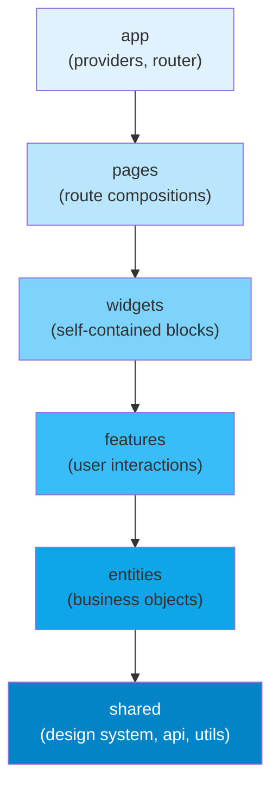

# [FEE-509] Feature-Sliced Design 與資料夾架構

:::info
Feature-Sliced Design（FSD）將前端程式碼組織成六個具有嚴格單向依賴規則的 layer：`app → pages → widgets → features → entities → shared`。較高的 layer 可以匯入較低的 layer；反向匯入是無條件禁止的。團隊 MUST 透過 lint 規則（`eslint-plugin-boundaries` 或 `@feature-sliced/eslint-config`）強制執行這些邊界——沒有工具強制執行的非正式慣例將在數週內崩潰。對於路由數量少於約 10 個或開發人員少於 3 人的應用程式，團隊 SHOULD NOT 應用 FSD；在小規模應用中，layer 的儀式感超過了其帶來的效益。
:::

## 簡介

當前端應用程式的元件數量超過數十個之後，程式碼的組織方式就成為一個真正重要的問題。扁平的 `components/` 資料夾在數百個檔案的重量下崩潰。沒有明確規則的 `features/` 資料夾——什麼構成一個 feature，什麼是共享工具——會產生交叉匯入的混亂，沒有任何自動化工具能理清。團隊常常在 code review 中耗費數小時爭論一個新檔案應該放在哪裡，卻只能眼睜睜看著這個決定在六個月後的重構中被推翻——而那次重構從來沒有人有足夠的精力完成。前端應用程式的資料夾結構不是一個表面上的問題——它是一個架構決策，決定了新工程師能多快找到方向、有經驗的工程師能多有把握地做出變更，以及程式庫在團隊成員和產品範圍演進時如何優雅地保持結構或崩潰。

Feature-Sliced Design 是一種方法論——不是函式庫、不是框架、不是工具——它用一套有明確理由支撐的顯式規則回答了資料夾結構的問題。它於 2021 年左右正式規範，此後在歐洲前端社群及其他地方被越來越多的團隊採用。FSD 的核心洞見是：前端程式碼自然地形成一個依賴層級：應用程式引導程序依賴頁面組合，頁面組合依賴獨立的 UI 區塊，UI 區塊依賴用戶互動邏輯，用戶互動邏輯依賴業務物件，業務物件依賴領域無關的工具函式。FSD 為這些層級命名——layers——並將它們之間的依賴方向編纂為無條件規則，而非指導方針。

這條規則的價值在於可測試性和可替換性。當 `features/add-to-cart` 被禁止從 `features/checkout` 匯入任何內容時，add-to-cart feature 就可以完全獨立地進行測試。當 `entities/product` 被禁止從 `features/` 匯入任何內容時，Product 實體的資料形狀和顯示元件可以在不了解任何 feature 副作用的情況下被提取到共享函式庫或被替換。這是以資料夾慣例表達的架構思維：依賴反轉的紀律，不是應用於類別層級，而是應用於檔案系統邊界。深入理解 FSD 意味著不只理解它的 layer 名稱，還要理解每個邊界存在的具體原因，以及它防止的是哪類問題。

## 原則

團隊 MUST 將 `src/` 目錄組織為以下順序的六個 FSD layer（從高到低）：`app`、`pages`、`widgets`、`features`、`entities`、`shared`。依賴規則是無條件的：任何 layer 中的模組 MAY 從其下方的任何 layer 匯入，並且 MUST NOT 從其上方的任何 layer 或同一 layer 中的同級 slice 匯入。`features/add-to-cart` 模組從 `features/checkout` 匯入的違規，與從 `pages/checkout` 匯入同樣嚴重。Layer 邊界不是團隊可以自行解釋的軟慣例——它是可由機器強制執行的不變量。

團隊 MUST 使用自動化 lint 強制執行 layer 邊界。帶有明確 `boundaries/element-types` 規則設定的 `eslint-plugin-boundaries`，或包裝了 `eslint-plugin-boundaries` 並提供 FSD 特定預設值的 `@feature-sliced/eslint-config`，MUST 被添加到專案的 ESLint 設定中並在 CI 中執行。非正式強制執行——code review 評論、文件、團隊協議——將在數週內失效。隨著團隊成員變動、截止日期壓力增加，以及程式庫增長到沒有任何人能在記憶中保持完整結構的程度，規則只有在機器對每個 pull request 強制執行時才能存活。Lint 設定不是可選的基礎設施；它是規則的實作。

對於路由數量少於約 10 個或活躍開發人員少於 3 人的應用程式，團隊 SHOULD NOT 應用 FSD。低於這個規模，layer 開銷——六個頂層資料夾、關於新抽象屬於哪個 layer 的心智模型、隨著理解演進在 layer 之間移動程式碼的摩擦——超過了組織效益。組織良好的 `src/components/`、`src/hooks/`、`src/utils/` 和 `src/pages/` 對於小型應用程式已經足夠，不需要完整的 FSD layer 模型。團隊 SHOULD 誠實地評估其應用程式的複雜度，然後再承諾採用 FSD；將 FSD 改造到不需要它的程式庫中，只會產生形式而不產生清晰度。

團隊 MUST 保持 `shared` 領域無關。`shared` layer 包含設計系統基元、已設定的 API 客戶端、工具函式和型別輔助工具。它 MUST NOT 包含對業務領域的引用——沒有 `useProductStore`、沒有 `CartItem` 型別、沒有特定於訂單領域的 `formatOrderTotal` 格式化器。每個 `shared` 的消費者都耦合到其內容；`shared` 中的領域概念成為每個從 `shared` 匯入的 layer 的傳遞依賴。領域概念屬於 `entities`。

## 設計思考

FSD 的六個 layer 不是任意的劃分——每一個都對應前端程式碼必須處理的特定責任類型，每個邊界都對應規則防止的特定耦合類型。

`shared` layer 是基礎。它包含一切穩定、可重用且領域無關的內容：元件函式庫（Button、Input、Modal）、已設定的 axios 實例或 query client 設定，以及 `formatCurrency`、`debounce`、`cn()` 等工具函式。`shared` 程式碼的定義特徵是它對業務領域沒有意見。Button 元件不知道它是提交訂單還是篩選產品目錄。Axios 實例不知道存在哪些端點。這個 layer 應該是程式庫中最穩定的；對 `shared` 的更改具有最廣泛的影響範圍，因為所有其他 layer 都可能依賴它。

`entities` layer 包含業務物件：代表 Product、User、Order、CartItem 等領域概念的資料形狀、顯示元件和 store schema。一個 entity 是對業務所關心事物的描述，表達為 TypeScript 介面、渲染該形狀的顯示元件，以及可選的 Zustand slice 或 React Query key factory，用於管理該 entity 的伺服器狀態。關鍵是，entities 不包含由用戶互動觸發的副作用——`ProductCard` entity 元件顯示一個產品，但加入購物車按鈕的點擊處理程序是一個 `feature`，不是 entity 的一部分。

`features` layer 包含帶有副作用的用戶互動：當用戶做某事時發生的邏輯。加入購物車、提交付款、篩選產品列表、登入、提交評論。一個 feature slice 通常包含一個 UI 元件（觸發器或表單）、一個 model（mutation、store action、thunk），有時還有一個型別檔案。Features 從 `entities`（渲染 entity 的顯示元件或讀取 entity 型別）和 `shared`（UI 基元和 API 客戶端）匯入，但絕不從其他 features 或更高的 layer 匯入。這個約束意味著 features 可以獨立測試：`features/add-to-cart` 的測試不需要執行中的 `features/checkout` 模組。

`widgets` layer 將 features 和 entities 組合成獨立的 UI 區塊：`ProductGrid`、`CartSidebar`、`CheckoutSummary`、`UserProfileHeader`。Widget 是設計師在頁面佈局中會識別為獨立區段的單位。Widgets 管理自己的本地狀態和資料獲取；它們是 entity 層級以上最大的 UI 重用單位。Widget 邊界回答了「如何跨多個頁面重用複雜的、有狀態的 UI 區塊？」這個問題——答案是將其提升為 widget。

`pages` layer 包含路由層級的組合。頁面元件匯入 widgets 和 features，將它們組裝成完整的頁面佈局，並提供路由特定的設定（頁面標題、元資料、捲動恢復）。Pages 是輕量的；它們的工作是組合，而非邏輯。如果頁面元件積累了大量業務邏輯，那些邏輯應該被提取到 feature 或 widget 中。Pages 是應用程式的資訊架構（其路由）與元件層級相遇的地方；它們應該讀起來像是應用程式的清晰目錄。

`app` layer 是應用程式的入口點。它包含 providers（React Query 的 `QueryClientProvider`、router、theme providers、error boundary 包裝器）、router 設定本身和全域 CSS。`app` layer 是唯一可以從所有其他 layer 匯入的 layer——它是組合根（composition root）。

**決策表：**

| 情境 | FSD | 扁平 Feature 資料夾 |
|---|---|---|
| 大型團隊（5人以上），所有權邊界不清 | 是 | 否 |
| 單一應用中有多個產品領域 | 是 | 否 |
| 小型應用（< 20 個路由，1-2 人） | 否 | 是 |
| 函式庫（非產品應用程式） | 否 | 領域驅動分組 |
| 團隊已熟悉領域資料夾 | 可選 | 如果應用一致 |

團隊最常犯錯的設計思考問題是橫切關注點放在哪裡。認證狀態是一個常見例子：許多 features 和 widgets 都需要它，但它本身不是一個 feature。答案是 `entities/session` 或 `entities/user`——已認證的用戶是一個業務物件（entity），而 session 狀態是該 entity 的 store。需要檢查認證的 feature slices 從 `entities/session` 匯入，而非從 `features/login` 匯入。`features/login` slice 處理互動（表單、mutation、重定向），但產生的 session 狀態存在於 entity layer，任何 feature 都可以讀取它，而無需從另一個 feature 匯入。

另一個常見的設計問題是如何處理頁面內的狀態——太具體而不屬於 entity，但又在同一頁面的 widget 和 feature 之間共享。答案通常是三種之一：將狀態提升到組合兩者的 widget（widgets 可以保持本地狀態）；將一個小型共享 model 提取到 `entities`；或者接受這是 FSD 模型在增加摩擦而沒有增加清晰度的情況，這是應用程式可能已經超越了 FSD 乾淨結構並需要更具上下文特定的架構決策的訊號。FSD 是一個起始框架，而非阻止務實判斷的約束。

## 最佳實踐

**在違反規則之前就在 CI 中強制執行 layer 規則，而非之後。** 在綠地專案中添加 `eslint-plugin-boundaries` 的成本是三十分鐘的設定。在 layer 違規已經積累的程式庫上改造它的成本是以天或週計算的重構專案。在專案開始時安裝外掛、編寫 `boundaries/element-types` 規則，並在 CI 管道中執行 `eslint --max-warnings 0`。每個引入 layer 違規的 pull request 都會使建置失敗。推遲這個設定的團隊不可避免地在第一個 sprint 就積累了「現在修復成本太高」的違規，而這些違規永遠不會被修復。

**以領域概念命名 slices，而非技術角色。** `features/add-to-cart/` slice 的命名是清晰的：它描述了產品領域中的用戶動作。`features/button-handler/` slice 不是：它描述了一個技術角色，而非領域概念。FSD 的 slice 名稱應該讀起來像是應用程式領域的詞彙表：`entities/product`、`entities/cart-item`、`features/apply-discount-code`、`widgets/checkout-summary`。當新工程師讀取 `src/` 目錄時，他們應該能夠僅從 slice 名稱重建產品的主要用戶流程。如果不能，命名需要改進。

**保持每個 slice 的公開 API 明確。** 每個 slice SHOULD 通過一個明確只重新匯出其他 slices 所需內容的 `index.ts` barrel 檔案暴露其公開介面。內部模組——只在 slice 內部使用的輔助工具、不打算用於外部組合的中間元件——不應從 barrel 重新匯出。這使 slice 預期的公開表面積清晰，並防止通過深層內部匯入逐漸產生耦合。Barrel 檔案是 slice 的契約；對 barrel 的更改是對其他 slices 的破壞性變更。

**不要讓 widgets 積累業務邏輯。** Widget layer 是一個組合 layer。Widget 的工作是匯入 feature 和 entity 元件、在佈局中排列它們、管理本地 UI 狀態（開/關、選中的分頁、捲動位置），並發起資料獲取。當 widget 開始積累領域特定的驗證邏輯、mutation 副作用或業務規則時，這些關注點應該被提取到 feature slice，然後由 widget 組合它。一個難以孤立測試的 widget——因為它包含複雜的業務邏輯而非組合——是邏輯需要下移到 `features` 的訊號。

**將 `shared/ui` 視為設計系統，而非垃圾桶。** `shared/ui` 資料夾應該只包含真正領域無關的元件：基元（Button、Input、Checkbox）、佈局工具（Stack、Grid）、反饋元件（Toast、Modal、Spinner）和排版元素。當 `shared/ui` 中的元件開始接收引用領域概念的 props——`product` prop、`orderId` prop、`cartItemCount` prop——它已經超出了 `shared` layer 的範圍，應該移動到 `entities` 或 `widgets`。保持 `shared/ui` 純粹使得未來將設計系統提取為獨立套件成為可能，而無需帶入業務領域程式碼。

**增量遷移，而非一次全部完成。** 對於在現有程式庫上採用 FSD 的團隊，一次性移動每個檔案的大爆炸遷移是一種高風險、低回報的方法。相反，識別一個有界限的領域（產品目錄、結帳流程），並對其應用 FSD 結構，同時保持程式庫的其餘部分不變。建立 `eslint-plugin-boundaries` 設定，對遷移的領域嚴格強制執行，並將未遷移的部分標記為臨時遺留例外。隨著新功能添加到未遷移的區域，使用 FSD 結構添加它們，並更新 ESLint 設定以強制執行新的添加。遷移有機地收斂，而非需要專門的重構 sprint。

**使用路徑別名使匯入路徑可讀。** FSD 在 layer 之間導航時會產生如 `../../entities/product/model/types` 這樣的匯入路徑。這些相對路徑是冗長且脆弱的——移動一個目錄層級的檔案需要更新每個匯入。設定 TypeScript 的 `paths`（以及對應的 Vite 或 Webpack alias）以允許絕對匯入：`@entities/product`、`@features/add-to-cart`、`@shared/ui`。這使 layer 成員資格在任何匯入語句中一目了然，並消除了計算 `../` 段的認知負擔。Alias 慣例也使 `eslint-plugin-boundaries` 模式更容易設定，因為具有一致前綴的絕對匯入更容易用 glob 模式匹配。

## Mermaid 圖



圖表展示了嚴格的單向依賴鏈。每個箭頭代表唯一允許的匯入方向。沒有反向箭頭，沒有跨 layer 箭頭（`pages` 元件直接從 `shared` 匯入是允許的；箭頭代表最大允許方向，而非唯一允許的連接），也沒有同一層級的 layer 之間的交叉箭頭。從淺藍到深藍的漸層代表在堆疊中向下移動時穩定性增加和領域特定性降低：`app` 是最易變的（每次添加新路由時都會改變），`shared` 是最穩定的（對它的更改影響上方的一切）。

## 範例

### 電商應用程式資料夾結構

以下樹狀結構展示了一個完整的 FSD 結構電商應用程式。請注意每個 layer 包含命名的 slices，每個 slice 包含一小組命名良好的內部資料夾（`ui/`、`model/`、`lib/`）。

```
src/
├── app/
│   ├── providers.tsx          # React Query, Router, Theme providers
│   └── router.tsx             # createBrowserRouter config
│
├── pages/
│   ├── catalog/
│   │   └── index.tsx          # imports widgets/product-grid, features/filter-products
│   └── checkout/
│       └── index.tsx          # imports widgets/cart-summary, features/submit-order
│
├── widgets/
│   ├── product-grid/
│   │   └── index.tsx          # imports features/add-to-cart, entities/product
│   └── cart-summary/
│       └── index.tsx          # imports entities/cart-item, features/remove-from-cart
│
├── features/
│   ├── add-to-cart/
│   │   ├── ui/AddToCartButton.tsx
│   │   └── model/addToCart.ts  # store action / mutation
│   └── filter-products/
│       ├── ui/FilterPanel.tsx
│       └── model/filterStore.ts
│
├── entities/
│   ├── product/
│   │   ├── ui/ProductCard.tsx  # display only, no side effects
│   │   └── model/types.ts      # Product interface
│   └── cart-item/
│       └── model/types.ts
│
└── shared/
    ├── ui/                     # Button, Input, Modal — domain-agnostic
    ├── api/                    # axios instance, query client config
    └── lib/                    # formatCurrency, debounce, cn()
```

### 匯入違規與正確重構

初學者最常引入的違規是較低 layer 的模組在完成動作後需要導覽到某處——並向上伸手到 `pages` 模組獲取路由路徑。

```ts
// 違規 — features/add-to-cart 從 pages 匯入（較高的 layer）
// features/add-to-cart/model/addToCart.ts
import { checkoutRoute } from '../../pages/checkout'; // 錯誤：較低 layer 從較高 layer 匯入

async function addToCartAndRedirect(productId: string) {
  await cartApi.add(productId);
  router.navigate(checkoutRoute.path); // 使用在 pages 中定義的路徑
}
```

正確的方法是保持 feature 的責任範圍窄（加入購物車、發送事件或更新狀態），讓頁面或 widget 處理導覽，或將共享路由常數移到 `shared/lib/routes.ts`，讓 feature 和頁面都可以匯入它而不互相依賴。

```ts
// 正確重構 — 將共享契約提取到 entities 或 shared

// shared/lib/routes.ts — 路由常數屬於 shared，不屬於 pages
export const ROUTES = {
  checkout: '/checkout',
  catalog:  '/catalog',
} as const;

// entities/cart-item/model/types.ts — entity 型別，任何 layer 都可以匯入
export interface CartItem { id: string; productId: string; quantity: number; }

// features/add-to-cart/model/addToCart.ts
import type { CartItem } from '@entities/cart-item/model/types'; // 正確：從較低 layer 匯入
import { ROUTES } from '@shared/lib/routes';                      // 正確：shared layer

export async function addToCart(item: CartItem) {
  await cartApi.add(item);
  // 發送事件或更新 store——讓頁面決定是否導覽
  cartStore.add(item);
}
```

```ts
// pages/catalog/index.tsx — 頁面在 feature 動作後處理導覽
import { addToCart } from '@features/add-to-cart';
import { ROUTES } from '@shared/lib/routes';

function CatalogPage() {
  async function handleAddToCart(item: CartItem) {
    await addToCart(item);
    router.navigate(ROUTES.checkout); // 導覽是頁面的關注點，不是 feature 的
  }
  // ...
}
```

這個重構遵守了 layer 規則，並產生了更清晰的關注點分離：feature 知道如何將商品加入購物車；頁面知道在該動作完成後應用程式應該發生什麼。

### ESLint 設定

下面的 `eslint-plugin-boundaries` 設定實作了完整的 FSD 依賴規則。每個違反 layer 順序的匯入都會產生 ESLint 錯誤，當設定 `--max-warnings 0` 時在 CI 中封鎖 pull request。

```js
// .eslintrc.js — 自動強制執行 layer 邊界
module.exports = {
  plugins: ['boundaries'],
  extends: ['plugin:boundaries/recommended'],
  settings: {
    'boundaries/elements': [
      { type: 'app',      pattern: 'src/app/*' },
      { type: 'pages',    pattern: 'src/pages/*' },
      { type: 'widgets',  pattern: 'src/widgets/*' },
      { type: 'features', pattern: 'src/features/*' },
      { type: 'entities', pattern: 'src/entities/*' },
      { type: 'shared',   pattern: 'src/shared/*' },
    ],
  },
  rules: {
    'boundaries/element-types': ['error', {
      default: 'disallow',
      rules: [
        { from: 'app',      allow: ['pages', 'widgets', 'features', 'entities', 'shared'] },
        { from: 'pages',    allow: ['widgets', 'features', 'entities', 'shared'] },
        { from: 'widgets',  allow: ['features', 'entities', 'shared'] },
        { from: 'features', allow: ['entities', 'shared'] },
        { from: 'entities', allow: ['shared'] },
        { from: 'shared',   allow: [] },
      ],
    }],
  },
};
```

`default: 'disallow'` 設定意味著 `rules` 陣列中未明確允許的任何匯入都是錯誤。這是正確的預設值——它強制對哪些跨 layer 匯入是允許的做出有意識的決定，而非靜默允許所有匯入並只標記已知違規。對於使用 TypeScript 路徑別名的專案，也添加 `boundaries/no-private` 規則，以防止匯入進入 slice 的內部模組而不是使用其公開 barrel：

```js
// 強制基於 barrel 的公開 API 的額外規則
'boundaries/no-private': 'error',
```

### TypeScript 路徑別名設定

在 `tsconfig.json` 中設定路徑別名，使匯入路徑可讀，並與 `boundaries/element-types` 模式對齊：

```json
{
  "compilerOptions": {
    "baseUrl": ".",
    "paths": {
      "@app/*":      ["src/app/*"],
      "@pages/*":    ["src/pages/*"],
      "@widgets/*":  ["src/widgets/*"],
      "@features/*": ["src/features/*"],
      "@entities/*": ["src/entities/*"],
      "@shared/*":   ["src/shared/*"]
    }
  }
}
```

使用 Vite 時，添加對應的 `resolve.alias` 設定：

```ts
// vite.config.ts
import { defineConfig } from 'vite';
import path from 'path';

export default defineConfig({
  resolve: {
    alias: {
      '@app':      path.resolve(__dirname, 'src/app'),
      '@pages':    path.resolve(__dirname, 'src/pages'),
      '@widgets':  path.resolve(__dirname, 'src/widgets'),
      '@features': path.resolve(__dirname, 'src/features'),
      '@entities': path.resolve(__dirname, 'src/entities'),
      '@shared':   path.resolve(__dirname, 'src/shared'),
    },
  },
});
```

## 常見錯誤

**將業務邏輯放入 `shared`。** `shared` layer 必須是領域無關的。`shared/lib/` 中的 `useProductStore` hook 意味著 `shared` 的每個消費者——包括 `entities`、`features`、`widgets` 和 `pages`——都傳遞性地耦合到產品領域。當產品領域改變時，影響範圍包括應用程式中的一切。業務邏輯屬於 `entities`（用於被動的領域狀態和型別）或 `features`（用於主動的、有副作用的邏輯）。一個可靠的啟發式方法：如果你無法在完全不相關的應用程式中重用該模組而不做業務領域更改，它就不屬於 `shared`。

**直接的跨 feature 匯入。** `features/add-to-cart` 從 `features/checkout` 匯入是同層違規。兩個 slices 都在同一 layer 層級；兩者都不允許依賴另一個。這種模式通常在一個 feature 需要訪問另一個 feature 維護的狀態或型別時出現。正確的解決方案是識別共享概念並將其下移到匯集點 layer：如果 `add-to-cart` 需要來自 `checkout` 的 `CartItem` 型別，那個型別屬於 `entities/cart-item`，兩個 features 都可以獨立匯入它。如果 `add-to-cart` 需要觸發 `checkout` 中的行為，那個觸發應該通過 `entities` 或 `shared` 中的事件或共享狀態進行，`checkout` feature 訂閱它。

**對小型應用程式應用 FSD。** 一個有 8 個路由和 1-2 個開發者的應用程式卻有六層資料夾，這是配置開銷偽裝成架構。FSD 的合法價值——slices 的獨立可測試性、強制執行的所有權邊界、新程式碼的明確放置規則——需要足夠的規模，使這些效益超過維護 layer 紀律的開銷。在小規模時，layer 儀式消耗了本應花在產品品質上的心理頻寬。使用更簡單的結構（feature 資料夾、`components/` 和 `hooks/` 拆分、頁面共置檔案），當應用程式和團隊成長到缺乏明確邊界正在造成實際問題時，再升級到 FSD。

**不一致的 slice 公開 API 紀律。** FSD 的價值取決於 slices 是具有明確公開表面的黑盒。當工程師直接從內部 slice 模組匯入（`import { productQueryKey } from '@features/add-to-cart/model/queryKeys'` 而非 barrel）時，他們創建了對實作細節的隱性依賴。下一個重構 feature 內部模組結構的工程師將在整個程式庫中破壞匯入，而沒有任何可見的契約違規。在 ESLint 中強制執行 `boundaries/no-private` 規則，並將 barrel 檔案視為 slice 的唯一公開介面。

**將太多關注點移入 widget layer。** Widgets 應該組合，而非決策。一個 `ProductGrid` widget 包含分頁邏輯、排序順序 mutation、分析追蹤和空狀態內容文字，已經成為了一個縮小版的頁面。當 widget 增長超出佈局組合和本地 UI 狀態管理時，這是一個訊號：一些責任應該被提取到專用的 feature slices（分頁作為 `features/paginate-products`，排序順序作為 `features/sort-products`），並將 widget 縮減回其適當的角色——佈局組合器。

## 相關 FEE

- [FEE-501：元件組合模式](./501.md) — FSD 按 layer 組織組合單位；理解組合模式澄清了為什麼 widgets 與 features 分離，以及它們如何組合 entities
- [FEE-508：微前端架構](./508.md) — 每個微前端使用 FSD 是大規模時的常見配對；每個 MFE 擁有自己的 layer 層級並向 shell 暴露版本化的公開 API
- [FEE-805：Monorepo 與工作區](../Build%20Tooling%20and%20Module%20Systems/805.md) — 路徑別名強制執行匯入慣例；Monorepo workspace packages 可以乾淨地對應到 FSD layers 或跨 layer 的共享套件
- [FEE-1102：使用 Testing Library 進行元件測試](../Testing%20Strategies/1102.md) — Layer 邊界直接對應到測試隔離邊界；一個沒有向上匯入的 feature slice 可以在完全隔離於 pages 和 widgets 的情況下進行測試

## 參考資料

- [Feature-Sliced Design 官方文件](https://feature-sliced.design/) — FSD 的權威規範；涵蓋六 layer 模型、segment 慣例（`ui/`、`model/`、`lib/`、`api/`、`config/`）、遷移指南，以及每個 layer 邊界的理由；layer 定義和單向依賴規則的最權威來源
- [`eslint-plugin-boundaries` 文件](https://github.com/javierbrea/eslint-plugin-boundaries) — 用於強制執行包括 FSD layer 規則在內的架構邊界的 ESLint 外掛；記錄了 `boundaries/element-types` 規則、`default: 'disallow'` 模式，以及匹配 slice 路徑的 glob 模式語法
- [Alex Kondov — Tao of React（資料夾結構章節）](https://alexkondov.com/tao-of-react/) — 廣受引用的 React 專案結構文章，涵蓋扁平、feature 分組和 FSD 風格組織之間的權衡；基於真實專案經驗，並解釋了每種方法在不同規模下的成本
- [Khalil Stemmler — Solid Book（分層架構）](https://solidbook.io/) — 支撐 FSD layer 模型的 DDD 和整潔架構概念；解釋了為什麼單向依賴是 FSD 在資料夾層級解決的耦合問題的正確解決方案
- [FSD GitHub 討論與範例](https://github.com/feature-sliced/documentation/discussions) — FSD 社群的公開討論論壇；包含關於邊緣情況的真實世界問題（認證狀態放在哪裡、如何處理跨 feature 狀態）、範例儲存庫，以及核心團隊對模糊情況的澄清
- [FSD v2 遷移指南](https://feature-sliced.design/docs/migration/from-v1) — 記錄了 FSD v2 中 `processes` layer 的移除和正確的六 layer 模型；與遇到引用已廢棄 `processes` layer 的舊版 FSD 教程的團隊相關
