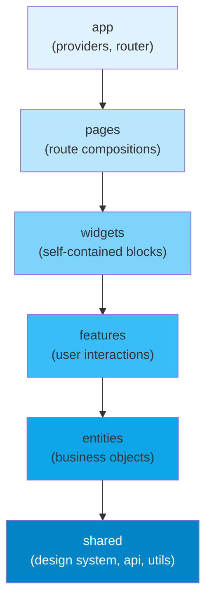

# [FEE-509] Feature-Sliced Design 與資料夾架構

:::info
Feature-Sliced Design（FSD）是一套最多六個 layer 的固定詞彙，搭配嚴格的單向依賴規則：`app → pages → widgets → features → entities → shared`。較高的 layer 可以匯入較低的 layer；反向匯入是無條件禁止的。並非每個專案都需要用滿六個 layer：大多數專案從 `app`、`shared`、`pages` 開始，再隨著領域成長逐步加入 `entities`、`features`、`widgets`。團隊 MUST 使用架構 lint 工具（例如 FSD 官方的零設定工具 Steiger，或 `eslint-plugin-boundaries`）強制執行所採用的 layer。沒有工具強制執行的非正式慣例會在數週內崩潰。在只有少數路由、一兩位開發者的小型應用程式上，FSD 的 layer 開銷往往超過其效益；等到跨領域耦合或所有權不清開始造成摩擦時再導入。
:::

## 背景

當前端應用程式的元件數量超過數十個之後，程式碼的組織方式就成為一個真正重要的問題。扁平的 `components/` 資料夾在數百個檔案的重量下崩潰。`features/` 資料夾若沒有明確規則界定什麼構成一個 feature、什麼是共享工具，就會產生交叉匯入的混亂，沒有任何自動化工具能理清。團隊常常在 code review 中耗費數小時爭論一個新檔案應該放在哪裡，卻只能眼睜睜看著這個決定在六個月後的重構中被推翻，而那次重構從來沒有人有足夠的精力完成。前端應用程式的資料夾結構是一個架構決策，而非表面問題：它決定了新工程師能多快找到方向，以及有經驗的工程師能多有把握地更動既有程式碼，而不會弄壞自己不知道存在的關聯。

Feature-Sliced Design 是一種方法論：一套固定的檔案組織慣例與依賴規則，沒有套件需要安裝。它源自 2010 年代後期的俄語系前端社群（規範文件的著作權標示為 2018 年），此後累積了國際性的採用者。目前的規範在 2024 年 10 月釋出第一個穩定版 v2.0，同年 11 月又推出 v2.1 修訂版。FSD 與框架無關：規範本身對專案採用哪種 UI 框架或狀態管理工具沒有限制，各種框架與技術棧的團隊都在使用它。本文範例採用 React 與類似 Zustand 的 store，純粹是為了具體呈現；layer 規則本身在任何框架下都是一樣的。FSD 的核心洞見是：前端程式碼自然地形成一個依賴層級：應用程式引導程序依賴頁面組合，頁面組合依賴獨立的 UI 區塊，UI 區塊依賴用戶互動邏輯，用戶互動邏輯依賴業務物件，業務物件依賴領域無關的工具函式。FSD 將這些層級命名為 *layer*，並透過工具在違規時讓建置失敗，以機械化的方式強制執行它們之間的依賴方向。

這條規則的價值在於可測試性和可替換性。當 `features/add-to-cart` 被禁止從 `features/checkout` 匯入任何內容時，add-to-cart feature 就能在不需要執行中的 checkout 模組的情況下獨立測試。當 `entities/product` 被禁止從 `features/` 匯入任何內容時，Product 實體的資料形狀和顯示元件就能被提取到共享函式庫或被替換，而不必逐一稽核每個接觸過它的 feature。每個 layer 邊界都是為了防止某一種特定的耦合而存在；下面各節會逐一說明是哪一種。

## 視覺對比



這張圖展示了 FSD 完整的六個 layer 詞彙，以及它們之間允許的最大依賴方向；實際專案通常只會用到其中需要的 layer。每個箭頭代表唯一允許的匯入方向。沒有反向箭頭，沒有跳層箭頭（`pages` 元件直接從 `shared` 匯入是允許的：箭頭代表允許的最大距離，而非唯一允許的連接），也沒有同一 layer 內同級元素之間的匯入。從淺藍到深藍的漸層反映穩定性：`app` 最易變，因為每次新增路由都會改變它；`shared` 最穩定，因為對它的更改會影響上方的一切。

## 範例

### 電商應用程式資料夾結構

以下樹狀結構展示了一個完整的 FSD 結構電商應用程式。請注意每個 layer 包含命名的 slices，每個 slice 包含一小組命名良好的內部資料夾（`ui/`、`model/`、`lib/`）。

```
src/
├── app/
│   ├── providers.tsx          # React Query, Router, Theme providers
│   └── router.tsx             # createBrowserRouter config
│
├── pages/
│   ├── catalog/
│   │   └── index.tsx          # imports widgets/product-grid, features/filter-products
│   └── checkout/
│       └── index.tsx          # imports widgets/cart-summary, features/submit-order
│
├── widgets/
│   ├── product-grid/
│   │   └── index.tsx          # imports features/add-to-cart, entities/product
│   └── cart-summary/
│       └── index.tsx          # imports entities/cart-item, features/remove-from-cart
│
├── features/
│   ├── add-to-cart/
│   │   ├── ui/AddToCartButton.tsx
│   │   └── model/addToCart.ts  # store action / mutation
│   └── filter-products/
│       ├── ui/FilterPanel.tsx
│       └── model/filterStore.ts
│
├── entities/
│   ├── product/
│   │   ├── ui/ProductCard.tsx  # display only, no side effects
│   │   └── model/types.ts      # Product interface
│   └── cart-item/
│       └── model/types.ts
│
└── shared/
    ├── ui/                     # Button, Input, Modal: domain-agnostic
    ├── api/                    # axios instance, query client config
    └── lib/                    # formatCurrency, debounce, cn()
```

### 匯入違規與正確重構

初學者最常引入的違規，是較低 layer 的模組在完成動作後需要導覽到某處，於是伸手向上到 `pages` 模組取得路由路徑。

```ts
// 違規 — features/add-to-cart 從 pages 匯入（較高的 layer）
// features/add-to-cart/model/addToCart.ts
import { checkoutRoute } from '../../pages/checkout'; // 錯誤：較低 layer 從較高 layer 匯入

async function addToCartAndRedirect(productId: string) {
  await cartApi.add(productId);
  router.navigate(checkoutRoute.path); // 使用在 pages 中定義的路徑
}
```

正確的方法是保持 feature 的責任範圍窄（加入購物車、發送事件或更新狀態），讓頁面或 widget 處理導覽，或將共享路由常數移到 `shared/lib/routes.ts`，讓 feature 和頁面都可以匯入它而不互相依賴。

```ts
// 正確重構 — 將共享契約提取到 entities 或 shared

// shared/lib/routes.ts — 路由常數屬於 shared，不屬於 pages
export const ROUTES = {
  checkout: '/checkout',
  catalog:  '/catalog',
} as const;

// entities/cart-item/model/types.ts — entity 型別，任何 layer 都可以匯入
export interface CartItem { id: string; productId: string; quantity: number; }

// features/add-to-cart/model/addToCart.ts
import type { CartItem } from '@entities/cart-item/model/types'; // 正確：從較低 layer 匯入
import { ROUTES } from '@shared/lib/routes';                      // 正確：shared layer

export async function addToCart(item: CartItem) {
  await cartApi.add(item);
  // 發送事件或更新 store，交由頁面決定是否導覽
  cartStore.add(item);
}
```

```ts
// pages/catalog/index.tsx — 頁面在 feature 動作後處理導覽
import { addToCart } from '@features/add-to-cart';
import { ROUTES } from '@shared/lib/routes';

function CatalogPage() {
  async function handleAddToCart(item: CartItem) {
    await addToCart(item);
    router.navigate(ROUTES.checkout); // 導覽是頁面的關注點，不是 feature 的
  }
  // ...
}
```

這次重構讓 feature slice 保持不含導覽邏輯，交由頁面決定後續要發生什麼。

### ESLint 設定

下面的 `eslint-plugin-boundaries` 設定實作了 FSD 依賴規則。每個違反 layer 順序的匯入都會產生 ESLint 錯誤，當設定 `--max-warnings 0` 時會在 CI 中封鎖 pull request。有兩列需要一個容易被忽略的小調整：`app` 和 `shared` 並沒有自己的 slice，只有 segment（`ui/`、`model/`、`lib/` 等資料夾），因此它們各自的 `allow` 清單都必須包含自己的型別，才能允許 segment 之間互相參照，例如 `shared/lib` 匯入 `shared/ui`。

```js
// .eslintrc.js — 自動強制執行 layer 邊界
module.exports = {
  plugins: ['boundaries'],
  extends: ['plugin:boundaries/recommended'],
  settings: {
    'boundaries/elements': [
      { type: 'app',      pattern: 'src/app/*' },
      { type: 'pages',    pattern: 'src/pages/*' },
      { type: 'widgets',  pattern: 'src/widgets/*' },
      { type: 'features', pattern: 'src/features/*' },
      { type: 'entities', pattern: 'src/entities/*' },
      { type: 'shared',   pattern: 'src/shared/*' },
    ],
  },
  rules: {
    'boundaries/element-types': ['error', {
      default: 'disallow',
      rules: [
        { from: 'app',      allow: ['app', 'pages', 'widgets', 'features', 'entities', 'shared'] },
        { from: 'pages',    allow: ['widgets', 'features', 'entities', 'shared'] },
        { from: 'widgets',  allow: ['features', 'entities', 'shared'] },
        { from: 'features', allow: ['entities', 'shared'] },
        { from: 'entities', allow: ['shared'] },
        { from: 'shared',   allow: ['shared'] },
      ],
    }],
  },
};
```

`default: 'disallow'` 設定意味著 `rules` 陣列中未明確允許的任何匯入都是錯誤。這是正確的預設值。它強制對哪些跨 layer 匯入是允許的做出有意識的決定，而非靜默允許所有匯入並只標記已知違規。對於使用 TypeScript 路徑別名的專案，也添加 `import/no-internal-modules` 規則，以防止匯入進入 slice 的內部模組而不是使用其公開 barrel：

```js
// Enforce barrel-only imports within each layer slice
// (using eslint-plugin-import, a separate plugin from eslint-plugin-boundaries)
'import/no-internal-modules': ['error', {
  // Allow: src/features/add-to-cart (the slice barrel)
  // Disallow: src/features/add-to-cart/ui/Button (private sub-path)
  allow: [
    'src/*/index',
    'src/*/*/index',
  ],
}],
```

### TypeScript 路徑別名設定

在 `tsconfig.json` 中設定路徑別名，使匯入路徑可讀，並與 `boundaries/element-types` 模式對齊：

```json
{
  "compilerOptions": {
    "baseUrl": ".",
    "paths": {
      "@app/*":      ["src/app/*"],
      "@pages/*":    ["src/pages/*"],
      "@widgets/*":  ["src/widgets/*"],
      "@features/*": ["src/features/*"],
      "@entities/*": ["src/entities/*"],
      "@shared/*":   ["src/shared/*"]
    }
  }
}
```

使用 Vite 時，添加對應的 `resolve.alias` 設定：

```ts
// vite.config.ts
import { defineConfig } from 'vite';
import path from 'path';

export default defineConfig({
  resolve: {
    alias: {
      '@app':      path.resolve(__dirname, 'src/app'),
      '@pages':    path.resolve(__dirname, 'src/pages'),
      '@widgets':  path.resolve(__dirname, 'src/widgets'),
      '@features': path.resolve(__dirname, 'src/features'),
      '@entities': path.resolve(__dirname, 'src/entities'),
      '@shared':   path.resolve(__dirname, 'src/shared'),
    },
  },
});
```

## 最佳實踐

**從專案第一天就在 CI 中強制執行 layer 規則。** 在綠地專案中加入架構 lint 工具，成本只要幾分鐘。在 layer 違規已經累積的程式庫上事後補裝，成本則是以天或週計算的重構專案。有兩個工具可以做到這件事。Steiger 是 FSD 團隊自家的零設定 lint 工具，內建 FSD 專屬規則（`fsd/forbidden-imports`、`fsd/public-api`、`fsd/insignificant-slice`），不需要任何設定就能開始使用。`eslint-plugin-boundaries` 搭配官方的 `@feature-sliced/eslint-config` 預設集，則是給已經投資 ESLint 邊界工具的團隊的通用替代方案。在專案初期就安裝其中一個，並在 CI 中以零容忍度執行。延後這項設定的團隊，往往會在第一個 sprint 就累積出「現在修起來成本太高」的違規，而這些違規永遠不會被修好。

**以領域概念為 slice 命名。** `features/add-to-cart/` slice 的命名很清楚：它描述了產品領域中的一個用戶動作。`features/button-handler/` slice 描述的則是技術角色，讀者從中看不出應用程式在做什麼。FSD 的 slice 名稱應該讀起來像應用程式領域的詞彙表：`entities/product`、`entities/cart-item`、`features/apply-discount-code`、`widgets/checkout-summary`。當新工程師讀取 `src/` 目錄時，應該光靠 slice 名稱就能重建產品的主要用戶流程。

**保持每個 slice 的公開 API 明確。** 每個 slice SHOULD 透過 `index.ts` barrel 檔案暴露公開介面，明確地只重新匯出其他 slice 需要的內容。只在 slice 內部使用的輔助工具，或不打算用於外部組合的中間元件，都不應該出現在 barrel 中。這讓 slice 預期的公開表面清楚可見，並防止透過深層內部匯入逐漸產生耦合。Barrel 檔案是 slice 的契約；對它的更改對每個使用者來說都是破壞性變更。

**不要讓 widgets 累積業務邏輯。** Widget layer 是一個組合 layer。Widget 的工作是匯入 feature 和 entity 元件、將它們排入版面、管理本地 UI 狀態（開/關、選中的分頁、捲動位置），並發起資料獲取。當 widget 開始累積領域特定的驗證邏輯、mutation 副作用或業務規則時，這些關注點應該移到 feature slice，再由 widget 組合它。一個難以孤立測試的 widget，因為它包含的是業務邏輯而非組合，就是邏輯需要下移到 `features` 的訊號。

**將 `shared/ui` 當作有嚴選公開表面的設計系統。** `shared/ui` 資料夾應該只包含真正領域無關的元件：基元（Button、Input、Checkbox）、版面工具（Stack、Grid）、回饋元件（Toast、Modal、Spinner）和排版元素。當屬於 `shared/ui` 的元件開始接收引用領域概念的 props，例如 `product` prop、`orderId` prop、`cartItemCount` prop，就代表它已經超出 `shared` layer 的範圍，應該移到 `entities` 或 `widgets`。保持 `shared/ui` 的純粹，才有可能在未來將設計系統提取為獨立套件，而不必帶入業務領域程式碼。

**一次遷移一個有界領域。** 對於在既有程式庫上採用 FSD 的團隊，一次性在單一 pull request 中搬移每個檔案的大爆炸式遷移，是高風險、低回報的做法。應該改為找出一個有界領域（產品目錄、結帳流程），對它套用 FSD 結構，同時讓程式庫其餘部分維持不變。設定架構 lint 工具，對已遷移的領域嚴格強制執行，並將未遷移的部分標記為暫時的遺留例外。當新功能加入未遷移的區域時，以 FSD 結構建置它們，並擴充 lint 設定以涵蓋新增的部分。遷移會有機地收斂，而不需要專門的重構 sprint。

**必須（MUST）將程式碼放進正確的 layer，但不需要六個 layer 都用滿。** FSD 的六個 layer 是固定的詞彙與固定的依賴順序，不是每個專案都得填滿的清單。官方規範明白指出，大多數專案只需要其中幾個：通常一開始只有 `app`、`shared`、`pages`，再隨著領域成長、耦合開始造成痛點時加入 `entities`、`features`、`widgets`。在專案實際採用的 layer 之內，模組禁止從其上方的 layer 匯入，slice 也禁止從同一 layer 的同級 slice 匯入。例外是 `app` 和 `shared`：這兩者都沒有被切分成 slice，各自是由 segment 組成的單一元素，而非多個領域 slice，因此它們的 segment 可以自由互相參照。

**不應（SHOULD NOT）對小型應用程式套用 FSD。** 在只有少數路由、一兩位開發者的應用程式上，FSD 的 layer 開銷往往超過它帶來的效益。在這個規模下，組織良好的 `src/components/`、`src/hooks/`、`src/utils/`、`src/pages/` 結構就已經足夠。等到所有權邊界變得模糊，或跨領域耦合開始造成摩擦時，再導入 FSD。

**必須（MUST）保持 `shared` 領域無關。** `shared` layer 禁止包含對業務領域的引用：沒有 `useProductStore`、沒有 `CartItem` 型別、沒有領域特定的格式化器。每個使用 `shared` 的地方都會耦合到它的內容，所以放進 `shared` 的領域概念，會變成其他每個 layer 的傳遞依賴。

**使用路徑別名讓匯入路徑可讀。** FSD 在 layer 之間導覽時，會產生像 `../../entities/product/model/types` 這樣的匯入路徑。這種相對路徑冗長又脆弱：把檔案移動一個目錄層級，就得更新每一個參照到它的匯入。設定 TypeScript 的 `paths`（以及對應的 Vite 或 Webpack alias），允許使用絕對匯入：`@entities/product`、`@features/add-to-cart`、`@shared/ui`。這讓 layer 歸屬在任何匯入陳述式中都一目了然，也不必再計算 `../` 的層數。別名慣例也讓 `eslint-plugin-boundaries` 和 Steiger 的規則更容易設定，因為前綴一致的絕對匯入更容易用 glob 模式比對。

## 設計思考

FSD 的六個 layer 各自對應前端程式碼必須處理的一種特定責任，而每個邊界則對應依賴規則所防止的一種特定耦合。

`shared` layer 是基礎。它包含一切穩定且可重用的內容：元件函式庫（Button、Input、Modal）、共用的 API client 實例（在上面的範例中是 Axios），以及 `formatCurrency`、`debounce`、`cn()` 等工具函式。`shared` 程式碼的定義特徵，是它對業務領域沒有意見。Button 元件不知道它是用來提交訂單還是篩選產品目錄。API client 不知道存在哪些端點。這個 layer 應該是程式庫中最穩定的；對 `shared` 的更改影響範圍最廣，因為其他每個 layer 都可能依賴它。

`entities` layer 包含業務物件：代表 Product、User、Order、CartItem 等領域概念的資料形狀、顯示元件和 store schema。一個 entity 是對業務所關心事物的描述，表達為 TypeScript 介面、渲染該形狀的顯示元件，以及用於管理該 entity 伺服器狀態的可選 Zustand slice 或 React Query key factory。關鍵在於，entities 不包含由用戶互動觸發的副作用。`ProductCard` entity 元件會顯示一個產品，但加入購物車按鈕的點擊處理程式屬於 `feature`，不屬於 entity。

`features` layer 包含帶有副作用的用戶互動：當用戶做某事時發生的邏輯。加入購物車、提交付款、篩選產品列表、登入、提交評論。一個 feature slice 通常包含一個 UI 元件（觸發器或表單）、一個 model（mutation、store action、thunk），有時還有一個型別檔案。Features 從 `entities`（渲染 entity 的顯示元件或讀取 entity 型別）和 `shared`（UI 基元和 API 客戶端）匯入，但絕不從其他 features 或更高的 layer 匯入。這個約束意味著 features 可以獨立測試：`features/add-to-cart` 的測試不需要執行中的 `features/checkout` 模組。

`widgets` layer 將 features 和 entities 組合成獨立的 UI 區塊：`ProductGrid`、`CartSidebar`、`CheckoutSummary`、`UserProfileHeader`。Widget 是設計師會在頁面版面中識別為獨立區段的單位。Widgets 管理自己的本地狀態和資料獲取；它們是 entity 層級以上最大的 UI 重用單位。Widget 邊界回答了一個反覆出現的問題：如何跨多個頁面重用複雜、有狀態的 UI 區塊？答案就是把它提升為 widget。

`pages` layer 包含路由層級的組合。頁面元件匯入 widgets 和 features，將它們組裝成完整的頁面版面，並提供路由特定的設定（頁面標題、中繼資料、捲動恢復）。Pages 是輕量的；它們的工作是組合，而非邏輯。如果頁面元件累積了大量業務邏輯，那些邏輯應該被提取到 feature 或 widget 中。Pages 是應用程式的資訊架構與元件層級交會的地方；它們應該讀起來像應用程式清楚的目錄。

`app` layer 是應用程式的入口點。它包含 providers（React Query 的 `QueryClientProvider`、router、theme providers、error boundary 包裝器）、router 設定本身，以及全域 CSS。`app` layer 是唯一可以從所有其他 layer 匯入的 layer，它是組合根（composition root）。

**決策表：**

| 情境 | FSD | 扁平 Feature 資料夾 |
|---|---|---|
| 大型團隊（5人以上），所有權邊界不清 | 是 | 否 |
| 單一應用中有多個產品領域 | 是 | 否 |
| 小型應用（少數路由，1-2 人） | 否 | 是 |
| 函式庫（非產品應用程式） | 否 | 領域驅動分組 |
| 團隊已熟悉領域資料夾 | 可選 | 如果應用一致 |

團隊在設計思考上最常出錯的問題，是橫切關注點該放在哪裡。認證狀態是常見的例子：許多 features 和 widgets 都需要它，但它本身並不是一個 feature。答案是 `entities/session` 或 `entities/user`：已認證的用戶是一個業務物件，而 session 狀態就是該 entity 的 store。需要檢查認證的 feature slices 應該從 `entities/session` 匯入，而不是從 `features/login` 匯入。`features/login` slice 負責處理互動（表單、mutation、重新導向）；產生的 session 狀態存在於 entity layer，任何 feature 都能讀取它，而不必從另一個 feature 匯入。

另一個常見的設計問題，是如何處理頁面內的狀態：這種狀態太具體而不屬於 entity，卻又在同一頁面的 widget 和 feature 之間共享。答案通常是三種之一：將狀態提升到組合兩者的 widget（widgets 可以保持本地狀態）；將一個小型共享 model 提取到 `entities`；或者接受這是 FSD 模型在增加摩擦而沒有增加清晰度的情況，這是應用程式可能已經超越了 FSD 乾淨結構並需要更具上下文特定的架構決策的訊號。FSD 是一個起始框架，而非阻止務實判斷的約束。

## 常見錯誤

**不一致的 slice 公開 API 紀律。** FSD 的價值取決於 slices 是具有明確公開表面的黑盒。當工程師直接從內部 slice 模組匯入（`import { productQueryKey } from '@features/add-to-cart/model/queryKeys'` 而非 barrel）時，他們創建了對實作細節的隱性依賴。下一個重構 feature 內部模組結構的工程師將在整個程式庫中破壞匯入，而沒有任何可見的契約違規。在 ESLint 中強制執行 `import/no-internal-modules` 規則，並將 barrel 檔案視為 slice 的唯一公開介面。

**把太多關注點搬進 widget layer。** 一個包含分頁邏輯、排序 mutation、分析追蹤和空狀態文案的 `ProductGrid` widget，已經變成縮小版的頁面；組合才是它唯一的工作。當 widget 成長超出版面組合和本地 UI 狀態管理的範圍時，把多出來的部分提取到專用的 feature slices（分頁作為 `features/paginate-products`，排序作為 `features/sort-products`），並把 widget 縮減回版面組合器的角色。

## 相關主題

- [元件組合模式](/zh-tw/Component%20Architecture%20and%20Design%20Patterns/501)：FSD 依 layer 組織組合單位；理解組合模式能釐清為什麼 widgets 與 features 分離，以及它們如何組合 entities。
- [微前端架構](/zh-tw/Component%20Architecture%20and%20Design%20Patterns/508)：每個微前端各自使用 FSD，是大規模時常見的搭配；每個 MFE 擁有自己的 layer 層級，並向 shell 暴露版本化的公開 API。
- [Monorepo 與工作區](/zh-tw/Build%20Tooling%20and%20Module%20Systems/805)：路徑別名強制執行匯入慣例；monorepo workspace 套件可以乾淨地對應到 FSD layers 或跨 layer 的共享套件。
- [使用 Testing Library 進行元件測試](/zh-tw/Testing%20Strategies/1102)：layer 邊界直接對應到測試隔離邊界；一個沒有向上匯入的 feature slice 可以在隔離於 pages 和 widgets 的狀態下測試。

## 參考資料

- [Feature-Sliced Design 官方文件](https://feature-sliced.design/) — FSD 的權威規範；涵蓋 layer 模型、segment 慣例（`ui/`、`model/`、`lib/`、`api/`、`config/`）、遷移指南，以及每個 layer 邊界的理由；是 layer 定義、單向依賴規則，以及特定專案實際需要哪些 layer 的最權威來源
- [Steiger — Feature-Sliced Design Linter](https://github.com/feature-sliced/steiger) — FSD 團隊自家的零設定架構 lint 工具；內建 FSD 專屬規則（`fsd/forbidden-imports`、`fsd/public-api`、`fsd/insignificant-slice`），是多數 FSD 專案在加裝通用 ESLint 邊界外掛之前會優先採用的工具
- [`eslint-plugin-boundaries` 文件](https://github.com/javierbrea/eslint-plugin-boundaries) — 一款通用的架構邊界 ESLint 外掛，可用來編碼 FSD 的 layer 規則，適合已經投資 ESLint 相關工具鏈的團隊；記錄了 `boundaries/element-types` 規則、`default: 'disallow'` 模式，以及匹配 slice 路徑的 glob 模式語法
- [`@feature-sliced/eslint-config`](https://github.com/feature-sliced/eslint-config) — FSD 組織自家的 ESLint 設定套件（beta）；將隔離、公開 API、layer 範圍和命名規則整合進單一預設集
- [Alex Kondov — Tao of React（資料夾結構章節）](https://alexkondov.com/tao-of-react/) — 廣受引用的 React 專案結構文章，涵蓋扁平、feature 分組和 FSD 風格組織之間的權衡；基於真實專案經驗，並解釋了每種方法在不同規模下的成本
- [Khalil Stemmler — Solid Book（分層架構）](https://solidbook.io/) — 支撐 FSD layer 模型的 DDD 和整潔架構概念；解釋了為什麼單向依賴是 FSD 在資料夾層級解決的耦合問題的正確解決方案
- [FSD GitHub 討論與範例](https://github.com/feature-sliced/documentation/discussions) — FSD 社群的公開討論論壇；包含關於邊緣情況的真實世界問題（認證狀態放在哪裡、如何處理跨 feature 狀態）、範例儲存庫，以及核心團隊對模糊情況的澄清
- [FSD 遷移指南：從 v1 到 v2](https://feature-sliced.design/docs/guides/migration/from-v1) — 記錄了從 v1 到 v2 的過渡與 layer 模型，包括 v2 引入的可選 `processes` layer；FSD v2.0 已將 `processes` 標記為棄用，建議將其內容移入 `features`（需要存取頁面時則移入 `app`），適合遇到仍將 `processes` 視為現行做法的舊版 FSD 教學的團隊參考
