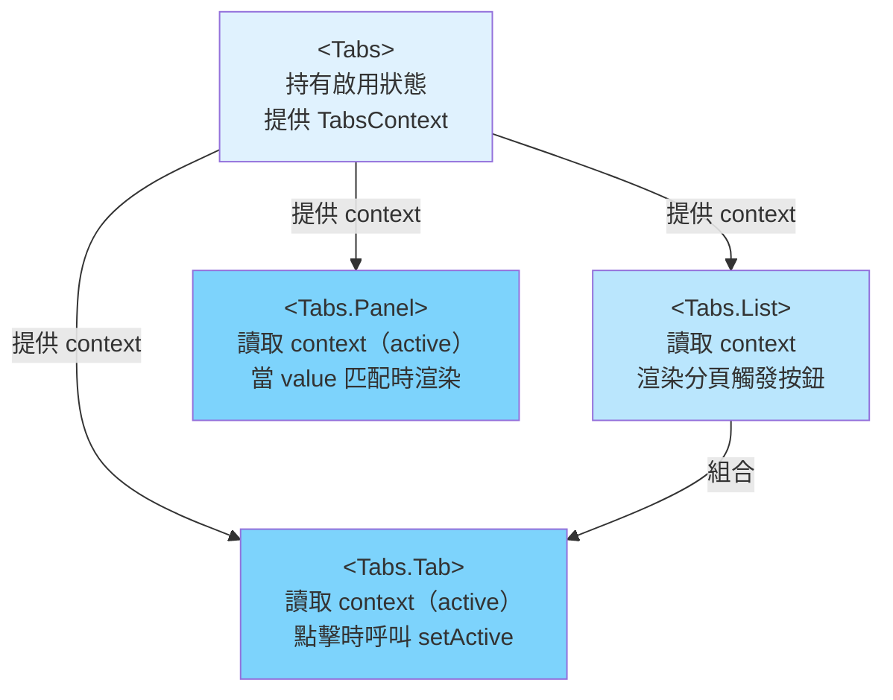

# 複合元件模式

複合元件模式將複雜的 UI 元件組織為一組相互協作的子元件，這些子元件透過 context provider
共享隱式狀態，而非在每個層級都以 props 傳遞。以 `<Tabs>` 元件為例，若它對外暴露
`<Tabs.List>`、`<Tabs.Tab>` 與 `<Tabs.Panel>`，這就是複合元件：父元件 `Tabs` 管理目前啟用的
分頁，而每個子元件則透過 context 讀取或修改該狀態，`<Tabs>` 的使用者不需要將啟用狀態明確地
傳遞給每個子元件。這個模式正是「如何設計一個有狀態的元件，讓使用者能夠自由重新排列其內部的
各個可動部件？」的解答。

這個模式廣泛應用於元件函式庫（Radix UI、Headless UI、React Aria、Reach UI），因為它能產生
靈活、可組合且明確的 API。使用者控制子元件的 DOM 結構與排列順序；父複合元件則控制共享行為。
這種分離讓元件在不需要分叉（fork）原始碼的情況下也能輕鬆客製化。一個提供 `<Dialog>` 複合元件
的設計系統，可以讓各個團隊依照自身設計需求自由排列標題、內容與底部區域，將子元件包裝在動畫
容器或額外的版面元素中，甚至完全省略某些子元件——而設計系統的作者無需事先預見每位使用者的
所有需求。

複合元件模式是 context（provider/consumer）的一種具體應用，其中 provider 是一個元件，
consumer 是其指定的子元件。它有別於提供全域狀態的通用 context provider：複合元件的 context
僅限定於特定的元件樹，在該範圍之外毫無意義。這種限定範圍是一個重要的設計約束。`<Tabs>` 的
context 不會洩漏至 `<Tabs>` 邊界之外；同一頁面上的兩個 `<Tabs>` 實例各自管理其獨立的
context。理解這種範圍限制——並透過 context 防護模式來強制執行——是區分設計良好的複合元件與
「恰好住在元件內的全域狀態管理方案」的關鍵所在。

## 原則

對於具有多個可動部件、且元件使用者需要個別控制的有狀態 UI 元件——分頁、手風琴、下拉選單、
對話框、選單、命令面板等類似結構——工程師應該（SHOULD）使用複合元件模式。替代方案——將所有
設定以 props 傳入的單一元件——會造成 prop 爆炸，並限制版面彈性。一個
`<Tabs tabs={tabConfig} renderPanel={renderPanel} activeIndex={activeIndex}
onTabChange={onTabChange} tabListClassName={tabListClassName} panelClassName={panelClassName} />`
的簽名，會隨著需求的演進無止境地增長。複合模式讓使用者擁有結構控制權，同時將行為狀態保留在
父元件內部。使用者的程式碼讀起來如同描述意圖的標記，而非設定黑盒子的資料結構。

工程師禁止（MUST NOT）使用複合元件的 context 在非明確父子關係的任意元件之間共享狀態。複合
元件的 context 是實作狀態，而非應用程式狀態。在非 `<Tabs>` 子孫的元件中存取 `<Tabs>` 的
context，是一種錯誤，表明 context 被誤用為全域儲存。複合元件的 context 必須（MUST）在於預期
父元件之外被使用時，拋出具描述性的錯誤訊息。需要在不共享有意義父元件邊界的遠端元件之間共享
狀態的工程師，應該（SHOULD）採用專用的狀態管理方案——Zustand、Jotai、React Query 或類似
工具——而非誤用複合元件的 context 來達成此目的。

## 設計思維

### 靜態 vs. 動態子元件

將子元件附加到父元件的慣用方式是靜態屬性模式：`Tabs.List = TabsList`、
`Tabs.Tab = TabsTab`、`Tabs.Panel = TabsPanel`。此方式將整個複合元件家族統整在單一匯入
表面下。使用者只需 `import { Tabs } from './Tabs'`，便可透過 `Tabs.List`、`Tabs.Tab` 和
`Tabs.Panel` 存取所有子元件，無需逐一個別匯入。靜態屬性模式同時也具備靜態命名匯出所沒有的
自我說明性：在 IDE 中檢視 `Tabs` 的匯出時，可以立即看到協作子元件的完整家族，讓開發者不需
閱讀原始碼或文件也能發現這個模式。父元件與子元件之間的關係被編碼在模組結構中，因此任何匯入
`Tabs` 的工程師都能一覽 API 的完整表面積。

另一種方式是從同一個模組將子元件作為個別的具名匯出：
`export { Tabs, TabsList, TabsTab, TabsPanel }`。這在某些情境下有其適用性，例如程式碼庫中
tree-shaking 的粒度對 bundle 大小至關重要，或自動化 API 文件工具對具名匯出的支援優於靜態
屬性。然而，個別的具名匯出對使用者增加了認知負擔：他們必須知道哪些匯出屬於同一個複合元件
家族，並且必須逐一按名稱匯入。對於將開發者體驗列為首要考量的元件函式庫而言，靜態屬性是建議
的做法，因為它能明確呈現家族結構並減少匯入的樣板程式碼。

在 TypeScript 中，靜態屬性模式要求父函式的類型包含子元件屬性。慣用的做法是定義函式後再指派
子元件屬性，讓 TypeScript 推斷合併後的類型：`function Tabs(...) {...}; Tabs.List = TabsList;
Tabs.Panel = TabsPanel`。推斷出的類型同時攜帶呼叫簽名與靜態屬性。部分團隊偏好使用
`Object.assign(Tabs, { List: TabsList, Panel: TabsPanel })`，以便在單一表達式中明確表示
附加關係並回傳合併後的類型。兩種方式產生相同的執行期行為；選擇哪種是風格偏好，應在設計系統
層級決定並一致地應用於所有複合元件。

### 彈性插槽版面

以分頁元件的兩種 API 風格進行比較。以 props 驅動的風格接受扁平設定：
`<Tabs tabs={[...]} panels={[...]} />`。這種方式在簡單情境下很簡潔，但缺乏彈性——使用者
無法在分頁列與面板之間插入額外元素，無法自訂子元件的順序，也無法省略設計中不需要的子元件。
若設計要求在分頁列末尾加入一個操作按鈕，使用者必須要麼分叉元件，要麼新增自訂的
`renderTabListSuffix` prop，要麼以絕對定位繞過這個僵化的結構。隨著產品設計的演進，這種
僵化的 API 會持續累積越來越多的逃生艙口 prop，直到它的複雜度與所抽象的底層 DOM 相當。

複合元件風格則將 `<Tabs>`、`<Tabs.List>`、`<Tabs.Tab>` 和 `<Tabs.Panel>` 作為可組合的
片段對外暴露，使用者可以自行組裝：
`<Tabs><header><Tabs.List>...</Tabs.List><ActionButton /></header><Tabs.Panel>...</Tabs.Panel></Tabs>`。
任意的 DOM 元素——標題、分隔線、裝飾性元素、額外的工具列、版面包裝器——都可以出現在任何子
元件之間，無需修改複合元件本身的實作。這種結構上的自由度正是複合元件模式在設計系統與元件
函式庫工作中的主要動機，因為元件作者無法預見使用者千變萬化的版面需求。複合元件作者定義行為
合約（哪個分頁是啟用狀態、如何切換分頁），並將結構合約（分頁出現的位置、其周圍有什麼）完全
留給使用者決定。

這種做法的取捨是：複合元件要求使用者理解預期的結構。以 props 驅動的 `<Tabs>` 無論使用者
如何使用，都能靜默地組裝出分頁與面板之間正確的 ARIA 關係。複合 `<Tabs>` 則要求使用者將
`<Tabs.Panel>` 相對於 `<Tabs.List>` 正確放置——若使用者在 `<Tabs>` 邊界之外渲染
`<Tabs.Panel>`，context 防護會在執行期捕獲錯誤，但沒有編譯期機制確保結構合約被滿足。對於
始終以固定結構渲染的元件，以 props 驅動的 API 可能更易維護和測試。為單一團隊建構內部元件的
工程師，應該（SHOULD）在承諾採用複合模式之前，評估這種靈活度是否確實有需要。

### Context 防護模式

複合元件的 context 只在其父元件的元件樹中才有意義。在該樹之外使用 context——例如在根層級
渲染的元件中呼叫 `useTabsContext()`——會回傳 `undefined` 而非 context 物件，隨之產生的
錯誤（`Cannot read properties of undefined, reading 'active'`）並不會告訴開發者哪裡出了
問題。堆疊追蹤（stack trace）指向的是 hook 內部的那一行，而非子元件在 `<Tabs>` 邊界之外
渲染的位置。若沒有防護機制，要除錯這個問題需要了解 React context 預設值的運作方式，並認識
到 `null` context 表示「沒有 provider 祖先」——而這並非所有使用者都能具備的知識。

Context 防護模式完全解決了這個問題：自訂 hook 會檢查回傳的 context 是否有定義，若未定義
則拋出一個具描述性、出於設計意圖的錯誤。拋出的錯誤訊息
`'useTabsContext must be used within <Tabs>'` 立即指出了被違反的限制以及缺少的祖先元件。這
使得複合元件模式在子元件可能被提取至遠端檔案並獨立使用的大型程式碼庫中也能安全運作。防護
機制確保任何誤用都會在開發期間被捕獲，並提供具行動指引的訊息，而不是令人困惑的執行期錯誤。

防護機制除了錯誤訊息之外，還具有文件說明的功能。由於 `React.createContext(null)` 將預設值
設為 `null`，TypeScript 會將 context 類型推斷為 `TabsContextValue | null`。自訂 hook 的
防護在檢查之後將類型縮窄至 `TabsContextValue`，因此 hook 的使用者無需顯式類型斷言就能
獲得完整類型、非 nullable 的 context 值。這意味著防護不僅是執行期的安全網——它也是讓
TypeScript 為所有 hook 使用者推斷正確類型的機制，消除了散布在子元件實作中的 `!` 非空斷言
的需求。

### 受控 vs. 非受控複合元件

複合元件可以在內部管理其啟用狀態——這是非受控變體，由 `defaultValue` prop 提供初始值。使用
者提供初始值後退後一步；複合元件自行管理所有後續因使用者互動而產生的狀態轉換。這是大多數使
用情境的正確選擇：使用者無需編寫任何狀態管理程式碼就能獲得一個功能完整的元件。

受控變體將狀態管理委派給呼叫端：`value` prop 設定當前狀態，`onChange` callback 通知呼叫端
狀態變更的請求。複合元件不自行更新狀態；它只是在分頁被點擊時呼叫 `onChange`，並根據呼叫端
提供的 `value` 進行渲染。這是進階情境的正確選擇：將啟用分頁與 URL 參數同步、建構由外部業務
邏輯控制啟用步驟的精靈（wizard），或連結兩個複合元件使得更改其中一個會同步改變另一個。

透過 `value`/`defaultValue`/`onChange` 慣例同時提供兩種變體——與原生 HTML 表單輸入元素相同
的模型——能最大化可重用性。工程師應該（SHOULD）先實作非受控變體，然後在元件發布至共用函式庫
之前加入受控變體。支援兩種模式的一個實用實作模式，是使用「可控狀態」hook——一個接受 `value`、
`defaultValue` 和 `onChange` 的內部 hook，以尊重元件是否處於受控或非受控模式的方式回傳啟用
狀態與 setter。這個 hook 可以在設計系統的所有複合元件中提取並重用，使受控/非受控邏輯無需
為每個需要它的元件重新實作。

### 無障礙性與角色委派

複合元件是強制執行 ARIA 角色慣例的理想之處，讓使用者無需自行思考這些細節。`<Tabs.List>`
子元件知道自己應以 `role="tablist"` 渲染。`<Tabs.Tab>` 知道它需要 `role="tab"`、
`aria-selected`，以及一個供對應面板的 `aria-labelledby` 參照的 `id`。`<Tabs.Panel>` 知道
它需要 `role="tabpanel"` 和 `aria-labelledby` 屬性。若每個角色都由使用者負責，複合元件 API
就只是把 prop 爆炸換成了角色屬性爆炸。透過將 ARIA 要求編碼進子元件本身，複合元件作者可以
交付一個無障礙的元件，而無需讓使用者承擔無障礙性實作的細節。

複合元件模式也啟用了跨子元件的協調式 `id` 管理。每個 `<Tabs.Tab>` 與其對應的
`<Tabs.Panel>` 必須共享唯一的 `id`/`aria-labelledby` 關係，這若無子元件之間的共享狀態就
無法表達。在以 props 驅動的 API 中，使用者需要負責生成並傳遞這些 `id` 值，這既容易出錯又
繁瑣。在複合元件中，父元件可以使用 `React.useId()` 生成穩定的唯一前綴並注入 context，讓
每個 `<Tabs.Tab>` 和 `<Tabs.Panel>` 根據其 `value` prop 與共享前綴確定性地推導出
`id` 值。無論使用者新增或移除多少個分頁，ARIA 關係都能在建構時保持正確。

### 巢狀與多重 Context 層級

某些複合元件的子元件本身也是複合元件。`<Select>` 可能暴露 `<Select.Group>` 和
`<Select.Option>`，其中 `<Select.Group>` 是一個複合元件，它在消費父元件 `<Select>` context
的同時，也為 `<Select.Option>` 提供自己的 context。這形成了巢狀的 context 層級：`<Select>`
context 攜帶選取值，`<Select.Group>` context 則攜帶用於無障礙性分組的群組標籤。核心設計原則
是每個 context 層級只應攜帶該層級子元件所需的狀態——`<Select.Option>` 讀取兩個 context，
但從 `<Select>` context 讀取選取值，從 `<Select.Group>` context 讀取群組標籤。將這些合併
為單一 context 會將群組的實作與選取元件耦合在一起，使其更難獨立維護和測試。具有巢狀結構的
複合元件應該（SHOULD）每層使用獨立的 context，而非使用一個攜帶所有共享狀態的單一 context。

## 最佳實踐

**應該（SHOULD）將子元件作為父元件的靜態屬性（`Tabs.List`、`Tabs.Panel`）對外暴露，而非
作為個別的具名匯出。** 將子元件並置為靜態屬性，使元件家族在匯入時即可被發現，傳達出子元件
相互歸屬的訊息，並減少使用者需要管理的匯入表面積。`import { Tabs } from './Tabs'` 搭配
`<Tabs.Panel>` 在人體工學上優於 `import { Tabs, TabsPanel, TabsList } from './Tabs'`。靜態
屬性的方式也讓 JSX 中的 `Tabs.Panel` 清楚地表明它屬於 `Tabs` 家族，而非恰好擁有相同名稱
前綴的獨立元件；支援屬性自動補全的 IDE 會在使用者輸入 `Tabs.` 時列出完整的家族成員，減少
查閱外部文件的需求。對於 TypeScript 程式碼庫，`Tabs` 函式的類型以及 `Tabs.List`、
`Tabs.Tab`、`Tabs.Panel` 的類型，應該（SHOULD）全部宣告在同一個檔案中，讓複合元件的公開
API 一目了然。

**必須（MUST）在用於存取複合元件 context 的自訂 hook 中加入 context 防護。** 防護機制——
`if (!context) throw new Error('...')`——將令人困惑的 `undefined.someProperty` 執行期錯誤，
轉化為具有行動指引的錯誤訊息，告知開發者遺漏了哪個父元件。這在複合元件中比在全域 context
中更為重要，因為「使用元件必須是父複合元件的子孫」這個限制，對所有使用者而言並不一定顯而
易見，特別是那些只從設計系統套件匯入單一子元件而未閱讀完整文件的使用者。錯誤訊息必須（MUST）
同時指明 hook 名稱與預期的祖先元件：`'useTabsContext must be used within <Tabs>'` 是正確的；
`'Context not found'` 則不夠充分。在正式環境的建置中，防護機制應該（SHOULD）仍然保留：拋出
錯誤的成本遠低於靜默的 undefined 屬性存取所產生的不正確 UI 行為——後者在正式環境中極難
除錯。

**應該（SHOULD）為管理互動狀態的複合元件同時提供受控與非受控 API。** 一個只接受外部 `open`
prop 的手風琴元件，即使是最簡單的靜態頁面使用情境也需要連結狀態管理。一個提供 `defaultOpen`
prop 的手風琴元件，在簡單情境下完全不需要任何外部狀態。來自 HTML 表單輸入元素的
`value`/`defaultValue`/`onChange` 慣例是適當的模型：`value` 與 `onChange` 共同啟用受控
變體；單獨的 `defaultValue` 啟用非受控變體；若兩者皆未提供，應該（SHOULD）讓元件以合理的
預設狀態啟動。工程師應該（SHOULD）先實作非受控變體——它較為簡單且涵蓋大多數使用情境——然後
在元件發布至共用函式庫之前加入受控變體，因為事後加入受控行為往往需要破壞性的 API 變更，
迫使所有現有使用者更新其程式碼。

## 視覺呈現



## 範例

```jsx
import React from 'react';

// 1. 建立 context — null 表示「目前沒有父元件 Tabs」
const TabsContext = React.createContext(null);

// 2. Context 防護 hook — 在 <Tabs> 之外使用時拋出具描述性的錯誤
function useTabsContext() {
  const ctx = React.useContext(TabsContext);
  if (!ctx) throw new Error('useTabsContext must be used within <Tabs>');
  return ctx;
}

// 3. 父複合元件 — 透過 defaultValue 實現非受控模式
function Tabs({ defaultValue, children }) {
  const [active, setActive] = React.useState(defaultValue);
  // Memoize 避免每次父元件渲染時都讓所有 consumer 重新渲染
  const value = React.useMemo(() => ({ active, setActive }), [active]);
  return (
    <TabsContext.Provider value={value}>
      {children}
    </TabsContext.Provider>
  );
}

// 4. 子元件附加為靜態屬性
Tabs.List = function TabsList({ children }) {
  return <div role="tablist">{children}</div>;
};

Tabs.Tab = function Tab({ value, children }) {
  const { active, setActive } = useTabsContext();
  return (
    <button
      role="tab"
      aria-selected={active === value}
      onClick={() => setActive(value)}
    >
      {children}
    </button>
  );
};

Tabs.Panel = function Panel({ value, children }) {
  const { active } = useTabsContext();
  return active === value ? <div role="tabpanel">{children}</div> : null;
};

// 5. 使用者 — 完整的結構控制權，無需逐層傳遞啟用狀態
export function SettingsPage() {
  return (
    <Tabs defaultValue="profile">
      <Tabs.List>
        <Tabs.Tab value="profile">個人資料</Tabs.Tab>
        <Tabs.Tab value="security">安全性</Tabs.Tab>
      </Tabs.List>
      <Tabs.Panel value="profile"><ProfileForm /></Tabs.Panel>
      <Tabs.Panel value="security"><SecurityForm /></Tabs.Panel>
    </Tabs>
  );
}
```

## 常見錯誤

- **以 props 傳遞共享狀態，而非使用 context。** 將 `activeTab` prop 逐層傳遞給 `Tabs.List`
  再到每個 `Tabs.Tab`，重新製造了這個模式本來要解決的 prop drilling 問題。子元件必須（MUST）
  從 context 讀取共享狀態，而非從父元件渲染時傳入的 props。任何父元件渲染子元件並以 props
  向下傳遞啟用狀態的設計，都不是複合元件——它是傳統的父/子層級結構，使用者因此失去了促使
  採用此模式的結構自由度。
- **為多個不相關的複合元件使用單一的通用 context。** 一個同時持有分頁、對話框和手風琴狀態
  的 `UIContext`，混淆了不相關的元件狀態，擴大了重新渲染的範圍，並使防護模式無法正確執行。
  每個複合元件家族必須（MUST）擁有自己的專屬 context。
- **省略 context 防護，改用非 null 的預設值。** 將
  `React.createContext({ active: undefined, setActive: () => {} })` 設為預設值，雖然消除了
  錯誤，卻讓誤用變得不可見。在父元件之外渲染的子元件會靜默地接收預設值，產生無輸出或不正確
  的輸出而不報任何錯誤。防護模式——`null` 預設值搭配會拋出錯誤的 hook——才是正確的做法。
- **未對 context 值物件進行 memoize。** 在 provider 的 `value` prop 中直接建立 context 值
  物件——`value={{ active, setActive }}`——每次父元件渲染時都會建立新物件，導致所有 consumer
  在 `active` 或 `setActive` 皆未變動的情況下也會重新渲染。應使用 `React.useMemo` 包裹該
  值，以避免具有大量 consumer 的複合元件產生不必要的重新渲染。
- **將內部子元件作為公開匯出，卻不建立靜態屬性關係。** 將 `TabsTab` 和 `TabsPanel` 作為
  與 `Tabs` 並列的頂層具名匯出，失去了靜態屬性方式所提供的可發現家族結構。只匯入
  `TabsPanel` 的使用者，在 IDE 中沒有任何可見的提示告訴他們必須在 `<Tabs>` 祖先元件內
  渲染——而這正是 context 防護在執行期捕獲的情況。

## 相關 FEE

- [FEE-500 — 元件架構與設計模式總覽](./500.md)
- [FEE-501 — 元件組合模式](./501.md)
- [FEE-511 — Provider 層級與 Context 組合](./511.md)
- [FEE-603 — Context 與 Prop Drilling](../State%20Management/603.md)

## 參考資料

- [Kent C. Dodds: Compound Components Pattern](https://kentcdodds.com/blog/compound-components-with-react-hooks) —
  以 React hooks 介紹複合元件的權威教程；涵蓋 context 防護模式、靜態屬性慣例，以及相較於
  props 驅動 API 的設計動機
- [Radix UI: Primitive component examples](https://www.radix-ui.com/primitives/docs/overview/introduction) —
  完全建立在複合元件模式上的生產級元件函式庫；原始碼示範了大規模使用 context 防護、受控/
  非受控 API 以及 `defaultValue`/`value`/`onChange` 慣例的實作方式
- [React 官方文件: createContext](https://react.dev/reference/react/createContext) — React
  context 的權威參考資料，包括 provider/consumer 模型、context 預設值，以及 consumer 重新
  渲染的規則；理解複合元件模式底層機制的必讀文件
