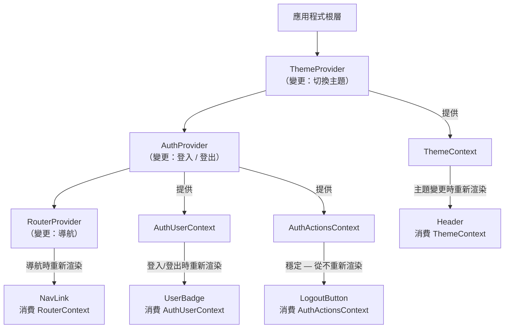

# Provider 層級與 Context 組合

React Context 藉由讓任何後代元件都能取用狀態，解決了 prop drilling 的問題，中間層元件無需逐層傳遞
資料。在規模較小的應用程式中，單一 context 往往已足夠；但隨著應用程式成長，context 的數量也會
增加——主題、身份驗證、語系、功能旗標、路由，以及各種業務領域的 context 陸續出現。問題不在於是
否使用 context，而在於如何組織多個 context、如何避免 context 值變更引發不必要的重新渲染，以及
如何以可維護的方式組合 context，使其不隨著時間演進而失控。

在應用程式根層疊加 `<ThemeProvider>`、`<AuthProvider>`、`<I18nProvider>` 的 provider 巢狀結構
是普遍的模式。挑戰在於，每次 context 值變更都會觸發樹中所有消費者重新渲染。當 theme context 的
值是一個在每次渲染時都會重新建立的大型物件時，所有消費者都會在每次父元件渲染時重新渲染，而不只是
在主題真正改變時才渲染。這意味著粗心的 provider 實作可能在不知不覺中讓整個應用程式承受與實際
資料變更毫無關係的重新渲染成本。這類效能問題在開發初期難以察覺，往往要等到使用者數量增多、
頁面複雜度提高後，才在效能分析中現形。

高效能 context 使用的關鍵洞察是：context 在 context 值的參考發生變化時，才會觸發消費者重新渲染。
對值物件進行記憶化（`useMemo`），或將大型 context 拆分為專注的 context——一個存放值、一個存放
dispatch 函式——可以控制重新渲染的範圍。理解這一點，讓團隊得以在不引發效能問題的情況下使用
context，而不必動輒轉向外部狀態管理函式庫。Context 本身並不慢；未經最佳化的 context 值才是問題
所在。掌握本文所述的兩條核心規則，大多數團隊都能在不引入額外依賴的情況下，讓 context 的效能
表現達到生產環境的要求。這也是 React 官方文件強調的觀點：context 是強大且足夠的工具，
只要正確使用，無需急於引入外部狀態管理函式庫。在著手改善 context 效能之前，建議先使用
React DevTools Profiler 量化問題，讓資料引導優化決策，避免過早最佳化帶來不必要的複雜度。

## 設計思維

### Context 值變更的重新渲染代價

在探討緩解模式之前，值得先精確理解 context 值變更如何傳播到重新渲染。當元件以 `value` prop
呼叫 `Context.Provider` 時，React 使用 `Object.is` 語義比較新值與前一個值——與記憶化 props
使用的同一種引用相等性檢查。若參考已改變，React 會排程樹中所有透過 `useContext` 或
`use(Context)` 訂閱了這個 context 的元件進行重新渲染。這會發生，無論新值在語義上是否等同於
前一個值。

這意味著每次渲染都重新建立其值物件的 provider——即使內容完全相同——都會在每次 provider 渲染時
重新渲染其所有消費者。一個將 `{ theme: 'dark', toggleTheme }` 作為新物件字面量傳遞的主題
provider，每當 provider 的任何祖先渲染時，都會導致每個主題化的元件重新渲染。這不是 React 的
bug；這是 `Object.is` 比較套用於物件參考的預期行為。開發者的責任是確保當 context 值的內容穩定時，其參考也是穩定的——這正是 `useMemo` 所提供的
功能。

理解這個 `Object.is` 比較的機制，是正確診斷「為何我的元件一直重新渲染」問題的前提。在 React
DevTools Profiler 中，由 context 值變更觸發的重新渲染會在「為何渲染？」欄位中標記為
「context changed」，這是識別 context 引起的效能問題的直接診斷線索。

### Context 選擇器模式

React 內建的 context API 在 context 值變更時，會通知所有消費者，且沒有機制讓消費者只訂閱值的
某一部分。這是有意為之的設計：React 的渲染模型不追蹤消費者讀取了 context 值的哪些屬性，因此
必須保守地在參考變更時重新渲染所有消費者。換言之，即使一個消費者只讀取了 context 中的一個欄位，
只要 context 物件的參考發生變化（無論是哪個欄位改變），該消費者都會重新渲染。內建的解決方案是
context 拆分——每個邏輯切片建立一個 context，讓消費者只訂閱自己需要的切片，藉此在不引入額外
函式庫的情況下達到選擇性訂閱的效果。

當拆分變得不切實際——例如，單一 context 確實擁有數十個獨立欄位，而各個消費者以不同組合讀取這些
欄位——選擇器函式庫提供了替代方案。Daishi Kato 開發的 `use-context-selector` 函式庫在標準
context API 之上包裝了訂閱機制，追蹤每個消費者存取了哪些欄位，並在已存取的欄位未發生變更時跳過
重新渲染。Zustand 和 Jotai 將這種行為作為其訂閱模型的核心功能內建，這也是開發者在反覆遭遇
context 效能問題後，往往遷移至這些函式庫的原因之一。

實務決策原則是：當 context 有兩到四個與變更頻率對應的自然分區時，優先拆分；當拆分會產生難以管理
的大量 provider，或訂閱拓撲確實是動態的時，再考慮引入選擇器函式庫。引入選擇器函式庫有不可忽視的
抽象成本——它需要在整個程式碼庫中將 `useContext` 替換為自訂 hook——因此效能收益必須可量測，才
值得付出這個代價。在決策之前，應先透過 React DevTools Profiler 或 `why-did-you-render` 等工具
量化重新渲染的頻率，確保問題確實存在，再引入額外的複雜度。

### 組合多個 Provider

擁有眾多全域 context 的應用程式，往往在應用根層形成深度巢狀的 provider 樹，例如 ThemeProvider
包裹 AuthProvider，AuthProvider 再包裹 I18nProvider，依此類推。這在功能上完全正確，但在視覺上
雜亂，且隨著 provider 數量增加，越來越難以閱讀與審查。`ComposeProviders`（又稱
`combineProviders`）模式將這種巢狀結構壓平為單一元件，接受一個 provider 元件陣列並以程式方式
組合它們。呼叫端的結果是一個 provider 的平坦清單，而非金字塔結構，讓審查全域 provider 集合
一目了然，也讓新增或移除全域 provider 只需修改一處清單，而非尋找正確的巢狀插入位置。

代價是抽象成本。接受 provider 元件作為陣列元素的 `ComposeProviders` 工具必須處理 provider
需要 `children` 之外的 props 的情況，這通常意味著需要用零參數工廠函式包裹每個 provider。這種
抽象需要每位新團隊成員在新增全域 provider 之前先理解這個模式。對於擁有五個或更少全域 provider
的應用程式，該模式的抽象開銷超過其可讀性收益。對於較大型的應用程式，該模式的價值在於將
provider 設定集中在一處，而無需讀者逐層追蹤巢狀的 JSX。值得注意的是，無論使用哪種組合方式，
provider 的順序仍然重要：若某個 provider 的實作依賴另一個 provider 提供的 context，它就必須
是另一個 provider 的後代，這個依賴關係必須在組合清單的排列順序中明確反映。

### React 19 的 use() Hook

React 19 引入了 `use()` hook，它可以內嵌讀取 context 值（以及 Promise），且不受 `useContext`
對呼叫位置的限制。與 `useContext` 不同，`use(Context)` 可以在條件式或迴圈中呼叫，因為 React
19 編譯器對 `use()` 呼叫的追蹤方式不同於傳統 hook。元件現在可以只在某個旗標啟用時才條件式地
讀取 context，或在對項目清單的迴圈中讀取 context，這在 React 18 及以前的版本中會違反 hook
的使用規則而導致執行階段錯誤。

這並不取代大多數現有模式中的 `useContext`，因為大多數 context 消費是非條件式的。`use(Context)`
真正的價值在於條件渲染場景——例如，一個包裝舊式第三方元素的元件，只有在 context 存在時才選擇性
地以 context 提供的設定增強它。在此之前，實現這一點需要無論如何都呼叫 `useContext`（無論
context 是否存在），或將元件重構為兩個部分，在邊界處進行條件呼叫。這兩種變通方式都增加了元件
的複雜度，而 `use(Context)` 讓這類模式的實作變得直觀。

在 React 19 環境中工作的團隊應該（SHOULD）將 `use(Context)` 理解為針對特定條件模式的附加能力，
而非重構現有 `useContext` 呼叫的理由。`use(Context)` 的效能特性遵循與 `useContext` 相同的規則：
消費者在 context 值的參考發生變更時重新渲染。在決定是否採用 `use(Context)` 時，關鍵問題是
「這個 context 消費是否確實是條件式的？」——若答案是否定的，繼續使用 `useContext` 即可，不必
為了使用新語法而改變已運作良好的程式碼。

### Provider 放置策略

並非所有 context provider 都屬於應用程式根層。全域關切——主題、身份驗證、語系、功能旗標——屬於
根層，因為它們在各處都被消費。業務領域特定和功能層級的 context，應放置在樹中包含所有消費者的最
低位置元件。管理單一對話框開關狀態的 `DialogContext` 應位於功能元件層級，而非應用根層。複合元件
context（見 FEE-510）應位於複合元件父元件內部本身。

將 provider 放置得比必要位置更高，會增加重新渲染範圍：provider 下方子樹中的每個元件都是潛在的
消費者，即使它不使用 context。更實際地說，這讓 context 的範圍變得隱晦——閱讀程式碼庫的人無法
從元件樹中判斷哪些元件預期會使用該 context。將 provider 推至最低適用範圍，使依賴關係在元件層級
中顯而易見，並將 context 值變更的影響範圍限制在真正需要該狀態的功能上。

應用根層 provider 與子樹 provider 也有不同的生命週期影響。應用根層 provider 通常掛載一次並在
整個工作階段中存在。子樹 provider 隨其功能樹的掛載和卸載而生滅，這意味著除非在外部持久化，
否則其狀態會在卸載時重置。理解這一差異，可以防止開發者誤以為子樹 context 狀態能在卸載並重新
掛載功能樹的導航事件後得以保留。

在評估 provider 放置位置時，一個有效的啟發式方法是從消費者出發，沿著元件樹向上追溯，找到涵蓋所
有消費者的最近共同祖先——這個祖先就是 provider 的理想放置點。若共同祖先是應用程式根元件，則全域
放置是合理的；若共同祖先是某個功能模組的入口元件，則 provider 就屬於那個功能模組。這種從消費者
反推祖先的方法，避免了「為了方便而全域化」的傾向，使 provider 的位置決策有明確的技術依據。在
程式碼審查時，若看到新增的 context 被提升至應用根層，應主動詢問其消費者是否確實遍佈全域，這個
習慣能有效防止 provider 層級在長期維護中逐漸膨脹，演變成難以審計的全域狀態容器。

## 最佳實踐

**必須（MUST）使用 `useMemo` 對物件和陣列 context 值進行記憶化，以防止所有 context 消費者產生
多餘的重新渲染。** 每次渲染時產生新物件參考的 context 值，會導致每個消費者在每次 provider 渲染
時重新渲染，即使資料沒有任何改變。這是 context 引發效能問題最常見的單一原因。規則很簡單：如果
傳遞給 `Context.Provider` 的值是物件字面值，就必須（MUST）用 `useMemo` 包裹。`useMemo` 呼叫
的依賴陣列必須（MUST）包含物件中所有的基本型別值或參考，以確保記憶化的值在任何實際輸入改變時
都能更新。若某個屬性是穩定的函式（例如以 `useCallback` 或 `useMemo` 建立且依賴陣列為空的
函式），它可以安全地包含在值物件中而不會影響物件的穩定性——但前提是包裹它的外層物件本身也必須
被 `useMemo` 記憶化。穩定的屬性加上未被記憶化的物件，結果仍是不穩定的物件，這是工程師在拆分
context 時最容易犯下的細節錯誤之一。

**應該（SHOULD）將大型 context 拆分為獨立變更的較小、專注的 context。** 涵蓋主題、使用者、
購物車和 UI 狀態的單體 `AppContext`，在任何部分變更時都會觸發所有消費者重新渲染。拆分為
`ThemeContext`、`UserContext`、`CartContext` 和 `UIContext`，讓每個消費者只訂閱自己需要的切片。
多個 context provider 的額外開銷，與實際應用中眾多消費者所節省的重新渲染相比微不足道。拆分時，
應該（SHOULD）首先按變更頻率分組，其次按邏輯關切分組：始終一起變更的兩項狀態可以共享一個
context 而不會造成效能損失。拆分的粒度不需要追求最細，也不應過度分割——以識別「哪些消費者只需
要資料、哪些消費者只需要操作函式」作為拆分決策的優先依據，通常足以解決實務上的大多數效能問題。

**應該（SHOULD）將 context provider 放置在樹中包含所有消費者的最低元件，而非自動放置在應用程式
根層。** 管理單一對話框開關狀態的 `DialogContext` 屬於功能層級，而非應用根層。將 provider 下推
可限制重新渲染範圍，並使 context 的範圍從元件樹結構中顯而易見。在將 provider 提升至應用根層之前，
工程師應該（SHOULD）確認消費者確實遍佈整個應用程式，而非想當然地採用全域放置。將應用根層保留給
真正全域的 context——身份驗證、主題、語系——能讓根層 provider 樹保持精簡，並使每個全域 context
的存在都有其必要性。此外，將 provider 放置在較低的範圍，也使得在單元測試或 Storybook 故事中
只渲染特定功能片段時更容易提供必要的 context，因為測試環境無需模擬整個應用程式的 provider 層級
結構，只需提供與被測元件相關的 provider 即可，降低測試的設置複雜度並提高測試的隔離性。

## 視覺呈現



## 範例

```jsx
import React from 'react';
import { api } from './api';

// 拆分為兩個 context：值（登入/登出時變更）與 actions（穩定）
const AuthUserCtx = React.createContext(null);
const AuthActionsCtx = React.createContext(null);

export function AuthProvider({ children }) {
  const [user, setUser] = React.useState(null);

  // actions 物件對 user 沒有依賴——在整個工作階段中保持穩定
  const actions = React.useMemo(() => ({
    login: async (creds) => {
      const u = await api.login(creds);
      setUser(u);
    },
    logout: () => {
      api.logout();
      setUser(null);
    },
  }), []); // 空依賴：永遠不會重新建立

  // user 是基本型別或物件值；直接傳遞，無需額外包裹
  return (
    <AuthUserCtx.Provider value={user}>
      <AuthActionsCtx.Provider value={actions}>
        {children}
      </AuthActionsCtx.Provider>
    </AuthUserCtx.Provider>
  );
}

// 消費者只訂閱自己使用的部分
export function useAuthUser() {
  const user = React.useContext(AuthUserCtx);
  return user; // 登出時為 null，登入時為使用者物件
}

export function useAuthActions() {
  const actions = React.useContext(AuthActionsCtx);
  if (!actions) throw new Error('useAuthActions 必須在 <AuthProvider> 內使用');
  return actions; // 穩定參考——呼叫此 hook 永遠不會引發重新渲染
}

// LogoutButton 只在 actions 參考變更時重新渲染（實務上從不發生）
export function LogoutButton() {
  const { logout } = useAuthActions();
  return <button onClick={logout}>登出</button>;
}

// UserBadge 在登入/登出時重新渲染（user 參考變更）
export function UserBadge() {
  const user = useAuthUser();
  if (!user) return null;
  return <span>{user.displayName}</span>;
}
```

## 常見錯誤

- **未使用 `useMemo` 而直接傳入行內物件字面值作為 context 值。** 撰寫
  `<MyContext.Provider value={{ data, setData }}>` 會在 provider 元件的每次渲染時建立新物件。
  即使 `data` 和 `setData` 沒有改變，每個消費者都會重新渲染。應始終將
  `useMemo(() => ({ data, setData }), [data, setData])` 賦值給變數，再將記憶化後的變數作為
  value 傳入。這個錯誤之所以常見，是因為它不會造成任何功能性錯誤——只會造成效能問題，而效能問題
  往往要等到消費者數量增多後才會明顯顯現。
- **為所有應用狀態建立單一的單體 context。** 包含主題、身份驗證、購物車和 UI 狀態的
  `AppContext`，將所有消費者與所有狀態耦合在一起。任何欄位的變更都會觸發所有消費者重新渲染。
  應按變更頻率和邏輯關切進行拆分。當應用程式規模擴大時，這種單體結構也會成為協作瓶頸——不同功能
  團隊的開發者同時修改同一個 context 定義，容易產生合併衝突。
- **預設將所有 provider 放置在應用根層。** 功能層級與複合元件的 context 應放置在包含所有消費者
  的最低範圍。放置在應用根層會不必要地擴大重新渲染範圍，並模糊 context 的預期使用範圍。
- **以穩定的 action 函式為由，省略對外層值物件的 `useMemo`。** 即使 `login` 和 `logout` 各自
  是穩定的參考（以 `useCallback` 或 `useMemo` 建立），將它們組合為行內的 `{ login, logout }`
  仍會在每次渲染時建立新物件。物件本身必須被記憶化。
- **誤以為 React 19 的 `use(Context)` 能消除重新渲染的顧慮。** `use(Context)` 遵循與
  `useContext` 相同的參考相等規則。使用 `use(Context)` 的 context 消費者，在 context 值的
  參考發生變更時仍然會重新渲染。其改進在於呼叫位置的靈活性（條件式與迴圈中的呼叫），而非
  重新渲染的抑制。
- **忽略 provider 的依賴順序。** 若 `AuthProvider` 的實作需要讀取 `RouterContext` 來決定登入
  後的跳轉路由，則 `AuthProvider` 必須是 `RouterProvider` 的後代，而非其祖先。違反此依賴順序
  會在執行階段產生 context 值為 `null` 的錯誤，且錯誤訊息往往不直觀，使問題難以快速定位。在
  設計 provider 樹結構時，應先釐清 provider 之間的依賴關係，以明確的圖表或清單記錄巢狀順序的
  決策依據，再進行實作，避免日後重構時因忘記依賴關係而意外調換順序導致靜默失效。

## 相關 FEE

- [FEE-500 — 元件架構與設計模式總覽](./500.md)
- [FEE-510 — 複合元件模式](./510.md)
- [FEE-512 — 元件層級的記憶化](./512.md)
- [FEE-603 — Context 與 Prop Drilling](../State%20Management/603.md)

## 參考資料

- [React 文件：使用 Context 深層傳遞資料](https://react.dev/learn/passing-data-deeply-with-context) —
  React context 的權威入門，涵蓋 provider 巢狀結構、消費者重新渲染行為，以及相較於 prop
  drilling 的使用理由；說明了 context 值的參考相等性如何決定消費者是否重新渲染，是理解本文
  所有效能最佳化技巧前的必讀基礎
- [React 文件：使用 Reducer 和 Context 擴展應用](https://react.dev/learn/scaling-up-with-reducer-and-context) —
  涵蓋將 context 拆分為值與 dispatch，以防止只使用穩定 dispatch 函式的消費者在狀態變更時重新
  渲染；reducer/context 模式是 React 團隊針對複雜共享狀態所推薦的方法，也是本文「按變更頻率
  拆分 context」原則在官方文件中最完整的實例說明
- [use-context-selector](https://github.com/dai-shi/use-context-selector) — 一個為 React
  context 新增選擇器式訂閱的函式庫，讓消費者只在其所選取的特定欄位發生變更時才重新渲染；
  適用於 context 拆分產生過多 provider 而又不需要引入完整狀態管理函式庫的場景；其原始碼也是
  理解 React 訂閱模型內部機制的良好學習資源
