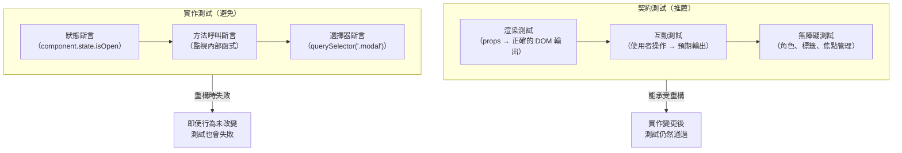

# 測試元件契約

元件的契約就是它的公開 API：接受的 props、發出的事件、渲染的插槽，以及維護的無障礙屬性。
驗證契約的測試能讓使用者確信元件行為正確，而無需指定元件內部如何實現這些行為。驗證實作細節的
測試——哪個內部函式被呼叫、哪個內部狀態被設定——每當實作改變時就必須更新，即使可觀察的行為並未
改變。

Testing Library 系列工具（React Testing Library、Vue Testing Library 等）正是圍繞這個區別
設計的。其核心原則——「你的測試愈接近軟體的使用方式，它們能給你的信心就愈多」——正是測試契約而非
實作的另一種表達。以 `role` 和 `label` 查詢，而非以 CSS class 或元件名稱查詢，就是將這個原則
落實到具體操作的方式。Testing Library 的設計者刻意不提供存取元件內部狀態或實例的 API，這是有意
為之的限制，而非功能缺失：缺少這些 API 意味著測試作者必然被引導到契約測試的方向，因為那是唯一
可用的路徑。這個工具設計上的限制，實際上轉化為測試品質的保障機制。

選擇 Testing Library 作為測試工具並不只是工具層面的決策，它隱含了對「什麼是正確的測試邊界」的
工程立場。采用這個工具的團隊，同時也是在宣告一種測試哲學：元件測試應該從使用者的感知出發，而不
是從元件的實作細節出發。這種立場在 Code Review、新人培訓，以及測試策略討論中，都能提供清晰的
判斷基準。

元件契約在設計系統和共用元件庫中尤為重要。一個為了無障礙改進而調整內部 DOM 結構的按鈕元件，不應
要求更新每一個查詢舊結構的測試。針對契約撰寫的測試——按鈕以 `role="button"` 渲染、按下 Enter
觸發 `onClick`——能夠在實作重構後繼續通過。

從契約角度思考元件也能改善元件設計本身。如果一個元件難以在不使用 `data-testid` 或模擬內部實作
的情況下進行測試，原因通常是該元件尚未在其 DOM 輸出中呈現正確的語義結構。測試的阻力是設計問題
的症狀：元件的公開介面與使用者和輔助技術感知它的方式不符。將「可透過契約進行測試」作為設計要求
——與功能性和視覺外觀並列——能產出更具無障礙性、更易組合，且更能獨立升級的元件。將測試視為元件
公開行為主要規格說明的做法，對剛接觸契約測試的團隊是個有用的框架：先撰寫描述元件應為使用者做什
麼的測試，再實作元件使其通過。

契約測試思維在共用元件庫和設計系統中的收益最為顯著。當一個基礎元件被數十個應用程式的測試套件
依賴時，元件的任何內部改動都不應造成消費端的測試失敗——只要其對使用者的行為保持不變。透過嚴格
遵守契約測試的邊界，設計系統團隊能夠安心地進行無障礙改進、效能最佳化和 DOM 重構，而無需協調
所有消費端同步更新測試。這種解耦是大型前端系統中維持高開發速度的重要架構決策。

衡量測試品質的一個實用指標是：測試是否在元件行為不變的情況下，因實作改動而失敗？如果是，這就
是實作測試的特徵。定期審視測試套件中使用 `data-testid`、`container.querySelector` 或元件內部
存取的比例，有助於識別哪些測試需要重寫為契約導向的形式。這種漸進式的改進策略，讓現有大型測試
套件的團隊也能逐步向契約測試靠攏，而不需要一次性的全面重寫。評估進度的另一個方法是：在重構一個
元件的內部實作後，記錄有多少測試因此失敗——這個數字越接近零，說明測試套件的契約導向程度越高。

## 原則

工程師必須（MUST）撰寫使用語義查詢（`getByRole`、`getByLabelText`、`getByText`）對可見的、
無障礙的 DOM 進行查詢與斷言的元件測試，而非使用實作細節查詢（`getByTestId`、
`container.querySelector`）。語義查詢反映了使用者和輔助技術感知元件的方式。依賴 `data-testid`
屬性或內部 class 名稱的測試在重構時十分脆弱，且無法提供關於元件是否具備無障礙性的任何訊號。換句
話說，語義查詢同時驗證了行為正確性和無障礙性，而實作細節查詢只驗證了行為正確性。

工程師禁止（MUST NOT）在元件測試中模擬（mock）子元件，除非該子元件來自外部套件且其行為在測試
環境中無法被控制。模擬子元件會破壞整合——測試不再執行實際的渲染輸出——並在父子元件之間的真實互動
有誤時產生虛假的信心。應該按照元件在實際使用中的渲染方式進行測試，包含其子元件。只有當子元件的
外部依賴（如網路請求或瀏覽器 API）難以在測試環境中控制時，才考慮使用模擬——且此時應模擬依賴本身，
而非整個子元件。

## 設計思維

### 契約測試 vs. 實作測試

契約測試與實作測試之間的差異，在比較兩個檢查模態對話框是否開啟的測試時變得具體。實作測試可能
斷言 `component.state.isOpen === true`。契約測試則斷言 `getByRole('dialog')` 在文件中可見。
當元件被重構為以 reducer 取代 `useState` 來管理開啟狀態時，實作測試會失敗——狀態結構已改變。
契約測試無需修改即可通過，因為可見的對話框仍然存在。這種不對稱性正是以契約為導向的測試的核心
論點：實作細節會隨程式碼演進而改變；對使用者的可觀察行為則不應如此。

契約測試的意圖也更加清晰。`getByRole('dialog')` 表示「一個對使用者和輔助技術可見的對話框」。
`component.state.isOpen === true` 表示「一個內部變數具有特定值」。前者是使用者在乎的行為，
後者是某種特定實作方法的產物。讀起來像行為規格說明的測試，對團隊而言更易於理解、維護和擴展。

從維護成本角度看，契約測試的優勢也更加明顯。設計系統中的一個元件可能被數十個消費端測試套件
依賴。如果每個測試套件都斷言內部狀態或 CSS class 名稱，那麼每次改進元件實作（例如，為了更好的
無障礙性而重構 DOM 結構）都會在所有消費端觸發測試失敗，即使使用者可見的行為完全相同。以契約為
導向的測試讓元件內部可以自由演進，只要公開行為維持穩定，消費端測試就不需要更新。這種穩定性在
維護共用元件庫時尤為關鍵。

### 查詢優先順序：語義優先

Testing Library 定義了一個查詢優先順序，反映了每種查詢與實作細節的耦合程度。從最低耦合到最高
耦合：`getByRole`（使用者和螢幕閱讀器依賴的語義 HTML 和 ARIA 角色）→ `getByLabelText`（定義
無障礙名稱的表單元素關聯）→ `getByPlaceholderText`（視力正常的使用者可見的提示文字）→
`getByText`（渲染輸出中可見的文字內容）→ `getByDisplayValue`（表單欄位的當前值）→
`getByAltText`（圖片 alt 文字）→ `getByTitle`（title 屬性）→ `getByTestId`（沒有面向使用者
意義的自訂屬性）。

實際的啟示是：在每個測試中首先使用 `getByRole`。當元件沒有有意義的角色時——對互動元件而言這種
情況很罕見——沿著優先順序向下找到一個以使用者能感知的內容為基礎的查詢。將 `getByTestId` 保留給
元件確實沒有無障礙特徵可查詢的少數情況，並將其使用視為一個訊號，重新審視是否需要為元件添加角色
或標籤使其可以透過契約進行測試。

`getByRole` 的第二個參數 `{ name: '...' }` 用於篩選出具有特定無障礙名稱的元素。無障礙名稱來自
`aria-label`、`aria-labelledby`，或元素的可見文字內容。`getByRole('button', { name: 'Submit' })`
不只確認存在一個按鈕，還確認該按鈕有正確的標籤——這正是螢幕閱讀器用戶用來識別控制項的資訊。當
頁面上有多個同類型角色的元素時（例如多個按鈕），`name` 選項就成為區分它們且不依賴位置或 class
的唯一方式。

### userEvent vs. fireEvent

Testing Library 提供兩種模擬使用者輸入的方式：`fireEvent` 派發單一合成 DOM 事件，而
`@testing-library/user-event` 則模擬真實瀏覽器為使用者互動生成的完整事件序列。在瀏覽器中點擊
按鈕會依序觸發 `pointerover`、`pointerenter`、`mouseover`、`mouseenter`、`pointermove`、
`mousemove`、`pointerdown`、`mousedown`、`focus`、`pointerup`、`mouseup`、`click`。
`fireEvent.click` 只觸發 `click`。一個依賴於 `focus` 在 `click` 之前被設定的元件——例如一個
只有在聚焦後才開啟的下拉選單——在使用 `fireEvent.click` 的測試中將無法正確運作。

在所有互動測試中，應優先使用 `userEvent.click()` 而非 `fireEvent.click()`。
`@testing-library/user-event` v14 使用 `pointer` 和 `keyboard` API 產生真實的事件序列，其
`setup()` 工廠方法建立一個在多次互動間保持狀態的使用者工作階段——對於測試焦點管理、多步驟鍵盤
導航，以及事件順序重要的互動十分有用。更真實模擬的代價在測試執行時間上可以忽略不計；其好處是
測試能在更接近真實瀏覽器行為的條件下執行元件。

`userEvent` 的 `setup()` API 也讓多步驟互動測試更加簡潔。呼叫 `const user = userEvent.setup()`
後，`user.click()`、`user.keyboard()`、`user.tab()` 等方法共享同一個指標和焦點狀態，模擬
使用者在 UI 中實際操作的連續性。相比之下，每次呼叫 `fireEvent` 都是獨立的合成事件，不攜帶任何
先前互動的狀態。對於需要驗證「Tab 導航→ Enter 啟動→ Escape 關閉」這類完整互動流程的測試，
`setup()` API 提供了比一系列 `fireEvent` 呼叫更貼近真實使用者行為的測試環境。

### Storybook play 函式作為契約測試

Storybook 的 `play` 函式（隨互動插件引入）允許 story 包含在 story 渲染後在瀏覽器中執行的自動化
互動。使用 `@storybook/test` 工具撰寫的 `play` 函式——底層使用 `@testing-library/user-event`
——作為瀏覽器執行的契約測試，與記錄元件的 story 並置。Storybook 可以透過 `storybook test` 在
CI 中執行這些 play 函式，使其成為自動化測試套件的一部分，而不僅僅是視覺文件。

play 函式的策略性價值在於它們緊鄰元件的 story，並在 Storybook UI 中可見，因此兼具元件互動
契約的活文件功能。審閱元件 story 的開發者可以即時觀看 play 函式執行，以了解元件應有的行為。
與在模擬 DOM 環境中執行的單元測試不同，play 函式在真實瀏覽器環境中執行——能捕捉基於 jsdom
的測試所遺漏的瀏覽器特定渲染問題。

從組織架構的角度看，play 函式消除了測試與文件之間的重複。在沒有 play 函式的典型設置中，元件
有記錄視覺狀態的 story，以及在獨立測試檔案中驗證行為的測試。這兩個產出物可能逐漸偏離：story
展示一種互動模式，而測試驗證另一種。play 函式消弭了這個落差——story 和契約測試成為同一個產出物。
特別是在設計系統團隊中，這種並置能讓元件的預期行為對消費端更易發現，消費端無需在使用文件之外
額外閱讀測試檔案。

### 元件設計與可測試性的相互影響

元件的可測試性是其設計品質的重要指標。如果一個元件難以透過語義查詢進行測試，通常意味著它在設計
上存在問題：缺少必要的 ARIA 角色、沒有適當的無障礙名稱、或者元件的視覺呈現與其語義結構脫節。這
種情況下，新增 `data-testid` 是治標不治本的做法——它讓測試可以執行，但不解決元件的根本問題。

正確的做法是在元件開發過程中，以「如何用 `getByRole` 查詢」作為設計問題的一部分。對話框需要
`role="dialog"` 和 `aria-labelledby`；自訂下拉選單需要正確的 `role="combobox"` 或
`role="listbox"` 結構；表單欄位需要 `<label>` 關聯或 `aria-label`。當這些語義屬性到位時，
`getByRole` 查詢自然而然地成為最具表達力的測試方式，而不需要依賴任何實作細節。這種設計與測試的
相互強化關係，是為何「以契約為先的測試思維」能同時提升程式碼品質和無障礙性的根本原因。

從實踐角度，可以將「能否以 `getByRole` 撰寫測試」作為元件驗收的門檻之一。在 Code Review 中，
當一個測試使用 `getByTestId` 或 `container.querySelector` 時，提問「這個元件是否缺少對應的語義
角色或無障礙名稱？」往往能發現設計上的缺失。這樣的 Code Review 文化將無障礙性問題在測試撰寫
階段就識別出來，而非等到測試完成後再進行獨立的無障礙稽核。

## 最佳實踐

**必須（MUST）在元件測試中優先使用 `getByRole` 作為查詢方式。** 角色對應於使用者和螢幕閱讀器
互動的語義 HTML 和 ARIA 角色。查詢 `getByRole('button', { name: 'Submit' })` 的測試會在渲染
元素缺少正確角色或無障礙名稱時失敗——而這正是重要的失敗模式。查詢
`document.querySelector('.submit-btn')` 的測試即使按鈕無法以鍵盤存取也會通過。當元件測試無法
使用 `getByRole` 撰寫時，幾乎總是因為元件本身需要改進以暴露正確的語義結構。`getByRole` 附帶
`{ name: '...' }` 選項時同時驗證了無障礙名稱，這是語義查詢相對於 CSS 選擇器的關鍵附加價值——
一次查詢同時確認了元素存在、角色正確，以及標籤可被輔助技術讀取。

**必須（MUST）透過模擬使用者互動來測試互動元件，而非直接呼叫元件方法或設定內部狀態。** 若對話框
在按鈕點擊時開啟，就透過點擊按鈕進行測試：`await userEvent.click(getByRole('button', { name:
'Open' }))`。禁止呼叫 `component.open()` 或 `setState({ isOpen: true })`。使用者無法呼叫
內部方法；測試也必須（MUST）不能這樣做。直接操作狀態會繞過互動觸發的所有事件處理器、驗證邏輯
和副作用——產生即使真實的使用者面向互動已損壞也能通過的測試。測試應該是元件行為的可執行規格，
而行為的定義是「使用者執行操作後看到什麼」，而非「內部變數的值為何」。

**應該（SHOULD）為所有互動元件加入鍵盤互動測試。** 只能點擊開啟卻無法以 Enter 開啟的下拉選單
對鍵盤使用者來說是失敗的。一個按 Tab 聚焦觸發器再按 Enter 開啟的測試能涵蓋這種情況。鍵盤互動
測試是在進入生產環境之前捕捉無障礙契約違規最有效的方式。`userEvent.tab()` 和
`userEvent.keyboard('{Enter}')` 工具讓這些測試易於撰寫。團隊應該（SHOULD）為每個互動元件至少
配置一個鍵盤互動測試，作為任何新元件工作完成定義的一部分。WAI-ARIA 創作實踐指南（APG）為每種
ARIA 角色定義了預期的鍵盤行為，可作為撰寫鍵盤契約測試的規格參考。鍵盤路徑的覆蓋不僅保護鍵盤
使用者，也間接確保了元件的焦點管理是正確的——焦點陷阱（focus trap）在對話框關閉後正確釋放焦點、
Tab 鍵順序符合視覺佈局等，都可以透過鍵盤互動測試在單元測試層級加以驗證。

## 視覺呈現



## 範例

```jsx
import { render, screen } from '@testing-library/react';
import userEvent from '@testing-library/user-event';
import { Dialog } from './Dialog';

test('點擊觸發器時開啟對話框，按 Escape 時關閉', async () => {
  render(
    <Dialog trigger={<button>Open</button>} title="Confirm">
      <p>Content</p>
    </Dialog>
  );

  // 互動前對話框不存在
  expect(screen.queryByRole('dialog')).not.toBeInTheDocument();

  // 模擬真實點擊——userEvent 觸發完整的瀏覽器事件序列
  await userEvent.click(screen.getByRole('button', { name: 'Open' }));

  // 針對契約斷言：無障礙名稱為「Confirm」的對話框可見
  expect(screen.getByRole('dialog', { name: 'Confirm' })).toBeVisible();

  // 模擬按下 Escape 關閉——鍵盤互動是契約的一部分
  await userEvent.keyboard('{Escape}');

  // 關閉後對話框從 DOM 中消失
  expect(screen.queryByRole('dialog')).not.toBeInTheDocument();
});
```

## 常見錯誤

- **以 `getByTestId` 作為預設查詢方式。** `data-testid` 不提供任何關於元件角色、標籤或可見文字
  的資訊——而這些屬性才決定使用者是否能感知和互動該元素。以 `data-testid` 撰寫的測試即使元素
  不可見、缺少鍵盤角色或沒有無障礙名稱也會通過。優先使用 `getByRole`；只有在元素沒有使用者可感
  知特徵可查詢時才添加 `data-testid`。
- **模擬子元件以隔離被測單元。** 模擬子元件會將元件測試轉變為只驗證父元件渲染邏輯的部分測試，
  而不測試父子元件之間的實際互動。當真實的子元件以破壞組合的方式改變時，使用模擬子元件的測試
  仍然通過。只模擬來自無法在測試環境中控制的外部套件的子元件。
- **使用 `fireEvent` 進行互動測試。** `fireEvent` 派發單一合成事件，對單元測試通常足夠，但會
  遺漏真實瀏覽器互動生成的多事件序列。依賴 `click` 之前的 `focus`、`pointerdown` 或 `keydown`
  事件的元件，在 `fireEvent` 下與真實瀏覽器中的行為會有所不同。所有互動模擬應優先使用
  `userEvent`。如果測試使用 `fireEvent` 但元件在真實瀏覽器中表現正常，這本身就是一個訊號：
  測試覆蓋的互動路徑，與使用者實際經歷的路徑不完全相同。
- **斷言內部狀態或方法呼叫。** 使用 `wrapper.instance().state` 或監視內部方法的測試，會將實作
  選擇編碼進測試套件。當實作被重構——即使是為了改進它——這些測試就會失敗並需要更新，而這些更新
  不提供任何關於使用者可見行為的額外信心。將此類測試改寫為對渲染輸出的斷言。
- **在互動元件測試中省略鍵盤和焦點測試。** 以點擊為基礎的測試只涵蓋一種輸入模式；鍵盤使用者、
  開關使用者和螢幕閱讀器使用者依賴不同的互動模型。通過所有滑鼠測試的元件，仍可能完全無法用鍵盤
  操作。在每個互動元件的契約測試中至少包含一條鍵盤路徑，確保元件的無障礙契約與其指標操作契約
  一起被驗證，而不是留到無障礙稽核或使用者回報時才發現。
- **對設計系統元件使用不同的查詢策略。** 有些團隊在應用程式測試中使用語義查詢，但在元件庫測試
  中仍使用 `getByTestId` 或 CSS 選擇器，理由是元件庫「只需要測試 DOM 輸出」。這種區分是錯誤的：
  設計系統元件是最需要以契約為導向測試的地方，因為它們被最多消費端依賴。針對角色和無障礙名稱進行
  測試，確保元件作為設計系統的語義承諾得到驗證，而不只是視覺外觀的驗證。
- **在非同步互動測試中遺漏 `await`。** `userEvent` 的方法是非同步的，必須以 `await` 等待。遺漏
  `await` 會導致斷言在互動完成之前就執行，產生難以除錯的假性失敗（元件行為正確，但測試因時序問題
  而失敗）。使用 `await userEvent.click(...)` 而非 `userEvent.click(...)`，並確保測試函式
  宣告為 `async`，是使用 `userEvent` v14 API 的基本要求。TypeScript 在此提供了天然的防護：
  若測試函式未宣告為 `async`，對 `await` 的使用會產生編譯錯誤，從而在執行前就捕捉到這個常見
  問題。

## 相關 FEE


- [FEE-500 — 元件架構與設計模式總覽](./500.md)
- [FEE-1100 — 測試策略總覽](../Testing%20Strategies/1100.md)
- [FEE-1102 — 使用 Testing Library 進行元件測試](../Testing%20Strategies/1102.md)
- [FEE-1001 — ARIA 與語義化 HTML](../Accessibility/1001.md)

## 參考資料


- [Testing Library: 指導原則](https://testing-library.com/docs/guiding-principles) —
  關於為何 Testing Library 圍繞使用者可見查詢設計的權威說明；「你的測試愈接近軟體的使用方式，
  它們能給你的信心就愈多」這個原則是所有以契約為導向的元件測試的基礎；在撰寫任何元件測試之前
  閱讀此頁面，能讓查詢優先順序的選擇變得直覺而非任意，也能建立測試設計決策的正確心智模型
- [Testing Library: 查詢優先順序](https://testing-library.com/docs/queries/about#priority) —
  從 `getByRole` 到 `getByTestId` 的官方查詢優先順序，並說明每個層級為何反映了該查詢與實作
  細節相對於使用者面向行為的耦合程度；頁面中包含 `getByTestId` 應作為最後手段的明確指引，
  僅在沒有語義特徵可查詢時使用；此頁面也是 Code Review 中討論查詢選擇的有效參考來源
- [Kent C. Dodds: 測試實作細節](https://kentcdodds.com/blog/testing-implementation-details) —
  在 React 測試背景下闡述契約與實作區別的文章；說明了為何測試實作細節會產生偽陽性（行為損壞時
  測試通過）和偽陰性（只有實作改變時測試失敗），以及為何使用者可觀察的行為是測試斷言的正確單元；
  所述的兩類實作細節——元件實例方法與內部狀態——適用於任何元件框架，不只限於 React；對正在說服
  團隊從實作測試轉向契約測試的工程師而言，本文提供了有力的論述基礎
- [WAI-ARIA 創作實踐指南：模式](https://www.w3.org/WAI/ARIA/apg/patterns/) —
  W3C 按 ARIA 角色定義預期鍵盤互動模式的參考文件；為對話框、手風琴或下拉選單撰寫鍵盤互動測試時，
  該元件的 APG 模式定義了哪些鍵盤事件是無障礙契約的一部分；未涵蓋這些模式的測試會留下未驗證的
  無障礙契約缺口；此文件同時適合作為元件設計規格和測試規格的雙重參考
- [Storybook: 互動測試](https://storybook.js.org/docs/writing-tests/interaction-testing) —
  `play` 函式和 Storybook 測試執行器的官方文件；說明如何使用 `@storybook/test` 撰寫互動測試、
  如何透過 `storybook test` 在 CI 中執行，以及瀏覽器執行環境如何捕捉 jsdom 測試無法重現的問題；
  適合使用 Storybook 且希望將契約測試與元件 story 並置、消除測試與文件重複的團隊
