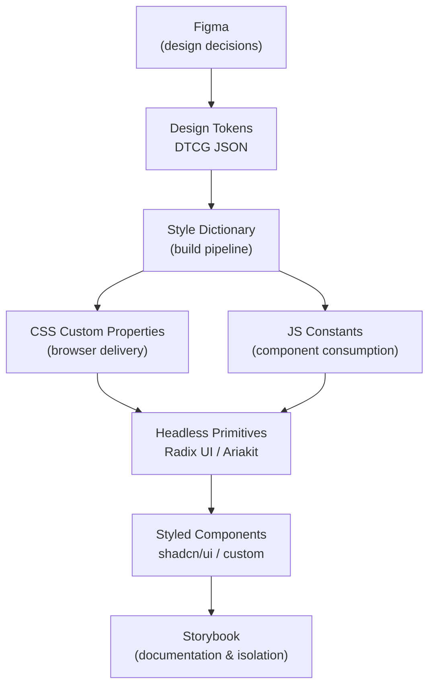

# 設計系統與 UI 函式庫概覽

設計系統是設計與工程之間的共同語言。它將原始的設計決策 — 色彩、間距、字體排印、互動行為 — 轉化為結構化、版本化、機器可讀的產出物，供產品觸及的每一個介面使用。現代設計系統並非單體架構；它們是分層堆疊，每一層都有明確的職責，以及與上下層之間定義清楚的介面。

這門學科已大幅成熟。從 2010 年代初期的共享 CSS 檔案和零散的元件工具，演進為具有正式規範（W3C DTCG）、專用建置工具（Style Dictionary）、無障礙優先元件原始層（Radix UI、React Aria），以及作為設計與工程之間活文件合約的文件工作坊（Storybook）的有原則、工具鏈支援的實踐。

本概覽介紹業界標準的四層模型，說明本類別與 CSS（200 系列）及建置工具（800 系列）類別之間的邊界，並概覽後續文章的內容。

## 為什麼需要設計系統

沒有設計系統，一致性只能靠個別程式碼審查來維持的社會契約。每位工程師在間距、色彩、層級深度和互動狀態上各自做出局部決策。隨著時間推移 — 跨越團隊、跨越程式碼庫、跨越產品介面 — 這些決策逐漸分歧。結果是使用者感知得到但說不清楚的視覺不一致性，以及技術債 — 數百個略有差異的按鈕實作，幾乎不可能以原子方式更新。

設計系統以技術合約取代社會合約。當品牌主色存在於代幣中，並被每個按鈕、每個連結和每個焦點環所消費，跨越每個產品介面時，變更該顏色只需要修改一行，然後執行一次 pipeline。沒有設計系統，變更該顏色可能是一個耗時數週的工程項目，且有非可忽略的回歸風險。

Specify 的 2024 年設計系統現狀報告發現，74% 的成熟設計系統現在使用代幣作為主要的分發機制。從臨時的共享樣式表過渡到結構化的代幣系統，代表了過去五年前端工程最核心的架構轉變。

## 何時自建、何時採用

並非每個團隊都需要從頭建立設計系統。這個決策取決於介面範圍的規模、團隊的設計限制，以及所需視覺差異化的程度。

**採用現有的樣式函式庫**，適合產品處於早期階段、視覺設計不需要與知名審美觀有顯著差異，或工程速度是主要限制條件時。Mantine、Chakra UI 和 shadcn/ui 開箱即涵蓋大多數元件需求。

**採用並延伸無樣式函式庫**，適合產品需要自訂視覺識別，但團隊不想重新實作無障礙原始元件時。這是 Radix UI 加自訂樣式的模式，對大多數成長階段的產品團隊而言，代表了槓桿與控制之間的最佳平衡。

**建立完整系統**，適合產品跨多個平台（Web、iOS、Android、電子郵件）運行、多個品牌主題必須在同一個程式碼庫中共存，或有專門的平台團隊服務下游產品團隊時。這是完整代幣 pipeline 投資得以回報的場景。

## 四層模型

### 第一層 — 代幣層（Token Layer）

設計代幣是每個現代設計系統的基礎。代幣是設計決策與其值的具名配對：`color.brand.primary = #0057B8`、`spacing.md = 16px`、`shadow.card = 0 2px 8px rgba(0,0,0,0.12)`。透過將決策編碼為代幣而非硬編碼值，團隊獲得了單一事實來源，可一致地傳遞至每個平台與主題。

代幣空間分為三個層級：

- **原始代幣**（primitive token，又稱 global 或 option token）儲存無語意的原始值。`color.blue.500 = #2563EB` 是原始代幣，描述的是「存在什麼」，而非「何時使用」。
- **語意代幣**（semantic token，又稱 alias 或 decision token）將原始代幣對應至意圖。`color.interactive.default = {color.blue.500}` 是語意代幣，描述的是「在什麼情境下應出現該值」。
- **元件代幣**（component token）將語意決策限定在特定元件上。`button.background.default = {color.interactive.default}` 將元件的視覺屬性連結至語意意圖。

這套三層代幣階層 — 原始、語意、元件 — 是 W3C Design Token Community Group（DTCG）格式規範所規定的結構。DTCG 在 2024 年標準化了代幣集合的 JSON 表示方式。將 DTCG JSON 轉換為平台產出物的工具鏈是 Style Dictionary，由 Amazon 開發。Style Dictionary 讀取代幣 JSON，輸出 CSS custom properties、JavaScript 常數、iOS Swift 檔案、Android XML 或任何目標平台所需的格式。

實際效益是：單一代幣變更（例如調整品牌主色）在一次 pipeline 執行中同步傳遞至 Web、iOS 和 Android，消除了過去需要手動同步的工作。

### 第二層 — 原始元件層（Headless Components）

原始代幣定義的是「值看起來如何」；無樣式原始元件定義的是「互動元件如何運作」。無樣式元件（headless component）是將無障礙行為 — 鍵盤導覽、ARIA 角色指派、焦點管理、螢幕閱讀器公告 — 編碼進去的元件，而不套用任何視覺樣式。它是行為合約，而非視覺合約。

WAI-ARIA Authoring Practices Guide（APG）規定了每種複合元件的預期鍵盤與螢幕閱讀器行為：分頁（tabs）、對話框（dialogs）、組合框（comboboxes）、揭示模式（disclosure patterns）等。從頭正確實作這些模式既不容易也容易出錯。無樣式元件函式庫將這項工作完整且正確地完成一次，並以無樣式的 React（或框架無關）原始元件的形式公開。

此空間中的主要函式庫有：

- **Radix UI** — 一套無樣式、無障礙的 React 原始元件集。每個原始元件提供完整的鍵盤支援與 ARIA 語意，無預設樣式，並透過 `asChild` 合成 API 讓使用者傳入自己的元素類型而不破壞無障礙性。截至 2024 年底，Radix UI 每週 npm 下載量超過 900 萬次。
- **Ariakit** — 一套低階工具庫，為 React 公開個別的無障礙 hooks 和元件，強調可組合性與漸進增強。
- **React Aria**（Adobe）— 基於 hooks 的函式庫，涵蓋完整的 ARIA 模式，對國際化與行動觸控互動有強大支援。

原始元件層不關心代幣，其介面是行為性的。上方的樣式層消費原始元件並套用代幣。

### 第三層 — 樣式元件層

樣式元件層是代幣與原始元件匯合成為最終元件的地方，產品工程師可直接將其放入頁面中使用。有兩種實作策略：

**版本化發布** — 傳統模型。樣式元件函式庫發布至 npm，使用者安裝後獲得帶有自身樣式、代幣和行為的元件，更新透過版本升級傳遞。Chakra UI、Mantine 和 Ant Design 採用此模型。

**複製貼上發布** — 由 shadcn/ui 普及的模型。元件不作為相依套件安裝，而是複製到使用專案的原始碼樹中。每個元件是 Radix UI 原始元件的薄層、有觀點的組合，以 Tailwind CSS 工具類別設定樣式，消費 CSS custom properties 代幣。使用者擁有程式碼，沒有版本鎖定，也沒有封裝障礙。

複製貼上模型快速成長，因為它符合兩個趨勢：Tailwind CSS 成為主流樣式工具，以及在 AI 輔助開發工作流程中傾向完全擁有元件原始碼，工程師直接迭代元件程式碼而非等待上游發布。

### 第四層 — 文件層（Storybook）

沒有文件的設計系統是一種私密語言。Storybook 是建立文件層的業界標準工具 — 一個在應用程式脈絡之外隔離渲染元件的前端工作坊。

每個元件透過一個或多個 **story** 描述：具名配置，用來在特定狀態下演示元件（預設、停用、載入中、錯誤、長文字、RTL 語系等）。Storybook 的 Docs 附加套件從 story 和 TypeScript prop 類型自動生成文件頁面，無需額外撰寫即可產出即時程式碼範例、prop 表格和使用說明。

文件層同時服務多個受眾：

- **工程師**將 Storybook 作為開發環境，無需啟動完整應用程式即可迭代元件。
- **設計師**使用 Storybook 驗證實作元件是否符合設計意圖，通常透過 Figma 外掛並排比較設計與實作。
- **QA 和產品**使用 Storybook 審查元件狀態，無需瀏覽應用程式流程。
- **無障礙工程師**使用 Storybook 的 a11y 附加套件，在每次建置時對每個 story 執行自動化 ARIA 稽核。

文件層是設計系統提供什麼、如何使用、以及元件在各種條件下外觀的單一事實來源。

## 設計系統堆疊

設計決策源自 Figma。Style Dictionary 將 DTCG 代幣 JSON 轉換為 CSS custom properties 和 JS 常數。無樣式原始元件消費這些值並提供行為合約。樣式元件將原始元件包裝並加入視覺設計。Storybook 將完整系統呈現為可即時使用、可搜尋、可測試的文件。

圖中每個箭頭代表一個具有定義格式的交接點：Figma 匯出 DTCG JSON；Style Dictionary 讀取 JSON 並寫入平台檔案；元件匯入 CSS custom properties 和 JS 常數；Storybook 渲染元件並生成靜態文件。層與層之間的邊界是明確的合約，而非非正式的慣例。

## 設計系統的成熟度光譜

設計系統不會憑空完整出現，它們經歷可識別的階段演進：

1. **共享樣式表** — 一個共同的 `global.css` 或設計代幣檔案，包含約定的值，但沒有元件函式庫。團隊共享的是值，而非行為。
2. **內部元件函式庫** — 專案範圍的可重用元件集合，通常是 Tailwind 或 CSS Modules 樣式的元件，無障礙保證僅限於團隊有時間實作的部分。這是大多數產品團隊最常見的起點。
3. **無樣式加樣式組合** — 團隊採用無樣式原始元件函式庫（Radix UI、React Aria）並在其上建立樣式組合層。無障礙保證來自無樣式層；視覺設計完全由團隊擁有。
4. **代幣驅動的多平台系統** — 完整 pipeline：Figma 中的 DTCG 代幣、Style Dictionary 轉換至 Web/iOS/Android、無樣式原始元件提供行為、為產品團隊提供版本化或複製貼上樣式層，以及 Storybook 作為活文件規格。

大多數團隊在第 2 到第 3 階段之間運作。本類別的文章服務每個階段的團隊，從採用現有函式庫到建立成熟的多平台代幣 pipeline 皆有涵蓋。

## 類別邊界

### 與 CSS 的邊界（200 系列）

CSS 與版面配置系統類別（FEE-200 系列）涵蓋串接機制、優先權、版面配置演算法（Flexbox、Grid、Container Queries）以及瀏覽器渲染模型。它解釋的是「CSS 如何運作」。

設計系統類別涵蓋建立在 CSS 之上的組織層：如何將設計決策編碼為代幣、如何將代幣以 CSS custom properties 傳遞，以及如何建立透過約定消費代幣的元件。它解釋的是「CSS 應該說什麼、以及為什麼」。

具體範例：`var(--color-interactive-default)` 退回至 `var(--color-blue-500)` 的行為是 CSS 機制問題（FEE-200 系列）。互動介面應參照 `color.interactive.default` 而非原始色彩的決策，是代幣架構問題（FEE-900 系列）。

### 與建置工具的邊界（800 系列）

建置工具類別（FEE-800 系列）涵蓋將原始碼轉換為瀏覽器可執行產出物的轉換 pipeline：Vite、esbuild、Rollup、PostCSS、模組打包、tree-shaking 和程式碼分割。它解釋的是「程式碼如何送達瀏覽器」。

Style Dictionary 是設計系統的建置工具，但它屬於設計系統類別，因為其輸入輸出是設計產出物（代幣 JSON 和 CSS/JS 常數），而非應用程式程式碼。設計系統類別定義「建置 pipeline 產出什麼」；建置工具類別定義「應用程式建置 pipeline 如何運作」。

## 類別學習路線

本系列涵蓋完整的設計系統與 UI 函式庫堆疊：

- [FEE-901：設計代幣](./901.md) — 代幣解剖、DTCG JSON 格式、原始/語意/元件三層模型，以及 Style Dictionary 設定。
- [FEE-902：無樣式元件函式庫](./902.md) — WAI-ARIA 撰寫模式、Radix UI 與 Ariakit 架構、`asChild` 合成模式，以及如何評估無樣式函式庫。
- [FEE-903：複製貼上元件函式庫](./903.md) — shadcn/ui 模型、複製貼上與版本化發布的比較、Tailwind 整合，以及建立專案內部元件函式庫。
- [FEE-904：Storybook 與元件文件](./904.md) — Story 撰寫、Docs 附加套件、互動測試、無障礙稽核，以及在 CI 中使用 Storybook。
- [FEE-905：主題與深色模式](./905.md) — 代幣驅動的主題策略、CSS custom property 覆寫模式、`prefers-color-scheme`，以及在 React 中管理主題狀態。
- [FEE-906：設計系統版本控制與發布](./906.md) — Monorepo 套件結構、語意版本控制、發布至 npm、消費共享系統，以及跨團隊管理重大變更。
- [FEE-907：圖示系統](./907.md) — SVG sprite 與內嵌 SVG 與圖示字型的取捨、無障礙圖示模式，以及將圖示集（Lucide、Heroicons、Phosphor）整合至代幣感知系統。

## 相關 FEE

- [FEE-200：CSS 與版面配置系統概覽](../CSS%20and%20Layout%20Systems/200.md) — 代幣層建立其上的串接、版面配置演算法與 CSS 機制。
- [FEE-500：元件架構與設計模式概覽](../Component%20Architecture%20and%20Design%20Patterns/500.md) — 元件合成模式、狀態管理，以及設計系統元件必須遵守的設計合約。
- [FEE-1000：無障礙設計概覽](../Accessibility/1000.md) — 無樣式元件函式庫所實作的 WAI-ARIA 規範、WCAG 符合性，以及測試實務。
