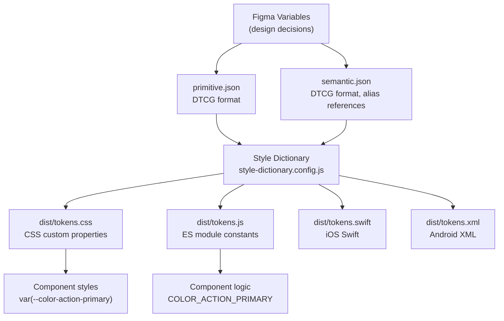

# 設計代幣

每一個在產品介面中一致出現的顏色、間距值、圓角半徑和陰影，都是因為某人在某個時間點做出了相關決策。設計代幣（design tokens）是一種機制，讓這些決策不再存在於工程師腦海中、Figma 圖層名稱裡或臨時的 CSS 變數中，而是進入一個結構化、版本化、工具鏈可讀的格式，供每個平台同時使用。

設計代幣是設計決策與其值的具名、具型別配對。名稱承載語意意圖；型別描述值的類別；值是原始資料。這個定義之所以有用，在於三者的結合：沒有型別的名稱是模糊的，沒有名稱的值是魔法數字，而沒有結構的兩者都不構成系統。

W3C 設計代幣社群小組（DTCG）自 2019 年起一直在正式規範代幣的標準 JSON 格式。Style Dictionary 4.x、Figma Variables 和不斷擴充的設計工具都已支援 DTCG 格式，使其成為設計與工程工具鏈之間的互通性層。本文深入介紹 DTCG 格式、每個可擴展系統都需要的三層代幣階層、Style Dictionary 建置 pipeline，以及以零執行期開銷將代幣傳遞至瀏覽器的 CSS custom properties 傳遞機制。

## Principle

設計代幣是產品中所有視覺決策的單一事實來源。元件程式碼中每一個硬編碼的顏色、間距值或字體大小，都是等待被提取的設計代幣。團隊 MUST 在撰寫元件樣式之前建立三層代幣階層 — primitive、semantic、component。扁平的代幣命名空間並非代幣系統；它不過是一張重新命名表，提供名義上的效益，卻阻礙了讓投資得以回報的架構彈性。

代幣撰寫 MUST 使用 W3C DTCG 格式（`$value` 和 `$type` 屬性）。對於新的代幣檔案，團隊 MUST NOT 使用舊版 Style Dictionary v3 格式（不帶 `$` 前綴的 `value` 和 `type`）；帶 `$` 前綴的格式是互通性標準，消費代幣的工具將越來越期待使用此格式。

Semantic tokens MUST 透過別名參照 primitive tokens，而非複製原始值。將原始值複製到 semantic tokens 中會徹底破壞階層的目的 — 當 primitive 改變時，每個複製了該值的 semantic token 都會過時。別名參照（`{color.blue.500}`）會自動傳播變更；複製的值則不會。

元件程式碼 MUST 只參照 semantic tokens，絕不直接參照 primitive tokens。這個限制正是讓品牌重塑和主題設定成為可能的條件：將 semantic token 別名指向的 primitive 更換，是代幣來源中的一行修改，會傳播至每個使用該 semantic token 的元件。在元件程式碼中繞過 semantic tokens，會切斷這個傳播鏈。

在 Style Dictionary 的 CSS platform 設定中 SHOULD 使用 `outputReferences: true`。使用 `outputReferences: true` 時，生成的 CSS 變數會保留參照鏈 — `--button-background: var(--color-action-primary)` — 而非解析為最終值 `--button-background: #3b82f6`。保留參照能透過 CSS 覆寫實現執行期主題設定；解析則消除了這種可能性。

代幣檔案與元件套件 MUST 保持版本同步。重新命名 semantic token 的代幣套件更新，對每個參照該代幣的元件而言都是破壞性變更。代幣穩定性承諾就是 API 穩定性承諾。

## Design Thinking

### 三層代幣階層

三層階層並非可選的組織偏好，而是區分代幣系統與代幣清單的架構結構。

**第一層 — Primitive tokens** 儲存不附帶語意意義的原始值。Primitive token 描述設計語言中存在的事物：`color.blue.500: #3b82f6`、`space.4: 16px`、`font-size.lg: 1.125rem`。Primitive tokens 是系統的詞彙表，回答「有哪些值可用？」而非「何時應使用某個值？」它們是窮舉性的，沒有規範性。

**第二層 — Semantic tokens** 將 primitive tokens 對應至意圖。Semantic token 描述值應該在何時出現：`color.action.primary: {color.blue.500}`、`space.inset.md: {space.4}`。Semantic tokens 是系統的語法，編碼設計規則。深色模式支援完全存在於此層：深色模式覆寫將 `color.action.primary` 從 `{color.blue.500}` 切換為 `{color.blue.400}` — 一個別名變更，零個元件變更。Semantic tokens 是精選性的、規範性的。

**第三層 — Component tokens** 將語意決策限定在特定元件上：`button.background.default: {color.action.primary}`、`button.padding.horizontal: {space.inset.md}`。Component tokens 為元件自訂提供穩定的介面：需要覆寫按鈕背景的使用者覆寫 component token，而非可能影響數十個其他元件的 semantic token。在不需要元件層級自訂的系統中，component tokens 是可選的。

這個結構對深色模式架構有直接影響：只有第二層 tokens 需要變體。Primitive tokens 是主題中立的，在每個主題中都相同。Component tokens 參照 semantic tokens，自動繼承主題行為。在每個層級複製所有代幣來實作深色模式的團隊，誤解了這個階層的用意。

### W3C DTCG 格式

DTCG 格式在 JSON 物件中使用 `$value` 和 `$type` 作為代幣定義的保留屬性鍵。將代幣分組到巢狀物件中可建立命名空間階層。從根物件到代幣名稱的完整路徑成為代幣的參照路徑。

DTCG 顏色代幣範例：

```json
{
  "color": {
    "blue": {
      "500": {
        "$value": "#3b82f6",
        "$type": "color"
      }
    }
  }
}
```

參照路徑為 `color.blue.500`。在 Style Dictionary 別名中，寫作 `{color.blue.500}`。

DTCG 格式定義了一組標準 `$type` 值，包括 `color`、`dimension`、`fontFamily`、`fontWeight`、`duration`、`cubicBezier`、`number`，以及複合型別 `typography`、`shadow`、`border`、`transition` 和 `strokeStyle`。複合型別將相關子值組合在單一代幣下：

```json
{
  "typography": {
    "heading": {
      "lg": {
        "$value": {
          "fontFamily": "{font-family.sans}",
          "fontSize": "{font-size.2xl}",
          "fontWeight": "{font-weight.bold}",
          "lineHeight": "{line-height.tight}"
        },
        "$type": "typography"
      }
    }
  }
}
```

從第一個代幣檔案起就採用 DTCG 格式，可確保代幣檔案能跨工具移植。Figma 的 Variable 匯入/匯出使用 DTCG。Style Dictionary 4.x 圍繞 DTCG 建立。今日或未來支援 DTCG 的設計工具，將能直接使用代幣檔案而無需轉換。

### Style Dictionary 作為建置 Pipeline

Style Dictionary 是設計代幣的建置系統，接受 DTCG 代幣 JSON 作為輸入，並輸出任意數量的平台特定格式。轉換 pipeline 有三個階段：

1. **載入（Load）** — Style Dictionary 讀取所有代幣檔案並將其合併為單一字典。命名空間階層在此組合完成。
2. **轉換（Transform）** — 根據設定的轉換鏈對每個代幣進行轉換。轉換可修改代幣值（例如將 `px` 轉換為 `rem`、將十六進位轉換為 HSL）、代幣名稱（例如將點分隔路徑轉換為 kebab-case CSS 變數名稱）或代幣屬性（例如新增 `category` 屬性以供過濾）。
3. **格式化（Format）** — 轉換後的代幣傳入格式化器，輸出目標平台檔案。內建格式化器可輸出 CSS custom properties、JavaScript ES module 常數、CommonJS 常數、iOS Swift 檔案、Android XML 等。

Style Dictionary 設定檔（`style-dictionary.config.js`）定義代幣來源檔案、要輸出的平台，以及每個平台要套用的轉換和格式。Style Dictionary 4.x 預設使用 ESM。

### CSS Custom Properties 作為瀏覽器傳遞機制

CSS custom properties 是在瀏覽器中傳遞設計代幣的標準機制。它們有三個使其成為正確選擇的特性：

**串接繼承** — CSS custom properties 的串接和繼承行為與其他 CSS 屬性完全相同。這意味著在 `:root` 上設定 `--color-action-primary: #2563eb` 使其在任何地方都可用，而在 `.dark` 上覆寫它，使深色主題子樹中的所有元件自動採用覆寫值，無需任何 JavaScript 介入。

**零執行期開銷** — CSS custom properties 由瀏覽器在繪製時解析。在主題切換實作為 `<html>` 元素上的 class 切換時，其中不涉及任何 JavaScript、class 計算或重新渲染週期。

**透過 `outputReferences: true` 保留參照** — 當 Style Dictionary 以 `outputReferences: true` 輸出 CSS 時，代幣來源中的別名參照在輸出中以 CSS 變數參照的形式保留。`button.background.default: {color.action.primary}` 變成 `--button-background-default: var(--color-action-primary)`。這意味著對 `--color-action-primary` 的執行期覆寫，會自動傳播至所有參照它的 component tokens，無需逐一覆寫每個 component token。

## Best Practices

**從第一個代幣檔案起就採用 DTCG 格式。** `$value` / `$type` 語法是互通性標準。先使用舊版格式再遷移，是一項對所有消費代幣的工具和來源都具有破壞性的操作。

**絕不在元件程式碼中參照 primitive tokens。** 這是最常見的代幣架構違規，會消除代幣階層的主要優勢。元件 CSS 和元件 JS 常數 MUST 參照 semantic tokens。執行機制是程式碼審查，在成熟的系統中是 linter 規則。

**為間距和字體排印尺寸輸出 `rem` 而非 `px`。** 在瀏覽器設定中配置較大預設字體大小的使用者，當值以 `rem` 表示時，會獲得按比例縮放的間距和文字。將 `px` 間距值除以 16 並輸出 `rem` 的 Style Dictionary transform，是一次性的設定，預設情況下即尊重使用者的無障礙設計偏好。

**在 CSS platform 設定中使用 `outputReferences: true`。** 這可在生成的 CSS 中保留參照鏈，並透過 CSS 變數賦值啟用執行期主題覆寫。使用 `outputReferences: false` 的唯一理由，是在不支援 CSS 變數巢狀的環境中生成 CSS，這對於現代瀏覽器目標實際上已不再是相關限制。

**將代幣套件與元件套件一起版本化。** semantic token 的任何重命名、移除或型別變更都是破壞性變更。代幣套件 SHOULD 遵循語意版本控制。CHANGELOG MUST 明確記錄代幣 API 變更。將代幣作為相依套件使用的團隊，必須能夠鎖定版本並有意識地升級。

**設計代幣命名空間時要能承受品牌擴展。** 為單一品牌設計的代幣命名空間，在引入第二個品牌時會崩潰，如果所有代幣都在扁平命名空間中。Semantic tokens SHOULD 是品牌無關的：`color.action.primary` 表達意圖；`color.vivotek-blue` 表達品牌限制。前者可承受多品牌；後者不行。

## 代幣 Pipeline 架構



Figma 為 primitive 和 semantic 代幣層匯出 DTCG JSON。Style Dictionary 讀取兩個檔案，並為每個目標平台輸出平台特定的產出物。瀏覽器傳遞的元件使用 CSS custom properties；需要在執行期使用代幣值的元件邏輯則匯入 JS 常數。原生平台使用從同一來源生成的 Swift 和 XML 產出物。

## Example

以下範例展示使用 DTCG 格式、Style Dictionary 4.x 設定和生成輸出的完整工作設置。

### `tokens/primitive.json`

```json
{
  "color": {
    "blue": {
      "400": { "$value": "#60a5fa", "$type": "color" },
      "500": { "$value": "#3b82f6", "$type": "color" },
      "600": { "$value": "#2563eb", "$type": "color" }
    },
    "neutral": {
      "0":   { "$value": "#ffffff", "$type": "color" },
      "50":  { "$value": "#f8fafc", "$type": "color" },
      "900": { "$value": "#0f172a", "$type": "color" },
      "950": { "$value": "#020617", "$type": "color" }
    }
  },
  "space": {
    "1":  { "$value": "4px",  "$type": "dimension" },
    "2":  { "$value": "8px",  "$type": "dimension" },
    "3":  { "$value": "12px", "$type": "dimension" },
    "4":  { "$value": "16px", "$type": "dimension" },
    "5":  { "$value": "20px", "$type": "dimension" },
    "6":  { "$value": "24px", "$type": "dimension" }
  },
  "font-size": {
    "sm":   { "$value": "14px", "$type": "dimension" },
    "base": { "$value": "16px", "$type": "dimension" },
    "lg":   { "$value": "18px", "$type": "dimension" },
    "xl":   { "$value": "20px", "$type": "dimension" }
  },
  "border-radius": {
    "sm": { "$value": "4px",  "$type": "dimension" },
    "md": { "$value": "8px",  "$type": "dimension" },
    "lg": { "$value": "12px", "$type": "dimension" }
  }
}
```

### `tokens/semantic.json`

```json
{
  "color": {
    "action": {
      "primary":          { "$value": "{color.blue.500}", "$type": "color" },
      "primary-hover":    { "$value": "{color.blue.600}", "$type": "color" },
      "primary-dark":     { "$value": "{color.blue.400}", "$type": "color" }
    },
    "surface": {
      "page":             { "$value": "{color.neutral.0}",   "$type": "color" },
      "page-dark":        { "$value": "{color.neutral.950}", "$type": "color" },
      "elevated":         { "$value": "{color.neutral.50}",  "$type": "color" },
      "elevated-dark":    { "$value": "{color.neutral.900}", "$type": "color" }
    },
    "text": {
      "default":          { "$value": "{color.neutral.900}", "$type": "color" },
      "default-dark":     { "$value": "{color.neutral.50}",  "$type": "color" },
      "on-action":        { "$value": "{color.neutral.0}",   "$type": "color" }
    }
  },
  "space": {
    "inset": {
      "sm": { "$value": "{space.2}", "$type": "dimension" },
      "md": { "$value": "{space.4}", "$type": "dimension" },
      "lg": { "$value": "{space.6}", "$type": "dimension" }
    },
    "gap": {
      "sm": { "$value": "{space.2}", "$type": "dimension" },
      "md": { "$value": "{space.4}", "$type": "dimension" }
    }
  },
  "button": {
    "background":         { "$value": "{color.action.primary}",       "$type": "color" },
    "background-hover":   { "$value": "{color.action.primary-hover}",  "$type": "color" },
    "foreground":         { "$value": "{color.text.on-action}",        "$type": "color" },
    "padding-x":          { "$value": "{space.inset.md}",              "$type": "dimension" },
    "padding-y":          { "$value": "{space.inset.sm}",              "$type": "dimension" },
    "border-radius":      { "$value": "{border-radius.md}",            "$type": "dimension" }
  }
}
```

### `style-dictionary.config.js`

```js
import StyleDictionary from 'style-dictionary';

// px-to-rem transform：將 px 的 dimension 值除以 16
StyleDictionary.registerTransform({
  name: 'size/pxToRem',
  type: 'value',
  filter: (token) => token.$type === 'dimension',
  transform: (token) => {
    const val = parseFloat(token.$value);
    return `${val / 16}rem`;
  },
});

export default {
  source: ['tokens/primitive.json', 'tokens/semantic.json'],
  platforms: {
    css: {
      transformGroup: 'css',
      transforms: ['attribute/cti', 'name/kebab', 'size/pxToRem', 'color/css'],
      prefix: '',
      buildPath: 'dist/',
      files: [
        {
          destination: 'tokens.css',
          format: 'css/variables',
          options: {
            outputReferences: true,
            selector: ':root',
          },
        },
      ],
    },
    js: {
      transformGroup: 'js',
      transforms: ['attribute/cti', 'name/constant', 'size/pxToRem', 'color/css'],
      buildPath: 'dist/',
      files: [
        {
          destination: 'tokens.js',
          format: 'javascript/es6',
        },
      ],
    },
  },
};
```

### `dist/tokens.css`（生成輸出）

生成的檔案顯示 CSS 變數參照而非解析後的值，因為設定了 `outputReferences: true`。這一點至關重要：輸出中保留了串接鏈，從而能夠進行執行期主題覆寫。

```css
:root {
  /* Primitive tokens — color */
  --color-blue-400: #60a5fa;
  --color-blue-500: #3b82f6;
  --color-blue-600: #2563eb;
  --color-neutral-0: #ffffff;
  --color-neutral-50: #f8fafc;
  --color-neutral-900: #0f172a;
  --color-neutral-950: #020617;

  /* Primitive tokens — space（rem 輸出） */
  --space-1: 0.25rem;
  --space-2: 0.5rem;
  --space-3: 0.75rem;
  --space-4: 1rem;
  --space-5: 1.25rem;
  --space-6: 1.5rem;

  /* Primitive tokens — font-size（rem 輸出） */
  --font-size-sm: 0.875rem;
  --font-size-base: 1rem;
  --font-size-lg: 1.125rem;
  --font-size-xl: 1.25rem;

  /* Primitive tokens — border-radius（rem 輸出） */
  --border-radius-sm: 0.25rem;
  --border-radius-md: 0.5rem;
  --border-radius-lg: 0.75rem;

  /* Semantic tokens — color.action */
  --color-action-primary: var(--color-blue-500);
  --color-action-primary-hover: var(--color-blue-600);
  --color-action-primary-dark: var(--color-blue-400);

  /* Semantic tokens — color.surface */
  --color-surface-page: var(--color-neutral-0);
  --color-surface-page-dark: var(--color-neutral-950);
  --color-surface-elevated: var(--color-neutral-50);
  --color-surface-elevated-dark: var(--color-neutral-900);

  /* Semantic tokens — color.text */
  --color-text-default: var(--color-neutral-900);
  --color-text-default-dark: var(--color-neutral-50);
  --color-text-on-action: var(--color-neutral-0);

  /* Semantic tokens — space.inset */
  --space-inset-sm: var(--space-2);
  --space-inset-md: var(--space-4);
  --space-inset-lg: var(--space-6);

  /* Semantic tokens — space.gap */
  --space-gap-sm: var(--space-2);
  --space-gap-md: var(--space-4);

  /* Component tokens — button */
  --button-background: var(--color-action-primary);
  --button-background-hover: var(--color-action-primary-hover);
  --button-foreground: var(--color-text-on-action);
  --button-padding-x: var(--space-inset-md);
  --button-padding-y: var(--space-inset-sm);
  --button-border-radius: var(--border-radius-md);
}

/* 深色模式覆寫 — 只有 semantic tokens 需要覆寫 */
.dark {
  --color-action-primary: var(--color-action-primary-dark);
  --color-surface-page: var(--color-surface-page-dark);
  --color-surface-elevated: var(--color-surface-elevated-dark);
  --color-text-default: var(--color-text-default-dark);
}
```

這是 pipeline 產出的完整輸出。請注意：

1. 所有尺寸值都以 `rem` 而非 `px` 表示，因為套用了 `size/pxToRem` transform。
2. Semantic tokens 將 primitive tokens 參照為 CSS 變數 — `var(--color-blue-500)` — 因為設定了 `outputReferences: true`。
3. Component tokens 參照 semantic tokens — `var(--color-action-primary)` — 保留了完整的鏈。
4. `.dark` 覆寫區塊只觸及 semantic tokens。因為 component tokens 將 semantic tokens 參照為 CSS 變數，當 `.dark` 套用到祖先元素時，按鈕的背景會自動切換為深色模式的藍色，無需額外的元件層級覆寫。

### 在元件中使用代幣

匯入代幣 CSS 後，按鈕元件的樣式表清晰且具有自文件性：

```css
.button {
  background-color: var(--button-background);
  color: var(--button-foreground);
  padding: var(--button-padding-y) var(--button-padding-x);
  border-radius: var(--button-border-radius);
  transition: background-color 150ms ease;
}

.button:hover {
  background-color: var(--button-background-hover);
}
```

這個樣式表中沒有任何硬編碼的值，每個值都是代幣參照。當品牌主色改變時，修改 `primitive.json`，執行 pipeline，按鈕即完成更新，無需觸碰元件檔案。

## Common Mistakes

**在元件程式碼中直接參照 primitive tokens。** 在元件樣式表中使用 `color: var(--color-blue-500)` 是最常見的代幣違規。當品牌主色從 blue-500 轉移到 indigo-500 時，每個硬編碼了 `--color-blue-500` 的元件都必須手動尋找並更新。參照 semantic tokens — `color: var(--color-action-primary)` — 意味著更新發生在代幣來源中並自動傳播。

**為間距和字體排印輸出 `px` 而非 `rem`。** CSS 像素不尊重使用者的瀏覽器字體大小偏好。一個將瀏覽器預設字體設為 20px 以提高可讀性的使用者，當所有間距和字體排印值都以 `px` 硬編碼時，無法從該偏好中獲得任何好處。使用 `rem` 輸出意味著元件佈局會與使用者的偏好成比例縮放，這是無障礙設計要求，而非偏好。

**在 CSS platform 設定中設定 `outputReferences: false`。** 這會導致 Style Dictionary 在輸出 CSS 之前將所有參照解析為最終值。生成的 `--button-background` 變成 `#3b82f6` 而非 `var(--color-action-primary)`。CSS 變數串接鏈被切斷。執行期主題覆寫不再透過鏈傳播 — 要切換主題，每個層級的每個代幣都必須明確覆寫，這重新引入了參照鏈本應消除的手動同步問題。

**在 primitive 層定義深色模式覆寫。** 代幣系統中的深色模式是 semantic 層的關切。不存在「深色 blue-500」— blue-500 是一個原始值。深色模式意味著「在深色情境中，action primary 顏色應該是較淺的 blue-400 而非預設的 blue-500」。這個對應屬於 semantic 層，作為 `color.action.primary-dark: {color.blue.400}`。為每個 primitive token 建立深色模式變體的團隊，誤解了 primitives 的用途，並產生了不必要地大了兩倍的代幣檔案。

**將 DTCG 格式視為可選。** DTCG 格式是設計工具與工程工具之間的互通性標準。Figma Variables 使用 DTCG 進行匯入和匯出。Style Dictionary 4.x 圍繞 DTCG 建立。先使用舊版 `value` / `type` 格式（不帶 `$` 前綴）再推遲遷移，會在最糟糕的時機產生轉換負擔 — 當團隊已有現有的消費者和工具鏈相依性，必須同時全部遷移時。

## 相關 FEE

- [FEE-900：設計系統與 UI 函式庫概覽](./900.md) — 四層設計系統模型、代幣在堆疊中的角色，以及類別學習路線。
- [FEE-905：主題與深色模式](./905.md) — Semantic tokens 如何透過 CSS custom property 覆寫啟用深色模式、`prefers-color-scheme`，以及在 React 中管理主題狀態。
- [FEE-207：CSS 自訂屬性與主題設定](../CSS%20and%20Layout%20Systems/207.md) — CSS custom properties 的機制：串接、繼承、退回值，以及瀏覽器解析的運作方式。

## References

- [W3C Design Token Community Group — Format Specification](https://tr.designtokens.org/format/) — DTCG JSON 格式的規範性規格，包含所有已定義的 `$type` 值、複合代幣結構和別名參照語法。
- [Style Dictionary Documentation](https://styledictionary.com) — Style Dictionary 4.x 官方文件，包含 DTCG 遷移指南、transform 參考、format 參考和 platform 設定 API。
- [Style Dictionary 4 — DTCG Migration Guide](https://styledictionary.com/version-4/dtcg/) — 從舊版 `value`/`type` 格式遷移至 DTCG `$value`/`$type` 格式的逐步說明，包含 `outputReferences` 行為變更。
- [Figma — Variables and Design Tokens](https://help.figma.com/hc/en-us/articles/15339657135383-Guide-to-variables-in-Figma) — Figma Variables 官方文件，包含 DTCG 匯入/匯出以及 Figma 變數型別與 DTCG `$type` 值之間的對應關係。
- Nathan Curtis — [Naming Tokens in Design Systems](https://medium.com/eightshapes-llc/naming-tokens-in-design-systems-9e86c7444676) — 代幣命名策略、層級模型和已成為業界標準的 semantic 命名慣例的權威參考。
