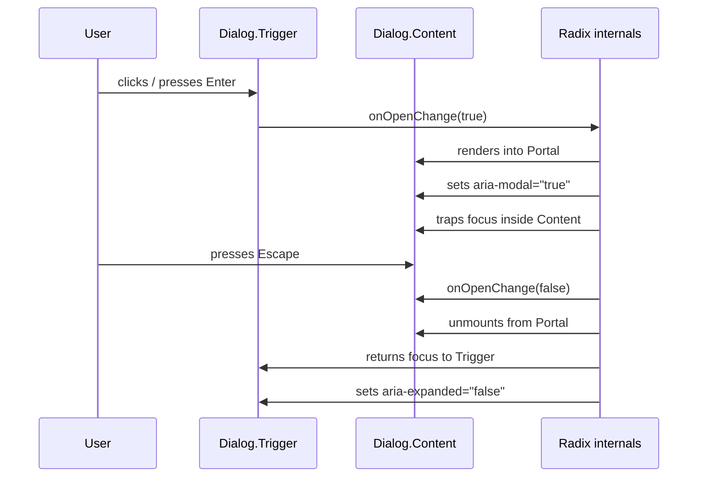

# 無樣式元件函式庫

每個產品最終都需要一個對話框（modal dialog）。它在開啟時需要將焦點鎖定在內部，按下 Escape 時需要關閉，關閉後需要將焦點歸還給開啟它的元素，並且需要透過幾個 ARIA 屬性向螢幕閱讀器溝通其狀態。這些行為都是不可見的，與顏色、間距或字體排印無關。然而，團隊卻花費數週時間重新實作這些功能，在過程中引入細微的錯誤，最終得到的對話框元件在螢幕閱讀器測試中失敗，而這些問題難以診斷、更難修復。

無樣式元件函式庫（headless component libraries）正是解決這個反覆發生之問題的答案。無樣式函式庫將元件的行為契約（鍵盤互動、焦點管理、ARIA 狀態）與視覺呈現完全分離。函式庫作者根據規格實作一次行為，並針對真實的輔助技術進行測試。使用該函式庫的團隊只需提供樣式，行為契約即可自動繼承。

本文介紹無樣式函式庫的運作方式、React 生態系中三個主要選擇 — Radix UI、Ariakit 和 Headless UI — 使無樣式組合切實可行的 `asChild` 模式，以及在使用無樣式原語（primitives）時不意外破壞其所提供行為的規則。

## 原則

無障礙設計不是在樣式完成後才加入的功能，而是一個 MUST 一次撰寫、到處繼承的行為契約。產品 UI 中的每個互動元件都有對應的 WAI-ARIA 互動模式：它處理哪些鍵盤事件、維護哪些 ARIA 屬性、適用哪些焦點管理規則。這些模式存在於規格中，並由螢幕閱讀器進行測試。當團隊在共享的 primitive 中一次正確地實作它們，使用該 primitive 的每個產品都能在無需任何額外工作的情況下繼承正確的行為。

團隊 MUST NOT 從頭重新實作鍵盤導航、焦點鎖定或 ARIA 屬性管理。正確實作的成本很高：WAI-ARIA 撰寫實踐指南長達數百頁；螢幕閱讀器的行為因 AT/瀏覽器組合而異；焦點管理的邊緣情況 — 過渡期間的 Escape、焦點歸還到已銷毀的元素、巢狀對話框互動 — 容易遺漏且難以手動測試。Radix UI 等函式庫已承擔了這些成本。使用它們並非走捷徑，而是正確的架構決策。

組合無樣式原語時，團隊 MUST NOT 壓制原語所依賴的鍵盤事件。在 Radix 對話框內呼叫 `event.stopPropagation()` 或 `event.preventDefault()` — 特別是對 Escape 事件 — 會破壞函式庫所提供的行為契約。開發者不會立即看到錯誤，但元件已不再符合 WAI-ARIA 模式的規範。

團隊 SHOULD 在每次自訂組合後，使用真實的螢幕閱讀器驗證 ARIA 屬性的輸出。無樣式函式庫以程式方式管理屬性值，但無法保證特定組合中公告的文字是否有意義。例如，僅含圖示的關閉按鈕會有正確的 `role="button"` 且可用鍵盤操作，但除非開發者明確提供 `aria-label`，否則它會被公告為未命名的按鈕。

## 設計思維

### 「無樣式」的含義

「無樣式」描述的是一個有行為但沒有視覺輸出的元件。一個無樣式的對話框管理開啟/關閉狀態、掛載和卸載其內容、在開啟時鎖定內部焦點、監聽 Escape、關閉時將焦點歸還給觸發元素，並設定 `aria-modal`、`aria-expanded` 和適當的 `role` 屬性。它不渲染任何顏色、邊框、陰影或過渡效果，這些都是開發者的責任。

這種分離並非美學上的考量，而是解決了一個真實的架構問題：行為與樣式有完全不同的變更速率和所有權。行為由 WAI-ARIA 規範，鮮少變更，且 MUST 正確。樣式由設計系統決定，頻繁變更，並且可能因品牌、主題和情境而異。將兩者耦合意味著每次樣式變更都可能破壞行為；將它們分離意味著樣式變更在結構上是安全的。

### Radix UI：複合元件與 asChild

Radix UI 是 React 生態系中採用最廣泛的無樣式函式庫。它提供超過 30 個原語 — Dialog、Tooltip、Popover、Select、Dropdown Menu、Tabs、Toggle、Slider 等 — 每個都根據對應的 WAI-ARIA 模式實作。

Radix 使用複合元件（compound component）模式。一個對話框不是帶有十幾個 props 的單一 `<Dialog>` 元件，而是一組明確組合的原語：

```tsx
import * as Dialog from '@radix-ui/react-dialog';

<Dialog.Root>
  <Dialog.Trigger>開啟</Dialog.Trigger>
  <Dialog.Portal>
    <Dialog.Overlay />
    <Dialog.Content>
      <Dialog.Title>標題</Dialog.Title>
      <Dialog.Description>描述</Dialog.Description>
      <Dialog.Close>關閉</Dialog.Close>
    </Dialog.Content>
  </Dialog.Portal>
</Dialog.Root>
```

組合中的每個部分都有特定的職責：

- `Dialog.Root` — 擁有開啟/關閉狀態，並透過 context 將其提供給所有子元件
- `Dialog.Trigger` — 開啟對話框的元素；接收 `aria-expanded` 和 `aria-haspopup`
- `Dialog.Portal` — 將內容渲染到當前 DOM 子樹之外的 portal，避免層疊上下文問題
- `Dialog.Overlay` — 背景遮罩；Radix 在此附加點擊關閉的處理器
- `Dialog.Content` — 對話框面板；Radix 在此掛載焦點鎖定、設定 `role="dialog"`、`aria-modal="true"`，並管理 Escape 處理
- `Dialog.Close` — 觸發關閉的按鈕；Radix 自動連接 `onClick` 處理器

`asChild` prop 是使這種組合靈活且不增加額外 DOM 節點的機制。當 Radix 原語設定了 `asChild` 時，Radix 會將其行為 props 合併到單一子元素上，而非渲染自己的包裝元素：

```tsx
// 沒有 asChild：Radix 渲染 <button>，然後內部是 <a> — 無效的 HTML
<Dialog.Trigger>
  <a href="#">開啟對話框</a>
</Dialog.Trigger>

// 使用 asChild：Radix 將其 props 合併到 <a> 上 — 單一元素，有效的 HTML
<Dialog.Trigger asChild>
  <a href="#">開啟對話框</a>
</Dialog.Trigger>
```

沒有 `asChild` 時，開發者會得到一個 Radix 渲染的元素包裝他們的元素 — 通常是 `<button>` 包裝 `<a>`，這是無效的 HTML 且會破壞 ARIA 樹。使用 `asChild` 時，開發者的元素直接接收所有行為 props。DOM 是乾淨的；ARIA 樹是正確的。

`asChild` 模式透過 Radix 的 `Slot` 元件實作，它使用 `React.cloneElement` 將 refs 和事件處理器合併到單一子元件上。當建構自己的複合原語並需要相同的轉發行為時，團隊可以直接使用 `Slot`。

### Ariakit：顯式狀態物件

Ariakit 採取了不同的方式：它不是透過 context 在內部管理狀態，而是透過 `useDialogStore` 等 hooks 暴露開發者明確建立的狀態物件。這使狀態可在元件樹之外使用 — 當對話框開啟/關閉狀態需要由 URL 路由、URL 搜尋參數或外部狀態管理器驅動時非常有用。

```tsx
import { useDialogStore, Dialog, DialogHeading, Button } from '@ariakit/react';

function MyDialog() {
  const dialog = useDialogStore();
  return (
    <>
      <Button store={dialog}>開啟</Button>
      <Dialog store={dialog}>
        <DialogHeading>標題</DialogHeading>
        {/* 內容 */}
      </Dialog>
    </>
  );
}
```

Ariakit 比 Radix 更細粒度。它暴露個別的狀態設定器和讀取器，允許在不相關的元件間組合行為，並以較少的樣板處理複雜的情境，例如由外部狀態驅動的受控對話框。代價是 API 曲面更陡峭：簡單的使用案例需要比 Radix 複合元件模型更多的顯式連接。

### Headless UI：Tailwind 優先的簡潔性

Headless UI 由 Tailwind Labs 維護，針對 React 和 Vue 專案。它的 API 是三者中最簡單的，常見案例可以快速實作：

```tsx
import { Dialog } from '@headlessui/react';

<Dialog open={isOpen} onClose={() => setIsOpen(false)}>
  <Dialog.Panel>
    <Dialog.Title>標題</Dialog.Title>
    {/* 內容 */}
  </Dialog.Panel>
</Dialog>
```

Headless UI 涵蓋最常見的原語 — Dialog、Disclosure、Listbox、Menu、Popover、RadioGroup、Switch、Tabs、Transition — 具有簡潔、慣用的 API，與 Tailwind 的 `transition` utilities 緊密整合。限制在於覆蓋範圍：它的原語遠少於 Radix，缺少一些較複雜的模式（Tooltip、Context Menu、Slider），且其 Vue 支援意味著某些 React 特定的模式受到跨框架一致性要求的約束。

### 選擇函式庫

決策取決於專案的主要需求：

**選擇 Radix UI** 適用於大多數 React 專案。它具有最廣泛的原語覆蓋範圍、最大的生態系，並且是 shadcn/ui 的基礎。複合元件模式有學習曲線，但能產生乾淨、易讀的 JSX。如果專案使用 shadcn/ui，Radix 已在相依套件中，無需另行安裝。

**選擇 Ariakit** 適用於需要細粒度狀態控制的情境：由 URL 狀態控制的對話框、複雜的巢狀互動，或多個元件需要精確同步狀態的情境。Ariakit 的顯式 store 模式處理這些案例時，比 Radix 基於 context 的方式需要更少的命令式繞道。

**選擇 Headless UI** 適用於 Tailwind 優先的專案，在原語覆蓋範圍足夠且 Transition 緊密整合為優先考量的情況下。對於全面使用 Tailwind 生態系且不需要 Radix 長尾原語集的專案，這是正確的選擇。

## 最佳實踐

**在大多數 React 專案中選擇 Radix UI。** 它提供最全面的原語集，擁有最廣泛的社群支援，且其複合元件模式有完善的文件。使用 shadcn/ui 時，Radix 已在相依套件樹中，無需另外選擇函式庫。

**使用 `asChild` 而非將原語包裝在額外元素中。** 在 Radix 原語與其預期的語意元素之間加入額外的包裝元素會破壞 ARIA 樹。`<button><a>連結</a></button>` 是無效的 HTML。`<Dialog.Trigger asChild><a>連結</a></Dialog.Trigger>` 是乾淨的。每當 Radix 預設渲染的元素類型不是設計所要求的元素時，就應使用 `asChild`。

**不要壓制 Radix 的鍵盤事件。** 在 Radix 內容中呼叫 `event.stopPropagation()` 或 `event.preventDefault()` — 特別是對 `keydown` 事件 — 會破壞行為契約。Radix 的焦點鎖定和 Escape 處理依賴事件的正確冒泡。如果 Dialog 內部的子元件需要攔截 Escape（例如巢狀的搜尋輸入框），應使用 `Dialog.Content` 的 `onEscapeKeyDown` prop 明確協調行為，而非在子元件中壓制事件。

**為每個純圖示互動元素提供 `aria-label`。** 無樣式函式庫提供正確的角色和鍵盤行為，但無法為沒有文字內容的元素產生有意義的無障礙名稱。只包含 SVG 圖示的關閉按鈕會被公告為「按鈕」— 沒有任何關於其目的的說明 — 除非明確加入 `aria-label="關閉"`。這適用於所有純圖示按鈕，不只是 Radix 的關閉按鈕。

**在每次自訂組合後使用真實螢幕閱讀器測試。** macOS 上的 VoiceOver 免費可用；Windows 上的 NVDA 也是免費的。測試不需要詳盡無遺 — 開啟元件、僅用鍵盤瀏覽，並聆聽螢幕閱讀器公告的內容。ARIA 屬性在結構上正確並不保證公告的文字是可理解的。真實的螢幕閱讀器測試能發現「結構有效」與「實際可用」之間的差距。

**不要重新實作無樣式函式庫已提供的功能。** 在 Radix Dialog 內部添加手動的 `document.addEventListener('keydown', ...)` 來處理 Escape，會引入第二個與 Radix 自身處理器競爭的處理器，結果難以預測。信任函式庫的行為契約並在其中工作。

## Radix Dialog 鍵盤行為

以下序列圖說明 Radix Dialog 的完整鍵盤互動流程，從觸發啟動到關閉及焦點歸還。



焦點鎖定的實作方式是 Radix 攔截 Content 內部的 Tab 和 Shift+Tab，並在可聚焦的後代元素之間循環。當對話框關閉時，Radix 儲存了對話框開啟時所聚焦元素的參照，並將焦點歸還給它 — 這就是 WAI-ARIA 對話框模式所要求的「焦點歸還」行為。

## 範例

以下範例展示使用 `@radix-ui/react-dialog` 搭配 Tailwind CSS 樣式的完整、無障礙的 modal dialog。所有鍵盤互動、焦點鎖定、ARIA 屬性管理和焦點歸還行為均由 Radix 提供。開發者只提供視覺結構和樣式。

```tsx
import * as Dialog from '@radix-ui/react-dialog';
import { X } from 'lucide-react';

interface ConfirmDialogProps {
  trigger: React.ReactNode;
  title: string;
  description: string;
  onConfirm: () => void;
}

export function ConfirmDialog({
  trigger,
  title,
  description,
  onConfirm,
}: ConfirmDialogProps) {
  return (
    <Dialog.Root>
      {/*
        asChild：Radix 將其行為 props（aria-haspopup、aria-expanded、
        onClick 處理器）直接合併到消費者提供的元素上。
        不會在觸發元素周圍渲染額外的包裝 <button>。
      */}
      <Dialog.Trigger asChild>
        {trigger}
      </Dialog.Trigger>

      <Dialog.Portal>
        {/*
          Overlay：覆蓋對話框後方的視窗。
          Radix 自動在此附加點擊關閉的處理器。
        */}
        <Dialog.Overlay
          className="fixed inset-0 bg-black/50 data-[state=open]:animate-in data-[state=closed]:animate-out data-[state=closed]:fade-out-0 data-[state=open]:fade-in-0"
        />

        {/*
          Content：對話框面板。
          Radix 在此設定 role="dialog"、aria-modal="true"、管理焦點鎖定，
          並處理 Escape 鍵關閉。
        */}
        <Dialog.Content
          className="fixed left-1/2 top-1/2 -translate-x-1/2 -translate-y-1/2 w-full max-w-md rounded-lg bg-white p-6 shadow-lg focus:outline-none"
        >
          <Dialog.Title className="text-lg font-semibold text-gray-900">
            {title}
          </Dialog.Title>

          <Dialog.Description className="mt-2 text-sm text-gray-600">
            {description}
          </Dialog.Description>

          <div className="mt-6 flex justify-end gap-3">
            {/*
              Dialog.Close 包裝取消操作的按鈕。
              Radix 自動將 onClick 處理器連接到關閉對話框。
            */}
            <Dialog.Close asChild>
              <button
                type="button"
                className="rounded-md px-4 py-2 text-sm font-medium text-gray-700 ring-1 ring-gray-300 hover:bg-gray-50"
              >
                取消
              </button>
            </Dialog.Close>

            <button
              type="button"
              className="rounded-md bg-red-600 px-4 py-2 text-sm font-medium text-white hover:bg-red-700"
              onClick={onConfirm}
            >
              確認
            </button>
          </div>

          {/*
            右上角的純圖示關閉按鈕。
            aria-label="關閉" 是必要的：按鈕沒有文字內容，
            沒有 aria-label 時會被公告為未命名的「按鈕」。
          */}
          <Dialog.Close
            aria-label="關閉"
            className="absolute right-4 top-4 rounded-sm text-gray-400 hover:text-gray-600 focus:outline-none focus-visible:ring-2 focus-visible:ring-blue-500"
          >
            <X className="h-4 w-4" aria-hidden="true" />
          </Dialog.Close>
        </Dialog.Content>
      </Dialog.Portal>
    </Dialog.Root>
  );
}
```

### 使用方式

```tsx
// 觸發元素可以是任何元素 — asChild 直接將 Radix 行為合併到其上。
<ConfirmDialog
  trigger={
    <button type="button" className="rounded-md bg-red-600 px-4 py-2 text-white">
      刪除項目
    </button>
  }
  title="刪除項目？"
  description="此操作無法復原。該項目將被永久移除。"
  onConfirm={handleDelete}
/>
```

實作中有幾點值得注意：

1. `Dialog.Trigger asChild` — 消費者傳入任意 React 元素作為觸發器。Radix 將 `aria-haspopup`、`aria-expanded` 和點擊處理器合併到該元素上。不引入額外的 DOM 節點。
2. `Dialog.Portal` — 將遮罩和內容渲染到當前 DOM 子樹之外，防止被 `overflow: hidden` 的祖先裁切以及層疊上下文衝突。
3. `Dialog.Content` — Radix 自動在此元素上設定 `role="dialog"` 和 `aria-modal="true"`，開發者無需手動設定。
4. 純圖示的 `Dialog.Close` 有 `aria-label="關閉"`，圖示有 `aria-hidden="true"` — 這確保螢幕閱讀器公告「關閉，按鈕」而非讀出 SVG 內容。
5. Tailwind 的 `data-[state=open]` 和 `data-[state=closed]` 屬性選擇器可正常工作，因為 Radix 在其元素上設定了 `data-state`。開發者可以使用這些屬性進行 CSS 過渡，無需在 JavaScript 中管理動畫狀態。

## 常見錯誤

**將 Radix 原語包裝在額外的 `<div>` 元素中。** 在 Radix 元素與其預期的語意角色之間加入 `<div>` 包裝器會破壞 ARIA 樹。`<Dialog.Trigger><div><button>開啟</button></div></Dialog.Trigger>` 導致 Radix 將 `aria-expanded` 設定在 Radix 渲染的外層 `<button>` 上，而非開發者所預期的內層按鈕。修復方法是 `asChild`：`<Dialog.Trigger asChild><button>開啟</button></Dialog.Trigger>` 將巢狀結構合併為單一元素。

**在 Dialog 內部對 Escape 呼叫 `event.preventDefault()`。** Radix 的 Dialog 在文件層級監聽 Escape 事件，以關閉對話框並將焦點歸還給觸發器。如果 `Dialog.Content` 內部的子元件在 `keydown` 事件中對 Escape 鍵呼叫 `event.preventDefault()` — 例如為了防止文字輸入框失去其值 — Radix 的處理器就會被取消。對話框不再因 Escape 關閉，焦點也不再歸還，元件不再符合 WAI-ARIA 對話框模式。如果某個巢狀元件需要攔截 Escape，應使用 `Dialog.Content` 上的 `onEscapeKeyDown` prop 明確協調行為，而非在子元件中壓制事件。

**忘記為純圖示關閉按鈕加上 `aria-label`。** 只包含圖示的關閉按鈕對螢幕閱讀器使用者而言會被公告為「按鈕」— 他們聽到按鈕的存在，但無法確定其用途。WAI-ARIA 對互動元素的要求是提供無障礙名稱。對於純圖示按鈕，`aria-label="關閉"` 提供了這個名稱。將圖示本身標記為 `aria-hidden="true"` 以防止螢幕閱讀器嘗試公告其 SVG 路徑或 title 元素。

## 相關 FEE

- [FEE-1001：ARIA 與語意化 HTML](../Accessibility/1001.md) — ARIA 屬性模型、地標角色，以及瀏覽器如何從元素內容計算無障礙名稱。
- [FEE-1002：鍵盤導航與焦點管理](../Accessibility/1002.md) — 焦點鎖定實作、焦點環可見性要求，以及 roving tabindex 模式 — 無樣式函式庫代替開發者管理的底層原語。
- [FEE-903：複製貼上元件函式庫](./903.md) — shadcn/ui，建構在 Radix UI 原語之上並預先套用 Tailwind 樣式，是直接使用 Radix 的更高層次替代方案。

## 參考資源

- [Radix UI Primitives Documentation](https://www.radix-ui.com/primitives) — 每個 Radix 原語的官方文件，包含 prop 參考、鍵盤互動表格和 ARIA 屬性說明。
- [Ariakit Documentation](https://ariakit.org) — Ariakit 官方文件，包含基於 store 的狀態模型、元件 API 參考，以及複雜狀態同步模式的範例。
- [Headless UI Documentation](https://headlessui.com) — Headless UI（React 和 Vue）官方文件，包含元件 API 和 Tailwind 整合範例。
- [WAI-ARIA Authoring Practices Guide — Dialog (Modal) Pattern](https://www.w3.org/WAI/ARIA/apg/patterns/dialog-modal/) — 對話框鍵盤互動、焦點管理要求和必要 ARIA 屬性的規範性規格。所有對話框實作應據此進行測試的參考。
- [Radix UI — Composition (asChild)](https://www.radix-ui.com/primitives/docs/guides/composition) — `asChild` prop 和 `Slot` 元件的官方指南，包含 refs 和事件處理器的合併行為。
