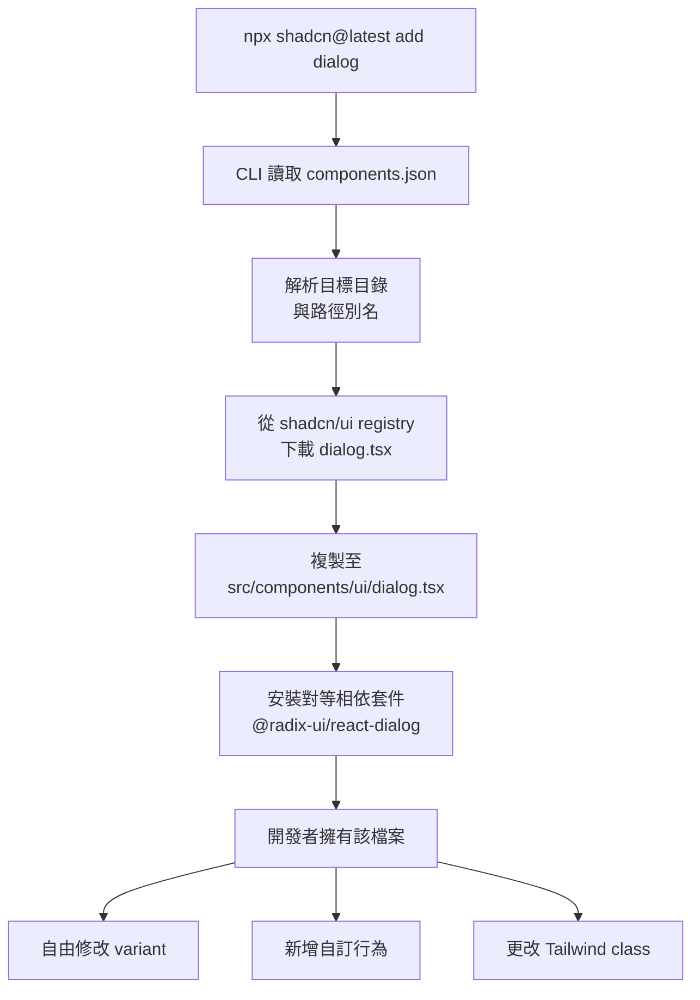

# 複製貼上元件函式庫

在前端元件共享的發展歷史中，模型長期十分單純：從 npm 安裝套件、匯入元件、直接使用。當你需要修改某些行為——一個函式庫沒有開放的 prop、設計需要的 variant、函式庫 API 難以支援的行為——你就只能靠 `className` 覆寫、包裝元件或猴子補丁（monkey-patch），並把這些摩擦視為使用函式庫的代價。

複製貼上元件函式庫顛覆了這個模型。它不發布可安裝的版本化套件，而是提供 CLI，直接將原始碼複製進消費者的程式庫。這些檔案成為開發者自己擁有的程式碼，沒有上游版本需要抗衡——每個 prop、每個 variant、每個行為都清晰可見、隨時可改，因為原始碼就在 `src/components/ui/` 裡。

本文以 shadcn/ui 為典範，說明複製貼上函式庫的架構、讓 variant 管理可組合的 `class-variance-authority`（cva）模式，以及應如何根據專案情境在複製貼上函式庫與版本化函式庫之間做出選擇。本文也涵蓋 `cn` 工具函式、複合 variant，以及保持自有元件原始碼與上游變更同步的實務操作。

## 設計思路

### shadcn/ui 模型

shadcn/ui 是 React 生態系中採用最廣泛的複製貼上元件函式庫，安裝模型是一個 CLI 指令：

```bash
npx shadcn@latest add button
```

這個指令讀取 `components.json`（專案的設定檔），確定目標目錄，從 shadcn/ui 儲存庫下載 `button.tsx`，寫入 `src/components/ui/button.tsx`，並安裝所需的對等相依套件。開發者現在擁有了這個檔案，沒有 `node_modules/shadcn-ui` 需要更新，沒有 API 邊界需要遵守，也不需要 `!important` 覆寫。

`components.json` 設定整個專案的整合方式：

```json
{
  "style": "default",
  "rsc": true,
  "tsx": true,
  "tailwind": {
    "config": "tailwind.config.ts",
    "css": "app/globals.css",
    "baseColor": "slate",
    "cssVariables": true
  },
  "aliases": {
    "components": "@/components",
    "utils": "@/lib/utils"
  }
}
```

`style` 欄位選擇視覺風格（`default` 或 `new-york`）。`aliases` 欄位對應 TypeScript 路徑別名，CLI 會使用專案配置的別名慣例寫入匯入路徑，而非相對路徑。

### 架構堆疊

shadcn/ui 元件由四層特定堆疊構成：

**Radix UI primitives** 提供行為與無障礙基礎。`<Button>` 無需 Radix 相依，但 `<Dialog>` 包裝了 `@radix-ui/react-dialog`，提供焦點陷阱、Escape 鍵處理、`aria-modal` 以及 `asChild` 組合原語。開發者無需自行實作，即可獲得正確的鍵盤行為與 ARIA 屬性。

**Tailwind CSS** 提供樣式層。元件直接在 JSX 中使用工具類別，設計系統完全以程式碼表達，熱重載即時，且不產生任何執行期 CSS-in-JS 開銷。

**`class-variance-authority`（cva）** 管理 variant 組合。Variant 以宣告式定義，無需字串拼接即可組合，並與 TypeScript 整合，使元件 props 與 variant map 保持一致。

**`cn` 工具函式** 合併 class 名稱。它包裝了 `tailwind-merge`（解決 Tailwind class 衝突，例如 `p-4` 覆蓋 `p-2`）與 `clsx`（處理條件式 class 邏輯）。每個元件都呼叫 `cn(buttonVariants(...), className)` 以安全地接受消費者提供的覆寫。

### `cva` 模式

`class-variance-authority` 解決了一個具體問題：variant 的 Tailwind class 字串增長快速，以純字串方式維護難度極高。設想一個有三種 variant 和兩種 size 的按鈕，那就是六種組合，每種都需要一個獨特的 class 字串。沒有 variant 系統，結果就是巢狀三元運算子或字串拼接——容易出錯、難以閱讀。

`cva` 提供宣告式替代方案：

```ts
import { cva } from 'class-variance-authority';

const buttonVariants = cva(
  // 套用於每個 variant 的基礎 class
  'inline-flex items-center justify-center rounded-md text-sm font-medium transition-colors focus-visible:outline-none focus-visible:ring-2 focus-visible:ring-ring focus-visible:ring-offset-2 disabled:pointer-events-none disabled:opacity-50',
  {
    variants: {
      variant: {
        default: 'bg-primary text-primary-foreground hover:bg-primary/90',
        secondary: 'bg-secondary text-secondary-foreground hover:bg-secondary/80',
        outline: 'border border-input bg-background hover:bg-accent hover:text-accent-foreground',
        ghost: 'hover:bg-accent hover:text-accent-foreground',
        destructive: 'bg-destructive text-destructive-foreground hover:bg-destructive/90',
      },
      size: {
        default: 'h-10 px-4 py-2',
        sm: 'h-9 rounded-md px-3',
        lg: 'h-11 rounded-md px-8',
        icon: 'h-10 w-10',
      },
    },
    defaultVariants: {
      variant: 'default',
      size: 'default',
    },
  }
);
```

Variant map 是普通物件。`cva` 根據 variant 鍵計算正確的 class 字串。TypeScript 自動從 map 推斷 variant prop 型別，因此 `variant="nonexistent"` 是型別錯誤。Variant 組合可自由搭配——`buttonVariants({ variant: 'outline', size: 'sm' })` 返回正確的合併 class 字串，無需手動字串拼接。

### 複製貼上優於版本化的情境

複製貼上是下列團隊的正確預設：

- **設計語言非標準。** 若產品設計與任何函式庫的預設值差異顯著，自有原始碼意味著變更是本地的 diff，而非對上游的繞道。
- **小型團隊、統一所有權。** 當一個團隊擁有所有元件時，不存在消費者升級路徑問題——每次元件更新都即時生效。
- **迭代速度優先於 API 穩定性。** 複製貼上元件可以更改 API 而不需要 semver 事件，適合消費元件的團隊同時也是維護元件的團隊的情況。

### 版本化優於複製貼上的情境

版本化函式庫是下列團隊的正確預設：

- **多個消費團隊。** 版本化套件提供清晰的升級路徑，消費者可以鎖定版本、閱讀 changelog，並按自己的進度升級。
- **專屬設計系統團隊。** 當建立元件的團隊與消費元件的團隊不同時，版本化套件正式化了 API 邊界，讓設計系統團隊能重構內部實作而不意外破壞消費者。
- **消費者需要升級路徑。** `package.json` 版本範圍、changelog 和主版本號碰升是溝通機制。沒有版本控制，跨消費者協調破壞性變更只能依靠非正式溝通。

### 複合 Variant

`cva` 支援複合 variant（compound variants）——只有在多個 variant 維度同時具有特定值時才套用的 variant。這對於 `variant="outline"` 與 `size="icon"` 組合需要與 `variant="default"` 和 `size="icon"` 不同內距的情況很有用：

```ts
const buttonVariants = cva('...base...', {
  variants: {
    variant: { default: '...', outline: '...' },
    size: { default: '...', icon: '...' },
  },
  compoundVariants: [
    {
      variant: 'outline',
      size: 'icon',
      class: 'border-2', // 僅在此組合時套用的額外 class
    },
  ],
  defaultVariants: { variant: 'default', size: 'default' },
});
```

複合 variant 避免了另一種替代方案：在元件渲染函式中不斷增長的 `if (variant === 'outline' && size === 'icon')` 條件樹。邏輯存放於 `cva` 設定中，而非 JSX 裡。

### `cn` 工具函式

`cn` 函式——通常實作為：

```ts
import { clsx, type ClassValue } from 'clsx';
import { twMerge } from 'tailwind-merge';

export function cn(...inputs: ClassValue[]) {
  return twMerge(clsx(inputs));
}
```

——是 shadcn/ui 堆疊中小而重要的一環。`clsx` 處理條件式 class 邏輯（`cn('base', isActive && 'active', { disabled: isDisabled })`）。`tailwind-merge` 透過理解工具類別命名慣例來解決 Tailwind class 衝突——它知道 `p-4` 應該覆蓋 `p-2`，而非將兩個 class 同時加入。若沒有 `tailwind-merge`，消費者提供的包含 Tailwind 工具類別的 `className` prop 將靜默地無法覆蓋元件的基礎 class。

### 讓自有原始碼與上游保持同步

複製貼上模型的一個摩擦點，是如何得知上游的改善。當 shadcn/ui 發布修復無障礙缺陷或新增常用
variant 的更新元件時，沒有套件管理機制會通知團隊。一個實用的做法是定期執行
`npx shadcn@latest diff`，它會比較每個自有元件檔案與當前上游原始碼的差異，並列出不同之處。
輸出的是行級別的變更清單，不是自動合併——團隊審查每個 diff，決定要吸收哪些上游變更，
再手動套用。這樣能保留本地自訂，同時讓上游改善可見且為選擇性採用，而非被自動覆寫或完全錯過。

### Catalyst

Catalyst 由 Tailwind Labs 發布，採用與 shadcn/ui 相同的複製貼上模型，但視覺風格不同——它以更精緻、商業導向的視覺語言為目標，並作為付費產品透過 Tailwind UI 販售。在兩者之間做選擇時，應評估美學與基礎元件覆蓋範圍，而非模型本身，因為兩者都是自有原始碼的複製貼上函式庫。

## 最佳實踐

**執行 `npx shadcn@latest add` 而非手動複製檔案。** CLI 做的不只是複製檔案：它從 `components.json` 解析目標目錄、安裝對等相依套件，並使用專案配置的路徑別名寫入匯入路徑。手動複製至少會遺漏其中一個步驟。

**使用 `cva()` 擴充 variant，而非 className 覆寫。** 當元件需要新的 variant——`destructive-outline`、`brand`、`ghost-sm`——就在元件檔案的 `cva` variant map 中新增它。這把 variant 邏輯集中在一處、保持 TypeScript prop 完整性，並避免在呼叫端使用條件覆寫時的 CSS 優先權衝突。

**讓 `cn` 成為唯一的 Tailwind 合併工具。** `tailwind-merge` 透過理解 Tailwind 工具類別命名慣例來解決 class 衝突。同時使用 `tailwind-merge` 和其他合併工具，或直接呼叫 `clsx` 進行 Tailwind class 合併，都會產生在執行期靜默但視覺上錯誤的 class 衝突。`cn` 包裝器確保所有 Tailwind class 合併都通過 `tailwind-merge`。

**執行 `npx shadcn@latest add <component>` 更新元件後，提交前先審查 diff。** shadcn/ui 定期發布更新的元件原始碼。重新執行新增指令會以最新版本覆寫元件檔案。審查 diff：更新可能包含值得保留的錯誤修復，也可能覆寫團隊所做的自訂。把更新視為需要評估的補丁，而非自動升級。

**不要把 `src/components/ui/` 視為黑盒子。** 複製貼上模型的全部價值就在於這些檔案是可讀的、可修改的。偵錯非預期行為時，閱讀元件原始碼。原始碼就是文件。

**將共用工具型別與元件檔案分開組織。** 當多個元件共用相同的 `size` 或 `intent` variant 值時，提取共用的 `variants.ts` 模組，重新匯出 `cva` variant 定義。這可防止本應共用相同 size 比例的元件之間，variant map 逐漸出現分歧。

**新開發者加入時審查 `components.json`。** `aliases` 設定決定匯入的解析位置。若開發者在設定專案時沒有在 `tsconfig.json` 中配置 TypeScript 路徑別名，立即就會看到匯入錯誤。請在 `components.json` 設定步驟旁記錄所需的 tsconfig 路徑。

**必須（MUST）**評估長期對抗版本化函式庫 prop API 的成本，是否超過維護自有原始碼的成本，再決定是否採用版本化元件函式庫。當產品需求與函式庫預設值顯著分歧時，累積的繞道方案——`className` 覆寫、包裝元件、prop 轉發技巧——對每個新功能都施加持續的代價。自有原始碼完全消除了這道限制，讓每次分歧都成為本地的 diff，而非上游的協商。

**應該（SHOULD）**在設計語言專屬的全新專案中，預設採用複製貼上模式。當產品的視覺識別與任何已發布函式庫的預設值有實質差異時，採用複製貼上函式庫可從第一天起避免複利式的摩擦。團隊從一開始就擁有原始碼，不會逐漸積累針對未為其設計語言設計之上游 API 的繞道方案。

**應該（SHOULD）**在多個團隊共用同一套元件集時，優先選擇版本化函式庫。版本化套件讓每個消費方團隊有明確的升級路徑：可固定在某個版本、閱讀 changelog、並依自己的節奏安排升級。若沒有版本化機制，跨消費方協調破壞性變更只能依賴非正式溝通，隨著消費方團隊數量增加，這種方式的擴展性極差。

## 新增指令流程

下圖說明開發者執行 `npx shadcn@latest add dialog` 時發生的事情。



## 範例

以下範例示範如何在 shadcn/ui Button 元件中新增 `destructive-outline` variant。這是正確的模式：修改自有元件檔案中的 `cva` variant map，TypeScript props 自動擴充，並在呼叫端以完整型別安全使用新 variant。

```tsx
// src/components/ui/button.tsx
// 自有檔案——已修改以新增自訂 variant

import * as React from 'react';
import { Slot } from '@radix-ui/react-slot';
import { cva, type VariantProps } from 'class-variance-authority';
import { cn } from '@/lib/utils';

const buttonVariants = cva(
  'inline-flex items-center justify-center rounded-md text-sm font-medium transition-colors focus-visible:outline-none focus-visible:ring-2 focus-visible:ring-ring focus-visible:ring-offset-2 disabled:pointer-events-none disabled:opacity-50',
  {
    variants: {
      variant: {
        default: 'bg-primary text-primary-foreground hover:bg-primary/90',
        secondary: 'bg-secondary text-secondary-foreground hover:bg-secondary/80',
        outline: 'border border-input bg-background hover:bg-accent hover:text-accent-foreground',
        ghost: 'hover:bg-accent hover:text-accent-foreground',
        destructive: 'bg-destructive text-destructive-foreground hover:bg-destructive/90',
        // 自訂 variant 新增於自有元件檔案中。
        // 呼叫端無需 className 覆寫——這是 variant map 的一部分。
        'destructive-outline':
          'border border-destructive text-destructive bg-background hover:bg-destructive hover:text-destructive-foreground',
      },
      size: {
        default: 'h-10 px-4 py-2',
        sm: 'h-9 rounded-md px-3',
        lg: 'h-11 rounded-md px-8',
        icon: 'h-10 w-10',
      },
    },
    defaultVariants: {
      variant: 'default',
      size: 'default',
    },
  }
);

// VariantProps 從 cva 設定推斷 TypeScript 型別。
// variant: "destructive-outline" 現在是合法的 prop 值。
export interface ButtonProps
  extends React.ButtonHTMLAttributes<HTMLButtonElement>,
    VariantProps<typeof buttonVariants> {
  asChild?: boolean;
}

const Button = React.forwardRef<HTMLButtonElement, ButtonProps>(
  ({ className, variant, size, asChild = false, ...props }, ref) => {
    const Comp = asChild ? Slot : 'button';
    return (
      <Comp
        className={cn(buttonVariants({ variant, size }), className)}
        ref={ref}
        {...props}
      />
    );
  }
);
Button.displayName = 'Button';

export { Button, buttonVariants };
```

### 使用方式

```tsx
// 兩種 variant 都有型別安全——TypeScript 知道所有合法的 variant 值。

// 既有的 destructive variant
<Button variant="destructive">刪除</Button>

// 新自訂 variant——無 className 覆寫，無 CSS 優先權衝突
<Button variant="destructive-outline">從清單移除</Button>

// size 仍能與新 variant 正確組合
<Button variant="destructive-outline" size="sm">移除</Button>
```

與 className 覆寫方式的關鍵差異：variant 在 `cva` 設定中宣告一次，TypeScript 在每個呼叫端驗證其名稱，class 字串由 `cva` 計算，無需字串拼接。新增它只需要編輯一個檔案——團隊自有的元件檔案。

## 相關 FEE

- [FEE-902：無樣式元件函式庫](./902.md) — shadcn/ui 建立在 Radix UI 無樣式原語之上；互動式元件的無障礙性與行為來自 Radix。
- [FEE-501：元件組合模式](../Component%20Architecture%20and%20Design%20Patterns/501.md) — 複製貼上元件依賴的組合模式：`asChild`、`forwardRef`、複合元件。
- [FEE-206：現代 CSS 框架](../CSS%20and%20Layout%20Systems/206.md) — Tailwind CSS，shadcn/ui 堆疊中的樣式層。

## 參考資料

- [shadcn/ui 文件](https://ui.shadcn.com) — 官方文件，包含 `components.json` 設定參考、可用元件與 CLI 使用說明。
- [class-variance-authority（cva）文件](https://cva.style) — cva 官方文件：variant map、複合 variant 與 TypeScript 整合。
- [tailwind-merge 文件](https://github.com/dcastil/tailwind-merge) — `tailwind-merge` 如何解決衝突的 Tailwind 工具類別。
- [Catalyst — Tailwind UI](https://tailwindui.com/templates/catalyst) — Tailwind Labs 的商業授權複製貼上元件函式庫，以不同美學示範相同模型。
- [Radix UI Slot](https://www.radix-ui.com/primitives/docs/utilities/slot) — shadcn/ui 元件內部用來實作 `asChild` prop 轉發的 `Slot` 原語。
- [shadcn/ui components.json 參考](https://ui.shadcn.com/docs/components-json) — 所有 `components.json` 設定欄位的詳細參考，包含 style、Tailwind 設定與路徑別名設定。
