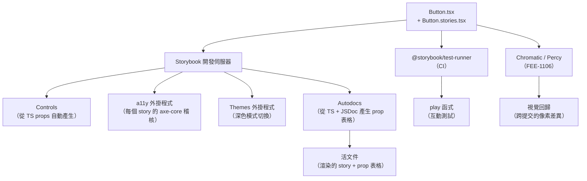

# Storybook 與元件文件

元件存在於程式庫中，它有 props，它會渲染輸出。但除非有人明確記錄了它在 `disabled`、`loading`、內容溢出或出現錯誤狀態時的樣子，否則沒有人知道正確的行為應該是什麼。這份知識存在於原始開發者的腦海中，隨時間流逝，只有在生產環境出問題時才會浮現。

Storybook 透過讓元件文件成為可執行的產出物來解決這個問題。每個 story 都是特定狀態下元件的渲染實例，在隔離環境中顯示，帶有正確的 prop 值。story 檔案和元件檔案並排存放在儲存庫中，文件不是一個會逐漸失去同步的獨立網站，而是一組使用與測試相同工具鏈執行的 story。

本文涵蓋 Storybook 的 Component Story Format 3（CSF 3）、讓 control 和測試可組合的 args 系統、用於互動測試的 `play` 函式、用於自動產生 prop 表格的 autodocs，以及 Storybook 與視覺回歸測試之間的正確範圍邊界。

## 設計思路

### Storybook 的兩個目的

Storybook 服務於兩個不同的目的，兩者都很重要。

第一個是**元件隔離**。在開發過程中，執行一個 story 比執行完整應用程式更快、更專注。不需要導航認證流程，不需要啟動伺服器，不需要資料庫 seed。元件以 story 指定的確切 props 渲染。這使得邊緣狀態的開發——loading、error、empty、disabled——變得實際可行。當你可以直接傳入 `isLoading={true}` 而不需要緩慢的網路回應來觸發它時，建立資料表格的 loading 狀態就很簡單了。

第二個是**活文件（living documentation）**。渲染的 story 就是規格。當設計師想要驗證 `secondary` 按鈕 variant 的樣子時，他們開啟 Storybook 並看到它被渲染出來。當新成員想要了解可用的按鈕 size 時，他們看到帶有 control 的渲染結果。這是無法與元件失去同步的文件，因為它是針對元件實際程式碼執行的。

這兩個目的同時得到服務。開發者用於隔離的同一個 story 檔案，成為利益相關者、設計師和新貢獻者用於理解元件函式庫的文件。

### CSF 3：satisfies Meta

Component Story Format 3 是 Storybook story 檔案的當前標準。與早期版本的關鍵變化是對 meta 匯出使用 `satisfies Meta<typeof Component>`：

```ts
import type { Meta, StoryObj } from '@storybook/react';
import { Button } from './button';

const meta = {
  title: 'UI/Button',
  component: Button,
  tags: ['autodocs'],
  argTypes: {
    variant: {
      control: 'radio',
      options: ['default', 'secondary', 'outline', 'ghost', 'destructive'],
    },
  },
} satisfies Meta<typeof Button>;

export default meta;
type Story = StoryObj<typeof meta>;
```

`satisfies` 運算子（而非 `as`）在 meta 物件上提供完整的 TypeScript 型別推斷，同時仍以已知型別匯出 meta。Story 物件從 meta 衍生其型別，因此 `args` 值會與元件的實際 prop 型別進行比對。

### Args 系統

args 系統是 Storybook 向 story 傳遞 prop 值的機制。arg 是一個 prop 值：`{ variant: 'default', disabled: false }`。Args 可以在三個層級定義：全域（所有 story）、元件（檔案中的所有 story）和 story（單一 story）。

元件層級的 args 成為檔案中所有 story 的預設值，個別 story 覆寫特定 args：

```ts
export const Default: Story = {
  args: {
    children: 'Button',
    variant: 'default',
  },
};

export const Secondary: Story = {
  args: {
    ...Default.args,
    variant: 'secondary',
  },
};
```

`controls` 外掛程式從元件的 TypeScript prop 型別自動產生互動式 UI，但 `argTypes` 可以自訂 control 呈現方式——對小型已知字串值集合使用 `control: 'radio'` 比預設文字輸入提供更好的開發者體驗。

### `play` 函式

`play` 函式在 Storybook story 中啟用互動測試。它在 story 渲染後執行，使用 Testing Library 的 `userEvent` 模擬使用者互動，並使用 `expect` 進行斷言。這些測試在開發期間在 Storybook UI 中執行，並可使用 `@storybook/test-runner` 在 CI 中執行。

```ts
import { userEvent, within, expect } from '@storybook/test';

export const ClickInteraction: Story = {
  args: { children: 'Click me', onClick: fn() },
  play: async ({ canvasElement, args }) => {
    const canvas = within(canvasElement);
    const button = canvas.getByRole('button', { name: /click me/i });
    await userEvent.click(button);
    expect(args.onClick).toHaveBeenCalledOnce();
  },
};
```

Play 函式是互動測試，而非視覺測試。它們驗證點擊按鈕是否呼叫正確的處理器、表單是否以正確的資料提交、點擊觸發器時對話框是否開啟。視覺回歸（跨提交的像素差異測試）由針對 Storybook story 執行的 Chromatic 或 Percy 處理（FEE-1106），這是與互動測試不同的關注點。

### Autodocs

Meta 物件上的 `tags: ['autodocs']` 宣告指示 Storybook 自動為元件產生文件頁面，此頁面包含：

- 從元件的 TypeScript prop 型別和 JSDoc 註解衍生的 prop 表格
- 帶有 control 的即時渲染 story
- Story 原始碼

不需要手動文件。元件 props 上的 JSDoc 註解成為 prop 表格中每一行的文件。這意味著文件和型別資訊同位置存放於原始碼檔案中，無法獨立漂移。

若要在表格中獲得有用的 prop 描述，在元件的 props 介面上撰寫 JSDoc：

```tsx
export interface ButtonProps
  extends React.ButtonHTMLAttributes<HTMLButtonElement> {
  /** 按鈕的視覺處理方式。預設為 'default'。 */
  variant?: 'default' | 'secondary' | 'outline' | 'ghost' | 'destructive';
  /** 按鈕的大小。圓形圖示專用按鈕請使用 'icon'。 */
  size?: 'default' | 'sm' | 'lg' | 'icon';
  /** 為 true 時，渲染為 Slot——將 props 合併到子元素上。 */
  asChild?: boolean;
}
```

JSDoc 字串自動出現在 prop 表格的描述欄中，無需額外配置。

### 外掛程式範圍

**`@storybook/addon-a11y`** 對每個渲染的 story 執行自動化的 axe-core 無障礙稽核。結果顯示在 Storybook UI 的 Accessibility 面板中，在開發時捕捉問題：圖示專用按鈕遺漏 `aria-label`、文字與背景色彩對比不足、無效的 ARIA 屬性使用。

**`@storybook/addon-themes`** 啟用在 Storybook 預覽中切換亮色與深色模式（或任何 CSS class）的功能。這是不開啟完整應用程式即可驗證元件在深色模式下是否正確渲染的正確方式。

**Chromatic / Percy**（FEE-1106）是針對 Storybook story 執行的視覺回歸工具。它們捕捉 story 的像素精確截圖，並標記跨提交的視覺差異。這是與 Storybook `play` 函式不同的工作流程——視覺回歸不是外掛程式，而是外部服務。保持範圍邊界清晰：Storybook 處理元件隔離、文件和互動測試；Chromatic 處理視覺回歸。

## 最佳實踐

**將 story 檔案與元件檔案放在同一位置。** `Button.stories.tsx` 與 `Button.tsx` 在同一個目錄。這不是選擇性的，而是讓 story 在元件工作期間可見並防止文件漂移的慣例。

**為每個有意義的狀態撰寫 story。** 大多數元件的最小 story 集合：Default（正常路徑）、示範主要次要使用案例的 variant、Disabled、Loading（如果元件有 loading 狀態）、Error（如果元件有 error 狀態），以及 Empty（如果元件渲染可能有零個項目的集合）。這些是有視覺需求的狀態，也是靜默回歸的狀態。

**對互動測試使用 `play` 函式。** 如果元件有互動行為——呼叫處理器的按鈕、提交時驗證的表單、點擊觸發器時開啟的下拉選單——撰寫一個演練它的 `play` 函式。Play 函式使用 `@storybook/test-runner` 在 CI 中執行，提供與元件測試相同類型的覆蓋率，無需獨立的測試檔案。

**加入 `@storybook/addon-a11y`。** 每個互動式元件都有無障礙需求。外掛程式在開發時（QA 和部署前）呈現 axe-core 失敗。從專案開始就將其作為 Storybook 配置的一部分執行。

**在 Meta 上使用 `tags: ['autodocs']`。** 手動維護 prop 表格文件是容易落後的維護工作。`autodocs` 自動從 TypeScript 型別和 JSDoc 產生 prop 表格。在元件 props 上撰寫 JSDoc 註解，它們就會成為文件。

**將 story args 保留在 story 檔案中，不要放在元件裡。** Story 透過 args 設定元件。元件不包含 story 設定、模擬資料或僅供開發使用的 prop 值。這種分離確保元件程式碼出貨時不帶有測試產出物。

**優先使用具名匯出表示 story。** 具名匯出（`export const Default: Story = ...`）是 CSF 慣例。它們給每個 story 一個穩定的識別符，Storybook 在 URL、側邊欄和 test-runner 輸出中使用這個識別符。避免對個別 story 使用預設匯出。

## Storybook 文件與測試管線



## 範例

以下完整的 CSF 3 story 檔案示範了上述模式：`satisfies Meta`、具名 story 物件、帶展開的 `args` 系統、用於自訂 control 的 `argTypes`、`tags: ['autodocs']`，以及用於互動測試的 `play` 函式。

```tsx
// src/components/ui/button.stories.tsx
// 與 Button.tsx 同位置——story 檔案緊鄰元件檔案。

import type { Meta, StoryObj } from '@storybook/react';
import { fn, userEvent, within, expect } from '@storybook/test';
import { Button } from './button';

// satisfies Meta<typeof Button>——不是 "as Meta<...>"
// 這在 meta 物件上提供完整的 TypeScript 推斷，同時
// 為 story 物件匯出已知型別。
const meta = {
  title: 'UI/Button',
  component: Button,
  tags: ['autodocs'],
  argTypes: {
    // radio control：對小型已知 variant 值集合比文字輸入提供更好的開發者體驗。
    variant: {
      control: 'radio',
      options: ['default', 'secondary', 'outline', 'ghost', 'destructive'],
      description: '按鈕的視覺 variant。',
    },
    size: {
      control: 'select',
      options: ['default', 'sm', 'lg', 'icon'],
    },
  },
  args: {
    // fn() 建立 Storybook action spy——呼叫記錄在 Actions 面板
    // 並可在 play 函式中進行斷言。
    onClick: fn(),
  },
} satisfies Meta<typeof Button>;

export default meta;
type Story = StoryObj<typeof meta>;

// Default story：主要正常路徑。
export const Default: Story = {
  args: {
    children: 'Button',
    variant: 'default',
  },
};

// Secondary story：展開 Default.args 並覆寫 variant。
// 這個模式防止 story 之間的 args 漂移。
export const Secondary: Story = {
  args: {
    ...Default.args,
    variant: 'secondary',
  },
};

export const Destructive: Story = {
  args: {
    ...Default.args,
    variant: 'destructive',
    children: 'Delete',
  },
};

// Disabled：有視覺需求的有意義狀態。
// 停用的按鈕不應觸發 onClick——此 story 記錄了這一點。
export const Disabled: Story = {
  args: {
    ...Default.args,
    disabled: true,
    children: 'Button',
  },
};

// 互動測試：驗證點擊按鈕是否呼叫 onClick 處理器。
// 在開發期間在 Storybook UI 中執行，並透過 @storybook/test-runner 在 CI 中執行。
export const ClickInteraction: Story = {
  args: {
    ...Default.args,
    children: 'Click me',
  },
  play: async ({ canvasElement, args }) => {
    const canvas = within(canvasElement);

    // 透過無障礙 role 和標籤找到按鈕。
    const button = canvas.getByRole('button', { name: /click me/i });

    // 模擬使用者點擊。
    await userEvent.click(button);

    // 斷言 onClick 處理器被呼叫了恰好一次。
    expect(args.onClick).toHaveBeenCalledOnce();
  },
};
```

Story 檔案示範了幾個慣例：

1. `satisfies Meta<typeof Button>` — TypeScript 檢查 meta 物件的屬性對 `Button` 元件的型別是否有效。
2. 帶有 `control: 'radio'` 的 `argTypes` — Storybook controls UI 為 `variant` prop 呈現單選按鈕群組，而非自由文字輸入。
3. Story 展開 — `...Default.args` 減少重複，並確保次要 story 只指定與預設值不同的值。
4. `fn()` 用於 `onClick` arg — 建立在 Actions 面板中記錄呼叫並支援 play 函式中 `toHaveBeenCalledOnce()` 斷言的 action spy。
5. 使用 `within`、`userEvent` 和 `expect` 的 `play` 函式 — 完整的互動測試模式。

## 常見錯誤

**在 story 檔案中放入業務邏輯。** Story 透過 args 設定元件，它們不匯入服務、進行 API 呼叫、管理元件狀態或包含條件渲染邏輯。如果 story 需要模擬非同步狀態，直接使用 args 傳遞模擬值——`isLoading={true}`——而不是在 story 檔案中匯入和模擬服務。

## 相關 FEE

- [FEE-1102：使用 Testing Library 進行元件測試](../Testing%20Strategies/1102.md) — play 函式使用 Testing Library 的 `userEvent` 和 `within`——與元件單元測試中使用的相同 API。
- [FEE-1106：視覺回歸測試](../Testing%20Strategies/1106.md) — Chromatic 針對 Storybook story 執行，以捕捉跨提交的像素級視覺回歸。
- [FEE-901：設計代幣](./901.md) — 設計代幣值可以在 Storybook 的 globals 中呈現，使代幣預覽與元件文件並排顯示。

## 參考資料

- [Storybook 文件](https://storybook.js.org/docs) — Storybook 官方文件，包含 CSF 3 參考、外掛程式和配置。
- [Component Story Format 3 規格](https://storybook.js.org/docs/api/csf) — 官方 CSF 3 規格：`satisfies Meta`、`StoryObj`、args、argTypes 和 play 函式。
- [addon-a11y 文件](https://storybook.js.org/docs/writing-tests/accessibility-testing) — 如何設定和使用 a11y 外掛程式，包含 axe-core 規則配置。
- [storybook/test-runner 文件](https://storybook.js.org/docs/writing-tests/test-runner) — 在 Storybook 瀏覽器 UI 之外將 play 函式作為自動化測試執行的 CI 配置。
