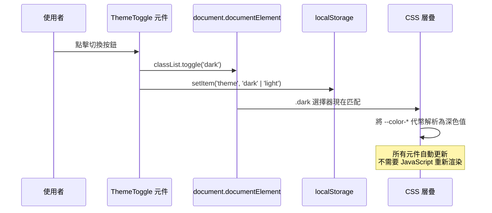

# 主題與深色模式

設計系統中的每個元件都會渲染顏色：背景色、文字顏色、邊框顏色、互動狀態顏色。問題不在於元件是否使用顏色——它們必須使用——而在於這些顏色是以硬編碼值表達，還是以共享語義契約的參照表達。

當顏色被硬編碼——`bg-white`、`text-gray-900`、`border-gray-200`——深色模式需要修改每個元件。一個有 50 個元件的程式庫需要更新 50 個檔案，且有遺漏某個的風險。當顏色以 CSS 自訂屬性參照表達——`var(--color-surface-page)`、`var(--color-text-primary)`、`var(--color-border-subtle)`——深色模式只需要一次性覆蓋一組變數，零元件更改，零 JavaScript 重新渲染。

本文涵蓋作為主題引擎的 CSS 自訂屬性層疊、系統偏好偵測與使用者控制切換的正確實作、伺服器端渲染閃爍的特定問題，以及告訴瀏覽器對表單控制項、捲軸和選取高亮套用原生深色模式的 `color-scheme` CSS 屬性。

## 設計思路

### 作為主題引擎的 CSS 自訂屬性

CSS 自訂屬性層疊是使主題運作的機制。亮色主題代幣在 `:root` 上定義，深色主題覆蓋在套用於 `html` 或 `:root` 元素的 `[data-theme="dark"]` 或 `.dark` 上定義。所有元件參照語義代幣。當 class 或屬性改變時，層疊將代幣解析為深色值，每個參照這些代幣的元素自動更新——無需 JavaScript 重新渲染元件。

```css
/* 亮色主題：:root 上的預設值 */
:root {
  --color-surface-page: hsl(0 0% 100%);
  --color-surface-raised: hsl(0 0% 98%);
  --color-text-primary: hsl(222 47% 11%);
  --color-text-secondary: hsl(215 16% 47%);
  --color-border-subtle: hsl(220 13% 91%);
  --color-interactive-default: hsl(217 91% 60%);
}

/* 深色主題：套用於 html/root 的 .dark 上的覆蓋值 */
.dark {
  --color-surface-page: hsl(222 47% 11%);
  --color-surface-raised: hsl(217 33% 17%);
  --color-text-primary: hsl(210 40% 98%);
  --color-text-secondary: hsl(215 20% 65%);
  --color-border-subtle: hsl(217 33% 25%);
  --color-interactive-default: hsl(213 94% 68%);
}
```

元件永遠不設定 `background-color: white` 或 `color: #111`。它們設定 `background-color: var(--color-surface-page)` 和 `color: var(--color-text-primary)`。主題決定這些值是什麼。

### prefers-color-scheme：系統偏好基準線

`prefers-color-scheme` 是反映使用者作業系統色彩方案設定的 CSS media query。它不需要 JavaScript，也不需要儲存的偏好：

```css
@media (prefers-color-scheme: dark) {
  :root {
    --color-surface-page: hsl(222 47% 11%);
    /* ... 其他深色代幣覆蓋 ... */
  }
}
```

這是基準線。在 OS 偏好中設定了「深色模式」的使用者自動獲得深色主題，無需任何應用程式內的使用者互動、無需任何儲存的偏好、無需任何 JavaScript 執行。即使 JavaScript 載入失敗，它也能運作。

限制是 `prefers-color-scheme` 反映的是 OS 設定——如果使用者希望應用程式在 OS 為深色模式時使用亮色模式，純 CSS 實作無法實現。基於 class 的切換解決了這個問題。

### 使用者覆蓋的基於 Class 的切換

基於 class 的切換允許使用者在應用程式中覆蓋系統偏好。實作包含三個部分：

1. 從 `localStorage` 讀取使用者儲存偏好並在 `document.documentElement` 上設定 class 的 JavaScript 函式。
2. 讀取和寫入偏好並更新 class 的 React（或框架特定）切換元件。
3. 在 `<head>` 中同步套用儲存的 class 以防止閃爍的內聯 `<script>`，必須在首次繪製前執行。

```js
// 讀取並套用偏好
function applyTheme() {
  const stored = localStorage.getItem('theme');
  const prefersDark = window.matchMedia('(prefers-color-scheme: dark)').matches;
  const isDark = stored === 'dark' || (!stored && prefersDark);
  document.documentElement.classList.toggle('dark', isDark);
}
```

`classList.toggle('dark', isDark)` 形式優於條件式 add/remove 呼叫——它是單次呼叫，在兩個方向上將 class 設定為正確的狀態。

### SSR 閃爍問題

伺服器端渲染帶來了特定挑戰：伺服器在沒有存取使用者儲存主題偏好的情況下渲染 HTML。用戶端的首次繪製使用伺服器渲染的 HTML——反映預設（亮色）主題。幾分之一秒後，JavaScript 執行、讀取 `localStorage`，並套用深色 class。頁面從亮色閃爍到深色。這被稱為主題的 FOUC（Flash of Unstyled Content，無樣式內容閃爍）。

修復方法是在 `<head>` 中放置一個內聯 `<script>` 標籤，它同步執行——在瀏覽器解析文件其餘部分之前——讀取 `localStorage`，並套用主題 class：

```html
<head>
  <!-- 此 script 必須是內聯的，且不能有 defer 或 async 屬性。
       它必須在首次繪製前同步執行。
       defer 或 async 的 script 在 HTML 解析後執行——為時已晚。 -->
  <script>
    (function() {
      var stored = localStorage.getItem('theme');
      var prefersDark = window.matchMedia('(prefers-color-scheme: dark)').matches;
      if (stored === 'dark' || (!stored && prefersDark)) {
        document.documentElement.classList.add('dark');
      }
    })();
  </script>
</head>
```

此 script 有意設計為阻塞渲染。阻塞渲染意味著瀏覽器在此 script 執行完之前無法顯示頁面——這正是防止閃爍的機制。script 很小（幾百個位元組），執行時間以微秒計，因此阻塞渲染的代價可以忽略不計。替代方案——React 中的 `useEffect`、動態 script 插入——在首次繪製後執行，無法防止閃爍。

### `color-scheme` CSS 屬性

`color-scheme` 是一個 CSS 屬性，告訴瀏覽器元素的哪個色彩方案是作用中的。當 `color-scheme: dark` 設定在 `:root` 上時，瀏覽器對表單元素（`<input>`、`<select>`、`<textarea>`）、捲軸和文字選取高亮套用其原生深色模式樣式。若沒有此屬性，深色主題頁面可能有亮色捲軸、亮色 select 下拉選單和亮色 `<input>` 背景——因為瀏覽器不知道頁面是深色的。

```css
:root {
  color-scheme: light;
}

.dark {
  color-scheme: dark;
}
```

`color-scheme` 是一個單行新增，對深色主題中原生 UI 元素的視覺一致性有顯著效果。它應該始終與深色模式的 CSS 自訂屬性覆蓋一起加入。

### 代幣範圍：只有語義代幣需要 Variant

原始代幣是原始值：

```css
:root {
  --color-blue-500: hsl(217 91% 60%);
  --color-blue-400: hsl(213 94% 68%);
  --color-gray-900: hsl(222 47% 11%);
  --color-gray-50: hsl(210 40% 98%);
}
```

這些在主題之間從不改變，是設計系統的調色板。語義代幣將意圖映射到原始代幣：

```css
:root {
  --color-interactive-default: var(--color-blue-500);
  --color-text-primary: var(--color-gray-900);
}

.dark {
  --color-interactive-default: var(--color-blue-400);
  --color-text-primary: var(--color-gray-50);
}
```

只有語義層在主題之間改變。這是正確的結構。在 `.dark` 中覆蓋原始代幣——改變 `--color-blue-500` 解析的結果——破壞了代幣作為原始值參照的契約，並造成對原始代幣所代表含義的混淆。

## 最佳實踐

**只有語義代幣需要深色模式 variant。** 原始代幣是不會改變的調色板值。只有語義代幣——表達意圖的——才有特定主題的覆蓋。將原始代幣保留在 `.dark` 覆蓋之外。

**只對顏色屬性使用 `transition`，不對 `all` 使用。** 在主題之間轉換時，只對 color、background-color 和 border-color 做動畫。使用 `transition: all` 會對所有改變的 CSS 屬性做動畫，包括 width 和 height 等版面配置屬性。這會在主題切換期間內容改變的元件上產生意外動畫。

**在根元素上設定 `color-scheme`。** 在 `:root` 上加入 `color-scheme: light`，在 `.dark` 覆蓋中加入 `color-scheme: dark`。這確保原生瀏覽器 UI 元素（捲軸、表單控制項）與作用中的主題一致。

**在兩個主題中測試對比度。** WCAG 2.1 AA 要求亮色和深色主題中的一般文字都要有最低 4.5:1 的對比率。在亮色模式下通過的顏色不一定在深色模式下也通過。兩者都要測試。`@storybook/addon-a11y` 外掛程式在每個 story 渲染時執行 axe-core 對比度檢查，有助於在開發過程中發現失敗。

**在 `localStorage` 中儲存使用者偏好，而非 cookie。** Cookie 隨每個 HTTP 請求發送——不適合像主題偏好這樣的僅限用戶端的狀態。`localStorage` 是同步的、可在內聯 script 中存取，適合不需要伺服器可讀的偏好。

**禁止（MUST NOT）**在元件樣式中使用硬編碼的顏色值。元件若渲染了 `bg-white` 或 `color: #1a1a1a`，在每個新主題出現時都必須逐一更新。將所有硬編碼值替換為語義 CSS 自訂屬性參照（`var(--color-surface-page)`、`var(--color-text-primary)`），讓主題切換變成一次 CSS 變數覆蓋，不需要任何元件變更。

**禁止（MUST NOT）**對原始代幣（primitive token）新增特定主題的覆蓋。原始代幣代表調色板值，不代表語義意圖。在深色主題下覆蓋一個原始代幣（如 `--color-blue-500`）會把主題邏輯洩漏進調色板層，並導致所有參照該原始代幣的語義代幣意外改變。主題覆蓋只應存在於語義代幣上。

**應該（SHOULD）**同時實作 `prefers-color-scheme` 媒體查詢偵測與基於 class 的使用者控制切換。媒體查詢服務於尚未設定應用程式內偏好的使用者；class 切換服務於想在應用程式中使用與 OS 設定不同模式的使用者。只實作其中一種，會讓另一類使用者有破損的體驗。

## 主題切換序列



## 範例

以下三部分範例展示完整的深色模式實作：CSS 代幣覆蓋、React `ThemeToggle` 元件，以及 SSR 閃爍防止內聯 script。

```css
/* tokens.css — 語義代幣定義 */

:root {
  /* 亮色主題語義代幣 */
  --color-surface-page: hsl(0 0% 100%);
  --color-surface-raised: hsl(0 0% 98%);
  --color-text-primary: hsl(222 47% 11%);
  --color-text-secondary: hsl(215 16% 47%);
  --color-border-subtle: hsl(220 13% 91%);
  --color-interactive-default: hsl(217 91% 60%);
  --color-interactive-hover: hsl(221 83% 53%);

  /* color-scheme 告訴瀏覽器套用亮色原生 UI */
  color-scheme: light;

  /* 只對顏色屬性做 transition——不對 'all' */
  transition:
    color 150ms ease,
    background-color 150ms ease,
    border-color 150ms ease;
}

/* 深色主題：只覆蓋語義代幣 */
.dark {
  --color-surface-page: hsl(222 47% 11%);
  --color-surface-raised: hsl(217 33% 17%);
  --color-text-primary: hsl(210 40% 98%);
  --color-text-secondary: hsl(215 20% 65%);
  --color-border-subtle: hsl(217 33% 25%);
  --color-interactive-default: hsl(213 94% 68%);
  --color-interactive-hover: hsl(210 100% 75%);

  /* color-scheme 告訴瀏覽器套用深色原生 UI */
  color-scheme: dark;
}
```

```tsx
// ThemeToggle.tsx — 使用者控制切換的 React 元件

'use client';
import { useEffect, useState } from 'react';

type Theme = 'light' | 'dark';

function getInitialTheme(): Theme {
  if (typeof window === 'undefined') return 'light'; // SSR 防護
  const stored = localStorage.getItem('theme') as Theme | null;
  if (stored) return stored;
  return window.matchMedia('(prefers-color-scheme: dark)').matches ? 'dark' : 'light';
}

export function ThemeToggle() {
  const [theme, setTheme] = useState<Theme>('light');

  useEffect(() => {
    // 從儲存的偏好或系統偏好初始化
    setTheme(getInitialTheme());
  }, []);

  function toggleTheme() {
    const next: Theme = theme === 'dark' ? 'light' : 'dark';
    setTheme(next);
    document.documentElement.classList.toggle('dark', next === 'dark');
    localStorage.setItem('theme', next);
  }

  return (
    <button
      type="button"
      onClick={toggleTheme}
      aria-label={`切換至${theme === 'dark' ? '亮色' : '深色'}模式`}
    >
      {theme === 'dark' ? '亮色模式' : '深色模式'}
    </button>
  );
}
```

> **注意：** 上方使用文字標籤僅為便於說明。實際專案中，切換按鈕通常使用圖示元件——例如 `lucide-react` 的 `<Sun />` 與 `<Moon />`——並在 SVG 上設定 `aria-hidden="true"`，在按鈕上設定 `aria-label`（參見 FEE-907 的無障礙圖示模式）。

```html
<!-- <head> 中的內聯 script，用於防止 SSR 閃爍。
     必須是內聯的。不能有 defer 或 async。
     在首次繪製前同步執行。 -->
<head>
  <script>
    (function() {
      var stored = localStorage.getItem('theme');
      var prefersDark = window.matchMedia('(prefers-color-scheme: dark)').matches;
      if (stored === 'dark' || (!stored && prefersDark)) {
        document.documentElement.classList.add('dark');
      }
    })();
  </script>
</head>
```

三個部分協同運作：CSS 在沒有 JavaScript 重新渲染的情況下處理視覺更新；React 元件處理使用者互動；內聯 script 處理 SSR 同步問題。

## 常見錯誤

**在元件樣式中硬編碼顏色。** 在 Tailwind 中使用 `bg-white` 或 `text-gray-900`，或在 CSS 中使用 `background-color: white`，意味著深色模式需要更改元件。修復方法是使用語義 CSS 自訂屬性參照：在 Tailwind 中使用 `bg-[var(--color-surface-page)]`，或在 CSS 中使用 `background-color: var(--color-surface-page)`。

**使用 `useEffect` 進行主題初始化而不使用內聯 script。** 讀取 `localStorage` 並套用深色 class 的 `useEffect` 在元件掛載後執行——在首次繪製後。在伺服器渲染的頁面上，`localStorage` 中儲存了深色模式偏好，每次導覽時頁面都會從亮色閃爍到深色。唯一的修復是 `<head>` 中的內聯阻塞渲染 script。

## 相關 FEE

- [FEE-901：設計代幣](./901.md) — 語義代幣層使深色模式成為單一的 CSS 變數覆蓋，而非元件層級的更改。
- [FEE-207：CSS 自訂屬性與主題設定](../CSS%20and%20Layout%20Systems/207.md) — 使主題運作的 CSS 自訂屬性層疊、繼承和優先順序規則。
- [FEE-1003：色彩、對比與視覺無障礙](../Accessibility/1003.md) — WCAG 2.1 對比度要求獨立適用於亮色和深色主題。

## 參考資料

- [MDN：prefers-color-scheme](https://developer.mozilla.org/en-US/docs/Web/CSS/@media/prefers-color-scheme) — CSS media query 參考、瀏覽器支援表和範例。
- [MDN：color-scheme](https://developer.mozilla.org/en-US/docs/Web/CSS/color-scheme) — `color-scheme` CSS 屬性參考，包含原生 UI 元素行為的說明。
- [WCAG 2.1 — 對比度（最低）1.4.3](https://www.w3.org/WAI/WCAG21/Understanding/contrast-minimum.html) — 文字內容的規範性對比率要求。
- [Next.js — 深色模式](https://nextjs.org/docs/app/building-your-application/styling/css#dark-mode) — Next.js 主題指南，包含用於處理 SSR 閃爍的 `next-themes` 套件。
