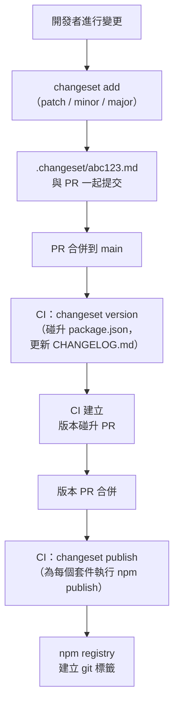

# 設計系統版本控制與發布

以 npm 套件出貨的設計系統是一個共享 API。消費者依賴它：他們匯入元件 props、期待預設行為保持穩定、針對文件化的介面撰寫測試。當設計系統團隊在沒有宣告為破壞性變更的情況下修改 prop、重新命名元件或改變預設行為時，消費者的建置會意外中斷——通常在 CI 中，有時在生產環境。

本文中的實踐以 REST API 團隊對端點契約所採用的嚴格程度來對待元件函式庫的公開介面：對所有變更使用語義版本控制、記錄在出貨前溝通破壞性變更的流程，以及讓工作流程在 CI 中可強制執行的工具（Changesets）。

本文涵蓋分離可發布表面區域的 monorepo 套件結構、用於版本控制和發布的 Changesets 工作流程、防止「兩個 React」問題的 `peerDependencies` 原則，以及啟用消費者正確 tree-shaking 和 TypeScript 解析的 `package.json` 設定欄位（`exports`、`sideEffects`）。

## 設計思路

### Monorepo 套件結構

設計系統很少是單一套件。最小結構分離了消費者可能希望獨立使用的關注點：

```
packages/
  tokens/          # CSS 自訂屬性、設計代幣
  components/      # React 元件函式庫
  icons/           # 圖示集
```

每個套件都有自己的 `package.json`、自己的版本和自己的發布生命週期。只需要代幣的消費者只安裝 `@acme/tokens`——沒有 React 相依。需要元件的消費者安裝 `@acme/components`，它將 `@acme/tokens` 列為常規相依（始終以相同版本打包）或對等相依（如果消費者可能已經有代幣並希望版本控制）。

獨立套件也在模組邊界強制執行關注點分離。只從 `@acme/tokens` 匯入的團隊無法意外匯入 React 元件。從 `@acme/icons` 匯入的團隊可以在非 React 專案中使用圖示。

Monorepo 工具（`pnpm workspaces`、`turborepo`、`nx`）管理跨套件的建置和測試管線。FEE-805 涵蓋 monorepo 工具。本文重點介紹版本控制和發布工作流程。

### Changesets 工作流程

Changesets 是 monorepo 中版本控制和發布的標準工具。工作流程分為三個階段：

**開發階段**：當開發者進行應版本化的變更時，他們執行 `changeset add`，選擇受影響的套件、semver 碰升類型（patch/minor/major），並撰寫描述。工具寫入 `.changeset/<random-id>.md` 檔案：

```md
---
"@acme/components": minor
---

為 Button 新增 `asChild` prop，透過 Radix Slot 啟用多態渲染。
```

此檔案與程式碼變更在同一個 PR 中提交。描述成為面向消費者的 changelog 條目。

**版本碰升階段**：當團隊準備好發布時，CI 執行 `changeset version`。此命令讀取所有累積的 `.changeset/*.md` 檔案，依適當的量碰升受影響套件的 `package.json` 版本欄位，並將變更寫入 `CHANGELOG.md` 檔案。`.changeset/*.md` 檔案被刪除，建立「版本碰升」提交。

**發布階段**：CI 執行 `changeset publish`。此命令讀取更新後的 `package.json` 檔案，對版本尚未在 npm registry 中的每個套件執行 `npm publish`，並為每個發布版本建立 git 標籤。

`changesets/action@v1` GitHub Action 自動化版本和發布階段：它為版本碰升建立 PR，當該 PR 合併時，自動執行 publish。

### 兩個 React 問題

React **必須**在 `peerDependencies` 中，而不是 `dependencies`。這是 React 函式庫最重要的對等相依規則。

當 React 在 `dependencies` 中時，npm 在函式庫自己的 `node_modules` 中安裝函式庫指定的 React 版本。消費應用程式的 `node_modules` 中也有 React。如果版本不同——甚至相同版本但由於提升解析而安裝了兩次——React 會被載入兩次。React 對 hooks 使用模組級別的狀態。載入 React 兩次意味著 hooks 以「Invalid hook call」錯誤失敗。Context 不跨越 React 實例邊界。

React 元件函式庫正確的 `package.json`：

```json
{
  "name": "@acme/components",
  "peerDependencies": {
    "react": ">=17",
    "react-dom": ">=17"
  },
  "devDependencies": {
    "react": "^18.0.0",
    "react-dom": "^18.0.0"
  }
}
```

`peerDependencies` 宣告需求。`devDependencies` 為本地開發和測試安裝版本。消費者的應用程式在執行期提供實際的 React 實例。

TypeScript 也是對等相依，而非常規相依。如果 `typescript` 在 `dependencies` 中，npm 可能在函式庫的 `node_modules` 中安裝與消費者的 TypeScript 不同的版本，這可能產生微妙的型別相容性錯誤。

### `exports` 欄位與 TypeScript 解析

現代 `package.json` 使用 `exports` 欄位定義消費者可以從套件匯入的內容。沒有 `exports` 欄位，消費者可以通過路徑匯入任何檔案。有了 `exports` 欄位，只有明確宣告的進入點可以存取。

TypeScript 元件函式庫正確的 `exports` 設定：

```json
{
  "exports": {
    ".": {
      "import": "./dist/index.js",
      "require": "./dist/index.cjs",
      "types": "./dist/index.d.ts"
    },
    "./tokens": {
      "import": "./dist/tokens.js",
      "types": "./dist/tokens.d.ts"
    }
  },
  "types": "./dist/index.d.ts"
}
```

`import` 條件由 ESM 打包工具（Vite、webpack 5、Rollup）使用。`require` 條件由 CommonJS 環境使用。`types` 條件由 TypeScript 用來找到宣告檔案。

若 `exports` 中沒有 `types` 條件，TypeScript 回退到頂層 `types` 欄位，這可能無法為子路徑匯入正確解析。匯入 `@acme/components/tokens` 的消費者若沒有 tokens 子路徑自己的 `types` 條件，就不會獲得 TypeScript 型別。

### `sideEffects: false`

`package.json` 中的 `sideEffects` 欄位告訴打包工具套件是否有在匯入時產生副作用的模組。副作用是在匯入時執行且無法被 tree-shaking 移除的程式碼——例如，一個全域自我註冊或修改 `window` 的模組。

對於只包含 React 元件和工具函式的元件函式庫，`"sideEffects": false` 是正確的。這告訴打包工具：「此套件中的每個模組都是純的——如果你匯入 Button 但不使用 Dialog，你可以從 bundle 中完全移除 Dialog 的程式碼。」

```json
{
  "sideEffects": false
}
```

如果套件包含必須匯入以獲得副作用的 CSS 檔案（注入重置樣式的 `global.css`），使用陣列：

```json
{
  "sideEffects": ["**/*.css"]
}
```

缺少 `"sideEffects": false` 意味著打包工具無法對套件進行 tree-shake。從 `@acme/components` 只匯入 `Button` 的消費者會在 bundle 中得到整個元件函式庫。

### UI 函式庫的 Semver 規則

UI 函式庫的「破壞性變更」有時在實務上並不那麼明確。視覺變更——例如讓按鈕高出兩個像素
——不改變 prop API，但可能在消費方的像素完美快照測試中造成失敗。行為變更——例如調整動畫
時序——同樣不改變 prop API，但可能讓互動測試失敗。設計系統應明確記錄「破壞性」的工作
定義，並與消費方共享，讓消費方知道主版本碰升在實務上代表什麼。多數團隊的共識是：任何需
要消費方修改程式碼才能維持現有行為的變更，即為破壞性變更。保留元件語義意圖的視覺變更不
算破壞性，但值得在 changelog 中詳細說明。

常見 UI 函式庫變更的版本控制規則摘要：

| 變更類型 | 碰升 |
|---|---|
| 移除 prop | 主版本 |
| 重新命名 prop | 主版本 |
| 改變 prop 預設值 | 主版本 |
| 新對等相依套件的主版本 | 主版本 |
| 新增可選 prop | 次版本 |
| 新增新元件 | 次版本 |
| 為現有元件新增新 variant | 次版本 |
| 視覺錯誤修復（無 API 變更） | 修補版本 |
| 無障礙修復（無 API 變更） | 修補版本 |
| 內部重構（無 API 變更） | 修補版本 |

## 最佳實踐

**在合併任何修改套件的 PR 之前執行 `changeset add`。** 使用 `changeset status --since=origin/main` 添加 CI 檢查，在 PR 修改套件原始碼但沒有相應 changeset 檔案時失敗。這防止團隊意外合併未版本化的變更。

**在發布前用 `npm pack --dry-run` 測試發布套件。** 這模擬發布並精確顯示哪些檔案會包含在 tarball 中。此檢查發現的常見錯誤：`dist/` 目錄缺失（發布前未執行建置）、包含 `node_modules`（`.npmignore` 缺失）、或不必要地包含原始 `.ts` 檔案。

**在 `package.json` 中使用 `"sideEffects": false`。** 這是 tree-shaking 正確運作所必需的。沒有它，打包工具無法從消費者 bundle 中消除未使用的元件。

**正確發布 `types` 與 `exports`。** 在 `package.json` 中使用 `exports` 映射，同時包含 `import` 與 `types` 條目：`"exports": { ".": { "import": "./dist/index.js", "types": "./dist/index.d.ts" } }`。沒有 `types`，TypeScript 消費者將無法取得型別資訊。沒有 `exports`，打包工具可能解析到錯誤的進入點。請用 `npm pack --dry-run` 和在消費端專案執行 `tsc --noEmit` 確認兩者均已正確提供。

**以廣泛的版本範圍將 React 和 TypeScript 宣告為 `peerDependencies`。** 使用 `"react": ">=17"` 而非 `"react": "^18.0.0"`。固定到排除有效消費者 React 版本的主版本範圍會強制不必要的升級，並在多個專案共用 React 版本的 monorepo 中造成版本衝突。

**從 CI 而非開發者機器發布。** 本地發布使用開發者的 npm 憑證和本地狀態執行。CI 從乾淨的檢出與一致的憑證發布。`changesets/action@v1` GitHub Action 正確實作了這一點。

**必須（MUST）**將每個移除 prop、重新命名 prop、改變預設值，或要求新的對等相依套件主版本的變更，視為破壞性變更並以主版本號碰升（major version bump）傳達。以修補版本發布破壞性 API 變更，會讓期望安全升級的消費者意外中斷，侵蝕對版本控制信號的信任，並導致消費者不再及時升級，也就無法接收安全補丁和錯誤修復。

**禁止（MUST NOT）**對任何改變公開元件 API 的變更發布修補版本或次版本。語義版本控制是設計系統團隊與消費方團隊之間的溝通機制。修補版本碰升代表「可立即安全升級」；以破壞性變更違背這個信號，會對每個按該信號升級的消費者施加計劃外的遷移成本。

## Changesets 發布流程



## 範例

### 套件設定

```json
// packages/components/package.json
{
  "name": "@acme/components",
  "version": "2.1.0",
  "description": "ACME Design System React 元件",
  "main": "./dist/index.cjs",
  "module": "./dist/index.js",
  "types": "./dist/index.d.ts",
  "exports": {
    ".": {
      "import": "./dist/index.js",
      "require": "./dist/index.cjs",
      "types": "./dist/index.d.ts"
    }
  },
  "files": ["dist"],
  "sideEffects": false,
  "peerDependencies": {
    "react": ">=17",
    "react-dom": ">=17"
  },
  "devDependencies": {
    "react": "^18.2.0",
    "react-dom": "^18.2.0",
    "typescript": "^5.0.0"
  },
  "dependencies": {
    "@acme/tokens": "workspace:*",
    "@radix-ui/react-dialog": "^1.0.0",
    "class-variance-authority": "^0.7.0"
  }
}
```

### Changeset 檔案

```md
---
"@acme/components": major
---

**破壞性變更：** 從 Button 移除已棄用的 `size="xs"`。請改用 `size="sm"`。

升級後使用 `size="xs"` 的消費者將收到 TypeScript 錯誤。將所有用法替換為 `size="sm"`。
```

### GitHub Actions 發布工作流程

```yaml
# .github/workflows/release.yml
name: Release

on:
  push:
    branches: [main]

jobs:
  release:
    name: Release
    runs-on: ubuntu-latest
    steps:
      - uses: actions/checkout@v4
        with:
          # changeset version 正確計算需要完整歷史
          fetch-depth: 0

      - uses: pnpm/action-setup@v4
        with:
          version: 8

      - uses: actions/setup-node@v4
        with:
          node-version: 20
          cache: pnpm

      - run: pnpm install --frozen-lockfile

      - run: pnpm build

      - name: Create Release PR or Publish
        uses: changesets/action@v1
        with:
          publish: pnpm changeset publish
          version: pnpm changeset version
          commit: "chore(release): version packages"
          title: "chore(release): version packages"
        env:
          GITHUB_TOKEN: ${{ secrets.GITHUB_TOKEN }}
          NPM_TOKEN: ${{ secrets.NPM_TOKEN }}
```

`changesets/action@v1` 自動處理兩階段工作流程：當 changeset 存在且尚未版本化時，它建立「version packages」PR。當該 PR 合併時，在 main 分支上執行 `changeset publish`。

## 常見錯誤

**React 在 `dependencies` 而非 `peerDependencies` 中。** 這是最常見的錯誤，也是最難偵錯的。症狀是「Invalid hook call」——React 在模組圖中偵測到自身的兩個副本並拋出錯誤。修復方法是將 React 移動到函式庫 `package.json` 中的 `peerDependencies`，並確保消費應用程式提供單一的 React 實例。

## 相關 FEE

- [FEE-805：Monorepo 工具](../Build%20Tooling%20and%20Module%20Systems/805.md) — `pnpm workspaces`、`turborepo`，以及管理多套件儲存庫的 monorepo 工具。
- [FEE-1507：發布自動化](../CI%20CD%20and%20Deployment/1507.md) — 自動化發布的 CI/CD 管線模式。
- [FEE-1604：提交訊息規範與 commitlint](../Developer%20Experience%20and%20Tooling/1604.md) — 為 changelog 生成提供輸入的提交訊息規範（Conventional Commits）。

## 參考資料

- [Changesets 文件](https://github.com/changesets/changesets) — Changesets CLI 的官方文件：`add`、`version`、`publish` 和設定。
- [npm `exports` 欄位文件](https://docs.npmjs.com/cli/v10/configuring-npm/package-json/#exports) — `package.json` `exports` 條件的官方參考。
- [changesets/action GitHub Action](https://github.com/changesets/action) — 自動化版本碰升 PR 和 npm 發布的 GitHub Action。
- [TypeScript — 發布套件](https://www.typescriptlang.org/docs/handbook/declaration-files/publishing.html) — TypeScript 發布具有型別安全的 npm 套件的官方指南。
