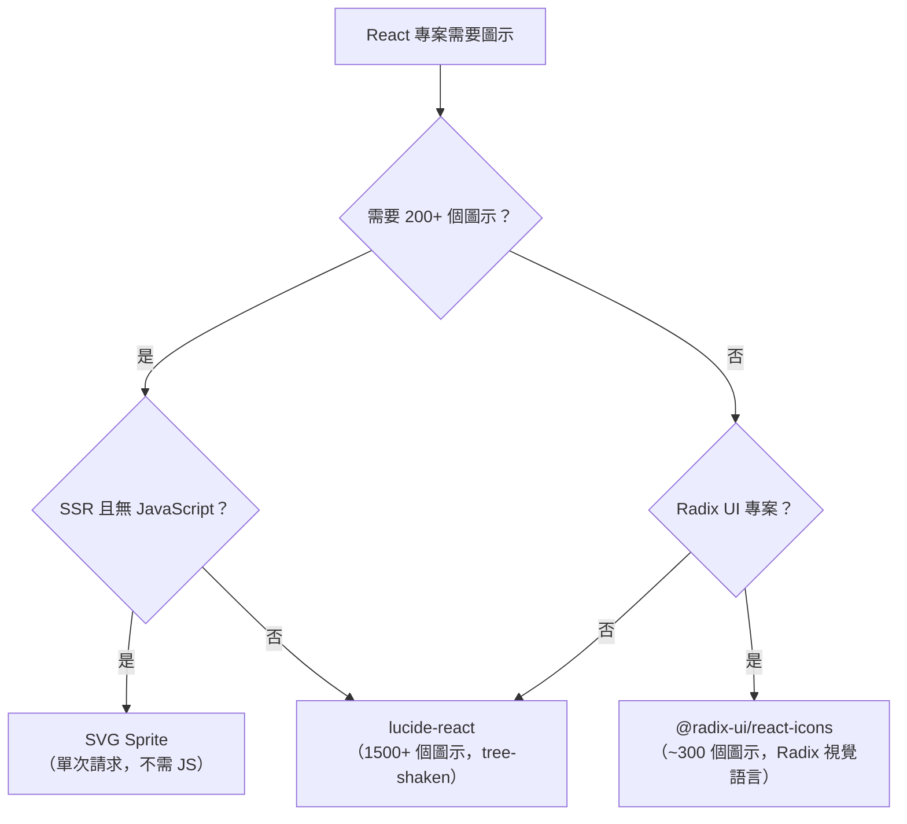

# 圖示系統

網頁上的圖示可以用四種方式呈現：`` 標籤、圖示字型字元、內聯 SVG，或渲染 SVG 的 React 元件。這個選擇不是美學問題——它對樣式能力、無障礙性、bundle 大小和開發者體驗有直接影響。這四種方式在業界歷史的不同時間點都曾被使用，舊版程式庫通常並排包含多種方式。理解每種方式的取捨，對於在新專案中做出正確選擇，以及遷移舊版實作都是必要的。

`` 標籤無法以 `currentColor` 設定樣式。圖示字型有已知的無障礙性失敗模式和渲染品質不一致問題。內聯 SVG 和 React SVG 元件是唯一能完整參與 CSS 層疊、從父元素繼承 `color`，並支援 TypeScript props 的傳遞機制。

本文涵蓋三種可行的傳遞方式——每個圖示一個元件、SVG sprite 和圖示字型（舊版）——推薦的預設函式庫（`lucide-react`、`@radix-ui/react-icons`）、各打包工具的 tree-shaking 行為、自訂圖示集的慣例，以及裝飾性與有意義圖示所需的無障礙模式。本文也說明 `currentColor` 繼承模型和讓圖示具備響應式並可與設計系統其餘部分組合的尺寸慣例。

## 原則

圖示是 UI 元件，而非圖片資產。以 React 元件形式傳遞的圖示參與型別系統、接受 props，並能被 tree-shaken。各團隊**必須不**以 `` 標籤傳遞 UI 圖示——`` 無法以 `currentColor` 設定樣式、無法在 hover/focus 時接受 CSS 顏色變化，且在每個使用位置都需要管理 `alt` 文字。

`currentColor` 能力是關鍵限制。在 hover 或 focus 時改變顏色的按鈕——`text-primary hover:text-primary-hover`——會將該顏色傳播給任何使用 `currentColor` 作為 `stroke` 或 `fill` 的 SVG 子元素。`` 不接受 CSS 繼承，無法參與其中。每個以 `` 表示的按鈕內圖示都需要單獨的明確 hover 和 focus 樣式，重複了按鈕本身的 hover 樣式。

各團隊**應該**優先使用 `lucide-react` 作為 React 專案的預設圖示函式庫。它提供超過 1,500 個具有一致設計語言（2px 描邊、24x24 viewBox）的圖示、可 tree-shaken 的具名匯出和 TypeScript props。它是 shadcn/ui（FEE-903）的預設圖示集，使其成為已使用該堆疊的專案的低摩擦選擇。

## 設計思路

### 每個圖示一個元件：現代預設

每個圖示都是一個 `.tsx` 檔案，匯出渲染內聯 SVG 的 React 元件。該元件單獨被 tree-shaken：匯入 `ChevronDown` 不會在 bundle 中包含 `Settings` 或 `User`。

```tsx
// lucide-react 出貨數百個這樣的元件：
export const ChevronDown = ({ size = 24, color = 'currentColor', ...props }) => (
  <svg width={size} height={size} viewBox="0 0 24 24" fill="none"
    stroke={color} strokeWidth={2} strokeLinecap="round" strokeLinejoin="round"
    {...props}
  >
    <polyline points="6 9 12 15 18 9" />
  </svg>
);
```

當打包工具能靜態分析匯入時，tree-shaking 可以正確運作。使用 Vite（底層使用 Rollup），從 `lucide-react` 的具名匯入會自動被 tree-shaken：

```tsx
import { ChevronDown, Settings } from 'lucide-react';
// bundle 中只包含 ChevronDown 和 Settings。
// 所有其他圖示都被消除。
```

使用 webpack，tree-shaking 需要套件 `package.json` 中的 `"sideEffects": false`。`lucide-react` 包含此欄位。結果相同：只有匯入的圖示被打包。

失敗模式：`import * as Icons from 'lucide-react'`。這在每個打包工具中都會使 tree-shaking 失效，完整的圖示函式庫——所有 1,500+ 個圖示——都會包含在 bundle 中。避免對圖示函式庫使用命名空間匯入。

### SVG Sprite

SVG sprite 是一個包含許多 `<symbol>` 元素的單一 SVG 檔案，每個都有唯一的 `id`。圖示使用 `<use href="#icon-name">` 渲染：

```html
<!-- sprite.svg -->
<svg xmlns="http://www.w3.org/2000/svg" style="display: none;">
  <symbol id="chevron-down" viewBox="0 0 24 24">
    <polyline points="6 9 12 15 18 9" />
  </symbol>
  <symbol id="settings" viewBox="0 0 24 24">
    <!-- ... -->
  </symbol>
</svg>

<!-- 使用方式 -->
<svg width="24" height="24" aria-hidden="true">
  <use href="/sprite.svg#chevron-down" />
</svg>
```

優點：所有圖示只需一個 HTTP 請求（或內聯在 HTML 中）、`currentColor` 有效、不需要 JavaScript。可在非 React 情境中使用。

缺點：無法對每個圖示進行 tree-shaking（sprite 中的所有圖示始終被載入）、需要建置步驟生成 sprite 檔案、`<use>` 參照難以做型別檢查、在元件驅動工作流程中更難管理。

SVG sprite 是 SSR 專用或無 JS 環境（元件每圖示方式不可行）的正確選擇，或對同時載入許多不同圖示且受益於單次請求優化的效能關鍵頁面。

### 圖示字型：舊版，不推薦

圖示字型以自訂字型中的字元傳遞圖示。Unicode 碼位的字形渲染為圖示。此方式有持久性問題：

- **渲染品質**：圖示渲染為文字，受字型反鋸齒影響。在非 Retina 螢幕上，小尺寸的圖示字型可能顯得模糊或錯位。
- **無障礙性**：圖示字型字形是文字字元。螢幕閱讀器會嘗試讀取它們。標準解決方案是在每個字形元素上設定 `aria-hidden="true"`，但這在每個使用位置都需要紀律，容易遺漏。
- **`currentColor`**：在某些瀏覽器中有效，但比 SVG `stroke` 和 `fill` 屬性的可靠性低，特別是對於複雜的多色圖示。
- **載入失敗**：如果字型載入失敗，會渲染空白方塊或 Unicode 替換字元，沒有後備。

不推薦在新專案中使用圖示字型。只在維護移轉到 SVG 元件的成本不合理的舊系統時使用它們。

### lucide-react：推薦的預設

`lucide-react` 是 React 專案的推薦預設：

- **覆蓋範圍**：1,500+ 個圖示，定期以新的圖示請求更新。
- **一致性**：所有圖示使用 2px 描邊、24x24 viewBox 和圓角線端。視覺語言具有凝聚力，在 16px 到 48px 的尺寸下效果良好。
- **TypeScript props**：`size`（數字，預設 24）、`color`（字串，預設 'currentColor'）、`strokeWidth`（數字，預設 2）、`className`（字串）。全部可選且可組合。
- **Tree-shaking**：具名匯出，`package.json` 中有 `"sideEffects": false`。使用 Vite 時自動正確 tree-shaking，webpack 在尊重 `sideEffects` 時也正確。
- **shadcn/ui 整合**：`lucide-react` 是 shadcn/ui 的預設圖示函式庫。已使用 shadcn/ui 的專案已安裝它。

### @radix-ui/react-icons：Radix 優先的專案

`@radix-ui/react-icons` 出貨約 300 個設計用於匹配 Radix UI 視覺語言的圖示——與 Radix primitives 和 shadcn/ui 元件的設計美學一致。圖示集比 `lucide-react` 小，但為 Radix 優先的專案精心策劃。

當專案廣泛使用 Radix UI primitives，且圖示與 Radix 元件之間的視覺一致性是優先考量時，使用 `@radix-ui/react-icons`。對於需要更大圖示集的專案，改用 `lucide-react`——兩個函式庫可以共存。

### 自訂圖示元件

當專案有專有圖示集（由團隊設計，而非來自函式庫）時，每個圖示應以遵循與 `lucide-react` 相同慣例的 React SVG 元件撰寫：

- `stroke="currentColor"`（而非硬編碼的十六進位顏色）
- `viewBox="0 0 24 24"`（一致的座標空間）
- `width` 和 `height` 由帶有合理預設值的 `size` prop 驅動
- `aria-hidden`、`role`、`aria-label` 作為透過 `{...rest}` 傳遞的 props
- 從 barrel `index.ts` 具名匯出

自訂圖示的一致結構允許相同的無障礙包裝元件和尺寸慣例在自訂圖示集和同一專案中使用的任何第三方圖示中發揮作用。

### 特定打包工具的 Tree-Shaking 說明

Tree-shaking 行為取決於打包工具：

- **Vite（Rollup）**：任何套件的具名匯入都會被 Rollup 的範圍分析自動 tree-shaken。當 Rollup 能確定實際使用了哪些屬性時，命名空間匯入（`import *`）也會被部分 tree-shaken。儘管如此，具名匯入更安全，應作為預設。
- **webpack 5**：Tree-shaking 適用於標記有 `"sideEffects": false` 的套件。沒有該欄位，即使使用具名匯入，webpack 也無法消除未使用的匯出。`lucide-react` 和 `@radix-ui/react-icons` 都包含 `"sideEffects": false`。
- **webpack 4**：Tree-shaking 只適用於 ESM 輸出。如果圖示套件只出貨 CJS，webpack 4 無法對其進行 tree-shake。

對於大多數使用 Vite（新 React 專案的當前標準）的專案，圖示 tree-shaking 在具名匯入的情況下開箱即用。

### `currentColor` 與尺寸

SVG 圖示從其父元素繼承 `color`，因為 `lucide-react`（以及大多數 React SVG 圖示函式庫）使用 `stroke="currentColor"`。這意味著：

```tsx
// 圖示繼承按鈕的文字顏色，包括 hover/focus 狀態
<button className="text-gray-700 hover:text-blue-600">
  <Settings className="h-5 w-5" aria-hidden="true" />
  設定
</button>
```

當按鈕的文字顏色在 hover 時改變時，圖示的描邊顏色也隨之改變——不需要額外的 CSS。

對於尺寸，優先使用 CSS（Tailwind 中的 `h-5 w-5`，或 CSS 中的 `width: 1.25rem; height: 1.25rem`），而非 `size` prop，用於應隨文字情境縮放的圖示。在尺寸不應響應式變化的固定尺寸情境中使用 `size` prop。

使用 `em` 單位設定圖示尺寸會產生隨父元素字型大小縮放的圖示，適合行內圖示（句子或標題中的圖示）：

```css
.inline-icon {
  width: 1em;
  height: 1em;
}
```

## 最佳實踐

**對裝飾性圖示套用 `aria-hidden="true"`。** 已有可見文字標籤的按鈕內的圖示是裝飾性的。文字標籤提供了無障礙名稱。在 SVG 上加入 `aria-hidden="true"` 將其從無障礙樹中移除，並防止螢幕閱讀器嘗試描述 SVG 路徑或 title 元素。

**在圖示專用按鈕上加入 `aria-label`——在按鈕上，而非 SVG 上。** 只包含圖示的按鈕沒有可見文字標籤，必須提供無障礙名稱。在 `<button>` 元素上加入 `aria-label`，在 SVG 上標記 `aria-hidden="true"`。不要在 `<svg>` 上加入 `aria-label`——需要名稱的是互動元素（按鈕），而非圖示。

**永遠不要使用 `` 作為 UI 圖示。** `` 無法繼承 `currentColor`、無法接受 CSS hover/focus 顏色變化，且在每個使用位置都需要管理 `alt` 文字。使用 SVG 元件。

**匯入具名圖示，而非命名空間匯入。** `import { ChevronDown } from 'lucide-react'` 可正確 tree-shaken。`import * as Icons from 'lucide-react'` 會在 bundle 中包含整個函式庫。此規則適用於每個圖示函式庫，不只是 `lucide-react`。

**當尺寸應是響應式時，使用 CSS 設定圖示尺寸。** `lucide-react` 圖示上的 `size` prop 設定 SVG 的 `width` 和 `height` HTML 屬性。HTML 屬性比 CSS 屬性靈活性低——它們無法使用 media query、`em` 單位或 Tailwind 響應式前綴。對需要響應式尺寸的圖示使用 `className="h-5 w-5"` 或 CSS 規則。

**在程式碼審查中稽核遺漏 `aria-hidden` 的圖示使用。** 圖示無障礙屬性是容易在個人審查中忽略的細節。PR 範本中的一個檢查清單項目——「每個圖示是否都有 `aria-hidden='true'` 或父互動元素上的 `aria-label`？」——在合併前而非 a11y 稽核後發現遺漏的屬性。

**在整個應用程式中保持 `strokeWidth` 一致。** `lucide-react` 的預設 `strokeWidth={2}` 應保持為標準，除非設計系統明確規定了不同的粗細。在同一頁面上混合 `strokeWidth={1}` 和 `strokeWidth={2}` 的圖示會造成視覺不一致。如果設計系統使用不同的描邊粗細，在共用的 Icon 包裝元件中一次配置它，而非在每個呼叫位置傳遞 `strokeWidth`。

## 圖示函式庫決策指南



## 範例

以下三種模式示範了 React UI 中圖示三種主要使用情境的正確無障礙方式。

```tsx
import { Settings, Search, X } from 'lucide-react';

// 模式 1：帶有可見文字標籤的按鈕內的裝飾性圖示。
// 文字標籤提供無障礙名稱。
// aria-hidden="true" 完全從無障礙樹中移除圖示。
function SettingsButton() {
  return (
    <button type="button" className="flex items-center gap-2">
      <Settings className="h-4 w-4" aria-hidden="true" />
      設定
    </button>
  );
}

// 模式 2：圖示專用按鈕。
// 按鈕需要無障礙名稱——圖示無法提供。
// 按鈕上的 aria-label 提供名稱。
// SVG 上的 aria-hidden="true" 防止重複公告。
function CloseButton({ onClose }: { onClose: () => void }) {
  return (
    <button
      type="button"
      onClick={onClose}
      aria-label="關閉對話框"
      className="rounded p-1 hover:bg-gray-100"
    >
      <X className="h-4 w-4" aria-hidden="true" />
    </button>
  );
}

// 模式 3：帶有 currentColor、size prop 和 aria 傳遞的自訂 SVG 包裝元件。
// 此模式適用於建立包裝 lucide-react 或自訂 SVG 集的設計系統圖示元件。
interface IconProps extends React.SVGProps<SVGSVGElement> {
  icon: React.FC<React.SVGProps<SVGSVGElement>>;
  size?: number | string;
  label?: string; // 提供時，圖示有意義；省略時，裝飾性。
}

function Icon({ icon: IconComponent, size = 24, label, className, ...rest }: IconProps) {
  if (label) {
    // 有意義的圖示：aria-label 提供無障礙名稱，role="img"
    return (
      <IconComponent
        width={size}
        height={size}
        role="img"
        aria-label={label}
        className={className}
        {...rest}
      />
    );
  }
  // 裝飾性圖示：從無障礙樹中隱藏
  return (
    <IconComponent
      width={size}
      height={size}
      aria-hidden="true"
      className={className}
      {...rest}
    />
  );
}

// 使用方式：
// <Icon icon={Settings} size={20} />              // 裝飾性，aria-hidden
// <Icon icon={Search} size={20} label="搜尋" />   // 有意義，role="img" + aria-label
```

三種模式涵蓋了圖示使用的全範圍：

1. **帶鄰近標籤的裝飾性圖示** — 圖示上的 `aria-hidden="true"`；無障礙名稱來自周圍文字。
2. **僅圖示的互動元素** — `<button>` 上的 `aria-label`，圖示上的 `aria-hidden="true"`。
3. **獨立的有意義圖示** — SVG 上的 `role="img"` + `aria-label`，用於圖示獨立傳達資訊時（例如沒有鄰近文字的狀態指示器）。

決定使用哪種模式的實用啟發式方法：如果圖示旁邊已有描述動作或含義的文字，它是裝飾性的，需要 `aria-hidden`。如果圖示是動作的唯一視覺表達（圖示專用按鈕），無障礙名稱必須來自按鈕的 `aria-label`。如果圖示作為狀態或資訊元素獨立存在且沒有互動的父元素，則 SVG 本身上的 `role="img"` 和 `aria-label` 是正確的。

模式 3 中的 Icon 包裝元件是希望在所有圖示使用中強制執行一致無障礙行為的設計系統的推薦方式。與其依賴開發者記住在每個呼叫位置添加 `aria-hidden` 或 `role="img"`，包裝元件使正確行為成為預設：如果沒有提供 `label`，圖示自動被視為裝飾性的。

## 從圖示字型遷移

使用圖示字型的舊版專案可以逐步遷移到 SVG 元件。推薦的方式：

1. 在現有字型旁邊安裝 `lucide-react`（或選擇的 SVG 函式庫）。
2. 從最顯眼的互動元素開始，一次一個元件地替換圖示字型用法。
3. 替換每個圖示時驗證 `aria-hidden` 和 `aria-label` 的正確性——遷移是稽核無障礙性的機會。
4. 一旦所有用法都被替換，移除圖示字型 CSS 和字型檔案。

遷移到 SVG 元件可消除字型載入相依、移除每個圖示字型字形處所需的無障礙繞道方案，並在不需要額外 CSS 的情況下啟用 `currentColor` 繼承。

## 常見錯誤

**以帶有空 `alt` 的 `` 渲染圖示。** 部分開發者使用 `` 來抑制螢幕閱讀器公告，將其視為 `aria-hidden`。雖然 `alt=""` 確實能讓螢幕閱讀器靜音，但它無法修復 `currentColor` 限制——圖示仍然無法從父元素繼承 CSS 顏色。修復方法是使用 SVG 元件，而非抑制圖片。

**當父按鈕已有無障礙名稱時，在 `<svg>` 上加入 `aria-label`。** 同時在 `<button>` 和 `<svg>` 上加入 `aria-label` 會導致螢幕閱讀器公告名稱兩次——一次是按鈕，一次是 SVG。當 `<svg>` 在已有無障礙名稱的元素內時，應設定 `aria-hidden="true"`。

**使用 `width` 和 `height` HTML 屬性設定可縮放圖示。** HTML 屬性在 SVG 元素上設定固定像素尺寸，若沒有 `!important` 無法被 CSS 覆蓋。對需要響應式、隨文字縮放或可被消費者覆蓋的圖示，使用 CSS——Tailwind 的 `h-4 w-4`、CSS 的 `width: 1rem; height: 1rem`，或 CSS 自訂屬性。

**在非 tree-shaken 環境中使用 `import * as Icons from 'lucide-react'`。** 這會匯入整個函式庫。在 Vite 中，即使命名空間匯入也會被 Rollup 的範圍提升 tree-shaken——但這種行為是特定於打包工具的，不保證通用。在沒有明確 tree-shaking 設定的 webpack 中，命名空間匯入包含所有匯出。優先使用具名匯入：`import { ChevronDown, Settings } from 'lucide-react'`。

## 相關 FEE

- [FEE-1001：ARIA 與語意化 HTML](../Accessibility/1001.md) — 無障礙圖示的 ARIA 模式：`aria-hidden`、`aria-label`、`role="img"`，以及瀏覽器如何計算無障礙名稱。
- [FEE-903：複製貼上元件函式庫](./903.md) — `lucide-react` 是 shadcn/ui 的預設圖示函式庫；已使用 shadcn/ui 的專案已安裝它。

## 參考資料

- [lucide-react 文件](https://lucide.dev/guide/packages/lucide-react) — `lucide-react` 的官方文件，包含安裝、props 參考和 tree-shaking 說明。
- [@radix-ui/react-icons 文件](https://www.radix-ui.com/icons) — Radix 圖示集的官方文件，包含完整的圖示目錄。
- [MDN：aria-hidden](https://developer.mozilla.org/en-US/docs/Web/Accessibility/ARIA/Attributes/aria-hidden) — 何時以及如何使用 `aria-hidden` 從無障礙樹中移除元素。
- [MDN：aria-label](https://developer.mozilla.org/en-US/docs/Web/Accessibility/ARIA/Attributes/aria-label) — `aria-label` 如何為沒有可見文字的互動元素提供無障礙名稱。
- [SVG symbol 用於圖示 — CSS Tricks](https://css-tricks.com/svg-symbol-good-choice-icons/) — 比較 SVG sprite（symbol/use）、內聯 SVG 與 img 三種方式，並分析各自的取捨。
- [SVG 無障礙 — CSS Tricks](https://css-tricks.com/accessible-svgs/) — SVG 無障礙模式的全面參考，包含 title、desc、role 和 aria 屬性。
- [Heroicons](https://heroicons.com) — Tailwind Labs 另一個流行的 MIT 授權 SVG 圖示集，提供 React 元件形式，可作為圖示元件慣例的參考。
- [Phosphor Icons](https://phosphoricons.com) — 具有六種粗細（thin、light、regular、bold、fill、duotone）的靈活圖示集，示範多粗細圖示元件方式。
- [Material Symbols（Google Fonts）](https://fonts.google.com/icons) — Google 的圖示集，以 SVG 下載或可變字型形式提供，具有 fill、weight、grade 和 optical size 可變軸。適合使用 Material Design 或需要非常大圖示集的專案。
- [WCAG — 非文字內容 1.1.1](https://www.w3.org/WAI/WCAG21/Understanding/non-text-content.html) — 非文字內容文字替代的規範性要求，包括用作控制項或資訊圖形的圖示。
