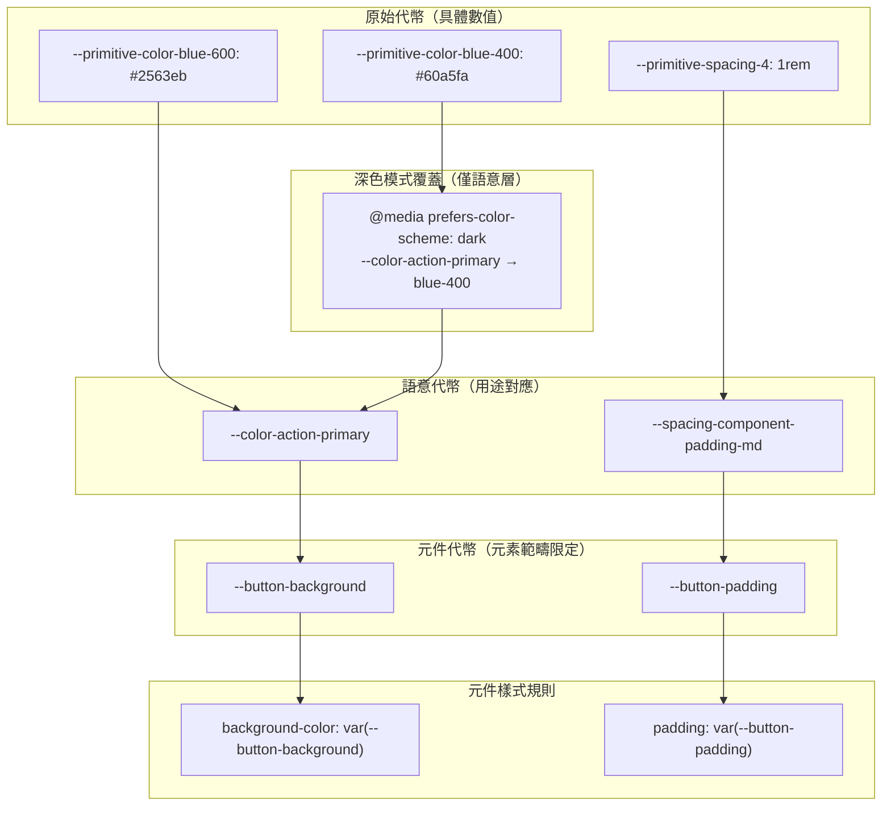

# 變體與設計代幣組合

元件變體——主要/次要/破壞性按鈕、小/中/大輸入框、啟用/停用狀態——是前端程式碼
中最常見的臨時 className 邏輯來源之一。一個具備三種尺寸變體、四種顏色變體與兩
種互動狀態的元件，理論上可產生十二種獨立組合；而隨著每個新的變體維度加入，純
粹以條件運算式組合的 class 字串將以乘法速度增長，可讀性與擴充性都隨之下降。

Class Variance Authority（CVA）、`tailwind-variants` 以及類似的工具，提供了一
種結構化的 API，將變體組合表達為一個設定物件，把變體值對應至 class 字串。這將
變體邏輯從元件的渲染函式中移出，轉換為一個宣告式的資料結構，更易於閱讀、測試
與擴充。完整的變體矩陣在同一個地方一覽無遺，新增一個變體維度只需在設定物件中
增加一個新的鍵，而不必在所有既有的條件分支中逐一處理。

設計代幣分層——持有具體數值（如 `#1a1a2e`）的原始代幣、表達用途（如
`color-text-primary`）的語意代幣，以及將語意代幣限定在特定元素範疇（如
`button-background`）的元件代幣——讓設計系統無需更改任何元件程式碼，就能支援多
種主題。元件參照語意代幣；主題則更換語意代幣所對應的值。

變體設定函式庫與結構良好的代幣層級，共同解決了設計系統脆弱性最常見的兩個根源：
組合式 className 邏輯，以及與主題耦合的顏色參照。本文說明如何組合這兩種技術，
並運用 TypeScript 使這種組合具備靜態型別安全。

## 設計思維

### CVA 與複合變體

CVA 的核心 API 接受一個基底 class 字串，以及一個包含三個鍵的設定物件：
`variants`、`defaultVariants` 與 `compoundVariants`。`variants` 鍵是一個將變體
維度名稱對應至「變體值對應至 class 字串的記錄」的記錄。當生成的函式以一組變體
props 呼叫時，它會將基底 class 與每個匹配變體的 class 合併並回傳結果字串。基底
class 始終存在——它們表達元件外觀的不變量——而每個變體的 class 疊加其上以表達
差異。

`variants` 鍵被設計為具名維度的平坦記錄，這鼓勵將元件變化思考為一組真正獨立的
軸向。尺寸是一個軸向；視覺風格是另一個；互動狀態可能是第三個。當一個維度是真
正獨立的——當 `size: 'lg'` 的 class 不依賴 `variant` 的值——將其表達為
`variants` 中的獨立條目是正確且充分的。設定讀起來像一個矩陣：任何列的組合都是
有效的，結果 class 是每列匹配條目的聯集。

複合變體（compound variants）處理單純獨立變體無法表達的情境：僅當多個變體維度
同時持有特定值時才套用的 class 組合。`compoundVariants` 陣列中的每個物件，將一
組變體值條件與一個 class 字串配對，只有當所有條件都滿足時才追加該 class。例如，
一個大尺寸的 ghost 按鈕可能需要超出尺寸變體本身所提供的額外水平內距，因為 ghost
變體缺少背景色，使得預設的大尺寸內距在視覺上顯得侷促。若沒有複合變體，這需要同
時檢查 `variant` 和 `size` 的條件運算式；有了複合變體，這只是設定陣列中一個清
楚宣告意圖的單一條目。

理解複合變體的心智模型是：它們是疊加在基底變體解析結果之上的覆蓋層。它們不會
取代已匹配的基底變體 class，而是在複合條件符合時追加額外的 class。複合變體應表
達真正跨維度的樣式選擇——內距調整、圓角覆蓋、陰影變化——而非重複宣告各個獨立
變體已經定義的內容。讓複合變體專注於例外情況，讓基底變體處理共通情況，可讓設
定保持清晰易讀。

如果一個元件的設定中複合變體條目比基底變體條目還多，代表這些變體維度並不像模
型假設的那樣獨立。維度之間深度耦合的元件，往往更適合拆分為兩個或更多個專注的
元件，而非建模為一個擁有大量複合變體表的單一元件。CVA 是表達變體模型的工具，
而非讓變體模型比設計所需更複雜的理由。

### 代幣層級：原始、語意與元件代幣

三層代幣層級的存在，是因為不同類型的樣式決策在不同時間點、基於不同原因而改變。
原始代幣（在某些系統中稱為參考代幣）持有具體數值：
`--primitive-color-blue-600: #2563eb`、`--primitive-spacing-4: 1rem`。它們只在
原始設計語言改變時才會變動：新的調色盤或新的間距比例。這些是整個系統所有數值
的唯一真實來源。原始代幣不應被元件直接參照；它們存在的目的是讓語意代幣有一個
單一、命名明確的值可以指向。

語意代幣將用途對應至原始數值：
`--color-action-primary: var(--primitive-color-blue-600)`。它們在系統的語意改變
時才變動——例如品牌更新重新指定哪個藍色色階作為主要行動色——且只在語意層變動，
不涉及任何原始或元件代幣的修改。深色模式幾乎完全在語意層實作：在深色媒體查詢
或 `data-theme="dark"` 屬性下，將 `--color-action-primary` 覆蓋為指向
`--primitive-color-blue-400`，就能改變所有使用 `--color-action-primary` 的元件
的渲染顏色。元件本身從不改變。

語意代幣的命名是代幣系統設計中影響最深遠的決策之一。一個命名為
`--color-blue-600-alias` 的代幣並不是語意代幣；它仍然將使用方與特定顏色耦合。
一個命名為 `--color-action-primary` 的代幣清楚地傳達了代幣的角色：它是啟動行
動的元素的主要顏色。當設計師說「主要按鈕顏色改為藍綠色」，工程師只需更新語意
代幣的值，變更就會傳播到所有使用該代幣的地方。語意名稱在設計與工程之間建立了
一個能夠跨越調色盤更換而持久的共同詞彙。

元件代幣是可選的，但對於複雜元件而言具有重要價值。它們將語意代幣限定在特定元
素的範疇：`--button-background: var(--color-action-primary)`。這允許使用端應用
在特定脈絡下覆蓋按鈕的背景色——例如在促銷橫幅內，按鈕應使用橫幅的強調色而非
系統的標準行動色——而不影響全域的語意代幣。這個覆蓋只影響該脈絡中的按鈕，而
不影響所有使用 `--color-action-primary` 的元件。元件代幣是一次性脈絡覆蓋的正
確工具；語意代幣是全主題變更的正確工具。

這個層級架構的實際意義是：深色模式、品牌主題與高對比無障礙模式，都可以透過更
換語意代幣值來實作——通常只需在根元素套用一小張樣式表——而完全不需要修改任何
元件程式碼。在一個大型元件函式庫中，直接參照原始代幣或硬編碼數值的元件，在每
次主題變更時都必須個別更新，這可能意味著對本應只需更新單一樣式表的改動，卻要
修改數百個元件檔案。三層層級架構的存在，正是為了防止這種代價。

### TypeScript 強制的變體 API

CVA 自動為有效的變體組合生成 TypeScript 型別。CVA 套件匯出的
`VariantProps<typeof buttonVariants>` 工具型別，從設定物件中提取每個變體維度的
聯合型別。這意味著元件中所有變體相關 props 的型別，是從單一設定物件衍生出來的，
而非另行撰寫。當設定中新增、重新命名或移除一個變體時，TypeScript 型別隨之改變，
編譯器會找出每個參照舊變體名稱的呼叫點。

這種方式消除了一整類因元件 TypeScript 型別與其 className 邏輯脫節所產生的錯誤。
若不使用 CVA，可能在 className 條件運算式中新增了一個變體值，卻沒有將其加入
props 型別聯合，反之亦然，因為這兩者是分開的宣告。CVA 的型別生成讓兩者在定義
上完全一致：設定物件就是型別宣告。將一個變體從 `'ghost'` 重新命名為 `'outline'`
後，設定中的改動會立即在每個傳入 `variant="ghost"` 的呼叫點產生型別錯誤，無需
任何額外的型別維護工作。

當使用以 CSS 自訂屬性定義的元件代幣時，TypeScript 可以透過將代幣名稱定義為字串
字面值聯合型別，並以該型別作為 CSS 自訂屬性字串的接受值，來強制執行有效的代幣
參照。如果設計代幣是在 TypeScript 檔案中撰寫並作為型別物件匯出，可以利用該物件
的鍵來衍生字面值聯合。這意味著參照 `--color-action-primry`（拼寫錯誤）的元件會
產生型別錯誤，而非靜默地渲染出沒有背景色的結果，因為拼錯的代幣名稱不在聯合型
別中。

CVA 衍生的變體型別與代幣鍵 CSS 屬性型別的組合，創造了一個完全靜態驗證的元件
API：有效的變體組合在編譯期檢查，有效的代幣參照也在編譯期檢查。這是對設計系統
元件程式碼典型狀態的重大改進——在典型狀態中，變體值和代幣名稱都是普通字串，沒
有任何靜態驗證。在重構期間這種型別安全尤其有價值：重新命名代幣或變體值會產生
編譯器錯誤，自動定位每個受影響的呼叫點，而無需依賴手動搜尋或對整個程式碼庫進
行視覺檢查。

### tailwind-variants 與 CVA 的比較

`tailwind-variants` 在 CVA 模型的基礎上增加了兩個額外功能：響應式變體與插槽
（slots）。響應式變體允許一個變體維度在不同斷點呈現不同值，而無需在元件中撰寫
條件邏輯，以物件形式 `{ initial: 'sm', md: 'lg' }` 表達，而非字串。呼叫端傳入
一個物件，函式庫透過 Tailwind 的響應式前綴系統為每個斷點解析正確的 class，而非
在元件中根據視窗寬度計算尺寸 class。這將響應式行為保留在設定層，可在無需檢視
JavaScript 的情況下讀取和推理。

插槽允許複合元件——例如由 `CardHeader`、`CardBody` 與 `CardFooter` 組成的
`Card`——共享一個變體設定，其中每個插槽對每個變體值都有各自的 class 對應。這使
得僅需更改根元件上的單一變體 prop，就能改變複雜多元素元件的視覺處理方式，每個
子插槽會自動接收對應該變體的 class。若沒有插槽，複合元件的變體邏輯必須在每個
子元件之間重複，或集中在每個子元件都需讀取的 context 中——兩種方式都可行，但
都比共享插槽設定更為複雜。

CVA 更為簡單，對於單一元素元件以及不需要響應式變體語法的團隊來說已經足夠。它
的 API 介面較小，需要學習的概念較少。`tailwind-variants` 是建立元件函式庫時更
好的選擇，特別是當需要服務多個斷點且設計規格在每個斷點有不同變體差異，或者在
建立複合元件且插槽級別的 class 隔離有其價值時。

兩個函式庫解決的都是同一個核心問題：將變體邏輯從命令式的條件運算式移至宣告式
設定。選擇哪一個，主要取決於是否需要 `tailwind-variants` 的額外功能。對於任何
具備兩個或以上獨立變體維度的元件，無論選擇哪一個，都優於非結構化的行內條件式
className 邏輯。從 CVA 開始的團隊，如果之後遇到對響應式變體或插槽的需求，可以
逐步遷移至 `tailwind-variants`，因為兩個函式庫使用相同的底層概念模型，設定結構
也相似。

## 最佳實踐

**應該（SHOULD）**對具備兩個或以上獨立變體維度的元件使用 CVA 或
`tailwind-variants`。行內條件式 class 字串（`cx(size === 'lg' && '...', color ===
'primary' && '...')`）隨著變體增多而難以擴充：三個維度各有三個值時需要九個條件
判斷，且無法生成 TypeScript 型別推斷。CVA 的設定物件是宣告式的，能自動生成
TypeScript 型別，並讓完整的變體矩陣在同一個地方一覽無遺，審查者無需閱讀條件邏
輯就能理解元件的完整視覺 API。

**必須（MUST）**在所有元件層級的樣式中參照語意設計代幣，而非原始代幣。語意代幣
（`--color-action-primary`、`--spacing-component-padding-md`）提供穩定的抽象層，
能在主題更換、品牌更新與深色/淺色模式切換時保持有效。原始代幣將當前主題的解析
值硬編碼進元件，每次主題對應關係改變時都需要修改元件原始碼。

**禁止（MUST NOT）**在同一個元件的樣式中混用原始代幣參照與語意代幣參照。一個按
鈕對背景使用 `var(--primitive-color-blue-600)`，卻對邊框使用
`var(--color-border-default)`，在主題切換時會呈現不一致的行為：邊框會正確更新，
而背景不會。元件中所有代幣參照都應在同一個語意層，以確保元件在主題切換時能統
一響應。

**應該（SHOULD）**在設計代幣系統以程式碼撰寫時，使用 TypeScript 生成元件代幣型
別。如果設計代幣定義在 TypeScript 物件或從代幣檔案匯入，以代幣鍵作為 CSS 自訂
屬性名稱的字串字面值型別，可確保元件程式碼只參照有效且已定義的代幣，並在代幣
被重新命名或移除時產生型別錯誤。這能防止 CSS 自訂屬性參照在代幣重新命名後靜默
失效的問題。

**應該（SHOULD）**在每個 CVA 設定中定義 `defaultVariants`。沒有預設變體的元件
要求呼叫端在每個呼叫點都必須明確指定每個變體維度，造成冗長的呼叫點，且容易遺
漏必要的維度。預設變體建立了清晰的基準外觀，減少呼叫點所需的 props，並記錄了
哪種變體組合是元件的標準預設狀態。

**禁止（MUST NOT）**為本可表達為獨立變體值的情況硬編碼複合變體組合。如果一個
複合變體套用的 class，更適合作為某個參與基底變體的一部分，則代表設定對維度之間
的耦合過於緊密。複合變體應表達真正跨維度的樣式決策——只在兩個維度相互作用時才
有意義的調整——而非作為基底變體不夠精細的變通方案。

**應該（SHOULD）**將 CVA 設定與元件檔案共置，而非放在共享的 variants 檔案中。
當元件的變體設定緊鄰元件的渲染邏輯與型別，可以在同一個位置理解元件的完整介面。
共享的 variants 檔案可能產生隱式依賴，並使得判斷哪些元件受設定變更影響變得
困難。

## 視覺呈現



## 範例

```ts
import { cva, type VariantProps } from 'class-variance-authority';

export const buttonVariants = cva(
  'inline-flex items-center font-medium transition-colors focus-visible:outline-none',
  {
    variants: {
      variant: {
        primary:     'bg-[var(--color-action-primary)] text-[var(--color-text-on-action)]',
        secondary:   'border border-[var(--color-border-default)] bg-transparent',
        destructive: 'bg-[var(--color-action-destructive)] text-white',
      },
      size: {
        sm: 'h-8 px-3 text-sm',
        md: 'h-10 px-4 text-base',
        lg: 'h-12 px-6 text-lg',
      },
    },
    compoundVariants: [
      {
        variant: 'secondary',
        size: 'lg',
        class: 'px-8',
      },
    ],
    defaultVariants: { variant: 'primary', size: 'md' },
  }
);

export type ButtonVariants = VariantProps<typeof buttonVariants>;
```

## 常見錯誤

- 在元件樣式中直接參照 `--primitive-*` 代幣而非語意代幣，導致元件在主題切換或
  深色模式下失效。
- 對三個或以上獨立變體維度撰寫行內三元運算或短路 className 邏輯，而非採用 CVA，
  使變體矩陣不可見且難以維護。
- CVA 設定中省略 `defaultVariants`，迫使每個呼叫點都必須明確指定每個變體維度，
  使預設狀態變得隱性且容易被遺忘。
- 使用複合變體作為基底變體規格不足的變通方案，而非用來表達真正跨維度的樣式互動。
- 在語意層而非元件代幣層定義元件代幣覆蓋，導致原本只想局部覆蓋的改動，影響了
  所有共享該語意代幣的元件。
- 為變體維度單獨撰寫 TypeScript props 型別，而非透過 `VariantProps` 從 CVA 設定
  衍生，導致型別與 className 邏輯靜默脫節。
- 在變體設定中傳入原始 Tailwind 顏色 class（例如 `bg-blue-600`），而非語意代幣
  參照，將調色盤值直接嵌入變體矩陣，使深色模式無法在不重寫設定的情況下實現。

## 相關 FEE

- [FEE-900 — 設計系統與 UI 函式庫概覽](./900.md)
- [FEE-901 — 設計代幣](./901.md)
- [FEE-905 — 主題與深色模式](./905.md)
- [FEE-909 — 多品牌設計系統](./909.md)

## 參考資料

- [Class Variance Authority](https://cva.style)
- [tailwind-variants](https://www.tailwind-variants.org)
- [Tokens Studio: Token hierarchy](https://docs.tokens.studio/tokens/token-types)
