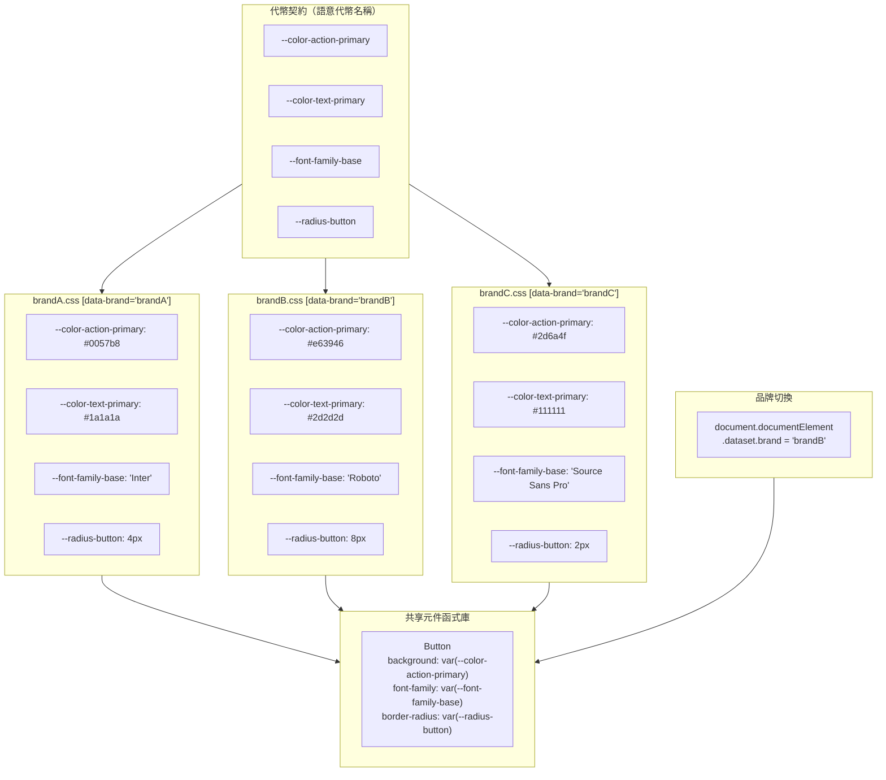

# 多品牌設計系統

多品牌設計系統從單一元件函式庫服務多個產品線、子品牌或白標客戶。元件是共享的；
視覺識別——顏色、字體排版、間距、圖示——則依品牌而異。這與主題化（淺色/深色模
式）截然不同：主題化在單一品牌的識別體系內改變數值；多品牌則是切換應用哪一套
識別體系。這個差異在架構上至關重要，因為主題化假設一個穩定的語意詞彙並在其中
改變值，而多品牌則假設多個獨立的詞彙，且全都滿足相同的結構契約。

架構上的挑戰在於分離元件的結構行為與視覺表達。一個按鈕元件在所有品牌中應以相
同方式運作；其背景顏色、圓角半徑與字體族群則屬於品牌特定的設定。分離的機制是
代幣層：元件參照語意代幣；每個品牌定義自己的語意代幣值。元件實作只需撰寫一次、
測試一次。品牌特定層是一個獨立維護的產出物——通常是一個包含自訂屬性宣告的 CSS
檔案——它履行代幣契約，而不觸及任何元件程式碼。

建置期與執行期的主題切換是核心的取捨抉擇。建置期主題化為每個品牌產生獨立的
CSS bundle——每個 bundle 包含編譯為具體數值的代幣，無任何執行期額外開銷。伺服器
或 CDN 根據品牌脈絡提供對應的 bundle，瀏覽器只載入相關的值。執行期主題化則使
用 CSS 自訂屬性，可透過在 `<html>` 元素上切換 class 或屬性來切換，無需重新載
入頁面即可完成品牌切換。執行期主題化需要在記憶體中維護所有品牌的代幣定義，但
它能實現動態品牌選擇，並在需要同時預覽多個品牌的開發環境中更易於管理。

## 原則

工程師**應該（SHOULD）**透過設計代幣層實作多品牌支援，而非在元件層加入品牌分
支邏輯。一個包含 `if (brand === 'brandA') ...` 的元件，每增加一個新品牌就變得
更難維護，且每次需要視覺變更時都要修改元件。一個只參照 `var(--color-action-primary)`
的元件，在新增品牌時完全不需要修改；只需要一個新的代幣檔案。代幣層是共享工程
與品牌特定設定之間的契約介面；保持元件程式碼不含品牌條件式，是讓這個契約在規
模化時保持可行的不變量。

工程師**必須（MUST）**在設計系統與品牌團隊之間建立明確的代幣契約：一組每個品
牌都必須提供值的語意代幣名稱。此契約是共享元件層與品牌層之間的介面。在契約中
新增語意代幣而未提供對應的預設值，對所有未定義該代幣的品牌而言是一項破壞性變
更。契約應與元件函式庫同步版本化；破壞性變更——新增必要代幣、重新命名現有代幣
——需要升級主要版本號，並為每個使用此函式庫的品牌團隊提供遷移指南。

## 設計思維

### 每個品牌的代幣命名空間

在 CSS 中限定品牌代幣範疇的推薦機制是 `[data-brand="brandA"]` 屬性選擇器。CSS
自訂屬性的繼承特性意味著，定義在帶有 `[data-brand]` 元素上的品牌代幣，會級聯
至所有後代元素。由於 CSS 自訂屬性預設繼承，一個根層級的屬性就足以為整個頁面或
應用程式限定所有代幣的範疇。在執行期從一個品牌切換到另一個品牌，只需執行
`document.documentElement.dataset.brand = 'brandB'`；所有後代元件在下一次繪製
時立即接收新品牌的代幣值。

屬性選擇器優於類別名稱用於品牌命名空間，因為它清楚地表達了品牌脈絡的單一值特
性：一個元素在同一時間只屬於一個品牌。`data-brand` 屬性在語意上強制執行這一點
——一個元素不能對同一個屬性擁有兩個值——而多個類別名稱可以同時共存，使得意外同
時套用兩個品牌的代幣塊成為可能，進而產生難以預料的特殊性解析結果。屬性選擇器
也能與伺服器端渲染良好配合：品牌屬性可以根據請求脈絡直接寫入 HTML 回應，而不
需要瀏覽器在繪製內容前執行任何 JavaScript。這消除了品牌切換依賴 JavaScript 初
始化步驟時，可能出現的無樣式或錯誤品牌內容閃現問題。

當需要嵌套品牌脈絡時——例如，一個嵌入在屬於不同品牌之宿主頁面中的小工具——CSS
級聯會自動處理重新限定範疇的問題。在小工具的根元素上設定
`[data-brand="widgetBrand"]`，會為小工具內的所有元素覆蓋祖先品牌的代幣，而不
需要任何 JavaScript 協調。級聯的最近祖先解析意味著小工具的代幣在小工具元素內
優先生效，頁面的代幣則在小工具外的所有地方套用。這種可組合性是以 CSS 自訂屬性
繼承作為代幣傳遞機制的最強論據之一。

從測試的角度來看，`[data-brand]` 屬性選擇器也簡化了元件的品牌隔離測試。測試夾
具只需在根容器上設定 `data-brand` 屬性，並提供對應的代幣樣式表，即可在任何品
牌的代幣集下渲染元件，而無需模擬複雜的 JavaScript 品牌切換邏輯。在視覺回歸測
試中，這意味著同一個元件的測試可以在單一測試套件中跨品牌並行執行，每次測試獨
立設定其品牌屬性，互不干擾。

### 建置期代幣編譯

Style Dictionary、Theo 和 Tokens Studio 是最廣泛採用的工具，用於將代幣 JSON 檔
案編譯為品牌特定的 CSS 輸出。每個工具接收一個真實來源——通常是將代幣名稱對應至
值的 JSON 或 YAML 檔案——並將其轉換為每個品牌的一種或多種輸出格式。轉換步驟將
原始設計值（十六進位顏色、像素度量、字體名稱）正規化為元件所使用的 CSS 自訂屬
性宣告。由於輸出是純 CSS，它可整合至任何建置管道：Webpack、Vite、Next.js 或
CDN 託管的靜態檔案。

建置期編譯為每個品牌產生一個獨立的 CSS 產出物。每個產出物只包含該品牌的代幣值；
瀏覽器中不存在其他品牌代幣的執行期表示。這意味著瀏覽器解析和儲存的只有它實際
會用到的代幣值，無論系統支援多少品牌，記憶體與解析時間都只與單一品牌的代幣數
量成正比。取捨在於，切換品牌需要載入不同的 CSS 檔案，這通常意味著頁面導航或動
態樣式表插入——若未預載其他品牌的 CSS，就無法進行即時的頁內切換。對於每次頁面
載入只服務單一品牌的應用程式，建置期編譯是正確的預設選擇。

建置期方法還能實現按品牌驗證。在編譯步驟中，可執行一個 lint 流程來驗證每個品
牌的代幣檔案是否定義了契約中所有必要的代幣、所有顏色值與其典型背景代幣組合時
是否符合最低 WCAG 對比度要求，以及是否有代幣參照了該品牌原始代幣集中不存在的
值。這項驗證在缺失或無效的代幣進入生產環境前就能加以攔截，將錯誤從執行期的視
覺缺陷轉變為建置失敗。

Style Dictionary 的轉換與格式系統特別適合多品牌工作流程，因為它支援每個品牌的
多個平台——單一來源代幣檔案可以同時產生 CSS 檔案、iOS Swift 常數檔案和 Android
resources XML 檔案。對於跨原生和 Web 平台的設計系統而言，這一點尤為重要：代幣
契約在 JSON 中定義一次，並編譯為每個平台的原生格式，確保相同的品牌識別在 Web、
iOS 和 Android 上一致呈現，而無需為每個平台維護獨立的來源檔案。

### 共享元件函式庫與品牌適配器模式

品牌適配器模式將元件函式庫的代幣契約與品牌對契約的實作分離。函式庫匯出無樣式
或最低限度樣式的元件，以及這些元件所依賴的語意代幣名稱列表。每個品牌提供自己
的代幣檔案——一個包含自訂屬性宣告的 CSS 檔案——來履行契約。`BrandProvider` 元件
或根層級的屬性注入機制，將品牌的代幣檔案套用至文件，使代幣可供其下所有元件使
用。元件本身不知道哪個品牌處於啟用狀態；它們只參照契約中定義的語意代幣名稱。

適配器模式使得在不觸及元件函式庫的情況下新增新品牌變得簡單。新品牌團隊接收代
幣契約——語意代幣名稱列表及其預期的語意角色——並產生一個為每個名稱賦值的 CSS
檔案。函式庫的 CI 管道可以根據契約結構驗證新品牌的代幣檔案，以確認其完整性。
一旦代幣檔案通過驗證，新品牌即可部署，無需任何元件程式碼變更。對於擁有許多品
牌或品牌由獨立團隊維護的組織而言，這種解耦是適配器模式的主要運營優勢。

適配器模式也有助於品牌的逐步採用。一個原本未基於設計系統建構的既有產品，可以
透過提供一個將新代幣名稱對應至現有使用值的代幣檔案，逐一採用共享元件函式庫。
代幣檔案成為舊產品視覺識別與新共享元件系統之間的轉換層。隨著產品的視覺識別逐
漸與系統設計語言靠齊，代幣檔案的覆蓋值也會逐漸減少，直到產品的代幣檔案只是單
純地對應到系統的預設值。

### 超越代幣的品牌特定覆蓋

某些品牌需要超越代幣值變更的結構性差異。一個具有獨特導覽模式、不同標誌位置或
根本上不同的卡片佈局的品牌，代表的是結構性差異，而非代幣層級的差異。無論代幣
值如何變更，都無法將標誌從導覽左側移至中央；這需要不同的標記結構或不同的元件
變體。

正確的模型是仔細區分代幣能表達的內容與需要獨立元件介面的內容。代幣層級的差異
——顏色、字體排版、間距、圓角、陰影——由代幣層處理，無需任何元件變更。結構性差
異——佈局變化、元素的存在或缺失、互動模式的變化——需要新的元件變體，或是包裝
共享元件的品牌特定元件。試圖透過代幣來表達結構性差異，會使代幣系統超載，並產
生語意上不真正具有語意性的代幣名稱（例如，`--navigation-logo-alignment: center`
是一個結構指令，而非設計值）。

當需要結構性覆蓋時，品牌擴充模型很有效。共享函式庫提供代幣契約和基礎元件。品
牌套件用品牌特定的結構選擇包裝共享元件，並將組合結果重新匯出為品牌感知元件。
品牌套件的使用者從品牌套件匯入，而非直接從共享函式庫匯入。品牌套件依賴共享函
式庫，並獨立版本化，允許品牌的結構選擇以與底層元件函式庫不同的節奏演進。

### 代幣契約的版本化

代幣契約——共享元件函式庫所依賴的語意代幣名稱集合——必須與元件函式庫同步版本
化，因為契約的變更直接影響所有使用此函式庫的品牌團隊。契約實際上是品牌團隊的
公開 API；它應當獲得與其他任何公開 API 相同的版本化紀律。

契約的破壞性變更包括：在未提供預設值的情況下新增必要的新代幣、重新命名現有代
幣、移除契約中先前存在的代幣。這些變更中的每一項，都要求每個品牌團隊在安全升
級至新函式庫版本前，先更新其代幣檔案。破壞性變更必須透過主要版本號升級進行溝
通，並附上遷移指南，說明哪些代幣被新增、重新命名或移除，以及品牌團隊應賦予什
麼值。

新增性變更——新增一個有回退預設值的可選代幣——是非破壞性的。若品牌未定義新的
可選代幣，回退值會生效，所有元件都能正確渲染。可選代幣應謹慎使用：大量具有預
設值的可選代幣積累，可能會模糊品牌實際控制哪些值與繼承自基礎層哪些值之間的界
線，使得難以審核品牌的代幣檔案究竟決定了品牌外觀的哪些部分。

與元件函式庫更新日誌並行維護的代幣契約更新日誌，為品牌團隊提供規劃升級所需的
資訊。每個契約變更的更新日誌條目應說明代幣名稱、變更是否具破壞性或為新增性、
新增或重新命名代幣的建議值，以及未定義代幣時的回退行為。

契約版本化的一個實用模式是在元件函式庫的代碼儲存庫中維護一個機器可讀的契約
描述檔——通常是 JSON Schema 或包含所有必要代幣名稱及其語意描述的 JSON 檔案。
當元件需要新的語意代幣時，工程師先更新契約描述檔，再在元件樣式中引用新代幣。
CI 管道的契約驗證步驟讀取該描述檔，並對所有已知品牌的代幣檔案執行驗證，確保
每個品牌都定義了契約要求的所有必要代幣。這使得契約破壞性變更在進入主要分支之
前就能被偵測，而非在品牌團隊嘗試升級時才發現。對新品牌加入代幣集驗證也應涵蓋
此描述檔，讓新品牌的初次接入與現有品牌的升級遵循相同的驗證流程。

## 最佳實踐

**應該（SHOULD）**使用 CSS 自訂屬性和 `[data-brand]` 屬性選擇器來實作多品牌主
題化，而非為每個品牌使用獨立的 CSS 類別名稱。`[data-brand="X"]` 屬性選擇器允
許每個品牌的範疇代幣在單一 CSS 塊中定義一次，透過在根元素上設定單一屬性來套用，
並由所有後代元件繼承。每個品牌使用獨立的 CSS 類別名稱，當多個品牌類別名稱意外
同時存在於同一個元素上時，會引入特殊性衝突，且不像屬性那樣清楚地傳達品牌脈絡
的單一值特性。

**必須（MUST）**在共享元件函式庫與品牌特定代幣檔案之間定義穩定、版本化的代幣
契約。契約指定了函式庫所依賴的語意代幣名稱。在未提供預設值的情況下向契約新增
新代幣，會破壞所有未定義該代幣的品牌；契約應與元件函式庫同步版本化，且破壞性
變更需要升級主要版本號。品牌團隊依賴契約來規劃升級時程，而契約更新日誌是破壞
性變更的主要溝通管道。

**應該（SHOULD）**在 CI 中針對每個品牌的代幣集對元件進行測試。以每個品牌的代
幣渲染元件的視覺回歸測試，能在代幣更新時偵測到非預期的視覺變更。一個在預設品
牌下看起來正確的元件，若代幣值未針對 WCAG 對比度要求進行驗證，可能在另一個品
牌的代幣集中產生無法閱讀的對比度。在 CI 中對所有品牌執行視覺回歸，可防止這些
缺陷進入生產環境，並在代幣契約違規影響使用者之前加以攔截。

## 視覺呈現



## 範例

```css
/* brandA.css */
[data-brand="brandA"] {
  --color-action-primary: #0057b8;
  --color-text-primary: #1a1a1a;
  --font-family-base: 'Inter', sans-serif;
  --radius-button: 4px;
}

/* brandB.css */
[data-brand="brandB"] {
  --color-action-primary: #e63946;
  --color-text-primary: #2d2d2d;
  --font-family-base: 'Roboto', sans-serif;
  --radius-button: 8px;
}

/* 按鈕元件——無品牌邏輯，只有代幣參照 */
.button {
  background-color: var(--color-action-primary);
  color: var(--color-text-primary);
  font-family: var(--font-family-base);
  border-radius: var(--radius-button);
}

/* 用 JavaScript 切換品牌 */
/* document.documentElement.dataset.brand = 'brandB'; */
```

## 常見錯誤

- 在元件檔案中加入 `if (brand === 'X')` 條件式，而非將所有品牌特定差異委派給代
  幣值，使元件實作與品牌列表耦合，並在每個新品牌或視覺更新時都需要修改元件。
- 使用 CSS 類別名稱（`.brand-a { --color: ... }`）而非 `[data-brand]` 屬性選擇
  器，允許多個品牌類別名稱同時存在於同一個元素上，產生難以預料的特殊性衝突。
- 在未提供回退預設值的情況下，向代幣契約新增必要的新代幣，靜默地破壞所有未定
  義該新代幣的品牌代幣檔案，導致元件在該屬性上渲染時沒有任何值。
- 試圖透過代幣值來表達結構性差異（標誌位置、導覽佈局、元素存在與否），產生語
  意上是結構指令而非設計值的代幣名稱，使代幣系統超載超出其預期的抽象層級。
- 未將代幣契約與元件更新日誌分開版本化，使品牌團隊無法在不閱讀元件原始碼差異
  的情況下，判斷哪些函式庫升級需要變更代幣檔案。
- 只針對預設品牌的代幣集進行視覺回歸測試，使其他品牌代幣集中的對比度問題、佈
  局異常或缺失值在未偵測的情況下進入生產環境。
- 在同一個元件中混用建置期編譯的代幣值與執行期 CSS 自訂屬性，導致某些屬性回應
  品牌切換而其他屬性不回應的不一致行為。

## 相關 FEE

- [FEE-900 — 設計系統與 UI 函式庫概覽](./900.md)
- [FEE-901 — 設計代幣](./901.md)
- [FEE-905 — 主題與深色模式](./905.md)
- [FEE-908 — 變體與設計代幣組合](./908.md)

## 參考資料

- [Style Dictionary](https://styledictionary.com)
- [Tokens Studio for Figma](https://tokens.studio)
- [Smashing Magazine: Multi-Brand Design Systems](https://www.smashingmagazine.com/2022/09/frameworks-design-systems/)
