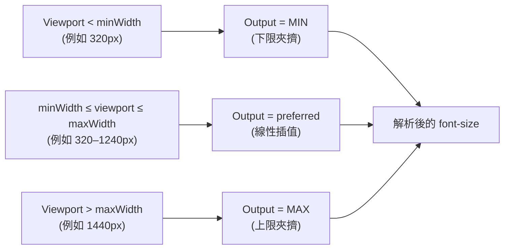

# [FEE-916] 流動式字體排版與字型尺度權杖

:::info
流動式字體排版透過 CSS `clamp()` 在不同 viewport 寬度間連續插值 `font-size`，使單一權杖即可取代一整疊斷點覆寫規則。此技術在 2020 年 7 月達到 Baseline，並已成為 Utopia、Material 3 與 DTCG `typography` 複合權杖等設計系統中字體排版權杖的預設表達方式。流動式權杖必須調校到最大值至少為最小值的 2 倍（兩者皆以 `rem` 表達），否則產生的文字會在 200% 縮放時違反 WCAG 1.4.4。
:::

## 背景

在流動式字體排版出現之前，響應式字型尺度由以斷點為鍵的媒體查詢構成，在 768px、1024px 等位置以階梯方式改變 `font-size`。web.dev 的 fluid type Baseline 指南闡述了這項轉變：使用 `clamp()` 後「`font-size` 的變化在一段 viewport 寬度範圍內是連續的，而不再是從一個值跳到另一個值」。

關鍵原語是 CSS `clamp(min, preferred, max)`，MDN 將其定義為解析為 `max(MIN, min(VAL, MAX))`——一個運算式同時承載下限、曲線與上限。MDN 記錄了跨瀏覽器可用日期：`clamp()`「自 2020 年 7 月起在各瀏覽器中可用」，使其落入任何現代設計系統的 Baseline-widely-available 範圍內。

字型尺度權杖建構於該原語之上。像 `--fee-font-size-body` 這樣的權杖承載一條 `clamp()` 運算式，由計算器（Utopia）或已發布的尺度（Material 3）產生，並透過 DTCG 格式 JSON 消費。

## 視覺對比

下圖追蹤單一 `clamp(min, preferred, max)` 權杖在其宣告範圍內的三個 viewport 寬度上如何解析。



| 區段 | 輸入 viewport | 解析規則 | 實際 `font-size` |
| --- | --- | --- | --- |
| 低於下限 | `vw < minWidth` | `max(MIN, …)` 勝出 | `MIN` |
| 範圍內 | `minWidth ≤ vw ≤ maxWidth` | preferred 值對 `100vw` 線性插值 | 插值結果 |
| 高於上限 | `vw > maxWidth` | `min(…, MAX)` 勝出 | `MAX` |

## 範例

**Utopia preferred 值公式。** Utopia 的「CSS clamp() as a fluid calculator」文章給出封閉形式：計算 `Slope = (MaxSize - MinSize) / (MaxWidth - MinWidth)` 與 `yIntersection = (-1 * MinWidth) * Slope + MinSize`，再寫成 `font-size: clamp(MinSize[rem], yIntersection[rem] + Slope * 100vw, MaxSize[rem])`。Utopia 字型計算器每一階都產出此形式，例如 `--step-0: clamp(1.125rem, 1.0739rem + 0.2273vw, 1.25rem)` 即為一個 body 權杖，從小 viewport 的 18px 插值到大 viewport 的 20px。

```css
:root {
  /* Utopia step-0 (body) — 320–1240px 間從 18px 插值到 20px */
  --fee-font-size-body: clamp(1.125rem, 1.0739rem + 0.2273vw, 1.25rem);
  /* Utopia step-1 (h6) — 22.5px → 25px */
  --fee-font-size-h6:   clamp(1.40625rem, 1.3437rem + 0.2784vw, 1.5625rem);
}
```

**Material 3 字型尺度權杖。** Material 3 發布了一組 15 個權杖的系統：5 種角色（display、headline、title、body、label）與 3 種尺寸（large、medium、small）交叉組合。Material 文件指出「權杖遵循 `--md-sys-typescale-<scale>-<size>-<property>` 命名慣例」。5x3 網格的每個格子都搭配 family/size/weight/line-height/tracking 五元組，且每個 `*-size-*` 權杖都可寫成 `clamp()` 而非靜態 `rem`。

## 最佳實踐

- **MUST** 以相對單位（`rem`）為流動式字型設置上限，並將最大值維持在最小值的 2 倍以上——MDN：「請確保允許的最大值是相對長度單位，且不少於允許的最小值的兩倍。」
- **SHOULD** 將字體排版以 DTCG `typography` 複合權杖發布，將 `fontFamily`、`fontSize`、`fontWeight`、`lineHeight` 一併打包；DTCG 草案格式定義了結構（`{ "$value": { "fontFamily": [...], "fontSize": {...}, "fontWeight": 400, "lineHeight": 1.5 }, "$type": "typography" }`），`letterSpacing` 也按慣例納入。
- **SHOULD** 將 viewport 錨定視為校準旋鈕，而非預設啟用的美學選擇。web.dev 的 Baseline 文章警告：「字體排版對 viewport 反應越多，對使用者偏好的反應就越少」，因此重度的 `vw` 加權會以使用者自主性換取響應性。

## 設計思維

Utopia 的「Designing with fluid type scales」文章將取捨從單一尺度系統重新框定：設計者不再只挑一個比例，而是挑兩個——「在 320px（接近行動端）的字體排版尺度為 1.2x，在 1500px（接近桌面端）的尺度為 1.333x」——再讓數學在兩端之間連續插值每一階。小螢幕上較緊湊的尺度保留垂直節奏；大螢幕上較戲劇性的尺度建立層級；代價是權杖的執行期數值不再是一個可被檢視的單一數字。

## 深入探討

**像素與 viewport 混合的 preferred 值。** web.dev 的 Baseline 文章提到一個縮放行為的細節：「`calc(16px + 1vw)` 的 `font-size` 同時依據 viewport 大小，以及目前（與縮放相關的）像素大小。」將像素偏移與 viewport 單位混用，可恢復純 `vw` preferred 值所失去的部分縮放響應性，因為像素項會隨縮放縮放，而 `vw` 項不會。在權杖中避免使用像素單位的作者，可改以 `rem` 偏移表達相同概念。

**以 `pow()` 表達模組化尺度。** CSS `pow()` 在 2023 年達到 Baseline，根據 MDN，「對 CSS 模組化尺度等策略很有用」。比例為 `r`、階為 `n` 的模組化尺度即為 `r^n`，可用 `pow(r, n)` 直接表達——讓權杖系統能從單一比例變數推導出整道階梯，不必逐階手寫。

## WCAG 1.4.4 合規策略

WCAG 2.1 成功準則 1.4.4（AA）要求「文字在不需輔助科技的情況下可放大至 200%，且不損失內容或功能」。天真的流動式字體排版會以可重現的方式破壞此準則。

**為何純 `vw` 上限會失敗。** Adrian Roselli 的「Responsive Type and Zoom」：「當人們縮放頁面時，通常是因為希望文字變大。當我們把文字錨定到 viewport 大小……就剝奪了他們這麼做的能力。」viewport 單位（`vw`、`vi`）以 viewport 為基礎計算，並非以縮放後的根字體大小為基礎，因此夾擠到僅以 `vw` 為上限的 `font-size` 在使用者縮放時拒絕變大——200% 因此無法達成。

**2x 下限規則（MDN）。** MDN 的 `clamp()` 參考設定了最低標準：「當 `clamp()` 用於控制文字大小時，請確保允許的最大值是相對長度單位，且不少於允許的最小值的兩倍。」兩端皆以 `rem` 表達加上 2x 比例，可保證使用者能透過縮放達到 200%，因為縮放會隨根字體大小縮放 `rem`。

**2.5x 安全目標（Barvian）。** Maxwell Barvian 的 Smashing Magazine 文章以安全餘裕收緊規則：「最大值必須小於或等於最小值的 2.5 倍。」兩個數字相互調和——2x 是源自 WCAG 的下限，2.5x 是吸收四捨五入、縮放粒度與次像素怪癖而不滑落到下限以下的工作目標。

**權杖撰寫規則。** 每個流動式字型權杖必須以 `min` 與 `max` 皆為 `rem` 撰寫，使 `max / min ≥ 2`，並 SHOULD 以 `max / min ≈ 2.5` 為目標。Utopia 計算器預設輸出以 `rem` 為界的 `clamp()`——例如 `--step-0: clamp(1.125rem, 1.0739rem + 0.2273vw, 1.25rem)`——讓比例在權杖審查時可被檢視。權杖匯出的 linter 可拒絕任何 `fontSize.$value` `clamp()` 低於 2x 下限的複合 `typography` 權杖。

## 延伸閱讀

- [FEE-901 Design Tokens](/zh-tw/Design%20Systems%20and%20UI%20Libraries/901)
- [DTCG Token Format Spec](/zh-tw/Design%20Systems%20and%20UI%20Libraries/dtcg-token-format-spec)

## 參考資料

- web.dev, "Baseline in action: How to use fluid type and space," web.dev (2024). https://web.dev/articles/baseline-in-action-fluid-type
- MDN contributors, "clamp() — CSS," MDN Web Docs. https://developer.mozilla.org/en-US/docs/Web/CSS/clamp
- MDN contributors, "pow() — CSS," MDN Web Docs. https://developer.mozilla.org/en-US/docs/Web/CSS/pow
- W3C, "Understanding Success Criterion 1.4.4: Resize text," WCAG 2.1 Understanding Documents. https://www.w3.org/WAI/WCAG21/Understanding/resize-text.html
- Adrian Roselli, "Responsive Type and Zoom," adrianroselli.com (2019). https://adrianroselli.com/2019/12/responsive-type-and-zoom.html
- Maxwell Barvian, "Addressing Accessibility Concerns With Using Fluid Type," Smashing Magazine (2023). https://www.smashingmagazine.com/2023/11/addressing-accessibility-concerns-fluid-type/
- Utopia, "Fluid type scale calculator," utopia.fyi. https://utopia.fyi/type/calculator/
- James Gilyead and Trys Mudford, "CSS clamp() as a fluid calculator," utopia.fyi. https://utopia.fyi/blog/clamp/
- James Gilyead and Trys Mudford, "Designing with fluid type scales," utopia.fyi. https://utopia.fyi/blog/designing-with-fluid-type-scales
- Design Tokens Community Group, "Design Tokens Format Module (Draft)," designtokens.org. https://www.designtokens.org/TR/drafts/format/
- Material Web, "Typography theming," material-web.dev. https://material-web.dev/theming/typography/
