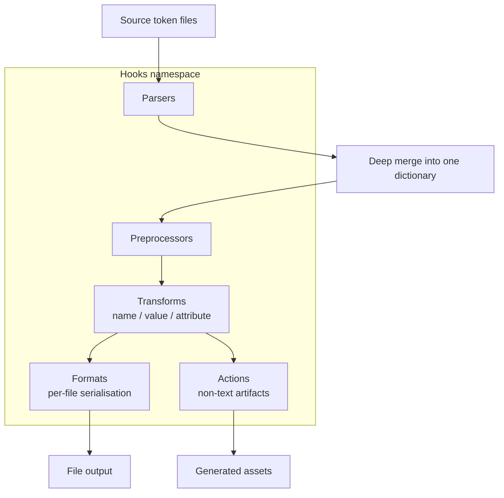

# [FEE-911] Style Dictionary 4 建置管線 — Transforms、Formats 與 Hooks

:::info
Style Dictionary 4 將所有擴充點重新整理到單一的 `hooks` 命名空間之下，並以固定的階段順序執行：parsers、深度合併、preprocessors、transforms、formats，最後是 actions。資深工具負責人需要知道在哪個情境該動用哪一種 hook、遞移轉換 transform 如何與參考解析交互作用，以及哪些 v3 慣用寫法在新版 ESM-only、非同步、DTCG 感知的執行環境下會失效。本文走過整條管線，示範一個保留 CSS `var()` 參考的自訂 format，列出所有 hook 類型，並追蹤從 v3 到 v4 的破壞性變更。
:::

## 背景

Style Dictionary 是一套 token 建置系統，其架構文件以一句話描述完整流程：它「拿取所有找到的檔案執行深度合併⋯接著按照 config 中的順序執行所有 transforms⋯對於每個平台中定義的檔案，它會將 token 物件 format 並把輸出寫入檔案」。這句話把整條管線濃縮成一段話，所以每個階段值得單獨命名：parsers 負責讀入來源檔案、深度合併把它們組合成單一 tree、preprocessors 在合併後的 dictionary 上運作、transforms 為目標平台改寫個別 token、formats 序列化各平台輸出、actions 執行像是複製資產這類副作用。

Transforms 承擔每個平台的翻譯工作。參考文件將 transform 定義為「修改 token 使其能被特定平台理解」的函式 — transform 改寫 token 的 `name`、`value` 或 `attributes`，讓單一來源 token 能在 CSS 中變成 `--color-bg-default`、在 JavaScript 中變成 `colorBgDefault`、在 Android 中變成 `R.color.bg_default`。各階段彼此組合：把十六進位值轉成 Android `Color` 整數的 transform 產生的值，會由 format 蓋印到 `colors.xml` 中。

## 視覺對比



## 範例

一個尊重 DTCG token 形狀的自訂 CSS variables format，當來源 token 參考另一個 token 時會輸出 `var()` 參考。

```js
// build.config.js
import StyleDictionary from 'style-dictionary';

StyleDictionary.registerFormat({
  name: 'css/variables-with-refs',
  format: ({ dictionary, options, file, usesDtcg }) => {
    const valueKey = usesDtcg ? '$value' : 'value';
    const lines = dictionary.allTokens.map((token) => {
      // When outputReferences is true, use the original (un-resolved) value
      // so references serialise as var(--token-name) rather than literals.
      const raw = token.original[valueKey];
      const out = options.outputReferences && dictionary.usesReference(raw)
        ? dictionary.getReferences(raw).reduce((acc, ref) => {
            return acc.replace(ref.value, `var(--${ref.name})`);
          }, raw)
        : token[valueKey];
      return `  --${token.name}: ${out};`;
    });
    return `:root {\n${lines.join('\n')}\n}\n`;
  },
});

const sd = new StyleDictionary({
  source: ['tokens/**/*.json'],
  platforms: {
    css: {
      transformGroup: 'css',
      files: [{
        destination: 'build/variables.css',
        format: 'css/variables-with-refs',
        options: { outputReferences: true },
      }],
    },
  },
});

await sd.buildAllPlatforms();
```

format 函式的簽章依 formats 參考為 `(args) => string`，文件指出 format「以一個物件作為參數，並應回傳一個字串，該字串接著會被寫入檔案」。`usesDtcg` 參數「告訴你 Design Token Community Group 規格是否搭配 `$` 前綴使用（`$value`、`$type` 等）」，使單一 format 同時服務 legacy 與 DTCG 輸入。`outputReferences: true` 選項讓輸出保留 `var(--color-base)`，而非把已解析的十六進位值寫死，依 formats 文件所述：「CSS variables 檔案現在會保留你在 Style Dictionary 中設定的 references。」

## 最佳實踐

- **MUST** 針對已知平台時，從預先定義的 `transformGroup` 開始。`css`、`scss`、`js`、`android`、`ios-swift`、`compose`、`flutter` 與 `react-native` 群組打包了慣用的 transforms（`name/kebab`、`size/rem`、`color/css` 等）；只有當打包好的鏈條產生錯誤輸出時才覆寫個別 transform。
- **SHOULD** 在 token 形成分層尺度（primitives → semantic → component）的 CSS、Sass 與 JS formats 上設定 `outputReferences: true`。保留 `var(--color-base)` 讓下游主題化能在執行期切換 primitive，無需重新建置。
- **SHOULD** 透過檔案層級的 `filter` 選項切分多檔輸出。formats 參考說明 `filter`「會在 token 進入 format 之前先過濾它們」，讓單一平台從不相交的子集分別產出 `colors.css` 與 `spacing.css`。
- **MAY** 在 v4 中將 `outputReferences` 與一個能感知 token 的 predicate 函式組合使用，當僅有部分 references 應該保留時。

## 設計思維

v4 管線以配置密度換取命名空間清晰度。把 `transform`、`format`、`filter`、`parser`、`preprocessor`、`action` 與 `fileHeader` 註冊表收攏到單一複數鍵的 `hooks` 物件，會在每次註冊呼叫多增加一層間接性，同時消除 v3 中 `filter` 一詞依情境可能指 token 過濾器、函式或註冊名稱的歧義。撰寫通用插件的工具作者現在只需針對單一形狀。

Transforms（per-token、per-platform 範圍）與 preprocessors（whole-dictionary、可選擇性 per-platform）的拆分是類似的權衡。Preprocessors 讓插件在 transforms 執行之前先正規化 token 形狀（例如展開 DTCG composite types），使 transforms 不再需要重複防禦性的解析。代價是除錯輸出時多一個階段需要推理。

## 深入探討

v4 中的參考解析是迭代式的。transforms 參考描述了演算法：「Style Dictionary 會迭代式地 transform 與 resolve values。」具體而言，執行階段先 transform 所有非參考 token，接著 resolve 指向那些已 transform 值的 references，再對新 resolve 出來的 token 跑一輪 transforms，如此持續到 dictionary 穩定為止。一條 `--color-button → --color-brand → #0066ff` 的鏈於是經歷 transform-resolve-transform，而非 resolve-once-then-transform。

遞移轉換 transform 讓這個迴圈變得可觀察。一般的 `value` transform 看到的是原始未處理的值，當值是參考時會被跳過（Style Dictionary 無法對字面字串 `{color.brand}` 跑 `color/hex`）。遞移轉換 transform 主動加入對已 resolve 下游值的執行：transforms 參考說遞移轉換 transform「允許你 transform 已被參考的值」。對於依賴最終值的行為，這是正確的 hook，例如計算對比感知的前景色或附加透明度後綴。在 transform 上標記 `transitive: true`，Style Dictionary 就會把它放入迭代迴圈。如果某個 transform 在參考 token 上看似被跳過，把它改成遞移轉換，而不是在上游攤平 references。

## Hook 類型對照表

v4 中每個擴充點都位於 `hooks` 之下，使用複數鍵。遷移指南直接點明：「Hooks 現在全部歸於 `hooks` 屬性之下，且都使用複數形式而非單數。」

| Hook key | 階段 | 作用對象 | 用途 |
| --- | --- | --- | --- |
| `hooks.parsers` | 讀入 | 單一來源檔案 | 讀取非 JSON 的 token 來源（YAML、JS5、TS）並回傳可序列化為 JSON 的物件 |
| `hooks.preprocessors` | 合併後 | 整個合併後的 dictionary（global 或 per-platform） | 在 transforms 執行前正規化或改寫 token tree |
| `hooks.transforms` | per-platform | 個別 token | 三種子類型：`value` 改寫渲染的值、`name` 改寫 token 名稱、`attribute` 為 `token.attributes` 添加 metadata |
| `hooks.transformGroups` | per-platform | 有序的 transforms 清單 | 平台依序套用的具名 transforms 套組 |
| `hooks.filters` | format 前 | Token 清單 | 切分到達單一檔案或 format 的 dictionary 子集 |
| `hooks.formats` | per-file | 已過濾的 token 清單 | 將 token 序列化為寫入磁碟的字串 |
| `hooks.fileHeaders` | per-file | 檔案 context | 輸出加在已 format 輸出前的註解標頭 |
| `hooks.actions` | format 後 | 平台輸出目錄 | 產生非文字產物（sprites、複製圖片、寫入二進位檔） |

Parsers 解鎖替代來源格式：parsers 參考指出「你可以定義自訂 parsers 來解析 design token 檔案」，前提是 parser 回傳 JSON 形狀的資料。Preprocessors 是進行跨 token 改寫的正確層級；preprocessors 參考將其描述為處理「在所有 token 檔案被解析並合併成單一 dictionary 之後，作為整體的 dictionary 物件」。Actions 是 actions 參考所稱的逃生口：「一種執行自訂建置程式碼的方式，例如產生像圖片這類二進位資產」 — 當輸出不是單一文字檔時動用它們。

## 從 3.x 遷移

Style Dictionary 4 帶來機械式套用即可、但在部分升級時容易遺漏的破壞性變更。

- **ESM-only、瀏覽器相容。** 遷移指南記載：「Style Dictionary 已完全以 ES Modules 重寫，方式上開箱即與瀏覽器相容。」CommonJS 的 `require('style-dictionary')` 不再有效；使用者必須改用 `import` 或動態 `import()`。函式庫現在是可實例化的 class。
- **非同步建置 API。** 依遷移指南，`extend()`、`exportPlatform()`、`getPlatform()` 與 `buildAllPlatforms()` 都是非同步。每個呼叫端都必須 `await`（或 `.then()`）結果；漏掉 `await` 會回傳一個 pending Promise 並悄悄跳過建置。
- **DTCG 一等公民、每實例互斥。** DTCG 資訊頁陳述：「自版本 4 起，Style Dictionary 對 DTCG 格式提供一等支援。」單一 Style Dictionary 實例讀取 DTCG 鍵（`$value`、`$type`、`$description`）或 legacy 鍵，兩者不可混用。
- **以 type 路由取代 CTI。** 遷移指南記錄此變更：「在版本 4 中，我們已移除幾乎所有對 CTI 結構的硬耦合/依賴，改為查找 `token.type` 屬性。」原本以 `attributes.category` 比對的自訂 transforms 必須改用 `token.type`。
- **`properties`/`allProperties` 移除。** v4.0.0 release notes 確認：「allProperties / properties 在 v3 已被棄用，現於 StyleDictionary.Core 中移除，請改用 allTokens 與 tokens。」原本伸入 `dictionary.allProperties` 的 format 作者必須改名。
- **Filter 命名空間搬移。** 依 v4.0.0 release notes：「Filters 註冊後，現在被放入 `hooks.filters` 屬性，而非 `filter`。」呼叫形狀不變，註冊表上的位置不同。

## 延伸閱讀

- [Design Tokens (FEE-901)](/zh-tw/Design%20Systems%20and%20UI%20Libraries/901)
- [DTCG Token Format Spec](/zh-tw/Design%20Systems%20and%20UI%20Libraries/dtcg-token-format-spec)

## 參考資料

- Style Dictionary, "Architecture." https://styledictionary.com/info/architecture/
- Style Dictionary, "Hooks: Transforms." https://styledictionary.com/reference/hooks/transforms/
- Style Dictionary, "Predefined Transform Groups." https://styledictionary.com/reference/hooks/transform-groups/predefined/
- Style Dictionary, "Hooks: Formats." https://styledictionary.com/reference/hooks/formats/
- Style Dictionary, "Hooks: Parsers." https://styledictionary.com/reference/hooks/parsers/
- Style Dictionary, "Hooks: Preprocessors." https://styledictionary.com/reference/hooks/preprocessors/
- Style Dictionary, "Hooks: Actions." https://styledictionary.com/reference/hooks/actions/
- Style Dictionary, "Configuration." https://styledictionary.com/reference/config/
- Style Dictionary, "DTCG Support." https://styledictionary.com/info/dtcg/
- Style Dictionary, "v4 Migration Guide." https://styledictionary.com/versions/v4/migration/
- Amazon, "style-dictionary v4.0.0 release notes," GitHub (2024). https://github.com/style-dictionary/style-dictionary/releases/tag/v4.0.0
