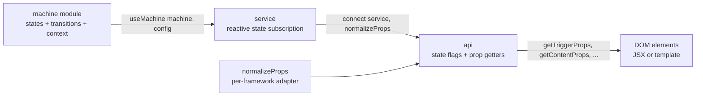

# [FEE-914] 框架無關的狀態機 — Zag.js 與 Ark UI

:::info
Zag.js 將複雜且具備無障礙能力的 UI 元件建模為有限狀態機，讓相同邏輯透過薄薄的適配層即可驅動 React、Vue、Solid 與 Svelte。Ark UI 把這些機器封裝成 45 個以上的 headless 元件，並在各框架間提供一致的 API。本文涵蓋機器模型、`connect` API，以及這套架構與僅支援 React 的 headless 函式庫之間的差異。
:::

## 背景

Zag.js 將自己描述為「a framework agnostic toolkit for implementing complex, interactive, and accessible UI components in your design system and web applications」。核心構想是把每個元件的行為以狀態機形式撰寫一次，再透過小型的適配層暴露給任何框架使用。基礎實作受到 XState 啟發，Zag 也明確致謝「XState for inspiring the base implementation of the state machine」，但 Zag 在執行期並不依賴 XState。

由於機器本身僅是純 JavaScript，相同的元件邏輯可透過薄薄的框架適配器在 React、Vue 與 Solid 之間共用：「We provide adapters for JS frameworks so you can use it in React, Solid, or Vue 3.」Ark UI 即建立在這個基礎之上：它是「a headless library with 45+ accessible components」，其 React、Solid、Vue 與 Svelte 套件共享 Zag 中的單一真相來源。

此專案由 Chakra Systems Inc. 在 GitHub `chakra-ui` 組織下維護，採 MIT 授權：「The Zag.js project is licensed under the MIT License, with copyright held by Chakra UI as of 2021.」儘管承襲自 Chakra，Zag.js 與 Ark UI 皆為框架無關且無樣式，並未依賴 Chakra UI 的樣式層。

## 視覺對比

從機器定義到渲染 DOM 的資料流走的是固定管線：機器模組由 `useMachine`（框架適配器）實例化，產出一個 service；`connect` 再將 service 與 `normalizeProps` 結合，產出由 prop getter 組成的 `api`，再展開到 DOM 元素上。



這個管線對應官方文件所列的整合步驟：「All frameworks follow this basic structure: 1. Import the machine and framework adapter 2. Initialize with useMachine ... 3. Connect the machine using connect() with normalizeProps 4. Access API methods like getTriggerProps() and getContentProps().」

## 範例

下列為 Zag tooltip 元件安裝指南所列的標準用法：

```tsx
import * as tooltip from "@zag-js/tooltip"
import { useMachine, normalizeProps } from "@zag-js/react"

function Tooltip() {
  const service = useMachine(tooltip.machine, { id: "1" })
  const api = tooltip.connect(service, normalizeProps)

  return (
    <div>
      <button {...api.getTriggerProps()}>Hover me</button>
      {api.open && (
        <div {...api.getPositionerProps()}>
          <div {...api.getContentProps()}>Tooltip content</div>
        </div>
      )}
    </div>
  )
}
```

此處有三個關鍵點。第一，`useMachine(tooltip.machine, { id: "1" })` 回傳的是 `service`，一個響應式訂閱控制把手，而非原始狀態。第二，`tooltip.connect(service, normalizeProps)` 產出 `api` 物件，同時暴露狀態旗標（`api.open`）與 prop getter（`api.getTriggerProps`、`api.getContentProps`）。第三，每個互動元素的 props 都透過展開 getter 呼叫的回傳值取得；getter 帶有事件處理器、ARIA 屬性以及與機器綁定的識別字。同樣的模式只要把 `@zag-js/react` 換成 `@zag-js/vue` 或 `@zag-js/solid`，即可在這些框架中產出對等的元件。

## 最佳實踐

- **MUST** 將 Zag 與 Ark UI 視為 headless。Zag 並未隨附樣式：「The machine APIs are completely unstyled.」請自備 CSS、Tailwind 層或 design tokens，不要預期任何視覺預設值。
- **MUST** 仰賴機器內建的無障礙能力，不要重新實作鍵盤處理。Zag「built with accessibility in mind」，每個機器都已內建 WAI-ARIA 角色、鍵盤互動、焦點管理與 ARIA 屬性。Ark UI 承襲此特性：「Built on top of Zag.js state machines, Ark UI delivers robust, framework-agnostic component logic」並提供符合 WCAG 的預設值。
- **SHOULD** 在設計系統需支援多個框架時選擇 Ark UI。依 LogRocket 比較：「Framework Support — Radix Primitives & React Aria: React only. Ark UI: React, Vue, Solid」；採用 Ark UI 可省下在每個框架中重新實作 primitives 的成本。
- **SHOULD** 讓心智模型對齊團隊偏好。同一份比較總結為：「Radix Primitives: Component anatomy and composition. React Aria: Hooks with explicit state. Ark UI: State machines and parts.」習慣顯式狀態轉移的團隊會覺得 Zag/Ark 自然，習慣以元件結構思考的團隊則可能偏好 Radix。
- **MAY** 在單一框架且需要其他函式庫提供之生態系功能的專案中，將 Ark UI 與框架特定函式庫混用。框架無關性僅在範圍涵蓋多個框架時才能帶來效益。

## 設計思維

Chakra UI 原作者 Segun Adebayo 明確闡述了動機：「Every interactive component in Chakra UI will be modeled as a state machine ... any solution we build has to be framework agnostic.」取捨在於將元件邏輯撰寫為狀態機的前期成本高於撰寫 React 專屬的 hook，但這份實作可同時驅動 React、Vue、Solid、Angular 與 Svelte 而不分裂。對於希望支援多個框架的設計系統維護者而言，逐框架重寫的成本會隨框架數量線性增長，而機器成本只需付出一次。Chakra Systems 選擇承擔這份前期成本，讓長尾的維護負擔維持有界。

## 深入探討

Ark UI 在 React 生態中最相近的對手 React Aria Components 採取另一條架構路徑：行為透過 React context 傳遞。Adobe 文件指出「React Aria Components automatically provide behavior to their children by passing event handlers and other attributes via context.」這會把函式庫綁在 React 的執行期上，包含 context、hooks 與 reconciler，也排除了在不重寫傳遞機制的前提下直接移植到 Vue 或 Svelte 的可能。

Zag 的機器加 `connect` 取徑將 React context 替換為兩個純值：`service`（響應式訂閱）與 `api` 物件（prop getters）。兩者皆與框架中性，唯一的 React 特定程式碼存在於 `@zag-js/react`，由它負責讓元件訂閱 service，並讓 `normalizeProps` 知道事件名稱該長什麼樣子。把 React 換成 Solid 只需更換適配套件。行為、無障礙能力與狀態轉移皆不變，因為它們存在於機器模組裡，而不在框架特定的 hook 樹內。

## 狀態機 Connect API

Zag 的狀態機是「a way to model stateful, reactive behavior using: A finite number of states [and] A finite number of transitions between those states」。每個機器另外攜帶一份響應式的機器內部 context — 即每個實例的資料（current value、selected index、anchor element 等），轉移可讀取與更新這份資料。機器模組本身為宣告式：states、events、transitions、guards 與 actions，皆不直接存取 DOM。

`connect` 函式即為機器狀態到 DOM 的橋樑，負責暴露 prop getter：「Methods like getButtonProps() return normalized attributes for elements, encapsulating the machine's state and event handlers for framework-agnostic consumption.」每個 getter 回傳的物件包含事件處理器（`onClick`、`onKeyDown`）、ARIA 屬性（`aria-expanded`、`aria-controls`）、`id`、`role` 與適合當前機器狀態的 `data-*` 屬性。元件作者再把結果展開到對應的 JSX 元素上。

`normalizeProps` 是各框架專屬的墊片，負責調和框架表面差異。它「converts the props of the component into the format that is compatible」於目標框架 — 例如 React 使用駝峰式事件名 `onKeyDown`，而 Vue 樣板使用小寫 `onKeydown`，且各框架的 inline-style 形狀也不同。機器發出規範化的 prop 形狀；`normalizeProps` 負責翻譯。這也是同一份機器與同一個 `connect` 呼叫能在 `@zag-js/react`、`@zag-js/vue` 與 `@zag-js/solid` 之間原封不動運作的原因：唯一改變的只是匯入的 `normalizeProps`。

## 延伸閱讀

- [React Aria Components](/zh-tw/Design%20Systems%20and%20UI%20Libraries/react-aria-components)
- [Headless Component Libraries (FEE-902)](/zh-tw/Design%20Systems%20and%20UI%20Libraries/902)

## 參考資料

- Zag.js, "Introduction." https://zagjs.com/overview/introduction
- Zag.js, "Homepage." https://zagjs.com/
- Zag.js, "What's a Machine?" https://zagjs.com/guides/building-machines
- Zag.js, "Installation." https://zagjs.com/overview/installation
- Chakra Systems, "chakra-ui/zag (GitHub repository)." https://github.com/chakra-ui/zag
- Chakra Systems, "Zag.js LICENSE (MIT)." https://github.com/chakra-ui/zag/blob/main/LICENSE
- Ark UI, "Homepage." https://ark-ui.com/
- Chakra Systems, "chakra-ui/ark (GitHub repository)." https://github.com/chakra-ui/ark
- Segun Adebayo, "The Future of Chakra UI." https://www.adebayosegun.com/blog/the-future-of-chakra-ui
- LogRocket, "Headless UI alternatives: Radix Primitives, React Aria, Ark UI." https://blog.logrocket.com/headless-ui-alternatives/
- Adobe, "React Aria — Advanced (Contexts)." https://react-spectrum.adobe.com/react-aria/advanced.html
