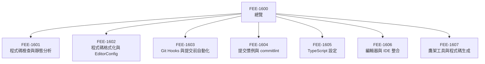

# 開發者體驗與工具總覽

:::info
本分類涵蓋在你撰寫程式碼時運行於本機的工具——
Linter、格式化工具、git hooks、提交訊息驗證器、型別檢查器與鷹架生成器。
這些工具在問題最容易修復的時間點，以漸進方式強制執行品質規範。
:::

## 背景

大多數前端工程團隊在建置工具與 CI 流水線上投入大量資源。
他們挑選打包工具、設定 tree-shaking、調整 chunk 切分，
並花費真實心力確保交付給使用者的產出物正確、快速且經過測試。
這種投資是合理的——建置流水線是進入正式環境前的最後關卡。

然而有另一種同等重要的投資卻往往付之闕如：
在程式碼*撰寫當下*就塑造程式碼品質的工具。
許多團隊把編輯器外掛、Linter 和提交鉤子視為個人偏好——
可選的附加物，由各工程師自行在本機設定（或略過）。
結果可想而知：充滿格式化噪音的 pull request 差異、
因 pre-commit hook 兩秒內就能攔截的 lint 錯誤而失敗的 CI 流水線，
以及提交歷史要麼毫無結構、要麼只靠社群壓力維持的程式碼庫。

開發者體驗（DX）工具就是為了填補這個落差而存在的一類工具。
它們並不把程式碼轉換給瀏覽器使用——那是建置工具的職責。
它們在程式碼*被撰寫與提交的當下*，於抵達共用分支之前，
強制執行工程師之間的品質協議。

經濟學論點很直接。
在編輯器層修復一個問題——一個設定錯誤的匯入、一個缺少的型別標注——
只需一個按鍵和一條工具提示。
同樣的問題若等到 pull request 才發現，代價是一個完整的審查週期。
若等到進入 CI 才發現，代價是一次流水線執行和一次情境切換。
若等到進入正式環境才發現，代價是一場事故。
問題在生命週期中越早被發現，修復代價就越低。
DX 工具將攔截點移到盡可能靠近問題來源的位置。

本分類 FEE-1600 至 FEE-1607 逐層檢視這個生命週期的每個環節：

- **FEE-1601 — 程式碼檢查與靜態分析：** ESLint 及其外掛生態系，
  以及靜態分析如何捕捉格式化工具看不見的正確性問題。
- **FEE-1602 — 程式碼格式化與 EditorConfig：** Prettier 與 EditorConfig——
  如何透過強制性的自動格式化消除風格爭論，以及 EditorConfig 在多編輯器團隊中的貢獻。
- **FEE-1603 — Git Hooks 與提交前自動化：** Husky、lint-staged 與 `.husky/` 目錄——
  hooks 如何只對已暫存的檔案執行品質檢查，以及如何讓它們足夠快速以至於工程師永遠不會停用它們。
- **FEE-1604 — 提交慣例與 commitlint：** Conventional Commits 與 commitlint——
  結構化提交訊息格式如何支援自動化 changelog、語意化版本控制與有意義的 git 歷史。
- **FEE-1605 — TypeScript 設定：** `tsconfig.json` 策略——嚴格模式、
  專案參照、增量編譯，以及 TypeScript 如何融入儲存與推送層。
- **FEE-1606 — 編輯器與 IDE 整合：** Language Server Protocol、延伸套件，
  以及如何在編輯器內部即時呈現 lint 錯誤與型別資訊。
- **FEE-1607 — 鷹架工具與程式碼生成：** Plop、Hygen 與自訂生成器——
  程式碼生成如何在新模組建立的當下消除複製貼上錯誤並強制執行結構慣例。

## 設計思維

### DX 工具是工程關切事項，而非個人偏好

這個領域最常見的失敗模式，是把 DX 工具當作可選基礎設施——
某位資深工程師為自己設定一次、寫進 README，
而新團隊成員可能讀也可能不讀。

這種框架在兩個層面上都是錯誤的。

首先，DX 工具的效益因一致性而倍增。
只有部分工程師執行的 ESLint 設定會產生不一致的 lint 結果——
由跳過設定的工程師修改的檔案會逐漸積累違規，
這些違規只有在其他人事後執行 linter 時才被發現。
部分工程師在儲存時執行 Prettier、其他人忽略的情況，
意味著每個觸及共用檔案的 pull request 都會產生純格式化差異，
掩蓋真正的變更。
只有當團隊中每個人都在每個相關操作中，
針對相同設定執行相同工具時，工具才能消除噪音。

其次，DX 工具將團隊協議編碼化。
當你的 ESLint 設定禁止在 TypeScript 中使用 `any`，這不是風格選擇——
這是一份文件化的聲明，表示本團隊不在未明確說明的情況下脫離型別系統。
當你的 commitlint 設定強制執行 Conventional Commits，這不是格式偏好——
這是一個決策，讓你的發布工具鏈可以讀取提交日誌並推導出 changelog。
這些協議應存在於自動執行的版本控制設定檔中，
而非依賴工程師記憶並手動應用的風格指南。

實際意涵：DX 工具應安裝、設定並版本控制於儲存庫中。
新工程師複製儲存庫並執行標準安裝指令後，
應無需任何額外設定即可啟用所有品質關卡。
這是基準線。

### 與建置工具的邊界（FEE-800）

FEE-800 分類涵蓋將原始碼轉換為瀏覽器可執行資源的流水線：
轉譯、打包、tree-shaking、壓縮。
該流水線在你觸發建置時執行——無論是在本機使用 `pnpm build`
還是在 CI 中自動執行。

DX 工具在更早的、不同維度的時間點執行：在編輯器中、在儲存時、在暫存時、在提交時、在推送時。
兩個分類操作相同的程式碼庫，但服務完全不同的目的。

| 維度 | 建置工具（FEE-800） | DX 工具（FEE-1600） |
|------|-------------------|-------------------|
| **目的** | 為瀏覽器轉換程式碼 | 在撰寫程式碼時強制執行品質 |
| **觸發時機** | `pnpm build`、CI 流水線 | 儲存、暫存、提交、推送 |
| **輸出** | 最佳化靜態資源 | 錯誤報告、格式化檔案、被阻止的提交 |
| **範圍** | 建置時期的整個專案 | 開發時期的已變更檔案 |
| **主要工具** | Vite、Webpack、esbuild、Rollup | ESLint、Prettier、Husky、commitlint |

兩個分類相輔相成。
建置工具確保產出物對使用者是正確的。
DX 工具確保原始碼對工程師是正確的。
投資建置工具卻忽略 DX 工具的專案，會從一個越來越不一致且難以導覽的程式碼庫產出正確的建置。
投資 DX 工具卻忽略建置工具的專案，會有整潔的原始碼樹，
卻仍然無法在目標環境中正確載入。
兩者都是必要的；任何一方都無法取代另一方。

### DX 生命週期的四個層次

開發者體驗工具最好被理解為四個層次，
在開發週期的不同時間點攔截程式碼。
每個層次有不同的修復成本比：越早的層次，每次修復越便宜。

**編輯器層** — 在編輯器內部即時呈現回饋的工具，甚至在檔案儲存之前。
Language Server Protocol（LSP）是這裡的關鍵基礎設施：
`typescript-language-server`、`vscode-eslint` 等延伸套件與語言伺服器通訊，
這些伺服器持續分析程式碼，並在你輸入時即時在行內回報錯誤、警告與程式碼動作。
編輯器層是軟體開發中回饋最快速的環節。
工程師在製造問題的當下就看到問題。

**儲存層** — 工程師儲存檔案時執行的工具。
Prettier 依據專案的風格設定重新格式化檔案。
ESLint 自動修復可修復的部分，並標記其餘問題。
如果設定為在儲存時執行，TypeScript 會對模組進行型別檢查。
這個層次確保檔案在暫存之前始終處於一致的狀態。

**提交層** — 工程師提交已暫存變更時執行的工具。
Husky 啟動 `pre-commit` hook，進而呼叫 lint-staged。
lint-staged 只對已暫存的檔案執行 linter 和格式化工具——
而非整個程式碼庫——這使 hook 保持快速。
提交訊息撰寫完成後，`commit-msg` hook 呼叫 commitlint，
驗證訊息是否符合 Conventional Commits 格式。
這個層次確保沒有格式不正確的程式碼或不規範的提交訊息進入儲存庫。

**推送層** — 工程師推送分支時執行的工具。
`pre-push` hook 對整個專案執行完整的 TypeScript 型別檢查
（不只是已暫存的檔案——一個模組的變更可能破壞另一個模組的型別相容性），
並可選擇性地執行部分測試。
這個層次在程式碼抵達 CI 之前提供最後一道本機品質關卡。

## 視覺呈現

### DX 工具生命週期

以下圖表將開發者工作流程的每個階段對應到在該階段執行的工具。
從左到右，每個關卡在問題抵達下一個階段（修復成本增加）之前捕捉問題。

### 分類地圖

## 分類路線圖

本分類的七篇文章各自聚焦於一個層次或工具關切事項。
可依序閱讀，也可單獨閱讀——每篇文章都是自足的。

- **[FEE-1601 — 程式碼檢查與靜態分析](./1601.md)**
  ESLint 架構、規則設定、外掛生態系（typescript-eslint、eslint-plugin-react），
  以及如何區分正確性規則與風格規則以維持設定的可維護性。

- **[FEE-1602 — 程式碼格式化與 EditorConfig](./1602.md)**
  Prettier 的強制格式化模型、EditorConfig 在跨編輯器空白字元一致性上的作用，
  以及如何設定兩者使其無衝突地協同運作。

- **[FEE-1603 — Git Hooks 與提交前自動化](./1603.md)**
  Git hooks 的運作方式、Husky 的設定模型，以及 lint-staged 的已暫存檔案範圍策略——
  這個組合讓 pre-commit 自動化快速到足以永久保持啟用。

- **[FEE-1604 — 提交慣例與 commitlint](./1604.md)**
  Conventional Commits 規範、commitlint 設定，以及結構化提交格式如何
  支援自動化語意版本控制與 changelog 生成。

- **[FEE-1605 — TypeScript 設定](./1605.md)**
  深入探討 `tsconfig.json`——嚴格模式旗標、專案參照、複合建置，
  以及如何在 DX 生命週期的正確層次定位 TypeScript 檢查。

- **[FEE-1606 — 編輯器與 IDE 整合](./1606.md)**
  Language Server Protocol 基礎知識、VS Code 與 WebStorm 延伸套件設定，
  以及如何在無需另開終端機的情況下，在行內呈現 lint 錯誤與型別診斷。

- **[FEE-1607 — 鷹架工具與程式碼生成](./1607.md)**
  Plop 與 Hygen 作為程式碼生成框架——生成器範本如何在建立新元件、hook 或模組的當下
  強制執行結構慣例，消除複製貼上漂移。

## 相關 FEE

- [FEE-1601：程式碼檢查與靜態分析](./1601.md) —
  ESLint、規則設定與正確性靜態分析
- [FEE-1602：程式碼格式化與 EditorConfig](./1602.md) —
  Prettier 與 EditorConfig，實現一致的程式碼風格
- [FEE-1603：Git Hooks 與提交前自動化](./1603.md) —
  Husky 與 lint-staged：在提交時自動化品質檢查
- [FEE-1604：提交慣例與 commitlint](./1604.md) —
  Conventional Commits 與自動化提交訊息驗證
- [FEE-1605：TypeScript 設定](./1605.md) —
  tsconfig.json 策略與 TypeScript 在 DX 生命週期中的定位
- [FEE-1606：編輯器與 IDE 整合](./1606.md) —
  語言伺服器與編輯器內的即時診斷
- [FEE-1607：鷹架工具與程式碼生成](./1607.md) —
  在建立時強制執行結構慣例的程式碼生成器
- [FEE-800：建置工具與模組系統概觀](../Build%20Tooling%20and%20Module%20Systems/800.md) —
  互補的分類：為瀏覽器轉換程式碼
- [FEE-1100：測試策略概觀](../Testing%20Strategies/1100.md) —
  在 pre-push hook 中作為本機品質關卡執行的測試
- [FEE-1500：CI/CD 與部署概觀](../CI%20CD%20and%20Deployment/1500.md) —
  映射並延伸本機 DX 品質關卡的 CI 流水線
