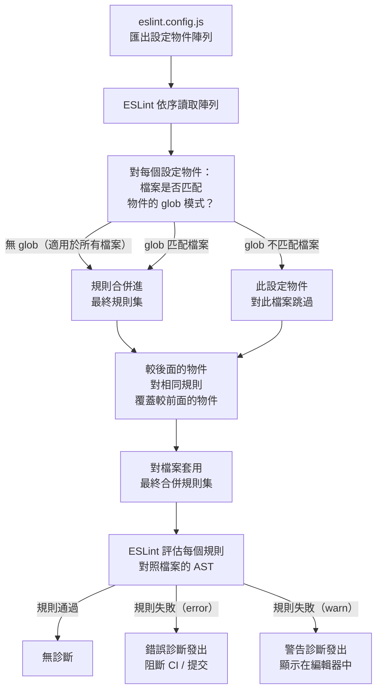

# 程式碼檢查與靜態分析

Linting 就是自動化的程式碼審查。每次你儲存檔案，linter 便會讀取你的程式碼抽象語法樹（AST），並將其與一組規則進行比對——這些規則代表已知為錯誤、危險或與團隊協議不符的模式。違規項目會立即回報，直接顯示在編輯器中，甚至在檔案被暫存（staged）之前就完成。

實際效果是一道永不休眠、永遠不會狀態不佳、也永遠不會遺漏任何檔案的品質關卡。在每次儲存時觸發的 lint 規則，比任何 PR 審查流程都更可靠地捕捉特定類別的錯誤——因為它對每一行程式碼、每一次儲存都執行，而不是只在審查者碰巧看到那段程式碼時，或只在測試恰好覆蓋那個分支時才執行。

靜態分析將這個概念延伸到風格關切之外。TypeScript 型別檢查器和支援型別的 ESLint 規則，會在程式的完整語意模型上運作——它們知道每個變數持有什麼型別、哪些函式可能回傳 `null`，以及一個 `Promise` 是否被 `await`。這些檢查能捕捉純語法解析器看不見、且不了解模組間關係就無法偵測的錯誤。

## 設計思維

### 為什麼 ESLint flat config 取代了 `.eslintrc`

ESLint 的原始設定系統使用「層疊」（cascade）機制：ESLint 會從被 lint 的檔案所在目錄向上遍歷目錄樹，收集途中找到的所有 `.eslintrc.*` 檔案，並將它們合併在一起。這在初期很方便——你可以在子目錄中放一個 `.eslintrc` 檔案，覆蓋該子目錄樹的規則。但層疊機制引入了一類難以擺脫的問題。

第一個問題是隱式行為。對任何給定檔案所套用的規則集，取決於執行 ESLint 的機器的目錄結構。兩位目錄結構不同的工程師，對同一個檔案可能看到不同的 lint 結果。有著不同深度套件的 monorepo 尤其難以推理：對於特定路徑下的檔案，到底哪個套件的 `.eslintrc` 會生效？

第二個問題是外掛載入。在層疊模型中，外掛以名稱字串方式載入（例如 `"plugin:react/recommended"`）。ESLint 使用自己的解析邏輯從 `node_modules` 中解析外掛，這與 Node 的標準模組解析不同。這導致版本衝突，在同一個外掛出現於 `node_modules` 多個深度的 monorepo 中尤為嚴重。

ESLint 的 flat config 在 v9 中正式引入（v8 中作為選用功能），用單一機制解決了這兩個問題：`eslint.config.js` 是一個普通的 JavaScript 模組。它使用明確的 `import` 陳述式載入外掛。沒有目錄遍歷、沒有隱式設定查找、也沒有隱式合併——這個檔案就是匯出一個設定物件陣列，而 ESLint 依序套用它們。陣列中較後面的物件，對於同時匹配兩個物件 glob 模式的檔案會覆蓋較前面的物件。這與 Vite 外掛、Rollup 外掛和所有其他現代 JavaScript 建置工具使用的可組合性模型相同。

明確的匯入模型也讓可分享設定得以作為正規的 npm 套件（匯出設定物件陣列）使用，而不再是觸發特殊解析邏輯的字串。共享設定現在就是一個你匯入並展開（spread）到自己設定中的函式或陣列。

### 為什麼支援型別的規則值得效能代價

ESLint 的基本規則集對單一檔案的語法樹進行操作。它能告訴你一個變數被宣告但從未使用、一個 `switch` 陳述式缺少 `default` 分支，或者在應該使用 `===` 的地方使用了 `==`。但它無法在沒有型別資訊的情況下告訴你，一個函式呼叫是否可能在期望 `string` 的地方接收到 `undefined`，或者一個 `async` 函式的回傳值是否在沒有 `await` 的情況下被丟棄了。

支援型別的規則藉由在評估規則之前，讓每個檔案的 AST 通過 TypeScript 型別檢查器來彌補這個差距。這些規則隨後可以存取每個節點的完整型別——它們知道 `user.name` 是 `string | null`，`fetchUser()` 回傳 `Promise<User>`，以及忘記 `await` 意味著程式碼在操作一個 `Promise` 物件而不是 `User`。

效能代價是真實存在的：型別檢查需要建立 TypeScript 專案中所有檔案的完整依賴圖，這比解析單一檔案要耗時得多。在有數百個模組的大型程式碼庫中，如果設定不當，每次 lint 執行可能增加好幾秒。

正確的設定透過使用 `parserOptions.projectService: true` 來避免這個問題——這是 typescript-eslint v6 引入的現代 API，現在是 v8+ 的推薦方式。`projectService` 建立單一的 TypeScript 語言服務，在所有被 lint 的檔案間共享，而不是對每個檔案獨立重新執行 `tsc`。語言服務快取型別資訊並在規則評估間重用，使效能開銷與專案大小成比例，而不是與被 lint 的檔案數量成比例。

在任何「在抵達正式環境前捕捉遺漏的 `await` 或空指標解除參考，比 lint 時間更有價值」的程式碼庫上，效能代價都是值得的。在大型正式環境程式碼庫上，這個權衡幾乎總是傾向於支援型別的規則。

### `warn` 通常是錯誤的選擇

ESLint 有三種規則嚴重程度：`error`、`warn` 和 `off`。`error` 與 `warn` 之間的區別看似有用：`error` 中止程序，`warn` 是資訊性的。實際上，`warn` 是一個陷阱。

警告以黃色底線出現在編輯器中。開發者很快就會學到黃色底線不會阻礙任何事情——它們是環境噪音。在規則被設為 `warn` 的幾週內，違規就會不受處理地累積。警告不提供品質關卡：它不阻止提交，不讓 CI 失敗（除非你傳遞 `--max-warnings 0`），也不阻止部署。

`warn` 唯一合理的使用情境是在積極遷移期間——你正在將規則從 `off` 移動到 `error`，需要在不立即阻斷 CI 的情況下查看當前違規情況。遷移應該有截止日期。一旦違規被處理，規則就移動到 `error`。如果違規數量太多而無法立即處理，將規則設為 `error` 並在已知違規上使用有針對性的 `eslint-disable` 注解，並在修復每個違規時移除這些注解。

讓開發者學會忽略的警告不提供任何品質關卡。對於絕不能進入正式環境的問題使用 `error`，並使用 `off` 明確停用規則，而不是讓規則在設定中缺席。

### Biome vs ESLint：各自適用的情境

Biome 是一個快速的一體化前端工具，在單一二進位中結合了 linting 和格式化，沒有 JavaScript 執行時的開銷。它比 ESLint 在大型程式碼庫上快得多，因為它是用 Rust 撰寫的，並且並行處理檔案——基準測試經常顯示 Biome 在 ESLint 需要數秒的程式碼庫上，能在毫秒內完成。這不是微幅的改善：在擁有數千個檔案的 monorepo 中，Biome 的吞吐量可以比等效的 ESLint 執行高出幾個數量級。它的規則集涵蓋了最常見的正確性和風格關切，並能很好地整合到優先考慮速度的 CI 流水線中。

Biome 最適合全新（greenfield）專案以及規則需求在其內建覆蓋範圍內的團隊。如果你正在啟動一個沒有遺留外掛依賴的新 TypeScript 專案，Biome 的零設定速度優勢是真實的且值得採用。已將 Biome 格式化工具標準化（取代 Prettier）的團隊，也能從擁有單一工具處理 linting 和格式化中獲益，消除了兩份獨立設定之間的協調開銷。最關鍵的是，Biome 沒有支援型別的規則，也沒有 TypeScript 語言服務整合。像 `no-floating-promises` 和 `await-thenable` 這類透過檢查型別而非語法來捕捉真實錯誤的規則，在 Biome 中無法使用，且在語言服務整合之前都將如此。

當你需要 Biome 未提供的規則時，ESLint 才是正確的選擇。ESLint 外掛生態系是前端工具領域中最廣泛的：`eslint-plugin-react-hooks` 以精確度強制執行 Hooks 規則，需要理解 React 的執行模型；`eslint-plugin-jsx-a11y` 捕捉 JSX 中需要了解 ARIA 語意的無障礙違規；`eslint-plugin-security` 偵測如使用未消毒輸入的 `dangerouslySetInnerHTML` 和 `eval` 使用等模式；`eslint-plugin-unicorn` 強制執行廣泛的現代 JavaScript 慣用法。這些外掛將 Biome 的通用規則集未能複製的領域專業知識編碼化。關鍵在於，如果你的專案需要任何在 Biome 中沒有對應工具的外掛——安全掃描外掛、為你團隊慣例撰寫的內部規則套件，或是第三方函式庫的框架專用外掛——Biome 就無法在那個角色上直接替代 ESLint。

對於大多數前端專案——尤其是使用 React、TypeScript 和有無障礙需求的專案——帶有完善設定外掛集的 ESLint 比 Biome 提供了實質上更多的信號。Biome 適用於 lint 速度是瓶頸，且所需規則集在其覆蓋範圍內的工具密集型 monorepo。兩種工具並非互斥：部分團隊用 Biome 處理格式化和匯入排序，用 ESLint 處理正確性規則。

## 最佳實踐

**必須（MUST）在新專案中使用帶有明確外掛匯入的 `eslint.config.js`。** 舊版 `.eslintrc` 格式自 ESLint 9 起已被棄用。團隊必須（MUST）為原始碼檔案、測試檔案和設定檔案分別定義設定物件，各自有獨立的規則集，使規則範圍明確，並消除目錄遍歷層疊的行為。

**必須（MUST）以 `parserOptions.projectService: true` 啟用支援型別的規則。** 這是 typescript-eslint v8+ 的現代 API，取代了需要手動指定 tsconfig 路徑的舊版 `parserOptions.project`。團隊還必須（MUST）在 `projectService` 旁邊設定 `tsconfigRootDir: import.meta.dirname`，將 tsconfig 搜尋錨定到包含 `eslint.config.js` 的目錄；若沒有這個設定，根據 `eslint` 命令執行的目錄不同，所發現的 tsconfig 可能不同。

**必須（MUST）為 React 和 TypeScript 專案安裝完整的標準外掛集。** 完善的設定包含用於元件規則的 `eslint-plugin-react`、用於強制執行 Hooks 規則的 `eslint-plugin-react-hooks`、用於無障礙覆蓋的 `eslint-plugin-jsx-a11y`、用於捕捉 XSS 和注入模式的 `eslint-plugin-security`，以及用於強制執行現代 JavaScript 慣用法的 `eslint-plugin-unicorn`。團隊禁止（MUST NOT）從這個集合中有選擇地省略外掛——合併覆蓋範圍捕捉的問題多於任何單一外掛能提供的。

**必須（MUST）對阻止發布的規則套用 `error` 嚴重程度，並對明確停用的規則使用 `off`。** 捕捉錯誤的規則——未使用的變數、正式環境建置中的 console 陳述式、明確的 `any`、未處理的 promise——必須（MUST）設為 `error`，而不是 `warn`。團隊禁止（MUST NOT）讓規則在設定中缺席；明確的 `"rule-name": "off"` 是一個文件化的決策，而缺席的規則是模糊的。

**應該（SHOULD）在遷移現有 `.eslintrc` 設定時使用 `FlatCompat`。** `@eslint/eslintrc` 套件提供了一個 `FlatCompat` 工具，可以將舊版設定包裝成 flat config 物件，允許逐步遷移而無需一次全部重寫。團隊應該（SHOULD）逐一將各個外掛和規則遷移到原生 flat config 物件，每完成一個對應的遷移就移除 `compat.extends()` 呼叫。

**必須（MUST）在 CI 中執行 `eslint --max-warnings 0`。** 這個旗標將任何警告視為失敗，防止開發者在本機學會忽略的未處理警告累積。結合 lint-staged 的 pre-commit hook，這建立了兩道強制執行關卡：警告必須（MUST）在提交前被解決，任何漏過的都必須（MUST）在合併前於 CI 被捕捉。

## 視覺呈現

### ESLint Flat Config 解析流程

以下流程圖展示 ESLint 如何使用 flat config 系統處理檔案。關鍵洞察是設定陣列是線性遍歷的——每個物件被檢查是否有 glob 匹配，匹配的物件將其規則貢獻到該檔案的最終規則集中。沒有目錄樹遍歷、沒有父目錄查找、也沒有隱式繼承。



## 範例

以下是 React + TypeScript 專案的完整 `eslint.config.js`。它建立了帶有支援型別規則的基礎設定、涵蓋 hooks、無障礙、安全性和現代慣用法的外掛集，以及針對測試檔案放寬適當規則的獨立設定區塊。

```js
// eslint.config.js
import js from "@eslint/js";
import tseslint from "typescript-eslint";
import reactPlugin from "eslint-plugin-react";
import reactHooksPlugin from "eslint-plugin-react-hooks";
import jsxA11y from "eslint-plugin-jsx-a11y";
import security from "eslint-plugin-security";
import unicorn from "eslint-plugin-unicorn";

export default tseslint.config(
  js.configs.recommended,
  tseslint.configs.recommendedTypeChecked,
  {
    languageOptions: {
      parserOptions: {
        projectService: true,
        tsconfigRootDir: import.meta.dirname, // Node 21.2+; use path.dirname(fileURLToPath(import.meta.url)) on Node 20 LTS
      },
    },
    plugins: {
      react: reactPlugin,
      "react-hooks": reactHooksPlugin,
      "jsx-a11y": jsxA11y,
      security,
      unicorn,
    },
    rules: {
      ...reactPlugin.configs.recommended.rules,
      // eslint-plugin-react-hooks v4 API; v5 uses configs['recommended-latest']
      ...reactHooksPlugin.configs.recommended.rules,
      ...jsxA11y.configs.recommended.rules,
      ...security.configs.recommended.rules,
      "react/react-in-jsx-scope": "off", // React 17+ 不需要
      "react/prop-types": "off",         // TypeScript 處理此問題
      "@typescript-eslint/no-explicit-any": "error",
      "@typescript-eslint/no-floating-promises": "error",
      "no-console": "error",
    },
  },
  {
    // 在測試檔案中放寬規則
    files: ["**/*.test.ts", "**/*.test.tsx", "**/*.spec.ts", "**/*.spec.tsx"],
    rules: {
      "@typescript-eslint/no-explicit-any": "warn",
    },
  },
  {
    ignores: ["dist/**", "node_modules/**", "eslint.config.js"],
  }
);
```

### 此設定的要點

**`tseslint.config()`** 是 typescript-eslint 套件的輔助函式，處理合併設定物件和套用 TypeScript 解析器設定的重複工作。你可以把它作為普通陣列匯出的有型別包裝器使用。

**`...tseslint.configs.recommendedTypeChecked`** 展開推薦的支援型別規則集。這包括 `@typescript-eslint/no-floating-promises` 和 `@typescript-eslint/await-thenable` 等需要型別資訊才能評估的規則。若沒有 `parserOptions.projectService: true`，這些規則將靜默地無操作。

**測試檔案區塊** 將 `@typescript-eslint/no-explicit-any` 放寬為 `warn` 而非 `error`。測試工具經常在 mock 型別和 spy 參數中使用 `any`。在測試中允許它作為警告——而不是錯誤——避免了噪音，同時不完全停用規則。

**`ignores` 區塊** 使用 glob 模式將生成的輸出（`dist/`）、依賴項（`node_modules/`）和 ESLint 設定檔本身排除在 linting 之外。使用支援型別的規則 lint 設定檔需要特殊處理，增加了複雜性而沒有實際效益。

### 在 CI 中執行

```bash
# 將任何警告視為失敗
npx eslint --max-warnings 0 .

# 或者如果 eslint 是本機安裝的
./node_modules/.bin/eslint --max-warnings 0 .
```

### 使用 lint-staged 執行（pre-commit）

```js
// lint-staged.config.js
export default {
  "*.{ts,tsx}": ["eslint --fix --max-warnings 0"],
  "*.{js,jsx}": ["eslint --fix --max-warnings 0"],
};
```

這只對已暫存的檔案執行 ESLint，自動修復可以修復的問題，並在任何無法修復的錯誤仍然存在時讓提交失敗。

### 安裝外掛套件

```bash
npm install --save-dev \
  eslint \
  typescript-eslint \
  @eslint/js \
  eslint-plugin-react \
  eslint-plugin-react-hooks \
  eslint-plugin-jsx-a11y \
  eslint-plugin-security \
  eslint-plugin-unicorn
```

## 常見錯誤

### 添加 `// eslint-disable-next-line` 而非修復問題

每個 `eslint-disable-next-line` 注解都是 lint 覆蓋中的一個漏洞。它抑制的那一行，無論未來程式碼如何變更，都將永遠不被該規則檢查。在本來正確的行上加的規則抑制，若之後引入了實際的違規，將靜默地通過。

對 lint 錯誤的正確回應是：修復底層的程式碼問題，或正確設定規則，使其不在程式碼庫中有意允許的模式上觸發。如果規則在第三方型別或不可避免的模式上觸發，在 `eslint.config.js` 中使用 glob 範圍的規則覆蓋設定有針對性的例外，而不是行級停用注解。

抑制注解屬於兩種情況：帶有文件化原因的臨時抑制（`// eslint-disable-next-line no-console -- 除錯日誌，發布前移除`），以及無法透過 `ignores` 排除的生成程式碼中的已知誤報。其他所有的抑制注解都是延遲的技術債。

### 啟用支援型別的規則而未設定 `parserOptions.projectService`

如果你將 `tseslint.configs.recommendedTypeChecked` 展開到設定中，但省略了 `parserOptions.projectService: true`，typescript-eslint 將嘗試在沒有型別資訊的情況下執行支援型別的規則。結果取決於版本：在某些版本中，規則靜默地跳過評估（沒有錯誤、沒有警告、沒有信號）；在其他版本中，ESLint 報告設定錯誤並中止。

靜默跳過的行為是更危險的結果：你的 CI 通過，你的編輯器沒有顯示錯誤，你相信支援型別的規則是啟用的——但它們實際上什麼都沒有捕捉到。例如，`@typescript-eslint/no-floating-promises` 規則將報告零個違規，即使你的程式碼庫中充滿了未 await 的 promise。

始終透過暫時引入已知的違規（`const p = Promise.resolve(); p;`）並確認 ESLint 報告了它，來驗證支援型別的規則確實在執行。如果沒有，支援型別的規則設定有誤。

## 相關 FEE

- [FEE-1600：開發者體驗與工具總覽](./1600.md) — 分類背景：linting 所融入的四層 DX 生命週期
- [FEE-1602：程式碼格式化與 EditorConfig](./1602.md) — ESLint 處理邏輯規則；Prettier 處理格式化。兩種工具不應重疊。
- [FEE-1603：Git Hooks 與提交前自動化](./1603.md) — lint-staged 在每次提交前對已暫存的檔案執行 ESLint
- [FEE-1605：TypeScript 設定](./1605.md) — 支援型別的 linting 用來建立型別圖的 `tsconfig.json`
- [FEE-1203：跨網站指令碼（XSS）防護](../Security/1203.md) — `eslint-plugin-security` 在 lint 時捕捉 `dangerouslySetInnerHTML` 模式和其他注入向量
- [FEE-1000：無障礙設計概觀](../Accessibility/1000.md) — `eslint-plugin-jsx-a11y` 在 lint 時強制執行無障礙規則，早於手動測試或稽核

## 參考資料

- [ESLint flat config 文件](https://eslint.org/docs/latest/use/configure/configuration-files)
- [ESLint flat config 遷移指南](https://eslint.org/docs/latest/use/configure/migration-guide)
- [typescript-eslint：快速入門](https://typescript-eslint.io/getting-started/)
- [typescript-eslint：`projectService` parserOptions](https://typescript-eslint.io/packages/parser/#projectservice)
- [typescript-eslint：支援型別的 linting](https://typescript-eslint.io/getting-started/typed-linting/)
- [eslint-plugin-react-hooks](https://www.npmjs.com/package/eslint-plugin-react-hooks)
- [eslint-plugin-jsx-a11y](https://github.com/jsx-eslint/eslint-plugin-jsx-a11y)
- [eslint-plugin-security](https://github.com/eslint-community/eslint-plugin-security)
- [eslint-plugin-unicorn](https://github.com/sindresorhus/eslint-plugin-unicorn)
- [Biome 文件](https://biomejs.dev/linter/)
