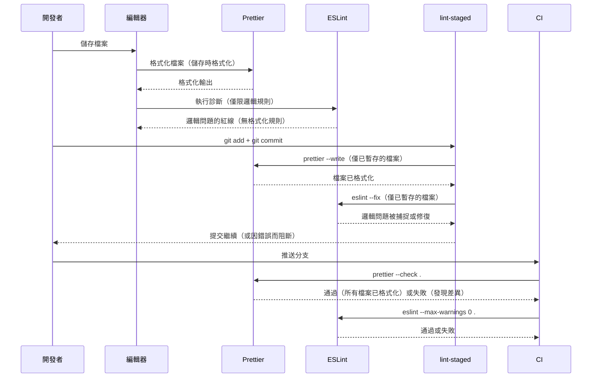

# 程式碼格式化與 EditorConfig

每位開發者都對格式化有自己的看法。Tab 還是空格。分號還是不加。單引號還是雙引號。尾隨逗號。每行長度。這些看法根深蒂固，但對程式碼的正確性毫無影響。格式化風格的爭論不是技術問題——而是協作問題。格式化工具透過將這個決定完全從人的考量中移除來解決它。

當格式化工具是程式碼樣貌的權威時，格式化就不再是個人品味的問題。工具說了算。程式庫中的每個檔案看起來都如同工具輸出的那樣。Pull request 的 diff 只會顯示邏輯變更——而不是空白調整、引號正規化或尾隨逗號的新增。程式碼審查變得更快、更準確，因為審查者不需要在噪音中尋找真正的變更。

本文涵蓋一個設定完善的前端專案所使用的三層自動格式化：EditorConfig 提供跨編輯器的基準一致性，Prettier 提供具有主觀意見的語言感知格式化，以及 Prettier 與 ESLint 之間的整合——防止兩個工具相互衝突。

## 設計思維

### 為什麼 Prettier 的主觀設計是一種功能，而非限制

大多數開發者工具都提供設定選項。選項越多，彈性越大——這是傳統認知。Prettier 顛覆了這一點：它刻意具有主觀意見，只提供少量選項，並抵制新增更多。Prettier 團隊審查選項提案並拒絕其中的絕大多數。

這不是限制，而是核心價值主張。

當格式化工具有很多選項時，團隊必須做出很多決策。每個決策都成為潛在的分歧來源——一個爭論的溫床。採用可設定格式化工具的團隊並未消除格式化爭論；只是將其轉移了。與其在 pull request 中爭論如何格式化程式碼，團隊會爭論如何設定格式化工具。爭論仍然存在，只是換了場合。

Prettier 的小型選項集意味著爭論空間很小。團隊實際上需要做出的決策——每行長度、分號、引號風格、尾隨逗號——只需要幾行設定。一旦這些決策被做出並提交，就算完成了。格式化工具自動、一致地執行它們，無需進一步討論。開發者停止思考格式化，開始思考邏輯。

Prettier 輸出的一致性也帶來了複合效益：使輸出可預測。閱讀任何 Prettier 格式化檔案的開發者都知道會看到什麼。沒有因作者、檔案年齡或哪個編輯器生成的差異。程式庫在視覺上是同質的。這種同質性在閱讀不熟悉的程式碼時減少了認知負荷。

### 為什麼需要 `eslint-config-prettier`

ESLint 和 Prettier 有重疊之處。兩個工具都對格式化有意見：ESLint 有關於縮排大小、引號風格、分號、間距和其他數十個格式化問題的規則。Prettier 對這些都有自己的輸出。當兩個工具在同一個檔案上執行時，它們可能——也確實會——發生衝突。

這個衝突不是理論上的。如果不加以干預，ESLint 會將 Prettier 正確格式化的程式碼標記為 lint 錯誤。運行 `prettier --write` 後再運行 `eslint --fix` 的開發者可能會發現兩個工具在互相對抗：Prettier 套用其格式，ESLint 重寫它，Prettier 不同意 ESLint 的輸出。結果是不確定性的格式化——每個工具的輸出取決於哪個最後執行。

`eslint-config-prettier` 透過停用所有處理格式化的 ESLint 規則來解決衝突。它不新增新規則；只是關閉 Prettier 所取代的規則。安裝並放在 ESLint 設定的最後，ESLint 只處理正確性和邏輯——未使用的變數、未 await 的 promise、無障礙違規、型別錯誤。Prettier 處理所有格式化。兩個工具不再重疊。

放置要求是嚴格的：`eslint-config-prettier` 必須（MUST）是 ESLint 設定陣列中的最後一個項目。任何在它之後重新啟用格式化規則的設定物件都會重新引入衝突。常見的錯誤是將它放在陣列的前面，然後讓外掛設定覆蓋它。

`eslint-plugin-prettier` 是另一種做法，它將 Prettier 作為規則在 ESLint 內部執行，將格式化差異報告為 lint 錯誤。這種做法速度較慢（Prettier 作為 ESLint 規則在每個檔案上執行，而不是作為單獨的流程），產生令人困惑的錯誤訊息（格式化差異以 lint 錯誤而非差異的形式報告），並模糊了格式化與正確性之間的界線。Prettier 團隊不推薦它。請使用 `eslint-config-prettier` 代替。

### Biome 作為 Prettier 的替代方案

Biome 是一個基於 Rust 的前端工具鏈，在單一二進位中結合了格式化和 linting。它的格式化器在大多數情況下與 Prettier 相容，在典型格式化基準測試中通常快 15–35 倍，差距隨 repository 規模擴大而增加。對於大型程式庫，這個差異是實際的：Prettier 可能需要幾秒鐘來格式化所有檔案；Biome 在一秒內完成。

速度優勢在 CI 和 pre-commit hook 中最為重要，每秒的開銷在每天數百次提交中累積。已採用 Biome 進行格式化的團隊報告說，速度提升使格式化檢查感覺是即時的，這鼓勵了合規而非繞過。

代價是生態系統的成熟度。Prettier 有一個完善的外掛生態系統，支援 JavaScript 和 TypeScript 以外的語言——GraphQL、Markdown、CSS、YAML、HTML。Biome 的語言覆蓋率在增長，但更窄。Biome 也不支援社群撰寫的 Prettier 外掛，這使它無法用於具有特殊格式化需求的專案（模板語言、DSL、由 Prettier 外掛處理的自定義檔案類型）。

對於只格式化 JavaScript、TypeScript、JSON 和 CSS 的專案，Biome 的覆蓋是完整的，其速度優勢是真實的。對於有更廣泛格式化需求的專案——特別是使用 Prettier 外掛處理 GraphQL schema、Markdown 散文格式化或 YAML 設定檔案的專案——Prettier 仍然是更完整的選擇。

Biome 和 ESLint 並非互斥。有些團隊使用 Biome 進行格式化，使用 ESLint 進行 linting，在同一個流水線中執行這兩個工具。這讓他們在不犧牲 ESLint 的外掛生態系統來進行正確性規則的情況下，獲得 Biome 的格式化速度。

### EditorConfig 在工具棧中的角色

EditorConfig 在所有語言感知工具的下面一層運作。它不是格式化工具，也不理解語法。它將簡單的檔案層級設定——縮排風格、縮排大小、行結尾、字元編碼——傳達給任何讀取 `.editorconfig` 檔案的編輯器。每個主要編輯器都原生支援或透過外掛支援 EditorConfig：VS Code、JetBrains IDE、Vim、Neovim、Emacs、Sublime Text 等。

EditorConfig 的目的是防止在任何格式化工具運行之前就出現的不一致性。Windows 開發者的編輯器預設 CRLF 行結尾，會將帶有 Windows 行結尾的檔案提交到期望 LF 的程式庫中。縮排預設為 Tab 的開發者開啟使用空格的檔案後，如果編輯器自動轉換縮排，就會提交混合縮排的檔案。這些問題對作者來說是不可見的——編輯器只是按照預設值運作——但它們會產生嘈雜的 diff，並在對行結尾敏感的 shell 腳本、Docker 檔案和其他工具中造成問題。

EditorConfig 透過在程式碼編寫之前建立基準來解決這個問題。編輯器在開啟檔案時讀取 `.editorconfig` 並立即套用設定：新檔案使用正確的行結尾，縮排使用正確的風格，且檔案以正確的編碼儲存。無需後處理。

責任的實際分工是：

- **EditorConfig**：縮排風格、縮排大小、行結尾、字元集、尾隨空白、最終換行——適用於每種檔案類型、在任何工具運行之前的設定。
- **Prettier**：語言感知的格式化——分號、引號風格、括號間距、尾隨逗號、每行長度、函式呼叫格式化——需要理解語言語法的設定。
- **ESLint**：邏輯和正確性規則——未使用的變數、型別錯誤、無障礙違規、安全模式。

三層不重疊。每層處理只有它才能處理的問題。

## 最佳實踐

**應該（SHOULD）從 Prettier 的預設值開始，只新增有真正團隊共識的選項。** Prettier 的內建預設值——80 字元每行、雙引號、分號、所有位置的尾隨逗號——經過精心選擇，許多團隊無需修改即可接受。每個新增到 `prettier.config.js` 的選項都是一個必須維護且可能在環境間出現差異的決策；團隊應該（SHOULD）只在某個特定預設值明顯不適合專案時才新增選項。

**必須（MUST）將 `eslint-config-prettier` 作為 ESLint 設定陣列的最後一個項目安裝。** 這個套件會停用所有與 Prettier 衝突的 ESLint 格式化規則，使 Prettier 成為程式碼外觀的唯一權威。團隊禁止（MUST NOT）使用 `eslint-plugin-prettier`，它將 Prettier 作為 lint 規則在 ESLint 內部執行，速度較慢、產生較難閱讀的輸出，並以 Prettier 和 ESLint 團隊都不建議的方式將格式化與正確性混為一談。

**必須（MUST）在 CI 中測試之前執行 `prettier --check`。** `--check` 旗標使 Prettier 在任何檔案因格式化而改變時以非零代碼退出，使其成為關卡而非自動修復。團隊應該（SHOULD）在大型程式庫上新增 `--cache` 旗標，它透過跳過自上次執行以來內容哈希未更改的檔案，將格式化檢查時間從幾秒縮短到毫秒。

**必須（MUST）同時使用編輯器中的儲存時格式化和透過 lint-staged 的提交時格式化。** 儲存時格式化在開發者儲存檔案時提供立即回饋；格式化輸出在緩衝區寫入磁碟之前就被套用。提交時格式化透過 lint-staged 只對已暫存的檔案執行 Prettier，捕捉從未透過儲存時格式化編輯器儲存的檔案。這兩種機制針對不同的失敗模式，必須（MUST）同時啟用。

**必須（MUST）在每個專案提交 `.editorconfig` 檔案。** 最低需要的設定包含 `indent_style = space`、`indent_size = 2`、`end_of_line = lf`、`charset = utf-8`、`trim_trailing_whitespace = true` 和 `insert_final_newline = true`。`end_of_line = lf` 設定在跨平台團隊中最為關鍵：它指示編輯器無論 OS 預設值如何都使用 LF，在行結尾污染到達程式庫之前就防止它。`[*.md]` 區段必須（MUST）將 `trim_trailing_whitespace` 覆蓋為 `false`，因為 Markdown 使用尾隨空格來實現硬換行。

## 視覺呈現

### 格式化工作流程：從儲存到提交

以下循序圖展示格式化如何在開發工作流程的每個階段套用。關鍵洞察是每個階段都是獨立的——儲存時格式化提供立即回饋，lint-staged 提供提交時安全網，CI 提供合併時關卡。任何階段的失敗都在到達下一階段之前被捕捉到。



## 範例

### 安裝

```bash
npm install --save-dev prettier eslint-config-prettier

# 可選：用於提交前格式化的 lint-staged
npm install --save-dev lint-staged
```

### prettier.config.js

```js
// prettier.config.js
/** @type {import("prettier").Config} */
export default {
  printWidth: 100,
  singleQuote: true,
  trailingComma: "all",
  semi: true,
};
```

這是 TypeScript + React 專案的代表性設定。如果你的團隊對 Prettier 的預設值感到滿意，完全省略此檔案。此處列出的任何選項都必須（MUST）反映團隊共識。

### eslint.config.js（Prettier 整合）

```js
// eslint.config.js（相關摘錄——在其他設定之後新增）
import eslintConfigPrettier from "eslint-config-prettier";

export default tseslint.config(
  // ... 其他設定 ...
  eslintConfigPrettier, // 必須放最後——停用格式化規則
);
```

`eslint-config-prettier` 停用來自精選熱門外掛清單中的格式化相關規則——包括 @typescript-eslint、eslint-plugin-react 及其他外掛——並定期更新以涵蓋新的外掛。

### .editorconfig

```ini
# .editorconfig
root = true

[*]
indent_style = space
indent_size = 2
end_of_line = lf
charset = utf-8
trim_trailing_whitespace = true
insert_final_newline = true

[*.md]
trim_trailing_whitespace = false
```

`root = true` 聲明阻止 EditorConfig 在父目錄中尋找更多 `.editorconfig` 檔案。始終在程式庫的頂層檔案中包含這個聲明。

### lint-staged 整合

```js
// lint-staged.config.js
export default {
  // 格式化所有支援的檔案類型
  "*.{js,jsx,ts,tsx,json,css,scss,md,yaml,yml}": ["prettier --write"],
  // 格式化後在 JS/TS 檔案上執行 ESLint
  "*.{js,jsx,ts,tsx}": ["eslint --fix --max-warnings 0"],
};
```

順序很重要：Prettier 先執行（格式化），ESLint 後執行（邏輯）。在未格式化的程式碼上執行 ESLint 是安全的，但輸出可讀性較差；在 ESLint 之後執行 Prettier 會覆蓋 ESLint 套用的任何格式化，所以 Prettier 先執行。

### VS Code 工作區設定（儲存時格式化）

```json
// .vscode/settings.json
{
  "editor.formatOnSave": true,
  "editor.defaultFormatter": "esbenp.prettier-vscode",
  "[markdown]": {
    "editor.defaultFormatter": "esbenp.prettier-vscode"
  }
}
```

將 `.vscode/settings.json` 提交到程式庫，確保團隊中所有 VS Code 使用者都啟用了以 Prettier 作為格式化工具的儲存時格式化，無需每位開發者手動設定。

### 使用 Biome 作為格式化工具

```json
// biome.json
{
  "$schema": "https://biomejs.dev/schemas/1.9.4/schema.json",
  "formatter": {
    "enabled": true,
    "indentStyle": "space",
    "indentWidth": 2,
    "lineWidth": 100
  },
  "javascript": {
    "formatter": {
      "quoteStyle": "single",
      "trailingCommas": "all",
      "semicolons": "always"
    }
  }
}
```

```bash
# CI 用 Biome 檢查
biome ci .

# 在本機格式化所有檔案
biome format --write .
```

使用 Biome 作為格式化工具時，無論如何都要安裝 `eslint-config-prettier`——Biome 不能替代 ESLint，ESLint 的格式化規則仍然需要被停用。

## 常見錯誤

### 沒有提交 Prettier 設定

如果 `prettier.config.js` 沒有提交到程式庫——如果它在 `.gitignore` 中或根本沒有被新增——那麼不同的開發者可能使用不同的選項執行 Prettier。在家目錄中有全域 Prettier 設定的開發者會使用那些選項格式化。沒有全域設定的開發者會使用預設值格式化。CI 會使用預設值執行。結果是一個格式化因貢獻者和環境而異的程式庫。

解決方案是始終提交 `prettier.config.js`。如果你打算使用預設值，提交一個空設定或帶有明確注解說明預設值是有意為之的設定。該檔案的存在表明格式化決策是經過深思熟慮的。

### 在 Windows 上忽略 `.editorconfig` 檔案

在 Windows 上，Git 可能設定了 `core.autocrlf = true`，這會在 checkout 時將 LF 行結尾轉換為 CRLF，並在 commit 時轉換回 LF。這個設定與期望全程使用 LF 的程式庫共存困難。開發者可能永遠不會在編輯器中看到 CRLF——Git 靜默地轉換——但中間狀態（Git stash、補丁、某些工具）可能會暴露 CRLF 檔案。更重要的是，如果一個檔案不知怎麼地逃過了轉換（二進位模式、特定的 Git 設定、Windows 上的 CI 執行器），CRLF 檔案就會進入程式庫。

EditorConfig 的 `end_of_line = lf` 指示編輯器以 LF 儲存檔案，從一開始就防止 CRLF 被寫入。這在 Git 的 autocrlf 轉換之前運作，比單獨依賴 Git 更可靠。

始終提交 `.editorconfig`。始終為所有文字檔案設定 `end_of_line = lf`。對於必須在某些檔案中支援 Windows 原生行結尾的程式庫，為那些檔案類型新增明確的覆蓋。

## 相關 FEE

- [FEE-1600：開發者體驗與工具總覽](./1600.md) — 分類背景：格式化所融入的四層 DX 生命週期
- [FEE-1601：程式碼檢查與靜態分析](./1601.md) — ESLint 處理邏輯規則；Prettier 處理格式化。`eslint-config-prettier` 防止重疊。
- [FEE-1603：Git Hooks 與提交前自動化](./1603.md) — lint-staged 執行 `prettier --write` 以在每次提交前重新格式化已暫存的檔案
- [FEE-1606：編輯器與 IDE 整合](./1606.md) — VS Code 和 JetBrains 的 `editor.formatOnSave` 和 `editor.defaultFormatter` 設定

## 參考資料

- [Prettier 文件](https://prettier.io/docs/en/)
- [Prettier：為什麼使用 Prettier？](https://prettier.io/docs/en/why-prettier.html)
- [Prettier：設定](https://prettier.io/docs/en/configuration.html)
- [eslint-config-prettier README](https://github.com/prettier/eslint-config-prettier)
- [EditorConfig 規範](https://editorconfig.org/)
- [Biome 格式化器文件](https://biomejs.dev/formatter/)
- [Biome vs Prettier：遷移指南](https://biomejs.dev/guides/migrate-eslint-prettier/)
