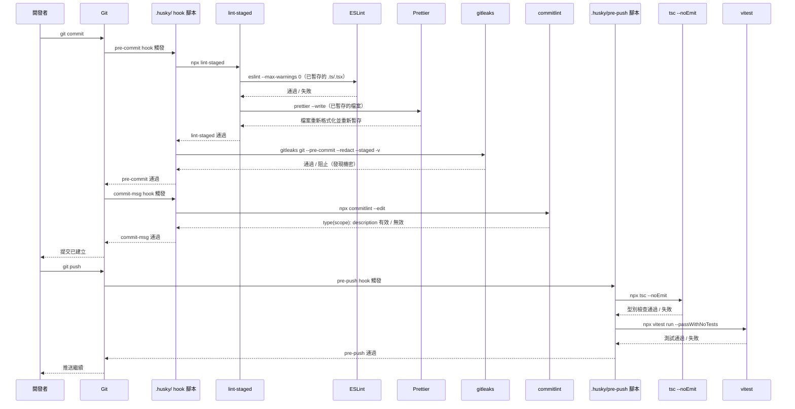

# [FEE-1603] Git Hooks 與提交前自動化

:::info
Git hooks 會在提交工作流程的固定時間點執行腳本：在建立提交物件之前、在寫入提交訊息之後、在推送送達遠端之前。在提交當下就被攔截的 lint 錯誤，修正成本只是改一行；同樣的錯誤如果在 pull request 審查時才被發現，就要多花一輪審查循環。Husky、lint-staged、commitlint 和 gitleaks 是把檢查掛接到這些時間點的常見組合之一，但並非唯一選擇：lefthook、Python 的 `pre-commit` 框架，以及直接使用 `core.hooksPath`，都用不同方式解決相同的分發問題。本文涵蓋三個依延遲分級的 hook 階段、以 husky 為核心的組合細節，以及這些替代方案各自適合的場景。
:::

## 背景

Git 自最早的版本就支援 hooks：放進 `.git/hooks/` 目錄的 shell 腳本，會在提交、推送等生命週期事件時觸發。真正的難題在於分發。`.git/hooks/` 本身不受 Git 追蹤，因此一位開發者寫的 hook，若沒有手動複製或另外寫一套安裝腳本，就無法傳到程式庫的其他複本。Node 工具鏈從 2010 年代中期開始填補這個缺口：在 `npm install` 時把腳本寫入 `.git/hooks/` 的 npm 套件陸續出現，最終由 Husky 在大多數 JavaScript 與 TypeScript 專案中勝出。

Husky 本身只解決分發問題。它把 `core.hooksPath` 指向一個自動產生的轉接目錄（`.husky/_`），該目錄中的轉接腳本會執行 `.husky/` 底下受版本控制追蹤的腳本，於是 hook 腳本就能隨著程式庫一起流通。至於 hook 腳本要執行什麼、要多快，Husky 並不負責決定；這是本文涵蓋的其他工具的工作：lint-staged 把檢查範圍縮小到實際已暫存的檔案，commitlint 驗證提交訊息格式，gitleaks 則掃描已暫存的內容尋找機密模式。

Husky 並非解決分發問題的唯一方式，選擇工具時應該權衡以下替代方案：

- **lefthook** 是單一的 Go 執行檔，不依賴 Node 執行環境。它同時取代 husky 和 lint-staged：其 YAML 設定宣告檔案 glob，並能平行執行符合條件的命令，因此不需要另外設定已暫存檔案的工具。團隊選擇它，是為了縮短每次 hook 的啟動時間，並在 husky 假設的純 Node 環境不適用的多語言程式庫中執行檢查。
- **simple-git-hooks** 是 husky 的精簡替代方案：在 `package.json` 中用一小段設定安裝 hooks，本身不內建已暫存檔案的執行工具，這部分仍需搭配 lint-staged。
- **Python 的 `pre-commit` 框架**（pre-commit.com）將 hooks 管理為在 `.pre-commit-config.yaml` 中宣告的、有版本號、與語言無關的外掛。它常見於混合 Python/JS 的程式庫，需要用單一 hook 管理器同時執行兩個生態系的檢查。
- **直接使用 `core.hooksPath`** 正是 husky 底層的做法：執行 `git config core.hooksPath .githooks`，再搭配一個受版本控制追蹤的 `.githooks/` 目錄。這種方式零依賴，但 husky 額外提供的一切（透過 lint-staged 過濾已暫存檔案、跨平台轉接層、`HUSKY=0` 逃生閥）都得由團隊自己動手寫。

本文其餘部分以 husky + lint-staged + commitlint + gitleaks 的組合作為實作範例。除非另有說明，「最佳實踐」和「設計思維」章節所描述的指引均針對 husky 這套組合。

## 視覺對比

### Git Hook 自動化序列

以下循序圖展示從 `git commit` 到 `git push` 的完整流程。Git 只會觸發一次 `pre-commit` hook；`.husky/pre-commit` 腳本內部依序呼叫 lint-staged 和 gitleaks，兩者都在這一次呼叫中執行。任何階段失敗都會阻止操作，並將控制權交還給開發者進行修復。



## 範例

### 安裝

```bash
npm install --save-dev husky lint-staged
npx husky init
```

`npx husky init` 建立帶有範例命令的 `.husky/pre-commit`，並更新 `package.json` 以在 scripts 中加入 `"prepare": "husky"`。執行後，將範例內容替換為實際的 hook 命令。

也安裝 commitlint 和 gitleaks：

```bash
# commitlint
npm install --save-dev @commitlint/cli @commitlint/config-conventional

# gitleaks（macOS）
brew install gitleaks
# gitleaks（Linux：從 https://github.com/gitleaks/gitleaks/releases 下載二進位檔）
```

### package.json（相關區段）

```json
{
  "scripts": {
    "prepare": "husky"
  },
  "lint-staged": {
    "*.{ts,tsx}": [
      "eslint --max-warnings 0",
      "prettier --write"
    ],
    "*.{js,jsx,cjs,mjs}": [
      "eslint --max-warnings 0",
      "prettier --write"
    ],
    "*.{css,json,md,yaml}": [
      "prettier --write"
    ]
  }
}
```

### .husky/pre-commit

```sh
#!/bin/sh
npx lint-staged
gitleaks git --pre-commit --redact --staged -v
```

`gitleaks` 命令在 lint-staged 之後執行。husky 是以 `sh -e` 執行 hook 腳本，因此只要有一個命令失敗，腳本就會立即中止：如果 lint-staged 失敗，gitleaks 就不會執行。（若不透過 husky，例如直接使用 `core.hooksPath`，就需要自行加上 `set -e` 或用 `&&` 串接命令；否則 shell 仍會依序執行兩個命令，最終結束狀態取決於最後一個命令。）如果 lint-staged 通過，gitleaks 才會掃描已暫存的內容尋找機密。兩者都必須通過，提交才能繼續。

### .husky/commit-msg

```sh
#!/bin/sh
npx --no -- commitlint --edit "$1"
```

`$1` 引數是包含提交訊息的臨時檔案路徑。`--edit` 告訴 commitlint 從該檔案讀取。`npx` 的 `--no` 旗標可防止 npx 在未找到 commitlint 時嘗試安裝它；它會直接以明確的錯誤訊息失敗，而不是靜默安裝。

### .husky/pre-push

```sh
#!/bin/sh
npx tsc --noEmit
npx vitest run --passWithNoTests
```

`tsc --noEmit` 執行完整的 TypeScript 型別檢查，不產生輸出檔案，用於驗證推送前整個專案都能通過型別檢查。vitest 的 `--passWithNoTests` 旗標確保 hook 在尚無測試的專案或分支上不會失敗；它會以提示訊息通過，而不是失敗。

### commitlint.config.js

```js
// commitlint.config.js  (requires "type": "module" in package.json)
// For CommonJS projects, use commitlint.config.cjs with module.exports instead
export default {
  extends: ["@commitlint/config-conventional"],
};
```

```js
// commitlint.config.cjs  (for CommonJS projects without "type": "module")
module.exports = {
  extends: ["@commitlint/config-conventional"],
};
```

`@commitlint/config-conventional` 強制執行 Conventional Commits 格式：`type(scope): description`。有效的類型包括 `feat`、`fix`、`docs`、`style`、`refactor`、`test`、`chore` 及其他。scope 是可選的。description 是必需的，必須以小寫字母開頭。

有效提交訊息範例：
- `feat(auth): add OAuth2 login flow`
- `fix(api): handle null response from user endpoint`
- `docs: update README with local development steps`
- `chore(deps): upgrade vitest to 2.0`

無效提交訊息範例（commitlint 會拒絕這些）：
- `fixed a bug`：沒有類型前綴
- `Fix: update styling`：類型大寫，不符合慣例
- `feat: Added the new dashboard component`：description 以大寫字母開頭

### .gitleaks.toml（允許清單範例）

```toml
[[allowlists]]
  description = "Project allowlist"
  regexes = [
    # 測試 fixtures 中用來示範的 JWT，並非真正的機密
    'eyJhbGciOiJIUzI1NiIsInR5cCI6IkpXVCJ9\.eyJzdWIiOiJ0ZXN0In0\.[A-Za-z0-9_-]+',
  ]
  paths = [
    # 忽略 test fixtures 目錄中的所有檔案
    '''tests/fixtures/.*''',
  ]
```

將此檔案加入程式庫根目錄，gitleaks 會自動讀取它。`[[allowlists]]` 這種表格陣列（array-of-tables）格式，在 gitleaks 8.25.0（2025 年 4 月）取代了舊有的 `[allowlist]` 全域表格；舊格式仍可透過相容層解析，但新專案應該使用 `[[allowlists]]`。沒有允許清單的話，含有範例 token 的 test fixtures 和帶有佔位金鑰的文件範例都會觸發誤報，導致開發者反射性地加上 `--no-verify`。

## 最佳實踐

以下的「必須」規則適用於本文所描述的 husky + lint-staged + commitlint + gitleaks 組合。使用 lefthook 或 Python `pre-commit` 框架的團隊，應將相同的延遲與暫存原則，轉換到該工具自己的設定格式中。

**必須（MUST）在 `package.json` 的 scripts 中新增 `"prepare": "husky"`，以便 hook 自動安裝。** 這個腳本會在 `npm install`、`pnpm install` 和 `bun install` 時執行，讓每位貢獻者在第一次安裝後就啟用 hook，不需要任何手動步驟。Yarn 2+（Berry）是例外：它完全不會執行 `prepare` 生命週期腳本。Yarn 專案需要改用 `"postinstall": "husky"`，並搭配 `pinst`（`"prepack": "pinst --disable"`、`"postpack": "pinst --enable"`），以避免這個 postinstall 步驟在 `npm publish` 時也被觸發（husky 文件，How To）。CI 環境必須（MUST）設定 `HUSKY=0`，在自動化執行期間跳過 hook 安裝。

**必須（MUST）配置 lint-staged 在已暫存的檔案上先執行 ESLint 再執行 Prettier。** Lint-staged 必須（MUST）以 `eslint --max-warnings 0` 作為 TypeScript 和 JavaScript 模式的第一個命令，後接 `prettier --write`；ESLint 先執行以捕捉錯誤，然後 Prettier 重新格式化並由 lint-staged 重新暫存結果，使提交包含格式化版本。沒有 `--max-warnings 0`，ESLint 在有警告時以零退出，hook 靜默通過，允許被警告的違規累積。

**必須（MUST）將每個工具分配到正確的 hook 階段。** `pre-commit` 階段必須（MUST）只對已暫存的檔案執行 lint-staged 和機密掃描。`commit-msg` 階段必須（MUST）只執行 commitlint。`pre-push` 階段必須（MUST）執行 `tsc --noEmit` 和單元測試，因為這兩者需要整個專案的脈絡，`pre-commit` 沒有餘裕負擔。將型別檢查移到 `pre-commit` 會讓 hook 太慢；將機密掃描移到 `pre-push` 則會讓機密在被偵測到之前就進入本地提交歷史。

**必須（MUST）使用 `gitleaks git --pre-commit --redact --staged -v` 將 gitleaks 加入 `pre-commit` hook。** 這個命令只掃描已暫存的差異，而非整個程式庫歷史，因此能維持在 pre-commit 的延遲預算內。較舊的 `gitleaks protect --staged` 形式雖然仍可執行，但自 gitleaks 8.19.0（2024 年 9 月）起已被棄用；新專案應改用 `git` 子命令。團隊必須（MUST）提交一份 `.gitleaks.toml` 設定檔，列出符合 gitleaks 規則但並非真正機密的允許清單項目；沒有允許清單，誤報會讓開發者轉而使用 `--no-verify`。團隊也必須（MUST）在 CI 中另外加入 gitleaks 步驟，作為 pre-commit hook 的補充，而非取代。

**應該（SHOULD）記錄 `--no-verify` 的明確繞過政策並透過程式碼審查文化執行。** 未共享個人分支上的進行中提交和活躍事件期間的緊急熱修復是唯一可接受的繞過情境，兩者都應該（SHOULD）產生後續票據。因 hook 太慢而繞過是 hook 配置需要優化的信號，而非繞過是適當的；因規則不便而繞過應該（SHOULD）透過修正 ESLint 配置中的規則或修復違規來解決。

## 設計思維

### 三個 hook 階段及各階段應放什麼

Git 提供許多種 hook，但對前端品質自動化來說，普遍相關的只有三種：`pre-commit`、`commit-msg` 和 `pre-push`。每一種都有不同的延遲預算，預算越緊，適合放進去的檢查範圍就越窄。以下列出的具體秒數是本文自訂的校準值，並非業界規範；團隊應依自己的檔案數量和 CI 容量調整。

**`pre-commit`** 在開發者輸入 `git commit` 之後、提交物件建立之前執行，此時開發者正坐在終端機前等待。本文將 5 秒內視為目標，超過 10 秒視為問題：一旦超過這個門檻，開發者就會養成習慣性加上 `--no-verify` 的習慣，該檢查便完全停止發揮作用。一項檢查要放進 `pre-commit`，必須同時符合兩個條件：只針對已暫存的檔案執行且能在幾秒內完成，並且失敗時開發者能在鍵盤前立即修好，例如 lint 或格式化規則。需要整個專案脈絡的檢查（完整測試套件、完整的 `tsc` 檢查）無論本身多有價值，都應該放到 `pre-push` 或 CI，而不是 `pre-commit`。

讓 `pre-commit` 保持快速的關鍵在於 lint-staged。沒有它，一個簡單的 `pre-commit` hook 會對整個程式碼庫執行 ESLint，包括這次提交完全沒碰過的檔案，成本因此隨總檔案數而非變更規模增加。有了 lint-staged，ESLint 只會在這次提交所暫存的檔案上執行，成本因此隨提交規模而非程式庫規模增加。

**`commit-msg`** 在開發者寫完提交訊息之後、提交建立之前執行，接收的是包含該訊息的臨時檔案路徑。commitlint 是一個短暫執行的 Node 行程，並非瞬間完成的檢查：它透過 cosmiconfig 解析設定，再用 `conventional-commits-parser` 解析訊息，實務上其耗時主要來自 Node 的啟動成本，而非解析本身。這個階段驗證提交訊息是否符合團隊慣例（Conventional Commits 格式：`type(scope): description`）。格式不正確的提交訊息會在進入日誌前被拒絕；開發者看到錯誤、修改訊息，然後重新提交。

**`pre-push`** 在開發者輸入 `git push` 之後、推送送達遠端之前執行。開發者即將分享自己的工作成果，因此可以接受較長的等待：本文將最多 60 秒視為合理範圍，因為推送的頻率遠低於提交。這個階段適合執行型別檢查（`tsc --noEmit`）和單元測試（`vitest run --passWithNoTests`）。這些檢查需要整個專案的脈絡，而非僅是已暫存的檔案，這正是它們不適合放進 `pre-commit` 的原因。

### 為什麼 lint-staged 不是可選的

`pre-commit` hook 的簡單實作會在整個工作目錄執行工具：

```sh
# 簡單方式，不要這樣做
npm run lint
npm run format:check
```

這種做法的成本隨程式庫規模增加，而非隨變更增加。開發者修正一則註解裡的錯字，只暫存了一個檔案，卻觸發對專案中每一個檔案的 lint 檢查；在大型程式庫中，等待時間會隨總檔案數增加，而與實際變更的內容無關。

lint-staged 把範圍限縮在提交實際觸及的內容，藉此解決這個問題。它讀取 Git 索引、找出已暫存的檔案，只對這些檔案套用設定好的工具命令，並在任何工具（例如 Prettier）修改了檔案後重新暫存。成本因此隨提交規模而非程式庫規模增加。

lint-staged 的重新暫存步驟有一個值得事先知道的副作用，以免它讓人措手不及。lint-staged 會把原始狀態備份到一個 git stash，對於部分暫存的檔案，還會在任務執行期間先隱藏未暫存的變更片段，事後再還原。這種情況在部分暫存的檔案上最明顯，也就是典型的 `git add -p` 情境，這時被隱藏的正是那些未暫存的片段。如果某個工具在執行過程中當機，看起來可能像是 lint-staged 把進行中的工作吃掉了，但其實沒有，那份 stash 仍然存在。執行 `git stash list` 就能找到並復原它。

### 為什麼完整測試套件不屬於 pre-commit

這個邏輯很直覺：「我們希望確保程式碼在提交前測試都通過，所以要在 `pre-commit` 中執行測試。」但實際執行的效果卻與目標背道而馳。

假設某專案完整的單元測試套件需要 45 秒，這對一個有幾百個測試檔案的中型前端專案來說是合理的數字。如果每次提交前都要跑一遍，開發者修正一個錯字也得等 45 秒，等待的測試內容其實與那個錯字毫無關係。在進行中的重構期間，一小時內出現 10 個進行中的提交是常態，累積下來就是 7.5 分鐘，全部花在等待一個開發者早就預期會通過的測試結果上。

開發者會適應這種成本，但適應的方向沒有人樂見：提交頻率降低、每次提交塞進更多變更，也失去了讓 `git bisect` 和還原操作有用的細粒度歷史。要不然，他們會找到 `--no-verify` 並開始在每次提交都使用它，這時測試檢查就完全發揮不了保護作用。

測試應該放在 `pre-push`，在那裡每次推送只執行一次，而不是每次提交都執行一次。推送代表要跟團隊分享程式碼，因此付出與這個代價相稱的等待是合理的。本地提交只是個人的檢查點，同樣的等待在這裡並不相稱。

### 機密掃描作為第一線防禦

機密（API 金鑰、私鑰、JWT 簽章密鑰、含有憑證的資料庫連線字串、雲端服務商 token）通常在兩種常見情境下進入 git 歷史。第一種是意外暫存：開發者把 `.env` 檔案或憑證檔案加進了提交。第二種是內嵌硬編碼：開發者為了快速測試，把 API 金鑰直接寫在設定檔裡，原本打算提交前刪除，結果忘記了。

一旦機密進入 git 歷史，要移除就很困難。`git filter-branch` 和 `git filter-repo` 可以重寫歷史，把某個特定字串從每一次提交中剔除，但這個重寫動作會影響引入點之後的每一次提交，並讓所有現有的複本參照失效。如果分支在重寫之前就已經被推送過，任何持有重寫前歷史複本的人，手上仍然有那個機密。一旦機密到達已推送的分支，唯一可靠的補救方式是輪替它：撤銷舊的憑證、產生新的，而不是試圖從歷史中清除它。

gitleaks 在提交階段就攔截這個問題，此時它根本還沒變成歷史問題。`gitleaks git --pre-commit --redact --staged -v` 會掃描已暫存的內容（即將被提交的變更，而非整個程式庫），比對已知的機密模式：AWS 存取金鑰、GitHub token、通用高熵字串、私鑰標頭，以及數百種其他模式。一旦發現相符項目，提交就會被阻擋，開發者能看到是哪個檔案、哪個模式觸發了偵測。較舊的 `gitleaks protect --staged` 形式雖然仍可執行，但自 2024 年 9 月發布的 gitleaks 8.19.0 起已被棄用；新專案應該使用上面展示的 `git` 子命令。

把本地 hook 稱作最後防線，其實高估了它：任何 hook 都能用 `--no-verify` 繞過，開發者只要略過它，就完全不會被掃描。真正的最後防線，也就是開發者無法選擇跳過的那一層，是在伺服器端。GitHub 的 secret scanning push protection 在偵測到已知的機密模式時，會直接擋下該次推送，並且從 2024 年 3 月起，已預設在個人帳號擁有的新公開程式庫上啟用。GitLab 對應的功能是 secret push protection（Ultimate 方案），自 GitLab 17.5 起正式可用。本地的 gitleaks hook 更適合理解為第一線檢查：它在錯誤最早、最容易修正的時候就攔下問題，但真正無法被跳過的是 push protection。

這些機制都不能取代一開始就不把機密寫進程式碼的做法。正確的做法是使用環境變數或機密管理系統（Vault、AWS Secrets Manager、1Password Secrets Automation），永遠不把機密寫進原始檔案。gitleaks 和 push protection 都只是在這項原則被意外違反時的安全網。

### Husky v9 配置模型

Husky v9（2024 年發布）相較於早期版本簡化了設定模型。v4 透過 `.huskyrc` 物件設定 hooks；v5 到 v8 改用純 shell 腳本，外加手動執行 `husky install` 的步驟；v9 保留了 shell 腳本，並把整個設定流程收斂成單一的 `npx husky init` 命令。`npx husky init` 會建立 `.husky/` 目錄，以及一個範例 `pre-commit` hook。

`package.json` 中的 `"prepare": "husky"` 腳本會執行 Husky 的安裝程序，把 `core.hooksPath` 指向自動產生的轉接目錄（`.husky/_`），該目錄中的轉接腳本會執行 `.husky/` 底下受版本控制追蹤的腳本。npm、pnpm 和 bun 都會在安裝時自動執行 `prepare`，因此每位複製程式庫並安裝相依套件的開發者都能取得 hooks，不需要任何額外步驟。Yarn 2+（Berry）完全不會執行 `prepare`；Yarn 的特殊設定方式請參見「最佳實踐」。

在不應執行 hooks 的 CI 環境中（CI 有自己的檢查，在那裡再執行 hooks 是多餘的），將 `HUSKY=0` 設為環境變數。Husky v9 會遵守這個設定並跳過 hook 安裝。

```yaml
# .github/workflows/ci.yml (relevant snippet)
env:
  HUSKY: "0"   # disable Husky hooks in CI - CI has its own quality gates
```

Hook 是為了本地開發時的即時回饋；CI pipeline 有自己的 lint、型別檢查和測試步驟，才是最終權威的品質關卡。

`.husky/` 中的 shell 腳本是標準 POSIX shell。它們透過位置參數接收 Git 的 hook 引數（`commit-msg` 中的 `$1` 是提交訊息檔案，等等）。它們以非零值退出以阻止 hook 操作，或以零值退出以允許它。

## 常見錯誤

### 將 git hooks 視為 CI 的替代品

Hooks 可以被繞過。任何開發者都能用 `git commit --no-verify` 略過 hook，而在截止期限的壓力下，總有人終究會這麼做。

CI 無法用同樣的方式繞過：只要分支保護規則設定正確，CI 檢查失敗的 pull request 就無法合併。CI 是權威的關卡；hooks 只是提前攔截問題的便利手段，讓問題在到達 CI 之前就被發現。

正確的心智模型是：hooks 把品質檢查左移，降低摩擦、加快回饋循環；CI 則執行團隊已經同意的品質標準。

### 不提交 hook 腳本

Husky v9 把 hook 腳本存放在 `.husky/` 中。這些檔案必須（MUST）提交到程式庫：它們就是 hook 的定義，沒有它們，`npx husky` 雖然安裝了 hook 機制，卻沒有實際可執行的檢查。

一個常見的遺漏是錯誤地將 `.husky/` 加入 `.gitignore`（將其視為生成的目錄）。確認 `.husky/pre-commit`、`.husky/commit-msg` 和 `.husky/pre-push` 都被 Git 追蹤。

### 在終端機中通過，卻在 GUI 用戶端失敗

有一種常見的 husky 失敗案例，其實完全不是設定錯誤，重要到 husky 的文件特地為它設計了一套啟動檔機制：一個在終端機中執行順暢的 hook，在 VS Code 的原始碼控制面板、Sourcetree 或 Tower 這類 GUI Git 用戶端中，卻出現 `command not found: node`（或 `npx`）的錯誤。nvm、fnm、asdf、volta 這類 Node 版本管理工具，是在只有互動式 shell 才會執行的 shell 啟動檔中設定 `PATH`。GUI 用戶端啟動 Git 時並不會載入這些啟動檔，因此執行 hook 的 shell 完全找不到 `node`。

Husky 的解法是 `~/.config/husky/init.sh`，husky 在執行每個 hook 之前都會先載入這個檔案。把版本管理工具的初始化指令複製進這個檔案（以 nvm 為例：`export NVM_DIR="$HOME/.nvm"; [ -s "$NVM_DIR/nvm.sh" ] && . "$NVM_DIR/nvm.sh"`），就能讓從 GUI 啟動的 hook 也拿到同樣的 `PATH`，而不只是終端機。如果 hook 在命令列上執行沒問題，卻有同事回報在編輯器的提交按鈕上失敗，這個檔案就是第一個該檢查的地方。

## 延伸閱讀

- [FEE-1600 開發者體驗與工具總覽](./1600.md)。分類脈絡：Git hooks 運作於 DX 生命週期中的提交層。
- [FEE-1601 程式碼檢查與靜態分析](./1601.md)。ESLint 就是 lint-staged 在 pre-commit hook 中執行的工具。
- [FEE-1602 程式碼格式化與 EditorConfig](./1602.md)。Prettier 透過 lint-staged 在 pre-commit hook 中執行，重新格式化已暫存的檔案。
- [FEE-1604 提交慣例與 commitlint](./1604.md)。commitlint 在 commit-msg hook 中執行，驗證訊息格式。
- [FEE-1205 軟體供應鏈安全](../Security/1205.md)。gitleaks 機密掃描在 pre-commit 中執行，作為敏感值進入 git 歷史前的第一線檢查。
- [FEE-1101 使用 Vitest 與 Jest 進行單元測試](../Testing%20Strategies/1101.md)。vitest 在 pre-push hook 中執行，在程式碼到達共享分支之前驗證正確性。

## 參考資料

- typicode, "Husky," Husky Docs (2026). https://typicode.github.io/husky/
- typicode, "How To," Husky Docs (2026). https://typicode.github.io/husky/how-to.html
- lint-staged maintainers, "lint-staged README," GitHub (2026). https://github.com/lint-staged/lint-staged
- lint-staged maintainers, "v16.0.0 Release Notes," GitHub Releases (2025). https://github.com/lint-staged/lint-staged/releases/tag/v16.0.0
- gitleaks maintainers, "gitleaks," GitHub (2026). https://github.com/gitleaks/gitleaks
- gitleaks maintainers, "v8.19.0 Release Notes: Deprecate detect and protect, add git, dir, stdin," GitHub Releases (2024). https://github.com/gitleaks/gitleaks/releases/tag/v8.19.0
- commitlint maintainers, "commitlint," commitlint Docs (2026). https://commitlint.js.org/
- Conventional Commits, "Conventional Commits Specification," conventionalcommits.org (2026). https://www.conventionalcommits.org/
- Git, "githooks," Git Documentation (2026). https://git-scm.com/docs/githooks
- GitHub, "Secret scanning and push protection are enabled by default on new public repositories," GitHub Changelog (2024). https://github.blog/changelog/2024-03-11-secret-scanning-and-push-protection-are-enabled-by-default-on-new-public-repositories/
- Gazar, "Lefthook vs Husky: Why I Switched and Never Looked Back," gazar.dev (2026). https://gazar.dev/devops/lefthook-vs-husky-git-hooks
