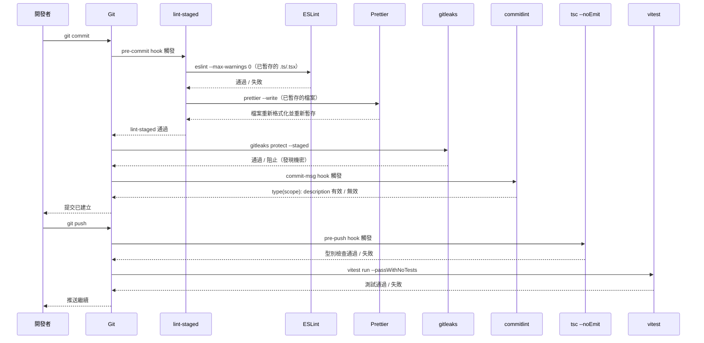

# Git Hooks 與提交前自動化

發現缺陷最便宜的地方，是在它進入版本控制之前。一個 linter 在提交時就能標記出的錯誤，修復成本為零——開發者改一行程式碼，繼續前進。同樣的錯誤在 pull request 審查中發現，代價是審查時間、一輪審查循環、一串留言討論，以及第二次審閱。在生產環境中發現，代價是事件響應、回滾，以及事後復盤。缺陷的代價隨著與源頭的距離而上升。Git hooks 將這個距離壓縮至零。

Git hooks 是在工作流程特定時間點由 Git 呼叫的可執行腳本——在提交物件建立之前、在提交訊息寫入之後、在推送送達遠端之前。它們不是開發者記得才會執行的可選品質關卡；它們是強制性的關卡，會自動執行，不需要開發者的紀律或記憶。配置一次，就在每位團隊成員的每次相關 Git 操作上執行。

Husky（hook 管理）、lint-staged（選擇性檔案處理）、commitlint（提交訊息驗證）和 gitleaks（機密掃描）的組合，形成了一個完整的品質層，完全在程式碼離開本機之前運作。這一層不是 CI 的替代品——而是補充，將例行的品質檢查左移到編寫程式碼的當下。

## 設計思維

### 三個 hook 階段及各階段應放什麼

Git 提供了許多 hook 類型，但三個對前端品質自動化普遍相關：`pre-commit`、`commit-msg` 和 `pre-push`。每個都有不同的延遲預算，以及適合在其中的不同工作範圍。

**`pre-commit`** 在開發者輸入 `git commit` 後、提交物件建立前執行。開發者正坐在終端前等待。這個階段的預算很嚴格：5 秒內是理想的，10 秒內是可接受的，超過 10 秒就是問題。每次提交前等待 30 秒的開發者會找到 `--no-verify` 並習慣性地使用它，此時 hook 根本無法提供任何保護。

`pre-commit` 適合的內容：對已暫存的檔案進行 lint 和格式化檢查。不是完整的測試套件。不是對整個專案的型別檢查。不是執行整合測試。這些檢查耗時太長。判斷什麼屬於 `pre-commit` 的正確性測試是：「如果這個檢查需要兩秒，我們會加入它嗎？」如果不會，它就不屬於這裡。

lint-staged 是讓 `pre-commit` 保持快速的關鍵使能技術。沒有 lint-staged，一個簡單的 `pre-commit` hook 會在整個程式碼庫上執行 ESLint——每個檔案，包括未被修改的檔案。在大型程式庫中，這需要 30 秒或更長時間。有了 lint-staged，ESLint 只在當前提交的已暫存檔案上執行——通常是 1–5 個檔案。檢查在一秒內完成。hook 足夠快，開發者從不考慮繞過它。

**`commit-msg`** 在開發者寫完提交訊息後、提交建立前執行。它接收包含訊息的臨時檔案路徑。這裡的預算基本上是零——commitlint 讀取一個檔案並執行正則表達式，在 100 毫秒內完成。這個階段驗證提交訊息是否符合團隊的慣例（Conventional Commits 格式：`type(scope): description`）。訊息格式不正確的提交在進入日誌之前就被拒絕；開發者看到錯誤，編輯訊息，然後重新提交。

**`pre-push`** 在開發者輸入 `git push` 後、推送送達遠端前執行。開發者即將分享他們的工作；較長的等待在這裡是可以接受的。30–60 秒的檢查是合理的，因為推送比提交頻率低。這個階段適合型別檢查（`tsc --noEmit`）和單元測試執行（`vitest run --passWithNoTests`）。這些檢查對 `pre-commit` 來說太慢，但對在程式碼到達共享程式庫之前執行來說足夠重要。

### 為什麼 lint-staged 不是可選的

`pre-commit` hook 的簡單實作會在整個工作目錄執行工具：

```sh
# 簡單方式——不要這樣做
npm run lint
npm run format:check
```

這種方式有根本性的效能問題。在有 500 個 TypeScript 檔案的程式庫中，ESLint 處理 500 個檔案。修復注解中的錯字的開發者暫存了一個檔案，卻觸發了對全部 500 個的 ESLint。hook 變成每次提交的 30 秒稅，無論修改了什麼。

lint-staged 用一個精確的觀察解決了這個問題：提交只影響已暫存的檔案。提交的品質檢查只需要在那些檔案上執行。lint-staged 讀取 Git 索引，識別已暫存的檔案，只對那些檔案套用配置的工具命令，如果任何工具（如 Prettier）修改了它們，就重新暫存它們。結果：有 500 個 TypeScript 檔案的程式庫對這次提交中暫存的 3 個檔案執行 ESLint。檢查在一秒內完成。

lint-staged 也正確地處理了重新暫存步驟。當 Prettier 重寫一個已暫存的檔案時，重寫的內容需要在索引中以供提交——不僅僅在工作目錄中。lint-staged 在每個工具執行後自動重新暫存修改的檔案。沒有這個，即使 Prettier 成功執行，開發者也會提交未格式化版本的檔案。

### 為什麼在 pre-commit 中執行完整測試套件是最常見的 hook 錯誤配置

邏輯很直觀：「我們希望在提交程式碼之前確保測試通過，所以我們在 `pre-commit` 中執行測試。」執行方式卻適得其反。

完整的單元測試套件在典型的前端專案中需要 20–120 秒。在每次提交前執行它意味著：

- 開發者進行小幅文件修改：等待 45 秒。
- 開發者修復工具函式中的錯字：等待 45 秒。
- 開發者在重構期間建立 10 個進行中的提交：等待 7.5 分鐘的測試輸出。

開發者學到了提交是昂貴的。他們減少提交頻率。他們在每次提交中批次更多變更。當出錯時，進行中的狀態更難恢復。Git 歷史變得粒度更低，用處更少。或者——更可能的是——開發者發現了 `--no-verify` 並對所有提交使用它，此時測試檢查根本無法提供任何保護。

測試屬於 `pre-push`，在那裡它們每次推送執行一次而不是每次提交。開發者即將與團隊分享程式碼；額外的 60 秒與後果（將失敗的測試推送到共享分支）是相稱的。在提交階段，開發者正在進行本地檢查點；45 秒與那個後果不相稱。

### 機密掃描作為最後防線

機密——API 金鑰、私鑰、JWT 簽名機密、含有憑證的資料庫連接字串、雲端提供商 token——在兩種常見情境下進入 git 歷史。第一種是意外暫存：開發者將 `.env` 檔案或憑證檔案加入提交。第二種是行內嵌入：開發者將 API 金鑰硬編碼到配置檔案中以快速測試某些功能，打算在提交之前刪除，但忘記了。

一旦機密進入 git 歷史，刪除就很困難。`git filter-branch` 和 `git filter-repo` 可以重寫歷史以從每個提交中刪除特定字串，但這會重寫引入點之後的每個提交，使所有現有的克隆引用失效。如果分支在重寫之前已被推送，任何擁有重寫前歷史克隆的人仍然擁有那個機密。在推送後機密進入分支後，唯一可靠的補救措施是輪換機密（撤銷舊的，生成新的）——而不是嘗試從歷史中刪除它。

gitleaks 在提交階段解決這個問題。`gitleaks protect --staged` 掃描已暫存的內容——不是整個程式庫歷史，只是即將提交的變更——以尋找已知的機密模式：AWS 存取金鑰、GitHub token、通用高熵字串、私鑰標頭，以及數百種其他模式。如果它發現匹配，提交就被阻止，開發者看到哪個檔案和哪個模式觸發了偵測。開發者在機密進入版本控制之前將其刪除。

這不能替代不在程式碼中嵌入機密的做法。正確的做法是使用環境變數或機密管理系統（Vault、AWS Secrets Manager、1Password Secrets Automation），永遠不要將機密寫入原始檔案。gitleaks 是正確做法意外被違反時的安全網。

### Husky v9 配置模型

Husky v9（2024 年發布）相較於早期版本簡化了配置模型。沒有 `.huskyrc` 檔案，沒有複雜的配置物件，也沒有單獨的安裝步驟。Hook 腳本作為純 shell 腳本存放在 `.husky/` 中。`npx husky init` 命令建立 `.husky/` 目錄和一個範例 `pre-commit` hook。

`package.json` 中的 `"prepare": "husky"` 腳本執行 Husky 的安裝程序，將 `.husky/` 目錄註冊為 Git 的 hook 路徑。這在 `npm install`、`yarn install` 或 `pnpm install` 時自動執行，確保每個克隆程式庫並安裝依賴的開發者都能獲得 hooks，無需任何額外步驟。

在不應執行 hooks 的 CI 環境中（在 CI 中執行 hooks 是多餘的——CI 有自己的檢查），將 `HUSKY=0` 設為環境變數。Husky v9 尊重這個設定並跳過 hook 安裝。

```yaml
# .github/workflows/ci.yml (relevant snippet)
env:
  HUSKY: "0"   # disable Husky hooks in CI — CI has its own quality gates
```

將 `HUSKY=0` 設為 CI 的環境變數，即可跳過 hook 安裝。Hook 是為了本地開發的即時回饋；CI pipeline 有自己的 lint、型別檢查和測試步驟，才是最終的品質關卡。

`.husky/` 中的 shell 腳本是標準 POSIX shell。它們透過位置參數接收 Git 的 hook 引數（`commit-msg` 中的 `$1` 是提交訊息檔案，等等）。它們以非零值退出以阻止 hook 操作，或以零值退出以允許它。

## 最佳實踐

**必須（MUST）在 `package.json` 的 scripts 中新增 `"prepare": "husky"` 以便 hook 自動安裝。** 這個腳本在每次 `npm install`、`yarn install` 和 `pnpm install` 時執行，確保每位貢獻者在首次安裝後無需任何手動步驟就能啟用 hook。對於 pnpm v8+ 專案，團隊還必須（MUST）在 `.npmrc` 中新增 `enable-pre-post-scripts=true` 以恢復自動執行 `prepare`，或在入職指南中記錄必要的 `pnpm prepare` 步驟。CI 環境必須（MUST）設定 `HUSKY=0` 以在自動化執行期間跳過 hook 安裝。

**必須（MUST）配置 lint-staged 在已暫存的檔案上先執行 ESLint 再執行 Prettier。** Lint-staged 必須（MUST）以 `eslint --max-warnings 0` 作為 TypeScript 和 JavaScript 模式的第一個命令，後接 `prettier --write`；ESLint 先執行以捕捉錯誤，然後 Prettier 重新格式化並由 lint-staged 重新暫存結果，使提交包含格式化版本。沒有 `--max-warnings 0`，ESLint 在有警告時以零退出，hook 靜默通過，允許被警告的違規累積。

**必須（MUST）將每個工具分配到正確的 hook 階段。** `pre-commit` 階段必須（MUST）只執行 lint-staged 和機密掃描，目標總計五秒以內。`commit-msg` 階段必須（MUST）只執行 commitlint，目標一秒以內。`pre-push` 階段必須（MUST）執行 `tsc --noEmit` 和單元測試，目標六十秒以內。將型別檢查移到 `pre-commit` 會使 hook 太慢；將機密掃描移到 `pre-push` 允許機密在被偵測之前進入本地提交歷史。

**必須（MUST）使用 `gitleaks protect --staged` 將 gitleaks 新增到 `pre-commit` hook。** 這個命令只掃描已暫存的差異而非整個程式庫，使其符合 pre-commit 的延遲預算。團隊必須（MUST）提交帶有誤報允許清單項目的 `.gitleaks.toml` 配置檔案；沒有允許清單，誤報會導致開發者使用 `--no-verify`。團隊還必須（MUST）在 CI 中新增 gitleaks 作為獨立步驟，而非 pre-commit hook 的替代。

**應該（SHOULD）記錄 `--no-verify` 的明確繞過政策並透過程式碼審查文化執行。** 未共享個人分支上的進行中提交和活躍事件期間的緊急熱修復是唯一可接受的繞過情境，兩者都應該（SHOULD）產生後續票據。因 hook 太慢而繞過是 hook 配置需要優化的信號，而非繞過是適當的；因規則不便而繞過應該（SHOULD）透過修正 ESLint 配置中的規則或修復違規來解決。

## 視覺呈現

### Git Hook 自動化序列

以下循序圖展示從 `git commit` 到 `git push` 的完整流程，包括三個 hook 階段和各階段執行的檢查。任何階段的失敗都會阻止操作，並將控制權返回給開發者進行補救。



## 範例

### 安裝

```bash
npm install --save-dev husky lint-staged
npx husky init
```

`npx husky init` 建立帶有範例命令的 `.husky/pre-commit`，並更新 `package.json` 以在 scripts 中加入 `"prepare": "husky"`。執行後，將範例內容替換為實際的 hook 命令。

也安裝 commitlint 和 gitleaks：

```bash
# commitlint
npm install --save-dev @commitlint/cli @commitlint/config-conventional

# gitleaks（macOS）
brew install gitleaks
# gitleaks（Linux——從 https://github.com/gitleaks/gitleaks/releases 下載二進位檔）
```

### package.json（相關區段）

```json
{
  "scripts": {
    "prepare": "husky"
  },
  "lint-staged": {
    "*.{ts,tsx}": [
      "eslint --max-warnings 0",
      "prettier --write"
    ],
    "*.{js,jsx,cjs,mjs}": [
      "eslint --max-warnings 0",
      "prettier --write"
    ],
    "*.{css,json,md,yaml}": [
      "prettier --write"
    ]
  }
}
```

### .husky/pre-commit

```sh
#!/bin/sh
npx lint-staged
gitleaks protect --staged -v
```

`gitleaks` 命令在 lint-staged 之後執行。如果 lint-staged 失敗（lint 錯誤或格式問題），hook 提前退出，gitleaks 不執行。如果 lint-staged 通過，gitleaks 掃描已暫存的內容以尋找機密。兩者都必須通過，提交才能繼續。

### .husky/commit-msg

```sh
#!/bin/sh
npx --no -- commitlint --edit "$1"
```

`$1` 引數是包含提交訊息的臨時檔案路徑。`--edit` 告訴 commitlint 從該檔案讀取。`npx` 的 `--no` 旗標防止 npx 在未找到 commitlint 時嘗試安裝它——它會以明確的錯誤失敗，而不是靜默安裝。

### .husky/pre-push

```sh
#!/bin/sh
npx tsc --noEmit
npx vitest run --passWithNoTests
```

`tsc --noEmit` 執行完整的 TypeScript 型別檢查，不生成輸出檔案。它驗證整個專案在推送之前型別檢查正確。vitest 中的 `--passWithNoTests` 確保 hook 在尚無測試的專案或分支上不會失敗——它以提示通過，而不是失敗。

### commitlint.config.js

```js
// commitlint.config.js  (requires "type": "module" in package.json)
// For CommonJS projects, use commitlint.config.cjs with module.exports instead
export default {
  extends: ["@commitlint/config-conventional"],
};
```

```js
// commitlint.config.cjs  (for CommonJS projects without "type": "module")
module.exports = {
  extends: ["@commitlint/config-conventional"],
};
```

`@commitlint/config-conventional` 強制執行 Conventional Commits 格式：`type(scope): description`。有效的類型包括 `feat`、`fix`、`docs`、`style`、`refactor`、`test`、`chore` 及其他。scope 是可選的。description 是必需的，必須以小寫字母開頭。

有效提交訊息範例：
- `feat(auth): add OAuth2 login flow`
- `fix(api): handle null response from user endpoint`
- `docs: update README with local development steps`
- `chore(deps): upgrade vitest to 2.0`

無效提交訊息範例（commitlint 會拒絕這些）：
- `fixed a bug` — 沒有類型前綴
- `Fix: update styling` — 類型大寫，不符合慣例
- `feat: Added the new dashboard component` — description 以大寫字母開頭

### .gitleaks.toml（允許清單範例）

```toml
[allowlist]
  description = "專案允許清單"
  regexes = [
    # 測試固定裝置中使用的範例 JWT——不是真正的機密
    'eyJhbGciOiJIUzI1NiIsInR5cCI6IkpXVCJ9\\.eyJzdWIiOiJ0ZXN0In0\\.[A-Za-z0-9_-]+',
  ]
  paths = [
    # 忽略測試固定裝置目錄中的所有檔案
    '''tests/fixtures/.*''',
  ]
```

將此檔案加入程式庫根目錄。gitleaks 會自動讀取它。沒有允許清單，包含範例 token 的測試固定裝置和帶有佔位金鑰的文件範例將觸發誤報，導致開發者反射性地加入 `--no-verify`。

## 常見錯誤

### 將 git hooks 視為 CI 的替代品

Hooks 可以被繞過。`git commit --no-verify` 對任何開發者始終可用。時間緊迫的開發者會使用它。不理解 hook 為何失敗的開發者會使用它。Node 環境損壞的開發者會使用它。

CI 無法被繞過。如果分支保護規則配置正確，CI 檢查失敗的 pull request 無法合併。CI 是權威的關卡；hooks 是一種便利，更早捕捉問題，在它們到達 CI 之前。

正確的心智模型：hooks 將品質檢查左移，減少摩擦並加快回饋循環。CI 執行團隊已達成共識的品質標準。兩者都是必要的；任何一個都不能替代另一個。

### 不提交 hook 腳本

Husky v9 將 hook 腳本儲存在 `.husky/` 中。這些檔案必須（MUST）提交到程式庫。它們是 hook 定義——沒有它們，`npx husky` 安裝了 hook 機制，但沒有實際要執行的檢查。

一個常見的遺漏是錯誤地將 `.husky/` 加入 `.gitignore`（將其視為生成的目錄）。確認 `.husky/pre-commit`、`.husky/commit-msg` 和 `.husky/pre-push` 都被 Git 追蹤。

## 相關 FEE

- [FEE-1600：開發者體驗與工具總覽](./1600.md) — 分類背景：Git hooks 在 DX 生命週期的提交層運作
- [FEE-1601：程式碼檢查與靜態分析](./1601.md) — ESLint 是 lint-staged 在 pre-commit hook 內執行的工具
- [FEE-1602：程式碼格式化與 EditorConfig](./1602.md) — Prettier 透過 lint-staged 在 pre-commit hook 中執行以重新格式化已暫存的檔案
- [FEE-1604：提交慣例與 commitlint](./1604.md) — commitlint 在 commit-msg hook 中執行以驗證訊息格式
- [FEE-1205：軟體供應鏈安全](../Security/1205.md) — gitleaks 機密掃描在 pre-commit 中執行，作為敏感值進入 git 歷史前的最後防線
- [FEE-1101：使用 Vitest 與 Jest 進行單元測試](../Testing%20Strategies/1101.md) — vitest 在 pre-push hook 中執行，以在程式碼到達共享分支之前驗證正確性

## 參考資料

- [Husky 文件](https://typicode.github.io/husky/)
- [lint-staged README](https://github.com/lint-staged/lint-staged)
- [gitleaks 文件](https://github.com/gitleaks/gitleaks)
- [commitlint 文件](https://commitlint.js.org/)
- [Conventional Commits 規範](https://www.conventionalcommits.org/)
- [Git hooks 文件](https://git-scm.com/docs/githooks)
